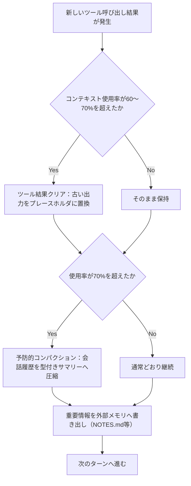
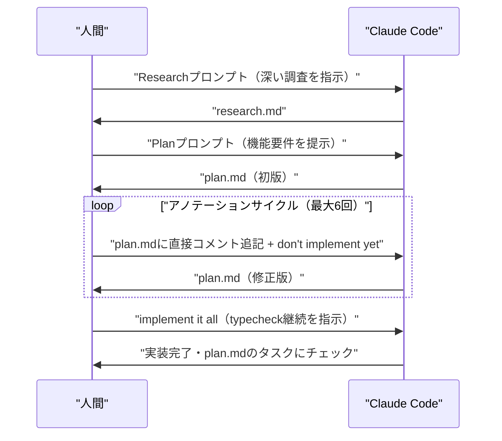
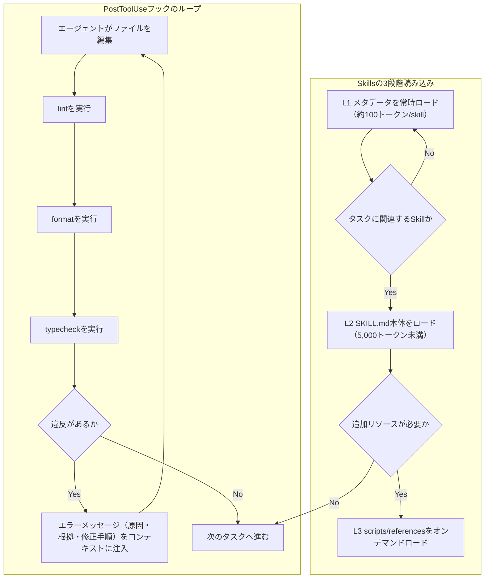

# Daily Briefing 2026-07-11

## 1. 長時間稼働アプリ開発のためのハーネス設計（原題: Harness design for long-running application development）

- **URL**: https://www.anthropic.com/engineering/harness-design-long-running-apps
- **公開日**: 2026-03-24
- **著者・媒体**: Prithvi Rajasekaran（Anthropic Labsチーム）／Anthropic Engineering Blog

### 要約
本稿は、数分で終わる単発のAIコーディングタスクではなく、数時間にわたる長時間実行のアプリ開発において、単一エージェントでは品質が頭打ちになる問題を扱う。著者はレトロゲームメーカーとDAW（デジタルオーディオワークステーション）という2つの実験を通じ、「プランナー（仕様策定）」「ジェネレータ（実装）」「エバリュエーター（評価）」の3エージェント構成が単独実行を大きく上回ることを示した。ソロ実行では20分・$9で完成したように見えても、実際にはゲームの主要機能が動作しない欠陥品だった一方、フルハーネス実行は6時間・$200かけて実用レベルの成果物を生んだ。エージェント間はファイル経由で通信し、一方が書いたファイルを他方が読んで応答するというシンプルな設計を採用している。生成エージェント自身に自己評価させると「客観的に見て平凡な出来でも自信満々に褒める」現象が観測され、独立した評価エージェントの分離が品質担保の鍵だったと報告している。また、Sonnet 4.5では「コンテキスト不安（context anxiety）」と呼ぶ、コンテキスト上限が近いと錯覚して作業を早期に切り上げてしまう挙動が見られ、要約によるコンパクションよりも完全なコンテキストリセットの方が有効だったという。Opus 4.6へのモデル更新時にはハーネスをむしろ簡素化（スプリント制の廃止、単一パスQA化）できた一方で、「モデルが賢くなってもハーネスの複雑性は必ずしも下がらない」という知見も述べている。

### 重要ポイント
- 生成（Generator）と評価（Evaluator）を別エージェントに分離することが品質向上の最大のレバー
- エージェント間通信はファイルの読み書きのみというシンプルな設計で仕様忠実性と柔軟性を両立
- 自己評価は信頼できない（甘くなる）ため、独立した評価者による客観的スコアリングが必須
- コンテキスト上限が近いと作業を早期に切り上げる「コンテキスト不安」への対策としてリセットが有効
- モデルが強くなってもハーネスの必要性は消えず、タスク難度に応じて調整し続ける必要がある

### 現場での適用方法
社内の長時間タスク（大規模リファクタ、機能追加の一括実装など）をエージェントに任せる際、単一プロンプトで丸投げせず、①要件を詳細仕様に展開する担当、②実装を行う担当、③Playwright等で実際に動作確認しスコアリングする担当、の3ロールに分けて実行させる。評価担当には「デザイン品質」「独自性」「作り込み」「機能性」のような具体的な採点基準プロンプトを与え、実装担当の自己申告を鵜呑みにせず必ず第三者視点でUI/動作を検証させる。長時間セッションでは要約的な圧縮より、要点を書き出してから完全にコンテキストをリセットする運用を試す。

### 期待効果
単独実行では見落とされがちな「動くように見えて実は主要機能が壊れている」出力を防止でき、成果物の実用度が大幅に向上する。コストと時間は増えるが（本例では20倍以上）、致命的な手戻りややり直しのコストを考えれば長時間タスクほど投資対効果が見込める。

### 注意点
コストとトークン消費が単発実行より大幅に増える（$9→$200など）ため、小規模タスクや単純作業には過剰な仕組みになる。評価エージェントの採点基準・プロンプトはタスクごとにチューニングが必要で、初期状態では問題を発見しても「大したことない」と自己説得して承認してしまうケースがあり、複数回の調整ループが前提となる。

## 2. トークン使用量を半減させた5つのコンテキストウィンドウ節約術（原題: 5 Context Window Tricks That Cut My Token Usage in Half）

- **URL**: https://dev.to/novaelvaris/5-context-window-tricks-that-cut-my-token-usage-in-half-hfl
- **公開日**: 2026-04-02
- **著者・媒体**: Nova Elvaris／DEV Community

### 要約
著者はコーディングアシスタント利用時のトークン消費を「コンテキストウィンドウはモデルが読める量ではなく予算（budget）である」という前提のもとに見直し、5つの具体的なテクニックを組み合わせることで1セッションあたり約80,000トークンから35,000トークンへ、約56%の削減を実現したと報告している。1つ目は「ファイルサマリーヘッダー」で、ファイル全文の代わりに行数・目的・エクスポート内容を3行で示すコメントを先頭に付けることでファイル参照あたり約60%削減。2つ目は「依存関係のスタブ化」で、他モジュールの完全な実装ではなくインターフェース（メソッドシグネチャ）だけを提示し依存関係あたり約80%削減。3つ目は「ローリングコンテキストウィンドウ」で、3〜4ターンごとに現在の状況を簡潔な進捗サマリーに置き換えてリセットし、5ターンを超えるセッションで約40%削減。4つ目は「ネガティブコンテキスト宣言」で、モデルに触れてほしくない既存コード（ログ、メトリクス、リトライ処理など）を明示的に「無視してよい」と宣言し、修正タスクで約30%削減。5つ目は「出力バジェット制約」で、「変更後の関数と2行要約だけを返せ」のように応答形式を限定し出力トークンを約40%削減する。いずれも特別なツールを必要とせず、プロンプトの書き方だけで実践できる点が特徴である。

### 重要ポイント
- ファイル全文ではなく3行サマリーヘッダー（行数・目的・エクスポート）を使う
- 依存モジュールは実装全体でなくインターフェース（型・シグネチャ）だけを渡す
- 長い対話は3〜4ターンごとに進捗サマリーへ圧縮してリセットする
- 触れてほしくない既存コードは「無視してよい」と明示的に宣言する
- 出力形式を「変更箇所＋短い要約のみ」のように制約し、無駄な説明文を減らす

### 現場での適用方法
社内のAIコーディングアシスタント利用ルールやプロンプトテンプレートに、この5パターンをチェックリストとして組み込む。特に大きな既存ファイルを扱う際はファイル冒頭に自動生成の要約コメントを付与する仕組み（lint/CIでの自動挿入なども検討）を作り、長時間のペアプロ的セッションでは定期的に「ここまでの要点」を書き出させてコンテキストをリセットする運用フローを標準化する。修正依頼のプロンプトには毎回「触れないでよい箇所」を明示するテンプレート文を用意する。

### 期待効果
同じ作業内容でもAPIコスト・応答速度・コンテキスト超過による打ち切りリスクを大幅に低減できる。特にコンテキスト長に制約のあるローカルLLMや低コストプランのAPIを使う場合に効果が大きい。

### 注意点
削減率（60%、80%等）は著者個人のワークフローでの実測値であり、言語・プロジェクト規模・モデルによって変動する。依存関係のスタブ化やネガティブコンテキスト宣言は、対象の記述が不正確だとモデルが誤った前提でコードを生成するリスクがあるため、要約内容の正確性を保つ運用（自動更新など）が前提となる。

## 3. ローカルコーディングエージェントの実践（原題: Using Local Coding Agents — Using Open-Weight Models in Local Coding Harnesses as an Alternative to Claude Code and Codex Subscriptions）

- **URL**: https://magazine.sebastianraschka.com/p/using-local-coding-agents
- **公開日**: 2026-06-27
- **著者・媒体**: Sebastian Raschka, PhD／Ahead of AI (Substack)

### 要約
機械学習研究者として知られる著者が、Claude CodeやCodexのようなクラウド課金型コーディングエージェントの代替として、オープンウェイトモデルをOllama経由でローカル実行し、Qwen-Code・Codex・Claude Codeなどのハーネスに接続する実践を検証した記事。Qwen3.6 35B-A3B（ダウンロード約22GB、必要RAM 30〜40GB）をMac Mini M4とNVIDIA DGX Sparkの両方で動作させ、Macで約40トークン/秒、DGXで約30トークン/秒の生成速度を計測し、これはGPT-5.5 Proのサブスクリプション利用時の推論速度に匹敵すると評価している。セットアップはOllamaのインストール、`ollama pull qwen3.6:35b-mlx`（Mac向け）等でのモデル取得、Qwen-Code側でエンドポイントを`http://127.0.0.1:11434/v1`に向けたカスタムプロバイダとして設定するだけで完了する。トークナイザのデバッグ、シェルコマンドインジェクション脆弱性のレビュー、クロスプラットフォームパスの最小差分修正、importエラーのトリアージ、キャッシュリークのデバッグという5つの実務寄りタスクでベンチマークしたところ、Qwen3.6 35B-A3BとNorth Mini Code 1.0は5タスク中4〜5タスクを成功させた一方、8GB程度で動くGemma 4 E2Bは5タスク中0タスクしか解けず、モデルサイズと実タスク成功率の関係を浮き彫りにした。セキュリティ面では、Qwen-Codeの設定ファイル`~/.qwen/settings.json`でテレメトリ（`usageStatisticsEnabled`等）を無効化し、Alibaba/Aliyun系エンドポイントへのデータ送信を防ぐ設定を具体的に紹介している。

### 重要ポイント
- 30〜35B級のMoEモデル（Qwen3.6 35B-A3B等）は多くの実務タスクで「非常に有能」と評価され、GPT-5.5 Pro相当の体感速度が出る
- Mac Mini M4（Apple Silicon）とNVIDIA DGX Sparkの両方で実測ベンチマークを取得し、条件を明示している
- Ollamaの標準コマンドだけでモデル取得から起動まで完結し、Qwen-Code等のOpenAI互換エンドポイント設定で既存ハーネスに接続できる
- 8GB級の小型モデル（Gemma 4 E2B）は実務タスクでほぼ機能しないなど、モデルサイズによる性能差が顕著
- ローカル実行でもテレメトリ設定を見落とすと海外エンドポイントへのデータ送信が発生しうるため、設定ファイルでの明示的な無効化が必要

### 現場での適用方法
機密性の高いコードベースや、クラウドAPIのレート制限・コストが問題になる場面から着手し、Ollamaで30B級MoEモデル（Qwen3.6 35B-A3B等）をローカル起動し、既存のQwen-Code等のCLIハーネスをOpenAI互換エンドポイントとしてローカルサーバに向ける。導入前に自社の代表的なタスク（デバッグ・脆弱性レビュー・importエラー対応など）を5件程度選び、実際に解けるかを検証してから採用モデルを決める。設定ファイルでテレメトリを無効化する手順を必ずセキュリティレビューのチェックリストに含める。

### 期待効果
クラウドAPIのサブスクリプション費用やレート制限を回避しつつ、オフライン・機密環境でもコーディング支援を利用できるようになる。30GB前後のRAM/VRAMを確保できるマシンであれば、体感速度・タスク成功率ともに実務利用に耐えるレベルに達している。

### 注意点
必要RAM/VRAMが30〜40GBと大きく、対応ハードウェア（Apple Silicon上位機種やDGX Spark等）を持たない環境では小型モデルしか動かせず、その場合はタスク成功率が大きく落ちる。モデルやハーネスによってはデフォルト設定のままテレメトリが有効になっているため、設定を個別に確認・無効化する作業が別途必要。

## 4. 本番運用エージェントのためのコンテキストエンジニアリング：メモリ・コンパクション・ツール結果クリア（原題: Context Engineering: Memory, Compaction, and Tool Clearing for Production Agents）

- **URL**: https://tianpan.co/blog/2026-02-26-context-engineering-memory-compaction-tool-clearing
- **公開日**: 2026-02-26（2026-04-15更新）
- **著者・媒体**: Tian Pan（元Uber/Brex/IoTeXエンジニア）／個人ブログ tianpan.co

### 本文翻訳
著者はコンテキストウィンドウを「モデルが対処すべきリソース」ではなく「エージェントの一級の建築コンポーネント」として意図的に管理すべきだと主張し、本番運用エージェントのためのコンテキスト管理を3つの道具立てに整理する。1つ目は「コンパクション」。デフォルトのトリガーは150Kトークン（最小50K）だが、実際には有効コンテキストの約70%（90〜100Kトークン）に達した時点で予防的に実行するのが望ましいという。事例として、335,279トークンに達したリサーチエージェントのコンテキストが、LLMによる要約処理を経て約2,800トークンの型付きサマリーブロックに圧縮され、約120:1の圧縮率を達成したことを紹介する。ただしJetBrainsの研究を引用し、LLMによる要約はエージェントの行動軌跡をかえって13〜15%延長させる場合があり、要約自体のコストが総支出の7%を超えることもあると警告する。2つ目は「ツール結果クリア」。古いツール呼び出しの結果を`[cleared to save context]`というプレースホルダに置き換え、呼び出しの記録だけは残す手法で、要約のような推論コストが発生しない。設定パラメータとして、発動条件の`trigger`、完全な形式で残す直近の結果数`keep`、キャッシュ無効化のROIを確保するための最小クリアトークン数`clear_at_least`、メモリや認証トークンなどクリア対象から除外する`exclude_tools`を挙げる。効果として50%以上のコスト削減を確認し、Qwen3-Coder 480Bでは52%のコスト削減時にむしろ解決率が2.6%向上した例も報告する。3つ目は「外部メモリ」で、ライブのコンテキストウィンドウに相当する「in-context working memory」、ファイルやDBに保存し明示的に読み書きする「external episodic memory」（Claude CodeのNOTES.mdパターン）、エンティティをノード・関係をエッジで表すグラフベースの「hierarchical semantic memory」（MemGPTやBedrock AgentCore Memoryなど、未使用だと減衰する）の3層で構成する。推奨トークン配分はシステム指示10〜15%、ツール定義15〜20%、取得知識コンテキスト30〜40%、会話履歴20〜30%、予備バッファ10〜15%とし、バッファがなければ劣化前のマージンを確保できないと強調する。計測すべき指標として、ターン・セッション・エージェント種別ごとのトークン使用量、コンパクション頻度と圧縮率、ツール結果クリアの頻度と回復トークン量、コンテキストサイズ別の成功率、コンパクションの有無による軌跡長の比較を挙げ、特に「タスク中盤のコンテキストサイズに対する完了率」が有効コンテキストの終了点を示す最重要指標だとする。導入手順としては、初日から全LLM呼び出しにトークン予算追跡を仕込み、再取得可能なツール出力には60〜70%の閾値でツール結果クリアを適用し、コンテキストリセットを超えて生存させたい状態には外部メモリを追加し、会話の推論過程そのものを保持する必要がある場合に限りコンパクションを予約する、という順序を推奨している。既存エージェントの診断では、失敗が発生した時点のコンテキストサイズの分布を見て、60〜70%充填付近に集中していればコンテキスト管理が原因であり、均等に分布していれば別の問題を疑うべきだとしている。

### 重要ポイント
- コンパクションは強力だが推論コストがかかり、要約が軌跡を13〜15%延長させるリスクもあるため70%到達時点での予防的実行が望ましい
- ツール結果クリアは推論コスト不要でコストを50%以上削減でき、`keep`/`clear_at_least`/`exclude_tools`などのパラメータで安全に運用できる
- 外部メモリはin-context working memory／external episodic memory／hierarchical semantic memoryの3層で設計する
- 推奨トークン配分（システム10-15%・ツール定義15-20%・知識30-40%・履歴20-30%・バッファ10-15%）を目安に予備を必ず確保する
- 「タスク中盤のコンテキストサイズに対する完了率」が、コンテキスト管理の効果を測る最重要指標

### 図解


### 現場での適用方法
CLAUDE.mdにコンテキスト予算のルールを追記し、エージェント自身に運用させる。

```markdown
## コンテキスト予算ルール
- コンテキスト使用率が60〜70%を超えたら、直近の結果以外の古いツール出力を
  "[cleared to save context]" に置き換えてよい（メモリ・認証トークン・タスク状態は対象外）
- 使用率が70%に近づいたら、要点を <REPO_PATH>/NOTES.md に書き出してから
  会話を要約（コンパクション）する
- トークン配分の目安: システム指示 10-15% / ツール定義 15-20% /
  検索・知識コンテキスト 30-40% / 会話履歴 20-30% / バッファ 10-15%
```

あわせて、トークン使用量を計測するための簡易ロガーを用意し、CI や日次バッチで閾値超過を検知できるようにする。

```python
# <REPO_PATH>/scripts/context_budget_logger.py
import json
import sys

def log_turn(turn_id, tokens_used, context_window,
             log_path="<REPO_PATH>/logs/context_budget.jsonl"):
    usage_ratio = tokens_used / context_window
    with open(log_path, "a") as f:
        f.write(json.dumps({
            "turn": turn_id,
            "tokens_used": tokens_used,
            "usage_ratio": round(usage_ratio, 3),
        }) + "\n")
    if usage_ratio >= 0.7:
        print(f"[WARN] context usage {usage_ratio:.0%} -> tool-result clearing / compaction を検討",
              file=sys.stderr)
```

### 期待効果
ツール結果クリアだけでも50%以上のAPIコスト削減が見込め、大規模な調査タスクではコンパクションにより120:1程度までコンテキストを圧縮できる。事例ではコスト削減と同時に解決率が2.6%向上しており、コスト削減と品質がトレードオフにならない場合もある。

### 注意点
LLMによる要約（コンパクション）は軌跡をかえって13〜15%延長させることがあり、要約コスト自体が総支出の7%を超えることもあるため、閾値を70%程度に抑えて予防的に実行することが重要。バッファ予備（10〜15%）を確保しないと、劣化が始まる前の余裕がなくなる点にも注意が必要。

## 5. Claude Codeの使い方：Research→Plan→Implementワークフローとアノテーションサイクル（原題: How I Use Claude Code）

- **URL**: https://boristane.com/blog/how-i-use-claude-code/
- **公開日**: 2026-02-10
- **著者・媒体**: Boris Tane（Cloudflareエンジニアリングリード、Baselime創業者）／個人ブログ boristane.com

### 本文翻訳
著者は9ヶ月間のClaude Code実運用経験から、「Research → Plan → Implement」という3段階ワークフローに落ち着いたと述べる。Research段階では、コードベースを実装前に徹底的に理解させるため、「read this folder in depth, understand how it works deeply, what it does and all its specificities. when that's done, write a detailed report of your learnings and findings in research.md」のように、「deeply」「in great details」「intricacies」といった強調語を意図的に使い、調査結果を`research.md`として書き出させる。バグ調査でも同様に「go through the task scheduling flow, understand it deeply and look for potential bugs」のように使う。Plan段階では、`research.md`を踏まえて「I want to build a new feature <name and description> that extends the system to perform <business outcome>. write a detailed plan.md document」のように機能要件を伝え、ファイルパスや実際のコードスニペットを含む詳細な`plan.md`を作成させる。この記事で最も独自性が高いのが「アノテーションサイクル」で、著者は生成された`plan.md`に直接コメントを書き込む。実例として「use drizzle:generate for migrations, not raw SQL」「no — this should be a PATCH, not a PUT」「remove this section entirely, we don't need caching here」「this is wrong, the visibility field needs to be on the list itself, not on individual items」のような具体的な指摘を残し、「I added a few notes to the document, address all the notes and update the document accordingly. don't implement yet」というプロンプトで反映させる。このサイクルを1〜6回繰り返し、実装に入る前に計画そのものの精度を人間のレビューで高め切る。計画が固まったら、Implementation段階として「implement it all. when you're done with a task or phase, mark it as completed in the plan document. do not stop until all tasks and phases are completed. do not add unnecessary comments or jsdocs, do not use any or unknown types. continuously run typecheck to make sure you're not introducing new issues.」という一括実行の指示を出し、`plan.md`のタスクにチェックを入れさせながら型チェックを継続実行させる。著者は、深い理解なしに進めると実装がコードベースを「skim（ざっと読むだけ）」してしまう危険、Claudeが初期段階で「reasonable-but-wrong assumption（もっともらしいが誤った前提）」を立ててしまう危険、そして単体では動くが周辺システムと非互換になる実装が生まれる危険を典型的な失敗パターンとして挙げている。

### 重要ポイント
- Research（調査）→Plan（計画）→Implement（実装）の3段階に分け、実装前に必ず計画書のレビューを挟む
- Research/Planの各プロンプトで「deeply」「in great details」など強調語を使い、コードベースの浅い理解を防ぐ
- 「アノテーションサイクル」＝生成された`plan.md`に人間が直接コメントを書き込み、1〜6回反復して精度を高める
- 実装フェーズでは「continuously run typecheck」を明示し、型崩れを継続的に検出させる
- 典型的な失敗は「浅い理解でのskim実装」「早期の誤った前提」「孤立環境でのみ動く非互換な実装」

### 図解


### 現場での適用方法
CLAUDE.mdに以下のワークフロー規約とプロンプトテンプレートを追記し、チーム全体で同じ型を再利用できるようにする。

```markdown
## 作業フロー: Research → Plan → Implement
1. 新機能や修正の依頼は、まず調査だけを指示する。
   例: "read <TARGET_DIR> in depth, understand how it works deeply, what it does
   and all its specificities. when that's done, write a detailed report of your
   learnings and findings in research.md"
2. research.md を人間がレビューしたのち、計画作成を指示する。
   例: "I want to build a new feature <FEATURE_NAME> that extends the system to
   perform <GOAL>. write a detailed plan.md document"
3. plan.md に直接コメントを書き込み、以下のプロンプトで反映させる（実装はまだ行わない）。
   "I added a few notes to the document, address all the notes and update the
   document accordingly. don't implement yet"
4. plan.md の全コメントに対応済みになったら実装を指示する。
   "implement it all. when you're done with a task or phase, mark it as completed
   in the plan document. do not stop until all tasks and phases are completed.
   do not add unnecessary comments or jsdocs, do not use any or unknown types.
   continuously run typecheck to make sure you're not introducing new issues."
5. 実装が計画から逸脱していた場合は、コードを直接直させず plan.md 側を修正してから再指示する。
```

### 期待効果
実装前に計画書段階でレビューを集約するため、実装後の大規模な手戻りを削減できる。「skim実装」「誤った前提での早期実装」「周辺システムと非互換な実装」といった典型的な失敗を、計画段階のアノテーションで事前に潰せる。

### 注意点
アノテーションサイクルは1〜6回の反復が前提であり、計画書を丁寧にレビューする人間側の時間投資が必須になる。Research/Planを端折って実装に進むと「reasonable-but-wrong assumption」のリスクが高まるため、急ぎのタスクでも調査段階を省略しないことが推奨される。

## 6. コーディングエージェント時代の開発ワークフロー全サーベイ（原題: A Survey of Development Workflows in the Coding Agent Era）

- **URL**: https://nyosegawa.com/en/posts/coding-agent-workflow-2026/
- **公開日**: 2026-03-14
- **著者・媒体**: 逆瀬川（Sakasegawa, @gyakuse）／個人ブログ Sakasegawa's Blog

### 本文翻訳
著者は、Karpathyが2026年2月に提唱した「Agentic Engineering」という再定義（開発作業の99%がオーケストレーションと監督になり、開発者の労力配分が実装30%・問題定義や検証戦略70%へとシフトする）を出発点に、2026年時点で使われている開発ワークフローとインフラを横断的に整理する。プロジェクトワークフローとしては、対話的LLMに「一度に1つの質問」で掘り下げさせて`spec.md`を作り推論モデルで`prompt_plan.md`と`todo.md`に分解するHarper Reedスタイル（個人のグリーンフィールド開発向け）、仕様書を「真実の源」とするSDD/AI-DLC（spec-first・spec-anchored・spec-as-sourceの3レベルがあり、AWSのAI-DLCはInception→Construction→Operationsの3段階で4時間の「Mob Elaboration」セッションを行う、中〜大規模チーム向け）、Boris Taneが体系化したResearch→Plan→Implement（各フェーズ境界でFrequent Intentional Compaction＝FICを行い、コンテキスト利用率を40〜60%に保つことでパニック的なコンパクションを避ける）、obra/superpowers（Brainstorming→Git Worktrees→Planning→Execution→TDD→Code Review→Branch Completionの7段階パイプラインで、1タスクにつき1サブエージェントを並列実行しRED-GREEN-REFACTORを厳格に強制する）の4つを紹介する。インフラ面では、Hooksの各イベント（PreToolUse＝危険操作の遮断、PostToolUse＝lint/format/typecheckの自動実行と違反のコンテキストへの注入、Stop、SessionEnd、PreCompact/PostCompact）を解説し、OpenAIのハーネスエンジニアリングの知見として「カスタムlinterのエラーメッセージ自体に、何が悪いか・なぜそのルールが存在するか・具体的な修正ステップを含めるべき」という原則、Factory.aiのlintルールをGrep-ability・Glob-ability・Architectural Boundaries・Security & Privacy・Testability・Observability・Documentationの7カテゴリに分類する手法を紹介する。Skillsについては、L1（YAMLメタデータ、常時ロードで約100トークン/skill）、L2（SKILL.md本体、発動時のみロードで5,000トークン未満）、L3（scripts/references等、オンデマンドでロード）の3段階読み込みにより、未使用のSkillが98%のトークンを削減できる点を紹介する。AGENTS.md/CLAUDE.mdについては、目安サイズを60〜150行（HumanLayer推奨は60行以下）とし、Vercelの事例としてNext.js 16のドキュメントを40KBから8KBに圧縮しながら100%のパス率を維持できたこと（パッシブに常時読み込まれるコンテキストが、オンデマンド検索よりも53%対100%で優れていたこと）を挙げ、詳細はサブフォルダやSkillsに分割するProgressive Disclosureパターンを推奨する。著者自身の運用として、Linearに思いつきをドロップすると自動で仕様化され、レビュー後に自動実装されるIdea-driven developmentと、セッションの停滞を検知して通知をバッチ化するPatrol Agentを紹介し、8時間の連続自動実行に成功した実験にも触れている。開発前の準備として、AGENTS.md/CLAUDE.mdの健全性をLefthookのpre-commitフックで機械的にチェックする仕組み（行数60以下の検証、記載パスの実在確認、ADRの「last-validated」日付が3日で警告・5日でエラーになる仕組み）を紹介し、違反時にはfix-only subagentが自動修正する構成を説明している。

### 重要ポイント
- 2026年の開発は「Agentic Engineering」として再定義され、実装30%・問題定義/検証戦略70%へと労力配分がシフトしている
- Harper Reed式／SDD・AI-DLC／Research→Plan→Implement（FIC）／Superpowersの4スタイルはプロジェクト規模・チーム構成に応じて使い分ける
- PostToolUseフックでlint→format→typecheckを自動実行し、違反メッセージ自体に「原因・根拠・修正手順」を含めるとエージェントへの効果が高い
- SkillsはL1（メタデータ常時）/L2（本体は発動時）/L3（リソースはオンデマンド）の3段階で、未使用時は98%のトークンを節約できる
- AGENTS.md/CLAUDE.mdは60〜150行を目安に軽量化し、詳細はProgressive DisclosureでSkillsやサブフォルダへ逃がす

### 図解


### 現場での適用方法
AGENTS.md/CLAUDE.mdの健全性を機械的に守るため、Lefthookのpre-commit設定を導入する。

```yaml
# <REPO_PATH>/lefthook.yml
pre-commit:
  commands:
    agents-md-length:
      glob: "AGENTS.md"
      run: |
        LINES=$(wc -l < AGENTS.md)
        if [ "$LINES" -gt 60 ]; then
          echo "AGENTS.md is $LINES lines (limit: 60). Split details into skills/ or docs/."
          exit 1
        fi
    agents-md-broken-refs:
      glob: "AGENTS.md"
      run: |
        grep -oE '`[^`]+\.(md|ts|py)`' AGENTS.md | tr -d '`' | while read -r path; do
          [ -f "<REPO_PATH>/$path" ] || { echo "Broken reference: $path"; exit 1; }
        done
```

あわせて、常時ロードされる指示（AGENTS.md/CLAUDE.md）とオンデマンドで読み込むSkillを分離するため、以下のようなSKILL.mdを追加する。

```markdown
---
name: visual-check
description: "Use after editing any .tsx file to verify the rendered UI still matches the design spec before marking a task complete."
---

## 手順
1. 変更した .tsx ファイルのプレビューを開く
2. docs/design/ 配下の設計画像と見た目を比較する
3. 差分があれば修正してから完了報告する
```

### 期待効果
AGENTS.md/CLAUDE.mdを軽量に保つことで、常時読み込みコストを抑えつつVercelの事例（40KB→8KBで100%パス率維持）のように精度を落とさず、むしろ向上させられる可能性がある。Lefthookによる自動チェックでドキュメントの陳腐化・肥大化を継続的に防止できる。

### 注意点
60行制限やLefthookでの自動チェックはチーム内の合意形成と初期整備コストを要する。Skillsの配置ディレクトリはツール（Claude Code／Codex CLI／Gemini CLI）ごとに異なる（`.claude/skills/`／`.agents/skills/`／`.gemini/skills/`）ため、複数ツールを併用する現場では設定の重複管理が発生する点に注意が必要。
