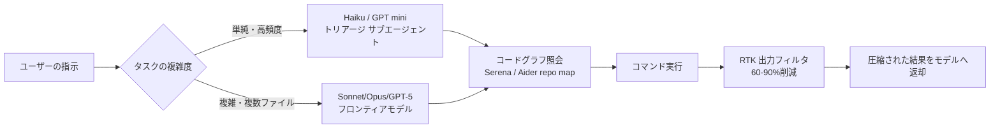
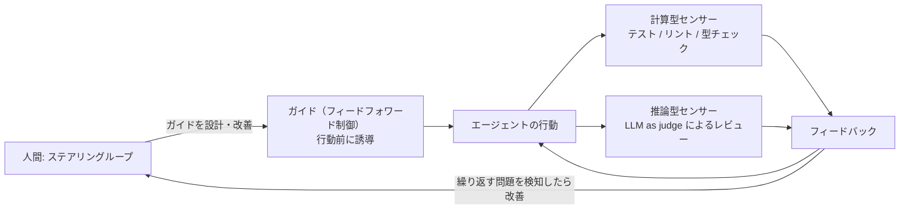

# Daily Briefing 2026-07-12

## 1. Claude CodeとCodexにおけるトークン消費を削減する3つのシンプルな手法（原題: 3 Simple Techniques to Reduce Token Consumption in Claude Code and Codex）

- **URL**: https://tech.autoscout24.com/blog/posts/3-techniques-to-reduce-token-consumption-claude-code-codex/
- **公開日**: 2026-06-22
- **著者・媒体**: Slavik Shynkarenko（AutoScout24 Head of Platform Engineering）／AutoScout24 Tech Blog

### 本文翻訳
AIコーディングエージェントを日常的に使うと、Claude CodeやCodexが実行するコマンドの出力やツール呼び出しが大量のトークンを消費し、コストと応答速度の両方を悪化させる。著者はAutoScout24のプラットフォームエンジニアリングチームで日々エージェントを運用する中で、実際に効果のあった3つの手法を紹介する。

1つ目は「うるさい出力を排除する」こと。著者はRTKというツールを紹介する。これはエージェントと実行コマンドの間に挟まり、`git status`や`npm test`のような冗長な出力をフィルタする。`rtk init --global`でグローバルに導入すると、コマンド実行が自動的にラップされ出力が圧縮される。著者らの計測では、dev-loopの出力を60〜90%削減できたという。あわせて「Caveman Mode」と呼ぶ手法も使う。これはモデルの応答から冠詞や社交辞令を取り除き、「認証ミドルウェアにバグ。トークン有効期限判定が`<`になっているが`<=`であるべき」のような簡潔な返答を促すものだ。Claude Codeでは環境変数`CLAUDE_CODE_MAX_OUTPUT_TOKENS`で出力上限を設定でき、Codexでは`model_verbosity = "low"`の設定で冗長性を抑えられる。

2つ目は「ファイル探索の代わりにコードグラフを与える」こと。エージェントに闇雲にGrep/Globでファイルを探させるのではなく、「これを呼んでいるのは誰か」に即答できる構造化されたコードグラフを事前に用意する。具体例として、永続的な差分インデックスを持つMCPサーバーの`code-review-graph`、言語サーバーベースのSerena、Aiderのランク付けされたリポジトリマップ、セマンティック埋め込みベースのClaude Contextを挙げている。運用ルールとして「Grep/Glob/Readを呼ぶ前に必ずコードグラフツールを呼ぶ」ことをエージェントへの指示に明記することを勧めている。

3つ目は「タスクを適切なモデルへルーティングする」こと。HaikuやGPT miniのような小型・高速モデルは大量かつ曖昧さの少ない作業に、Sonnet/OpusやGPT-5のようなフロンティアモデルは複雑な複数ファイル変更に割り当てる。サブエージェント定義の例として、`triage`という名前で`model: haiku`、使用ツールを`Read, Grep`に限定し、出力を120トークンに制限する設定を示している。Codexでは`--profile cheap`と`--profile frontier`のようなプロファイル切り替えで、モデル選択と`model_reasoning_effort`の両方を一括で変更できる。

著者は、これらの改善効果を体感だけで終わらせず、キャッシュヒット率とマージされたAI支援PRあたりのコストを継続的に計測することを勧めている。

### 重要ポイント
- ノイズの多いツール出力をRTKのようなプロキシでフィルタすると、dev-loop出力を60〜90%削減できる
- 「Caveman Mode」で応答自体を簡潔化し、`CLAUDE_CODE_MAX_OUTPUT_TOKENS`／`model_verbosity`で上限を設定する
- Grep/Globより先にコードグラフツール（Serena、Aiderのrepo mapなど）を呼ばせる運用ルールを明文化する
- トリアージ用サブエージェントは`model: haiku`のような軽量モデルに固定し、出力トークンも制限する
- 効果は感覚ではなくキャッシュヒット率・マージ済みPRあたりコストで継続計測する

### 図解


### 現場での適用方法

**CLAUDE.md への追記例**
```markdown
## トークン消費を抑えるルール
- Grep / Glob / Read を呼ぶ前に、必ずコードグラフツール（Serena など）で
  対象シンボルの呼び出し元・呼び出し先を確認すること
- 単純な分類・検索タスクは haiku サブエージェント
  （tools: Read, Grep、出力上限120トークン）に委譲すること
- コマンド出力は圧縮フィルタ経由で受け取り、生の git status / npm test の
  全文をそのまま会話に貼らないこと
```

**スクリプト化の例（Claude Code サブエージェント定義）**
```yaml
# <REPO_PATH>/.claude/agents/triage.yaml
name: triage
model: haiku
tools: [Read, Grep]
max_output_tokens: 120
description: "単純な分類・一次調査専用の軽量サブエージェント"
```

**運用手順（Codexのプロファイル切り替え）**
```toml
# ~/.codex/config.toml
[profiles.cheap]
model = "gpt-5-mini"
model_reasoning_effort = "low"

[profiles.frontier]
model = "gpt-5"
model_reasoning_effort = "high"
```
```bash
# 日常的な軽作業
codex --profile cheap
# 複雑な複数ファイル変更のときだけ
codex --profile frontier
```

### 期待効果
出力フィルタリングでdev-loopの出力を60〜90%削減。モデルルーティングにより、複雑な変更以外はフロンティアモデルの呼び出し回数・コストを抑制できる。

### 注意点
RTKやcode-review-graphなど外部ツールの導入が前提となる。「Caveman Mode」で応答を簡潔にしすぎると、重要な意思決定の根拠説明が省略されるリスクがある。モデルルーティングの閾値（何を「単純」とみなすか）はチームやコードベースごとに調整が必要。

---

## 2. コンテキストは予算である ― AI支援開発におけるトークン管理（原題: Context Is a Budget — Reducing Token Usage in AI-Assisted Development）

- **URL**: https://foojay.io/today/context-is-a-budget-eight-levers-and-three-workflow-patterns/
- **公開日**: 2026-05-22
- **著者・媒体**: Soham Dasgupta／foojay.io

### 本文翻訳
多くの開発者はコンテキストウィンドウを「大きければ大きいほど良い無料の資源」と捉えているが、著者はこれを予算として扱うべきだと説く。コンテキストには3つの隠れたコストがある。金銭的なコスト、レイテンシの増大、そして「コンテキストの劣化」——広告されている上限トークン数まで使えるとしても、トークン数が増えるほどモデルの応答品質は実際には低下する、という点である。

著者はコスト削減のための8つの「レバー」を提示する。A. コンテキストエンジニアリング（依頼範囲を絞る）：`#file:`のような明示的なファイル参照を使い、エージェントモードでの広範な探索に頼らない。特定ファイルを指定するだけでトークン消費を探索型に比べて約90%削減できるという。B. プロンプトキャッシュ（順序が重要）：ツール定義やシステムプロンプト、スキルなど安定した内容をプロンプトの先頭に、動的な内容を末尾に配置する。キャッシュヒットは通常の入力コストの約10%で済むが、先頭部分を変更するとキャッシュの効果は失われる。C. ツール・MCPの衛生管理：MCPサーバーは1台につき、使う使わないに関わらず毎ターン400〜2,500トークンを消費する。5台接続すればユーザー入力前に5,000〜10,000トークンが失われる。使わないサーバーは無効化し、ツールスキーマをコンパクトに保つべきだとする。D. カスタム指示とスキル：チームの規約を`.github/copilot-instructions.md`や`CLAUDE.md`のようなコミット済みファイルにコード化する。わずか6行のファイルでリポジトリ全体のチャットにおける繰り返しの指示を排除できる。E. モデルルーティング：日常的な作業には中位モデルを既定とし、本当に難しい推論だけ上位モデルに回す。F. 出力の規律：完全なファイルではなく差分を要求し、余計な説明を求めない。「プリアンブルなしでunified diffのみで返答して」と指示するだけで、出力トークンコストをフルファイル応答比で90%以上削減できる。G. リポジトリの衛生：`.gitignore`を厳格化し、`git rm --cached`で誤って追跡されているファイルを除去する。ファイル冒頭に約50トークンの3行サマリを追加し、長いコードの再読み込みを避ける。H. 可観測性：応答レイテンシをトークン数の代理指標として監視する。新規チャットの3倍の時間がかかっているなら、コンテキスト肥大化のサインであり要約して再スタートすべきだとする。

さらに著者は3つのワークフローパターンを紹介する。1つ目は「Ralph Wiggumループ」。`TODO.md`にチェックリストを保持し、安価なモデルが「タスクを読む→実装する→テストする→コミットする」を自律的に繰り返す。状態は会話履歴ではなくディスク上に永続化されるため、再起動が容易で各イテレーションのコンテキストも小さく保てる。2つ目は「オートコンパクト」。コンテキストが容量の60〜80%に近づいたら300語未満の要約を作り`plan.md`に保存、その要約を参照して新しいチャットを開始する。4KBの要約で元のシグナルの95%を、コストの3%で保持できるという。3つ目は「プランナー→実装者→レビュアー」。目的別に分離した3つのチャットを使い、高価なモデルが実装計画を作り、安価なモデルがRalphループで実行し、高価なモデルが受け入れ基準に照らしてレビューする。チャット間を跨ぐのは会話履歴ではなく成果物（計画書や差分）のみとし、典型的な機能追加であれば上位モデル呼び出しを30回以上から5〜8回にまで減らせるとしている。

著者は「一番無駄なトークンとは、支払っているのに気づいていないトークンだ」と結び、巧妙なプロンプトよりも計測に基づく規律を重視すべきだと述べている。

### 重要ポイント
- コンテキストは無料ではなく、金銭コスト・レイテンシ・品質劣化という3つの隠れたコストを持つ「予算」である
- 8レバーのうち、ファイル参照の明示化とMCPサーバーの整理は即効性が高い（各90%前後の削減効果）
- Ralph Wiggumループ：`TODO.md`で状態をディスクに永続化し、安価なモデルで自律的に反復させる
- オートコンパクト：使用率60〜80%到達で300語要約→`plan.md`→新チャット、4KBの要約で元シグナルの95%を保持
- Planner→Implementer→Reviewerパターンで上位モデル呼び出しを30回超から5〜8回に削減

### 図解


### 現場での適用方法

**CLAUDE.md への追記例**
```markdown
## コンテキスト予算ルール
- ファイルを指定して依頼する（「バグを探して」ではなく
  `#file:src/auth/token.ts` のように対象を明示する）
- 使っていない MCP サーバーは無効化する（1台あたり毎ターン400-2,500トークン消費）
- 修正提案は unified diff のみで返答し、前置きの説明は書かない
- 新しいタスクは新しいチャットで開始し、前タスクの会話履歴を引き継がない
- コンテキスト使用率が高くなった、または応答が遅くなったと感じたら、
  300語以内で要約して plan.md に保存し、新しいチャットに切り替える
```

**スクリプト化の例（Ralph Wiggumループ用テンプレート）**
```markdown
<!-- <REPO_PATH>/TODO.md -->
# TODO
- [ ] 失敗しているテスト <TEST_NAME> を修正する
- [ ] 修正後 `npm test` を実行し全て green にする
- [ ] green になったら意味のある単位でcommitする
- [ ] 次のチェック項目に進む（未完了なら本ループを継続）
```

### 期待効果
ファイル参照の明示化でトークン消費を探索型比で約90%削減。diff限定出力で出力トークンコストを90%以上削減。オートコンパクトにより、4KBの要約で元シグナルの95%をコストの3%で保持しながら作業を継続できる。

### 注意点
プロンプトキャッシュは先頭の安定部分を変更すると無効化されるため、動的な内容は末尾に配置する規律が必要。MCPサーバーの無効化は機能損失とのトレードオフになる。要約による情報欠落のリスクがあるため、コンパクト実行前に重要な決定事項を明示的に書き出しておく必要がある。60〜80%という閾値はモデル・プロバイダごとの実効コンテキスト長に応じて調整すること。

---

## 3. コーディングエージェント利用者のためのハーネスエンジニアリング（原題: Harness engineering for coding agent users）

- **URL**: https://martinfowler.com/articles/harness-engineering.html
- **公開日**: 2026-04-02
- **著者・媒体**: Birgitta Böckeler（Thoughtworks シニアエンジニア）／martinfowler.com

### 本文翻訳
「エージェント = モデル + ハーネス」という定義に基づき、著者はAIモデル自体を除くすべての要素を「ハーネス」と呼ぶ。本稿は特に、コーディングエージェントを使う開発者が自分のシステムに合わせて構築する「外部ハーネス」に焦点を当てる。

ハーネスの制御は大きく2種類に分けられる。1つは「ガイド」と呼ばれるフィードフォワード制御で、エージェントが行動する前に望ましい振る舞いを誘導し、最初の試行で良い結果が出る確率を高める。もう1つは「センサー」と呼ばれるフィードバック制御で、エージェントが行動した後にその結果を観察し、自己修正を助ける。特にLLMが消費しやすい形に最適化されたシグナル（構造化されたエラーメッセージなど）が有効に機能する。

センサーはさらに「計算型」と「推論型」に分かれる。計算型センサーはテスト・リンター・型チェッカーのように決定論的でCPUによって高速に実行されるもの。推論型センサーはAIによるコードレビューのように、コストは高いが意味的な分析ができ、しばしば「LLM・アズ・ア・ジャッジ」として使われる。

著者はハーネスをいくつかの規制カテゴリに分類する。「保守性ハーネス」は重複コードや循環的複雑度、テストカバレッジ不足のような構造的問題の検出に最も有効で、計算型センサーが信頼できる形で機能する領域である。「アーキテクチャ適性ハーネス」はフィットネス関数を用いて性能要件やアーキテクチャ特性を定義・検査する。「動作ハーネス」は機能的な振る舞いの保証を担うが、現状はAI生成のテストスイートへの依存度が高く、最も改善の余地が大きい領域だとしている。

重要な概念として「ハーネス性（harnessability）」を挙げる。強い型付けの言語や明確に定義されたモジュール境界を持つコードベースほどハーネスを構築しやすく、環境が備える「アンビエントな支援（ambient affordances）」が制御の効きやすさを左右する。

人間の役割は「ハーネスを反復改善する」という「ステアリングループ」を回すことにある。繰り返し発生する問題に対して、フィードフォワード制御（ガイド）とフィードバック制御（センサー）の両方を継続的に改善していく。

変更のライフサイクルにおけるタイミングも論じられる。LSPやアーキテクチャドキュメント、スキルはコミット前の段階（左側）で機能し、ミューテーションテストや詳細なレビューのような高コストな検証は統合後のパイプラインで実行し、デッドコード検出やテストカバレッジの質分析、依存関係のスキャンは継続的な監視として走らせる、という時間軸での配置を提案する。

さらに著者は「ハーネステンプレート」という考え方を紹介する。APIビジネスサービス、イベント処理、データダッシュボードのような共通のトポロジーに対して、ガイドとセンサーをあらかじめバンドルしたテンプレートを用意すれば、ニーズの80%をカバーできるとする。

最後に著者は、開発者が持つ経験や規約知識、組織的な文脈認識といった「暗黙のハーネス」は、計算型センサーにも推論型センサーにも完全には置き換えられないと強調する。良いハーネスとは人間を完全に排除することではなく、最も重要な箇所へ人間の入力を適切に誘導することを目指すべきだとして、OpenAIチームによるカスタムリント・構造テスト・継続的なドリフト検査や、Stripeのプリプッシュフックと「blueprints」によるセンサー統合といった実例を挙げて締めくくっている。

### 重要ポイント
- 「Agent = Model + Harness」。ハーネスはガイド（フィードフォワード制御）とセンサー（フィードバック制御）の2種類で構成される
- センサーは計算型（テスト・リント・型チェック、決定論的で高速）と推論型（LLM as judgeなど、意味理解可能だが高コスト）に分かれる
- 保守性ハーネス／アーキテクチャ適性ハーネス／動作ハーネスの3カテゴリがあり、動作ハーネスが最も未成熟
- 「ハーネス性」は型付けの強さやモジュール境界の明確さに左右される
- 人間の役割はハーネスを継続的に改善する「ステアリングループ」を回すことにあり、暗黙知は完全には代替できない

### 図解


### 現場での適用方法

**CLAUDE.md への追記例**
```markdown
## ハーネス運用ルール
- コミット前に必ず lint / type-check / test を実行し、失敗した場合は
  修正するまでコミットしないこと（計算型センサー）
- アーキテクチャ境界を跨ぐ変更を行う前に、該当するアーキテクチャドキュメントと
  フィットネス関数の制約を確認し、提案に反映すること（ガイド）
- 自動テストで検出できない振る舞いの変更は、必ずAIコードレビュー
  （推論型センサー）を経由させること
```

**スクリプト化の例（計算型センサーとしてのpre-commitフック）**
```bash
#!/usr/bin/env bash
# <REPO_PATH>/.git/hooks/pre-commit
set -e
npm run lint
npm run typecheck
npm test -- --silent
```

**スキル化の例**
```yaml
---
name: harness-check
description: >
  コミット前に計算型センサー（lint/typecheck/test）を必ず実行し、
  失敗している場合は原因を修正してから再実行する。
  アーキテクチャ境界を跨ぐ変更の提案前に呼び出すこと。
---
1. `npm run lint && npm run typecheck && npm test` を実行する
2. 失敗があれば原因箇所を特定し修正してから手順1を再実行する
3. 全て green になったら変更内容の要約を報告する
```

### 期待効果
ガイド（フィードフォワード制御）により初回試行での成功率が向上し、計算型センサーにより構造的な劣化を早期に検出できる。推論型センサーの併用により、計算だけでは捉えられない意味的な問題（設計意図との乖離など）のレビュー精度が向上する。

### 注意点
動作ハーネスはAI生成テストスイートへの依存度が高く、過信は禁物。強い型付けや明確なモジュール境界を持たない既存コードベースでは、ハーネス構築自体のコストが高くなる。推論型センサーはコストとレイテンシが計算型より大きいため、全ての変更に適用するのではなく重要な変更に絞って使うべき。
