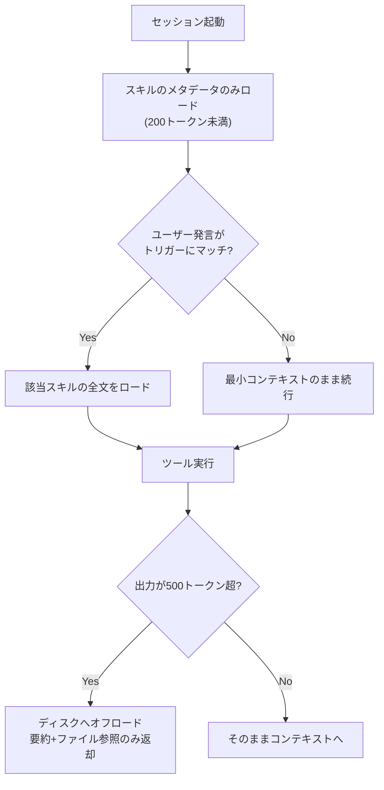
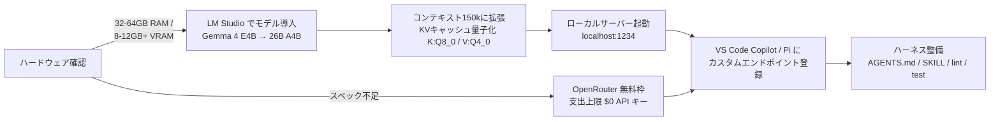
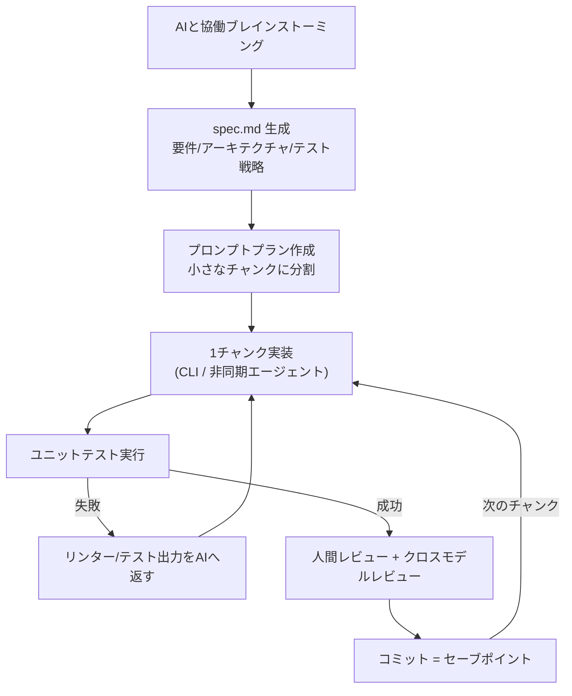

# Daily Briefing 2026-07-13

## 1. Agent Skills: コンテキストエンジニアリング革命（原題: Agent Skills: The Context Engineering Revolution）

- **URL**: https://www.blog.brightcoding.dev/2026/07/08/agent-skills-the-context-engineering-revolution
- **公開日**: 2026-07-08
- **著者・媒体**: BrightCoding Blog（紹介対象リポジトリの作者は Muratcan Koylan）

### 本文翻訳
コンテキストエンジニアリングは、指示文だけを最適化する従来のプロンプトエンジニアリングとは根本的に異なる。システムプロンプト、ツール定義、会話履歴、取得したドキュメントなど、LLMのコンテキストウィンドウに入るすべてを管理する営みである。本稿が指摘する核心的な問題は「コンテキストウィンドウの制約は生のトークン容量ではなく、アテンションの力学にある」という点だ。モデルはU字型のアテンションカーブを持つため、コンテキストの中間に置かれた情報を無視しやすい「lost-in-the-middle現象」が予測可能な劣化パターンとして発生する。

この問題への解として紹介されるのが「Agent Skills for Context Engineering」リポジトリで、5カテゴリ13スキルを提供する。カテゴリは (1) コンテキストの基礎（高シグナルなトークンの特定、劣化パターンの認識）、(2) コンテキスト圧縮（要約とエンティティ抽出により60〜80%のトークン削減）、(3) マルチエージェントパターン（オーケストレーター型・P2P型・階層型アーキテクチャ）、(4) メモリシステム（短期スクラッチパッド、長期ベクトルストア、グラフベースの知識）、(5) 評価フレームワーク（バイアス緩和を含むLLM-as-Judge技法）である。

中核となる設計思想は「プログレッシブ・ディスクロージャー（段階的開示）」パターンだ。スキルは起動時にメタデータのみ（200トークン未満）をロードし、トリガーフレーズにマッチしたときだけ全文を読み込む。例えば「compress context」と言及すると圧縮スキルが自動的にロードされる。従来型のアプローチでは初期コンテキストのオーバーヘッドが2,000トークン超になるのに対し、段階的開示では200トークン未満に抑えられる。

もう1つの重要技法が「ファイルシステムへのコンテキストオフロード」である。ツール出力が約500トークンを超える場合、コンテキストウィンドウに保持せずディスクに書き出し、要約（冒頭200文字）付きのコンパクトなファイル参照だけを返す。これによりコンテキストの汚染を防ぎながら、必要なときに全文へアクセスできる。

実運用の適用例として、顧客サポートボット（履歴を圧縮しつつユーザー設定を保持、ポリシー文書はオフロード）、マルチエージェント調査システム（コンテキスト分離された専門エージェントのオーケストレーション）、規制対象ドメインでの説明可能な推論（RDFデータをBelief-Desire-Intention認知アーキテクチャへマッピング）、コンテキスト長ごとの性能劣化カーブの計測によるデバッグが挙げられている。導入はClaude Codeのプラグインマーケットプレイス経由で、`/plugin marketplace add`コマンドから行える。

### 重要ポイント
- コンテキストの制約はトークン容量ではなくアテンションの力学。中間位置の情報が無視される「lost-in-the-middle」が主要な劣化パターン
- プログレッシブ・ディスクロージャー：起動時はメタデータのみ（200トークン未満）をロードし、トリガーフレーズで全文を遅延ロードする
- 500トークン超のツール出力はディスクにオフロードし、要約付きファイル参照のみをコンテキストに残す
- 圧縮スキル（要約＋エンティティ抽出）で60〜80%のトークン削減を報告
- スキル活性化とトークン消費のロギングを実装し、効果を計測可能にする

### 図解


### 現場での適用方法

**CLAUDE.md への追記例**
```markdown
## コンテキスト管理ルール
- 500トークンを超えるツール出力・調査結果はコンテキストに貼らず、
  scratchpad のファイルに保存して「要約 + ファイルパス」だけを報告すること
- 重要な指示・制約はコンテキストの先頭または末尾に置く
  （中間に置くと lost-in-the-middle で無視されやすい）
- スキル・手順書は常時ロードせず、必要になったタスクの開始時に読み込むこと
```

**スキル化の例（段階的開示に沿ったスキル定義）**
```yaml
---
name: context-compression
description: >
  会話やツール出力が長くなったときに呼び出す。要約とエンティティ抽出で
  コンテキストを圧縮し、詳細はファイルへオフロードする。
  トリガー: 「コンテキストを圧縮」「会話が長くなった」
---
1. 現在の会話から意思決定・制約・未完了タスクを抽出する
2. 300語以内の要約を作成し、詳細はファイルに保存する
3. 「要約 + ファイル参照」の形で報告する
```

**導入手順（Claude Code プラグイン）**
```bash
# マーケットプレイス登録
/plugin marketplace add muratcankoylan/Agent-Skills-for-Context-Engineering
# インストール確認
/plugin list
```

### 期待効果
初期コンテキストのオーバーヘッドを2,000トークン超から200トークン未満へ削減。圧縮スキルの適用で60〜80%のトークン削減。コンテキスト劣化を「推測」ではなく劣化パターンの診断として体系的に扱えるようになる。

### 注意点
60〜80%削減という数値は本番利用者の報告ベースで、計測手法は開示されていない。対象は中〜上級者向けで、Claude Code以外のプラットフォームでは擬似コードを自前で移植する必要がある。トリガーフレーズはドメインごとにカスタマイズしないと、必要なスキルがロードされない・不要なスキルがロードされるといった誤発火が起きうる。

---

## 2. エージェンティックコーディングのためのローカルLLM活用（原題: Using local LLMs for agentic coding）

- **URL**: https://blog.alexewerlof.com/p/local-llms-for-agentic-coding
- **公開日**: 2026-06-04
- **著者・媒体**: Alex Ewerlöf／Alex Ewerlöf Notes（Substack）

### 本文翻訳
GitHub Copilotの従量課金化に代表されるように、クラウドAIの価格は上昇を続けている。著者は「新しいモデルは3倍の価格でわずかな性能向上しかもたらさないことがある（例: Gemini 3.5 Flash対2.5 Flash）」と指摘し、適切なツーリングとアーキテクチャを組み合わせれば、ローカル実行のLLMでも開発ワークフローに十分な能力を発揮できると主張する。重要な論点は「弱いモデルでも、より良いプロンプト・ガードレール・ツーリング（ハーネス）によって6倍の改善が可能」という点で、モデルの生の能力よりハーネスの質が効く。また、能力の低いモデルと働くことは深い関与を強制し、「影響のAIへの丸投げ」を防ぐ認知的メリットもあるとする。

ハードウェアは最低32〜64GBのRAMを推奨（小型モデルなら8〜12GBのVRAMでも可）。著者自身はLenovo ThinkPad L16 Gen 2（Ryzen 7 PRO 250 APU、64GB DDR5）で検証している。モデルはGemma 4ファミリーを軸に、E4B（4B、入門に推奨）、12B（画像理解対応でフロントエンド向き）、26B A4B（MoE、コーディングに最良のバランス、約22GB）を比較する。

セットアップはLM Studio（v0.4.15以降）を使う。重要なのはコンテキスト長の設定で、デフォルトの約4kトークンではVS Code Copilotのシステムプロンプトだけで20〜40kトークンを要するため全く足りない。150kトークンへの拡張を推奨し、その場合のVRAM消費は22.45GB（4kなら18.16GB、最大262kなら25.74GB）。さらにKVキャッシュの量子化（K: Q8_0、V: Q4_0 — キーは値より高解像度を保つ）により、28.75GBの要求を22.45GBまで削減できる。Developerタブでサーバーを有効化し、GPUオフロード最大化・Flash Attention有効化・CPUスレッドは使い切らない、といった設定を明示的に保存する（保存しないとデフォルトに戻る）。

VS Code Copilot（1.122.1以降）との統合はカスタムエンドポイント機能で行い、`http://localhost:1234`をChat Completions APIとして登録する。トークン予算は「コンテキスト = 入力 + 出力」で管理し、150k合計に対して入力100k／出力50kの配分を推奨する。実用最低ラインは10トークン/秒（TPS）で、これを下回ると待ち時間が生産性を損なう。コールドスタートではモデルロードに30秒、初回プロンプト処理に2〜5分かかる点にも注意が必要だ。

十分なハードウェアがない場合の代替として、OpenRouterの無料モデル枠を使う方法も紹介する。支出上限を月1ドルに設定し、無料モデルのみの許可リストを作成、クレジット上限0ドルのAPIキーを発行するというガードレール付きの構成である。ただしプロンプトが学習に使われる可能性（ZDR無効時）やサービス終了リスクがある。2026年の追記として、著者は「Claude Opus 4.8にほぼ匹敵し、5倍のコンテキストウィンドウを17〜86分の1のコストで使えるDeepSeek V4 Proに乗り換えた」と述べている。

### 重要ポイント
- モデルの生の能力よりハーネス（システムプロンプト・ガードレール・AGENTS.md/SKILLファイル）の質が効く。弱いモデルでも6倍改善しうる
- デフォルト4kコンテキストでは足りない。VS Code Copilotはシステムプロンプトだけで20〜40k消費するため150kへ拡張する
- KVキャッシュ量子化（K: Q8_0、V: Q4_0）でVRAM要求を28.75GB→22.45GBに削減
- 実用最低ラインは10 TPS。コールドスタートは初回2〜5分かかるため事前ロードしておく
- ハードウェアがなければOpenRouter無料枠＋支出上限0ドルのガードレール構成が代替になる

### 図解


### 現場での適用方法

**セットアップ手順（LM Studio + VS Code Copilot）**
```jsonc
// VS Code settings.json（カスタムエンドポイント）
{
  "name": "Local LM Studio",
  "vendor": "customendpoint",
  "apiType": "chat-completions",
  "models": [
    {
      "id": "google/gemma-4-26b-a4b",
      "name": "Gemma 4 26B MoE",
      "url": "http://localhost:1234",
      "thinking": true,
      "streaming": true,
      "toolCalling": true,
      "maxInputTokens": 100000,
      "maxOutputTokens": 50000
    }
  ]
}
```

**運用チェックリスト**
```markdown
- [ ] コンテキスト長を150kに設定し、設定を明示的に保存した
- [ ] KVキャッシュ量子化（K: Q8_0 / V: Q4_0）を設定した
- [ ] Flash Attention を有効化し、GPUオフロードを最大化した
- [ ] 生成速度が10 TPS以上出ることを確認した
- [ ] 作業開始前にモデルを事前ロードした（コールドスタート回避）
- [ ] AGENTS.md / lint / test などのハーネスを整備した
```

### 期待効果
クラウドAIの従量課金コストをゼロにでき、コードが手元のマシンから出ないためプライバシーとレート制限の問題も解消する。ハーネス整備により、ローカルモデルでもリポジトリ読解・ファイル編集・テスト実行・複数ステップのタスク連鎖といったエージェント的動作を実用水準で回せる。

### 注意点
ローカルモデルは難しい推論や長いエージェンティックタスクではフロンティアモデルに劣る。推論中はマシン全体が重くなるため、開発作業と競合する。コンテキスト長を伸ばすほど生成速度は落ちるため、ハードウェアごとにスイートスポットの実測が必要。LM Studioはランタイムの最新版への追従が遅れることがあり、OllamaやLlama.cppの方が新しい場合がある。

---

## 3. 2026年に向けた私のLLMコーディングワークフロー（原題: My LLM coding workflow going into 2026）

- **URL**: https://addyosmani.com/blog/ai-coding-workflow/
- **公開日**: 2026-01-04
- **著者・媒体**: Addy Osmani（Google エンジニアリングリーダー）／addyosmani.com

### 本文翻訳
著者は「LLMを使ったプログラミングはボタン一発の魔法体験ではない」という前提から出発し、盲目的な自動化と懐疑論の両方を退ける。AIは「明確な方向付け・コンテキスト・監督を必要とする強力なペアプログラマー」として扱うべきであり、AIコード生成を取り入れるほど、古典的なソフトウェアエンジニアリングの実践はむしろ重要性を増すと説く。

ワークフローは10の実践からなる。(1) コードの前に仕様を書く：AIとの協働ブレインストーミングで要件を固め、要件・アーキテクチャ・データモデル・テスト戦略を含む`spec.md`を生成する。著者はこれを「15分でウォーターフォールを回す」と表現する。(2) 小さなチャンクに分割する：一度に1関数・1機能ずつ実装させ、順次実行のための「プロンプトプラン」ファイルを作る。(3) コンテキストを徹底的に与える：Context7、gitingest、repo2txtのようなツールでコードベースの必要部分を束ね、APIドキュメントや参照実装も渡す。再利用可能なドメイン知識はClaude Skillsに符号化する。(4) モデルを使い分ける：タスクに応じてモデルを切り替え、行き詰まったら「モデルの椅子取りゲーム」のように別モデルへ回す。(5) ライフサイクル全体でAIを使う：Claude Code、Codex CLI、Gemini CLIのようなCLIツールと、バックグラウンドで動く非同期エージェント（GitHub Copilot Agent、Jules）を併用し、`spec.md`/`plan.md`を渡して焦点を保たせる。並列タスクにはConductorのようなオーケストレーションツールを使う。

(6) 人間の監督とテスト：AIは「自信過剰でミスしやすい」（Simon Willison）ものとして扱い、計画段階でテストリストを生成し、各実装ステップ後にユニットテストを回す。手動レビューに加え、別モデルによるクロスレビューやChrome DevTools MCPでのブラウザ検証も行う。原則は「説明できないコードをコミットしない」。(7) セーフティネットとしてのバージョン管理：小タスクごとに明確なメッセージでコミットし、コミットを「ゲームのセーブポイント」として扱う。AIの実験はブランチやworktreeで隔離する。(8) 挙動のカスタマイズ：CLAUDE.mdやGEMINI.mdにスタイル規約とルールを書き、インラインのコード例でモデルをプライミングする。AIのオンボーディングを新入社員の受け入れと同じ構えで設計する。(9) 自動化を増幅器にする：全コミットで自動テストを回すCI/CD、ESLint/Prettier/型チェッカーによるスタイル強制、リンター出力をAIに戻す修正ループ、コードレビューボットによる追加フィルターで「書く→テスト→直す」の好循環を作る。(10) 継続的な学習：生成コードから新しいイディオムを学び、トレードオフの説明をAIに求め、ときどきAIなしでコードを書いて素の技能を維持する。AIは専門性を「置き換える」のではなく「増幅する」。

具体的な数字として、Anthropic社内ではClaude Codeのコードベースの約90%がClaude Code自身によって書かれていること、著者のワークフローでは3〜4体のエージェントを並列で走らせることがあることが挙げられている。ただし複数エージェントの監督は「精神的に消耗する」とも認めている。

### 重要ポイント
- コードの前に`spec.md`を作る。「15分のウォーターフォール」で要件・アーキテクチャ・テスト戦略を固めてから実装に入る
- 1プロンプト1関数の粒度でタスクを分割し、プロンプトプランに沿って順次実行する
- コミットは「ゲームのセーブポイント」。小タスクごとにコミットし、AI実験はブランチ/worktreeで隔離する
- リンター・テスト・レビューボットの出力をAIに戻す自動修正ループを構築する
- 「説明できないコードをコミットしない」。定期的にAIなしで書き、素の技能を維持する

### 図解


### 現場での適用方法

**CLAUDE.md への追記例**
```markdown
## ワークフロールール
- 実装前に spec.md（要件・アーキテクチャ・データモデル・テスト戦略）を
  作成し、承認を得てから着手すること
- 1回の実装は1関数・1機能に限定し、plan.md のチェックリストを順に進めること
- 各ステップ完了時にテストを実行し、green になってからコミットすること
- コミットメッセージは変更内容が特定できる粒度で書くこと
- 説明できないコードはコミットしない。不明点は実装前に質問すること
```

**スクリプト化の例（spec駆動の開始テンプレート）**
```markdown
<!-- <REPO_PATH>/spec.md -->
# 機能仕様: <FEATURE_NAME>
## 要件
- <ユーザーストーリー / 受け入れ基準>
## アーキテクチャ
- <影響するモジュール / データフロー>
## データモデル
- <スキーマ / 型定義>
## テスト戦略
- <ユニット / 統合 / E2E の対象リスト>
```

**運用手順（自動修正ループ）**
```bash
# CI で lint / test を実行し、失敗ログをそのままエージェントに渡す
npm run lint 2>&1 | tee lint.log
npm test 2>&1 | tee test.log
# 失敗時: 「lint.log / test.log を読み、失敗箇所のみ修正して」と依頼
```

### 期待効果
仕様駆動と小チャンク分割により、AIが「混乱してほどけないコードの塊」を生む事態を防げる。テスト・リンター・レビューボットの多層フィルターでAIのミスを即座に検出し、セーブポイント方式のコミットで問題の切り分けと巻き戻しが容易になる。並列エージェント運用（3〜4体）までスケール可能。

### 注意点
仕様・テスト・ルールファイルの整備という先行投資が必要。複数エージェントの並列監督は精神的に消耗する。AIは自信満々に誤ったコードを生成するため、人間による検証を省略してはならない。基礎的なエンジニアリング技能が弱いと「LLMは既存のベストプラクティスに報いる」という性質上、悪い結果がむしろ増幅される。
