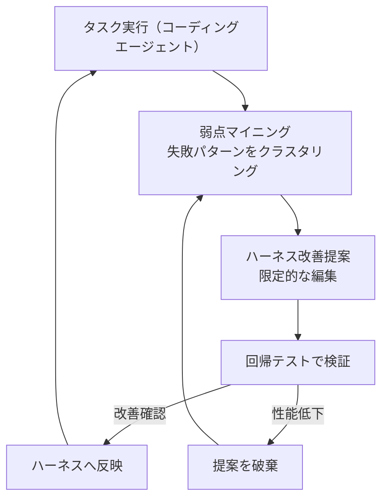
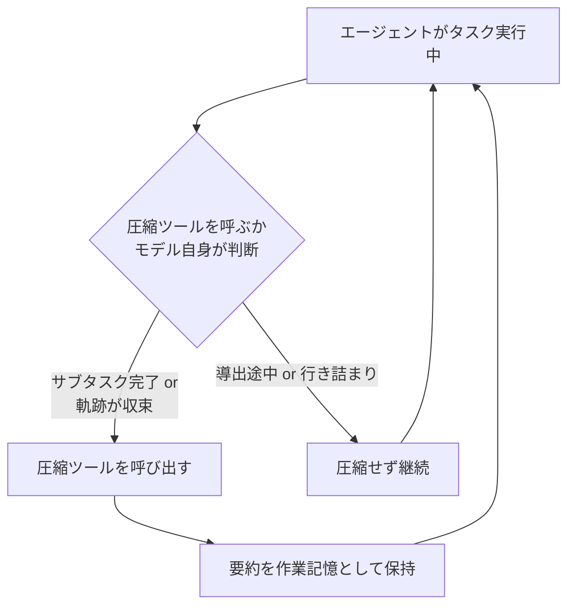
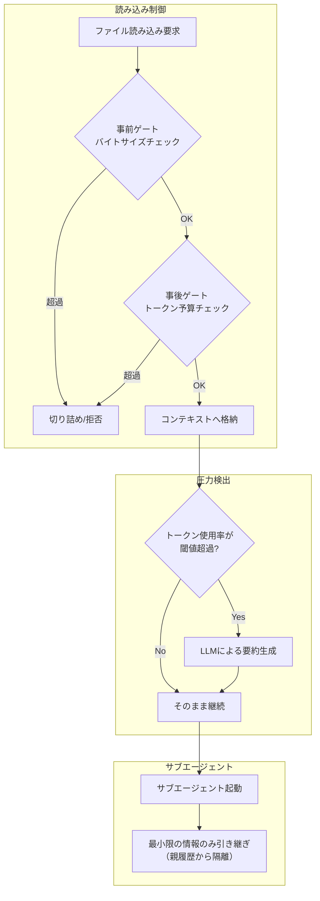

# Daily Briefing 2026-07-14

## 1. 自己改善のためのハーネスエンジニアリング（原題: Harness Engineering for Self-Improvement）

- **URL**: https://lilianweng.github.io/posts/2026-07-04-harness/
- **公開日**: 2026-07-04
- **著者・媒体**: Lilian Weng（個人ブログ Lil'Log）

### 本文翻訳
本稿は「ハーネス」を、基盤モデルを取り巻き、実行を調整し、モデルがどう思考・計画し、ツールを呼び出し、コンテキストを知覚・管理し、成果物を保存し、結果を評価するかを決定するシステムだと定義する。Claude CodeやCodexのような成功したコーディングエージェント製品は、このハーネス設計の質に大きく依存していると指摘する。

前半では3つの基本設計パターンを提示する。パターン1は「ワークフロー自動化」で、計画→実行→観察→改善というループを繰り返す構造。パターン2は「永続メモリとしてのファイルシステム」で、会話履歴に頼らずディスク上のファイルに状態を書き出し、必要な時だけ読み戻す方式。パターン3は「サブエージェントとバックエンドジョブの並列実行」で、コーディングエージェントのケーススタディでは、ファイル読み書き・編集・検索、シェル実行、Git操作、LSP統合、エージェント委譲、バックグラウンドプロセス管理という標準ツールセット（Read, Write, Edit, Bash, Glob, Grep, TodoWrite）が共通して現れることを示す。

後半はハーネス自体を最適化する技術群を整理する。Agentic Context Engineering（ACE）は生成器・リフレクター・キュレーターの3要素で構造化された箇条書き形式のコンテキストを継続的に磨き上げる。Meta Context Engineering（MCE）は内層（訓練データ上でコンテキストを最適化）と外層（検証セット上でスキルを最適化）の二層最適化を行う。Meta-Harnessはハーネス自体のコードを生成するエージェントで、パレート最適境界上の候補を出力する。

自己改善型ハーネスの例としてSelf-Taught Optimizer（STOP）を紹介する。改善関数自体を再帰的に改善する仕組みだが、GPT-3.5のような弱いモデルでは性能低下が観察され、基盤モデルの能力自体が本質的なボトルネックであることが示された。Self-Harnessは弱点マイニング（失敗パターンのクラスタリング）→ハーネス提案（限定的な編集提案）→提案検証（回帰テスト）の3段階ループで構成され、Terminal-Bench-2でモデル固有のハーネス改善を実証した。進化的探索の例としてAlphaEvolve（`# EVOLVE-BLOCK-START/END`マーク内でのコード差分生成とメタプロンプトの共進化）とDarwin Gödel Machine（親エージェント選択確率を性能/子世代数に比例させ、SWE-bench Verifiedで20〜50%向上）を挙げる。モデル重みとハーネスの共同最適化を狙うSIA（Self-Improving AI）は、メタエージェント（初期ハーネス提案）・タスク固有エージェント（実行）・フィードバックエージェント（重み更新かハーネス更新かを判定）の3要素構成だが、実験設計に交絡因子があり証拠は暫定的だとする。

数値例として、PaperBenchでは最良モデル（Claude 3.5 Sonnet）でも21%しか達成できず、RE-Benchでは2時間予算内ならAIが人間の4倍のスコアを出す一方、8時間を超えると人間が上回る逆転が起きる。MLE-benchではo1-preview+AIDEの組み合わせで16.9%がKaggleブロンズメダル相当を達成する。最後に、残存課題として弱く曖昧な評価器、コンテキストとメモリのライフサイクル管理、ネガティブ結果の扱い、多様性の崩壊、報酬ハッキング、長期的成功の測定、人間の関与の7点を挙げ、「人間はループから外れるのではなく、スタックの上位に移動すべきだ。適切なタイミングで適切な抽象度の監督を行うべきである」と結ぶ。

### 重要ポイント
- ハーネス＝実行調整・思考計画・ツール呼び出し・コンテキスト管理・成果物保存・結果評価を担うモデル周辺システム。Claude CodeやCodexの実力はハーネス設計に大きく依存する
- コーディングエージェントの標準ツールセットはRead/Write/Edit/Bash/Glob/Grep/TodoWriteに収束している
- ACE（生成器・リフレクター・キュレーター）やMeta Context Engineering（内層/外層の二層最適化）でハーネス自体を継続的に改善できる
- Self-Harnessは弱点マイニング→ハーネス提案→回帰テストのループでモデル固有の改善を実証（Terminal-Bench-2）
- 弱いモデルでの自己改善は性能低下を招くことがあり、基盤モデルの能力自体がボトルネックになりうる

### 図解


### 現場での適用方法

**CLAUDE.md への追記例**
```markdown
## ハーネス改善ループのルール
- タスク失敗が3回連続で同じパターンに分類される場合、根本原因を
  「プロンプト」「ツール定義」「コンテキスト管理」のどこにあるか切り分けて報告すること
- ハーネス（CLAUDE.md やスキル定義）への変更提案は、必ず既存の回帰テスト
  （直近5件の代表タスク）で before/after を比較してから反映する
- コンテキスト管理はファイルシステムを優先し、会話履歴に長期状態を
  持たせない（永続メモリはファイルへ書き出す）
```

**運用手順（Self-Harness 風の弱点マイニング→改善ループ）**
```bash
# 1. 直近の失敗ログを収集し、失敗パターンをクラスタリング
grep -l "FAILED" ./logs/*.json | xargs -n1 jq '.error_type' | sort | uniq -c | sort -rn

# 2. 頻出パターン上位1件について、ハーネス（CLAUDE.md/skill）への
#    限定的な修正案を作成する（差分は最小限に）

# 3. 直近の代表タスク（回帰テストセット）で before/after を比較
#    改善が確認できた場合のみコミットする
git add CLAUDE.md .claude/skills/
git commit -m "harness: 弱点Xへの対処を追加（回帰テストで確認済み）"
```

### 期待効果
Terminal-Bench-2などのベンチマークでモデル固有のハーネス改善が実証されており、進化的探索（Darwin Gödel Machine）ではSWE-bench Verifiedで20〜50%の性能向上が報告されている。弱点の特定→限定的改善→回帰テストという規律あるループを自チームのハーネス（CLAUDE.md、スキル、ツール定義）に適用することで、場当たり的な指示追加によるコンテキスト肥大化を防ぎつつ、再現性のある改善を積み重ねられる。

### 注意点
弱いモデル・弱い評価器の上で自己改善ループを回すと性能が悪化する場合がある（STOPの実験でGPT-3.5使用時に観察）。改善が「本当の改善」か「評価器へのハッキング」かを見分ける仕組み（回帰テスト、多様なケースでの検証）が不可欠。SIAのような重みとハーネスの共同最適化は実験設計上の交絡因子が指摘されており、まだ確立された手法ではない。

---

## 2. コンテキスト圧縮は閾値ではなく判断であるべき（原題: Context Compaction Is a Decision, Not a Threshold）

- **URL**: https://blakecrosley.com/blog/agent-context-compaction
- **公開日**: 2026-06-23
- **著者・媒体**: Blake Crosley（個人ブログ）

### 本文翻訳
著者はまず典型的な失敗シナリオを描く。長時間動作するエージェントのコンテキストが上限に近づき、スキャフォールド（ハーネス）が到達点を圧縮ノートに要約する。しかしそのタイミングがちょうど未完成の証明や計算の途中だったため、要約は部分的な導出結果を切り捨ててしまい、エージェントは同じ計算をゼロからやり直す羽目になる。

現在の多くのコーディングエージェントは「固定トリガー」でコンテキストを圧縮する。蓄積トークン数が閾値を超えたら要約して続行する、という単純な仕組みだ。しかし著者はこの圧縮コストが構造的な問題だと指摘する。導出（derivation）の途中で圧縮が発火すると、モデルが再発見しなければならない部分的な結果が破棄されてしまう。つまりトークン数という表層的な指標だけでは、「今が要約に適切なタイミングか」を判断できない。

解決策として、2026年の論文「Self-Compacting Language Model Agents」（Li et al., arXiv:2606.23525）で提案されたSelfCompactの手法を紹介する。この手法は二層構造を持つ。第1層は「圧縮ツール」で、モデルが他の一般的なツール（ファイル読み込みや検索など）と同様に、自発的に呼び出せる圧縮機能として提供される。第2層は「ルーブリック（実行判断基準）」で、軽量な指示によって「いつ圧縮するのが適切か」をモデルに教える。具体的には、サブタスクが完了した時点や、軌跡（trajectory）が収束しつつある局面が圧縮に適したタイミングとされ、逆に導出の途中や行き詰まっている状態では圧縮を避けるべきだとされる。

この手法の重要な特徴は、追加のファインチューニングを必要とせず、既存モデルに対してプロンプトとツール提供だけで実装できる点だ。オープンウェイトモデルを含む7つのモデルで検証されており、数学問題では圧縮なしの比較に対して最大18.1ポイントの性能向上、探索型タスクでは5〜9ポイントの向上が報告されている。さらにコスト面でも、固定閾値方式と比較して1問あたり30〜70%の削減が確認された。

著者は実装者への指針として、固定的なトークン数ではなくサブタスク完了などの「セマンティックな境界」を圧縮のトリガーとして活用すべきだと説く。また、圧縮後に同じ作業の繰り返しが観測された場合、それは圧縮タイミングが誤っていた症状だと捉え、監視すべきだとする。結論として、圧縮は「バッファをフラッシュする」機械的な操作ではなく、「作業記憶を管理する」認知的な意思決定として扱われるべきであり、モデルは要約する能力自体は持っているが「いつ要約すべきか」の判断は弱いため、明示的な判断基準（ルーブリック）を与えることが有効だと結んでいる。

### 重要ポイント
- 固定トークン閾値による圧縮は、導出途中の部分的結果を破棄してしまい、エージェントに同じ計算のやり直しを強いる構造的コストがある
- SelfCompact（arXiv:2606.23525）は「圧縮ツール」＋「いつ発火すべきかのルーブリック」の二層構造で、モデル自身に圧縮タイミングを判断させる
- サブタスク完了・軌跡の収束時が圧縮に適したタイミング、導出途中・行き詰まり時は圧縮を避けるべき
- ファインチューニング不要でプロンプト＋ツール提供のみで実装可能。7モデルで検証済み
- 数学問題で最大18.1ポイント、探索型タスクで5〜9ポイントの性能向上、コストは1問あたり30〜70%削減

### 図解


### 現場での適用方法

**CLAUDE.md への追記例**
```markdown
## コンテキスト圧縮の判断基準（セマンティック境界方式）
- トークン数だけを見て機械的に要約しない。以下の条件を満たす
  タイミングでのみコンテキストの圧縮・要約を行うこと：
  - 直前のサブタスク（ファイル1つの実装完了、テスト1件のパス等）が完了した直後
  - 調査・探索が収束し、次の一手が明確になった直後
- 逆に、複雑な導出やデバッグの途中では圧縮を行わないこと
  （途中結果を失うと同じ作業をやり直すことになる）
- 圧縮後に直前と同じ調査・計算を繰り返している場合は、
  圧縮タイミングが不適切だった可能性を報告すること
```

**運用手順（セマンティック境界の監視）**
```bash
# 圧縮イベントの前後でツール呼び出しの重複を検知する簡易チェック
# （同一ファイル・同一コマンドが圧縮後5手以内に再実行されたら警告）
jq -s '
  .[] | select(.event=="compaction") as $c
  | .[] | select(.ts > $c.ts and .ts < ($c.ts + 300) and .tool == $c.last_tool)
' ./logs/session.jsonl
```

### 期待効果
論文の報告値では、数学問題で最大18.1ポイント、探索型タスクで5〜9ポイントの性能向上、コストは固定閾値方式と比較して1問あたり30〜70%削減されている。自チームのエージェント運用でも、機械的なトークン閾値による圧縮を「サブタスク完了時のみ圧縮」というルールに変えるだけで、同じ計算のやり直しによる無駄なトークン消費を減らせる可能性がある。

### 注意点
記事自体には具体的なプロンプト文言やルーブリックの詳細実装は記載されておらず、詳細は原論文（arXiv:2606.23525）を参照する必要がある。「セマンティックな境界」の判定をモデル自身に委ねるため、モデルの判断力が低い場合は狙い通りに機能しない可能性がある。自チームのハーネスに圧縮ツールを追加する場合、既存の固定閾値ロジックとの共存・移行方法を別途設計する必要がある。

---

## 3. エージェントハーネスにおけるコンテキスト管理：メモリ・ファイル・サブエージェント（原題: Context management in agent harnesses: memory, files, and subagents）

- **URL**: https://arize.com/blog/context-management-in-agent-harnesses/
- **公開日**: 2026-04-28
- **著者・媒体**: Aparna Dhinakaran（Arize AI 共同創業者・CPO）／Arize AI ブログ

### 本文翻訳
本稿は「どのエージェントハーネスも同じ限界にぶつかる。コンテキストウィンドウは、モデルが記憶したいと望むすべてを収めるには小さすぎる」という一文から始まる。セッションが長くなるにつれ、会話履歴・ファイル読み込み・ツール結果・サブエージェントの出力が積み重なり、ハーネスは「何を保持し、何を圧縮し、何を後で取得するか」を決めなければならなくなる。この課題を、Pi、OpenClaw、Claude Code、Lettaという4つの実装済みハーネスを横断的に比較することで解き明かす。

まずファイル読み込みの管理を比較する。Piは「2,000行または50KB」というハード上限を設け、先頭を切り詰めた上で継続の通知メッセージを追加する。OpenClawはPiと同様の制限に加え、ブートストラップファイルには12,000文字のキャップ、ツール結果には16,000文字の制限を課す。Claude Codeは「256KBバイトゲート」という二層防御を採用する。第1層はファイルを開く前にstat呼び出しでバイトサイズをチェックする事前ゲート、第2層は読み込んだ内容を25,000トークンの予算でトークン数チェックする事後ゲートだ。デフォルトでは先頭2,000行を読み込み、2,000文字を超える行は切り詰められる。さらにファイルの重複排除も行われる。Lettaはファイル埋め込みとベクトル検索を採用し、open_files、grep_files、semantic_search_filesという複数の専用ツールで必要な部分だけを取得する設計だ。

次にセッション圧縮のメカニズムを比較する。Piはトークン閾値を超えると会話全体を要約し、合成ユーザーメッセージとして会話の先頭に前置する。OpenClawは段階的な多パス要約を行い、ツール呼び出しと結果のペアリングを修復しながら、圧縮前に状態をフラッシュする。Claude Codeは事前クエリ最適化パイプラインを備え、9セクションからなる構造化プロンプトで要約を生成し、圧縮後には直近の重要ファイルを最大5件まで復元する。Lettaは「コンテキスト使用率90%」到達時に発動し、単純なスライディングウィンドウは避けて、会話の先頭30%と末尾30%を保持する方式を採る。

サブエージェントのコンテキスト分離についても、4システムすべてが親セッションから子セッションを隔離する設計を持つ。Piは新規プロセスを起動しタスク文字列のみを渡す。OpenClawはAGENTS.mdやTOOLS.mdなど、フィルタリングされた最小限のファイルセットのみを子に渡す。Claude Codeは通常は空のセッションから開始するが、実験的な「フォークモード」では親の会話履歴をコピーする。Lettaはフォークを行わず、専用の検索ツール経由でのみ親の情報にアクセスさせる。

記事の核心的な主張は、これら4つの独立したハーネスが「示し合わせたわけでもないのに」同一の設計パターンに収束している点にある。共通するパターンは、ファイル読み込みのハード上限、オフセット/リミット方式のページング、ツール結果のサイズ上限、ツール呼び出し/結果ペアの整合性維持、トークン圧力検出とLLMによる要約、そしてサブエージェントの隔離である。記事は「50年間のコンピューティングの歴史が教えてくれたのは、最良のメモリ管理とはプログラムがそれについて考えなくて済む管理だ、ということだ」という一文を引用し、「エージェントハーネスも同じ方向に進んでいる。目標はモデルにすべてを見せることではなく、適切なタイミングで適切な作業セットを与えることだ」と結論づける。

### 重要ポイント
- Pi・OpenClaw・Claude Code・Lettaという独立した4つのハーネスが、ファイル読み込み上限・ページング・要約・サブエージェント隔離という同一パターンに収束している
- Claude Codeは「256KBバイトゲート（事前）＋25,000トークン予算（事後）」の二層防御でファイル読み込みを制御し、デフォルトで先頭2,000行のみを読む
- ツール結果には1ツールあたり50,000文字、1メッセージ集計で200,000文字という上限を課す実装がある
- Lettaはコンテキスト使用率90%到達で圧縮を発動し、単純なスライディングウィンドウではなく先頭30%/末尾30%保持方式を採る
- サブエージェントは全システムで親セッションから隔離され、最小限の情報のみを引き継ぐ設計が共通する

### 図解


### 現場での適用方法

**CLAUDE.md への追記例**
```markdown
## ファイル読み込み・ツール出力のサイズ規律
- ファイルは既定で先頭2,000行のみを読み込む。全文が必要な根拠がない限り
  offset/limit を使った部分読み込みを優先する
- 1つのツール呼び出し結果が50,000文字を超える場合は、全文をコンテキストに
  出力せず、要約とファイルパス（またはgrepでの絞り込み結果）のみを返す
- サブエージェントへの委譲時は、親セッションの会話履歴を丸ごと渡さず、
  タスクの目的・入出力仕様・必要な最小限のファイルパスのみを渡す
```

**運用手順（読み込みサイズのガード導入）**
```bash
# ツール出力サイズの簡易チェック（50,000文字上限の例）
check_output_size() {
  local output="$1"
  local size=${#output}
  if [ "$size" -gt 50000 ]; then
    echo "出力が${size}文字（上限50,000文字超）: 要約して保存してください" >&2
    echo "$output" > /tmp/tool_output_full.txt
    echo "全文は /tmp/tool_output_full.txt に保存済み"
    return 1
  fi
}
```

### 期待効果
4つの独立実装が同一パターンに収束していることから、これらの制御（事前/事後の読み込みゲート、ツール結果の上限、閾値ベースの圧縮、サブエージェント隔離）は特定製品固有の工夫ではなく、コンテキストウィンドウ制約下での汎用的なベストプラクティスだと考えられる。自チームのハーネスにこれらを移植することで、コンテキスト肥大化によるコスト増加と性能劣化（lost-in-the-middle等）を、実装検証済みの手法で予防できる。

### 注意点
本記事はArize AI（オブザーバビリティ製品ベンダー）のブログであり、自社製品Alyxも同じパターンの一例として紹介されている点で、啓発を通じたマーケティング的側面がある。ただし競合であるOpenAI・Anthropic系実装も客観的に比較している点は評価できる。数値（256KBや25,000トークンなど）はArizeが観測・報告した値であり、各ハーネスの公式ドキュメントで一次確認したものではない可能性がある点に留意が必要。
