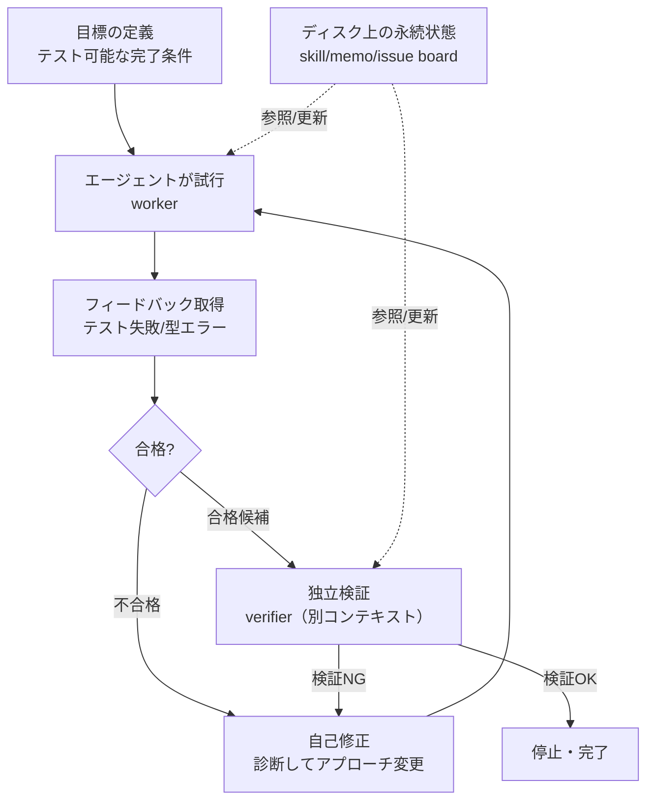
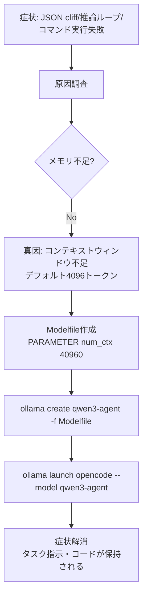
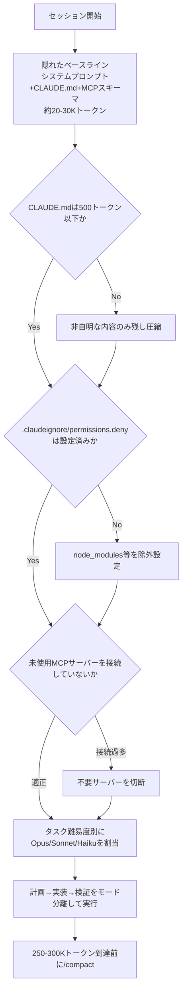

# Daily Briefing 2026-07-15

## 1. ループエンジニアリング：エージェントをプロンプトするのではなく、エージェントをプロンプトするループを設計せよ（原題: Loop Engineering: Designing the System That Drives the Agent Instead of Prompting It）

- **URL**: https://saulius.io/blog/loop-engineering-systems-that-drive-agents
- **公開日**: 2026-06-17
- **著者・媒体**: Saulius（個人ブログ）

### 本文翻訳
著者はまず、コーディングエージェント運用の成熟がもたらす転換を一文で示す。「もうコーディングエージェントにプロンプトを与えるべきではない。エージェントにプロンプトを与えるループを設計すべきだ」。プロンプトエンジニアリング（単一ターンの指示作成）→コンテキストエンジニアリング（モデルが見るデータのキュレーション）→ハーネスエンジニアリング（単一エージェント用の実行環境設計）という進化の先に、「ループエンジニアリング」という第4の規律があると位置づける。ループエンジニアリングは、自律システムの時間軸・検証・フィードバックを設計する行為だと定義される。

コアとなるアーキテクチャは6段階のサイクルとして描かれる。まずテスト可能な「完了」の定義（目標）を立て、エージェントが試行し、テスト失敗や型チェックエラーというフィードバックを受け取り、それをもとに診断してアプローチを変える自己修正を行い、独立したコンテキストを持つ別エージェントが検証し、検証者が合格した場合のみループが停止する。著者はこれを「モデルはエンジンであり、ループはシャーシである」という比喩で表現する。

ループを構成する要素は5つ（自動化・ワークツリー・スキル・コネクタ・サブエージェント）に加え、暗黙の第6要素として「ディスク上の永続的な状態」を挙げる。gitのworktreeで並列実行時の衝突を避け、SKILL.mdで再利用可能な知識を記録し、MCP経由でissue追跡やSlackなどの外部システムに接続し、提案者（worker）と検証者（verifier）をサブエージェントとして分離する。そして「エージェントは忘れるが、リポジトリは忘れない」として、markdownファイルやLinearボードなどディスク上の状態こそが本当の記憶だと説く。

実装イメージとして、Anthropic SDKを使った最小限のPythonスケッチが示される。read_file・write_file・run_testsという3つのツールを持つworkerが、フィードバックに対する自己修正を行いながらテスト合格を目指し、verifierが独立したコンテキストでworkerの要約とテスト結果を5項目のルーブリックで評価し、loop関数がメモリ付きで複数ラウンドを実行する。モデルにはClaude Opus 4.8が使われている。

具体的な応用例として、スケジュール駆動でCI失敗をスキャンし、open issuesを確認し、原因別に分類してドラフトPRを自動作成する「朝のトリアージループ」を紹介する。他にも依存関係更新の互換性テスト自動化、リント修正の自動PR、不安定テストの再現ループ、テストスイートが強い前提でのissueからPRへの自動化などが挙げられる。

著者は5つの失敗モード（コンテキスト喪失、無限リトライ、自己評価のみでの完了判定、セッションを跨いだ再発、停止条件の欠如）とそれぞれへの対策を整理し、ループ化する前のプリフライトチェック（週1回以上の繰り返しか、テストやビルドで悪い出力を機械的に検出できるか、エージェントが実装コードを実行できるか、ハードストップがあるか、マージ前に人間がレビューするか）を提示する。最後に、ループには目標定義の困難さによる報酬ハッキング、夜間無人実行によるコスト爆発、出力増加によるレビュー待ち行列の肥大化、チェック通過だけを目的にした設計軽視、作業内容の理解喪失という危険性があると警告し、「ループは、理解している作業を速く進めるためにも、理解すること自体を避けるためにも使える」と結ぶ。

### 重要ポイント
- プロンプト→コンテキスト→ハーネスに続く第4段階として「ループエンジニアリング」を提唱。中核は「目標→試行→フィードバック→自己修正→独立検証→停止条件」の6段階サイクル
- 提案者（worker）と検証者（verifier）をサブエージェントとして分離し、異なるコンテキストで評価させることが信頼性の鍵
- 「エージェントは忘れるが、リポジトリは忘れない」— ディスク上の永続的な状態（markdown、issue board）が真の記憶となる
- ループ化の判断はプリフライトチェック（週次以上の反復性、機械的な合否判定の有無、ハードストップの有無）で行うべき
- 目標が曖昧なまま自動化すると報酬ハッキングを誘発し、無人実行はコスト爆発とレビュー待ち行列の肥大化を招く

### 図解


### 現場での適用方法

**CLAUDE.md への追記例**
```markdown
## ループ化タスクの判断基準（プリフライトチェック）
以下をすべて満たす作業のみ、自動ループ化（無人実行）の対象として提案してよい：
- 週1回以上の頻度で発生する反復作業であること
- テスト・型チェック・ビルドなど機械的に合否判定できる基準があること
- エージェントが実装コードを直接実行できる権限を持つこと
- 最大反復回数・トークン予算などのハードストップを設定していること
- 生成物はマージ前に必ず人間がレビューすること
上記を満たさない一度限りの作業は、通常のプロンプト単発実行として扱うこと。
```

**運用手順（worker/verifier分離のループ導入）**
```bash
# 1. worker用スキルとverifier用スキルを分離して用意する
mkdir -p .claude/skills/loop-worker .claude/skills/loop-verifier

# 2. worker: フィードバックを受けて自己修正するループを実行
#    （例: CI失敗トリアージ）
gh issue list --state open --label ci-failure --json number,title > /tmp/ci_issues.json

# 3. verifier: workerとは独立したコンテキスト（別セッション/別エージェント）で
#    ルーブリック評価を行い、合格時のみ次のステップ（PR作成）へ進む
#    停止条件: 最大反復回数(例: 5) or トークン予算(例: 200K)に到達したら必ず停止する
```

### 期待効果
ループ化により、CI失敗トリアージや依存関係更新といった反復作業を無人で回せるようになり、人手による定型対応の工数を削減できる。提案者と検証者を分離することで、自己評価のみによる「完了」誤判定を防ぎ、品質を保ったまま自動化の範囲を広げられる。ディスク上の永続状態を活用することで、セッションを跨いだ学習内容の喪失も防止できる。

### 注意点
目標定義があいまいなままループ化すると、テストは通るが本来の意図を満たさない「報酬ハッキング」的な出力が生まれやすい。夜間無人実行は監視が薄くなりがちで、トークン消費が予想を超えて膨らむリスクがある。生成物の増加は人間側のレビュー負荷を増やし、レビューがボトルネック化する恐れがある。ループの利便性に頼りすぎると、チームが作業内容そのものへの理解を失うリスクも著者は指摘している。

---

## 2. Ollama＋OpenCodeでのローカルLLMコンテキスト最適化（原題: Optimizing Local LLM Context for Agentic Coding with Ollama and OpenCode）

- **URL**: https://tkamucheka.github.io/blog/2026/02/15/opencode-ollama-integration/
- **公開日**: 2026-02-15
- **著者・媒体**: Tendayi Kamucheka（アーカンソー大学コンピュータ工学博士課程候補・個人技術ブログ）

### 本文翻訳
著者はOpenCodeとOllamaを組み合わせてローカルのエージェント型コーディング環境を構築した際、モデルが期待通りに動作しない問題に繰り返し直面した経験を報告する。表面的には「JSON cliff」（短いJSON応答を返した直後に突然沈黙する現象）、推論ループ（タスクの指定があるにもかかわらず「タスクが未指定だ」とモデルが主張し続ける現象）、実行権限の問題（`ls`や`git`コマンドの実行が失敗する）など、一見バラバラな症状として現れた。

著者はこれらの根本原因を調査し、真の犯人は「メモリ不足」ではなく「コンテキストウィンドウの制限」だと突き止める。Ollamaはデフォルトで4,096トークンという小さなコンテキストウィンドウを使用しており、OpenCodeのようなエージェント型エディタと組み合わせると、この4,096トークンを会話履歴・利用可能なツール一覧・システムプロンプト・実際のコードが奪い合うことになる。ツール定義とシステムプロンプトだけで数千トークンを消費するため、実質的にコードやタスク指示に残されるコンテキストがほとんど無くなり、モデルは自分に与えられたタスクの詳細を「見失う」。これが推論ループやJSON cliffの正体だったと説明する。

解決策として、Ollamaのカスタムモデル定義ファイル（Modelfile）を用いてコンテキストウィンドウサイズを明示的に拡張する方法を提示する。手順は、まずベースモデルを指定し`num_ctx`パラメータでウィンドウサイズを指定したModelfileを作成し、`ollama create`でカスタムモデルとしてビルドし、`ollama launch opencode --model <カスタムモデル名>`でそのモデルを指定してOpenCodeを起動する、という3ステップだ。

著者自身の環境では、ベースモデルとしてqwen3:14b（約9GB）を採用し、これを土台にqwen3-agentというカスタムモデルを作成した。コンテキストサイズは40,960トークンに設定しており、これがqwen3:14bにとっての「スイートスポット」だと述べる。それ以上の値を設定すると、環境によってはデフォルト値に戻ってしまう現象も観測されたという。この設定でVRAM使用量は約16GBとなり、20GB搭載環境で問題なく運用できている。

著者は、ローカルLLMをエージェント型コーディングに使う際にまず疑うべきはモデルの能力ではなく、実行系のコンテキストウィンドウ設定であるという教訓を強調して記事を締めくくる。

### 重要ポイント
- ローカルエージェント環境での「JSON cliffで応答が止まる」「タスクが未指定だと主張し続ける」「コマンド実行が失敗する」といった一見バラバラな症状は、コンテキストウィンドウ不足という単一の根本原因に起因することが多い
- Ollamaのデフォルトコンテキストウィンドウはわずか4,096トークンで、エージェント型エディタのツール定義・システムプロンプトだけで大半を消費してしまう
- Modelfileに`PARAMETER num_ctx <サイズ>`を追加し`ollama create`でカスタムモデルをビルドすることで、コンテキストウィンドウを拡張できる
- 著者の環境ではqwen3:14bに対して40,960トークンが「スイートスポット」で、それ以上は環境によりデフォルトに巻き戻る場合がある
- コンテキストウィンドウ拡張はVRAM使用量とのトレードオフであり、著者の設定では約16GBのVRAMを要した

### 図解


### 現場での適用方法

**スクリプト化の例（カスタムModelfile作成と起動）**
```bash
# 1. カスタムModelfileを作成（ベースモデルとコンテキストサイズを指定）
cat <<'EOF' > Modelfile
FROM qwen3:14b
PARAMETER num_ctx 40960
EOF

# 2. カスタムモデルとしてビルド
ollama create qwen3-agent -f Modelfile

# 3. OpenCodeをこのカスタムモデルで起動
ollama launch opencode --model qwen3-agent
```

**CLAUDE.md（ローカルLLM運用ドキュメント）への追記例**
```markdown
## ローカルLLM（Ollama）でエージェントが不安定な場合のチェック手順
- 症状（JSON応答後に沈黙する、タスク未指定だと繰り返し主張する、
  ls/git等のコマンド実行が失敗する）が出たら、まずメモリではなく
  コンテキストウィンドウ設定（num_ctx）を疑うこと
- デフォルトの4,096トークンはエージェント型ツール利用には不足するため、
  Modelfileでnum_ctxを明示的に拡大したカスタムモデルを使用すること
- モデルサイズごとに「スイートスポット」（それ以上はデフォルトに巻き戻る
  上限値）があるため、拡大後は必ず動作確認すること
```

### 期待効果
コンテキストウィンドウをタスクに見合った値（例: qwen3:14bで40,960トークン）に拡張することで、JSON cliffや推論ループといった不可解な失敗を解消でき、ローカルLLM環境でもツール呼び出し・複数ファイル編集を伴うエージェント型コーディングが安定して機能するようになる。クラウドAPI利用不可・機密コード保護が必要な現場でのローカルLLM導入時に、原因切り分けの時間を大幅に短縮できる。

### 注意点
コンテキストウィンドウの拡大はVRAM消費量の増加と直結するため、GPU搭載メモリに応じた上限がある（著者環境では約16GB）。また「スイートスポット」を超える値を設定すると環境によってはデフォルト値に静かに巻き戻る現象が観測されており、設定値が実際に反映されているかは`/context`相当の確認手段で都度検証する必要がある。この記事の数値（40,960トークンなど）はqwen3:14bという特定モデル・特定環境での実測値であり、他のモデルやハードウェアではスイートスポットが異なる点に留意する。

---

## 3. Claude Codeのトークン消費を削減する12の方法（原題: 12 Ways to Cut Token Consumption in Claude Code）

- **URL**: https://www.firecrawl.dev/blog/claude-code-token-efficiency
- **公開日**: 2026-06-05
- **著者・媒体**: Hiba Fathima（Firecrawl ブログ）

### 本文翻訳
記事はまず、Claude Codeのセッションが「hi」という一言のプロンプトだけで約31,000トークンを消費する実例を示し、その正体がシステムプロンプト・CLAUDE.md・メモリファイル・MCPサーバーのツールスキーマといった「隠れたベースライン」だと説明する。`/context`でコンポーネント別のトークン数、`/usage`で消費状況、`/memory`でロード済みファイルを確認できるとし、300,000～400,000トークンを超えたあたりから「コンテキスト腐敗（context rot）」が起きやすくなると警告する。

続いて12の具体的な削減手法を提示する。まず生のウェブページ取得は実コンテンツに対して十数倍のトークンを無駄にしており、クリーンなデータ抽出で94%の削減が可能だとする（中央値38,381トークン→2,788トークン）。次にCLAUDE.md自体を500トークン以下に削減する重要性を説く。全メッセージに同梱されるため最もコストの高いファイルであり、3,847トークン版と312トークン版を比較したベンチマークでは品質を落とさず91.9%の削減を達成し、月額500ドルのAPI支出の場合で約460ドルの節約になったという。削減対象はフレームワーク標準の慣習やコードから推測可能な内容、保持すべきはビルド・テストコマンドやプロジェクト固有の非自明な制約だとする。

`.claudeignore`（勧告的）と`.claude/settings.json`の`permissions.deny`（強制的）は役割が異なり、両方を併用すべきだとし、`.claudeignore`だけの導入でも85.5%のコンテキスト削減が確認されたベンチマークを紹介する。また`.claude/rules/`にパススコープ付きのfront matter（`paths:`）を付けてルールを配置すれば、無関係な作業中はそのルールが読み込まれず、ある実例では常時ロード行数を1,358行から807行へ41%削減できたとする。

ツール出力についても、生ログをそのままモデルに読ませず`grep`等で事前にフィルタリングすることで80〜99%の圧縮が可能だとし、Rust製CLIプロキシ「RTK」（git/npm/ビルドログを80〜99%圧縮）や、localhostプロキシ「Headroom」（約34%圧縮）といった自動化ツールも紹介する。プロンプト自体も曖昧な質問ではなくスコープと制約を明示した指示に変えることでトークン消費の乗数効果を避けられるとし、「アーキテクチャを再設計しない」「基本は説明しない」といった否定形の制約列挙が有効だとする。

さらに、計画→実装→検証のモードを混在させず分離することで14%のトークン削減・9%のコスト低減がベンチマークで確認されたこと、MCPサーバー1つあたり10,000〜20,000トークンのスキーマが未使用でも常時ロードされること（複数接続で50,000〜70,000トークンの無音負荷になりうる）、タスクの難易度に応じてOpus/Sonnet/Haikuを使い分けることで最大75%のコスト削減が可能なことを解説する。`/compact`は250,000〜300,000トークン到達前に保持したい情報を明示して事前実行すべきこと、`/rewind`は失敗した試みをコンテキストから完全に削除する用途に使えること、`/clear`前にsession-handoff.mdへ目標・変更ファイル・決定事項・失敗テスト・次のステップを書き出しておく引き継ぎワークフローも紹介する。最後に、スキルはセッション開始時に名前と説明（30〜100トークン）だけが読み込まれ本体は必要時のみ展開されるため、CLAUDE.mdから溢れた内容の避難先として活用できるとし、説明文の精度がスキルの発見性を左右すると強調する。記事は「エントロピーはコンテキストに宿り、コンテキストのエントロピーは応答に表れる」という一文で締めくくられる。

### 重要ポイント
- Claude Codeはセッション開始だけで20,000〜30,000トークンを消費する「隠れたベースライン」があり、`/context`・`/usage`・`/memory`で可視化できる
- CLAUDE.mdを500トークン以下に絞ることが単一ファイルとしては最大の削減効果（実例で91.9%削減、月額460ドル相当の節約）
- `.claudeignore`（勧告）と`permissions.deny`（強制）は別物で併用が必要。`.claudeignore`単体でも85.5%の削減効果が確認されている
- MCPサーバーは未使用でも1台あたり10,000〜20,000トークンのスキーマを常時ロードするため、接続数の見直しだけでも効果が大きい
- タスク難易度に応じたOpus/Sonnet/Haikuのモデル使い分けで最大75%のコスト削減、計画/実装/検証のモード分離で14%のトークン削減が確認されている

### 図解


### 現場での適用方法

**運用手順（コンテキスト節約チェックリストの導入）**
```bash
# 1. 現状のコンテキスト消費を可視化
#    Claude Code内で /context, /usage, /memory を実行して確認

# 2. .claudeignore と permissions.deny を両方設定する
cat <<'EOF' > .claudeignore
node_modules/
dist/
build/
.next/
__pycache__/
*.lock
coverage/
EOF
```

```json
// .claude/settings.json
{
  "permissions": {
    "deny": ["Read(node_modules/**)", "Read(dist/**)", "Read(*.lock)"]
  }
}
```

```markdown
<!-- .claude/rules/api-rules.md: パススコープ付きルールでフロントエンド作業時の無駄読み込みを防ぐ -->
---
paths:
  - "src/api/**/*.ts"
---
# API層ルール
（ここに規約を記述）
```

**CLAUDE.md への追記例**
```markdown
## コンテキスト節約の運用ルール
- CLAUDE.mdは500トークン以下を目安とし、コードから推測可能な内容
  （フレームワーク標準の慣習等）は書かない。書くのはビルド/テスト
  コマンドと非自明なアーキテクチャ上の制約のみ
- ツール出力をそのまま貼らず、grep等で関連行のみに絞ってから提示する
  （例: npm test 2>&1 | grep -A5 -E "FAIL|ERROR" | head -100）
- サブタスク（ログ確認・ボイラープレート生成等）はHaiku、通常の実装は
  Sonnet、複雑な設計判断や複数回失敗した問題のみOpusを使う
- 250,000〜300,000トークンに達する前に、保持したい情報（現在の
  アプローチ、変更ファイル一覧）を明示して /compact を実行する
```

### 期待効果
記事内のベンチマークでは、CLAUDE.md圧縮で91.9%、`.claudeignore`導入で85.5%、ツール出力フィルタリングで80〜99%のコンテキスト削減が報告されており、モデルの使い分けでは最大75%のコスト削減も見込めるとされる。これらを組み合わせることで、月額数百ドル規模のAPI利用コストを大きく圧縮しつつ、コンテキスト腐敗による応答品質の劣化も防げる可能性がある。

### 注意点
本記事はウェブスクレイピングサービスFirecrawlのブログであり、手法2（クリーンなウェブデータ抽出）は自社製品の宣伝を兼ねている点に注意が必要。紹介されている数値（91.9%、85.5%等）の一部は外部ベンチマークやHacker News上のユーザー報告の引用であり、著者自身が一次計測したものではない可能性がある。MCPサーバーの切断やモデル切り替えは、機能面・プロンプトキャッシュの有効性とのトレードオフを伴うため、削減効果だけでなく実作業への影響も併せて確認する必要がある。
