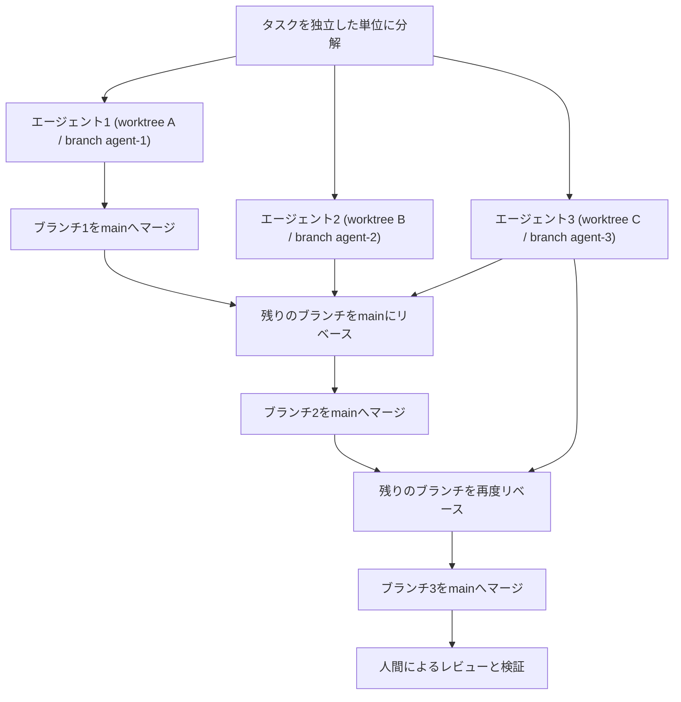
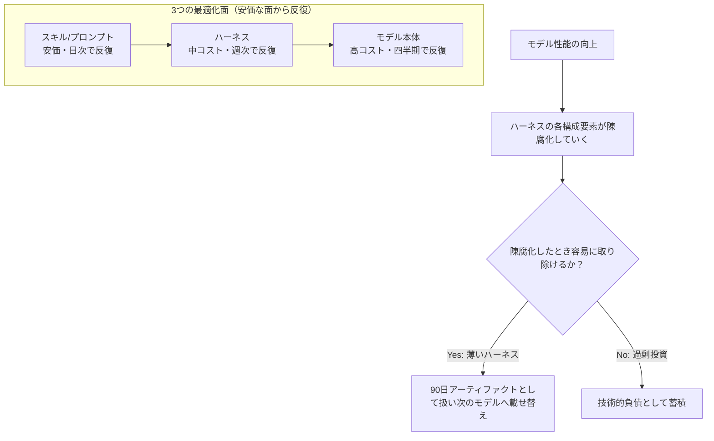
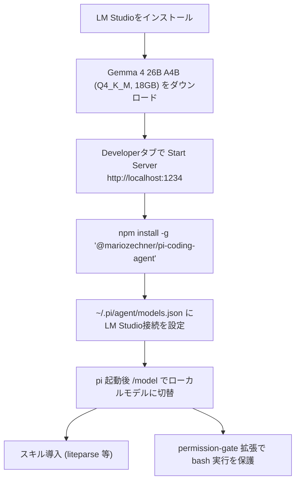

# Daily Briefing 2026-07-16

## 1. AIコーディングエージェントを並列実行する（原題: Running Multiple AI Coding Agents in Parallel）

- **URL**: https://zenvanriel.com/ai-engineer-blog/running-multiple-ai-coding-agents-parallel/
- **公開日**: 2026-07-07
- **著者・媒体**: Zen van Riel（Senior AI Engineer、元Microsoft・GitHub所属）個人ブログ

### 本文翻訳
複数のAIコーディングエージェントを並列実行するのは究極の生産性向上策に見える。Claude Codeを5インスタンス立ち上げてプロジェクトに向ければ、コードベースが5倍速で成長する——そう考えたくなる。しかし現実は違う。適切な構造なしに並列エージェントを走らせると、マージコンフリクト、作業の重複、時間の浪費が積み重なり、並列化前より遅くなることさえある。

素朴な並列化がうまくいかない理由は3つある。第一に「ファイルの衝突」。2つのエージェントが同じ設定ファイル、同じルーティングテーブル、同じコンポーネントレジストリを触る変更を加えると、解消が苦痛なコンフリクトが発生する。第二に「コンテキストの盲目性」。各エージェントは他のエージェントの同時作業を知らないまま、古いコードベース状態を前提に動く。第三に「連鎖的な破壊」。あるエージェントの変更が別のエージェントの前提を無効化し、個々には検証済みでも統合すると壊れる。

解決策は、各エージェントに専用の隔離されたブランチ——典型的にはGit worktreeを割り当てることだ。エージェント間のリアルタイムの干渉がなくなり、離散的な変更を示すクリーンでレビュー可能な差分が得られ、マージを人間の裁量でコントロールできる。これはチーム開発でフィーチャーブランチが並列開発の混沌を防ぐのと同じ発想である。

マージコンフリクトの扱いは4段階で行う。(1) 順次マージ：1つのエージェントの作業をマージし、残りのブランチを更新後のmainにリベースする。(2) 単純なコンフリクトはAIに解決させる：リストへの追加など。(3) 複雑なコンフリクトは人間が判断する：アーキテクチャレベルの根本的な不一致。(4) マージ前に各ブランチが動作することをテストで確認する。

著者が最も強調するのは「人間のループがすべて」という点だ。並列AIコーディングは自分をプロセスから排除することではない。書き手からレビュアーへと自分の役割を再配置することだ。人間によるレビューの工程こそが、質の高いソフトウェア開発と技術的負債の蓄積を分けるものである。

実践への落とし込みとして、著者は次を勧める。まず2エージェント、明確に独立したタスク・別ファイルから始めること。複数の機能が修正しうる「中核となる共有ファイル」を事前に特定しておくこと。かんばんボードのような可視化ツールでワークフローの状態を追跡すること。基本を習得してから、より大規模な運用へ進むこと。

### 重要ポイント
- 素朴な並列実行は「ファイル衝突」「コンテキストの盲目性」「連鎖的破壊」の3つで失敗する
- Git worktreeで各エージェントに隔離された作業空間（専用ブランチ・専用ディレクトリ）を与えるのが鍵
- マージは同時ではなく順次に行い、都度残りのブランチをmainにリベースする
- 単純なコンフリクトはAIに、アーキテクチャ判断は人間に委ねる
- 人間の役割は「執筆者」から「レビュアー・統合者」へシフトする

### 図解


### 現場での適用方法

**スクリプト化: 並列エージェント用のworktreeセットアップ**
```bash
#!/usr/bin/env bash
# setup-parallel-agents.sh: 複数エージェント用のworktreeを作成する
set -euo pipefail

REPO_PATH="<REPO_PATH>"
TASKS=("feature-auth" "feature-search" "feature-billing")

cd "$REPO_PATH"
git fetch origin main

for task in "${TASKS[@]}"; do
  worktree_dir="../$(basename "$REPO_PATH")-${task}"
  git worktree add "$worktree_dir" -b "agent/${task}" origin/main
  echo "worktree ready: ${worktree_dir} (branch agent/${task})"
done
```

**CLAUDE.md への追記例**
```markdown
## 並列エージェント運用ルール
- 複数エージェントに同時作業させる場合は、必ず `git worktree add` で専用ディレクトリ・専用ブランチを割り当てる
- 共有設定ファイル（例: routes.ts, config/registry.json）を触るタスクは同時に複数エージェントへ割り当てない
- マージは同時に行わず、1エージェント分ずつ順にマージ→残りをmainにリベースする
- 単純なコンフリクト（リスト追加等）はAIに解決させてよいが、アーキテクチャに関わるコンフリクトは必ず人間が判断する
```

### 期待効果
複数機能を同時に開発できるため出力量が増え、エージェントごとの差分が離散化されることでレビューがしやすくなる。記事中に定量的な数値は示されておらず、効果は定性的な記述にとどまる。

### 注意点
Git worktreeの運用自体に学習コストがある。共有される中核ファイルを事前に特定しておかないと衝突が頻発する。いきなり多数のエージェントを並列化せず、2エージェント・独立タスクから始めるべき。マージ前の人間によるレビューを省略すると技術的負債が蓄積するため、完全自動化を狙う手法ではない。

---

## 2. AIシステムの隠れた技術的負債：エージェントハーネス（原題: Hidden Technical Debt of AI Systems: Agent Harness）

- **URL**: https://leehanchung.github.io/blogs/2026/05/08/hidden-technical-debt-agent-harness/
- **公開日**: 2026-05-08
- **著者・媒体**: Han Lee 個人ブログ

### 本文翻訳
エージェントハーネスとは、モデルと実行環境をつなぐオーケストレーション層であり、システムプロンプト、ツール群のスキーマと説明、ロールアウト方式（単発、ReAct、plan-and-executeなど）、コンテキストマネージャ、メモリ、サブエージェントのトポロジー、ガードレール、検証器・審査器、可観測性基盤から構成される。著者Han Leeの中心的主張は、モデルが向上するにつれてハーネスの大部分は陳腐化する運命にあり、恒久的なインフラではなく一時的な技術的負債として扱うべき、というものだ。「モデル単体では、命令やツールをオーケストレーションするOSがなければ役に立たない」という比喩を用いる。

Birgitta Böckelerの枠組みに従い、著者は「インナーハーネス」（Claude Agent SDKやCursorのAutoなど、モデル提供者が出荷するもの）と「アウターハーネス」（AGENTS.md、MCPサーバー、独自スキルなど、利用者側が組み立てる層）を区別する。両者は異なるペースで進化し、異なる種類の技術的負債を蓄積する。

訓練用ハーネスと本番用ハーネスは非対称であるべきだと著者は強調する。訓練では行動空間は最大化され、ツールは生でスキーマも広く、失敗はシグナルとして歓迎され、ネットワークはオフラインまたは記録済み、検証はプログラム的でスケーラブルだ。対して本番では行動空間は許可リストで最小化され、ツールはラップされスコープ化され、失敗は抑制ないしフェイルクローズされ、ネットワークは本番かつ厳格な送信制御下にあり、検証は決定論的または人間参加型になる。「訓練用ハーネスを単純に薄めたものを本番ハーネスにしてはいけない、その逆も同様」というのが原則だ。

第一者（モデル提供元純正）ハーネスは同一モデルでも第三者ハーネスより一貫して高いベンチマーク成績を示す実証研究がある一方、Letta Codeの例は例外を示す——特定の軸（メモリ）に大きく投資した第三者ハーネスは、Opus 4.5上でLetta Codeが59.1%、Claude Codeが41.6%という具体的な差でネイティブハーネスを上回った。ハーネスは「荷重を支える」構造であり、意図的な投資軸の選択が結果を左右する。

アライメントについては「外側からの制約（許可リスト、フィルタ、ゲート）」と「内側への内在化（報酬設計によるモデル自身への行動の学習）」を対比し、いずれも「形作られていない振る舞いの周りの柵に過ぎず、十分に能力の高いエージェントはいずれ柵が誤っている構成を見つけ出す」と警告する。訓練に本番の許可リストを持ち込みすぎると、モデルは復旧戦略を学習できなくなり、逆に本番に訓練時の野放しなエージェントをそのまま出荷するのも失敗する。

Suttonの「苦い教訓」をハーネスに適用し、人間の想定をコード化した仕組みより汎用計算を活用する手法が最終的に勝るとする。ノーコードのワークフロービルダーは「手順の再現性」しか与えず「出力の質」は与えなかった。ツールラッパーは不要になりつつある——Browser Useは、モデルが1万件のDOMバグスレッドを読み込んでいるためChromeのDevTools Protocolすらラップしない。planner-executorの分業も、単一のエージェント的思考モデルが内部で計画と行動を織り込むようになれば不要になる。メモリ層もベクトルストアより「progress.md」とgit logの組み合わせで十分になりつつある。

著者はスキル・プロンプト（安価・時間〜日単位で反復）、ハーネス（中コスト・日〜週単位）、モデル（高コスト・四半期単位）という3つの最適化面を提示し、「最も安価な面に作業を押し出せ、ハーネスは薄く、意図的に未規定な最小限のプリミティブの集合に保て」と説く。Meta-HarnessやAutoHarnessのような自動最適化ハーネスは訓練分布に局所最適化し、訓練・本番間のスキューを広げるため、自動最適化や独自仕様のハーネスを本番投入することは技術的負債の蓄積そのものだと警告する。

最終的な設計原則は、ハーネスの各構成要素について「モデルが向上してこれが不要になったとき、取り除くのは容易か」を常に問うことだ。Browser Useの自己修復ハーネス（エージェントが実行時に自分の補助コードをSKILL.mdの指示に基づき書き換える）が極限の例であり、ハーネスは「凍結された表面ではなく出発点」になる。著者は、アプリケーション向けの足場を「90日で使い捨てるアーティファクト」として扱い、モデルのリリースごとに躊躇なく捨てられるようコードベースと組織を設計せよと結論づける。

### 重要ポイント
- ハーネスは一時的な技術的負債であり、恒久資産として設計してはならない
- 訓練用ハーネスと本番用ハーネスは行動空間・失敗の扱い・検証方式などで意図的に非対称にすべき
- 投資軸次第で第三者ハーネスが純正ハーネスを上回れる（Letta Code 59.1% vs Claude Code 41.6%、Opus 4.5上）
- 最適化はスキル→ハーネス→モデルの順で、最も安価に反復できる面へ押し出す
- 各ハーネス構成要素は「モデル陳腐化時に取り除く容易さ」を基準に設計すべき

### 図解


### 現場での適用方法

**CLAUDE.md への追記例**
```markdown
## ハーネス設計方針（技術的負債レビュー）
- 新しいツール・ガードレール・サブエージェントを追加する前に「モデルが賢くなったら1時間で削除できるか？」を自問する
- 削除に1週間以上かかりそうな仕組みは導入しない。導入する場合は README/ADR に "90日で見直す" 期限を明記する
- 訓練・検証用の緩い許可リストを、そのまま本番の許可リストに転用しない。本番用は明示的なallowlistに絞る
- 四半期ごとに「このツールラッパー/メモリ層/サブエージェントは最新モデルでも依然として必要か」を棚卸しする
```

**運用手順: ハーネス棚卸しの実施ステップ**
```bash
# 1. 現行ハーネスの構成要素を列挙する（例）
#    - system prompt / tool schemas / memory / sub-agents / guardrails
# 2. 各要素について「陳腐化時の除去コスト」をREADMEに1行で記録する
echo "component: vector-store-memory, removal_cost: ~1 week, review_by: 2026-10-01" >> HARNESS_DEBT.md

# 3. 四半期レビューで removal_cost が高い項目を優先的に単純化する
grep "removal_cost: ~1 week\|removal_cost: >1" HARNESS_DEBT.md
```

### 期待効果
ハーネス各要素の陳腐化・除去コストを事前に見積もることで、モデル更新のたびに足場を作り直すコストを抑えられる。記事中の唯一の定量データはLetta Code対Claude Codeの59.1%対41.6%（Opus 4.5、投資軸選択の効果であり薄型化そのものの効果ではない点に留意）。

### 注意点
「薄いハーネス」原則を機械的に適用すると、本番で本当に必要なガードレールまで削ってしまうリスクがある。モデルの実際の進化速度を見誤ると、有用な仕組みを時期尚早に廃棄する恐れもある。訓練ハーネスと本番ハーネスを同一視しないという前提そのものが、チームの合意形成を必要とする。

---

## 3. Gemma 4とPiでローカルコーディングエージェントを動かす（原題: Running a Local Coding Agent with Gemma 4 and Pi）

- **URL**: https://patloeber.com/gemma-4-pi-agent/
- **公開日**: 2026-04-27
- **著者・媒体**: Patrick Loeber 個人ブログ

### 本文翻訳
著者はLM Studio、Piエージェントフレームワーク、Gemma 4 26B A4B（Q4_K_M量子化）を組み合わせたローカルコーディングエージェントの構築手順を紹介する。この組み合わせは「驚くほどうまく機能する」という。

まずLM Studioをローカルサーバーとして導入する。デスクトップアプリがモデルのダウンロード・量子化を扱い、OpenAI互換APIを公開する。OllamaやllamaCppでも同様に動作し、Piはどのサーバーを使うかに依存しない。

次にGemma 4をダウンロードする。GoogleがApache 2.0ライセンスで公開した最新のオープンウェイトモデル群で、ネイティブな関数呼び出し、システムプロンプト対応、コーディングエージェント向けの思考モードを備える。ラインナップはE2B（Dense, 128Kコンテキスト）、E4B（Dense, 128K）、26B A4B（Mixture of Experts, 256K）、31B（Dense, 256K）。著者は26B A4Bを推奨する。トークンあたり4Bパラメータしか活性化しないため、大規模モデル相当の品質を保ちながら推論速度は小型モデル並みになる。量子化はQ4_K_M（18GB、バランス重視）、Q6_K（24GB、高品質）、Q8_0（28GB、ほぼ無劣化）から選べる。ただし4Bしか活性化しなくても高速なルーティングのため26B全パラメータをメモリに載せる必要があり、VRAM要件は26BのDenseモデルとほぼ同等になる点に注意が必要だ。

LM StudioのDeveloperタブでダウンロード済みのGemma 4を選び、Start Serverをクリックするとデフォルトで`http://localhost:1234`にOpenAI互換APIサーバーが立ち上がる。`curl http://localhost:1234/v1/models`で疎通確認できる。

コンテキストサイズはVRAM使用量に直結する。用途別の目安は、単一ファイルの小規模編集なら16K（追加VRAM約1GB）、標準的なコーディングセッションなら64K（約4GB）、複数ファイルのリファクタリングなら128K（約8GB）、リポジトリ全体を扱うなら256K（約16GB）。VRAMが許すなら128Kを推奨する——コーディングエージェントはセッション中にコンテキストを大量に蓄積する傾向があるためだ。Piはセッション管理コマンドとして`/compact`（古いメッセージを要約してコンテキストを解放）、`/new`（新規セッション開始）、`/tree`（セッション履歴をたどり過去地点に戻る）、`/fork`（過去のメッセージから新セッションを分岐）を備える。GPU Offload設定はGPUとシステムRAM間のレイヤー配分を制御し、著者は26B A4Bで最大値を維持している。

Piは Mario Zechnerによる「最小限のターミナル・コーディングハーネス」で、read・write・edit・bashの4つのコアツールのみを提供する。導入は`npm install -g @mariozechner/pi-coding-agent`。ローカルモデルを使うには`~/.pi/agent/models.json`にLM Studioのbase URL（`http://localhost:1234/v1`）、API種別`openai-completions`、モデルIDを記述する。モデルIDはLM StudioのサーバータブでOpen表示されている名前と一致させる必要がある。Pi起動後は`/model`でローカルモデルに切り替える。

スキルはAgent Skills標準に準拠したMarkdownベースの能力パッケージで、`git clone https://github.com/badlogic/pi-skills ~/.pi/agent/skills/pi-skills`（ユーザーレベル）または`.pi/skills/pi-skills`（プロジェクトレベル）で導入できる。推奨スキルはliteparse（PDF/DOCX/PPTXの高速ローカル解析、Gemma向けに画像互換形式へ変換）、frontend-slides（HTMLプレゼン作成）、grill-me（アイデアの反復検討）など。セッション中は`/skill:name`で呼び出すか、エージェントによる自動発見に任せる。

拡張機能はカスタムツール・コマンド・UI・権限ゲート・サブエージェントを提供するTypeScriptモジュールだ。著者は重要な警告を発する——「Piはデフォルトでbashコマンドを確認なしに実行するYOLOモードで動く」。危険なコマンド実行前に確認を挟むpermission-gate拡張を`pi --extension examples/extensions/permission-gate.ts`で有効化するか、`~/.pi/agent/extensions/`に配置して自動読み込みさせることを勧める。コンテナ実行のccoやサンドボックス拡張も代替のセキュリティ手段として挙げられている。

著者はこの構成を「驚くほど有能なワークフロー」とまとめ、最大の利点は「すべてが自分のハードウェア上で完結すること」だとしている。

### 重要ポイント
- LM Studio + Gemma 4 26B A4B（Q4_K_M量子化、18GB）+ Piエージェントというオール・ローカル構成
- 26B A4BはMoEでトークンあたり4Bしか活性化しないが、高速ルーティングのためVRAM要件は26B Dense相当
- コンテキストサイズは用途別に16K〜256Kを使い分け、VRAMが許せば128Kを推奨
- Piはread/write/edit/bashの4ツールのみのミニマルなハーネスで、スキル・拡張機能で機能を追加する
- デフォルトはbashコマンドを無確認実行する「YOLOモード」のため、permission-gate等の導入が事実上必須

### 図解


### 現場での適用方法

**スクリプト化: ローカルコーディングエージェントのセットアップ**
```bash
#!/usr/bin/env bash
# setup-local-coding-agent.sh
set -euo pipefail

# 1. Pi エージェントをインストール
npm install -g @mariozechner/pi-coding-agent

# 2. LM Studio 接続設定を書き込む（LM Studio側でGemma 4 26B A4Bを起動済みであること）
mkdir -p ~/.pi/agent
cat > ~/.pi/agent/models.json <<'JSON'
{
  "providers": {
    "lmstudio": {
      "baseUrl": "http://localhost:1234/v1",
      "api": "openai-completions",
      "apiKey": "lm-studio",
      "models": [
        { "id": "google/gemma-4-26b-a4b", "input": ["text", "image"] }
      ]
    }
  }
}
JSON

# 3. bashコマンドの無確認実行(YOLOモード)を防ぐ拡張を導入
mkdir -p ~/.pi/agent/extensions
cp <PI_REPO_PATH>/examples/extensions/permission-gate.ts ~/.pi/agent/extensions/

echo "セットアップ完了。'pi' を起動し /model でローカルモデルに切り替えてください"
```

### 期待効果
コードやプロンプトが一切外部に出ないため機密性の高いコードベースでも利用でき、著者は主観的に「驚くほど有能」と評価している。記事中に定量的なベンチマーク数値は示されていない。

### 注意点
26B A4Bでも高速ルーティングのため26B Dense相当のVRAM（18〜28GB）が必要になる。デフォルトのYOLOモードは危険であり、permission-gateやサンドボックス拡張の導入が事実上必須。コンテキストサイズを伸ばすほどVRAM消費が増えるため、用途とハードウェアのトレードオフを見極める必要がある。
