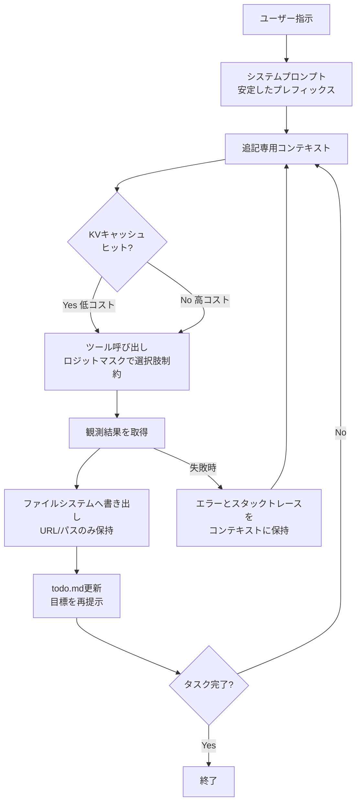
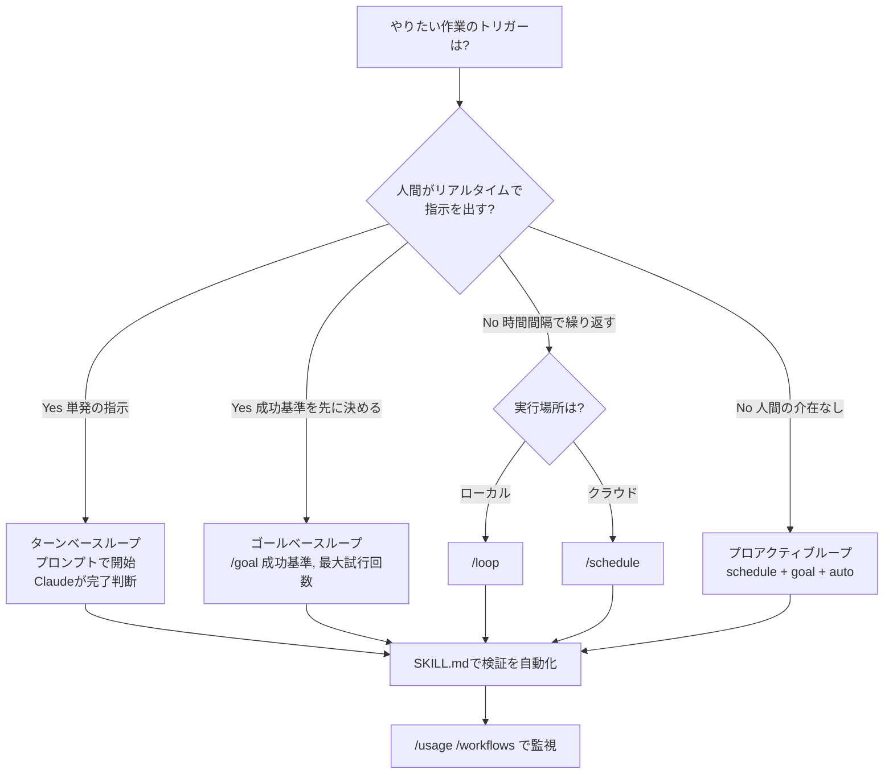
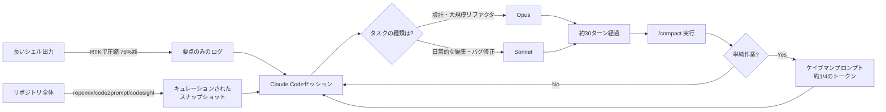

# Daily Briefing 2026-07-17

## 1. Manusから学ぶAIエージェントのコンテキストエンジニアリング（原題: Context Engineering for AI Agents: Lessons from Building Manus）

- **URL**: https://manus.im/blog/Context-Engineering-for-AI-Agents-Lessons-from-Building-Manus
- **公開日**: 2025-07-18
- **著者・媒体**: Yichao 'Peak' Ji / Manus Blog

### 本文翻訳
汎用AIエージェント「Manus」の開発チームは、モデルを一から訓練するのではなく既存モデルに対する「コンテキストエンジニアリング」に賭けた。以下はプロダクションで得た6つの教訓である。

第一に、**KVキャッシュのヒット率が最重要指標**である。Manusのエージェントは平均で入力:出力トークン比が約100:1に達し、ツール実行のたびにコンテキストが再送される。Claude Sonnetの場合、キャッシュ済みトークンは0.30ドル/MTok、非キャッシュは3ドル/MTokと10倍の差があり、キャッシュ効率がコストとレイテンシを直接左右する。ヒット率を高めるには、(1) システムプロンプト冒頭にタイムスタンプなど毎回変化する値を置かない、(2) コンテキストは追記専用にし、過去のアクションや観測結果を書き換えない、(3) JSONのシリアライズ順序を決定論的にする、(4) 自前でモデルをホストする場合はvLLMなどのプレフィックスキャッシング機能を有効化し、セッションIDを一貫させる、ことが必要だ。

第二に、**ツールを動的に削除せずマスクする**。反復のたびに利用可能なツールを増減させるとキャッシュが破壊され、過去の観測結果が現在存在しないツールを参照して混乱を招く。代わりにツール定義自体はコンテキストに残したまま、デコード時のトークンロジットをマスクして選択可能なアクションを制約する。ツール名にbrowser_やshell_のような一貫したプレフィックスを付ければ、プレフィックス単位でロジットをマスクするグループ化が容易になる。

第三に、**ファイルシステムを事実上無制限の外部メモリとして扱う**。コンテキストウィンドウの制約を回避するため、Webページの本文やドキュメントの中身はいったん破棄しても、URLやファイルパスさえ残しておけば必要な時に復元できる設計にする。圧縮は常に「可逆」であることが原則だ。

第四に、**todo.mdによるリサイテーション（復唱）**。平均50回のツール呼び出しを要する複雑タスクでは、エージェントがタスクリストを絶えず書き換え・更新することで、目標がモデルの直近の注意範囲に押し戻され、「中間の情報が失われる」問題やゴールドリフトを防ぐ。

第五に、**失敗を消さずに残す**。失敗したアクションとそのスタックトレースをコンテキストから削除せず残しておくと、モデルは暗黙的に信念を更新し、同じ誤りを繰り返しにくくなる。エラーからの回復こそ真のエージェント的振る舞いの証だとチームは述べる。

第六に、**few-shotパターンの罠を避ける**。同じ形式の行動-観測ペアが並ぶと、モデルはパターンに過剰適応し、最適でなくなった行動を機械的に繰り返してしまう（例：20件の履歴書レビューが後半で思考停止した反復作業になる）。シリアライズのテンプレートや表現に意図的なばらつきを持たせることで、この硬直化を防げる。

### 重要ポイント
- KVキャッシュのヒット率はコストとレイテンシに直結し、プレフィックス安定化・追記専用設計が鍵
- ツールは削除でなくロジットマスクで制御し、キャッシュ破壊と定義不整合を防ぐ
- ファイルシステムを「圧縮は可逆に」の原則で外部メモリ化する
- todo.mdの継続更新でゴールドリフトと中間情報の喪失を防ぐ
- 失敗ログを残す・few-shotに意図的なばらつきを入れることでエージェントの硬直化を防ぐ

### 図解


### 現場での適用方法

**CLAUDE.md への追記例**
```markdown
## コンテキストエンジニアリング方針（KVキャッシュ最適化）

- システムプロンプトの先頭にタイムスタンプ・セッション固有値を含めない
- 過去のツール呼び出し結果や会話履歴は書き換えず、常に追記のみで進める
- ツールの利用可否は「定義の削除」ではなく、Claude自身が状況に応じて
  「現在使用可能なツールのみ選ぶ」ルールに従うことで制御する
- 長時間タスクでは todo.md を作成し、各ステップの完了時に必ず更新して
  現在の目標を末尾に再掲する（次回リクエスト時にモデルの注意を引き戻すため）
- ツール呼び出しが失敗した場合、エラーメッセージやスタックトレースを
  要約せずそのまま残す（同じ失敗を繰り返さないための学習材料にする）
```

**スキル化の例（SKILL.md 骨子）**
```markdown
---
name: todo-recitation
description: "長時間の複雑タスク（10ステップ以上）を開始する際に、todo.mdを
  作成・継続更新してゴールドリフトを防ぐ。マルチステップの実装・調査タスクで使用。"
---

1. タスク開始時に todo.md を作成し、サブゴールを箇条書きで列挙する
2. 各ステップ完了時に該当項目にチェックを入れ、todo.md を上書き保存する
3. 残タスクと現在の全体目標を todo.md の末尾に常に明記する
4. コンテキストが長くなった場合も、直近の応答に todo.md の内容を含めて
   目標を見失わないようにする
```

### 期待効果
記事内の実測値では、キャッシュ済みトークンと非キャッシュトークンでコストが10倍異なるとされ、KVキャッシュ最適化だけで大幅なコスト・レイテンシ削減が見込める。todo.mdによるリサイテーションは平均50ツール呼び出しに及ぶ長時間タスクでの目標逸脱を防ぐ実績が示されている。

### 注意点
- プレフィックス安定化とツールのロジットマスクは、フレームワーク側がその機構をサポートしている前提が必要（自作ハーネスでは対応状況の確認が必須）
- ファイルシステムを外部メモリにする設計は、復元用のURL・パスを確実に保持する規約が徹底されていないと情報欠落を招く
- few-shotのばらつき導入はやりすぎるとモデルの一貫性を損なう可能性があり、バランスが必要

---

## 2. ループ入門：Claude Codeにおける4種類のループ設計（原題: Loop engineering: Getting started with loops）

- **URL**: https://claude.com/blog/getting-started-with-loops
- **公開日**: 2026-06-30
- **著者・媒体**: Delba de Oliveira, Michael Segner / Claude（Anthropic）Blog

### 本文翻訳
Claude Codeチームは「ループ」を「停止条件が満たされるまでエージェントが作業サイクルを繰り返すこと」と定義し、トリガー・終了条件・適した用途によって4種類に分類するガイドを公開した。

**ターンベースループ**は最も基本的な形で、ユーザーのプロンプトによってトリガーされ、Claudeが「タスクを完了した」または「追加コンテキストが必要」と判断した時点で停止する。短時間で探索的なタスクに向いており、検証は特定のプロンプトや検証スキルを通じて手動で行われる。

**ゴールベースループ（/goal）**は、明示的な成功基準を伴って手動でトリガーされる。停止条件は「ゴール達成」または「最大ターン数への到達」のいずれかだ。記事では具体例として `/goal get the homepage Lighthouse score to 90 or above, stop after 5 tries`（ホームページのLighthouseスコアを90以上にする、5回試行したら停止する）が挙げられている。成功基準と上限回数を同時に指定することで、無限にリソースを消費するのを防ぎつつ、Claudeに試行錯誤の余地を与える設計になっている。

**タイムベースループ（/loop と /schedule）**は、指定した時間間隔でトリガーされる。`/loop` はローカルマシン上で実行されるのに対し、`/schedule` は実行をクラウドへ移す点が異なる。停止条件はユーザーによるキャンセル、または作業の完了だ。定期的な繰り返し作業や、外部システムの監視といった用途に適している。

**プロアクティブループ**は、これら3つの要素（スケジュール、ゴール、ダイナミックワークフロー、自動モード）を組み合わせ、イベントまたはスケジュールによってトリガーされ、リアルタイムでの人間の介在なしに動作する。手動で無効化されるまで動き続けるため、明確に定義された反復作業のストリームに最も適している。

ガイドが強調する重要なアップグレードは、**検証プロセスをSKILL.mdとしてコード化する**ことだ。手作業のQA手順をスキルとして明文化することで、Claudeは自分自身の作業をエンドツーエンドでより多くチェックできるようになる。特に、実際の測定結果に基づく定量的なチェック（例：実際のLighthouseスコアを計測する）は、仮定に基づくチェックよりもはるかに効果的だとされている。

トークン管理についても具体的な指針が示されている。適切なプリミティブとモデルを選ぶこと、明確な終了条件を定義すること、大規模な実行の前に小さくパイロット運用すること、決定論的な作業にはスクリプトを使うこと、間隔は実際の変化頻度に合わせること、そして `/usage` や `/workflows` コマンドで使用状況を継続的に確認することが推奨されている。

### 重要ポイント
- ループは「トリガー」「停止条件」「適したタスクの性質」の3軸で4分類される
- /goal は成功基準＋最大試行回数のセットで暴走を防ぎながら反復させる
- /loop はローカル実行、/schedule はクラウド実行という使い分けができる
- 検証手順をSKILL.mdに落とし込むことで、Claude自身が定量的に成果を確認できるようになる
- トークン管理は終了条件の明確化とパイロット運用、/usage監視が要点

### 図解


### 現場での適用方法

**スキル化の例（検証用 SKILL.md 骨子）**
```markdown
---
name: verify-lighthouse-score
description: "フロントエンド変更後にLighthouseスコアを実測して検証する。
  /goal ループでパフォーマンス改善タスクを回す際に使用。"
---

1. `npx lighthouse <URL> --output=json --output-path=./lighthouse-result.json` を実行する
2. JSON結果から performance スコアを抽出する
3. スコアが目標値（例: 90）以上であれば成功、未満であれば
   改善点（LCP/CLS/TBTのうち最も低い指標）を特定して次の修正案を提示する
4. 仮定ではなく必ず実測値を報告する
```

**運用手順（/goal と /schedule の実例）**
```bash
# 1. 単発でゴールベースループを試す（パイロット運用）
/goal get the homepage Lighthouse score to 90 or above, stop after 5 tries

# 2. 検証スキルを SKILL.md として保存したら、
#    同じゴールを定期実行に昇格させる（クラウド実行）
/schedule "毎週月曜9時にホームページのLighthouseスコアを計測し、
  90未満ならパフォーマンス改善のPRを作成する"

# 3. 実行状況とトークン消費を定期的に確認する
/usage
/workflows
```

### 期待効果
成功基準と最大試行回数をあらかじめ決めるゴールベースループは、無制限な試行によるコスト超過を防ぎつつ、Claudeに複数回の試行錯誤を許容できる。検証をSKILL.mdに落とし込むことで、目視確認や勘に頼らない定量的な完了判定が可能になり、長時間・定期実行タスクの信頼性が上がる。

### 注意点
- ゴールベースループは成功基準が曖昧だと最大試行回数まで無駄に消費される恐れがあるため、基準の定量化が前提
- /schedule によるクラウド実行は、ローカルの/loopと異なりセッション状態や認証情報の扱いに注意が必要
- SKILL.md化する検証手順は「実際に測定できるもの」に限定しないと、検証自体が形骸化するリスクがある

---

## 3. Claudeのトークンを無駄にしない：毎日実践している5つのテクニック（原題: Stop wasting Claude tokens: 5 tricks I actually use every day）

- **URL**: https://mydataschool.com/blog/how-to-save-tokens/
- **公開日**: 2026-04-20
- **著者・媒体**: Mike（Machine Learning Engineer / Full-stack developer）/ MyDataSchool Blog

### 本文翻訳
著者は「週間利用上限に達してしまう」という課題を解決するため、Claude Codeで実際に毎日使っているトークン削減テクニックを5つ、効果の大きい順に紹介している。

**1. CLI出力の圧縮（最大の効果）**。長いシェル出力のノイズを削るツール「RTK」を使い、「1000行のノイズを200行の有用な情報に変換する」。実測例として、995入力トークンのうち757トークンを削減し、実際に使うのは238トークンのみ（削減効率76.1%）だったと報告している。同様の効果は `git diff` の出力を要約する運用でも得られるという。

**2. 構造化コンテキストツールの利用**。repomix、code2prompt、codesightといったツールを使い、リポジトリ全体を生で渡すのではなく「キュレーションされたスナップショット」を渡す。生成コードやロックファイルなど、モデルが読む必要のないファイルを事前に除外する。

**3. タスクの複雑さに応じたモデルの使い分け**。研究・計画・大規模リファクタリングにはOpusを、日常的なコード編集やバグ修正にはSonnetを使う。著者は「Opusは設計者、Sonnetは施工者」という比喩を使い、通常業務をSonnetに切り替えたことで週間使用量を約40%削減したと述べている。

**4. コンテキストの積極的なクリーニング**。長時間のセッションは「静かな殺し屋」と表現され、放置すると徐々にコンテキストを圧迫していく。目安として約30ターンごとに `/compact` を実行して会話を要約するか、区切りの良いところで新しいセッションを開始することを勧めている。

**5. 「ケイブマン」スタイルの簡潔なプロンプト**。丁寧で詳細な説明文の代わりに「auth middleware確認。期限切れトークン処理。正しいか？」のような最小限の表現を使う。この方法は「完全に正気とは思えないが、確実に機能する」とし、入力トークンをおよそ4分の1に削減できるとしている。

著者の実際の1日のワークフローは、(1) RTKで長いシェル出力をフィルタリング、(2) セッション開始時にcodesightを実行してコンテキストを準備、(3) デフォルトのモデルはSonnetを使用、(4) 約30ターン経過後に`/compact`を実行、(5) 単純作業にはケイブマンスタイルのプロンプトを使う、という流れで構成されている。この組み合わせにより、利用が集中する「重い週」でもトークン使用量を60〜70%削減できたと報告している。

### 重要ポイント
- CLI出力圧縮（RTK等）が最も効果が大きく、実測で76.1%のトークン削減
- repomix/code2prompt/codesightで「キュレーションされたスナップショット」を渡す
- Opus=設計・Sonnet=実装の使い分けで週間使用量が約40%削減
- 約30ターンごとの/compactでセッション肥大化による「静かな圧迫」を防ぐ
- 簡潔な「ケイブマン」プロンプトで入力トークンを約1/4に削減

### 図解


### 現場での適用方法

**運用手順（導入コマンド）**
```bash
# 1. CLI出力圧縮ツール RTK を導入する
npm install -g rtk   # または各ツールのインストール手順に従う
rtk -la <REPO_PATH>  # 長いシェル出力をノイズ除去して渡す

# 2. 構造化コンテキストツールを導入する
npx repomix                       # リポジトリのキュレーションされたスナップショットを生成
cargo install code2prompt         # またはブラウザで brew install code2prompt

# 3. セッション運用ルール
#    - 通常のコード編集・バグ修正は Sonnet をデフォルトにする
#    - 設計・大規模リファクタリングのときだけ Opus に切り替える
#    - 約30ターンごとに /compact を実行する
```

**CLAUDE.md への追記例**
```markdown
## トークン節約ルール

- 長いシェルコマンドの出力はそのまま貼らず、要点を抽出してから提示する
- リポジトリ全体を読み込む必要がある場合は、生ファイルではなく
  repomix 等で生成したキュレーション済みスナップショットを優先する
- 日常的な編集・バグ修正タスクではデフォルトモデルを維持し、
  設計判断や大規模リファクタリングが必要な場合のみ上位モデルへの
  切り替えを提案する
- 会話が長くなり指示が本題から逸れてきたと感じたら、
  /compact の実行または新規セッションの開始を提案する
```

### 期待効果
記事内の実測値では、CLI出力圧縮単体で76.1%のトークン削減、モデルの使い分けで週間使用量の約40%削減、簡潔なプロンプトで入力トークンの約75%削減が報告されている。これらを組み合わせた著者の日常運用では、利用が集中する週でもトークン使用量を60〜70%削減できたとされる。

### 注意点
- RTKやcodesightなど紹介されているツールは記事執筆時点のバージョン・環境に依存するため、導入前に自身のツールチェーンとの互換性確認が必要
- ケイブマンスタイルの簡潔なプロンプトは、複雑な要件やニュアンスが必要なタスクでは意図の取り違えを招くリスクがあるため、単純作業に限定するのが望ましい
- /compactの実行タイミングを一律30ターンとするのは目安であり、タスクの性質によって最適な頻度は変わる
