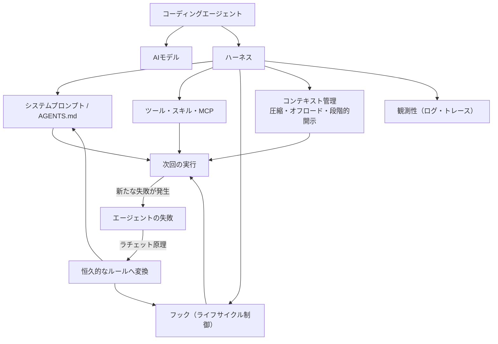
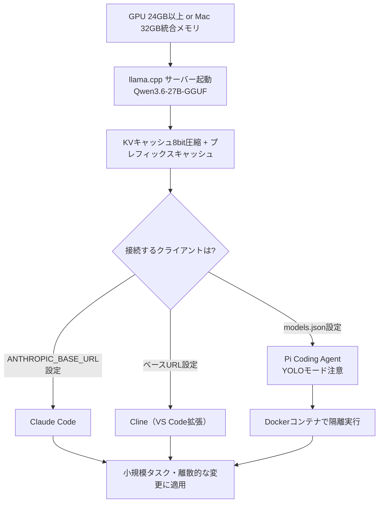
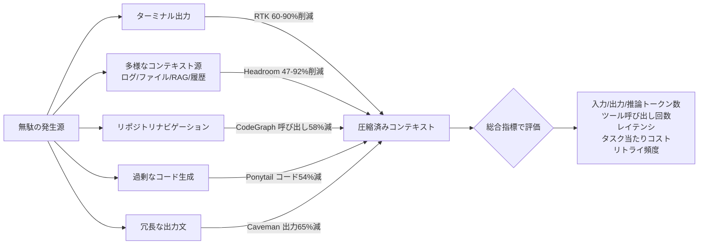

# Daily Briefing 2026-07-18

## 1. エージェント・ハーネス・エンジニアリング入門（原題: Agent Harness Engineering）

- **URL**: https://addyosmani.com/blog/agent-harness-engineering/
- **公開日**: 2026-04-19
- **著者・媒体**: Addy Osmani / 個人ブログ

### 本文翻訳
Addy Osmaniは、コーディングエージェントの実力を左右する真の変数は「モデル」そのものではなく「ハーネス」だと主張する。方程式で表せば「コーディングエージェント＝AIモデル＋ハーネス」であり、ハーネスとはシステムプロンプト、ドキュメント、ツール・スキル・MCPサーバー、ファイルシステムとサンドボックス、オーケストレーションロジック、フックやミドルウェア、ログ・トレース・コスト計測などの観測性まで、モデルの周囲に構築するすべてを指す。Viv Trivedy氏やHumanLayer、Anthropicなど複数の実践者の知見を集約し、「そこそこのモデル＋優れたハーネス」は「優れたモデル＋貧弱なハーネス」に勝ることを、Claude Code・Cursor・Codexなど異なるハーネスが同一モデルの挙動を劇的に変える事実で裏付ける。

HumanLayerが提唱する核心的な再枠付けは、エージェントの失敗を「モデルの限界」ではなく「設定の不備」として扱うことだ。コマンドを知らなければAGENTS.mdに追記し、破壊的操作を実行してしまうならフックで遮断し、長時間タスクで迷走するならプランナーと実行者を分離し、型の通らないコードを提出するなら型チェックのフィードバックループを組み込む。この「ラチェット原理」――同じ失敗を二度と起こさないよう、一つ一つの誤りを恒久的なルールに変換していく――によって各ルールは特定の失敗にまで遡って説明できる必要があり、結果としてハーネスは個々のコードベースに特化していく。

Trivedy氏が提案する設計手法は「望ましい振る舞いから逆算する」ことだ。耐久的なデータ処理にはファイルシステムとGit、コード実行にはBashとコード実行ツール、安全な実行にはサンドボックス、知識の継続にはメモリファイルとMCP、長いコンテキストへの対応には圧縮・オフロード・段階的スキル開示、長時間作業にはRalph Loops（終了しようとする試みを検知し、元のプロンプトを新しいコンテキストウィンドウに再注入する仕組み）・計画・検証を、それぞれ対応づける。

コンテキスト劣化への対策としては、(1) 古いコンテキストを要約する圧縮、(2) 大量のログなど大きなツール出力をファイルシステムに逃がすオフロード、(3) 必要な時だけ指示やツールを開示する段階的スキル開示、の3手法が紹介される。Anthropicは、圧縮だけでは長時間タスクには不十分で、構造化された引き継ぎ文書から新しいコンテキストを再構築する「完全なコンテキストリセット」が必要な場面もあると指摘する。

フックは強制層として機能し、ツール呼び出しの前後・ファイル編集後・コミット前などライフサイクルの節目でスクリプトを実行する。HumanLayerの原則は「成功は沈黙、失敗は雄弁に」――型チェックが通れば何も言わず、失敗すればエラーテキストをそのままループに注入する。AGENTS.mdは最もレバレッジの高い設定ポイントであり、HumanLayerの基準では60行以内に収め、各行を特定の失敗に遡って追跡できるようにする。ツール群についても、名前・説明・スキーマが毎リクエストごとにコンテキストへ注入されるため、10個の絞り込まれたツールは50個の重複したツールに勝る。

さらに、モデルが向上してもハーネス設計の対象は消えるのではなく移動するだけだと指摘される。Opus 4.6はコンテキスト不安のフェーズを克服したが、長期記憶や複数エージェントの調整といった新たな課題が生まれている。モデルはハーネス内で暗黙に共訓練されるため特定のプリミティブ（apply_patchなど）に過剰適応する側面もあり、Trivedy氏がTerminal BenchでTop 30からTop 5まで順位を押し上げたのはモデルを変えずハーネスだけを変更した結果だという。記事はこの流れを、LLM APIの完成がハーネスAPI（Claude Agent SDKなどによる標準ランタイム提供）へと転換しつつある「Harness-as-a-Service」の兆候として位置づけ、設定面はシステムプロンプト・ツール・コンテキスト・サブエージェントの4要素に集約されつつあると結んでいる。

### 重要ポイント
- コーディングエージェント＝モデル＋ハーネスであり、モデルの優劣よりハーネス設計が実力を左右する
- 失敗を「モデルの限界」でなく「設定不備」と捉え、AGENTS.md・フック・プランナー/実行者分離などでルール化する「ラチェット原理」
- コンテキスト劣化対策は圧縮・ツール出力オフロード・段階的スキル開示の3手法
- AGENTS.mdは60行以内・各行を失敗に追跡可能にするのが有効な投資
- モデル向上でもハーネスの課題は消えず移動する（Harness-as-a-Serviceへの流れ）

### 図解


### 現場での適用方法

**CLAUDE.md への追記例**
```markdown
## ハーネス改善ルール（ラチェット原理）

- エージェントが同じ種類の失敗を起こしたら、二度と起きないよう
  このファイルまたはフックに恒久的なルールとして追記する
- 各ルールには「どの失敗に対応するものか」を1行コメントで残す
  例: # 2026-07: コメントアウトされたテストをコミットした失敗への対策
- 本ファイルは60行以内を目安に保ち、汎用的な作法ではなく
  実際に起きた失敗に基づくルールのみを残す
```

**スクリプト化の例（pre-commitフック）**
```bash
#!/usr/bin/env bash
# .claude/hooks/pre-commit-check-skipped-tests.sh
# 目的: エージェントがテストを skip/xit のまま
# コミットするラチェット違反を機械的に検出する
if git diff --cached | grep -E '\.(skip|only)\(|xit\(|xdescribe\('; then
  echo "エラー: skip/xit/xdescribe を含むテスト変更が検出されました。" >&2
  echo "意図的な場合を除き、理由をコミットメッセージに明記してください。" >&2
  exit 1
fi
```

### 期待効果
記事が引くTrivedy氏の実績では、モデルを変えずハーネスのみを改善することでTerminal BenchのランキングがTop 30からTop 5まで上昇したと報告されている。AGENTS.mdやフックを通じたラチェット原理の適用は、同種の失敗の再発を構造的に防ぎ、コードベース固有の運用ノウハウを資産として蓄積できる。

### 注意点
- ハーネスは個々のコードベースに最適化されるほど効果が高まる一方、他プロジェクトへの転用性は下がる（過学習したハーネスは近隣タスクで性能低下するとの指摘もある）
- AGENTS.mdやルールを際限なく追加すると60行の目安を超えて膨張し、かえってコンテキストを圧迫する
- MCPツールの説明文がプロンプトインジェクションの経路になり得るため、外部提供のツール定義は精査が必要

---

## 2. 自前でローカルAIコーディングエージェントを構築する方法（原題: How to roll your own local AI coding agents）

- **URL**: https://www.theregister.com/software/2026/05/02/how-to-roll-your-own-local-ai-coding-agents/5230018
- **公開日**: 2026-05-02
- **著者・媒体**: Tobias Mann, Thomas Claburn / The Register

### 本文翻訳
AnthropicとMicrosoftが相次いで価格体系を変更し、Claude Codeを低価格プランから締め出し、GitHub Copilotを使用量ベース課金へ移行させたことを受け、The Registerは自前でローカル実行可能なAIコーディングエージェントを構築する方法を解説する。

推奨モデルはAlibabaのQwen3.6-27Bで、24GB以上のVRAMを積んだNvidia/AMD/IntelのGPU、または32GB以上の統合メモリを持つMシリーズMac（Mx-Max以上）があれば動作し、26万2144トークンという大きなコンテキストウィンドウとフラッグシップ級のコード生成能力を備えるとされる。メモリが足りない場合はシステムメモリとGPUメモリをプールする選択肢も紹介されている。

推論エンジンにはllama.cppを用い、24GBのRTX 3090 Ti向けの起動例が示される。temperature=0.6、top_p=0.95、top_k=20、min_p=0.0、presence_penalty=0.0、repetition_penalty=1.0という推奨ハイパーパラメータのもと、コンテキストサイズ65536トークン、フラッシュアテンション有効、KVキャッシュをq8_0（8ビット）に圧縮し、プロンプトキャッシュを有効化する。KVキャッシュの8ビット圧縮とプレフィックスキャッシュの有効化は、システムプロンプトや既存コードベースの再処理コストを下げる実用上のコツとして強調されている。

こうして立てたローカルサーバーに対し、3種類のエージェントフレームワークの接続方法が紹介される。まずClaude Codeは、Anthropicのモデル専用ではなくANTHROPIC_BASE_URLとANTHROPIC_API_KEYの環境変数をローカルサーバーに向けるだけでローカルモデルをバックエンドとして動作させられる。次にオープンソースのPi Coding Agentは、システムプロンプトが簡潔でGPUメモリ効率が良く、~/.pi/agent/models.jsonでモデルを設定するが、デフォルトで人間の承認なしに実行する「YOLOモード」で動く点はセキュリティ上のトレードオフとして注意喚起されている。最後にVS Code拡張のClineは、ベースURLをローカルサーバーに向け、コンテキストウィンドウサイズや温度パラメータ、プランニングモードとアクションモードの切り替えを設定できる。

実際にQwen3.6-27Bでソーラーシステムの対話的なWebアプリをワンショットで生成させたところ成功し、既存コードベースのバグも認識・修正できたと報告されている。ただし画像リサイズ用の単純なPythonスクリプト生成に約5分を要するなど、生成速度はクラウドの商用モデルに劣る。著者らは「27BのローカルLLMはOpus 4.7やGPT-5.5の代替にはならない」と明言し、小規模プロジェクトや離散的なコード変更向けの選択肢と位置づける。

セキュリティ面では、Claude CodeとClineがデフォルトで人間の承認を必要とするのに対し、YOLOモードで自動実行するPi Coding Agentのリスクを抑えるため、Dockerコンテナで隔離実行する方法も示されている。記事は「コードは検証可能だ。実行されるかコンパイルされるか、そのいずれかでしかない」という指摘を引きつつ、ローカルモデルが自分の用途に合うかを確かめる一番の方法は実際に試すことだと締めくくり、ハードウェアの十分性の見極めとデータバックアップの重要性を強調している。

### 重要ポイント
- Anthropic/Microsoftの値上げ・従量課金化が、ローカルAIコーディングエージェント検討の直接的な動機
- Qwen3.6-27B＋llama.cppで26万トークン超のコンテキストウィンドウをローカル実行可能
- KVキャッシュの8bit圧縮とプレフィックスキャッシュ有効化がレイテンシ・メモリ効率のコツ
- Claude Code・Pi Coding Agent・Clineの3フレームワークがそれぞれ環境変数/設定ファイルでローカルモデルに接続可能
- 27BクラスのローカルモデルはOpus 4.7やGPT-5.5の代替ではなく、小規模タスク向けの補完的選択肢

### 図解


### 現場での適用方法

**運用手順（ローカルサーバー起動〜接続）**
```bash
# 1. llama.cpp サーバーを起動する（例: 24GB RTX 3090 Ti 向け）
llama-server \
  --hf-repo unsloth/Qwen3.6-27B-GGUF:Q4_K_M \
  --ctx-size 65536 \
  -ngl 999 \
  --flash-attn on \
  --cache-prompt \
  --cache-type-k q8_0 \
  --cache-type-v q8_0 \
  --port 8080

# 2. Claude Code をローカルサーバーに向ける
export ANTHROPIC_BASE_URL="http://localhost:8080"
export ANTHROPIC_API_KEY="none"
claude

# 3. Pi Coding Agent の YOLO モードは Docker で隔離実行する
docker run -it --name local_agent_sandbox \
  -v <REPO_PATH>:/working_dir \
  ubuntu /bin/bash
```

### 期待効果
使用量ベース課金への移行によるコスト増を回避しつつ、対話的なWebアプリのワンショット生成や既存コードのバグ修正といった小〜中規模タスクをローカル完結で処理できる。26万トークン超のコンテキストウィンドウにより、中規模リポジトリ全体を一度に扱える余地もある。

### 注意点
- 単純なスクリプト生成でも数分を要するなど生成速度はクラウド商用モデルに劣り、大規模プロジェクトの主力にはならない
- Pi Coding AgentのデフォルトYOLOモードは人間の承認なしに実行されるため、Dockerなどでのサンドボックス化が事実上必須
- 24GB以上のVRAMや32GB以上の統合メモリという要件はコンシューマー機の上位機種が前提であり、導入コストがかかる

---

## 3. 無駄なトークンを減らす――5つのツールの実測比較（原題: Reduce Wasted Tokens）

- **URL**: https://gomzkov.medium.com/reduce-wasted-tokens-d36eb5b46442
- **公開日**: 2026-06-25
- **著者・媒体**: Evgeni Gomziakov / Medium

### 本文翻訳
著者はAIコーディングエージェントが浪費するコンテキストの正体を、ターミナルログ、ファイル内容の全文投入、繰り返されるgrep実行、古い状態情報、冗長な応答文、そして不要なコード生成の6種類に整理する。この無駄はコスト増だけでなく、実行速度の低下・リトライの増加・タスク喪失のリスクにもつながるとし、目的別に5つのオープンソースツールを比較する。

まず**RTK**はターミナル出力の圧縮に特化し、git・テスト・ビルド・パッケージマネージャー・Docker・grep・ファイル読み込みの出力に対応する。著者は「対応コマンドで60〜90%の削減」を報告し、実例として30分のセッションが118kトークンから24kトークンに減ったケースを挙げる。ただしシェルコマンドの出力にしか効かず、エージェント内蔵ツールの出力は対象外という制約がある。

次に**Headroom**はより広い範囲――ツール出力・ログ・ファイル・RAGチャンク・会話履歴――を圧縮する。内部でRTKを利用しつつ元の情報をキャッシュしておき必要な時に復元できる点が特徴で、削減率はワークフロー次第で47〜92%と報告されている。ただし「どの情報を圧縮してよいか」を判断する層自体が信頼性の弱点になり得ること、頻繁な復元がかえってコストを押し戻すリスクも指摘されている。

**CodeGraph**はリポジトリ内のシンボルマップ・呼び出し関係・依存関係を可視化し、ナビゲーションを最適化するツールだ。7つのリポジトリでのベンチマークでは「ツール呼び出しが58%減少、実行速度が22%向上、ファイル読み込みはほぼゼロに」という結果が示されている。効果はリポジトリの規模や利用頻度に依存する。

**Ponytail**は既存コード・プラットフォーム機能・既存の依存関係の再利用を促し、過剰なコード生成を抑えるツールで、「コード量54%減、トークン22%減、コスト20%減、速度27%向上」という数値が報告されている。ただし効果は既存コードの蓄積状況によってばらつく。

**Caveman**は出力の冗長な装飾表現を削り、より直接的な応答を返させるツールで、「出力トークンの約65%削減」を報告する。一方で出力トークンはもともとコストの小さい部分であり、推論トークンには改善が及ばないこと、あるコーディングベンチマークではむしろ総トークン数が7%増加した例もあったことが正直に記されている。

著者は「トークン問題」と「対応ツール」の関係を、ターミナル問題にはRTK、多様なコンテキスト源にはHeadroom、リポジトリ操作にはCodeGraph、コード効率にはPonytail、テキストの簡潔さにはCavemanという形で整理しつつ、最も重要な警告として「トークンを80%減らしても、コストが80%減るとは限らない」と釘を刺す。キャッシュ済み入力・推論トークン・リトライの発生状況が最終的な請求額を左右するためだ。結論として、入力・出力・推論の各トークン数、ツール呼び出し回数、レイテンシ、タスクあたりコスト、テスト成功率、リトライ頻度、コンテキスト喪失率といった指標を総合的に測定し、「トークン削減という見かけの指標」ではなく「ノイズの低減・適切なコンテキスト選別・diffの縮小・リトライ削減・成功あたりコストの低下」を目指すべきだと結んでいる。

### 重要ポイント
- ターミナル出力圧縮のRTKが最も直接的で、対応コマンドで60〜90%のトークン削減を実測
- Headroomは複数のコンテキスト源を横断的に圧縮するが、判断層の信頼性がリスクになり得る
- CodeGraphはシンボルマップでツール呼び出しを58%削減、ファイル読み込みをほぼゼロに
- Ponytailはコード再利用促進でコード量54%減・コスト20%減を実測
- 「トークン削減≠コスト削減」であり、キャッシュ・推論トークン・リトライまで含めた総合指標で評価すべき

### 図解


### 現場での適用方法

**CLAUDE.md への追記例**
```markdown
## トークン浪費の計測ルール

- 新しいコンテキスト削減ツール（圧縮・要約系）を導入する際は、
  導入前後で以下を必ず比較計測してから採用可否を判断する:
  入力/出力/推論トークン数、ツール呼び出し回数、タスク完了までの
  リトライ回数、タスク当たりの実コスト
- 「トークン数が減った」だけを成功指標にせず、「同じタスクを
  より少ないリトライ・より低いコストで完了できたか」を基準にする
- ターミナル出力が長くなるコマンド（git diff、テスト実行、
  ビルドログ等）は、要点のみを抽出してから提示する
```

**運用手順（ツール導入と効果測定）**
```bash
# 1. ターミナル出力圧縮ツールを導入する
npm install -g rtk
rtk exec -- git diff        # gitの差分出力を圧縮して提示

# 2. リポジトリ構造の把握を効率化する
codegraph init <REPO_PATH>  # シンボルマップ・依存関係グラフを生成
codegraph query "認証まわりの関数一覧"

# 3. 導入前後でトークン使用量とリトライ回数を比較する
#    （同種のタスクをツール導入前後でそれぞれ実行し記録する）
claude usage --last-session > before.txt
# ツール導入後、同種タスクを再実行して比較
claude usage --last-session > after.txt
diff before.txt after.txt
```

### 期待効果
記事のベンチマークでは、RTKがターミナル出力で最大90%、CodeGraphがツール呼び出し回数で58%、Ponytailがコード量で54%の削減を報告している。これらを課題に応じて組み合わせることで、実行速度の向上とリトライ削減による実質コストの低下が期待できる。

### 注意点
- 記事内の削減率はすべて著者環境でのベンチマークであり汎用性は保証されない。自環境での実測が必須
- Headroomのような判断層を挟む圧縮ツールは、圧縮ミスによる情報欠落のリスクがある
- Cavemanのように出力を削るアプローチは推論トークンには効かず、ベンチマークによっては総トークン数が増加するリスクもある
