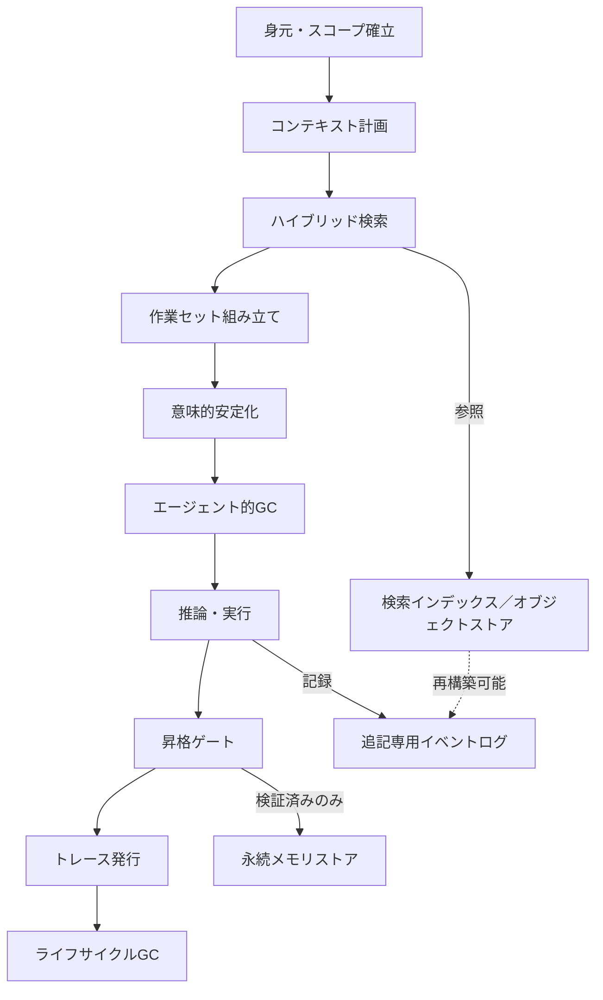
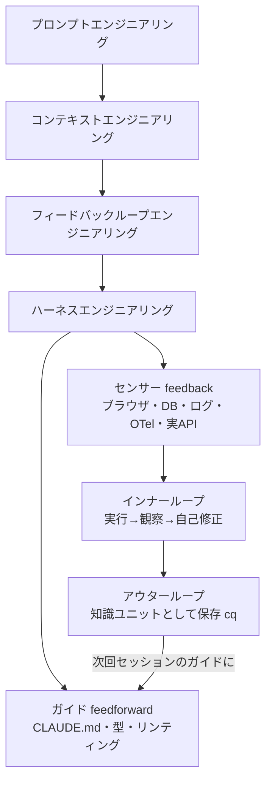
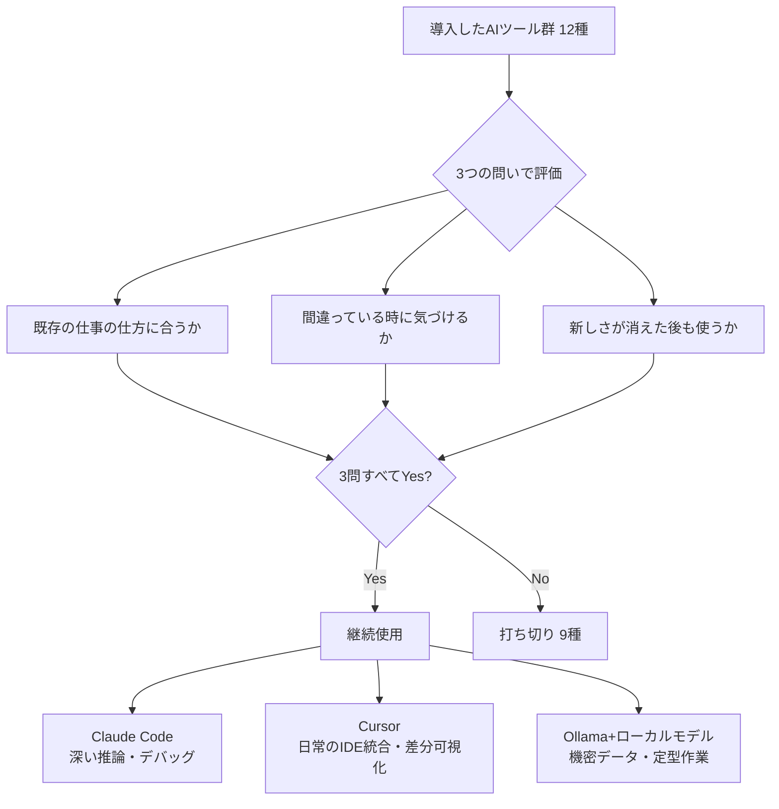

# Daily Briefing 2026-07-19

## 1. 商用マルチテナントエージェントシステムのためのコンテキストエンジニアリング（原題: Context Engineering for Commercial Agent Systems）

- **URL**: https://www.jeremydaly.com/context-engineering-for-commercial-agent-systems/
- **公開日**: 2026-02-22
- **著者・媒体**: Jeremy Daly / 個人ブログ

### 本文翻訳
筆者は、商用のマルチテナントAIエージェントシステムにおいて「コンテキストはインフラである」と位置づける。実装の細部ではなく、構造的な分離・決定論的な再現性・経済的な予測可能性という3つの非交渉条件を満たす設計が求められるとする。

メモリは2つの軸で分類する。第一の軸は「スコープ」（セキュリティ境界）で、プラットフォーム全体の不変ルールであるGlobal、組織単位でポリシー制御されるTenant、TTL付きで個人化されるUser、実行時のみ存在するSessionの4段階。第二の軸は「タイプ」（意味的役割）で、規範的ルールのPolicy、個人設定のPreference、来歴付きの確定事実Fact、構造化された作業要約のEpisodic、実行イベントの追記専用ログTraceに分かれる。

正典（Truth）としては、決定・検索結果・適用ポリシーを記録する追記専用イベントログと、来歴付きの事実・設定・エピソードを保持する構造化メモリストアの2つを置く。検索を高速化する派生ストア（Acceleration）としてはベクトル/ハイブリッド検索インデックスとコンテンツハッシュ参照のオブジェクトストアを別途持つ。「正典から再構築できないものは信頼してはならない」という原則が貫かれる。

実行時には「コンテキストエンジンループ」という10ステップを通す。(1) 身元・スコープ・プライバシーモードの確立、(2) 必要なコンテキストの計画、(3) スコープ内でのハイブリッド検索、(4) 優先度と予算に基づく作業セットの組み立て、(5) 参照の意味的安定化、(6) 重複排除と予算強制（エージェント的ガベージコレクション）、(7) 推論と実行、(8) 何を永続化するか判断する「昇格ゲート」、(9) 実行メタデータ全体を記録するトレース発行、(10) バッファ失効とリテンション強制。重要な指摘は「マルチターンの会話が永続的なコンテキストウィンドウを正当化するわけではない」こと――コンテキストは正典から毎ターン再構築すべきだとする。

サブエージェントは親から意図的にスコープされた入力のみを受け取り、その戻り値も通常の昇格ガバナンスの対象となる。汚染の脅威は3種類ある。悪意ある指示によるInstruction poisoning、例外が恒久的な規範になってしまうPrecedent poisoning、成果物が誤ったスコープへ移動するクロススコープ汚染だ。「分離はデータプレーンで強制すべきであり、プロンプトでは不十分」という原則のもと、フィルタは常にランキングの前に適用する。

セッションから永続メモリへの「昇格」は最もリスクの高い操作であり、テナントスコープへの書き込みは検証済みの事実か人間承認・信頼されたワークフロー経由に限定するのがデフォルトだ。クリティカルパスでは最小限の正典レコード（スコープ・タイプ・来歴・リテンションポリシー・機密分類）のみ同期書き込みし、埋め込み生成・重複排除・インデックス更新はバックグラウンドで行う「非同期ハードニング」によりレイテンシを守る。プライバシーはポストホックな除去ではなく、リテンションなしモードと通常モードでデータプレーン自体を分離する「ルーティングとしてのプライバシー」で実現する。コストは推論・検索・ツール・永続化の4面で発生し、正しさと並ぶ第一級の評価指標として扱うべきとされる。

最後に、決定論的な再現性（トレースエンベロープからのリプレイ）を信頼の土台とし、モデルのアップグレードは「コンテキストのストレステスト」として、挙動がコンテキストに依存するかモデル自体の変化に依存するかを切り分ける手段になるとまとめている。

### 重要ポイント
- メモリを「スコープ（global/tenant/user/session）」と「タイプ（policy/preference/fact/episodic/trace）」の2軸で分類し、境界を明示する
- 正典（イベントログ・構造化メモリ）と派生ストア（検索インデックス・オブジェクトストア）を分離し、派生側は常に再構築可能に保つ
- セッションから永続メモリへの「昇格」を最もリスクの高い操作とみなし、検証ゲートを必須にする
- 分離はプロンプトではなくデータプレーンで強制する（フィルタはランキングの前に適用）
- コストを推論・検索・ツール・永続化の4面で計測し、正しさと並ぶ第一級指標として扱う

### 図解


### 現場での適用方法

**CLAUDE.md への追記例**
```markdown
## コンテキスト管理ルール（Context Engineering）

- メモリは scope（global/tenant/user/session）と type（policy/preference/
  fact/episodic/trace）の2軸で分類し、ファイル名やパスに明示する
  （例: memory/tenant-acme/fact/2026-07-19-billing-limit.md）。
- サブエージェントへは親が意図的に選定したファイル・タスク定義のみを渡す。
  作業ディレクトリ全体を暗黙的に継承させない。
- セッションの実行結果を memory/ 配下へ永続化する前に、必ず次を確認する:
  1. 事実として検証可能か（ログ・テスト結果等の裏付けがあるか）
  2. 機密情報を含まないか
  3. 対象スコープが正しいか（tenant固有の情報をglobalに書いていないか）
- 会話が長くなっても丸ごと持ち越さず、次ターンでは memory/ から
  必要な事実のみを再取得して組み立て直す。
```

### 期待効果
記事によれば、この設計を採用したチームはスコープ分離と昇格ゲートによってコンテキスト汚染やドリフトを防ぎつつ、コストを「正しさと並ぶ第一級指標」として管理できるようになるとしている（具体的な定量数値の明示はない）。

### 注意点
- マルチテナント・商用規模を前提とした設計であり、個人開発や単一ユーザーのエージェントにはそのままだとオーバーエンジニアリングになりうる
- 昇格ゲートを省略すると、汚染されたメモリが恒久化するリスクがある
- 記事中のコード例は概念的な擬似コードであり、そのまま動く実装ではない

---

## 2. フィードバックループエンジニアリング（原題: Feedback Loop Engineering）

- **URL**: https://www.danieldemmel.me/blog/feedback-loop-engineering
- **公開日**: 2026-01-31（2026-06-02 更新）
- **著者・媒体**: Daniel Demmel / 個人ブログ

### 本文翻訳
Peter Steinbergerの「AIネイティブな開発」――複数のコーディングエージェントが並行して検証可能なコードに取り組むという発想――から出発し、筆者は成功の鍵はプロンプトの巧拙ではなく「クローズドループなシステム」、すなわちエージェントがコンパイル・実行・デバッグ・実APIテストを通じて自分の成果を検証できることにあると論じる。

筆者は4段階の階層を提示する。プロンプトエンジニアリング ＜ コンテキストエンジニアリング ＜ フィードバックループエンジニアリング ＜ ハーネスエンジニアリング。プロンプトエンジニアリングは多くの人の出発点だが、現代のモデルは曖昧な指示からも意図を推測できるため完璧な言い回しの重要性は薄れている。コンテキストエンジニアリングはドキュメントや厳選したファイル、CLAUDE.mdのような構造化知識ファイルをモデルに与え、Plan modeなどで関連ファイルを事前に優先させることで、モデルがシステムの挙動を当てずっぽうで推測するのを防ぐ。

フィードバックループエンジニアリングは「たまたま動いたコード」と「本当に動くコード」を区別する。エージェントが自分の出力を、正しさを仮定するのではなく本番同様の環境で観察・検証できるインフラを構築することを指す。ハーネスエンジニアリングはモデル以外のすべてを含み、Birgitta Böckelerのフレームワークでは「ガイド」（feedforward: CLAUDE.md、型システム、リンティングルールなど行動前にエージェントを導くもの）と「センサー」（feedback: 行動後に結果を見えるようにする可観測性ツール）に分けられる。筆者はフィードバックループエンジニアリングを独立したカテゴリとして扱うべきだと主張する。それは「エージェントが間違っていることをどう発見させるか」という別の問いに答えるものだからだ。

実践面では、まず土台としてリンティング、強い型システム、統合テスト、Gitフック、Zod/Pydanticのようなバリデーションライブラリがコミット前の構文・構造エラーを捕捉する（feedforward）。その上で本番同様の可観測性（feedback）として、browser-debugger-cliのようなツールによるブラウザデバッグ（DOM検査・コンソールエラー確認・JS実行）、開発用データベースへのクエリスキル（マイグレーション検証、データ整合性確認）、ログ・クラッシュトレースバックの参照、マイクロサービス環境でのOpenTelemetryトレース取得、モックではなく実際の開発用APIキーでのエンドポイント叩きを挙げる。これらはすべて「パイプ可能・合成可能なテキストイン/テキストアウトのCLIスキル」として公開される。

ループが締まると開発は根本的に変わる。複数エージェントが混乱なく並行実行でき、コードレビューは「コードレビューよりアーキテクチャレビュー」にシフトし、曖昧な指示でもフィードバックループが誤りを早期に検知するため実験コストが下がる。筆者はUnix哲学（小さなツール・単一責任・テキストストリーム）が偶然にもAIエージェントに理想的に適合すると指摘する。「段階的に探索可能」（git log --oneline → git show → git diff → --helpと掘り下げる）、「パイプ可能」（rg "TODO" --json | jqのように合成できる）というCLIの性質は、エージェントの自己コンテキスト管理を助ける。

さらに「インナーループ」（1セッション内でコードを実行し結果を自分のコンテキストに戻す）と「アウターループ」（セッションで得た学びを次回セッションの初期知識として持ち越す）を区別する。Mozilla AIのcqという仕組みでは、エージェントが未文書化のAPI挙動や回避策を構造化された「知識ユニット」として保存し、再試行の前にストアを照会することで重複した発見を防ぐ。/cq:reflectコマンドがセッションから汎化可能な教訓を抽出し、重複チェック後にチーム承認用の新知識ユニットとして提案する。今日蒸留された教訓が明日のガイド（feedforward）になり、インナーループを改善し続ける。

結論として、フィードバックループエンジニアリングはAI固有のオーバーヘッドではなく、可観測性・構造化ログ・トレース相関・ブラウザテスト・DB検証・明快なインターフェース・親切なエラーメッセージといった、もともと健全なエンジニアリング慣行をCLIスキルとして公開し直したものに過ぎないと筆者は述べる。投資の力点は「完璧なプロンプトを書くこと」から「実際に何が起きているかを明らかにするツールを作ること」へ移すべきであり、プロンプトやハーネスはモデルとともに陳腐化するが締まったフィードバックループの価値は持続する。ただし「無制限の権限を持つAIエージェントを、適切な安全策なしに個人データやサービスに接続しないこと」という注意も添えている。

### 重要ポイント
- 階層は「プロンプト＜コンテキスト＜フィードバックループ＜ハーネス」エンジニアリングであり、フィードバックループは独立したカテゴリとして扱う価値がある
- feedforward（CLAUDE.md・型・リンティング）とfeedback（ブラウザ/DB/ログ/OTel/実APIへのアクセス）を分けて設計する
- 可観測性ツールを「パイプ可能・テキストイン/テキストアウトのCLIスキル」として公開するとエージェントが使いやすい
- インナーループ（1セッション内の検証）とアウターループ（セッションを跨いだ知識の蓄積、Mozilla AIのcq）を区別する
- Unix哲学（小さなツール・単一責任・テキストストリーム）はAIエージェントとの相性が良い

### 図解


### 現場での適用方法

**スキル化の例（SKILL.md 骨子）**
```markdown
---
name: verify-with-runtime-signals
description: 変更を「動くはず」で終わらせず、ブラウザDOM・DBクエリ・
  ログ/トレースバック・実APIレスポンスのいずれかで実際に動作確認してから
  完了報告する。UI変更・DB変更・API連携を伴う変更で使う。
---

1. 変更内容に応じて検証手段を選ぶ
   - フロントエンド変更 → browser-debugger-cli でDOM/コンソールを確認
   - マイグレーション/データ変更 → DBクエリで実データを確認
   - 障害調査 → ログtail・クラッシュトレースバックを確認
   - サービス間連携 → OpenTelemetryトレースで経路を追う
2. 検証結果（成功/失敗の実際の出力）を報告に含める
3. 失敗した場合は、推測で直さずエラーテキストをそのまま次の
   修正案の入力にする
```

**CLAUDE.md への追記例**
```markdown
## フィードバックループのルール

- 「実装が完了した」と報告する前に、静的な読み込みだけでなく
  実行結果（テスト・ログ・DBクエリ・ブラウザ確認のいずれか）で
  検証すること
- セッション中に発見した未文書化の挙動・回避策は、次回のために
  memory/knowledge/ 配下へ1ファイル1知見の形で書き残す
```

### 期待効果
記事では、フィードバックループが締まると複数エージェントの並行実行が混乱なく回るようになり、曖昧な指示でも誤りを早期検知できるため実験コストが下がると述べられている（具体的な定量数値の記載はない）。アウターループの仕組みにより、同じ落とし穴に繰り返しはまることを防げる。

### 注意点
- 可観測性ツール（ログ・トレース・DBアクセス）を無制限にエージェントへ与えることは、セキュリティ上のリスクを伴う。開発用の権限範囲に限定すべき
- feedforward（CLAUDE.mdやルール）だけを増やしても、実行時の検証手段（feedback）が伴わなければ効果は限定的
- 知識ユニットの蓄積は仕組み化しないと属人化・散逸しやすい

---

## 3. AI開発ツールを12種試して、残したのは3つだけだった（原題: I Tested 12 AI Dev Tools. I Kept Three）

- **URL**: https://medium.com/@kuldeepjadeja7/i-tested-12-ai-dev-tools-i-kept-three-874476cef1c7
- **公開日**: 2026-07-06
- **著者・媒体**: Kuldeepsinh Jadeja / Medium

### 本文翻訳
MERNスタックを中心にクライアント案件と個人プロダクトを手がけるフルスタック開発者の筆者は、2月頃「7つのAIツールを同時に動かしながら、以前より仕事がはかどっていない」ことに気づいたと切り出す。1年かけて12種類のAI開発ツールを試した結果、最終的に手元に残したのはわずか3つだったという。

残した1つ目はClaude Codeで、未知のコードベースの理解、複数サービスにまたがるデバッグ、複雑なTypeScriptエラーの解決など「深い問題解決」に使う。一方で「ハルシネーションを起こし、時に自信満々に間違った方向へ進む」とも率直に書いており、クリーンに見えるようリファクタリングされたAPIルートを承認したところ、実は認証ミドルウェアの前提が静かに変わっており、数時間後に本番バグとして発覚したという失敗談を共有する。ここから得た教訓は「推論できることは、自分のシステムを理解していることと同じではない」であり、以降は「これを作って」ではなく「これがシステムです。何がおかしいですか。私は何を見落としていますか」と尋ねる形に指示を変えたという。ヘビーユースではコストが積み上がる点、ターミナル中心のワークフローは対象ユーザーが限られる点も欠点として挙げる。

2つ目はCursorで、「実際に自分が1日を過ごす場所」であり、タブ補完と複数ファイルを跨ぐ変更を行うComposerモード（正答率70〜90%程度）、そして変更内容を自動適用せず差分として可視化する点を評価する。この「見える化」こそが、AIツールを使い込んだ末に気づいた「最も重要なことの一つ」だと述べる。ただし非常に大きなリポジトリでは効果が薄れ、その場合はClaude Codeの方がコンテキスト把握に優れるとする。

3つ目はOllama＋ローカルモデル（Llama 3.1 8BやQwen2.5-Coder）で、ログの要約、APIレスポンスの解析、社内ドキュメントの下書き、定型コードの生成、機密性の高いプロジェクトデータの処理に使う。筆者は「最良のモデルか」ではなく適切な指標を問うべきだとし、「このデータを自分のマシンから外に出したいか」という基準を挙げる。フロンティアモデルとの品質差は明確に残るため期待値の調整は必要だが、「機密性が高い作業とコストの予測可能性が重要な場面では、このトレードオフは理にかなう」と結論づける。「最良だからではなく、役に立つから使う」という一文がこの態度を要約している。

打ち切った9つのツールとその理由も具体的に挙げられる。GitHub Copilotは「悪くはないが、Cursorに完全に見劣りする」、Windsurfは「本当に印象的だったが、Cursorと並行使用するほどの理由が見出せなかった」、AiderとClineはターミナルベースだが優先度の高い問題ではClaude Codeの方が推論力が勝った、独自に組んだMCPセットアップは週末プロジェクトの域を出ず標準的なターミナルツールで十分だった、LM Studio・Jan・Codex CLI・Perplexityは重要度の低いニーズへの対応か、残した3つと機能が重複していた、という具合だ。

筆者は最終的な共通項として、残した3つのツールは「自分の判断力を置き換えようとせず、支えてくれる」ものだったとまとめる。打ち切ったツールは「自動化の方向へさらに踏み込みつつ、可視性を減らす」ものであり、新しさが薄れた後は疲労だけが残ったという。評価のための3つの問い――「これは自分の既存の仕事の仕方に合っているか」「それが間違っている時に気づけるか」「新しさが消えた後も使い続けたいと思うか」――を提示し、自身の文脈（MERNのフルスタック開発者）を明示した上で、Pythonが中心のチームや大企業の開発組織では結論が異なりうると留保する。最後に「本当に必要なAIツールの数は、業界が信じさせたいよりもずっと少ない」とし、多くの開発者にとっては「推論用ツール1つ、IDE統合アシスタント1つ、任意でローカルモデル1つ」という構成で十分だと提案して締めくくる。

### 重要ポイント
- 7つのAIツールを同時運用していた時期に生産性がむしろ落ちたことが、ツール整理の出発点
- 残した3つ（Claude Code／Cursor／Ollama＋ローカルモデル）は役割が明確に分かれ、互いに重複しない
- 変更を自動適用せず差分で可視化する「見える化」が、AIツール選定で最も重要な観点の一つ
- ローカルモデルの選定基準は「最良か」ではなく「このデータを外に出したいか」というデータ主権の観点
- ツール評価の3つの問い（既存ワークフローとの適合／誤りへの気づきやすさ／新しさが消えた後も使うか）が再利用可能な基準になる

### 図解


### 現場での適用方法

**運用手順（自分のツール棚卸し・4週間監査）**
```bash
# 1. 現在使っているAIツールを一覧化する（例）
#    Claude Code / Cursor / Copilot / Windsurf / Cline / Aider /
#    Ollama / LM Studio / 自作MCPサーバー など

# 2. 2〜4週間、各ツールの利用ログを簡易記録する
#    （日付・ツール名・用途・結果を1行で残す）
echo "$(date +%F) claude-code debug:auth-bug success" >> tool-usage.log

# 3. 監査後、各ツールに3つの問いを当てはめて要否を判定する
cat <<'EOF' > tool-audit-checklist.md
## ツール監査チェックリスト
- [ ] 既存の仕事の仕方に合っているか
- [ ] それが間違っている時に自分は気づけるか
- [ ] 新しさが消えた後も使い続けたいと思うか
EOF

# 4. 3問中2問以上Noのツールは解約・削除候補とする
```

**CLAUDE.md への追記例**
```markdown
## AIツール運用方針

- 常時起動するAIツールは「推論用1つ・IDE統合アシスタント1つ・
  （必要なら）ローカルモデル1つ」を上限の目安とする
- 新しいAIツールを試す場合は導入から2〜4週間で上記チェックリストに
  基づき継続要否を判定し、重複機能のツールは統合する
- 機密データを扱うタスクは、可否判断の基準を「最良のモデルか」
  ではなく「このデータを外部に出したいか」に置く
```

### 期待効果
筆者の実体験では、7種類のツールを並行運用していた状態から3つに絞り込むことで、ツール切り替えの摩擦や判断の消耗が減り、実質的な生産性が回復したと述べられている（定量的な数値は示されていない）。ツールごとの役割が明確になることで、差分レビューや検証の負荷も下がるとしている。

### 注意点
- 著者の結論はMERNスタックのフルスタック開発者・クライアント案件という特定の文脈に基づくものであり、Python中心のチームや大企業組織ではツール構成の最適解が異なりうると本人が明言している
- ローカルモデルはフロンティアモデルとの品質差が明確に残るため、精度が必須のタスクには不向き
- 「ツールを減らすこと」自体が目的化しないよう、既存ワークフローとの適合性を優先して判断する必要がある

---

以上、本日は3件を選定しました。
