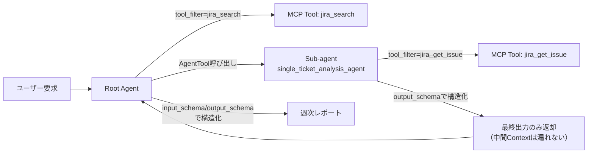
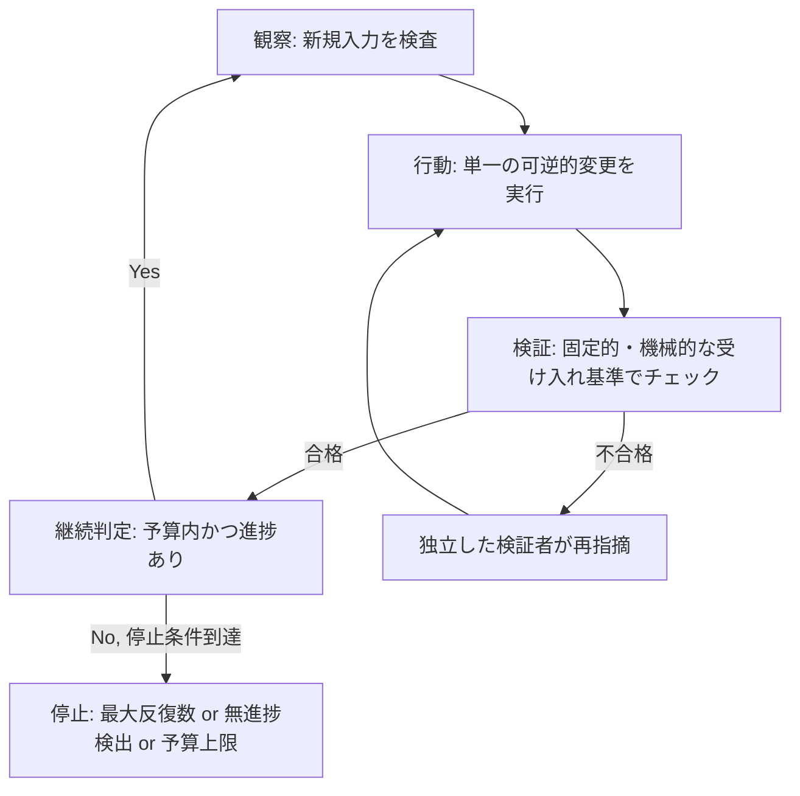
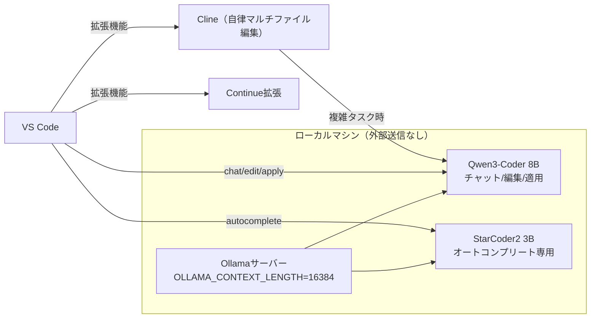

# Daily Briefing 2026-07-20

## 1. 3つの手法でToken消費量40%削減──ADKで実践するContext Engineering（原題: 3つの手法でToken消費量40%削減 — ADKで実践するContext Engineering）

- **URL**: https://techblog.lycorp.co.jp/ja/20260323b
- **公開日**: 2026-03-23
- **著者・媒体**: 井上秀一（LINEヤフー Orchestration Development Workshop ギルドメンバー）／LY Corporation Tech Blog

### 本文翻訳
社内でAIエージェント活用が広がる中、「コストの急増」「期待通りの出力が得られない」「会話が長くなるほど精度が落ちる」という課題が頻発している。原因の多くはLLMに渡すContext（文脈情報）の管理不足にある。本記事はLINEヤフー社内で行われた「ADKで学ぶ実践Context Engineering」ワークショップの内容を紹介する。

核心原則は2つ。1つは"Find the smallest set of high-signal tokens"（最小限の高品質なトークン集合を見つける）。Context Windowは有限でトークン数はコストに直結する。もう1つは「多すぎず少なすぎずちょうど良く」というバランスで、情報不足は推測による精度低下を招き、詳細過多はトークンの浪費を招く。時間経過とともに古い情報がノイズとして残り、プロンプトに書いてあることをAIが無視するようになる現象は「Context Rot」と呼ばれる。

検証対象は、Jiraチケットを分析して週次レポートを自動生成するエージェント「jira_weekly_report」。GPT-5（Context Window 400K）を用い、各バージョン10回試行し`after_model_callback`で計測した。

適用した3手法は次の通り。①**tool_filter**: `MCPToolset(tool_filter=["jira_get_issue"])`のように必要なツールのみをホワイトリスト指定し、不要なTool定義を除外してトークン消費とLLMの判断精度を同時に改善する。②**AgentTool**: 個別チケット分析専用のSub-agent（`input_schema`/`output_schema`で入出力を構造化）を作り、Root agentが`AgentTool(single_ticket_analysis_agent)`として呼び出す。Sub-agent内部のツールや中間コンテキストは呼び出し元に漏れず、最終出力のみが返るためContext Rotを防げる。③**構造化入出力**: PydanticのBaseModelで`InputSchema`/`OutputSchema`を定義し、JSONベースの厳密な入出力を強制することで余分な説明文や推論過程の出力を排除する。

結果、Root agentのContext Window平均使用率は33.49%→7.46%（77.7%削減）、システム全体の総トークン平均消費は174,643→103,583トークン（40.7%削減）となった。組織規模のコスト試算では、月4回×12ヶ月×100チームでgpt-5使用時に年間約14万円、1,000チームなら約136万円のコスト削減になるという。

原則はツールに依存しない。Claude CodeであればCLAUDE.mdへの永続コンテキスト保存や`/compact`、MCP Tool Search（Tool定義が10%超過で自動有効化、削減率約85%）、Codexであればプロンプトキャッシング（入力コスト最大90%削減）やReasoning Effort調整、Text Verbosity制御が同様の効果を持つ。

### 重要ポイント
- tool_filterでMCPツールをホワイトリスト化するだけでトークンとLLM判断精度の両方が改善する
- Sub-agentをAgentToolとして呼び出すことで、中間コンテキストを漏らさず「最終出力のみ」を親に返す設計にできる
- input_schema/output_schemaで入出力を構造化すると、余計な説明文の出力自体を防げる（Output Token直接削減）
- 実測でContext Window使用率77.7%削減、総トークン40.7%削減、コスト効果も定量化されている
- 原則はADK固有ではなく、Claude CodeやCodexなど他ツールにも移植可能

### 図解


### 現場での適用方法

**スキル化の例（SKILL.md frontmatter）**
```yaml
---
name: context-budget-check
description: エージェント実装時にトークン消費を測定・削減する。MCPツールが多いエージェントや長時間会話で精度低下・コスト急増が起きた場合に使う。
---
```
本文骨子:
1. `after_model_callback`相当の仕組みで現状のトークン消費を計測する
2. 使用ツール一覧を洗い出し、そのタスクで実際に呼ばれるツールだけを`tool_filter`でホワイトリスト化する
3. 責務が分離できる処理（個別分析など）はSub-agentに切り出し、親からは`AgentTool`経由で呼び、中間コンテキストを親に持ち込まない
4. Sub-agentの入出力にPydantic等でスキーマを定義し、自由文出力を禁止する
5. 変更前後でトークン消費を再計測し、削減率をログに残す

**CLAUDE.md への追記例**
```markdown
## コンテキスト管理ルール
- サブタスクへの分割が可能な処理は、専用エージェント/関数に切り出し、要約結果のみを親コンテキストに返すこと
- ツール呼び出しは必要最小限に絞り、未使用ツールの定義を毎回のコンテキストに含めない
- 構造化出力が可能な処理には出力スキーマ（JSON Schema等）を定義し、自由文の説明を出力させない
```

### 期待効果
記事の実測値ではContext Window平均使用率77.7%削減、総トークン消費40.7%削減。コスト換算では小規模チーム利用でも年間十万円単位、大規模組織では百万円単位の削減効果が見込まれるとしている。

### 注意点
- 効果はエージェント構成（Sub-agent分割の粒度、ツール数）に強く依存し、単純なタスクでは分割自体がオーバーヘッドになる場合がある
- tool_filterのホワイトリストはメンテナンスが必要で、ツール追加時に更新を忘れると機能不全になる
- 構造化出力（schema強制）はモデルやSDKのバージョンによって対応度が異なるため事前検証が必要

---

## 2. エージェンティックループ実践ガイド（原題: The Agentic Loop 🔄 Loop Engineering : A Practical Field Guide）

- **URL**: https://dev.to/truongpx396/the-agentic-loop-a-practical-field-guide-mnc
- **公開日**: 2026-06-25
- **著者・媒体**: Truong Phung／DEV Community

### 本文翻訳
エージェンティックループとは「観察→行動→検証→継続判定」のサイクルを自動化し、AIコーディングエージェントが人間の監視なしに反復作業を進める仕組みである。ReAct（2022年）から始まった発展は、現在ではスケジュール駆動のオーケストレーション段階に達している。本記事は、Addy Osmani（Loop Engineering）、Peter Steinberger（Just Talk To It）、Boris Cherny（Claude Code）、Geoffrey Huntley（Ralphテクニック）らの知見を統合した実践フィールドガイドである。

ループを構成する5つの要素は、①自動化（スケジュール駆動のタスク発見）、②ワークツリー（並列エージェントの隔離実行）、③スキル（プロジェクト知識の再利用可能化）、④コネクタ（MCP等によるツール統合）、⑤サブエージェント（実行者と検証者の分離）である。

記事は9つの実証済みループパターンをカタログ化している。エンジニアリング系では、READMEどおりに新規環境を構築してドキュメントギャップを見つける「フレッシュクローンループ」、不安定なテストの根本原因を修正し連続成功を積み重ねる「テスト安定化ループ」、不要コード・依存関係を検出削除する「ハウスキーパーループ」、バージョン表記などの古い値をリポジトリ全体で揃える「伝播コンプライアンスループ」がある。評価系では、複数の現実的シナリオでルーブリック基準を満たすか確認する「フル製品評価ループ」、異なるAIプロバイダーの双方が同一版を承認するまで繰り返す「マルチLLM収束ループ」、成功した実装を再利用可能なスキルに体系化する「アーティファクト→スキル変換ループ」、批評役がアーキテクチャの弱点を指摘し高リスク項目を潰す「レッドチームループ」がある。運用系では、スケジュール実行でタスクをトリアージし承認後に自動マージする「5分リポジトリ管理ループ」がある。各ループには「手動→トリアージ→ドラフト→検証済みPR→自動マージ」という5段階の成熟度ラベルが付与され、組織はどこまで自動化を任せるかを段階的に決められる。

ループの暴走を防ぐ3つの強制停止条件は、最大イテレーション数、無進捗検出、予算（トークン/コスト）上限である。記事はさらに16の失敗パターンを症状・根本原因・対策の表で整理する。代表例として、「完了」表示なのに実際は動作していない症状はチェックがエージェント自身の判断に依存していることが原因で、対策は機械的で固定的な検証基準への置き換えである。長時間実行で品質が徐々に低下する症状はコンテキストウィンドウにゴミが蓄積することが原因で、対策はRalph方式（毎回新規コンテキストで開始し状態はディスクに保存）である。検証者が甘くなる症状は「作成者が自分の宿題を採点している」ことが原因で、対策は別モデル・別指示による独立した検証者を立て、テスト結果を最優先すること。

最後に17項目のクイックスタートチェックリストが示され、目標の測定可能性、トリガー定義、新規入力の毎回検査、単一の可逆的変更への限定、固定テスト基準、明確な停止条件などが導入前の確認事項として列挙されている。

### 重要ポイント
- ループ＝観察→行動→検証→継続判定のサイクル。5要素（自動化・ワークツリー・スキル・コネクタ・サブエージェント）で構成する
- 「手動→トリアージ→ドラフト→検証済みPR→自動マージ」の5段階成熟度で自動化範囲を段階的に拡大する
- 停止条件は必ず「最大イテレーション数・無進捗検出・予算上限」の3点セットで実装する
- 検証者は実行者と別モデル・別指示にし、テスト結果を人間やAIの主観判断より優先する
- 長時間ループでは毎回クリーンなコンテキストで開始し、状態はディスク（ファイル）に持たせて劣化を防ぐ

### 図解


### 現場での適用方法

**CLAUDE.md への追記例**
```markdown
## 自律ループ運用ルール
- 全ての自律タスクは「観察→単一変更→固定基準での検証→継続判定」の順で回すこと
- 停止条件を必ず3点定義する: 最大反復回数 / 無進捗検出（N回連続で差分なしなら停止） / トークン・コスト予算上限
- 検証は実行したエージェント自身の「完了report」を信用せず、テストコマンドの実際の終了コードで判定する
- 長時間ループでは毎反復で新規コンテキストを開始し、進捗・状態は必ずファイル（例: progress.md）に書き出す
```

**運用手順（テスト安定化ループの導入例）**
```bash
# 1. 不安定テストを検出（3回連続実行して結果差分を見る）
for i in 1 2 3; do npm test -- --testPathPattern="flaky" ; done

# 2. エージェントに根本原因修正を指示し、N回連続成功をゲート条件にする
claude -p "flakyなテストの根本原因を修正し、5回連続で成功するまで繰り返して" \
  --max-iterations 10 --budget-tokens 200000

# 3. 停止条件のいずれかで終了したら、進捗ファイルを確認してPRを作成
cat progress.md
```

### 期待効果
成熟度ラベルに沿って段階導入することで、レビュー負荷を保ちながら自動マージまで安全に拡張できる。3つの停止条件と独立検証者の導入により、記事が指摘する「予算爆増」「永遠に実行され続ける」「検証者が作業を追認してしまう」という典型的な事故を構造的に防げる。

### 注意点
- チェック基準を試行ごとに変えると「パフォーマンス低下」の失敗パターンに陥る。基準は固定し、最適化用の評価は別セットで行う
- 1回のアクション範囲が大きすぎると差分が検証不能になる。単一の可逆的変更に限定することが前提
- 破壊的操作（本番デプロイ、データ削除等）は自動マージ対象から外し、人間承認ゲートを必須にする

---

## 3. Ollama + Qwen3-Coder + VS Codeでローカルコーディングエージェントをエンドツーエンド構築する（原題: Run a Local Coding Agent End-to-End: Ollama + Qwen3-Coder + VS Code）

- **URL**: https://llmconfigurator.com/en/guides/coding-agents/setup-local-coding-agent
- **公開日**: 2026-07-12
- **著者・媒体**: Jakub Rusinowski／LLM Configurator

### 本文翻訳
本記事は、クラウドに何も送らずにGitHub Copilot相当の機能を自分のマシン上で実現するための構成を、30〜45分で組み立てる手順を示す。構成要素は3つ：モデルサーバー（Ollama）、エディタ拡張（チャット・オートコンプリート用のContinue、自律的マルチファイル編集用のCline）、そして軽量なオートコンプリート専用モデルである。

VRAM別の推奨チャットモデルは、8GBでQwen3-Coder 8B、16GBでDevstral 22B、24GBでQwen 3.6 27BまたはQwen 2.5 Coder 32B、Mac 96GB以上ならQwen3-Coder 80B-A3Bとしている。手順は次の通り。まずOllamaをインストールし`ollama --version`と`curl http://localhost:11434`で稼働確認する。次にチャットモデルを取得する：`ollama pull qwen3-coder:8b`。取得後は`ollama run qwen3-coder:8b "write a python function that merges two sorted lists"`のように単体で動作確認する。並行してオートコンプリート専用の軽量モデル`ollama pull starcoder2:3b`も取得する。

VS Code側ではContinue拡張機能を導入し、`config.yaml`でモデルを次のように登録する。チャット・編集・適用用にQwen3-Coder、オートコンプリート専用にStarCoder2という役割分担をrolesフィールドで明示する。マルチファイルにわたる自律編集が必要な場合はClineを追加する。

コンテキストウィンドウの設定も重要な調整点で、`OLLAMA_CONTEXT_LENGTH=16384 ollama serve`のように環境変数でOllamaサーバーの起動時にウィンドウ長を指定する。記事は「16Kはエージェント作業の妥当な下限」としつつ、KVキャッシュがメモリを消費する点に注意を促す。GPUなしでも動作するかという問いには、「CPU-onlyでのQwen3-Coder 8B推論は数トークン/秒で、チャット用途には使えるがオートコンプリートには遅すぎる」と回答している。

コスト面では、GPUを既に所有していれば電気代（月数ドル程度）のみで、Copilot Pro（月10ドル）やCursor Pro（月20ドル）と比較して即座に投資回収できるとしている。プライバシー面では、プロンプト・コードコンテキスト・補完結果のすべてが自分のハードウェア内に留まるため、NDA対象コードや未発表プロダクトの開発に安全に使えるとしている。

### 重要ポイント
- 構成要素は「モデルサーバー(Ollama)＋チャット/編集用拡張(Continue)＋自律編集エージェント(Cline)＋軽量オートコンプリートモデル(StarCoder2)」の4点セット
- VRAM容量ごとに推奨モデルが明示されており、8GBのGPUでもQwen3-Coder 8Bで運用可能
- `OLLAMA_CONTEXT_LENGTH`環境変数でコンテキスト長を調整でき、エージェント用途は16K以上が目安
- CPUのみでの推論はチャットには使えるがオートコンプリートには不十分な速度
- コードやプロンプトが一切外部に送信されないため、機密性の高い開発に向く

### 図解


### 現場での適用方法

**運用手順（導入コマンド一式）**
```bash
# 1. Ollamaインストール確認
ollama --version
curl http://localhost:11434

# 2. VRAMに応じたチャットモデル取得（例: 8GB環境）
ollama pull qwen3-coder:8b
ollama run qwen3-coder:8b "write a python function that merges two sorted lists"

# 3. オートコンプリート専用の軽量モデル取得
ollama pull starcoder2:3b

# 4. エージェント用途向けにコンテキスト長を拡張してサーバー起動
OLLAMA_CONTEXT_LENGTH=16384 ollama serve
```

**Continue設定ファイル例（<REPO_PATH>/.continue/config.yaml）**
```yaml
models:
  - name: Qwen3-Coder (local)
    provider: ollama
    model: qwen3-coder:8b
    roles: [chat, edit, apply]
  - name: StarCoder2 autocomplete
    provider: ollama
    model: starcoder2:3b
    roles: [autocomplete]
```

### 期待効果
GPUを既に所有している場合、月額コストは電気代数ドル程度まで下がり、Copilot Pro（$10/月）やCursor Pro（$20/月）と比べて短期間で投資回収できる。加えて、プロンプト・コード・補完結果が外部に送信されないため、NDA対象コードや未発表プロダクトの開発でも情報漏洩リスクなく利用できる。

### 注意点
- CPUのみの環境では推論速度がオートコンプリートには不十分（チャット用途限定）
- コンテキスト長を拡大するとKVキャッシュのメモリ消費が増えるため、VRAM/RAM容量とのトレードオフを考慮する必要がある
- クラウドの最新大規模モデルと比較すると、ローカルモデルの精度・対応言語範囲には制約がある
