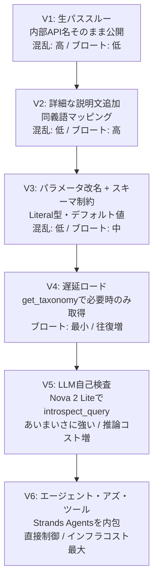
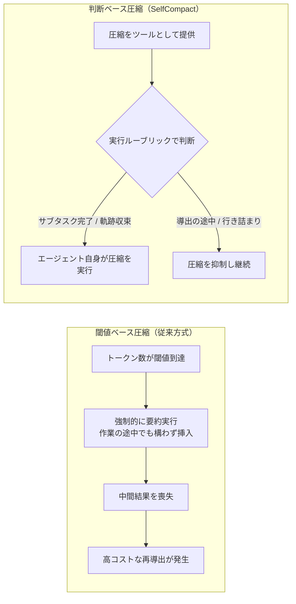
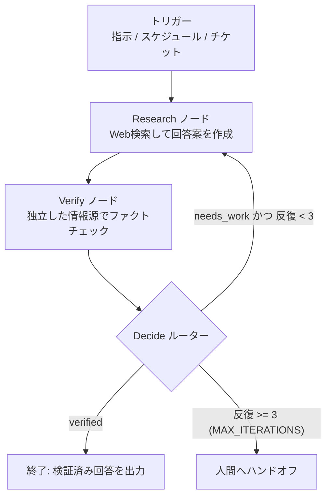

# Daily Briefing 2026-07-13

## 1. MCPツール設計：実践的アプローチとトレードオフ（原題: MCP tool design: Practical approaches and tradeoffs）

- **URL**: https://aws.amazon.com/blogs/machine-learning/mcp-tool-design-practical-approaches-and-tradeoffs/
- **公開日**: 2026-07-09
- **著者・媒体**: Daniel Wells, Raian Osman／AWS Machine Learning Blog

### 本文翻訳
MCP(Model Context Protocol)ツールがうまく機能しない原因は、プロトコル自体ではなく「ツールの設計」にあると著者は主張する。教育コンテンツ検索APIを題材に、Kiro CLIを使って同一クエリ（例：7年生向け分数のクイズ検索）でV1からV6まで6段階の設計を実装・比較する実践的な検証を行った。

問題を「ブロート（毎ターンのコンテキスト消費）」と「混乱（類似ツール名やパラメータの曖昧さによるLLMの誤選択・誤指定）」の2軸で整理する。

V1は既存の内部APIをそのままMCPツールとして公開するアンチパターン。パラメータ名が`resource_class`のような内部用語のままで、有効値の説明もなく、LLMは頻繁にリトライを繰り返す。V2は詳細な説明文と同義語マッピングを追加し精度は上がるが、ツール定義そのものが肥大化し「ブロートと精度のトレードオフ」が生じる。V3ではパラメータ名をLLMが理解しやすい語彙にリネームし（`discipline`→`subject`）、`Literal`型・enumでスキーマレベルに有効値を制約、デフォルト値を与えることで必須指定を減らす。結果、定義サイズは小さくなり精度も向上する。V4は「遅延ロード」で、検索ツール自体は軽量に保ち、必要な時だけ`get_taxonomy`のような分類取得ツールを呼ばせる。最もコンテキストに優しいが往復（ラウンドトリップ）が増える。V5はAmazon Nova 2 Liteを使ったサーバー側の自然言語イントロスペクションツール（`introspect_query`）を追加し、クライアント側のコンテキストは軽量に保ちながら、どのモデルでも解釈のばらつきを抑える。V6は単一のMCPツールの裏にStrands Agentsによるエージェントを配置する「エージェント・アズ・ツール」方式で、クライアント側コンテキスト消費は最小になるがインフラコストが最も高い。

Anthropicの調査を引用し、詳細出力をオンデマンド化するアプローチでレスポンストークンを約3分の2削減できたこと、ツール検索（Tool Search）の仕組みで関連ツール定義のみを読み込むことで最大85%のトークン削減が可能なことを紹介する。実務的な推奨として、パラメータ名はデータベースの命名規則でなくLLMのドメイン理解に合わせること、レスポンスは必須フィールドのみをデフォルトにして詳細はオンデマンドで取得させること、エラーメッセージは「検索クエリには2語以上必要です」のように次の一手が分かる実行可能な文言にすること、ツールあたりのパラメータ数は8個以下を目安にすることを挙げている。

### 重要ポイント
- ツールが機能しない原因はプロトコルでなく設計にあり、「ブロート」と「混乱」の2軸で問題を切り分ける
- パラメータ名はLLMのドメイン語彙に合わせてリネームし、`Literal`型・デフォルト値でスキーマレベルに制約する
- 頻度の低い詳細情報は初期スキーマに含めず、専用ツールで必要時のみ取得させる「遅延ロード」が有効
- ツール検索の仕組みで関連ツール定義のみを読み込むことで最大85%のトークン削減が可能（Anthropic調査）
- ツールあたりのパラメータ数は8個以下、エラーメッセージは次の一手が分かる文言にする

### 図解


### 現場での適用方法

**CLAUDE.md への追記例**
```markdown
## MCP/カスタムツール設計ルール
- パラメータ名は内部API・DBの命名規約ではなく、LLMがドメイン語彙として
  理解できる名前にする（例: `resource_class` ではなく `subject`）
- 選択肢がある値は自由記述の文字列ではなく Literal/enum でスキーマ制約する
- 一般的に使う値にはデフォルト値を設定し、LLMが指定すべき変動部分のみに絞る
- ツールのパラメータ数は8個以下を目安にする
- 頻度の低い詳細情報（分類体系など）は初期スキーマに含めず、
  `get_taxonomy` のような別ツールで必要時にのみ取得させる（遅延ロード）
- エラーメッセージは原因ではなく次の一手を示す（例:
  「検索クエリには2語以上必要です」）
```

**スクリプト化の例（V3〜V4スタイルのMCPツール定義, Python）**
```python
from typing import Literal, Optional
from pydantic import BaseModel, Field

class SearchContentParams(BaseModel):
    query: str = Field(..., description="検索キーワード（2語以上）")
    subject: Optional[Literal["math", "science", "ela", "social_studies"]] = Field(
        default=None, description="対象教科。未指定なら全教科を検索"
    )
    grade: Optional[int] = Field(default=None, ge=1, le=12)

# 遅延ロード: 詳細な分類値は別ツールでのみ公開する
def get_taxonomy(subject: str) -> list[str]:
    """必要な時だけ呼ばれる分類取得ツール。初期スキーマを軽量に保つ。"""
    ...
```

### 期待効果
詳細出力のオンデマンド化でレスポンストークンを約3分の2削減、ツール検索の仕組みで関連定義のみ読み込むことで最大85%のトークン削減（いずれもAnthropic調査値）。ツール設計の改善そのものでLLMの誤選択・リトライが減り、精度も向上する。

### 注意点
遅延ロード（V4）は往復回数が増えレイテンシが悪化しうる。エージェント・アズ・ツール（V6）はインフラコストが最も高い。V1のような生パススルーは論外だが、V2のように説明文を安易に増やすだけでもブロートを招く。自チームのユースケースに応じてV3〜V6のどこに着地させるかはトレードオフの見極めが必要。

---

## 2. コンテキスト圧縮は閾値ではなく意思決定であるべきだ（原題: Context Compaction Is a Decision, Not a Threshold）

- **URL**: https://blakecrosley.com/blog/agent-context-compaction
- **公開日**: 2026-06-23
- **著者・媒体**: Blake Crosley／個人ブログ

### 本文翻訳
Claude Codeなど標準的なコーディングエージェントのスキャフォールドは、トークン数がある閾値に達すると自動的にコンテキストを要約する「閾値ベース圧縮」を採用している。著者はこれを「トークンカウンターはコンテキストのサイズしか知らず、その意味的な構造を理解していない」と批判する。長い証明やタスクの途中でトークン上限に達すると、要約が作業の「途中」に無理やり挿入され、モデルは獲得していた中間結果を失う。結果としてその後の推論で高コストな再導出（re-derivation）が発生し、圧縮によって浮いたはずのコストが相殺されてしまう。

この問題への解として、2026年6月に発表された論文「Self-Compacting Language Model Agents」（Li, Zhang, Jurayj, Wang, Jin, Farajtabar, Nalisnick, Khashabi、arXiv:2606.23525）のSelfCompact手法を紹介する。要素は2つ。1つ目は圧縮を明示的な「ツール」としてモデルに与え、他のツールと同様に任意のタイミングで自律的に呼び出せるようにすること。ランタイム側からの強制的な中断ではなく、エージェント自身の行動として圧縮を扱う。2つ目は、いつ圧縮すべきか（サブタスクが解決した、軌跡が収束している）、いつ抑制すべきか（導出の途中、行き詰まっている）を判断するための簡潔な実行ルーブリックをモデルに与えること。論文は「この2要素はどちらか片方だけでは機能しない」と強調する。要約の「質」自体はモデルにとって難しくないが、要約する「タイミングの判断」は指示なしでは苦手というのが鍵となる知見だ。

6つのベンチマーク・7モデル（オープンウェイトモデルを含む）での評価では、非圧縮ベースラインと比較して数学タスクで最大18.1ポイント、エージェント検索タスクで5〜9ポイントの性能改善が見られた。さらに固定間隔で圧縮する従来方式と比較しても同等以上の品質を保ちながら、トークンコストを30〜70%削減できたという。ファインチューニングは不要で、プロンプト設計とツール提供のみで実現している点も実務上の導入コストを下げる。著者は、長時間タスクには「サブタスクの完了」に合わせた明示的なチェックポイントを設計すること、圧縮直後に再導出が頻発するならタイミングミスの兆候として観測できることを実務者への示唆として挙げ、業界は今後「閾値ベース」から「判断ベース」の圧縮トリガーへ移行していくだろうと予測している。

### 重要ポイント
- トークン閾値だけを見て圧縮すると、推論の途中で中間結果を失い高コストな再導出が発生する
- SelfCompact手法は「圧縮ツールの提供」と「実行ルーブリック」の2要素をセットで与える必要がある
- 要約の「質」はモデルが得意だが、要約する「タイミングの判断」は指示なしでは苦手
- 固定間隔圧縮と比較し同等以上の品質を保ちながらトークンコストを30〜70%削減
- ファインチューニング不要、プロンプトとツール提供のみで実現できる

### 図解


### 現場での適用方法

**CLAUDE.md への追記例**
```markdown
## コンテキスト圧縮の判断ルール
- コンテキストが閾値に達しても、サブタスクの導出途中や行き詰まり中は
  自動要約を実行しない。サブタスクが完了した、または軌跡が収束した
  タイミングでのみ圧縮すること
- 圧縮は明示的な行動として自己判断で実行し、要約後は完了済みサブタスクの
  結論のみを保持し、途中式・中間状態は破棄してよい
- 圧縮の直後に同じ結論を再導出する動きが発生したら、圧縮タイミングが
  早すぎた兆候として扱い、次回はより遅いタイミングで圧縮する
```

**スキル化の例**
```yaml
---
name: compact-checkpoint
description: >
  長時間タスクの実行中、サブタスクが完了した、または推論の軌跡が
  収束したと判断したタイミングでのみコンテキストを要約する。
  導出の途中や行き詰まっている最中には絶対に呼び出さないこと。
---
1. 直前のサブタスクが完了しているか、軌跡が収束しているかを自問する
2. いずれにも該当しなければ何もせず終了する
3. 該当する場合のみ、完了済みサブタスクの結論と未解決の課題を
   簡潔に要約し、途中式・探索過程は破棄する
```

### 期待効果
非圧縮ベースライン比で数学タスク最大18.1ポイント・検索タスク5〜9ポイントの性能改善。固定間隔圧縮比で同等以上の品質を保ちながらトークンコストを30〜70%削減。ファインチューニング不要でプロンプト設計のみで導入できる。

### 注意点
「圧縮ツールの提供」だけ、あるいは「ルーブリックの提示」だけでは効果が出ず、両方をセットで与える必要がある。何をもって「軌跡が収束した」とみなすかの基準はタスク領域ごとに調整が必要。効果はモデルの指示追従能力に依存するため、小型・軽量モデルでは同等の効果が出ない可能性がある。

---

## 3. エージェントのためのループ設計論（原題: Loop Engineering with Agents）

- **URL**: https://dassum.medium.com/loop-engineering-with-agents-5e9b984e8d8a
- **公開日**: 2026-06-30
- **著者・媒体**: Suman Das／Medium

### 本文翻訳
自律的に反復動作するAIエージェントの「ループ」を設計する際の共通構造を整理した記事。あらゆるエージェントループは5つの要素から成るとする。(1) トリガー：ユーザー指示・スケジュール実行・新規チケット・プルリクエスト作成などの起動イベント。(2) 検証可能な目標：「全テストがパスする」「全主張に出典がある」のように機械的に判定できる成功基準。(3) ツール：エージェントが環境と相互作用し、観察可能なフィードバックを得る手段。(4) 状態／メモリ：これまでの試行内容・発見事項・反復回数の追跡。(5) 停止ルール：成功による終了、試行回数上限による断念、リスクを検知した場合の人間へのハンドオフという3つの出口。著者は「検証は取っ手（handle）であり、それがなければループはただお金を使うだけの装置になる」と述べる。

ループ実装が有効なのは、結果が自動検証可能で、初回試行はしばしば間違っているが改善可能で、必要なステップ数が予測不能で、無人実行が求められる場合である。逆に、単発処理で十分な場合、成功基準が主観的な場合、各反復が不可逆的なリスクを伴う場合、速度・コストが自律性より優先される場合はループを使うべきではないとする。

共通パターンとして4つを整理する。Generate-and-Verify（生成→検証→不備があれば修正して再ループ。コードのテスト合格判定やファクトチェックに有効）、Evaluator-Optimizer（生成→数値スコアリング→スコア向上を目指して改善を反復。プロンプトチューニングや広告コピー改善に有効）、Plan-Execute-Replan（多段階の計画を実行し、想定外の事態が起きたら再計画する。サービス移行のような非定型プロジェクト向け）、Scheduled/Monitoring（タイマーやイベント駆動でチェック→行動→待機を繰り返す。チケットトリアージやビルド監視向け）。

実装例として、LangGraph（v1.2.6）でリサーチエージェントを構築するPythonコードを示す。researchノードがWeb検索して回答案を作成し、verifyノードが独立した情報源で主張をファクトチェックして構造化出力（Pydanticモデル）で`verified`/`needs_work`を判定、decideルーターが結果に応じて次のアクションを選ぶ。反復回数は`MAX_ITERATIONS = 3`という硬い上限を設け、状態には全会話履歴でなく現在の回答案と直近の検証フィードバックのみを保持してトークン消費を抑える。

失敗モードと対策も表にまとめている。無限ループには最大反復回数の強制、トークン消費増大には最小限の状態管理、幻覚的な自己申告の成功には独立した客観的検証、同じ失敗の繰り返しには前回の失敗情報を次の試行に投入、無責任な自律実行には全決定のログ化と「報告のみ→承認付き実行→完全自律」という段階的ロールアウトで対処する。

### 重要ポイント
- ループの5要素：トリガー、検証可能な目標、ツール、状態／メモリ、停止ルール。検証こそがループの「取っ手」
- 4つの共通パターン：Generate-and-Verify／Evaluator-Optimizer／Plan-Execute-Replan／Scheduled-Monitoring
- LangGraph実装では検証を独立ノードで行い、`MAX_ITERATIONS`のような硬い上限を必ず設ける
- 状態は全会話履歴でなく現在の成果物と直近フィードバックのみに絞りトークン消費を抑制
- 成功基準が主観的、または誤りが不可逆的なタスクにはループ設計を適用すべきではない

### 図解


### 現場での適用方法

**スクリプト化の例（LangGraphでの検証ループ実装骨子）**
```python
from typing import TypedDict
from pydantic import BaseModel
from langgraph.graph import StateGraph, END

MAX_ITERATIONS = 3

class ResearchState(TypedDict):
    question: str
    draft: str
    iterations: int

class Verdict(BaseModel):
    status: str  # "verified" or "needs_work"
    feedback: str

def research_node(state: ResearchState) -> ResearchState:
    # Web検索して draft を作成/修正する
    ...

def verify_node(state: ResearchState) -> Verdict:
    # 独立した情報源で draft の主張をファクトチェックする
    ...

def decide(state: ResearchState, verdict: Verdict) -> str:
    if verdict.status == "verified":
        return END
    if state["iterations"] >= MAX_ITERATIONS:
        return "handoff_to_human"
    return "research_node"

graph = StateGraph(ResearchState)
graph.add_node("research_node", research_node)
graph.add_node("verify_node", verify_node)
graph.add_conditional_edges("verify_node", decide)
```

**CLAUDE.md への追記例**
```markdown
## エージェントループ設計ルール
- ループを組む前に、検証可能な成功基準（機械的に判定できる条件）を
  必ず定義する。定義できない場合はループ化しない
- 反復回数の硬い上限（例: 3回）を必ず設け、上限到達で人間へハンドオフする
- 状態として保持するのは現在の成果物と直近の検証フィードバックのみとし、
  全会話履歴を毎回引き継がない
- 検証は生成主体とは独立したステップ・情報源で行い、自己申告の
  「成功しました」を鵜呑みにしない
```

### 期待効果
明確な検証基準と硬い停止ルールにより、無限ループやコスト暴走を防ぎつつ無人実行の信頼性を高められる。状態を最小限に絞ることでトークン消費増大を抑制でき、「報告のみ→承認付き実行→完全自律」の段階的ロールアウトにより導入リスクも抑えられる。

### 注意点
成功基準が主観的なタスク、または各反復の誤りが不可逆的なリスクを伴うタスクにはループ設計を適用すべきではない。検証ステップを生成主体と同一のモデル・同一情報源に頼ると「幻覚的な成功報告」を見抜けなくなるため、独立した検証手段の確保が前提となる。
