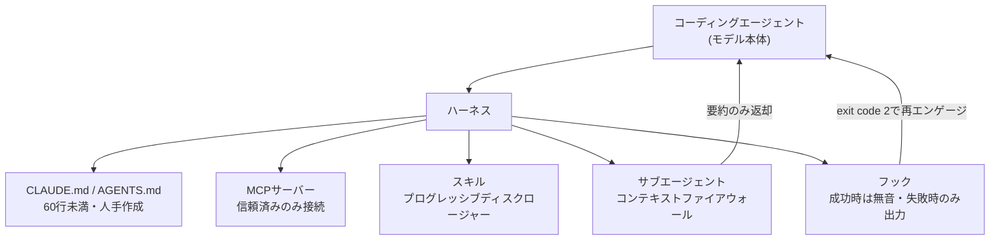
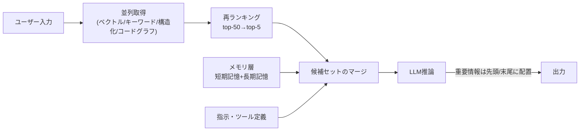
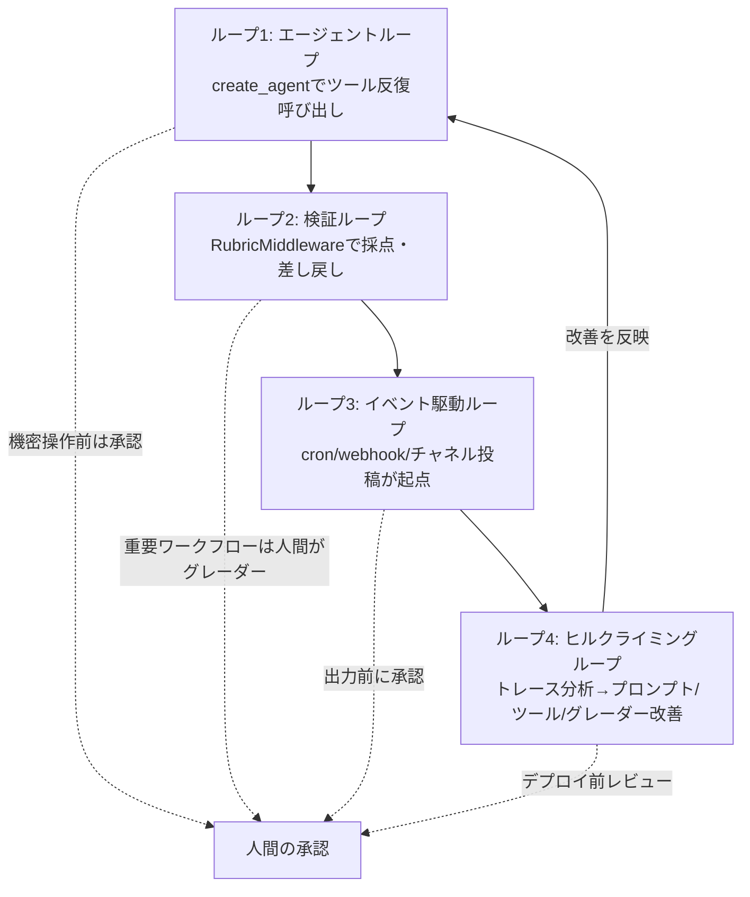

# Daily Briefing 2026-07-21

## 1. スキルの問題だ：コーディングエージェントのためのハーネスエンジニアリング（原題: Skill Issue: Harness Engineering for Coding Agents）

- **URL**: https://www.humanlayer.dev/blog/skill-issue-harness-engineering-for-coding-agents
- **公開日**: 2026-03-12
- **著者・媒体**: Kyle (@0xblacklight)／HumanLayer Blog

### 本文翻訳
コーディングエージェントがうまく機能しない時、多くの人はより優れたモデル（次世代GPTなど）の登場を待とうとする。しかし著者は「これはモデルの問題ではなく設定の問題だ」と主張する。「コーディングエージェント＝AIモデル＋ハーネス」であり、ハーネスとはエージェントが環境と相互作用するためのランタイムや周辺機器を指す。ハーネスエンジニアリングとは、Mitchell Hashimotoの言葉を借りれば「エージェントが失敗するたびに、その失敗を二度と起こさないようにするエンジニアリングソリューションを構築する実践」である。これはコンテキストエンジニアリングの部分集合として位置づけられる。

記事はハーネスの構成要素を5つに整理する。①**CLAUDE.md/AGENTS.md**: リポジトリ直下に置きシステムプロンプトへ決定論的に挿入されるファイル。ETH Zurichが138個のエージェントファイルを調査した結果、LLMが自動生成したファイルはむしろ性能を低下させ処理コストを20%以上増加させる一方、人手で書かれたファイルで効果が出たのはわずか約4%だった。ベストプラクティスは60行未満に抑え、条件分岐だらけのルールや自動生成を避けることである。②**MCPサーバー**: ツール拡張のプロトコルだが、ツール説明文がシステムプロンプトに常時注入されるためコンテキストを圧迫する。信頼できないMCPサーバーへの接続はプロンプトインジェクションのリスクもある。HumanLayer自身はLinear公式MCPの代わりに、Linear APIを薄くラップした自作CLIをCLAUDE.mdに6つの使用例とともに記載する方式に切り替え、トークン消費を大幅に削減した。③**スキル**: 必要な時だけ特定の指示・ツールを開示する「プログレッシブディスクロージャー」構造。ただしClawHubやskills.shのようなスキルレジストリでは既に数百件の悪意あるスキルが見つかっており、「npm install random-package」と同程度のサプライチェーンリスクがある。④**サブエージェント**: 親スレッドへの中間ノイズ蓄積を防ぐ「コンテキストファイアウォール」。Chromaの研究によれば、18モデルでのニードル・イン・ヘイスタック検証でコンテキスト長が伸びるほど性能が低下し、無関係情報が多いほど悪化が急速だった。親には高価なモデル（Opus）、サブエージェントには安価なモデル（Sonnet/Haiku）を使い分けるコスト最適化も紹介される。⑤**フック**: イベント発生時に自動実行する制御フロー。完了時の音声通知、危険なコマンドの自動拒否、Slack通知やPRの自動作成、Biomeフォーマッタ＋TypeScriptチェックの自動実行などに使われる。著者提供のスクリプトは「成功時は無音、失敗時のみ詳細を出力しexit code 2でエージェントに再エンゲージさせる」設計になっている。

最後に「バックプレッシャー」＝エージェント自身が作業を検証する仕組みの重要性が強調される。型チェック・ビルド・ユニットテスト・カバレッジ・Playwrightでのブラウザ検証などが該当するが、著者は当初4,000行のテストスイート全体を毎回実行させてエージェントがコンテキストを失い幻覚を生成する失敗を経験しており、テスト出力は「成功時は無音、失敗時のみ詳細」に絞ることが鍵だとする。総括として、事前に理想のハーネスを設計しようとする、念のため多数のMCP/スキルを入れておく、といったアプローチは機能せず、シンプルに始めて実際の失敗を見てから設定を追加し、反復速度を最適化することが有効だったと結論づける。

### 重要ポイント
- 「コーディングエージェント＝モデル＋ハーネス」。うまく動かない時はモデルよりまずハーネス（CLAUDE.md、MCP、スキル、サブエージェント、フック、検証機構）を疑う
- CLAUDE.md/AGENTS.mdはLLM自動生成だと逆効果（コスト20%以上増）。60行未満・人手作成が原則
- MCPサーバーやスキルレジストリは信頼できないものを安易に導入しない。サプライチェーンリスクはnpmパッケージ導入と同等
- サブエージェントは「コンテキストファイアウォール」として中間ノイズの蓄積を防ぎ、モデルの使い分け（親=高性能／子=安価）でコストも下げられる
- テスト・検証フックは「成功時は無音、失敗時のみ詳細出力」に絞ることで、検証自体がコンテキストを圧迫する事態を防ぐ

### 図解


### 現場での適用方法

**CLAUDE.md への追記例**
```markdown
## エージェントファイル運用ルール
- CLAUDE.md/AGENTS.mdは60行未満を維持し、LLMに自動生成させない（人手レビュー必須）
- 新しいMCPサーバー・スキルを追加する前に、提供元の信頼性を確認する（社内製CLIラップを優先検討）
- サブエージェントに切り出したタスクは、中間の探索ログを親コンテキストへ返さず要約結果のみ返す
- テスト・lint等の検証コマンドは、成功時は出力を抑制し、失敗時のみ詳細を出力するラッパーを使う
```

**スクリプト化の例（検証フック: 成功時は無音、失敗時のみ詳細出力）**
```bash
#!/usr/bin/env bash
# .claude/hooks/verify.sh
set -e
OUTPUT=$(npm run build && npm run typecheck && npx biome check . 2>&1) || {
  echo "$OUTPUT" >&2
  exit 2   # エージェントに失敗を再エンゲージさせる
}
exit 0
```

### 期待効果
記事の実測では、自作CLIによるMCP代替でトークン消費が大幅削減、検証出力の抑制で長時間セッションでの幻覚発生が抑えられた。ETH Zurichの調査値を踏まえると、CLAUDE.mdを人手で最小限に保つだけでも処理コストの20%以上を占める無駄な推論トークンを回避できる可能性がある。

### 注意点
- 効果はプロジェクト規模・ツール構成に強く依存し、万能の「理想ハーネス」を最初から設計しようとすると失敗しやすい
- スキル・MCPレジストリからのインストールはサプライチェーン攻撃のリスクがあり、事前審査なしの導入は避けるべき
- フックでのexit code制御はハーネス（Claude Code/Opencode等）ごとに仕様が異なるため、対象ツールのドキュメントで挙動を確認する必要がある

---

## 2. AIエージェントのためのコンテキストエンジニアリング実践ガイド（原題: Context Engineering: A Practical Guide for AI Agents）

- **URL**: https://sourcegraph.com/blog/context-engineering
- **公開日**: 2026-05-28
- **著者・媒体**: Matt Tanner／Sourcegraph Blog

### 本文翻訳
本記事は、プロンプトエンジニアリングからコンテキストエンジニアリングへの学問的転換を論じる。中心主張は「ボトルネックはプロンプトの言い回しではなく、エージェントに各ターンで適切な情報を供給できているかどうかだ」という点にある。コンテキストエンジニアリングは「推論時に言語モデルが目にするものを意図的に設計する実践」であり、システムプロンプト・ユーザー入力・取得文書・会話履歴・ツール定義・長期記憶を含む。プロンプトエンジニアリングとの違いは、対象範囲（単一の指示文字列 vs 推論時の全トークン）、状態性（ステートレス vs マルチターンで数時間実行）、失敗モード（タスク誤解 vs 情報の過不足）、責任者（プロンプト作成者 vs プラットフォームチーム）に表れる。「改善が言い換えから来るならプロンプトエンジニアリング、データ取得の方法・順序・再ランキング・退避戦略の変更から来るならコンテキストエンジニアリング」という切り分けが示される。

記事はコンテキストを4つの柱で整理する。①**指示/システムプロンプト**: 役割・制約・出力形式を、モデルの訓練時ヒューリスティクスと矛盾しないよう設計する。②**取得（Retrieval）**: ベクトル検索・構造化SQL・ファイル読み込みに加え、Anthropicが推奨する「ジャストインタイム取得」（ファイルパス等の軽量識別子だけを渡し、必要時にのみ実体を読み込む）。不良な取得は幻覚の最大要因となる。③**記憶（Memory）**: 短期記憶（会話履歴・ツール結果）と長期記憶（ユーザー設定・プロジェクト規約・過去要約）を区別し、Anthropicの「構造化メモ取りパターン」（モデル自身がスクラッチパッドをコンテキスト外のファイルに書き出し、必要時に再読込する）を紹介する。④**ツール**: 各ツール定義・各呼び出し結果がトークンを消費するため、機能が多すぎたり仮定が競合するツールセットは失敗の最大要因になる。

実装面では、典型的なコンテキスト組立パイプライン（並列取得→マージ→メモリ層抽出→指示/ツール定義のレイヤリング→LLMへ）を示した上で、「コンテキストロット」（トークン数が増えるほど正確な想起能力が下がる現象）への対策として、ツール出力の切り詰め、古い会話の実行要約への圧縮、関連性閾値以下のチャンク削除、取得候補数の上限設定、小規模クロスエンコーダによる再ランキング（50件を高リコールで取得し精密なtop-5に絞る）を挙げる。コード関連エージェントの具体例として、Sourcegraph MCPサーバー（SCIPというProtobuf形式の索引を用い、コンパイラ精度でクロスリポジトリのシンボル解決・依存関係トレースを行う）を紹介し、370タスクのCodeScaleBenchでファイルリコールが0.127→0.277、Precision@5が0.140→0.478に改善したとする。具体例では、Kubernetesモノレポのタスクがベースラインの2時間タイムアウトからMCP利用で89秒に短縮、クロスファイルリファクタが84分・96ツール呼び出しから4.4分・5ツール呼び出しに削減された。

失敗モードとしては、コンテキスト過負荷（100Kトークンの要約より5Kトークンの標的取得の方が高性能）、陳腐化した取得結果（埋め込み未更新による非推奨API呼び出し）、そして2023年のLiu et al.論文が示した「Lost in the Middle」（関連情報が先頭・末尾にあると性能が最も高く、中間に埋没すると著しく低下する現象）が挙げられ、最高信号の材料はコンテキストの先頭・末尾に配置すべきとする。記事はモデルSDK直結の実装が本番では多いとも指摘しつつ、「コンテキストウィンドウ限界が残る限りこの学問は必須であり、大型モデルの登場後も完全解決にはならない」と結論づける。

### 重要ポイント
- コンテキストエンジニアリングは「指示」「取得」「記憶」「ツール」の4本柱で構成され、責任範囲はプラットフォームチームに移る
- 「ジャストインタイム取得」（軽量識別子のみ渡し必要時に実体を読む）が幻覚防止の鍵
- コンテキストロット対策は、切り詰め・要約圧縮・関連性閾値フィルタ・候補数上限・再ランキングの5点セット
- Lost in the Middle対策として、最重要情報はコンテキストの先頭または末尾に配置する
- コード知能インフラ（SCIP索引ベースのMCP等）導入でファイルリコール・Precisionが2〜3倍、タスク完了時間が大幅短縮した実測値がある

### 図解


### 現場での適用方法

**CLAUDE.md への追記例**
```markdown
## コンテキスト取得ルール
- ファイル内容を丸ごと渡さず、まずファイルパス等の軽量識別子だけを提示し、必要と判断した時だけ実体を読み込む（ジャストインタイム取得）
- 取得候補は一度に多く集めても構わないが、関連性が低いものは提示前に足切りし、最終的にモデルへ渡すのは上位5件程度に絞る
- 会話が長くなった場合、古いやり取りは実行要約に圧縮してから継続する
- 重要な指示・制約は、長いコンテキストの中間ではなく冒頭または末尾に置く
```

**運用手順（コンテキストロット対策の導入手順）**
```bash
# 1. 現状のコンテキスト使用率をログ化する（例: token使用量をターン毎に記録）
# 2. 取得ステップに関連性スコアの閾値を設定し、閾値未満のチャンクを除外する
# 3. 取得候補の最大件数（例: top-50）と最終採用件数（例: top-5）を設定に明記する
# 4. 会話が一定トークン数を超えたら実行要約への圧縮（compaction）を実行する
# 5. Before/Afterでファイルリコール・Precision・タスク完了時間を計測し記録する
```

### 期待効果
記事が示すCodeScaleBenchの実測値では、コード知能基盤の導入でファイルリコールが約2倍、Precision@5が約3.4倍に向上し、複雑なタスクの完了時間が84分から4.4分へ、ツール呼び出し回数も96回から5回に激減した。

### 注意点
- 再ランキングや構造化メモ取りの実装コストは小さくなく、単純なタスクでは過剰設計になり得る
- ベクトルインデックスの更新が滞ると、陳腐化した情報を自信満々に提示するリスクがあるため定期的な再インデックスが必要
- 大型コンテキストウィンドウのモデルを使っても「Lost in the Middle」問題は解消されないため、配置の工夫は引き続き必要

---

## 3. ループエンジニアリングの技法（原題: The Art of Loop Engineering）

- **URL**: https://www.langchain.com/blog/the-art-of-loop-engineering
- **公開日**: 2026-06-16
- **著者・媒体**: Sydney Runkle／LangChain Blog

### 本文翻訳
本記事は、エージェントの有効性を高めるには単一のツール呼び出しループだけでなく、複数のループを積み重ねる「ループエンジニアリング」が必要だと論じる。ループは4段階に整理される。

**ループ1: エージェントループ（基本層）**は、モデルがタスク完了までツールを反復的に呼び出す基本構造で、LangChainの`create_agent`プリミティブを用いて任意のモデル・ツール組み合わせを構築する。例としてドキュメント改善エージェントがリポジトリのクローン、ファイル読み込み、プルリクエスト作成を自動で行う。

**ループ2: 検証ループ（品質保証層）**は、エージェント出力をルーブリックに対して採点し、不十分な場合はフィードバック付きで差し戻す仕組みである。`RubricMiddleware`やミドルウェアの`after_agent`フックで実装し、リンク解決・CI確認・変更範囲チェックなどを検証項目とする。レイテンシとコストは増えるが、品質重視の本番運用では価値があるとされる。

**ループ3: イベント駆動ループ（統合層）**は、新規ドキュメントの到着・スケジュール発火・ウェブフック受信などのイベントがエージェント実行の引き金になる仕組みで、LangSmith Deploymentの「cronスケジュール」「ウェブフック」機能、あるいはFleetの「チャネル」「スケジュール」機能で実装する。運用例としてSlackの特定チャンネルへの投稿がトリガーとなるケースが紹介されている。

**ループ4: ヒルクライミングループ（自動改善層）**が記事の最重要ポイントである。すべてのエージェント実行はトレース（実行記録）を生成し、分析エージェント（LangSmith Engine）がそのトレースを解析してプロンプト・ツール設定・グレーダー設定などのハーネス自体を改善する。将来的にはオープンウェイトモデル利用時にRLファインチューニングやメモリ・スキルの補強も可能になるとする。

記事は自動化が人間の排除を意味しないことも強調し、各ループ層に検査ポイントを組み込む設計を提案する：エージェントループでは機密操作の前に人間の承認を要求し、検証ループでは重要ワークフローで人間がグレーダー役を担い、イベント駆動ループでは最終ユーザーへの出力前に承認を挟み、ヒルクライミングループではハーネス改善のデプロイ前レビューを行う。LangChainはこれらを「ファーストクラスのプリミティブ」として提供しているという。記事はSatya Nadellaらの見解を引用し、学習ループを早期に構築し、人間の判断とトークンコストが複合するシステムを実現した企業が模倣困難な競争優位を得ると結論づける。ループ1・2は既に一般的に検討されているが、ループ3・4（イベント駆動・自動改善）に投資することで価値が複合的に積み上がるという戦略的主張が中心である。

### 重要ポイント
- ループは「エージェントループ→検証ループ→イベント駆動ループ→ヒルクライミングループ」の4層で積み上げる
- 検証ループは`RubricMiddleware`等でルーブリック採点し、不十分な出力にフィードバック付きで差し戻す
- イベント駆動ループはcron/webhook/チャネル投稿などをトリガーにエージェントを起動する統合層
- ヒルクライミングループは実行トレースを分析エージェントに解析させ、プロンプト・ツール・グレーダー設定を自動改善する仕組み
- 各層に人間の承認ポイント（機密操作前・重要ワークフロー・出力前・改善デプロイ前）を組み込むことが前提とされる

### 図解


### 現場での適用方法

**CLAUDE.md への追記例**
```markdown
## エージェント運用のループ設計ルール
- 単発のツール呼び出しループだけで終わらせず、出力をルーブリック（正確性・網羅性・フォーマット遵守など）で採点する検証ステップを挟む
- 検証で不十分と判定された場合は、具体的な不足点をフィードバックとして差し戻し再実行させる
- スケジュール実行・Webhook起点のタスクは、実行結果を必ずトレースとして記録に残す
- 定期的に実行トレースを見直し、プロンプト・ツール定義・検証基準そのものを更新する「振り返り」の場を設ける
```

**スキル化の例（SKILL.md frontmatter）**
```yaml
---
name: rubric-verify-loop
description: エージェントの出力を固定ルーブリックで自動採点し、基準未達なら理由付きで差し戻す検証ループを実装する際に使う。品質担保が必要な自動化タスクで利用する。
---
```
本文骨子:
1. タスクごとに合否基準（ルーブリック）を箇条書きで明文化する（例: リンク切れなし／CI通過／変更範囲が指示と一致）
2. エージェント出力に対して各基準を機械的にチェックする採点ステップを実行する
3. 未達項目がある場合、該当箇所と理由を添えて元のエージェントに再実行を指示する
4. 一定回数（例: 3回）再実行しても未達なら人間にエスカレーションする
5. 全実行のトレース（入力・出力・採点結果）を保存し、後日のハーネス改善に使う

### 期待効果
検証ループの導入により出力品質のばらつきを機械的に抑えられ、イベント駆動ループにより人手のきっかけなしに継続的なタスク処理が可能になる。ヒルクライミングループを回すことで、記事が主張するように「人間の判断とトークンコストが複合していく」形で、運用を続けるほどハーネスの精度が向上する効果が期待できる。

### 注意点
- 検証ループはレイテンシとコストを増加させるため、品質要求が低いタスクにまで一律適用すると非効率になる
- ヒルクライミングループ（自動改善）は改善内容のデプロイ前レビューを怠ると、意図しない挙動変化が本番に混入するリスクがある
- イベント駆動ループはトリガー条件の設計が甘いと、不要な実行が乱発してコストが膨らむため、発火条件を明確に絞る必要がある
