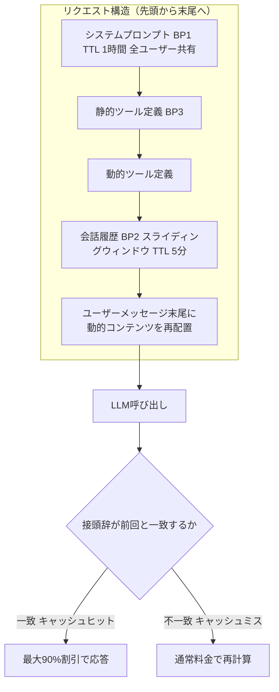
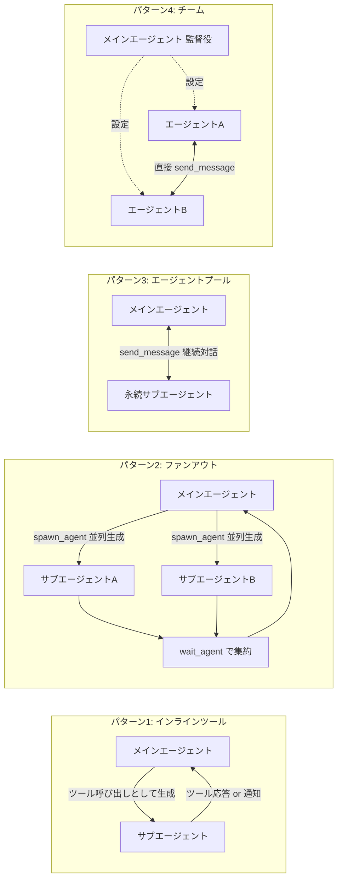
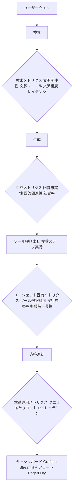

# Daily Briefing 2026-07-22

## 1. プロンプトキャッシュでLLMコストを59%削減した実例（原題: How We Cut LLM Costs by 59% With Prompt Caching）

- **URL**: https://projectdiscovery.io/blog/how-we-cut-llm-cost-with-prompt-caching
- **公開日**: 2026-04-10
- **著者・媒体**: ProjectDiscovery（Parth Malhotra） / ProjectDiscovery Blog

### 本文翻訳
ProjectDiscoveryは、複数ステップの自動セキュリティ監査エージェント「Neo」の運用において、Anthropicのプロンプトキャッシュ機構を最適化することでLLM費用を59%削減した。導入直後のキャッシュヒット率はわずか7%だったが、最終的には84%まで改善し、直近10日間ではコスト削減率が70%に達している。全体でキャッシュから配信されたトークンは98億に上る。

最適化の骨子は、プロンプトを「安定した接頭辞（プレフィックス）」と「変化する部分」に明確に分離し、Anthropicのキャッシュブレークポイント（最大4箇所）を戦略的に配置することにある。具体的には3つの施策を組み合わせた。第一に、システムプロンプト全体を1時間のTTLでキャッシュし、複数ユーザー間で共有する（BP1）。第二に、ツール定義を静的なものから動的なものの順に並べ、キャッシュ可能な接頭辞の連鎖を作る（BP3）。第三に、会話履歴を5分TTLの「スライディングウィンドウ」として扱い、各ステップで新たに追加されたメッセージのみを未キャッシュ領域として処理する（BP2）。

しかし最も効果が大きかったのは「リロケーション（再配置）」と呼ぶ手法だった。当初、実行時のワーキングメモリなど頻繁に変化する動的コンテンツをシステムメッセージの中に含めていたため、システムプロンプト全体が毎ステップでキャッシュミスしていた。この動的コンテンツをシステムメッセージから完全に排除し、会話末尾のユーザーメッセージとして追加する構成に変更した結果、ヒット率が一度に7%から74%へ跳ね上がった。

さらに細部の最適化として、テンプレート変数を実値ではなくプレースホルダーで安定化させる、日時表示を秒単位まで含めず日付のみに「凍結」する、プロバイダールーティングをAnthropicダイレクトに統一してキャッシュの局所性を保つ、ツールメッセージをパート単位でマーキングして限られたブレークポイント枠を有効活用する、といった工夫を重ねている。

分析の結果、タスクの複雑さ（ステップ数）とキャッシュヒット率には強い相関があることも判明した。1ステップのみの単純なタスクでは35.5%程度だが、20ステップを超える複雑な監査タスクでは74%に達する。観測された最長タスクは1,225ステップ・6,750万トークンに及び、キャッシュヒット率91.8%を記録した。著者は、エージェント型システムにおいてプロンプトキャッシュは「あれば嬉しい最適化」ではなく「必須のインフラ投資」であり、複雑で高コストなタスクほど経済性の改善効果が大きいと結論づけている。

### 重要ポイント
- キャッシュブレークポイント（最大4箇所）の配置設計だけで、コストを最大70%削減できる
- 最大の改善要因は「動的コンテンツをシステムプロンプトから追い出し、会話末尾に移す」再配置手法
- ツール定義は「静的→動的」の順で並べるとキャッシュ効率が上がる
- タスクが長く複雑になるほどキャッシュヒット率も向上する（1ステップ35.5%→20+ステップ74%）
- 秒単位のタイムスタンプやテンプレート変数のわずかな差異がキャッシュミスの原因になりやすい

### 図解


### 現場での適用方法
**CLAUDE.md への追記例**
```markdown
## プロンプトキャッシュ運用ルール（コスト削減のため厳守）
- システムプロンプト・ツール定義は先頭に固定し、実行ごとに変化する値（現在時刻、
  ワーキングメモリ、直近の実行結果など）を絶対に混入させない
- 動的な情報は必ず会話末尾のユーザーメッセージとして追加すること
- タイムスタンプは秒単位を含めず `YYYY-MM-DD` 形式に丸める
- テンプレート変数は実値埋め込みでなく `<PLACEHOLDER>` 形式で安定化させる
- ツール定義は「変化しないもの→変化するもの」の順に並べる
```

**運用手順**
```bash
# 1. 現状のキャッシュヒット率を計測する（Anthropic APIレスポンスの
#    usage.cache_read_input_tokens / usage.input_tokens を集計）
# 2. システムプロンプト中の動的値を洗い出す
grep -n "{{.*}}\|datetime.now\|timestamp" <PROMPT_TEMPLATE_PATH>

# 3. 動的値をプロンプト末尾（ユーザーメッセージ）へ移動させ、再計測
# 4. cache_control: {"type": "ephemeral"} をシステムプロンプト末尾と
#    ツール定義末尾のブロックに付与し、ブレークポイントを明示する
```

### 期待効果
記事の実測値では、キャッシュヒット率7%→84%、LLMコスト59%削減（最終的には70%）を達成している。特にステップ数の多い複雑なタスクほど削減効果が大きく、継続的な自動監査のような高頻度・高コストなワークロードの経済性を大きく改善できる。

### 注意点
- Anthropic APIのキャッシュブレークポイントは最大4箇所という制約があり、設計の自由度が限られる
- TTL（1時間・5分）の設計を誤ると、想定より早くキャッシュが失効し効果が薄れる
- ユーザーごとにプロンプトを個別最適化しすぎると、ユーザー間でのキャッシュ共有ができなくなる点に注意

---

## 2. エージェントが他のエージェントを管理する方法：2026年の4つのサブエージェントパターン（原題: How Agents Manage Other Agents: Four Subagents Patterns in 2026）

- **URL**: https://www.philschmid.de/subagent-patterns-2026
- **公開日**: 2026-05-05
- **著者・媒体**: Philipp Schmid（個人ブログ）

### 本文翻訳
著者のPhilipp Schmidは、AIエージェントが他のエージェント（サブエージェント）を生成・管理する設計を、メインエージェントがサブエージェントのライフサイクルにどれだけ関与するかという軸で整理し、複雑さの低い順に4つのパターンとして提示している。

**パターン1：インラインツール**が最もシンプルな形態である。メインエージェントから見ると、サブエージェントの呼び出しは「ファイルを読む」「コマンドを実行する」といった通常のツール呼び出しと変わらない。サブエージェントは独自のコンテキスト・ツールセット・システムプロンプトを持つが、生成と結果の受け取りが1回のツール呼び出しの中で完結する。同期モードでは呼び出し元がサブエージェントの完了までブロックされ、非同期モードではエージェントIDが即座に返り、完了時に通知メッセージとして結果が注入される。コードレビューやリサーチ検索、ファイル分析、テスト生成など、自己完結型の作業の大半はこのパターンで十分にカバーできるという。

**パターン2：ファンアウト**では、`spawn_agent` で複数のサブエージェントを並列生成し、`wait_agent` で結果を待ち受ける。生成と結果収集が別ステップに分離されているため、メインエージェントは他の作業を挟みながら複数のサブエージェントを並行実行でき、実行順序の制御をモデル自身に委ねられる。複数の独立したタスクを並列にこなしたいが、あるサブエージェントの結果を別のサブエージェントの入力に使う必要がない場合に適する。

**パターン3：エージェントプール**は、複数ターンにわたって状態を保持する永続的なサブエージェントを、`send_message` で継続的にやり取りするパターンである。エージェントはステートフルかつ対話的であり、会話履歴を保持したまま、メインエージェントからの追加指示や状態確認に応答できる。著者は、リサーチ担当と執筆担当のエージェントが段階的に情報を共有しながらブログ記事を完成させる例を挙げ、複数ステップにわたる専門家間の連携が必要なワークフローに向くと説明する。

**パターン4：チーム**は最も複雑で、サブエージェント同士がメインエージェントを介さず直接メッセージを交換する。メインエージェントはチーム構成と役割定義を終えた後は監督役に徹し、調整ロジック自体がエージェント間に分散される。大規模なタスクで単一エージェントが調整しきれない場合に有効だが、サイクル検出やファイル競合、シャットダウンの調整といったインフラ上の課題があり、デバッグも難しくなる。

著者は「まずパターン1から始めるべき」と明言する。適切にプロンプト設計されたインラインツール呼び出しだけで多くのタスクは事足りる。本当に独立して並行実行できる作業が出てきた段階でパターン2へ、複数ステップにわたるエージェント間連携が必要になった段階でパターン3へ、調整ロジックが単一エージェントの手に負えなくなった段階でパターン4へと、必要に迫られてから段階的に複雑度を上げていくことを推奨している。また、パターンが進むごとに要求されるモデル性能も上がり、パターン4ではチーム内の全エージェントに最先端モデルの能力が必要になる点も指摘している。

### 重要ポイント
- サブエージェント設計は「メインエージェントがどこまでライフサイクルを制御するか」で4段階に整理できる
- パターン1（インラインツール呼び出し）が最も単純かつ適用範囲が広く、まずここから始めるべき
- パターン2（ファンアウト）は独立した並列タスク向け、パターン3（エージェントプール）は複数ターンの専門家連携向け
- パターン4（チーム）は最も強力だが、サイクル検出やファイル競合などインフラ課題が大きくデバッグが困難
- 複雑なパターンほど、より高性能なモデルが全サブエージェントに要求される

### 図解


### 現場での適用方法
**スキル化の例（SKILL.md）**
```yaml
---
name: subagent-pattern-selector
description: タスクの性質に応じて4つのサブエージェント設計パターン（インライン
  ツール／ファンアウト／エージェントプール／チーム）のどれを採用すべきかを判定し、
  実装方針を提示する。複数のサブエージェントを組み合わせる設計を検討する際に使う。
---

## 判定フロー
1. タスクが自己完結し1回で完了するか？ → Yes: パターン1（インラインツール）
2. 複数タスクが完全に独立して並列実行できるか？ → Yes: パターン2（ファンアウト）
3. 複数ターンにわたり専門エージェント間で情報を段階的に共有する必要があるか？
   → Yes: パターン3（エージェントプール）
4. 調整ロジックが単一エージェントで管理しきれない規模か？ → Yes: パターン4（チーム）

## 実装時の注意
- まずパターン1で実装し、必要が明確になってから複雑度を上げる
- パターン3以降は使用モデルの性能要件が上がる点をコスト試算に反映する
```

### 期待効果
タスクの性質に合わせて過不足のないサブエージェント設計を選べるようになり、不必要に複雑な調整ロジック（チームパターン）を安易に採用してデバッグ困難な状態に陥ることを防げる。パターン1中心の設計は実装・運用コストが低く、多くのタスクをシンプルに処理できる。

### 注意点
- パターン4（チーム）はサイクル検出やファイル競合、シャットダウン調整などインフラ的な難所が多く、デバッグコストが高い
- パターンが進むほど要求されるモデル性能が上がるため、小型・安価なモデルを使う場合はパターン1・2に留めるべきと著者は述べている
- 記事は概念設計の整理が中心で、各パターンの定量的な性能比較データは示されていない

---

## 3. 本番AIエージェントのための評価ハーネス構築：100件超の導入から得た12指標フレームワーク（原題: Building an Evaluation Harness for Production AI Agents: A 12-Metric Framework From 100+ Deployments）

- **URL**: https://towardsdatascience.com/building-an-evaluation-harness-for-production-ai-agents-a-12-metric-framework-from-100-deployments/
- **公開日**: 2026-05-13
- **著者・媒体**: Pratik Rupareliya（Towards Data Science）

### 本文翻訳
著者は、企業向けAIエージェントの導入を100件以上手掛けてきた経験から、「本番のAIエージェントが失敗する原因はモデルの性能不足ではなく、評価体制の不備である」と主張する。医療分野などコンプライアンス要件の厳しい業界での導入事例を引きながら、包括的な評価ハーネスの整備が事業継続に不可欠だと述べる。

フレームワークは12個の指標を4カテゴリに分類する。**検索メトリクス**（RAGの検索精度に関わる4指標）では、文脈関連性（目標値0.85超）、文脈リコール（0.90超）、文脈精度（MRR 0.80超。BGEリランカー導入で0.55から0.92へ改善した例を紹介）、検索レイテンシ（p95で200ms未満）を計測する。**生成メトリクス**（3指標）では、生成内容と検索文脈の一致度を測る回答忠実性（0.95超。原子的な主張単位に分解して文脈と照合する手法を採用）、ユーザー質問への対応度を測る回答関連性（0.90超）、事実無根の生成頻度を測る幻覚率（規制業界目標で0.5%未満）を扱う。**エージェント固有メトリクス**（3指標）では、ツール選択精度（0.92超。ツール数が3個から12個に増えると精度が95%から70%まで低下する現象を指摘）、ツール実行成功率（0.98超。構造化出力・関数呼び出しの活用で引数フォーマットエラーを防ぐ）、複数ステップにわたる論理的一貫性（0.85超。4ステップ以上の連鎖で成功率が95%から低下し始めるため、タスク分解が対策となる）を扱う。**本番運用メトリクス**（2指標）では、トークン・インフラ・ツール呼び出しを合算したクエリあたりコスト（0.05ドル未満が目安）、P99レイテンシ（会話型で3秒未満）を計測する。

導入は3フェーズで段階的に進めることを推奨している。フェーズ1（本番投入前の最初の4週間）では検索系4指標と回答忠実性を先行実装する。フェーズ2（ソフトローンチ期、3〜6週間）では幻覚率・回答関連性・ツール選択精度を追加する。フェーズ3（本番安定期、7週間以降）で残る5指標を追加し最適化に入る。全体の構築期間は専任エンジニアで2〜3週間程度とし、評価セット構築に4〜6日、指標実装に3〜5日、CI/CD統合に2〜3日、本番計測とダッシュボード整備にそれぞれ数日を要するという実測の内訳を示している。ツールスタックとしては、Ragasとカスタム評価器（Python）、LLM-as-judge用に高リスク領域はGPT-4、コスト重視ならClaude Sonnet、自社ホスト環境ではLlama 70Bを使い分け、データ保存にPostgreSQLとS3、可視化にGrafanaとStreamlit、アラートにPagerDutyを組み合わせる構成を推奨する。

よくある失敗パターンとして、「MVP完成後に評価を後付けする」戦略（実際には後付けに4〜6週間を要する）、ベンチマークスコアのみを過信し本番データでの検証を怠ること（本番投入後に幻覚率30%が発覚した実例）、手動レビューへの過信（1日100件を超えるとスケールが破綻する）の3点を挙げる。著者は「2026年、AIエージェント導入に成功しているチームは最良のモデルを持つチームではなく、最良の評価インフラを持つチームである」と結び、モデル性能がコモディティ化した今、差別化要因は計測と監視の体系化にあると強調する。

### 重要ポイント
- 12指標を「検索」「生成」「エージェント固有」「本番運用」の4カテゴリに整理し、各指標に具体的な目標値を設定する
- ツール数が増えるとツール選択精度が急落する（3個で95%→12個で70%）ため、ツール数自体を評価対象にすべき
- 評価体制は本番投入前・ソフトローンチ・安定期の3フェーズで段階的に構築する
- LLM-as-judgeの評価コストは推論コストの30〜50%程度を見込む必要がある
- 「MVP後に評価を後付け」は典型的な失敗パターンで、実際には4〜6週間の手戻りを招く

### 図解


### 現場での適用方法
**運用手順**
```bash
# フェーズ1（本番投入前 4週間）: 検索4指標 + 回答忠実性を先行実装
pip install ragas
# 評価セット（正解付きクエリ集合）を作成し、Ragasで検索メトリクスを算出
python -m ragas.evaluate --dataset <EVAL_SET_PATH> \
  --metrics context_relevancy,context_recall,context_precision,faithfulness

# フェーズ2（ソフトローンチ 3〜6週間）: 幻覚率・回答関連性・ツール選択精度を追加
# LLM-as-judge には目的に応じてモデルを使い分ける
#   高リスク領域: GPT-4 / コスト重視: Claude Sonnet / 自社ホスト: Llama 70B

# フェーズ3（安定期 7週間以降）: 残り5指標（多段階一貫性・コスト・レイテンシ等）を追加し
# CI/CDに組み込んでリグレッション時に自動アラートを出す
```

**CLAUDE.md への追記例**
```markdown
## エージェント評価ハーネスの必須指標（本番デプロイ前チェック）
- 文脈関連性 > 0.85 / 文脈リコール > 0.90 / 文脈精度(MRR) > 0.80
- 回答忠実性 > 0.95 / 回答関連性 > 0.90 / 幻覚率 < 0.5%
- ツール選択精度 > 0.92（ツール数が増えるほど低下するため要再計測）
- ツール実行成功率 > 0.98 / 多段階一貫性 > 0.85（4ステップ超で低下しやすい）
- クエリあたりコスト < $0.05 / P99レイテンシ < 3秒
- 上記を満たさない変更はCIで自動的にリジェクトする
```

### 期待効果
評価ハーネスへの投資により、本番投入後の幻覚や不整合を早期に検知でき、記事中の実例（本番データで幻覚率30%を検知した事例）のように問題が拡大する前に対処できる。段階的導入により、専任エンジニア1名で2〜3週間程度の期間内に本番運用可能な評価基盤を整備できる。

### 注意点
- LLM-as-judgeによる評価コストは推論コストの30〜50%に達するため、予算計画に組み込む必要がある（月額推論費用4,000ドルに対し評価費用1,200〜2,000ドルという目安が示されている）
- ツール数の増加によるツール選択精度の低下は、ツールセット設計そのものを見直す必要があるシグナルである
- 手動レビューは1日100件を超えた時点でスケールが破綻するため、早期に自動評価へ移行する計画が必要
