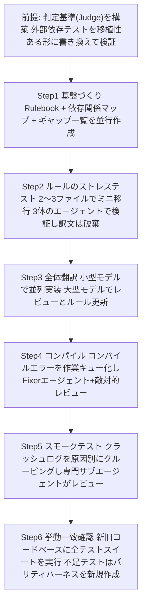
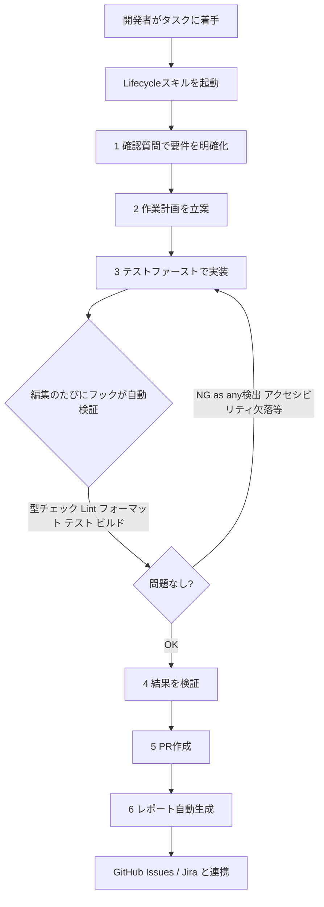
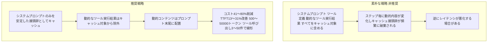

# Daily Briefing 2026-07-23

## 1. Anthropicが実践する大規模コード移行の手法（原題: How Anthropic Runs Large-Scale Code Migrations with Claude Code）

- **URL**: https://claude.com/blog/ai-code-migration
- **公開日**: 2026-07-16
- **著者・媒体**: Anthropic / Claude Blog

### 本文翻訳
Anthropicは自社エンジニアリングチームでの実例をもとに、Claude Codeを用いた大規模コード移行の手法を公開した。根底にある発想は「個々のファイルを人手で直すのではなく、コードを生み出す工程（ループ）そのものを直す」というものである。

具体例として、BunをZigからRustへ移行したプロジェクトでは、100万行のコードを2週間足らずで移行し、既存テストスイートの100%がマージ前にパスした。API利用コストは約16.5万ドル（入力59億トークン、出力6.9億トークン）。結果としてバイナリサイズは19%縮小、性能は2〜5%向上、メモリ使用量は6,745MBから609MBへ削減された。別の例では、Mike KriegerがPythonコードベースをTypeScriptへ週末のうちに16.5万行移植し、8段階のフェーズゲートと3回の敵対的レビューを経て2,700万トークンを消費した。

移行は前提となる「判定基準（Judge）」の構築から始まる。外部依存テストと内部依存テストを分類し、外部向けテストは移行先言語でも動くように書き換え、判定基準自体が元のコード（合格）と壊れたコード（不合格）を正しく判定できるか検証する。

その上で6ステップを踏む。Step1「基盤づくり」では、翻訳規則をまとめた「Rulebook」（構造温存型移行では対応表、再設計型移行では設計文書になる）、並列作業を可能にする「依存関係マップ」、暗黙知の差分を記録する「ギャップ一覧」を並行して作成する。Step2「ルールのストレステスト」では、2〜3ファイルだけで「試験航海」を行う。1体のエージェントがRulebookに従い翻訳し、別の1体は専門的直感で翻訳し、3体目が両者の差分をレビューして新たな規則を作る。訳文自体は破棄し、規則の精緻化だけを目的とする。Step3「全翻訳」では、並列の実装エージェントとレビューエージェントからなるマルチエージェントループを展開する。大量処理には小型モデル、レビューと規則策定には大型モデル（Claude Fable 5、Opus 4.8）を使い分け、不確実な箇所はTODOコメントでフラグを立てる。作業キューは「出力ファイルが存在するか」で完了判定できる機械的・再開可能な設計にする。

Step4〜6は共通のループ構造を持ちながら、必要な人間の判断が段階的に減っていく。Step4（コンパイル）ではコンパイラのエラー一覧を作業キューとしてFixerエージェントを投入し敵対的レビューを行う。Step5（スモークテスト）ではクラッシュログを作業キュー化し、原因別にグルーピングして専門サブエージェントがレビューする。Step6（挙動一致確認）では新旧両コードベースに全テストスイートを実行し、テストが不足する箇所はパリティハーネスを新規作成する。

著者らは、この手順を「絶対的な設計図ではなく出発点」と位置づけ、個々の失敗ではなくパターンに着目すること、レビューは常に敵対的に・検証は常に機械的（コンパイラ・差分・テストスイートを審判とする）に行うこと、人手の時間はRulebookとストレステストの段階に集中投下し、以降は自動的に収束させることを推奨している。TypeScript移植ではコンパイル時間がプラットフォームあたり8分から約2秒に短縮され、専用デプロイ基盤を廃止できた。

### 重要ポイント
- 「個々のファイルではなく、コードを生み出す工程（ループ）を直す」が核心発想
- 判定基準（Judge）となるテストスイートの構築が全ての土台
- 2〜3ファイルでの「ストレステスト」でルールを精緻化してから全体展開する
- 小型モデルで並列実装、大型モデルでレビュー・ルール策定という役割分担でコストを最適化
- 作業キューを「出力ファイルの存在」で完了判定できる機械的・再開可能な設計にする

### 図解


### 現場での適用方法
**スキル化の例（SKILL.md）**
```yaml
---
name: large-scale-code-migration
description: 大規模コード移行（言語間ポーティングや大規模リファクタリング）を、判定基準
  構築→基盤整備→ストレステスト→全体翻訳→コンパイル→スモークテスト→挙動一致確認の
  6+1ステップで進めるためのガイド。数百〜数千ファイル規模の移行に着手する際に使う。
---

## 実行手順
0. Judge構築: 移行元/移行先どちらでも同じ基準で合否判定できるテストスイートを用意する
1. Rulebook・依存関係マップ・ギャップ一覧を並行作成する
2. 2〜3ファイルでミニ移行を実施しルールを検証する（訳文は破棄）
3. 小型モデルで並列翻訳、大型モデルでレビュー・ルール更新を行う
4. コンパイルエラーを作業キューにしてFixerエージェントを投入する
5. スモークテストのクラッシュログを作業キュー化する
6. 全テストスイートで新旧の挙動一致を確認する

## 運用ルール
- 作業キューは「出力ファイルの存在」で完了判定できる機械的な形にする
- レビューは常に敵対的（別エージェントが疑ってかかる）に行う
- 人手の時間はStep0〜2（Judge・Rulebook・ストレステスト）に集中投下する
```

**運用手順（作業キューの機械的設計の例）**
```bash
# 完了判定を「出力ファイルの存在」に基づく機械的な設計にすることで、
# 中断・再開が容易な再開可能キューになる
for f in $(find <SRC_DIR> -name "*.<SRC_EXT>"); do
  out="<DST_DIR>/$(basename "$f" ".<SRC_EXT>").<DST_EXT>"
  [ -f "$out" ] && continue   # 完了済みはスキップ
  claude -p "<RULEBOOK_PATH> のルールに従い $f を <DST_LANG> に翻訳し $out に出力せよ" \
    --model <SMALL_MODEL>
done
```

### 期待効果
記事中の実例では、Bunの Zig→Rust 移行で100万行を2週間未満・テスト100%通過で完了し、バイナリサイズ19%縮小、性能2〜5%向上、メモリ使用量が6,745MBから609MBへ削減された。Python→TypeScript移植ではコンパイル時間がプラットフォームあたり8分から約2秒に短縮され、専用デプロイ基盤を廃止できた。

### 注意点
- ガイドは「出発点であり設計図ではない」と明記されており、移行ごとにRulebookのカスタマイズが必要
- 大型移行では数百万トークン規模のAPIコスト（Bun例で約16.5万ドル）が発生するため、事前の予算試算が必須
- テストスイートが不十分だと判定基準（Judge）自体の信頼性が下がるため、Step0に十分な時間を割く必要がある

---

## 2. Redpandaのフロントエンドチーム向けClaude Codeスキル＆フック集（原題: Engineering Den: Claude Code Skills and Hooks for Frontend Teams）

- **URL**: https://www.redpanda.com/blog/claude-code-skills-hooks-frontend
- **公開日**: 2026-05-07
- **著者・媒体**: Beniamin Malinski / Redpanda Blog（Engineering Den）

### 本文翻訳
Redpandaはフロントエンドチーム向けに、40種類超のClaude Codeスキルと90種類超のフックをまとめた共有リポジトリ「ui-harness」を公開した。1つのコマンドでリポジトリに導入でき、チーム全体で自動的な品質チェックが働くようになる。

これらのフックは、Claude CodeおよびCodexの内部で作業の最中にリアルタイムでトリガーされる点が、一般的なpre-commit/pre-pushフックと異なる。1回の反復（イテレーション）が終わるたびに、型チェック・Lint・フォーマット・テスト・ビルドを自動検証する。また、TypeScriptを実質JavaScript化してしまう`as any`のような型安全性を損なうアンチパターン、テスト不足、ブラウザ固有の回帰、アクセシビリティの欠落などを、PRに入る前に検出する。

中心となるのは「Lifecycle（ライフサイクル）スキル」である。これはClaude Codeを、確認質問による要件明確化 → 作業計画の立案 → テストファースト実装 → 結果検証 → PR作成 → レポート自動生成、という構造化された開発フローに沿わせる。生成されたレポートは設定に応じてGitHub IssuesやJiraのチケットと連携する。

記事はまた、コミュニティプロジェクト「SandCastle」にも言及している。これはClaude Codeインスタンスごとに隔離されたDockerコンテナを提供し、同じローカルのスキルとフックを保ったまま、チケットに対する自律的な反復作業を可能にするものである。リポジトリはGitHub上（redpanda-data/ui-harness）で公開されており、コミュニティのフィードバックはRedpanda Slackコミュニティで受け付けている。導入時には、Claude CodeとCodexの両方のユーザーが同じプロジェクトで共同作業する際にセットアップが正しく行われているかを確認する検証スクリプトも用意されている。

### 重要ポイント
- 40種類超のスキルと90種類超のフックを1コマンドで導入できる共有リポジトリ化
- フックはpre-commit/pushではなく、Claude Code/Codexの作業中にリアルタイムで発火する
- 型安全性・アクセシビリティ・ブラウザ回帰など、PR前に検出すべき項目を自動チェックする
- 「Lifecycleスキル」が要件確認→計画→テストファースト実装→検証→PR→レポートの流れを標準化する
- Dockerで隔離した環境（SandCastle）と組み合わせ、チケット単位の自律反復も可能にする

### 図解


### 現場での適用方法
**スクリプト化の例（Claude Codeのフック設定）**
```json
{
  "hooks": {
    "PostToolUse": [
      {
        "matcher": "Edit|Write",
        "hooks": [
          { "type": "command", "command": "<REPO_PATH>/.claude/hooks/frontend-quality-check.sh" }
        ]
      }
    ]
  }
}
```

```bash
#!/usr/bin/env bash
# <REPO_PATH>/.claude/hooks/frontend-quality-check.sh
set -euo pipefail
cd "<REPO_PATH>"
npx tsc --noEmit
npx eslint --max-warnings=0 .
npx prettier --check .
npx vitest run --changed
if grep -rn ": any" --include="*.ts" --include="*.tsx" src/; then
  echo "型安全性違反 (as any) を検出しました" >&2
  exit 1
fi
```

**CLAUDE.md への追記例**
```markdown
## フロントエンド開発フロー（Lifecycle）
1. 着手前に要件について確認質問を行う
2. 作業計画を提示してから実装に入る
3. 実装前にテストを書く（テストファースト）
4. 編集のたびにフック（型/Lint/フォーマット/テスト/ビルド）の結果を確認する
5. 検証が通ってからPRを作成し、変更内容のレポートを添える
```

### 期待効果
チーム全体でAI支援開発の品質基準を統一でき、型安全性違反やアクセシビリティ欠落といった、本来レビューで指摘すべき項目をPR前の段階で自動的に減らせる。1コマンド導入により、チーム内でのスキル・フックのばらつきを防ぎ、自動更新で最新版を配布できる。

### 注意点
- 記事は概要紹介が中心で、フック個々の実装コードや導入効果の定量データは公開されていない
- Claude CodeとCodex双方に対応させる設計のため、単一ツールのみを使うチームには一部オーバーヘッドがある可能性がある
- 90種類超のフックを維持する保守コストについては言及がない

---

## 3. プロンプトキャッシュは壊れやすい：長時間稼働エージェントタスクにおける評価研究（原題: Don't Break the Cache: An Evaluation of Prompt Caching for Long-Horizon Agentic Tasks）

- **URL**: https://arxiv.org/abs/2601.06007
- **公開日**: 2026-01-09（改訂: 2026-01-31）
- **著者・媒体**: Elias Lumer, Faheem Nizar, Akshaya Jangiti, Kevin Frank, Anmol Gulati, Mandar Phadate, Vamse Kumar Subbiah / arXiv プレプリント

### 本文翻訳
Elias Lumerらは、OpenAI・Anthropic・Googleの3プロバイダーを横断して、長時間稼働する（long-horizon）エージェント型タスクにおけるプロンプトキャッシュの効果を定量評価した論文を発表した。評価には「DeepResearchBench」というベンチマークを用いた。これはエージェントがWeb検索ツール呼び出しを自律的に繰り返しながら複雑なリサーチ課題を解くもので、10,000トークン規模のシステムプロンプトを持つセッションを500件以上収集し、APIコストとTTFT（最初のトークンが返るまでの時間）を測定した。

比較したキャッシュ戦略は3種類——(1) フルコンテキストをすべてキャッシュする素朴な方法、(2) システムプロンプトのみをキャッシュする方法、(3) 動的なツール実行結果を除外してキャッシュする方法——である。結果、戦略(2)(3)を組み合わせた場合、3プロバイダー平均でAPIコストを41〜80%削減し、TTFTを13〜31%改善できた。一方で、素朴なフルコンテキストキャッシュは、逆説的にレイテンシを悪化させる場合があることも判明した。

効果が線形に得られる範囲として、プロンプト長500〜50,000トークン、ツール呼び出し数3〜50件が確認されている。推奨される設計は、動的なコンテンツ（実行時に変化する値）をプロンプトの末尾に配置すること、動的なツール実行結果をキャッシュ接頭辞から除外すること、動的な関数呼び出し定義をリクエストごとに生成しないことの3点である。著者らは、キャッシュ境界の戦略的な制御が「とにかく全部キャッシュする」という素朴な発想よりも一貫して優れた結果をもたらすと結論づけている。

### 重要ポイント
- OpenAI/Anthropic/Google横断で500件超のエージェントセッションを用いた定量評価
- 推奨戦略（システムプロンプトのみキャッシュ＋動的ツール結果除外＋動的内容を末尾配置）でコスト41〜80%削減、TTFT13〜31%改善
- 素朴な「フルコンテキストキャッシュ」はレイテンシを悪化させる場合がある
- 効果はプロンプト長500〜50,000トークン、ツール呼び出し3〜50件の範囲で線形に得られる
- 動的な関数呼び出し定義を都度生成しないことがキャッシュ効率維持の鍵

### 図解


### 現場での適用方法
**スキル化の例（SKILL.md）**
```yaml
---
name: prompt-cache-boundary-review
description: エージェントのプロンプト設計がキャッシュ境界のベストプラクティス
  （システムプロンプトのみキャッシュ・動的ツール結果を除外・動的内容を末尾配置）
  に沿っているかをレビューする。新しいツールやエージェントをプロンプトに追加する際、
  またはキャッシュヒット率が低下している場合に使う。
---

## チェック項目
1. システムプロンプトの中に、ステップごとに変化する値（時刻・実行結果・
   ワーキングメモリ）が混入していないか
2. ツール実行結果（動的）をキャッシュ対象の接頭辞に含めていないか（除外すべき）
3. 動的な関数呼び出し定義をリクエストごとに生成していないか
4. 動的コンテンツはプロンプトの末尾（会話の最後）に配置されているか
5. プロンプト長・ツール呼び出し数が増えても方針を維持できているか
   （500〜50,000トークン、ツール呼び出し3〜50件の範囲で効果は線形）

## 判定
上記いずれかに違反する場合、システムプロンプト全体でキャッシュミスが発生し、
コスト41〜80%削減の効果を得られない可能性が高い。
```

### 期待効果
2026-07-22のブリーフィングで紹介したProjectDiscoveryの実運用結果（キャッシュヒット率7%→84%、コスト59%削減）を、3社のLLMプロバイダーを横断した500件超のセッションによる学術的評価で裏付ける形となっており、キャッシュ境界設計のベストプラクティス（コスト41〜80%削減、TTFT13〜31%改善）としての信頼性が高い。

### 注意点
- ベンチマークはWeb検索を伴うリサーチタスク（DeepResearchBench）が対象であり、他タスク種別への一般化は要検証
- 論文はプレプリント（査読前）であり、2026年1月提出・同月改訂版である
- 効果が線形に得られる範囲（トークン数・ツール呼び出し数）を超える極端なケースでの挙動は論文の対象外
