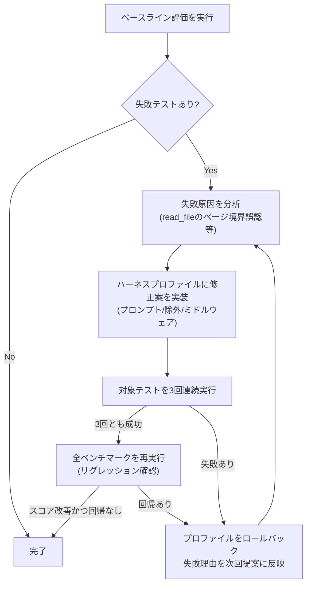
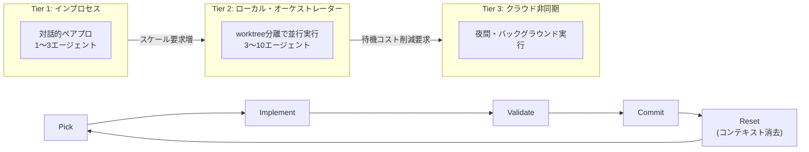
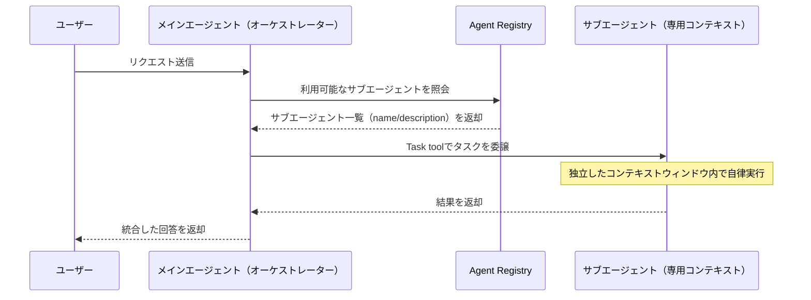

# Daily Briefing 2026-07-24

## 1. NVIDIA Nemotron 3 Ultra向けLangChain Deep Agentsハーネスプロファイルの作り方（原題: Create a LangChain Deep Agents Harness Profile for NVIDIA Nemotron 3 Ultra to Improve Performance）

- **URL**: https://developer.nvidia.com/blog/create-a-langchain-deep-agents-harness-profile-for-nvidia-nemotron-3-ultra-to-improve-performance/
- **公開日**: 2026-07-08
- **著者・媒体**: Sean Lopp, Matthew Penn, Sukrit Rao / NVIDIA Technical Blog

### 本文翻訳
本記事の核心は「モデルのファインチューニングではなく、ハーネス（プロンプト・ミドルウェア・ツール構成）を調整することで、オープンウェイトモデルであるNemotron 3 Ultraをクローズドなフロンティアモデルに近い精度まで引き上げられる」という主張である。これを可能にした背景として、ハーネス特化型の評価ベンチマークが整備されたこと、LangChainのagent harness profilesがモデルごとのカスタマイズ入口を提供するようになったことの2点を挙げる。

具体的な改善プロセスは3段階のループとして提示される。まずベースライン評価を実行し、失敗パターンを特定する。記事で例示されるのは`test_read_file_truncation_recovery_with_pagination`というテストで、大きなファイルをページ単位（100行）で読む`read_file`ツールが、最終行を返さずに途中で「読み終えた」と誤認してしまう不具合である。原因は、ツールの返り値に「まだファイルが続いている」ことを示すシグナルがないため、モデルが最初のページの末尾をファイルの終端と誤解する点にあった。

次に、この失敗に対する修正をハーネスプロファイルとして実装する。プロンプト変更・不要ツールの除外・ミドルウェア追加という3種類の変更手段が用意されており、記事では`ReadFileContinuationNoticeMiddleware`というミドルウェアを`wrap_tool_call`で実装し、`read_file`の返り値が行数上限に達している場合に「ファイルはこの先も続いている可能性が高く、offsetをずらして再度読むように」という注記を自動的に付加する。これを`HarnessProfile`に登録し`register_harness_profile("nvidia:nemotron-ultra", profile)`で有効化する。

3段階目が検証で、`uv run pytest`でモデルとプロファイルを指定してベンチマークを再実行する。結果、該当テストは失敗0件・成功3件に転じ、全体スコアも127点満点中94点から96点に向上した。

さらに記事は、この手動最適化ループを自動化する「ralph loop」（Geoffrey Huntley考案のパターン）の適用例も示す。`hep langchain ralph`コマンドで、失敗テストの原因分析→修正案の提案→3回連続成功での採用（verify-runs 3）→全ベンチマーク再実行によるリグレッション検出、というサイクルを最大100回試行する。過学習を防ぐため、（1）複数回連続成功のみ採用、（2）試行前にプロファイルをスナップショットし失敗時はロールバック、（3）失敗履歴を次回提案に反映、（4）修正後は全体スイートを再実行、という4原則を明示している。書き込み可能な対象はプロファイルファイルのみに限定し、コードベース本体は読み取り専用とするスコーピング戦略も採る。

### 重要ポイント
- モデルの再学習なしに、プロンプト・ミドルウェア・ツール構成（ハーネス）だけで精度を改善できる
- 失敗の根本原因を1件ずつ特定し、ミドルウェアで「モデルへの注記」を挿入するという軽量な修正で解決する事例を提示
- 「ralph loop」による自動改善サイクル：提案→検証（3回連続成功）→採用/ロールバック→全体再検証
- 過学習防止のため、局所的すぎる修正（辞書への個別ハック等）より汎用的な修正（mechanical fix）を優先する判断基準を持つ
- ベンチマークの一部をhold-out検証セットとして、改善ループから隠しておく運用も推奨

### 図解


### 現場での適用方法

**スキル化の例（Claude Code の SKILL.md）**

```yaml
---
name: harness-profile-tuner
description: エージェントのツール呼び出しが失敗するテストを見つけたら、モデルやプロンプトを直接いじる前に、ミドルウェアで挙動を補正できないか検討する。read/grep等のツールがページング・切り詰め・境界条件で誤動作するケースに特に有効。
---

1. 失敗テストを再現し、ツールの返り値とモデルの解釈のズレを特定する
2. モデル自体やタスク指示文ではなく、ツールのwrap呼び出し層（ミドルウェア）で
   「不足情報の注記を追加する」修正を検討する
3. 修正案を3回連続で成功するまで検証してから採用する
4. 採用後は全体テストスイートを再実行し、他のケースに悪影響がないか確認する
5. 局所的すぎる修正（特定の値のハードコード等）は却下し、汎用的な修正を優先する
```

**運用手順（自前のリポジトリで小さく試す場合）**

```bash
# 1. 失敗するツール呼び出しのテストケースを用意する
pytest tests/tool_edge_cases/ -k "pagination" -v

# 2. ミドルウェア層で不足情報を補う（擬似コード、フレームワークに合わせて調整）
# wrap_tool_call 相当のフックで、ツール応答が「不完全な可能性がある」ときに
# モデル向けの注記文字列を追記する

# 3. 同一テストを3回連続実行して安定性を確認
for i in 1 2 3; do pytest tests/tool_edge_cases/ -k "pagination"; done

# 4. 全体スイートを再実行してリグレッションがないか確認
pytest tests/
```

### 期待効果
記事のベンチマークでは、対象テストが3件失敗→3件成功に転じ、全体スコアが127点満点中94点から96点に向上した（+2ポイント、対象カテゴリでは失敗率100%削減）。モデルの再学習を伴わないため、コスト・時間のかかるファインチューニングなしで即座に適用できる点が最大の利点。

### 注意点
- 「ralph loop」のような自動改善ループは過学習しやすく、ベンチマークの一部を隠しホールドアウトセットとして扱うなど、検証セット汚染への注意が必要
- 修正案の書き込み範囲をプロファイルファイルのみに限定するなど、エージェントの書き込み権限のスコーピングが重要（コードベース本体を書き換えさせない）
- ミドルウェアによる「注記の自動挿入」は特定のツール実装（今回はLangChain Deep Agentsのread_file）に依存するため、他フレームワークではAPIに応じた再実装が必要

---

## 2. 指揮者からオーケストレーターへ：2026年マルチエージェント・コーディング実践ガイド（原題: From Conductor to Orchestrator: A Practical Guide to Multi-Agent Coding in 2026）

- **URL**: https://htdocs.dev/posts/from-conductor-to-orchestrator-a-practical-guide-to-multi-agent-coding-in-2026/
- **公開日**: 2026-04-04
- **著者・媒体**: Stephane Busso / htdocs.dev

### 本文翻訳
著者は「単一のAIアシスタントとリアルタイムでやり取りする指揮者（conductor）」から「複数エージェントを非同期に調整する指揮官（orchestrator）」への移行が起きていると述べ、ツール群を3層に分類する。Tier 1「インプロセス・エージェント」は単一ターミナルセッション内で動く形態（Claude Code subagents、Agent Teams等）で、1〜3個の集中的なエージェントによる対話的なペアプログラミング向け。Tier 2「ローカル・オーケストレーター」は同一マシン上で複数エージェントを分離されたgit worktreeで並行実行する形態（Conductor、Claude Squad、Vibe Kanban等）で、3〜10個のエージェントを既知のコードベースに対して走らせる用途。Tier 3「クラウド非同期」はクラウドVM上でエージェントを実行し「寝ている間に作業が終わっている」体験を提供する形態（Claude Code Web、GitHub Copilot Coding Agent、Jules等）。

各層の代表的ツールを詳述する中で特に紙幅が割かれるのが「Oh My」エコシステム（Yeachan Heo作）で、oh-my-codex・oh-my-openagent（愛称Sisyphus）・oh-my-claudecode（OMC）の3系統を持つ。OMCは19以上の専門化エージェントと40以上のスキルを持ち、Autopilot（アイデアからテスト済みコードまで全自動）、Ralph（検証完了まで自己参照的にループ）、Ralplan（実行前にソクラテス式の対話で計画を明確化）、Ultrapilot（最大5並行ワーカー）という運用モードを持つ。Sisyphus（OmO）は11の専門化エージェント（主オーケストレーターのSisyphus、深い技術担当のHephaestus、戦略計画のPrometheus等）を持ち、エージェントごとに異なるLLM（Claude Opus、GPT-5.4、ローカルのOllama qwen2.5-coder等）をルーティングする設定例が示される。ただし著者は個人プロジェクトで月額2.4万ドルを消費した警告も添えている。

パターン面で最重要とされるのが「Ralph Loop」で、"Pick → Implement → Validate → Commit → Reset"という反復単位を持つ。各反復でコンテキストを完全に消去することで、長時間タスクにありがちな「混乱の蓄積」を防ぎ、小さなタスクの反復がコード品質を保つという考え方である。OMC・OmO・OmXそれぞれにネイティブ実装がある。

もう一つの重要な知見が、AGENTS.md（プロジェクト固有のコンテキストファイル）についてのETH ZurichのGloaguenらの研究引用である。LLMが自動生成したAGENTS.mdは、人間が書いたものと比べてタスク成功率を約3%低下させ、推論コストを20%以上増加させたのに対し、開発者が手書きしたコンテキストファイルは約4%の改善をもたらしたという。著者はこれを根拠に「エージェントにAGENTS.mdへ直接書き込ませず、必ずリード（人間）が承認するプロセスを敷き、内容は短く保つ」ことを推奨する。

著者は最後に4週間の段階的導入ロードマップを提示する：1週目はClaude Code Agent Teamsを有効化しAGENTS.mdを人手で書く、2週目はOMCを導入しAutopilotモードを試す、3週目はOpenCode+OmOを別マシンに構築しローカルモデルでユーティリティタスクを処理、4週目はRalph Loopをバックログ処理に採用し夜間実行・朝レビューのサイクルを回す。

### 重要ポイント
- ツールをTier1（対話型・1〜3エージェント）/Tier2（ローカル並行・3〜10エージェント）/Tier3（クラウド非同期）の3層で整理し、自分のワークロードに合った層から始めることを推奨
- 「Ralph Loop」＝Pick→Implement→Validate→Commit→Resetの反復。各反復でコンテキストをリセットすることで長時間タスクの混乱蓄積を防ぐ
- ETH Zurichの研究：LLM生成のAGENTS.mdはタスク成功率を約3%下げ推論コストを20%超増やすが、人間が書いたものは約4%改善する→AGENTS.mdは人間承認必須・簡潔に保つべき
- worktree分離により複数エージェントの並行編集でもマージ衝突を回避できる（Claude Code v2.1.49以降は`claude --worktree <name>`でネイティブ対応）
- 品質ゲートとして「計画のリード承認」「Hooksによる自動lint/test」「読み取り専用の専門レビュアーエージェント（ビルダー3〜4体につきレビュアー1体）」を推奨

### 図解


### 現場での適用方法

**CLAUDE.md への追記例**

```markdown
## Multi-Agent Workflow Policy

- AGENTS.md / CLAUDE.md への追記は必ず人間（リード）がレビューして承認する。
  エージェントが自動生成した内容をそのままコミットしない。
- 内容は簡潔に保つ。推奨セクション：
  - STYLE（コーディング規約）
  - GOTCHAS（ハマりどころ、既知の制約）
  - ARCH_DECISIONS（採用技術・その理由）
  - TEST_STRATEGY（テスト方針）
- 長時間タスクは Ralph Loop 方式で回す：
  1 タスクを1回のセッションで完結させ、完了後はコンテキストをリセットして
  次のタスクへ進む。1セッションに複数の無関係なタスクを詰め込まない。
```

**運用手順（Ralph Loop をバックログ処理に導入する）**

```bash
# 1. アトミックなタスクを8〜10件、JSONで定義する
cat > tasks.json <<'EOF'
[
  {"id": 1, "task": "Fix flaky test in auth module"},
  {"id": 2, "task": "Add input validation to /api/users"}
]
EOF

# 2. 夜間に1タスクずつ実行し、各タスク完了後にコンテキストをリセットする
#    (擬似コード。実際のCLI/フレームワークのループ実行機能に合わせる)
for task in $(jq -c '.[]' tasks.json); do
  claude --new-session -- "Implement: $task. Run tests before committing."
done

# 3. 朝、生成された差分・コミットをレビューする
git log --oneline -10
```

### 期待効果
worktree分離による並行実行で、既知のコードベースに対して3〜10エージェントを同時に走らせられる。Ralph Loopによりコンテキストの混乱蓄積を防ぎコード品質を保てるとされ、事例として紹介されたStoneforgeでは「コードベース方向づけにかかる時間が20分→3分に削減」という数値が挙げられている。AGENTS.mdを人間手書き・簡潔化することで約4%のタスク成功率改善が見込める（LLM自動生成では逆に約3%低下）。

### 注意点
- マルチプロバイダ・マルチエージェント構成（OmO等）は運用が複雑化し、著者自身が個人プロジェクトで月額2.4万ドルを消費した例を警告として挙げている。コスト監視の仕組みなしに本格導入しない
- AGENTS.mdはエージェントに直接書き込ませず、必ず人間レビューを挟むこと（自動生成は逆効果というエビデンスあり）
- ツール・エコシステムの多くが「リサーチプレビュー」段階（Claude Code Agent Teamsなど）であり、破壊的変更や仕様変更のリスクがある

---

## 3. Spring AI エージェント・パターン第4回：サブエージェント・オーケストレーション（原題: Spring AI Agentic Patterns (Part 4): Subagent Orchestration）

- **URL**: https://spring.io/blog/2026/01/27/spring-ai-agentic-patterns-4-task-subagents/
- **公開日**: 2026-01-27
- **著者・媒体**: Christian Tzolov / Spring公式ブログ

### 本文翻訳
本記事はSpring AIにおけるエージェント設計パターン連載の第4回で、「単一の汎用エージェントに何もかもやらせるのではなく、特化したサブエージェントに委譲すべき」という主張を軸に、Claude Code由来のサブエージェント概念をSpring AIのJavaエコシステムに実装する方法を解説する。汎用エージェント1つに全処理をやらせると、コンテキストウィンドウが肥大化し性能が劣化するため、コンテキストウィンドウを分離したサブエージェントに処理を分散させることが有効だとする。

実装は3つの主要コンポーネントから成る。(1) メインエージェント（オーケストレーター）：ユーザーとの対話を担当し、Agent Registryから利用可能なサブエージェント情報を取得する。(2) エージェント設定ファイル：`agents/`フォルダ配下にMarkdown形式（YAMLフロントマター＋本文）で定義する。(3) サブエージェント本体：独立したコンテキストウィンドウで動作し、メインエージェントとは異なるLLM（例：軽量タスクにはhaiku、複雑な分析にはopus）を割り当てられる。

実行フローは、まずLLM（オーケストレーター）がユーザーのリクエストを評価し、Agent Registry内の利用可能なサブエージェントを確認する。適合するサブエージェントが見つかれば、Task toolを通じてタスクを委譲し、サブエージェントは自身の専用コンテキストウィンドウ内で自律的に作業し、結果を親エージェントに返却する。

Maven依存関係として`org.springaicommunity:spring-ai-agent-utils:0.4.2`を追加し、`TaskToolCallbackProvider.builder()`で`chatClientBuilder`と`subagentReferences`（`ClaudeSubagentReferences.fromRootDirectory(...)`でエージェント定義ディレクトリを指定）を設定してビルドする。サブエージェント定義のMarkdownファイルは、`name`（一意の識別子）、`description`（いつ使うべきかの説明。オーケストレーターがルーティング判断に使う）、`tools`（許可するツール一覧）、`disallowedTools`（明示的に禁止するツール）、`model`（haiku/sonnet/opusのいずれか）を必須フィールドとして持つ。

組み込みで提供されるサブエージェントとして、Explore（読み取り専用ツールのみでコードベースを探索する）、General-Purpose（読み書き両方でリサーチ・実行を行う）、Plan（実装戦略を立案する、読み取りと検索のみ）、Bash（git操作・ビルド実行等、Bashツールのみ）の4種が紹介される。

複雑度に応じたモデルルーティングも本記事の要点で、サブエージェント定義の`model`フィールドを指定するだけで「単純なタスクは安価なモデルへ、複雑な分析は高性能モデルへ」というルーティングを実現できる。制限事項として、サブエージェントは自身のサブエージェントを生成できない（Task toolの二重利用は禁止）という設計上の制約が明記されている。

### 重要ポイント
- 汎用エージェント1体に全処理を任せるとコンテキストウィンドウ肥大化で性能が劣化するため、専門特化したサブエージェントへの委譲が有効
- サブエージェントはMarkdown（YAMLフロントマター）で定義：`name`/`description`/`tools`/`disallowedTools`/`model`の5要素
- `description`フィールドがオーケストレーターのルーティング判断材料になるため、「いつ使うべきか」を明確に書くことが重要
- モデルルーティングをサブエージェント単位で設定でき、タスクの複雑度に応じてコストと性能をバランスできる
- サブエージェントは自身のサブエージェントを生成できない（委譲は1階層のみ）という制約がある

### 図解


### 現場での適用方法

**スクリプト化の例（Maven依存関係 + サブエージェント定義）**

```xml
<!-- pom.xml -->
<dependency>
    <groupId>org.springaicommunity</groupId>
    <artifactId>spring-ai-agent-utils</artifactId>
    <version>0.4.2</version>
</dependency>
```

```java
// オーケストレーター側のセットアップ
var taskTools = TaskToolCallbackProvider.builder()
    .chatClientBuilder("default", chatClientBuilder)
    .subagentReferences(
        ClaudeSubagentReferences.fromRootDirectory("<REPO_PATH>/src/main/resources/agents"))
    .build();
```

```markdown
---
name: code-reviewer
description: プルリクエストの差分をレビューし、バグ・セキュリティ・スタイル違反を指摘する際に使用する。読み取り専用でコードを変更しない。
tools: Read, Grep, Glob
disallowedTools: Write, Edit, Bash
model: sonnet
---

あなたはコードレビュー専任のサブエージェントです。
差分中のバグ・セキュリティリスク・命名規則違反を指摘してください。
修正は行わず、指摘のみ行ってください。
```

**運用手順**

```bash
# 1. agents/ ディレクトリを作成し、役割ごとにMarkdown定義を追加する
mkdir -p <REPO_PATH>/src/main/resources/agents
# 2. name/description/tools/model を明記した定義ファイルを配置する
# 3. Maven依存関係を追加してビルドする
mvn clean install
# 4. オーケストレーターからのルーティングをログで確認しながら
#    description の書き方を調整する（曖昧だと誤ルーティングが起きる）
```

### 期待効果
コンテキストウィンドウを役割ごとに分離することで、単一汎用エージェント構成に比べてコンテキスト肥大化による性能劣化を避けられる。モデルルーティングにより、単純作業を安価なモデル（haiku等）に回すことでコスト最適化と応答速度向上が期待できる。

### 注意点
- `description`フィールドの書き方が曖昧だと、オーケストレーターが適切なサブエージェントにルーティングできない
- サブエージェントは自身のサブエージェントを生成できないため、多階層の委譲構造は設計できない（1階層限定）
- Spring AI固有のライブラリ（`spring-ai-agent-utils`）に依存するため、他言語・他フレームワークではAPIレベルでの再実装が必要
