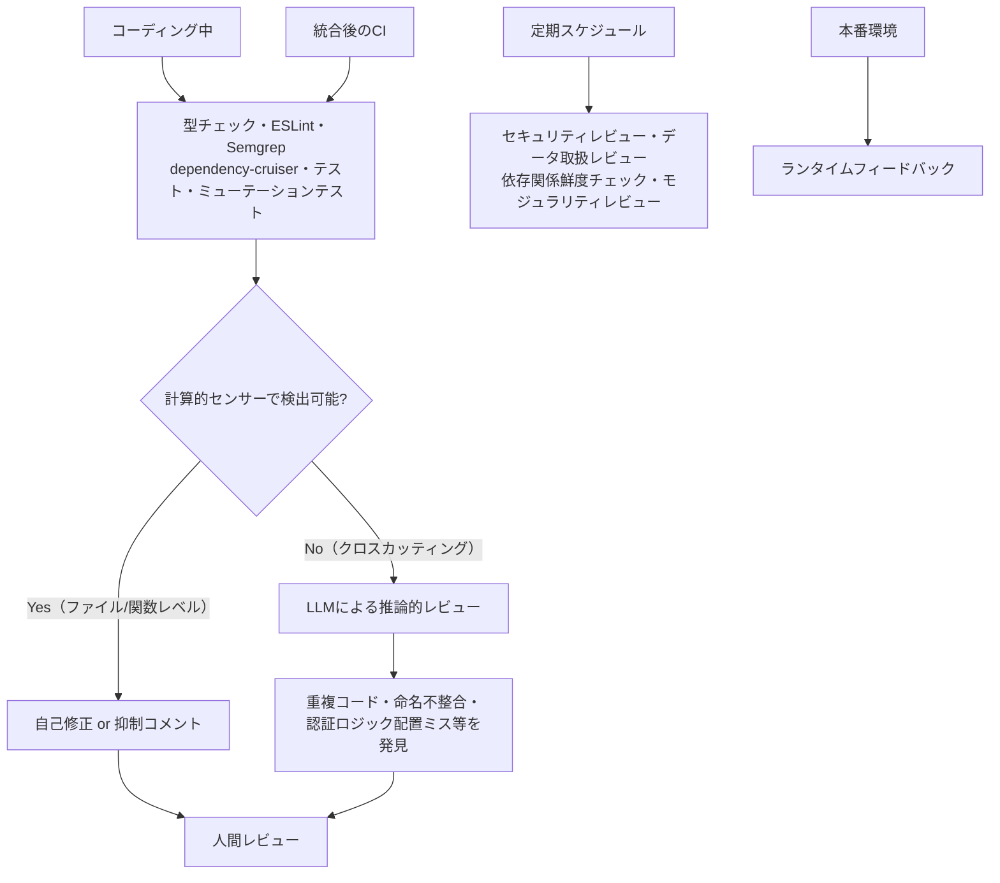
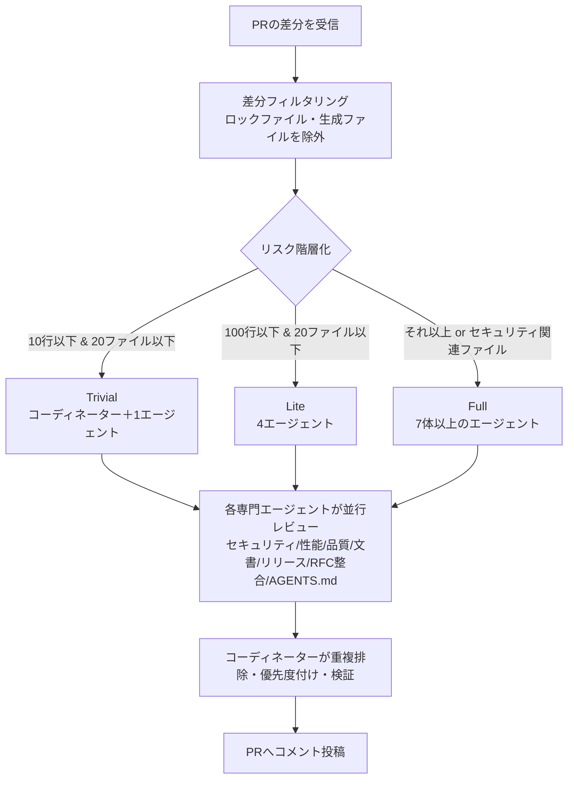
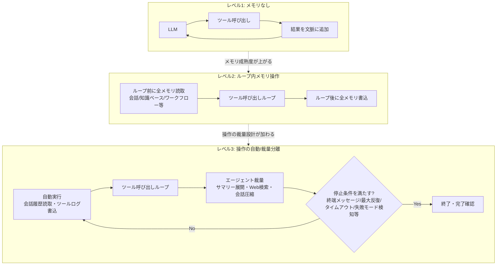

# Daily Briefing 2026-07-25

## 1. コーディングエージェントのための保守性センサー（原題: Maintainability Sensors for Coding Agents）

- **URL**: https://martinfowler.com/articles/sensors-for-coding-agents.html
- **公開日**: 2026-05-27
- **著者・媒体**: Birgitta Böckeler / martinfowler.com（Thoughtworks）

### 本文翻訳
著者はまず「保守性（maintainability）」を、「時間とともにコードベースを変更することを容易かつ低リスクにすること＝内部品質」と定義する。人間の開発者にとって内部品質が低いコードが変更を難しくするのと同様に、AIエージェントにとっても内部品質の低いコードベースは害になる。もつれたコードベースで作業するエージェントは、既存実装の探索先を誤ったり、重複コードに気づかず不整合を生んだり、タスク本来の範囲を超えて余計なコンテキストを読み込まざるを得なくなったりする。実際、関数の最大引数数・ファイル行数・関数行数・循環的複雑度といった基本的なコード品質ルールすら、著者のプロジェクトでは当初ESLintのデフォルト設定で有効になっていなかったという。

そこで著者は、TypeScript/Next.js/React製の社内分析ダッシュボードを題材に、開発の各段階（コーディング中・統合後のCI・定期スケジュール・本番環境）で動く「センサー」群を実装し、その効果を検証した。

まず基本的なリント（ESLint）では、単にデフォルトの警告を出すだけでなく、エージェント向けにカスタムのガイダンスメッセージを与えることが有効だった。例えば`no-explicit-any`の警告に対しては、「型付けの重要性とコード肥大化のトレードオフを説明した上で、エージェント自身に判断させ、型を導入しない場合は理由をコメント付きで抑制させる」という指示を与えている。

次に依存関係ルール（dependency-cruiser）では、`clients`層が上位の`services`層に依存してはならない、といった層状アーキテクチャを強制するルールを定義した。違反時のエラーメッセージにアーキテクチャの意図を書き込むことで、エージェントが自己修正しやすくなる。

カップリング分析については、生の結合度データ単体はノイズが多くあまり役に立たなかった一方、LLMによる意味的解釈（重複したルート実装の発見、フロントエンド複数ページでのバックエンド呼び出しの不整合、認証ロジックの不適切な配置など）は有用だったとしている。

さらにミューテーションテスト（Stryker）は、テストスイートの実効性を可視化する上で重要だった。あるマッパー関数は100%のステートメントカバレッジを達成していたにもかかわらず、実際には13個のミューテーションが生存しており、アサーションが不十分であることが判明した。

結論として、著者は「計算的センサー（リント・型チェック）はファイル・関数レベルで最も効果的だった一方、モジュラリティのようなクロスカッティングな懸念は、生データだけでは解釈が難しく、LLMによる意味的レビューが必要だった」と総括する。また`max-lines`と`max-lines-per-function`のようなルール同士がトレードオフを起こす（関数を小さく分割した結果、複雑さがコンポーネントのプロパティチェーンに移動してしまう）といった課題も報告している。最後に「これらのセンサーは品質への信頼を高めるが、人間を完全にループから外す魔法の解決策ではない」としつつも、レビュー体験と信頼度は明確に改善したと述べている。

### 重要ポイント
- 保守性の低いコードベースは人間だけでなくAIエージェントにも悪影響を与える（誤った実装探索・重複・過剰なコンテキスト読み込み）
- リントは「デフォルト警告」ではなく「エージェント向けの判断基準を説明したカスタムメッセージ」にすることで効果が上がる
- dependency-cruiser等でアーキテクチャの層構造を強制し、違反メッセージに設計意図を書き込むと自己修正が進む
- ミューテーションテストにより「カバレッジ100%でもアサーションが弱いテスト」を検出できる
- 計算的センサー（リント・型）はファイル単位、推論的センサー（LLMレビュー）はクロスカッティングな課題に強みが分かれる

### 図解


### 現場での適用方法

**CLAUDE.md への追記例**

```markdown
## Maintainability Sensors

- `no-explicit-any` 等のリント警告が出た場合、単に抑制するのではなく
  型付けの必要性とコード肥大化のトレードオフを自分で判断すること。
  抑制する場合は理由をコメントで明記する:
  // eslint-disable-next-line @typescript-eslint/no-explicit-any -- <理由>
- server/clients/ 配下は server/services/ 配下に依存してはならない
  （dependency-cruiser のルール "clients-no-services" で検出される）。
  違反した場合はレイヤー構造を見直すこと。
- テストを書いたら100%カバレッジで満足せず、境界値・異常系の
  アサーションが十分かを自問すること（ミューテーションテストで検証可能）。
```

**スクリプト化の例（dependency-cruiser ルール）**

```javascript
// .dependency-cruiser.js
module.exports = {
  forbidden: [
    {
      name: "clients-no-services",
      comment: "API clients must not depend on the orchestration layer above them",
      severity: "error",
      from: { path: "^server/clients/", pathNot: "/__tests__/" },
      to: { path: "^server/services/" },
    },
  ],
};
```

```bash
# ミューテーションテストで「弱いテスト」を洗い出す
npx stryker run --mutate "src/**/mappers/*.ts"
# 生存したミューテーション（カバレッジはあるがアサーションが弱い箇所）を確認
```

### 期待効果
記事内の実例では、100%カバレッジのマッパー関数に13個のミューテーションが生存しているのを発見するなど、従来のカバレッジ指標では見えなかった品質問題を可視化できた。計算的センサーと推論的センサーを組み合わせることで、レビュー範囲の網羅性とレビュー効率の両方が改善したと著者は報告している。

### 注意点
- センサー同士がトレードオフを起こすことがある（関数行数制限を守ると複雑さが別の場所に移動する等）ため、複数ルールの相互作用を継続的に観察する必要がある
- CLAUDE.md等の「ガイド」とセンサーの整合性を保つ運用コストが発生する（ガイドが古くなり、センサーの基準と矛盾するケースがある）
- ミューテーションテストは計算資源を多く消費するため、常時実行ではなく手動トリガー等で段階的に運用するのが現実的

---

## 2. Cloudflareが大規模運用するAIコードレビュー基盤（原題: Orchestrating AI Code Review at Scale）

- **URL**: https://blog.cloudflare.com/ai-code-review/
- **公開日**: 2026-04-20
- **著者・媒体**: Ryan Skidmore / The Cloudflare Blog

### 本文翻訳
Cloudflareはコードレビューの待機時間が数時間に及ぶ課題を抱えていた。既存のAIコードレビューツールは柔軟性が不足し、単一の巨大プロンプトに全レビュー観点を詰め込む素朴なLLMアプローチでは、存在しない構文エラーを指摘するなど大量のノイズが発生し、複雑な社内コードベースでは期待した結果が得られなかった。そこでCloudflareは、単一の万能エージェントではなく、観点ごとに専門化した複数のエージェントを並行実行し、コーディネーターが重複排除・優先度付け・検証を行う仕組みに転換した。

具体的には最大7種類の専門エージェント（セキュリティ／パフォーマンス／コード品質／ドキュメンテーション／リリース管理／内部エンジニアリングRFCとの整合性を見るコンプライアンス＝Codex／AIエージェント向け指示ファイルAGENTS.mdの鮮度を検証するエージェント）を並行して走らせる。セキュリティエージェントはSQLインジェクション・XSS・認証バイパス・ハードコードされたシークレットなどを検出し、コード品質エージェントは論理エラーや命名規則違反を検出する（実際に最も多くの指摘を生成するのはこのエージェントだという）。

システムの中核はプラグインアーキテクチャで、`ReviewPlugin`インターフェースが Bootstrap（並行実行・失敗しても致命的にならない）→ Configure（順序実行・失敗すると致命的）→ postConfigure（リモート設定取得等の非同期処理）という3段階のライフサイクルを持つ。子プロセスとの通信にはJSONLストリーミングを採用し、100行または50ミリ秒ごとにバッファリングして処理する。

変更の規模に応じてレビューの重さを自動的に切り替えるリスク階層化も特徴的だ。変更が10行以下かつ20ファイル以下ならTrivial（コーディネーター＋1エージェントの計2体のみ稼働）、100行以下かつ20ファイル以下ならLite（4エージェント稼働）、それを超える場合や50ファイルを超える場合はFull（7体以上のフル稼働）に分類される。ただしセキュリティ関連ファイルへの変更は、変更規模に関わらず常にFullレベルで実行される。差分フィルタリングによりロックファイルや自動生成ファイルは除外される。またモデルプロバイダーの障害時には、Netflix Hystrix由来のサーキットブレーカーパターンで自動的に別モデルへフェイルバックし、Cloudflare WorkersとKVストアを使ったリアルタイムのモデル切り替え設定も可能にしている。タイムアウトは個別タスクが5分、レビュー全体で25分と規定されている。

30日間の運用実績として、131,246回のレビュー実行、対象48,095件のマージリクエスト、159,103件の指摘を生成し、レビュー1件あたりの中央値コストは0.98ドル、中央値完了時間は3分39秒、キャッシュヒット率は85.7%だったと報告されている。ただし著者は、アーキテクチャ判断やシステム横断的な影響の見極めは依然として人間のレビューに依存する限界があると認めている。

### 重要ポイント
- 単一の万能AIレビュープロンプトはノイズが多く、観点別に専門化した複数エージェント＋コーディネーターによる重複排除・優先度付けの方が実用的
- 変更の行数・ファイル数・セキュリティ関連ファイルの有無で、レビューの重さ（Trivial/Lite/Full）を自動的に切り替える「リスク階層化」がコストと精度のバランスを取る鍵
- プラグインの実行を Bootstrap（並行・非致命的）→ Configure（順序・致命的）→ postConfigure（非同期）の3段階に分離することで、堅牢性と拡張性を両立
- サーキットブレーカーパターンでモデルプロバイダー障害時に自動フェイルバックする設計は本番運用に必須
- 30日間で13万件超のレビューを中央値0.98ドル・3分39秒で処理し、85.7%のキャッシュヒット率を達成（ただし建築判断は人間依存）

### 図解


### 現場での適用方法

**運用手順（CIパイプラインへの段階的導入）**

```bash
# 1. 変更規模を計測し、リスク階層を判定するスクリプトをCIに組み込む
CHANGED_LINES=$(git diff --stat origin/main... | tail -1 | awk '{print $4}')
CHANGED_FILES=$(git diff --name-only origin/main... | wc -l)
SECURITY_TOUCHED=$(git diff --name-only origin/main... | grep -E "auth|crypto|secrets" | wc -l)

if [ "$SECURITY_TOUCHED" -gt 0 ]; then
  TIER="full"
elif [ "$CHANGED_LINES" -le 10 ] && [ "$CHANGED_FILES" -le 20 ]; then
  TIER="trivial"
elif [ "$CHANGED_LINES" -le 100 ] && [ "$CHANGED_FILES" -le 20 ]; then
  TIER="lite"
else
  TIER="full"
fi
echo "Review tier: $TIER"

# 2. tierに応じて起動するレビューエージェント数を切り替える
#    trivial: security のみ / lite: security+quality+perf+docs / full: 全観点
```

**スキル化の例（Claude Code の SKILL.md）**

```yaml
---
name: tiered-pr-review
description: PRの差分規模に応じてレビュー観点の数を自動調整する。小さな変更には
  セキュリティチェックのみ、大きな変更やauth/crypto/secrets関連ファイルの変更には
  セキュリティ・性能・品質・ドキュメント・リリース影響の全観点を適用する。
---

1. `git diff --stat` で変更行数・ファイル数を取得する
2. auth/crypto/secrets 等のセキュリティ関連パスへの変更有無を確認する
3. 上記に基づき Trivial/Lite/Full のいずれかを判定する
4. 判定結果に応じてレビュー観点（セキュリティ/性能/品質/文書/リリース）を選択して実行する
5. 各観点の指摘を重複排除・優先度付けしてから1つのレビューコメントにまとめる
```

### 期待効果
Cloudflareの実績では、30日間で131,246回のレビューを中央値0.98ドル・3分39秒で完了し、85.7%のキャッシュヒット率でコストを抑制している。リスク階層化により小さな変更への過剰なレビュー実行を避けつつ、セキュリティ関連の変更には確実にフルレビューを適用でき、レビュー待機時間の大幅な短縮が期待できる。

### 注意点
- 単一の巨大プロンプトでの実装は「存在しない構文エラーの指摘」等のノイズを生みやすく、観点別分割とコーディネーターによる検証が実質的に必須
- サーキットブレーカーやKVベースの動的モデル切り替えなど、本番耐障害性を作り込むにはインフラ投資が必要で、小規模チームでは簡略化が必要
- 記事内でも明言される通り、アーキテクチャ判断やシステム横断的な影響評価は人間のレビューに依存し続ける

---

## 3. エージェントループの正体：エージェントエンジニアが押さえるべき3つのレベル（原題: The Agent Loop Decoded: Three Levels Every Agent Engineer Must Know）

- **URL**: https://blogs.oracle.com/developers/the-agent-loop-decoded-three-levels-every-agent-engineer-must-know
- **公開日**: 2026-06-11
- **著者・媒体**: Richmond Alake / Oracle Developers Blog

### 本文翻訳
著者はまず、Claude CodeやCursorのような日常的なAI開発ツールが「リクエスト読み込み→リポジトリ検査→ファイル編集→テスト実行→失敗観察→再編集」というサイクルを繰り返している事実を挙げ、これを「エージェントループ」＝「推論・行動・結果観察のサイクルが反復される制御構造」と定義する。長期的なタスクは一度の前向きな推論パスでは完結できないため、このループが必要になるとする。そのうえで、メモリ管理の成熟度に応じてループ実装を3つのレベルに分類し、タスクの複雑さと実装レベルのミスマッチがエージェントの自己反復・コンテキスト喪失を招くと指摘する。

レベル1「LLM＋ツール＋レスポンス」は永続メモリを持たず、文脈ウィンドウのみがメモリとして機能する。実装は「システムプロンプトとユーザーメッセージを送る→ツール呼び出しがあれば実行し結果を追加する→ツール呼び出しがなくなれば終了」という単純なループで、各実行は毎回ゼロから始まるため、既に完了した作業を繰り返したり矛盾した出力を出したりする弱点がある。

レベル2「ループ内のライフサイクル」では、メモリの読み書きがループ内に組み込まれる。著者は「メモリ拡張エージェント（情報を取得して注入するだけ）」と「メモリ対応エージェント（エンコード・保存・取得・注入・削除を主体的に管理する）」を区別し、Oracle AI Databaseを用いた6種類のメモリ型（会話履歴・知識ベース・ワークフロー・ツールボックス・エンティティ・サマリー）を紹介する。会話履歴はスレッドIDによる正確検索、知識ベースはHNSW索引によるベクトル類似度検索というように、メモリ型ごとに適した検索方式が異なる。読み取りはループ実行前にまとめて行い、書き込みはループ後にまとめて行うパターンが基本形だが、この段階ではノイズの多い検索結果や古い情報のキャッシュ、ツールスキーマの過負荷といった失敗モードが生じやすい。

レベル3「ループ内外での操作分離」では、どの操作を自動実行し、どの操作をエージェントの判断に委ねるかを明確に設計する。会話履歴の読み取りやツールログの書き込みのように毎回必要な操作は自動化する一方、サマリーの展開やWeb検索、会話圧縮のタイミングはエージェント自身に判断させる。ここで導入される重要技術が、コンテキストエンジニアリング（トークン使用量の監視、詳細な会話履歴を要約に置き換える圧縮、3〜4千トークンに及ぶ長いツール出力をDBに保存し参照IDのみをコンテキストに残す「ツール出力オフロード」）、セマンティックツール発見（全ツール定義を渡すのではなく、クエリに関連するものだけを検索して提示する）、冪等性（ツール呼び出しに安定的なキーを事前割り当てし、ネットワーク障害時の安全な再試行を可能にする）、そしてプロンプトキャッシング（古いメッセージを書き換えず追記することで接頭辞ベースのキャッシュを保つ）である。

停止条件についても具体的に7種類を挙げる：ツール呼び出しのない終端メッセージ、タスク固有の目標達成判定、最大反復回数到達、壁時計タイムアウト（デフォルト60秒などの例示あり）、回復不可能なエラー、失敗モード検知（同一ツール呼び出しの3回連続繰り返し等）、明示的な完了フラグ。著者は「終端メッセージがツール呼び出しを含まないからといって、タスクが完了したとは限らない。完了の確認はエージェント側の責任である」と釘を刺す。

結論として著者は、エージェントループ（オンラインでの実時間実行）・訓練ループ（オフラインでのモデル生成、数日〜数週間単位）・フィードバックループ（評価信号の逆伝播）という3つのループがメモリ層を接点として繋がっていると論じる。エージェント実行で生成される経験（エピソード記録・エンティティ抽出・ワークフロー・評価信号）は、継続的学習を通じて訓練ループの信号源になり得るとし、メモリ層の設計は単なる運用判断ではなく、システムの学習能力を左右する長期的な決定だと結んでいる。

### 重要ポイント
- エージェントループを「メモリなし（Lv1）→ループ内メモリ操作（Lv2）→自動/裁量の操作分離（Lv3）」の3段階で捉え、タスクの複雑さに見合ったレベルを選ぶ
- 6種類のメモリ型（会話・知識ベース・ワークフロー・ツールボックス・エンティティ・サマリー）を使い分け、検索方式もそれぞれ最適化する
- 「自動実行すべき操作」と「エージェントの裁量に委ねる操作」を明確に線引きすることが、Lv2からLv3への鍵
- 停止条件は「終端メッセージ」だけに頼らず、タイムアウト・最大反復・失敗モード検知など7種類を組み合わせて設計する
- ツール出力オフロード・セマンティックツール発見・冪等性・プロンプトキャッシングは、長時間稼働エージェントのコンテキスト管理における具体的な実装技術

### 図解


### 現場での適用方法

**スクリプト化の例（停止条件付きループの骨格）**

```python
def call_agent(query, thread_id="1", max_iterations=10, max_execution_time_s=60.0):
    start_time = current_time()
    iterations = 0
    messages = build_initial_context(query, thread_id)  # Lv2: ループ前にメモリを読取

    while iterations < max_iterations:
        if current_time() - start_time > max_execution_time_s:
            break  # 壁時計タイムアウト

        response = call_llm(messages, tools=discover_relevant_tools(query))  # セマンティックツール発見

        if not response.tool_calls:
            break  # 終端メッセージ（ただし完了の確認は別途必要）

        for call in response.tool_calls:
            result = execute_tool(call, idempotency_key=call.id)  # 冪等性
            if len(result) > 3000:
                log_id = save_tool_log(result)  # ツール出力オフロード
                messages.append(tool_reference_message(log_id))
            else:
                messages.append(tool_result_message(result))

        if is_repeated_failure(messages, window=3):
            break  # 失敗モード検知（同一ツール3回連続失敗）

        iterations += 1

    write_back_memory(thread_id, messages)  # Lv2: ループ後にまとめて書込
    return messages
```

**CLAUDE.md への追記例**

```markdown
## Agent Loop Stop Conditions

エージェントループを設計・実装する際は、以下7種の停止条件のうち
タスクに応じて複数を組み合わせること。終端メッセージ（ツール呼び出しなし）
だけを完了判定に使わない：
1. ツール呼び出しのない終端メッセージ
2. タスク固有の目標達成判定
3. 最大反復回数
4. 壁時計タイムアウト
5. 回復不可能なエラー
6. 同一ツール呼び出しの3回連続繰り返し等の失敗モード検知
7. 明示的な完了フラグ
```

### 期待効果
自動実行と裁量実行を分離するレベル3の設計により、毎回発生する定型操作（履歴読取・ログ書込）のレイテンシを抑えつつ、圧縮や検索のタイミング判断をエージェントに委ねることで無駄な処理を減らせる。ツール出力オフロードやプロンプトキャッシングを組み合わせることで、長時間稼働タスクでもコンテキストウィンドウの肥大化とキャッシュ無効化を抑制できる。

### 注意点
- 記事の実装例はOracle AI Database／Oracle OCIを前提にした部分があり、他のベクトルDB・訓練基盤で再現するには構成の置き換えが必要
- 停止条件を「終端メッセージのみ」に頼ると、タスクが実際には未完了のまま終了してしまうリスクがある。完了確認ロジックを別途持つべき
- レベル3の「自動/裁量の線引き」はタスク特性に依存するため、汎用的な正解はなく、自分のワークロードで実験的に調整する必要がある
