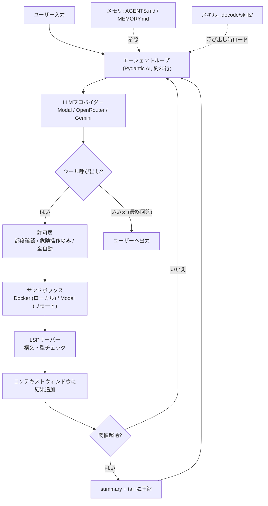
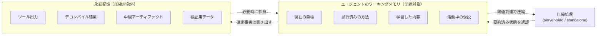
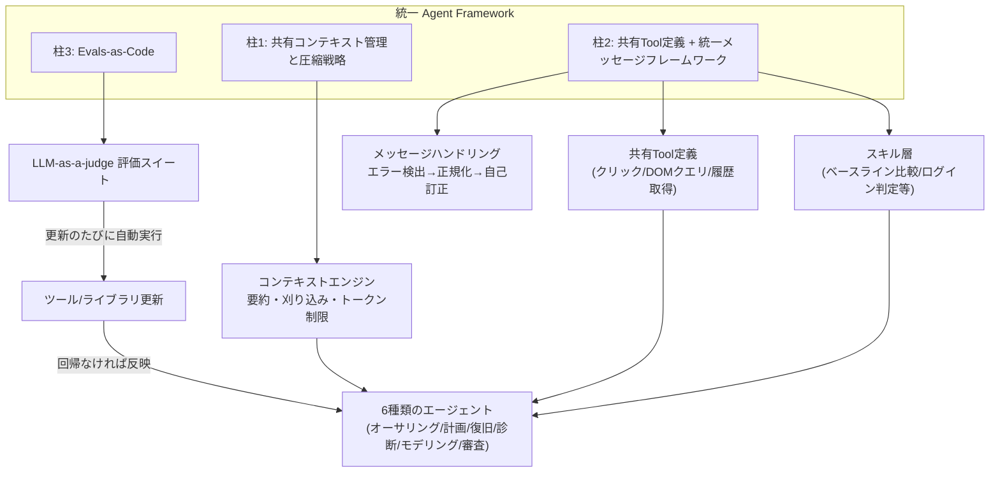

# Daily Briefing 2026-07-26

## 1. コーディングエージェントをゼロから構築する：ハーネスアーキテクチャ（原題: Building a Coding Agent From Scratch: Harness Architecture）

- **URL**: https://www.decodingai.com/p/building-a-coding-agent-from-scratch-system-design
- **公開日**: 2026-07-22
- **著者・媒体**: Paul Iusztin / Decoding AI（Substack）

### 本文翻訳
著者はLangChainの「Terminal-Bench」実験を引き合いに出し、「同じモデルのままハーネスだけを変更したところ、順位が約30位から上位5位まで上昇した」という事実を提示する。この記事全体の主張は明快で、コーディングエージェントの性能を決めるのはモデルそのものではなく、その周囲に構築される「ハーネス」だという立場を取る。

記事は全8レッスンからなるオープンソースコース「Building a Coding Agent From Scratch」の第1回で、「Decode」という名のエージェントを段階的に構築していく。進行は「基本のループ実装」→「ハーネス構築（実行環境・許可・サンドボックス）」→「本格運用（ベンチマーク・デプロイ）」の3段階。

エージェント本体はPydantic AIを用いた約20行のコードにすぎない。`AgentDeps`データクラスに`cwd`（作業ディレクトリ）、`emit`（イベント配信）、`gate`（許可ゲート）、`resolve_permission`（承認要求）を注入し、`output_type`は「最終回答の文字列」か「人間の承認待ちで一時停止するツール呼び出し」の2種類の終了方法を定義する。エージェント自体が薄いのは意図的な設計で、周囲の6モジュールが実質的な役割を担う。

6モジュールは以下の通り。①**LLMプロバイダー**：Modal（OSSモデルの自己ホスト）・OpenRouter・Geminiの3系統を切り替え可能にし、ループ自体はどのプロバイダーを使っているか関知しないクリーンアーキテクチャを採用。②**サンドボックス**：`bash`実行権を持つエージェントのリスクを、ローカルはDocker、リモートはModal Sandboxesで隔離する。③**許可層**：最重要のガードレールで、「毎回一時停止（デフォルト）」「危険操作のみ一時停止（エディット）」「完全自動」の3モードを持ち、Claude Codeの権限モードに相当する。④**メモリ**：データベースを使わず、`AGENTS.md`（プロジェクト指示）と`MEMORY.md`（学習内容）というプレーンテキストのみで運用し、コードベースは`grep`で都度探索する「just-in-time reads」を優先。⑤**スキル**：`.decode/skills/`配下に置く再利用可能なワークフローで、呼び出し時のみロードしコンテキスト肥大化を防ぐ。⑥**LSPサーバー**：シンボル定義・型情報・関数呼び出しをインデックスし、編集直後に高速な構文チェックのフィードバックを返す「システム内で最も安価なフィードバックループ」と位置づける。

さらに「コンパクション（圧縮）」戦略として、ウィンドウが閾値を超えると`[summary, *tail]`パターン（古い部分を要約、直近は保持）で圧縮し、手動の`/compact`や完全消去の`/clear`も用意する。「多くのコンテキストはモデルを混乱させる（context decay）」という認識のもと、有限な予算を能動的に管理する必要性を説く。

実行モードは2つ。**インタラクティブTUI**では`prompt_toolkit`と`Rich`で会話ログ型UIを実装し、実行中に新しい指示が来ても即座に割り込まず「ステアリングキュー」にバッファし、ツール呼び出し中でない安全な境界（次のモデル呼び出し前）でのみ注入する優先度ゲートを設ける。**リモートモード**では、Kitaru（ZenML製ランタイム）が制御平面として複数のハーネスを並列実行し、耐久実行・チェックポイントからの再開・分散HITL（人間参加）を提供する。

観測可能性は3つの問いに対応する。「動作するか」＝固有タスクの内部ベンチマーク、「まだ動作するか」＝新機能ごとの回帰テスト、「本番でも動き続けるか」＝Opik（Comet製のLLM観測基盤）による各セッション・各ツール呼び出しのトレース記録とライブスコアリング。

### 重要ポイント
- 同一モデルでもハーネスの変更だけでベンチマーク順位が大きく変動する（LangChainの実験で約30位→上位5位）
- エージェント本体は薄く保ち、LLMプロバイダー・サンドボックス・許可層・メモリ・スキル・LSPの6モジュールに責務を分離する
- メモリはDBではなくプレーンテキスト（AGENTS.md / MEMORY.md）＋都度grep探索を採用し、「古いインデックス」より「必要時読込」を優先
- 許可層は3段階モード（都度確認／危険操作のみ確認／全自動）でガードレールの中核を担う
- 観測可能性は「動くか」「まだ動くか」「本番でも動くか」の3層評価（内部ベンチマーク・回帰テスト・本番トレース）で担保する

### 図解


### 現場での適用方法

**CLAUDE.md への追記例**（許可層とメモリ運用の方針を明文化する）:
```markdown
## エージェント運用ルール（ハーネス設計指針）

- 破壊的な操作（rm -rf、force push、DB migration の apply 等）は
  実行前に必ず一時停止してユーザーに確認すること。
- 通常のファイル編集・テスト実行は自動実行してよい。
- プロジェクト固有の知見は CLAUDE.md 本体ではなく `MEMORY.md` に追記し、
  肥大化を避けるため要点のみ簡潔に書くこと（学んだコマンド・ハマった落とし穴等）。
- コードベース全体をインデックス化しようとせず、必要な箇所だけ
  Grep/Glob でその都度探索すること（"just-in-time reads"）。
```

**スキル化の例**（再利用可能な圧縮ワークフローをスキルにする）:
```markdown
---
name: context-compact
description: コンテキストウィンドウが閾値を超えた際に、直近のやり取りは
  そのまま保持しつつ、それより前の履歴を要約してトークンを節約する。
  長時間セッションで作業が重くなってきたときに使う。
---

1. 直近 N ターン（目安: 5〜10）はそのまま保持する。
2. それより古い履歴から「目標」「試した方法」「学んだこと」「未解決の疑問」
   のみを抽出し、簡潔な summary ブロックにする。
3. ツール出力の生ログや検証済みアーティファクトは summary に含めず、
   別ファイル（例: artifacts/ 配下）に保存したままにする。
4. summary + 直近ターンを新しい会話履歴として置き換える。
```

### 期待効果
記事が引用するLangChainの実測では、モデルを変えずにハーネスのみ変更してTerminal-Benchの順位が約30位から上位5位に改善した。許可層・メモリ・LSPの分離により、記事は「システム内で最も安価なフィードバックループ」（LSPによる構文チェック）を確保できるとしている。

### 注意点
本記事は教育コースの第1回でありPython実装は学習目的（著者自身が実運用にはTypeScriptやGoを推奨）。具体的なベンチマーク数値や6モジュールの詳細実装はコース全体（8レッスン）に分散しており、本記事単体は設計思想とアーキテクチャ図が中心で、フル実装コードは別レッスンで扱われる。

---

## 2. コンテキストエンジニアリング：自動マルウェア分析における圧縮とエージェントメモリ（原題: Context Engineering: Compaction & Agent Memory for Automated Malware Analysis）

- **URL**: https://www.sentinelone.com/labs/context-engineering-compaction-agent-memory-for-automated-malware-analysis/
- **公開日**: 2026-07-02
- **著者・媒体**: Gabriel Bernadett-Shapiro（SentinelOne 主任AI研究科学者） / SentinelOne Labs

### 本文翻訳
自動マルウェア分析エージェントは、関数の特定、コードパスの追跡、文字列・API・関数呼び出し関係の解釈、型推論といった長時間タスクを行う。問題は「コンテキストの蓄積速度が関連性の保持速度を上回る」ことだ。各ターンでコンテキストが積み上がり、数ステップ前の情報が有用でなくなっても、モデルはその全履歴を律儀に保持し続けてしまう。

SentinelLABSはこの課題に対し「コンテキスト圧縮（compaction）」の効果を実測した。結果は、入力トークンが約86%削減、出力トークンが約31%削減、推論トークンが約33%削減、モデル呼び出し回数も1回減少という大幅な効率化を達成しながら、総合評価スコアは実質的に変化しなかった。ただし唯一の負の効果として「ドメインオブジェクトモデリング能力」（マルウェアの動作を説明する上位レベルの構造を復元する能力）が低下した。

この結果を支える設計原則が「ワーキングメモリと信頼できるアーティファクトの分離」である。圧縮の対象となるのは、現在の目標・試行済みの方法・学習した内容・活動中の仮説・未解決の質問といった「作業状態」に限定する。一方、ツール出力・デコンパイル結果・中間アーティファクト・検証用データといった確定的な事実は圧縮せず永続記憶に保存する。ドメインオブジェクトモデリング能力の低下は、圧縮が「後続で有用となるはずの構造的推論を平坦化してしまった」ことが原因と分析されており、これが正確なアーティファクトを永続記憶側に確実に残す必要性を裏付けている。

具体的な圧縮方式は2つ。1つ目は「サーバーサイド圧縮」で、APIコール自体に圧縮閾値を組み込む。実装例は次の通り：

```python
response = client.responses.create(
    model="gpt-5.5",
    input=conversation,
    store=False,
    context_management=[
        {"type": "compaction", "compact_threshold": 200000}
    ],
)
```
これは自動的でアーキテクチャ変更が最小限という利点がある。2つ目は「スタンドアロン圧縮」で、専用エンドポイントを明示的に呼び出し、フェーズの境界（初期トリアージ後、深い関数分析に入る前など）で使う：

```python
compacted = client.responses.compact(
    model="gpt-5.5",
    input=long_input_items,
)
next_input = [
    *compacted.output,
    {"type": "message", "role": "user", "content": next_user_message},
]
response = client.responses.create(
    model="gpt-5.5", input=next_input, store=False,
)
```

記事は用途別の使い分けも示す。長時間実行のコーディングエージェントにはサーバーサイド圧縮（自動・低オーバーヘッド）、複数段階の調査ワークフローにはスタンドアロン圧縮（明確なフェーズ境界を活用）、チャットアシスタントにはサーバーサイド、圧縮前後の効果測定にはスタンドアロン（直接比較が可能）が向くとしている。

結論として6つの実装原則を提示する。①ワーキングメモリと信頼できるアーティファクトを分離する、②圧縮は長時間実行ワークフローに限定して適用する、③まずサーバーサイド圧縮から始める、④コスト指標だけでなく成果（タスク成功率など）指標も追跡する、⑤失敗情報は後続の意思決定に重要なので保持する、⑥圧縮は「証明されるまでは損失的（lossy）」と仮定し、評価で検証してから本番投入する。記事全体は「プロンプトエンジニアリングからコンテキストエンジニアリングへの転換」という潮流の中に、圧縮を複雑なタスクで一貫性を維持する基盤インフラとして位置づけている。

### 重要ポイント
- 圧縮により入力トークン約86%・出力トークン約31%・推論トークン約33%削減、総合スコアは実質不変という実測結果
- 唯一の副作用は「ドメインオブジェクトモデリング能力」の低下（上位構造の復元力）
- 「ワーキングメモリ（圧縮対象）」と「確定的アーティファクト（永続記憶・圧縮対象外）」を明確に分離する設計が肝
- サーバーサイド圧縮（自動・閾値ベース）とスタンドアロン圧縮（明示的・フェーズ境界向け）を用途で使い分ける
- 圧縮は「証明されるまでは損失的」と仮定し、成果指標で検証してから本番導入すべき

### 図解


### 現場での適用方法

**運用手順**（既存のエージェント基盤に段階的に圧縮を導入する）:
1. まず対象のエージェントが「長時間実行タスク（複数ツール呼び出し・複数フェーズ）」かを確認する。単発の一問一答エージェントには圧縮を導入しない。
2. サーバーサイド圧縮から着手する（利用モデル/APIが `context_management` 相当の機能を持つ場合はそれを使う。持たない場合は下記スクリプト例のように自前でしきい値管理を行う）。
3. 圧縮ロジックに「ツール出力・検証済みアーティファクトは別ストア（ファイル/DB）に退避してから圧縮する」処理を必ず挟む。
4. 圧縮前後でタスク成功率・スコアを比較する評価セットを用意し、導入前に効果を検証する。

**スクリプト化の例**（自前実装でワーキングメモリと永続アーティファクトを分離する疑似コード）:
```python
TOKEN_THRESHOLD = 150_000

def maybe_compact(history, artifact_store):
    if count_tokens(history) < TOKEN_THRESHOLD:
        return history

    # 1. 確定事実（ツール出力・検証済みデータ）を永続ストアへ退避
    for turn in history:
        if turn["type"] == "tool_output":
            artifact_store.save(turn["id"], turn["content"])

    # 2. ワーキングメモリ（目標・仮説・学習内容）だけを要約
    working_memory = extract_working_memory(history)  # 目標/試行/学習/仮説/未解決の質問
    summary = summarize(working_memory)

    tail = history[-5:]  # 直近ターンはそのまま保持
    return [summary, *tail]
```

### 期待効果
記事の実測値では、入力トークン約86%・出力トークン約31%・推論トークン約33%の削減を、総合評価スコアをほぼ落とさずに達成できる。長時間実行のマルウェア分析タスクのような、複数ツール呼び出しを伴う調査系ワークフローで特に効果が大きいと報告されている。

### 注意点
ドメインオブジェクトモデリング能力（上位構造の復元）は低下するため、後段で構造的な整理・報告が必要なタスクでは、圧縮前に重要な構造情報を明示的に永続記憶へ書き出す設計が必須。また記事自体が「圧縮は証明されるまでは損失的と仮定すべき」と釘を刺しており、評価なしでの安易な導入は推奨されていない。

---

## 3. 本番環境でエージェントを構築して3年（第2部）（原題: Three Years of Building Agents in Production (Part 2)）

- **URL**: https://www.mabl.com/blog/three-years-of-building-agents-in-production-part-2
- **公開日**: 2026-07-08
- **著者・媒体**: Lauren Leidal（mabl エンジニア・テックリード） / mabl Blog

### 本文翻訳
mablは2023年夏のPaLM実験以来、生成AIによるテスト自動化を模索してきた。2025年秋のカンファレンスではテスト計画エージェントとオーサリング（執筆）エージェントのデモに成功し「mabl-as-a-teammate」という構想が現実であることを示した。しかしデモの裏側では、支えるインフラがスケールに耐えられていなかった。オーサリングエージェントは以前と同じ問題――少数の専門家への依存、RAGパイプラインのクエリ方法や評価スイート設定が属人化している状態――を抱えたままだった。

そこでmablは2025年12月から2026年1月にかけて新機能開発を一時停止し、バラバラだった個別実装を単一の統一「Agent Framework」に集約する「ウィンター・スプリント」を実施した。これにより、メモリ管理の複雑さの抽象化、クロスプラットフォームの状態管理統一、モデル変更への対応標準化を進め、オーサリングエージェントは第6世代に到達。各改良が次の開発サイクルを加速させる好循環が生まれた。同時期、社内75以上のリポジトリにAIエージェントを展開し、コード作成・評価・本番デプロイの自動化を全エンジニアが日常的に使う体制に移行した。ここでの重要な学びは、AI活用のボトルネックは実際には「ビルド速度・CI/CD設定・テストカバレッジ」といった基礎的なソフトウェアエンジニアリングの実践にあったという点だ。

Agent Frameworkは3本柱で構成される。**柱1：共有コンテキスト管理と圧縮戦略**。アプリケーションのDOM全体・ユーザー履歴・テスト実行ログをそのままモデルに投入すると過負荷やハルシネーションを招くため、コンテキストエンジンを集約し、標準化・再利用可能な圧縮モジュールで自動的に要約・刈り込み・トークン制限管理を行う。単一要素の評価であれ数千件のテスト実行であれ、同一のバトルテスト済みパイプラインを通す。

**柱2：共有Tool定義と統一メッセージフレームワーク**。当初はボタン発見からビジュアル状態評価までを1つの巨大プロンプトで行うモノリシック設計だったが、これを放棄し「ツールとスキルの層構造」に移行した。共有Tool定義はLLMに提示する機能スキーマを標準化するもので、単純なアクション（「要素をクリック」）だけでなく動的なコンテキスト取得（「DOMクエリ」「過去のテスト履歴取得」）にも使う。ツールを改善すればそれを使う全エージェントが即座に恩恵を受ける。スキルはツールの上に構築される再利用可能な認知能力（「ビジュアル状態をベースラインと比較」「ログイン成功判定」等）。さらにメッセージハンドリングフレームワークが、LLMの確率的な性質に起因するツール呼び出しの幻覚・会話追跡の喪失・不正なJSON送信に対し、「エラー検出→正規化→標準的な自己訂正ループ」を全機能横断で統一し、開発者個別のアドホックなリトライ実装を不要にした。

**柱3：Evals-as-Codeと測定可能な安全性**。共有ライブラリを更新すると、あるエージェントの改善が他の3つを誤って壊すリスクがある。そこで評価スイートをパイプラインに直接組み込み、コア「DOMクエリ」ツールを更新するたびに、シミュレートされたエージェントワークフロー全体でLLM-as-a-judge評価を自動実行し、回帰が本番に到達するのを防ぐ。2025年夏に構築した評価スイートがこの基盤として機能している。

実例として、Review Agent（100以上の実オーサリングセッションを毎週分析し構造化品質レポートを生成）がGemini 3へ移行した際、推論ループと早期失敗が2〜4倍削減された一方でハードコード値が増加するという現象が観測された。これはGemini 3がGemini 2.5では完了できなかったテストを完了できるようになったためで、改善の裏に隠れた潜在的な回帰を自動化されたセッション分析が検出した好例として紹介されている。人間とAIの協働モデルとしては、スケール処理はエージェントが担い、数千セッションの中から最も重要な1件をエンジニアが直接確認してニュアンスを補うという役割分担を取る。

組織文化の面では、決定論的なソフトウェアテスト・バックエンド開発から確率的思考への転換、プロンプト作成や非決定論的ワークフローの受容が求められ、エンジニアリング組織の約3分の2がフレームワークへ移行する過程で、AIコーディングエージェントが重要な処理を担う場合でもエンジニア自身がコードを理解していることを確認する運用を徹底した。

記事の結論は「AIスケーリングとは、より良いプロンプトや新しい会話方法の発見ではなく、実は再利用性・共有ライブラリ・標準化されたエラーハンドリングという基礎的なソフトウェアエンジニアリング慣行への回帰である」というもの。AIは基盤となるインフラを増幅する存在であり、良い基礎はより良く、悪い基礎はより悪く増幅される。今後の重点は「適合性（チームメンバーのように感じられる自然さ）」と「効率性（もはやボトルネックはモデル知能ではなくインフラ・可用性・トークンコスト）」の2つだとしている。

### 重要ポイント
- デモの成功と本番スケールは別問題。属人化した専門知識への依存を断つため、開発を一時停止して統一Agent Frameworkへ集約する「ウィンター・スプリント」を実施
- Agent Frameworkは「共有コンテキスト管理・圧縮」「共有Tool定義＋統一メッセージフレームワーク」「Evals-as-Code」の3本柱
- モノリシックな単一巨大プロンプトを廃止し、「ツール」と「スキル」の層構造に再設計
- モデル移行（Gemini 2.5→3）時、指標改善の裏に隠れた回帰を自動化されたセッション分析で検出した実例あり
- 結論：AIスケーリングの本質は基礎的なソフトウェアエンジニアリング（再利用性・共有ライブラリ・標準化エラーハンドリング）への回帰

### 図解


### 現場での適用方法

**CLAUDE.md への追記例**（共有ツール定義とEvals-as-Codeの方針を明文化する）:
```markdown
## エージェント基盤の設計方針

- 個別タスク用に使い捨てのプロンプトを都度書くのではなく、
  共通の Tool（例: `query_dom`, `get_test_history` 等）として定義し、
  複数のエージェントで再利用すること。
- 共通ツールを変更した場合、それを使う全エージェントに影響するため、
  変更前に必ず `evals/` 配下の回帰評価スイートを実行して
  スコア低下がないことを確認してから反映する。
- モデルを切り替えた際は、単純な成功率だけでなく「推論ループ回数」
  「ハードコード値の増加」等の副次指標も比較し、指標改善の裏に
  隠れた回帰がないかセッション単位で確認すること。
```

**運用手順**（既存のAI活用が個別最適でスケールしていないチーム向け）:
1. 各チーム・各エージェントが個別に持っているプロンプト/ツール実装を棚卸しし、重複している機能（DOM取得・履歴取得等）を洗い出す。
2. 重複機能を共有Tool定義として1箇所に集約し、各エージェントはそれを呼び出す形に置き換える。
3. 共有Toolごとに簡易的なLLM-as-a-judge評価（入力例と期待される出力の組を10〜20件程度)を用意し、Tool更新時にCIで自動実行する。
4. モデルやプロンプトを変更するたびに、この評価スイートをベースラインと比較し、回帰がないことを確認してからマージする。

### 期待効果
記事によれば、統一Agent Frameworkへの集約後、オーサリングエージェントは第6世代まで反復が加速し、社内75以上のリポジトリでAIコード生成・評価・デプロイの自動化が全エンジニアの日常業務として定着した。Gemini 3移行時には推論ループと早期失敗が2〜4倍削減されるなど、共有基盤への投資が個別最適よりも大きな効率化をもたらしたと報告されている。

### 注意点
共有ライブラリ化は諸刃の剣で、1つのツール改善が複数エージェントを同時に壊すリスクを伴うため、Evals-as-Codeによる自動回帰検知とセットでなければ導入すべきではない。また組織文化面でも、決定論的な開発に慣れたエンジニアが確率的ワークフローを受け入れるまでに摩擦が生じる点、AIが重要な処理を担っても人間がコードを理解し続ける体制を維持する必要がある点に注意が必要。
