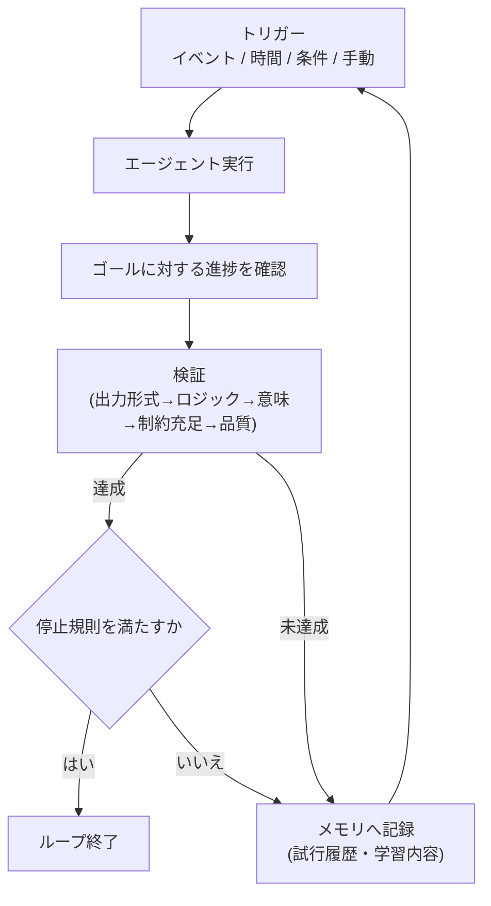
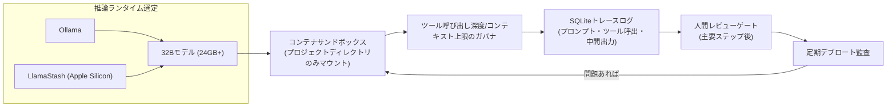
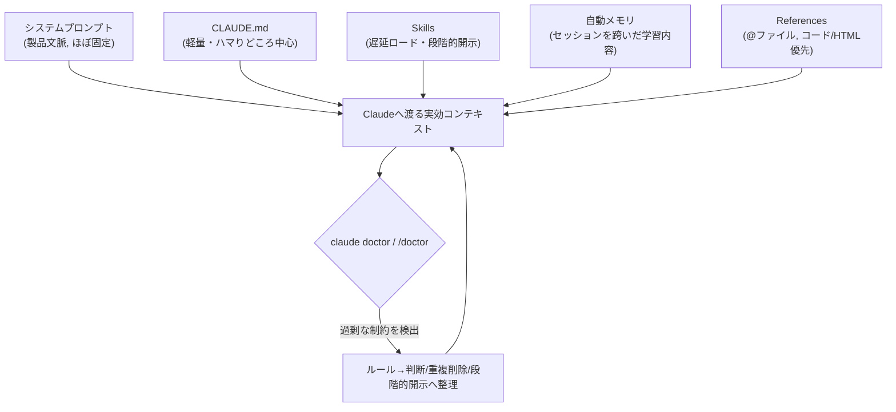

# Daily Briefing 2026-07-27

## 1. コーディングエージェントへの「手取り足取り」をやめる：段階的プロンプトに代わるループ設計工学（原題: Stop Hand-Holding Your Coding Agent: Engineering the Loops that Replace Step-by-Step Prompting）

- **URL**: https://arxiv.org/abs/2607.00038
- **公開日**: 2026-06-28
- **著者・媒体**: Sandeco Macedo／arXiv（cs.SE, プレプリント）

### 本文翻訳
本論文は、コーディングエージェントに人間が逐一ステップバイステップで指示を与える「手取り足取り」型の運用を批判し、代わりに自律的に回り続ける「ループ」を明示的に設計する「ループ工学（loop engineering）」を提唱する。現行のエージェントアーキテクチャには、自律ループを定義・検証・持続させるための標準化された方法が欠けているという課題認識が出発点である。

中心概念は「ループ仕様（loop specification）」で、エージェントが反復タスクを自律的に実行できるようにする形式的記述として5要素からなる。①**トリガー**：ループの開始・再始動を決める起動条件。②**ゴール**：ループが追求する目的・成功基準。③**検証**：ゴール達成を確認する仕組み。検証を欠くと、エージェントは成功を確かめずに前進してしまう。④**停止規則**：ループを終了させる明示的な条件で、無限実行やリソース浪費を防ぐ。⑤**メモリ**：反復間で状態を保持し、過去の試行から学習・適応する仕組み。

各要素はさらにタクソノミー化される。トリガーは「イベント駆動」「時間駆動」「条件駆動」「手動」の4種、ゴールは「完了型」「最適化型」「探索型」「維持型」の4種。検証は5段階の成熟度階層を持つ：①出力の表面的な形式チェック、②ロジック（判断の正しさ）の検証、③意味・意図の妥当性検証、④制約充足の確認、⑤解の質の評価。

実証分析のため、コーディング・データ処理・計画立案など複数領域から実世界の自律ループ50件を収集した「Loop Library」を構築。既存のエージェント実装（研究論文・OSSプロジェクト）をトリガー種別・ゴール・検証機構・領域でカテゴライズし、各ループの仕様要素を文書化してパターンを抽出している。

200件超のエージェント実装を分析した結果、87%が反復構造を持つ一方、その多くは仕様が明示化されていなかった。明示的な検証を実装しているループはわずか34%、状態保持（メモリ）を活用できていないループが約61%、明確な終了条件を欠き無限実行のリスクを抱えるループが46%に上る。コーディング・計画立案領域はオープンエンドな推論タスクより仕様の厳密さが高い傾向にある。そして仕様が明確に定義されたループは、そうでないものに比べ成功率が2.3倍高いという結果が示された。

一方で著者は3つの限界を指摘する。「検証負荷」＝堅牢な検証機構は計算コストが高く、検証の高度化は応答性と精度のトレードオフを生む。「理解負債」＝ループが洗練されるほど、トリガーのロジック・ゴールの意味・メモリ状態・停止条件を同時に把握する必要が生じ、認知的負荷が蓄積する。「認知的委任（cognitive surrender）」＝制御を完全に自律ループへ委ねることで人間の監督が失われるリスクがあり、継続的な監視なしに稼働させると意図から逸脱した創発的挙動が生じ得るため、強力な検証・監視体制の確立が不可欠だとする。

### 重要ポイント
- ループ仕様は「トリガー・ゴール・検証・停止規則・メモリ」の5要素で構成される
- 実世界エージェントの87%が反復構造を持つが、明示的検証(34%)・メモリ活用(39%)・明確な停止規則(54%)を備えるものは少数派
- 仕様が明確なループは成功率が2.3倍高いという実証結果
- 検証の高度化には応答性・コストとのトレードオフがある
- 自律ループへの完全な委任は「認知的委任」のリスクを伴い、監視体制の設計が不可欠

### 図解


### 現場での適用方法

**スキル化の例**（新しい自律ループを実装する前に5要素を洗い出すチェックリスト）:
```markdown
---
name: loop-spec-design
description: 新しい自律的なエージェントループ（例: テスト失敗を自動修正し続ける、
  リファクタリングを継続する等）を実装する前に、トリガー・ゴール・検証・
  停止規則・メモリの5要素を明文化する。無限実行や検証漏れを防ぐために使う。
---

新しいループを設計する際は、実装前に以下を全て文章化すること。

1. **トリガー**: 何がこのループを開始/再開させるか（イベント/時間/条件/手動）
2. **ゴール**: 完了・最適化・探索・維持のどれで、成功をどう定義するか
3. **検証**: 出力形式チェックだけでなく、可能なら「ロジック」「意味」
   「制約充足」「品質」のどの階層まで確認するかを決める
4. **停止規則**: 何回/何分/どの条件で必ず止まるかを数値で明記する
   （「うまくいくまで」のような曖昧な条件を禁止）
5. **メモリ**: 前回の試行結果をどこに（ファイル/DB）どう記録し、
   次回どう参照するか

5要素のいずれかが未定義のままループを自動実行に移してはならない。
```

### 期待効果
論文の実証結果では、仕様化されたループは非仕様化ループに比べ成功率が2.3倍高い。停止規則を数値で明文化することで、無限実行やコスト暴走を未然に防止できる。

### 注意点
検証を厳密にするほど計算コスト・レイテンシが増える（検証負荷）。ループが複雑になるほど関係者が全体を把握しづらくなる（理解負債）。人間の監督を完全に外すと意図から外れた挙動が生じうる（認知的委任）ため、重要な意思決定ポイントには人間レビューを残すべき。

## 2. ローカルエージェント型コーディングワークフロー2026：実践済み完全ガイド（原題: Local Agentic Coding Workflow 2026: The Full Guide [Tested]）

- **URL**: https://www.kunalganglani.com/blog/local-agentic-coding-workflow-2026
- **公開日**: 2026-06-12（2026-07-02更新）
- **著者・媒体**: Kunal Ganglani（個人ブログ）

### 本文翻訳
著者は、ローカルLLMを用いたエージェント型コーディングを日常業務で実際に運用してきた経験に基づき、推論ランタイムの選定から障害対策までを具体的に解説する。

推論ランタイムは4種を比較する。**Ollama**はセットアップが容易でモデルライブラリも豊富な初心者向けだが、オーバーヘッドが無視できない。**LlamaStash**はApple Silicon上で生のllama-serverとの差が1%以内という最小オーバーヘッドを実現し、ツール呼び出しが連鎖するエージェント用途に最適化されている。**LM Studio**はGUI実験には強いが、ヘッドレスなエージェントループには不向き。**素のllama.cpp**は制御性とオーバーヘッドの少なさで最大性能を出せるが、セットアップの難易度が高い。エージェントは1タスクあたり数十回の逐次ツール呼び出しを行うため、スループットではなく「TTFT（Time To First Token）」がループごとに累積する点を重視すべきだと著者は述べる。

ハードウェア要件は、量子化された32Bパラメータモデルを快適に動かすため最低24GBのVRAM/統合メモリが必要とし、Mac M4 Max（48GB以上）またはNVIDIA RTX 4090（24GB）を「スイートスポット」として挙げる。日常的な継続利用には32Bパラメータモデルが実用的なベースラインになるという。

著者は運用上見落とされがちな「5つのサイレントな失敗モード」を提示する。①**温度0でも非決定的**：ハードウェア差・CUDAカーネルの非結合性・GPUスケジューリングにより、同一プロンプトでも出力が変わりうる（著者自身、macOSアップデート後にコード変更なしで挙動が壊れた経験を報告）。対策は決定性の追求より「再現可能性（リプレイ可能性）」を優先し、入力・出力・ツール呼び出し・中間状態を全てログ化すること。②**無制限のツールアクセス**：最新エージェントはアクセス可能なツールを許可なく積極的に使う（Simon WillisonがClaude Fable 5が自律的にHTMLを書きブラウザを起動しスクリーンショットを撮った例を報告）。対策はプロジェクトディレクトリのみにマウントを絞ったコンテナでエージェントを実行すること。③**リトライによるサイレントな不整合**：副作用（ファイル作成、Gitコミット等）を伴うツール呼び出しがリトライで重複実行されうる。対策は再実行前に前回の成功実行を確認するロジックを実装すること。④**制御されないコード肥大化**：エージェントはセッションをまたぐ記憶を持たないため重複したユーティリティや不要な抽象化を生み出す（Maxim SaplinはAI生成のFlutterコードベースをテストカバレッジを保ったまま19,772行から13,509行へ31.7%削減した例を報告）。対策は主要ステップ後の人間レビューと定期的な「デブロート監査」の義務化。⑤**制御不能なリソース消費**：ガバナがないと無限のツール呼び出しやコンテキスト肥大化がGPUを占有し続ける（Lan TianはAWS上のエージェントが24時間で6,531.30ドルに達した例を報告）。対策はコンテキストトークン総量とツール呼び出し深度に明確な上限を設けるアトミックなリソースガバナ（予約してからコミットする方式）を実装すること。

実務ワークフローとしては、コンテナサンドボックス化、全プロンプト・ツール呼び出し・中間出力をSQLiteに記録するトレースログ、ツール呼び出し深度の上限設定、主要な変更後の人間承認ゲート、定期的なコード監査を組み合わせる。著者は「ローカルエージェントの実現自体は難しくない。誠実に動かし続けることが難しいのだ」と結論づけ、日常のルーチン作業にはローカルが適し、まれに発生する最難関タスクにはクラウドのフロンティアモデルが優れるという、タスク境界を明確にしたハイブリッド運用を推奨する。またGitはエージェントによる連続的な編集ストリームを想定して設計されていない点も課題として挙げ、開発中のNathan Sobo氏のDeltaDB（推論チェーンと合わせた細粒度の差分捕捉を提供予定）が広く使えるようになるまでは、SQLiteへの網羅的なトレースログが現実的な代替策になるとしている。

### 重要ポイント
- エージェントループではスループットよりTTFT（最初のトークンまでの時間）が累積するため重要な指標になる
- 32Bパラメータモデル＋24GB VRAM/統合メモリが実用的な最低ライン、Apple Silicon+LlamaStashが低オーバーヘッド
- 5つの失敗モード（非決定性・無制限ツールアクセス・リトライ不整合・コード肥大化・リソース暴走）にはそれぞれ具体的対策がある
- Gitはエージェントの連続編集ストリームに向かないため、SQLiteでの網羅的トレースログが現実解
- ローカルは日常業務、クラウドは難問というタスク境界を明確にしたハイブリッド運用が現実的

### 図解


### 現場での適用方法

**スクリプト化の例**（コンテナサンドボックス起動＋SQLiteトレースログ＋呼び出し上限）:
```bash
#!/usr/bin/env bash
# local-agent-sandbox.sh
# ローカルLLMコーディングエージェントを隔離実行するためのラッパー
set -euo pipefail

PROJECT_DIR="<PROJECT_DIR>"     # 例: /home/user/myrepo
TRACE_DB="<TRACE_DB_PATH>"      # 例: ./agent-trace.sqlite3
MAX_TOOL_CALLS=40

# トレースDB初期化（プロンプト・ツール呼出・中間出力を全て記録）
sqlite3 "$TRACE_DB" <<'SQL'
CREATE TABLE IF NOT EXISTS agent_trace (
  id INTEGER PRIMARY KEY AUTOINCREMENT,
  ts TEXT NOT NULL DEFAULT (datetime('now')),
  session_id TEXT NOT NULL,
  kind TEXT NOT NULL,       -- prompt | tool_call | tool_result | output
  payload TEXT NOT NULL
);
SQL

# コンテナはプロジェクトディレクトリのみマウントし、ネットワークも遮断
docker run --rm -it \
  --network none \
  -v "$PROJECT_DIR":/workspace:rw \
  -e MAX_TOOL_CALLS="$MAX_TOOL_CALLS" \
  -e TRACE_DB=/workspace/.agent-trace.sqlite3 \
  local-coding-agent:latest
```

### 期待効果
TTFT重視のランタイム選定とサンドボックス化・トレースログにより、ローカルLLMでも日常的なコーディング作業を安全に自動化できる。著者が紹介するデブロート監査の事例では、AI生成コードベースの行数を31.7%削減（19,772行→13,509行）できている。

### 注意点
ローカル32Bモデルはフロンティアモデルに比べ最難関タスクでの性能が劣る。温度0でも非決定的になりうるため、決定性ではなく再現性（ログ）に頼る設計が前提となる。Gitだけではエージェントの連続編集ストリームを追跡しきれない点にも留意が必要。

## 3. Claude 5世代モデルのための新しいコンテキストエンジニアリングの原則（原題: The new rules of context engineering for Claude 5 generation models）

- **URL**: https://claude.com/blog/the-new-rules-of-context-engineering-for-claude-5-generation-models
- **公開日**: 2026-07-24
- **著者・媒体**: Thariq Shihipar（Anthropic, Member of Technical Staff）／Claude by Anthropic公式ブログ

### 本文翻訳
著者はまず、Claudeに送るメッセージのうち実際のプロンプトはコンテキスト全体のごく一部に過ぎず、大部分はシステムプロンプト・Skills・CLAUDE.mdファイル・メモリなどから組み立てられると説明する。この「コンテキストエンジニアリング」はClaude Codeの利用や自作エージェント構築の結果に大きな影響を与える。プロンプトと異なりコンテキストは多数のリクエストに横断的に使われるため、特定の状況に最適化しすぎることができないという難しさがある。

最近Anthropicは、最新世代モデル（Claude Opus 5、Claude Fable 5）向けにClaude Codeのシステムプロンプトを80%以上削減したが、コーディング評価で計測可能な性能低下は見られなかったという。この知見を`claude doctor`コマンド（Claude Code内では`/doctor`）に反映し、ユーザー自身のskillsやCLAUDE.mdも適正なサイズに調整できるようにした。

背景には「過剰な制約」の問題がある。実際の利用トランスクリプトを読むと、システムプロンプト・skills・ユーザーリクエストの間で「適切にドキュメントを残せ」と「コメントは絶対に追加するな」のような矛盾したメッセージが同時に存在していた。新しいモデルはユーザーの意図を汲み取れる一方、こうした矛盾を吟味する余計な思考コストを払わされていた。かつては最悪のケース（誤ってファイルを削除する等）を避けるために必要だった強い制約も、モデルの判断力向上により多くが削除可能になったという。またClaude Codeはメモリ・アーティファクト・skillsという新しい手段を得たことで、CLAUDE.mdだけに頼らないコンテキストの受け渡しが可能になった。

記事は「Then（かつて）」と「Now（今）」の対比で6つの原則転換を示す。①**ルールを与える→判断に委ねる**：以前は「コメントは一切書くな、複数行のdocstringは書くな」のような強い規則を課していたが、今は「周囲のコードと同じ密度・命名・イディオムで書く」という判断基準の提示に変えた。②**例を与える→インターフェースを設計する**：ツールの使い方を例で示すと探索空間を狭めてしまうことが判明し、代わりにパラメータ設計そのもの（例: Todoツールのstatusをpending/in_progress/completedの列挙型にする）でモデルの振る舞いを誘導する方式に転換した。③**全部前もって渡す→段階的開示（progressive disclosure）**：コードレビューや検証の詳細情報を独立したskillsに切り出し、必要な時だけClaude Codeが選択的に呼び出す形にした。ツールも「遅延ロード」にして、ToolSearchで検索されるまで定義をコンテキストに載せない設計にしている。④**繰り返す→シンプルなツール記述**：旧モデルは文脈の先頭より末尾の指示に従いやすい傾向があったためシステムプロンプトとツール記述の両方に同じ指示を重複させていたが、新モデルでは重複を削除しツール記述側に一本化した。⑤**CLAUDE.mdに記憶させる→自動メモリ**：以前は#ホットキーでCLAUDE.mdに書き込むよう促していたが、今はClaudeが関連する内容を自動的にメモリへ保存する。⑥**シンプルな仕様→リッチな参照情報**：プランやスペックを単純なMarkdownで渡すだけでなく、HTMLアーティファクト・詳細なテストスイート・別コードベースの関数・「ルーブリック（採点基準）」による検証エージェントの起動など、より複雑な参照形式を扱えるようになった。

最後に実践的な組み立て方を示す。**システムプロンプト**は製品文脈に強く紐づくため自作エージェントでは重点的に設計すべき部分。**CLAUDE.md**は軽量に保ち、リポジトリを見れば分かる自明な情報ではなく「ハマりどころ」に大半のトークンを割り当て、複数の検証手順があるなら独立したverificationスキルへ切り出して参照する。**Skills**は過剰に縛らず、チームや自分たち固有の意見・知見・ベストプラクティスをコード化する軽量なガイドとして扱い、長いskillは複数ファイルに分割して段階的開示する。**References**は@メンションで参照でき、説明文やスクリーンショットよりもコード（HTMLモックアップ等）で渡す方が高精度な結果を得やすい。

### 重要ポイント
- Claude Opus 5/Fable 5向けにシステムプロンプトを80%超削減しても性能低下なし。`/doctor`で自分のCLAUDE.md/skillsも同様に削ぎ落とせる
- 「ルールで縛る」から「判断に委ねる」へ、「例示」から「インターフェース設計」へ転換
- 段階的開示（progressive disclosure）をskills・ツール定義（遅延ロード）双方に適用
- CLAUDE.mdは「自明なこと」ではなく「ハマりどころ」中心に、長い検証手順はskillへ分離
- 参照情報はテキスト説明よりコード・HTMLモックアップ等「高忠実度」な形式が有効

### 図解


### 現場での適用方法

**CLAUDE.md への追記例**（「自明なこと」を削り「ハマりどころ」中心に再構成し、検証手順をskillへ分離する）:
```markdown
## このリポジトリの「ハマりどころ」

- 型定義は `src/types/index.ts` に一極集中している。他のファイルに
  型を再定義しないこと（自明ではないため明記）。
- コメント・ドキュメントの量は周囲のコードに合わせること
  （「コメント禁止」のような一律ルールは置かない。判断はモデルに委ねる）。
- 検証手順（lint / test / 型チェック）の詳細は本ファイルに書かず、
  `.claude/skills/verify-change/SKILL.md` を参照すること（段階的開示）。
```

**スキル化の例**（検証手順を独立skillへ切り出す＝段階的開示の実装）:
```markdown
---
name: verify-change
description: コード変更後に実行すべき検証手順（lint・型チェック・テスト）。
  変更をコミットする前、または「動作確認して」と言われたときに使う。
---

1. `npm run lint -- --fix` を実行し、修正できないエラーは報告する。
2. `npm run typecheck` を実行する。
3. 変更したファイルに対応するテストのみ `npm test -- <変更ファイル>` で実行する。
4. 全て成功したら差分を要約して報告する。
```

**運用手順**（既存のCLAUDE.md/skillsを定期的に削ぎ落とす）:
```bash
# Claude Code 内で定期的に実行し、過剰な制約や重複指示を検出させる
/doctor
```

### 期待効果
システムプロンプトを80%超削減しても計測可能な性能低下がなかったという実例が示す通り、過剰な制約を削ぎ落とすことでコンテキスト消費を抑えつつ精度を維持できる可能性がある。

### 注意点
この知見は判断力の高い最新世代モデル（Opus 5/Fable 5等）を前提としており、旧世代・小型モデルでは依然として明示的なルールが必要な場合がある。「自明かどうか」の線引きはチームの暗黙知に依存するため、削りすぎるとかえって新規参加者や別モデルには不親切になりうる点に注意する。
