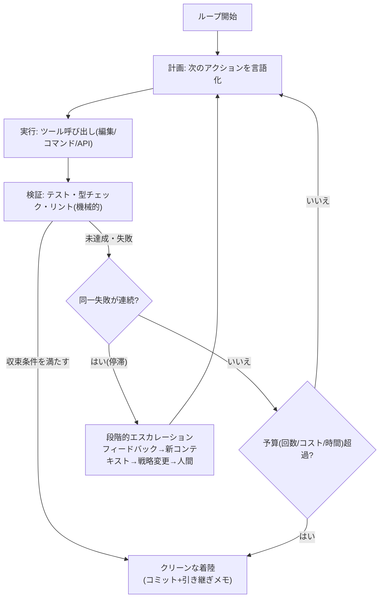
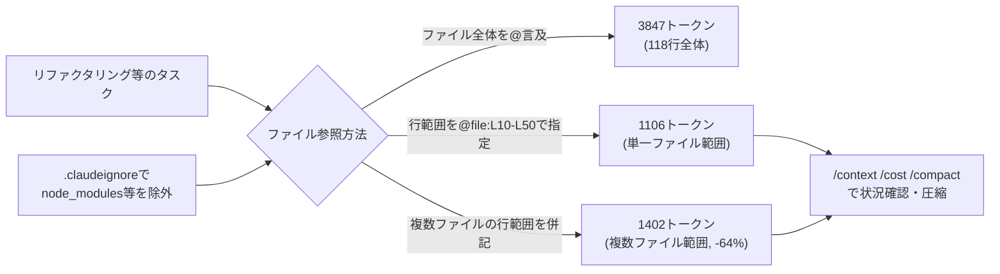
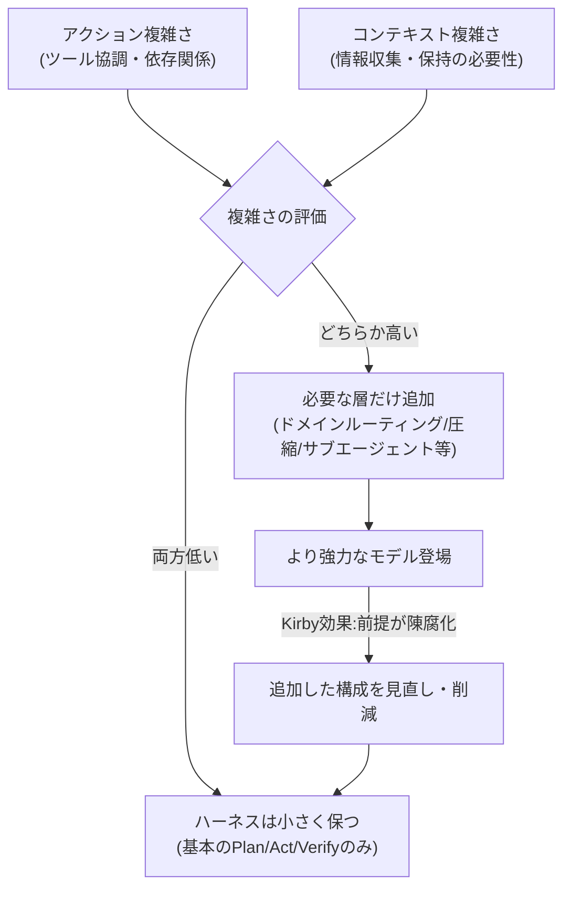

# Daily Briefing 2026-07-28

## 1. ループ工学：収束するエージェントループの設計法（原題: Loop Engineering: How to Design Agent Loops That Actually Converge）

- **URL**: https://www.developersdigest.tech/blog/loop-engineering-designing-agent-loops
- **公開日**: 2026-07-12
- **著者・媒体**: Developers Digest

### 本文翻訳
記事は「プロンプトの最適化をやめて、ループを組み立てよ」という主張から始まる。単発のモデル呼び出しをどれだけ磨いても、フィードバック信号を持たないエージェントはすぐに頭打ちになる。あらゆるエージェントシステムは本質的に「モデルが決定を下す→ツールを実行する→結果をコンテキストに追加する→終了条件をチェックする」という同じ骨格を持っており、この骨格をどう設計するかが成果を決めるというのが著者の立場である。「プロンプトはせいぜい全体の2割で、ループこそが製品そのものだ」と結論づけている。

中心となる設計パターンは以下の通り。①**Plan/Act/Verifyの三段階構造**：各反復は「計画（次に何をするか説明する）」「実行（編集・コマンド・API呼び出しを行う）」「検証（テスト・型チェック・リントなど独立した機械的チェックで結果を確認する）」の3段階を明示的に踏むべきであり、「検証はコードであって、モデルの自己申告ではない」という原則が強調される。②**収束条件の4類型**：「ゴールに到達したか」を曖昧に問うのではなく、テスト定義型（スコープ内の全テストが成功）、差分定義型（今回の反復でコード変更が発生しない＝不動点に達した）、カウント定義型（エラーキューが空になった）、判定定義型（別モデルがルーブリックで採点し閾値を超える、ただしこれは最も弱い方式）という客観的な終了基準を設定する。エージェントに「終わったか？」と直接尋ねることを終了判定に使うのは避けるべきだとされる。③**停滞検知**：連続する反復で同一の失敗フィードバックが繰り返された場合、単純な再試行を続けるのではなく2回で見切りをつけてエスカレーションする。④**段階的エスカレーションの再試行戦略**：まずフィードバックを付けて再試行し、それでも失敗すれば学習内容を要約した新しいコンテキストで再試行し、さらに失敗すれば異なる戦略に切り替え、最終的に人間へエスカレーションする。各段階の試行回数には2〜3回の上限を設ける。⑤**3軸の予算制約**：反復回数の上限・コスト（トークンやドル）の上限・実時間の締切という3つの制約を同時に課し、予算を使い切った場合はクラッシュさせるのではなく、進行中の作業をコミットし引き継ぎメモを残して「着陸」させる。⑥**Loop Until Dryパターン**：定常的な自動処理に向くパターンで、各反復では最も優先度の高い1件を見つけて修正・検証・成功時のみコミットし、キュー全体を一巡しても何も見つからなくなるまで繰り返す。各反復が小さく検証コストが低いため、失敗時の損害も限定的になる。⑦**定期実行ループの自己ペーシング**：固定間隔で起動するのではなく、観測結果に応じて次の起動間隔を調整する。何も見つからなければ指数的に間隔を延ばし、活動があれば通常間隔に戻す。

記事末尾では、ループを本番投入する前のチェックリストとして、明示的なplan/act/verify構造の有無、検証が機械的（コード）であるか、客観的な終了条件と停滞検知の有無、段階的エスカレーション再試行の有無、3軸予算とクリーンな着陸処理の有無、自己ペーシングの有無、の6項目を挙げている。

### 重要ポイント
- ループの本質は「決定→実行→コンテキスト追加→終了判定」の反復であり、プロンプトはその一部にすぎない
- 検証は必ずテスト・型チェック・リント等の機械的手段で行い、モデルの自己申告を終了条件にしない
- 終了条件は「テスト成功」「差分ゼロ（不動点）」「キュー空」「ルーブリック採点」の4類型から選ぶ
- 失敗時は同じ再試行を繰り返さず、フィードバック付き→新コンテキスト→戦略変更→人間エスカレーションと段階的に上げる
- 反復回数・コスト・時間の3軸予算を設け、予算超過時は作業をコミットして引き継ぎメモを残す「クリーンな着陸」を行う

### 図解


### 現場での適用方法

**スキル化の例**（新しい自律ループを実装する前にPlan/Act/Verifyと終了条件・予算をチェックする）:
```markdown
---
name: loop-convergence-check
description: 自律的に繰り返し実行するエージェントループ（自動修正ループ、
  定期バッチ処理、リファクタリング継続タスク等）を実装・レビューする際に使う。
  Plan/Act/Verify構造、客観的な終了条件、予算上限が揃っているかを確認する。
---

新しいループを実装・レビューする際は、以下を全て文章化してから着手する。

1. **Plan/Act/Verify**: 各反復で「計画」「実行」「検証」の3段階が
   明示的に分かれているか。検証はテスト・型チェック・リント等の
   機械的手段で行い、モデル自身の「できました」宣言に頼らないこと。
2. **終了条件**: 「テスト成功」「差分ゼロ」「キュー空」「ルーブリック採点」
   のいずれかで客観的に定義する。「良くなるまで」のような曖昧な条件は禁止。
3. **停滞検知**: 同一の失敗フィードバックが2回連続したら、
   同じ再試行を続けずにエスカレーションする。
4. **段階的エスカレーション**: フィードバック付き再試行→新規コンテキストでの
   再試行→戦略変更→人間へのエスカレーション、の順に各2〜3回で見切る。
5. **予算**: 反復回数上限・コスト上限・時間上限の3軸を設定し、
   超過時は作業をコミットし引き継ぎメモを残して終了する。
6. **自己ペーシング**（定期実行の場合）: 何も見つからない場合は
   起動間隔を指数的に延ばし、活動があれば通常間隔に戻す。
```

### 期待効果
明示的な検証・終了条件・予算上限を備えたループは、無限実行やコスト暴走を防ぎつつ、失敗時も小さな損害で済む。段階的エスカレーションにより、単純な再試行の繰り返しで消耗するのを避け、人間の介入が必要な場面を適切に切り分けられる。

### 注意点
ルーブリック採点（判定定義型の終了条件）は最も弱い方式とされ、可能な限りテスト定義型・差分定義型・カウント定義型を優先すべきである。予算の3軸（回数・コスト・時間）は同時に設定しないと、いずれか1軸だけの制約では暴走を防ぎきれない。

## 2. Claude Codeのコンテキストウィンドウ：行範囲指定でトークンを64%削減する一手法（原題: Claude Code context window: one trick cuts tokens 64%）

- **URL**: https://wotai.co/blog/claude-code-context-window
- **公開日**: 2026-04-28
- **著者・媒体**: Alex Kim（WotAIブログ）

### 本文翻訳
著者はあるリファクタリング作業中、複数ファイルをまるごとコンテキストに読み込む従来のやり方では、3時間を費やした時点でコンテキストウィンドウの残量がわずか12%まで落ち込んでしまった経験を報告する。1Mトークンのコンテキストウィンドウは「全部読み込ませてClaudeに任せればいい」という売り文句で語られがちだが、実際にはそれは誤りであり、大量のコンテキストを積むほどモデルは埋もれた情報を軽視しやすくなる、と著者は指摘する。必要なのは「今回のターンに必要な最小のコンテキスト」であって、ファイルを無差別に丸ごと読み込むことではない。

そこで著者が実践している中核の手法が「行範囲参照」である。Claude Codeの`@file`メンション構文に行範囲を指定できることを利用し、`@src/lib/classifier/index.ts:L10-L50`のように書くことで、ファイル全体ではなく指定した行範囲のみがコンテキストに追加される。複数ファイル・複数範囲を同時に指定することもでき、`@file1.ts:L15-L45 @file2.ts:L22-L40`のように併記できる。

著者は自身のプロジェクト（SoccerSkills.app）での実測値を示している。同じ118行のファイルについて、ファイル全体を読み込んだ場合は3,847トークン、同じファイルの行範囲（L10-L50）のみを指定した場合は1,106トークン、複数ファイルにまたがる行範囲指定では1,402トークンとなった。最後の複数ファイル行範囲指定は、最初の「ファイル全体読み込み」比で64%のトークン削減を達成している。

行範囲指定と合わせて著者が推奨するのが`.claudeignore`ファイルの整備である。これは`.gitignore`と同じ構文で使え、`node_modules/`、`.next/`、`dist/`といったビルド成果物や、`drizzle/`のような自動生成コード、アーカイブ済みドキュメントなどをコンテキストの探索対象から除外する。加えて、コンテキストの充填率を確認する`/context`、消費トークンのコストを追跡する`/cost`、手動でコンテキストを圧縮する`/compact`という3つのコマンドを日常的に併用することを勧めている。

結論として著者は、この行範囲参照というテクニックを使い始めてから、以前は半日仕事だった機能実装を2時間で完了できるようになったと述べている。多くの開発者が`@file`メンションを使う際にファイル全体を指定してしまい、行範囲を絞り込むという選択肢を活用していない点を、見落とされがちな改善余地として指摘して締めくくっている。

### 重要ポイント
- 1Mトークンの大容量コンテキストウィンドウは「全部読み込ませる」ための言い訳にならない。コンテキストが埋まるほどモデルは埋没した情報を軽視しやすい
- `@file:L10-L50`のような行範囲参照構文で、ファイル全体ではなく必要な行のみをコンテキストに追加できる
- 実測値ではファイル全体読み込み(3,847トークン)に対し、複数ファイル行範囲指定(1,402トークン)で64%のトークン削減
- `.claudeignore`でビルド成果物・自動生成コード・アーカイブ文書をあらかじめ除外しておく
- `/context`（充填率確認）・`/cost`（コスト追跡）・`/compact`（手動圧縮）を日常的に併用する

### 図解


### 現場での適用方法

**スクリプト化の例**（`.claudeignore` の実例。ビルド成果物・生成コードを除外して行範囲参照の効果を最大化する）:
```
# .claudeignore
node_modules/
.next/
dist/
build/
drizzle/
*.generated.ts
docs/archive/
```

**運用手順**（既存の「ファイル丸ごと@言及」習慣を行範囲参照に置き換える）:
```
# 1. まずコンテキストの現在の充填率を確認する
/context

# 2. ファイル全体ではなく、変更が必要な行範囲だけを指定する
#    例: 分類ロジックの10〜50行目だけを見せたい場合
@src/lib/classifier/index.ts:L10-L50 このロジックにXの分岐を追加して

# 3. 複数ファイルにまたがる修正でも範囲を絞って併記する
@src/lib/classifier/index.ts:L10-L50 @src/lib/classifier/types.ts:L1-L20 ...

# 4. 作業の節目でコストとコンテキスト残量を確認する
/cost
/context

# 5. コンテキストが逼迫してきたら手動圧縮する
/compact
```

### 期待効果
著者の実例では複数ファイル行範囲指定によりファイル全体読み込み比で64%のトークン削減を達成し、以前半日を要した機能実装を2時間で完了できるようになったと報告されている。コンテキストの逼迫による`/compact`頻発や情報埋没を防ぎ、長時間のセッションを安定的に継続しやすくなる。

### 注意点
行範囲を絞りすぎると、参照範囲外に存在する重要な依存関係やコンテキスト（インポート文、型定義など）をモデルが見落とすリスクがある。ファイル構造を変更する作業（行番号がずれるリファクタリング等）の直後は指定した行範囲がずれる可能性があるため、行番号を都度確認する必要がある。

## 3. エージェントハーネスの過剰設計をやめよ（原題: Stop Overengineering Your Agent Harness）

- **URL**: https://hugobowne.substack.com/p/stop-overengineering-your-agent-harness
- **公開日**: 2026-07-21
- **著者・媒体**: Hugo Bowne-Anderson（Vanishing Gradients）

### 本文翻訳
著者はまず、「エージェントを作るのにどんな技術が必要か」と尋ねると、コンテキスト管理・メモリ・圧縮・サブエージェント・フック・オーケストレーションといった膨大なリストが返ってくるという状況を提示する。しかし「そのすべてを必要とするシステムはほとんどなく、適切なハーネスは仕事の内容次第で決まる」というのが本記事の核心的な主張である。インフラの複雑さを実際の要件に合わせるべきであり、最初から凝った構成をデフォルトにしてはならない。

著者はまずAIエージェントを「ループの中でツールを使うLLM」と定義する。これにより、モデルとツール実行の間を反復する真のエージェントと、推論ループを持たない決定的な処理列にすぎない「AIワークフロー」とを区別する。エージェントハーネスが担う機能は、ループ管理（プロンプト→解析→実行→フィードバック）、ツール実行、コンテキスト管理、状態追跡、安全機構の5つに整理される。プロンプトエンジニアリングが個々のモデル呼び出しの形を決め、コンテキストエンジニアリングがモデルに何を見せるかを決めるのに対し、ハーネスエンジニアリングはシステム全体の統治を担うと位置づけられる。

著者は複雑さを「アクションの複雑さ（ツール協調・意思決定の依存関係）」と「コンテキストの複雑さ（情報収集・保持の必要性）」という2つの独立した軸で捉えるフレームワークを提示する。この2軸モデルにより、1ターンで会話を完結させるサポートエージェントでも高度なルーティングが必要になる場合がある一方、深いリサーチを行うエージェントは多数のターンにまたがる大規模なコンテキスト管理を必要とする、という違いが説明できる。

コーディングエージェントについては、基盤となるパターンは驚くほど軽量で、「コーディングエージェントはPythonわずか131行で構築できる」という。それでも実運用のシステムは、ドメイン固有の指示・ワークフローのパッケージ化・ツールの拡張を通じてハーネスの層を積み重ねていく。Lance Martin氏は、コンテキストに関する3つの基本パターンとして「削減（Reduce：モデルに渡すコンテキストを縮小する）」「オフロード（Offload：複雑さをプロンプトの外へ逃がす）」「隔離（Isolate：トークンを多く消費するタスクをマルチエージェント構成で委譲する）」を挙げている。

深いリサーチを行うエージェントの例として、Ivan Leo氏とのワークショップ事例が紹介される。計画を生成し、反復回数の予算を持つ並行検索サブエージェントを走らせ、最後に結果を統合するという構成であり、フック（エージェントループ内のイベントに他の仕組みが反応できる仕組み）を活用することで、全ての振る舞いをコアロジックに埋め込まずに済ませている。

個人向けエージェントの例としてOpenClawが紹介される。常駐デーモン・チャットインターフェース・ファイルベースのメモリ・定期実行のハートビートやcronジョブを備えるが、注目すべきはそのメモリ手法の実用主義で、「圧縮サマリーはタイムスタンプ付きのMarkdownファイルに追記されるだけで、ベクトルデータベースも埋め込みも使わない」という。

記事後半の核心は「Kirby効果」という概念である。「ハーネスの各構成要素は、モデル単体ではできない何かについての前提を体現している」。モデルが進化するにつれ、その前提は失効していく。具体例として、思考の連鎖（chain-of-thought）プロンプティングは、RLトレーニングによる推論モデルの登場で不要になりつつあること、プランモードはモデルが単純な指示を確実に守れるようになったことで不要になったこと、2025年11月のOpus 4.5とGPT-5.2はエージェント軌跡へのRLVR訓練を通じて「転換点」となったことが挙げられる。この結果、Manusは年に5回設計し直され、Anthropicも能力向上に合わせてClaude Codeのハーネスを継続的に削ぎ落としているという。

William Horton氏によるMaven Assistant（健康ナビゲーションのシステム）の事例は、低コンテキスト・中程度アクションの設計として紹介される。予約・プロバイダ検索・健康情報などへドメインルーティングで委譲し、ツールアクセスは15〜20個程度に抑えて各サブエージェントに配分し、ユーザーIDを注入した安全なAPIインターフェースを用い、オフトピック検出のような決定的なガードレールを備え、自傷リスクの兆候があれば自動的にハンドオフする。診断はせず情報提供にとどめるという明確なスコープ制御も特徴である。注目すべきは「最初の会話のほぼ全てが1ターンで完結していた」点で、これにより従来型の圧縮機構はほとんど不要になっている。

一方でモデルが急速に進化しても長く残る基盤として、ツールと状態を伴う推論ループの構築、プロンプトとスキーマの設計、コンテキストとメモリの管理、構造化出力とトレーシング、ガードラインと人間へのハンドオフ、SDKやMCPとの統合、フックによるスケジュール/イベント駆動の処理、評価インフラが挙げられる。また、Hamel Husain氏の「評価ハーネスもエージェントハーネスの一部だ」という指摘のように、ハーネスの定義自体が実行時の範囲を超え、テストインフラや成果測定まで含む方向に広がりつつあるとも紹介されている。

結論として著者は「アクション複雑さもコンテキスト複雑さも低いなら、ハーネスは小さく保て」と勧告する。実際の失敗が要求するときにだけインフラを追加し、より強いモデルが登場するたびに追加した構成を見直すべきだとし、「昨日必要だった回避策は、今日には無用の長物かもしれない」と締めくくっている。

### 重要ポイント
- 「アクションの複雑さ」と「コンテキストの複雑さ」という2軸で必要なハーネスの規模を判断し、両方低ければハーネスは小さく保つべき
- コーディングエージェントの基盤はPython131行程度で構築可能。複雑化は実運用要件が生んだ層の積み重ねにすぎない
- OpenClawはベクトルDBを使わず、タイムスタンプ付きMarkdownへの追記だけでメモリを実用化している
- 「Kirby効果」＝ハーネスの各構成要素はモデルの弱点への前提を体現しており、モデル進化とともにその前提は陳腐化する
- Maven Assistant事例では会話がほぼ1ターンで完結し、ドメインルーティングとツール数制限だけで圧縮機構すら不要だった

### 図解


### 現場での適用方法

**CLAUDE.md への追記例**（ハーネスの複雑さを定期的に見直すルールを明文化する）:
```markdown
## ハーネス複雑さの原則（Kirby効果への対応）

- 新しい仕組み（サブエージェント・追加ツール・圧縮ロジック等）を追加する前に、
  「アクション複雑さ」「コンテキスト複雑さ」の両方が実際に高いかを確認すること。
  両方低いタスクに大掛かりな構成を持ち込まない。
- 強いモデル（新しいOpus/Fable世代等）に切り替えたタイミングで、
  既存の回避策・強い制約・冗長な指示が今も必要かを棚卸しする。
  「昨日必要だった回避策」は今日には不要かもしれない。
- メモリが必要な場合、まずはタイムスタンプ付きMarkdownへの追記のような
  シンプルな方式を検討し、ベクトルDB等はそれで不足する場合にのみ導入する。
```

### 期待効果
ハーネスをタスクの実際の複雑さに合わせて最小限に保つことで、開発・保守コストを抑えつつ、モデル世代交代のたびに不要な回避策を除去して性能低下や無駄な複雑さの蓄積を防げる。Maven Assistantの事例のように、スコープを絞ったドメインルーティングとツール数制限だけで、圧縮機構すら不要なシンプルな運用が実現できる場合がある。

### 注意点
「Kirby効果」は諸刃の剣であり、モデル更新のたびに既存ハーネスを見直す運用コストが発生する。見直しを怠ると陳腐化した制約が残り続け、逆に見直しすぎると安定して動いていた仕組みを不必要に壊すリスクもある。低複雑さのタスクに最適化された小さなハーネスは、要件が予想外に拡大した際に急な作り直しを迫られる点にも留意が必要。
