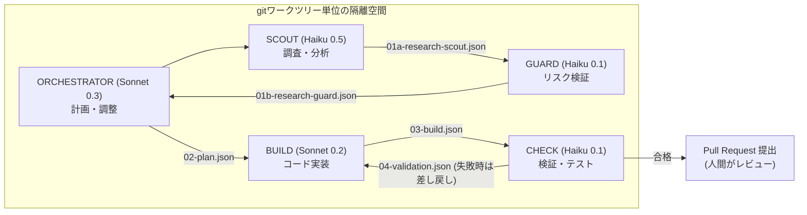
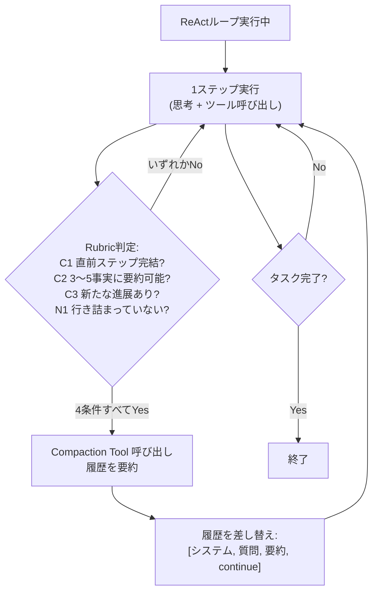
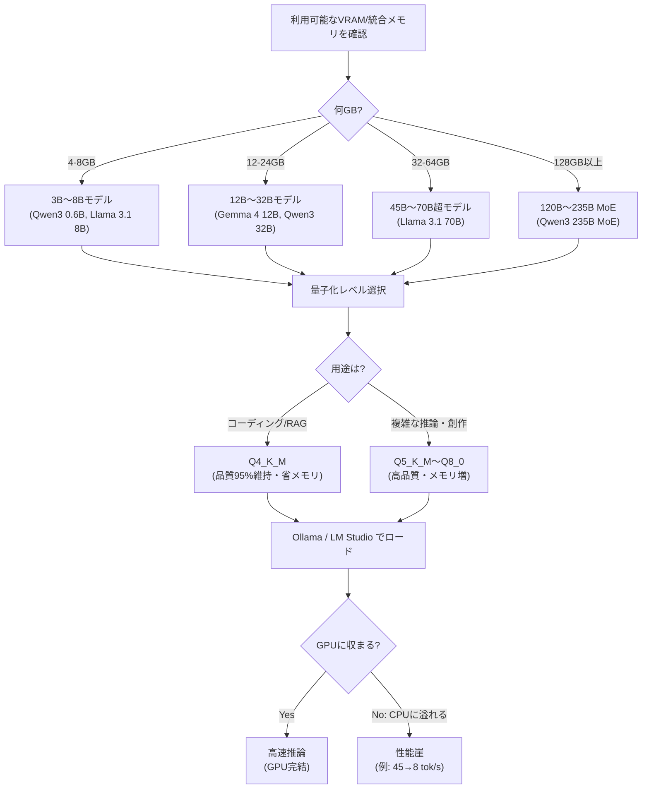

# Daily Briefing 2026-07-29

## 1. サブエージェント編成によるAI駆動開発パイプライン（原題: Orchestrating AI Agents: A Subagent Architecture）

- **URL**: https://clouatre.ca/posts/orchestrating-ai-agents-subagent-architecture/
- **公開日**: 2025-12-24（2026-06-17更新）
- **著者・媒体**: Hugues Clouâtre（個人ブログ、AWS経験者／HECモントリオール特別講師）

### 本文翻訳
単一のAIモデルにコーディングを任せる場合、コンテキストの腐敗（context rot）、役割の混乱、エラーの蓄積によって生産性向上は10%程度にとどまる。しかしプロセス変革と組み合わせたマルチエージェント戦略では25〜30%の改善が得られる。Anthropicの研究によれば「トークン利用の分散の80%を説明する」のはエージェント数ではなく設計であり、著者は役割ごとに専門化した5種のサブエージェントで構成するパイプラインを構築した。

構成は次の通り。ORCHESTRATOR（Sonnet, temperature 0.3）が計画・調整を担い、SCOUT（Haiku, 0.5）が調査・分析、GUARD（Haiku, 0.1）がリスク検証、BUILD（Sonnet, 0.2）がコード実装、CHECK（Haiku, 0.1）が検証・テストを行う。3つのエージェントを安価なHaiku（$1/$5 per MTok）、2つを高性能なSonnet（$3/$15 per MTok）に割り当てることで50〜60%のコスト削減を実現し、モデルカスケード手法を突き詰めれば最大94%の削減も報告されている（Gandhi et al., 2025）。

各エージェント間の連携は、セッションごとに隔離されたgit worktree内の `$WORKTREE/.handoff/` ディレクトリに置くスコープ化されたJSONファイルで行う。SCOUT→GUARDの引き継ぎ（01a-research-scout.json）、GUARD→ORCHESTRATOR（01b-research-guard.json、リスク・安全性スコア・不足テストを記載）、ORCHESTRATOR→BUILD（02-plan.json、ファイル一覧・手順・リスク）、BUILD→CHECK（03-build.json）、CHECKの評価結果（04-validation.json、失敗時は具体的な改善指示付き）と、フェーズごとに明示的な契約が結ばれる。例えばCHECKは「`#[allow(dead_code)]` 注釈が history.rs:145 ほかに残存」のように行番号付きで指摘し、BUILDが修正して再検証するループが回る。GUARDのハンドオフでは安全性ランキング（A:95点、B:70点、C:55点）のような具体的スコアリングも行われる。

このアーキテクチャがワークすると判断される場面は、複数ファイルにまたがるリファクタリング、既存パターンに沿った機能追加、計画と実行の分離が有効な複雑な変更、そして監査証跡が要求される組織だ。逆に単純なワンショットタスクには過剰である。また `AGENTS.md` によってグローバル層（GPG署名、DCO要件など）とプロジェクト層（言語バージョン、リンタ設定など）の知識を階層化して全サブエージェントに自動継承させており、Vercelの評価基準で「100%合格」（skill方式単体では79%）を達成したという。人間の介入は、明確な要件を持つGitHub issueの起票確認と、最終的なPRレビューの2点に限定し、それ以外のフェーズは自動で進行する。著者は自身のOSSプロジェクト（aptu）で1,325件超のPRをこのパイプラインで統合済みとしている。

### 重要ポイント
- 役割特化型の5エージェント（ORCHESTRATOR/SCOUT/GUARD/BUILD/CHECK）にモデルを使い分け、コストと精度のバランスを取る
- git worktreeごとに隔離された `.handoff/` ディレクトリのJSONファイルでフェーズ間の受け渡しを行い、監査可能性・再開可能性・デバッグ性を確保
- CHECKフェーズは行番号付きの具体的な指摘を返し、BUILDとの再検証ループでコンパイルエラーやコード規約違反を事前に潰す
- `AGENTS.md` の階層化（グローバル/プロジェクト）によりルール遵守率がSkillのみの場合より大幅に向上
- 人間の関与は「issue起票の確認」と「最終PRレビュー」の2点に絞ることで、自動化と品質担保を両立

### 図解


### 現場での適用方法

**CLAUDE.md への追記例:**
```markdown
## サブエージェント編成ルール（機能追加・リファクタリング時）

複数ファイルにまたがる変更や複雑なリファクタリングでは、以下の役割分担でサブエージェントを順に起動すること。

1. SCOUT: 対象領域を調査し、影響範囲・既存パターンを `.handoff/01a-scout.json` に出力
2. GUARD: SCOUTの結果を検証し、リスクスコア（A/B/C）と不足テストを `.handoff/01b-guard.json` に出力
3. ORCHESTRATOR（自分）: 上記を踏まえ、ファイル一覧・手順・リスクを `.handoff/02-plan.json` に計画化
4. BUILD: 計画に従い実装し、変更差分を `.handoff/03-build.json` に記録
5. CHECK: lint/testを実行し、失敗時は行番号付きで具体的な修正指示を `.handoff/04-validation.json` に出力。BUILDへ差し戻す

各フェーズのハンドオフファイルは `$WORKTREE/.handoff/` 配下に保存し、セッション終了後も監査目的で残すこと。
```

**スクリプト化の例（git worktree + handoffディレクトリ初期化）:**
```bash
#!/usr/bin/env bash
# init-agent-worktree.sh <branch-name>
set -euo pipefail
BRANCH="$1"
WORKTREE_DIR="<REPO_PATH>/.worktrees/${BRANCH}"

git worktree add "$WORKTREE_DIR" -b "$BRANCH"
mkdir -p "$WORKTREE_DIR/.handoff"
echo "Worktree ready: $WORKTREE_DIR"
echo "Handoff files will be written to $WORKTREE_DIR/.handoff/"
```

### 期待効果
著者の実績値では、単純な単一エージェント運用に比べプロセス変革込みで生産性25〜30%向上、モデル使い分けにより費用は50〜60%削減（カスケード手法を突き詰めれば最大94%）。ルール遵守率はAGENTS.md階層化により「100%合格」（skillのみでは79%）まで改善したと報告されている。

### 注意点
- 効果が出るのは複数ファイル変更や複雑なリファクタリングであり、単純なワンショット修正にはオーバーヘッドが勝る
- JSONハンドオフの契約設計（スキーマ）を最初に固めておかないと、フェーズ間で情報欠落が起きやすい
- git worktreeの管理（作成・削除・並行実行時の衝突）は別途運用ルールが必要
- 本記事は著者個人のOSSプロジェクトでの実績であり、組織のセキュリティ・コンプライアンス要件によっては人間介入ポイントを増やす必要がある

---

## 2. 自己判断型コンテキスト圧縮：エージェントが「いつ要約すべきか」を自ら決めるSelfCompact（原題: Self-Compacting Language Model Agents）

- **URL**: https://arxiv.org/abs/2606.23525
- **公開日**: 2026-06-22（v2: 2026-07-10）
- **著者・媒体**: Tianjian Li, Jingyu Zhang, William Jurayj, Xi Wang, Chuanyang Jin, Mehrdad Farajtabar, Eric Nalisnick, Daniel Khashabi（arXivプレプリント、実装は https://github.com/tianjianl/selfcompact で公開）

### 本文翻訳
長時間稼働するエージェントの実行トレースは、思考連鎖（CoT）とツール呼び出しの積み重ねで構成される。これらは徐々に古くなり、後続の生成を「そこに繋ぎ止める」ように悪影響を与え、最終的にはコンテキストウィンドウそのものを超過する。既存の対処法の主流は、一定のトークン数やターン数といった固定間隔で圧縮（要約）をトリガーする方式だが、これはタスクの実際の進行状況とは無関係にコンテキストをリセットしてしまう。

本論文が提案する SelfCompact は、モデル自身に「いつ・どう圧縮するか」を決めさせるスキャフォールドである。仕組みは2つの推論時要素の組み合わせでできている。1つ目は Compaction Tool で、モデルが自発的に呼び出し、蓄積したコンテキストを要約するためのツール。2つ目は軽量な Rubric（判定基準）で、「発火すべき条件」（サブタスクが解決した、軌跡が収束しつつある）と「抑制すべき条件」（導出の途中である、行き詰まっている）を明示的に指定する。

公開されている実装では、この判定は4条件のAND条件として実装されている。C1 Closed-unit（直前のステップが完結している）、C2 Summarizable（現在の状態が3〜5個程度の引用可能な事実に圧縮できる）、C3 Progress（前回の圧縮以降に新たな進展がある）、N1 Not-stuck（エージェントが行き詰まっていない）の4つすべてを満たしたときのみ圧縮が実行される。圧縮自体は「自己要約」として機能し、モデルが要約を生成した後、履歴は「システムプロンプト、元の質問、要約、continueシグナル」という形に丸ごと差し替えられる。比較対象として、圧縮を一切行わない `none` ポリシー、固定間隔で圧縮する `fixed` ポリシーが用意されている。

6つのベンチマーク（数学問題およびエージェント検索タスク）・7モデルでの評価の結果、SelfCompactは要約なしのベースラインに対して数学タスクで最大18.1ポイント、エージェント検索タスクで5〜9ポイントの性能向上を達成し、かつ1問あたりのコストは30〜70%低いという結果が示された。著者らは、微調整や外部の教師信号なしに、モデル自身がコンテキストの「劣化のタイミング」を判断できるという主張を、この実験結果で裏付けている。

### 重要ポイント
- 固定間隔（トークン数・ターン数）でのコンテキスト圧縮は、タスクの実際の進行と無関係に発生し非効率
- SelfCompactは「Compaction Tool」（要約実行）と「Rubric」（発火・抑制条件）の2要素だけで、追加の学習なしに適応的な圧縮を実現
- 公開実装ではC1（サブタスク完結）・C2（要約可能な粒度）・C3（進展あり）・N1（行き詰まっていない）の4条件をすべて満たした時のみ圧縮を実行
- 数学タスクで最大18.1ポイント、検索タスクで5〜9ポイントの性能向上、かつコストは30〜70%削減
- 圧縮後は履歴を「システム/質問/要約/continue」に丸ごと置き換えるシンプルな設計

### 図解


### 現場での適用方法

**スキル化の例（Claude Code スキル SKILL.md の骨子）:**
```markdown
---
name: context-compaction-judge
description: 長時間タスクの途中でコンテキストが肥大化してきた際に、要約すべきタイミングかどうかを4条件で判定し、必要なら要約を実行する。ReActループ型のエージェント作業や長い調査タスクで使用する。
---

# コンテキスト圧縮の判定基準（Rubric）

以下の4条件をすべて満たす場合のみ、これまでの作業履歴を要約すること。1つでも満たさない場合は圧縮せず作業を継続する。

1. **C1 (Closed-unit)**: 直前に取り組んでいたサブタスクが完了している
2. **C2 (Summarizable)**: 現在までの状態が3〜5個程度の引用可能な事実（決定事項・未解決課題・重要な数値）に圧縮できる
3. **C3 (Progress)**: 前回の要約以降、新しい進展があった
4. **N1 (Not-stuck)**: 現在、問題の途中の導出中や試行錯誤で行き詰まっている状態ではない

## 圧縮の実行方法
条件を満たしたら、以下の形式で要約を作成し、それ以前の詳細なやり取りは破棄してよい。

- 元のタスク・質問
- ここまでの決定事項（3〜5点）
- 未解決の課題
- 次にやるべきこと
```

**運用手順（既存エージェントループへの組み込み）:**
1. エージェントのシステムプロンプトに上記4条件のRubricを追記する
2. 各ステップ終了後、Rubric判定を自問させる指示を挟む（「圧縮すべきか、上記4条件で判定せよ」）
3. 判定がYesの場合のみ要約を生成し、それ以前の会話履歴をシステムプロンプト＋要約＋直近タスクに差し替える
4. 固定間隔（例: 10ターンごと）の強制圧縮は撤廃し、Rubric判定に一本化する

### 期待効果
論文の実験結果では、要約なしのベースラインに対して数学タスクで最大18.1ポイント、エージェント検索タスクで5〜9ポイントの性能向上、かつ1問あたりのコストは固定間隔圧縮に対して30〜70%削減。固定間隔方式と同等以上の精度をより低コストで達成できるとされる。

### 注意点
- 研究実装（vLLMベース、GLM-4.7-Flash等での評価）であり、Claude Codeなど商用エージェント環境にそのまま持ち込むには自前の実装が必要
- Rubric判定自体もLLM呼び出しを伴うため、判定コストと圧縮頻度のバランス設計が必要
- 「行き詰まっている」状態の判定（N1条件）はモデルの自己申告に依存するため、過信は禁物。人間側の監視や上限ターン数などのセーフティネットは別途必要
- 数値はベンチマークタスク（数学・検索）での結果であり、コーディングタスクなど他領域での再現性は論文内では未検証

---

## 3. ローカルLLM実行のためのVRAM完全ガイド：GPU階層別実測比較（原題: Minimum VRAM for Local LLMs in 2026: GPU Tiers Tested）

- **URL**: https://www.kunalganglani.com/blog/local-llms-complete-guide
- **公開日**: 2026-03-01（2026-07-13更新）
- **著者・媒体**: Kunal Ganglani（個人ブログ）

### 本文翻訳
ローカルLLMを動かす上で唯一絶対的な制約はVRAM（またはApple Siliconの統合メモリ）であるというのが本記事の前提だ。著者はまず基本公式を示す。Q4_K_M量子化では、パラメータ10億あたり約0.56GBのメモリを消費し、4Kコンテキスト用には追加で1〜2GBのバッファが必要になる。この式に基づき、VRAM容量ごとに実行可能な最大モデルサイズを対応付けた表を提示している。4GBでは約3B（Qwen3 0.6B、Llama 3.2 1B/3B）、8GBでは7〜8B（Llama 3.1 8B、DeepSeek-R1 8B）、12GBでは12〜14B、16GBでは約20B、24GBでは約32B（Qwen3 32B）、32GBでは約45B、48GBでは約70B（Llama 3.1 70B）、64GB以上では70B超で128K以上のコンテキストにも対応、128GB以上では120〜235BのMoEモデル（Qwen3 235B MoE等）まで扱えるとしている。

量子化レベルの選択については、Q4_K_M（約4.5ビット/パラメータ）が「ベンチマーク品質の95%を保持」しつつメモリを大きく節約できるためデフォルト推奨とされ、コーディング支援やRAG用途ではFP16との差を体感できないと著者は述べる。Q5_K_M（約5.5ビット）はQ4_K_Mよりメモリ使用量が約15%増えるが、複雑な推論タスクで質の向上が明確に現れる。Q8_0（8ビット）はQ4_K_Mの倍のメモリを要するが、創作文や多段階推論で品質向上が顕著であり、16GBカードで7Bモデルを動かす際の有力な選択肢になる。逆にQ3以下は「避けるべき」と明言されており、「よく訓練された8BのQ4は、多くの場合Q3の14Bを上回る」という実測に基づく指摘がある。

ハードウェア面では、NVIDIA RTX 50xxシリーズ（RTX 5090が消費者向けとして初の32GB VRAM）、Apple Silicon（統合メモリが64〜128GBに達すると「最良の選択肢」に格上げされ、MLXエンジンがMac Studio M4 UltraでGemma 4を69トークン/秒以上で処理）、AMD（ROCmセットアップの摩擦は高いが、RX 7900 XTX(24GB)はRTX 4090より安価）を比較。ツールとしてはCLI優先でOpenAI API互換のOllama（GitHub 174,000+スター）、GUIとヘッドレスモード（llmster）を持つLM Studio（MLX v1.8.5でKVキャッシュのチェックポイント機能を追加しエージェント向けに最適化）、研究者向けのMLX直接利用を紹介している。

実装上の落とし穴としては、コンテキストウィンドウの拡張がVRAM消費に非線形に効くこと、複数GPU運用時に15〜30%のレイテンシペナルティが生じること、エージェント的なワークフローではKVキャッシュが爆発的に増えるリスクがあること、そしてローカル実行であってもプロンプトインジェクションの脅威は残ることを挙げている。最も重要な「性能の崖」として、モデルがGPUからCPUに溢れ出す瞬間を挙げ、7Bモデルが45トークン/秒から8トークン/秒に急落する例を示し、VRAMサイジングの重要性を強調している。

### 重要ポイント
- 基本公式は「Q4_K_M量子化でパラメータ10億あたり約0.56GB＋コンテキスト用バッファ1〜2GB」
- Q4_K_Mはベンチマーク品質の95%を保持しデフォルト推奨。Q3以下は明確に非推奨（8B Q4が14B Q3を上回ることが多い）
- 8GB VRAMならLlama 3.1 8B/DeepSeek-R1 8B、24GBならQwen3 32B、48GBならLlama 3.1 70Bが目安
- 最大の性能崖は「GPUからCPUへの溢れ出し」であり、7Bモデルで45→8トークン/秒まで急落しうる
- Ollama（CLI／API互換性重視）、LM Studio（GUI＋KVキャッシュチェックポイント）、MLX直接（研究者向け）と用途別にツールを使い分ける

### 図解


### 現場での適用方法

**運用手順（自分のマシンで動かせる最大モデルを判定する）:**
```bash
# 1. 利用可能なVRAM/統合メモリを確認 (NVIDIA例)
nvidia-smi --query-gpu=memory.total --format=csv

# 2. 基本公式で搭載可能な概算パラメータ数を計算
#    最大パラメータ数(B) ≒ (VRAM_GB - バッファ1〜2GB) / 0.56
#    例: 24GBカードなら (24-2)/0.56 ≒ 39B程度が上限目安 (実運用ではQwen3 32Bが定番)

# 3. Ollamaでモデルを取得・起動（コンテキスト長も明示指定）
OLLAMA_CONTEXT_LENGTH=8192 ollama run qwen3:32b

# 4. 実際の生成速度を確認し、GPUに収まっているか確認
ollama ps   # GPU/CPU分割状況が表示される。100% GPUでなければ性能崖の兆候
```

**CLAUDE.md への追記例（ローカルLLMをコーディング補助に使う場合のルール）:**
```markdown
## ローカルLLM利用ガイドライン

- 機密性の高いコードや社外秘リポジトリの補完・要約には、まずローカルLLM（Ollama経由）の利用を検討する
- 手元のVRAM容量に応じて既定モデルを切り替える（下記は目安、`nvidia-smi`で実容量を確認してから選ぶこと）
  - 8GB VRAM: `llama3.1:8b`
  - 24GB VRAM: `qwen3:32b`
  - 48GB以上: `llama3.1:70b`
- `ollama ps` でGPU使用率が100%未満（CPUに溢れている）場合は、より小さい量子化（Q4_K_M）かモデルサイズに切り替える
- Q3以下の量子化は精度低下が大きいため使用しない
```

### 期待効果
記事の実測値では、Q4_K_M量子化でベンチマーク品質の95%を維持しつつメモリを大幅節約でき、Mac Studio M4 UltraのようなApple Silicon機ではMLXエンジンで69トークン/秒以上を達成。適切なVRAMサイジングにより「GPUからCPUへの溢れ出し」による45→8トークン/秒級の性能崖を回避できる。

### 注意点
- 数値はQ4_K_M・4Kコンテキストを前提とした概算であり、コンテキスト長を伸ばすとVRAM消費は非線形に増加する
- AMD ROCm環境はカーネル同梱ドライバでは動作せず、AMD公式ドライバページからの手動インストールが必要（最も多い構築失敗の原因と著者は指摘）
- 複数GPU運用では15〜30%のレイテンシペナルティが生じるため、単一の大容量GPU/統合メモリの方が有利な場合が多い
- ローカル実行でもプロンプトインジェクションなどのセキュリティ脅威は解消されない点に留意
