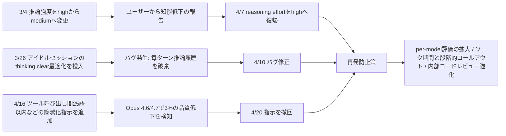
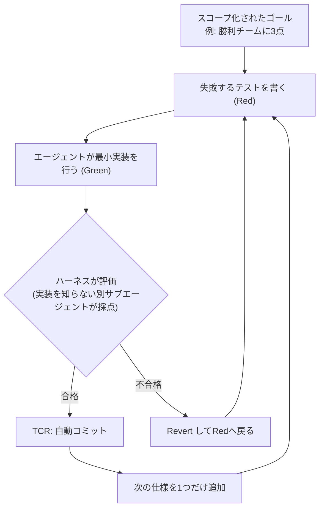
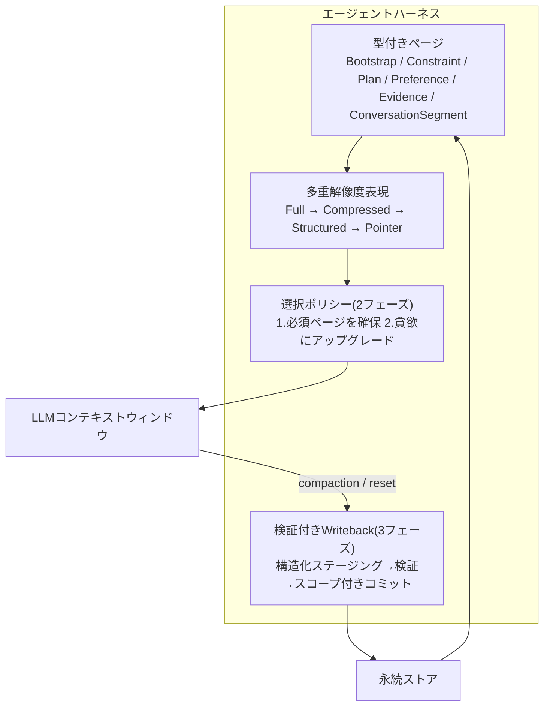

# Daily Briefing 2026-07-30

## 1. Claude Codeの品質低下に関する最新情報（原題: An update on recent Claude Code quality reports）

- **URL**: https://www.anthropic.com/engineering/april-23-postmortem
- **公開日**: 2026-04-23
- **著者・媒体**: Anthropic Engineering

### 本文翻訳
2026年3月から4月にかけて、多くのユーザーが「Claude Codeが以前より賢くなくなった」と報告した。Anthropicは調査の結果、モデルの重みやAPI・推論層には変更がなく、原因はいずれも「ハーネス」層、すなわちシステムプロンプトやセッション管理ロジックにあったと結論づけた。三つの独立した変更が異なるタイミングで異なるトラフィックに影響したため、全体としては広範かつ一貫性のない劣化のように見えていた。

一つ目は3月4日の変更で、レイテンシを下げる目的でデフォルトの推論強度（reasoning effort）を「high」から「medium」へ引き下げた。ユーザーからは「知能が落ちた」という声が相次ぎ、Anthropicは顧客からのフィードバックを受けて4月7日にこの変更を撤回した。

二つ目は3月26日にデプロイされたキャッシュ最適化に起因するバグである。本来は「1時間以上アイドル状態だったセッションについて、古い思考過程（thinking）を一度だけクリアする」という最適化だったが、バグにより以降のセッション全ターンで同じ処理が繰り返し発生してしまった。具体的には、以降の各リクエストでAPIに対して「直近の推論ブロックのみを保持し、それ以前をすべて破棄する」よう指示し続けてしまい、Claudeがまるで物忘れをして同じことを繰り返しているかのように見えた。このバグは4月10日に修正された。

三つ目は4月16日にシステムプロンプトへ追加された簡潔化指示である。「ツール呼び出しの間のテキストは25語以内に抑える」「最終応答はタスクが求めない限り100語以内に抑える」という指示だったが、評価の結果、Opus 4.6・4.7の両モデルで3%の品質低下が確認され、4月20日に撤回された。

Anthropicは、これら三つのうちどれもモデル自体の変更ではなく、多くのチームが「退屈なインフラ」として軽視しがちなハーネス層の変更だった点を強調している。再発防止策として、システムプロンプト変更時のモデルごとの評価範囲拡大、知能に影響しうる変更に対するソーク期間（様子見期間）と段階的ロールアウトの導入、社内コードレビューツールの改善を挙げている。

### 重要ポイント
- 「モデルが劣化した」と感じられる現象の実態が、モデル自体ではなくハーネス（システムプロンプトやセッション管理ロジック）側の変更だったケースが3件重なっていた
- レイテンシ改善のための推論強度引き下げが、体感知能の低下として跳ね返った
- キャッシュ最適化のバグにより「毎ターン推論履歴を破棄する」状態が続き、エージェントが物忘れ・同じ発言の繰り返しをするように見えた
- 「簡潔に」という一見無害な指示追加が3%の定量的な品質低下を招いた
- 対策は評価範囲の拡大、段階的ロールアウト、コードレビュー強化という地味だが具体的な運用改善

### 図解


### 現場での適用方法

**CLAUDE.md への追記例**（ハーネス変更を扱うプロジェクトのルールとして）
```markdown
## ハーネス変更時のルール
- reasoning_effort やシステムプロンプトの「簡潔化」指示を変更する場合、
  変更前に代表的なタスク（自社のベンチマーク10件程度）でbefore/afterを
  必ず比較すること。定性的な「良さそう」だけで本番反映しない
- 冗長性抑制系の指示（例:「ツール呼び出し間は25語以内」）は精度低下を
  招きうるため、A/Bテストなしでの全体適用を禁止する
- セッション圧縮・キャッシュ最適化ロジックを変更した場合、
  「意図した1回だけの処理が毎ターン発生していないか」を
  ログで必ず確認してからマージする
```

**スクリプト化の例**（ハーネス変更のソークテスト用シェルスクリプト）
```bash
#!/usr/bin/env bash
# harness_soak_test.sh
# システムプロンプトやreasoning_effortの変更をリリース前に
# baseline/candidateで比較評価する簡易ソークテスト
set -euo pipefail

TASKS_DIR="<EVAL_TASKS_DIR>"   # 代表的なタスク定義を置いたディレクトリ
BASELINE_CFG="harness/baseline.json"
CANDIDATE_CFG="harness/candidate.json"

mkdir -p results
for task in "$TASKS_DIR"/*.yaml; do
  name=$(basename "$task")
  echo "=== $name: baseline ==="
  claude-code run --config "$BASELINE_CFG" --task "$task" > "results/baseline-$name.log"
  echo "=== $name: candidate ==="
  claude-code run --config "$CANDIDATE_CFG" --task "$task" > "results/candidate-$name.log"
done

python score_results.py results/ --compare baseline candidate
```

### 期待効果
記事内の実データによれば、簡潔化指示の撤回だけでOpus 4.6・4.7の品質が3%改善している。ソークテストと段階的ロールアウトを運用に組み込むことで、同種の「気づかれにくいハーネス劣化」を本番反映前に検出できる可能性がある。

### 注意点
- 3%という数値は同社の内部評価セットに基づくものであり、自社タスクでの再現性は保証されない
- キャッシュ最適化のような「意図は正しいが実装にバグがある」ケースはコードレビューだけでは見抜きにくく、実際のログでの挙動確認が必須
- ソークテストの導入はリリース速度とのトレードオフになるため、影響範囲（レイテンシ調整か知能に関わる変更か）に応じて期間を調整する必要がある

## 2. Loop Engineeringの汚い秘密（原題: The Dirty Secret Behind Loop Engineering）

- **URL**: https://dev.to/mcsee/the-dirty-secret-behind-loop-engineering-1748
- **公開日**: 2026-06-30
- **著者・媒体**: Maxi Contieri（dev.to, @mcsee）

### 本文翻訳
著者は、2026年に流行している「Loop Engineering」という言葉が指す実態は、Kent Beckが2003年に定式化したテスト駆動開発（TDD）そのものだと主張する。変わったのは方法論ではなく、そのサイクルを「誰が回すか」である。かつては人間がRed（失敗するテストを書く）→Green（テストを通す最小実装）→Refactor（整理）のサイクルを手で回していたが、いまはAIエージェントがそのサイクルの実行を担い、開発者は設計上の監督と規律の維持に回っている。

機能するループには4つの要素が不可欠だと著者は述べる。(1) スコープの明確なゴール、(2) ツール・データ・エラー・記憶といったサイクルごとのコンテキスト、(3) ループを継続するか終了するかを決める評価基準（exit条件）、(4) 単純なコマンドから複数エージェントまでを含む実行者（エージェント）である。これらが欠けたループは「ループではなく、無限に暴走するプロセスに過ぎない」と著者は強調する。

具体例として、FIFAワールドカップの順位表シミュレーターを段階的に構築する過程が示される。「勝利したチームには3点を付与する」という1行程度の仕様を最初のテストにし、それが通れば次に「引き分けは1点」「得点差でタイブレークする」という具合に、1サイクルにつき1仕様だけを追加していく。これはRed-Green-Refactorのサイクルそのものである。

Loop EngineeringをTDDと隔てるものではなく、逆にTDDをただの自動化と隔てているものが「ハーネス」である。著者が挙げる要件は次の通り。毎サイクルで自動評価を実行すること、テストが通ったら（Green）ループを止めること、Redの状態のまま先に進めないこと、最小限の実装以上を許さないこと（過剰実装の防止）、実装内容を知らないクリーンなサブエージェントによる独立検証（自分の実装を自分で採点させない）、そしてテストが通った時点で自動コミットするTCR（Test && Commit || Revert）パターンの採用である。

著者は「モデルが弱かった時代は、評価結果の解釈を人間が担う必要があった。いまはテストスイート自体が評価そのものであり、エージェントはそれを直接読める」と述べ、PostHogでの実例（11%のパフォーマンス改善）や既存のZOMBIES原則・TCRパターンにも言及しつつ、「Red🔴-Green🟢-Refactor🔵という語彙は2026年向けに覚えやすくなかったため、業界は呼び方を変えただけだ」と結論づけている。

### 重要ポイント
- 「Loop Engineering」の実体はTDDのRed-Green-Refactorサイクルであり、新しいのは実行主体がエージェントに移った点のみ
- 機能するループには「ゴール・コンテキスト・評価基準・エージェント」の4要素が必須で、どれか欠けると暴走プロセスになる
- 1サイクルにつき1仕様だけを追加する漸進的な進め方が、エージェントの過剰実装を防ぐ鍵
- ハーネスの役割は、自動評価・Green時の停止・Red状態での前進禁止・独立したサブエージェントによる採点・TCRによる自動コミットの5点
- 実装を行った本人（エージェント）に自分の実装を採点させない「クリーンな別コンテキストでの検証」が品質担保の要

### 図解


### 現場での適用方法

**スキル化の例**（Claude Code スキルとして SKILL.md に落とし込む場合）
```markdown
---
name: loop-tdd
description: Use when the user asks the agent to implement a feature or fix a bug through an autonomous red-green-refactor loop rather than one-shot generation. Enforces one-spec-at-a-time increments, independent verification by a clean subagent, and auto-commit on green (TCR).
---

# loop-tdd

## 手順
1. 要件を1行程度の仕様1つに分解する（例:「勝利チームには3点を付与する」）
2. その仕様に対応する、失敗するテストを1つだけ書く（Red）
3. テストを通す最小限の実装を行う（Green）。既存コードの再設計・先回りの
   汎用化は禁止する
4. 実装内容を知らない、クリーンな別コンテキストのサブエージェントに
   テストとdiffだけを渡し、合否のみを判定させる（自己採点は禁止）
5. 合格したら即座にコミットする（TCR: Test && Commit || Revert）
6. 不合格ならRevertし、手順2（Red）へ戻る
7. 次の仕様へ進み、手順1から繰り返す
```

### 期待効果
著者が引用するPostHogの事例では、この種のループ運用によって11%のパフォーマンス改善が得られたとされる。1サイクル1仕様の徹底と独立検証により、エージェントによる過剰実装や自己採点の甘さを構造的に抑止できる。

### 注意点
- ハーネス（自動評価・停止条件・独立検証・TCR）が整っていないままエージェントにループを回させると、暴走的なコミットの繰り返しに陥る
- 「クリーンなサブエージェントによる検証」を省略し実装エージェント自身に合否判定をさせると、品質担保機構として機能しなくなる
- 既存のTDD文化が薄いチームでは、仕様の粒度分解（1サイクル1仕様）自体がボトルネックになりうる

## 3. ClawVM: ステートフルなツール利用LLMエージェントのためのハーネス管理型仮想メモリ（原題: ClawVM: Harness-Managed Virtual Memory for Stateful Tool-Using LLM Agents）

- **URL**: https://arxiv.org/abs/2604.10352
- **公開日**: 2026-04-11
- **著者・媒体**: Mofasshara Rafique, Laurent Bindschaedler（arXiv, EuroMLSys '26 採択）

### 本文翻訳
長時間・多数のツール呼び出し（数百回規模）にわたって動作するステートフルなエージェントは、繰り返し発生する3種類の障害に悩まされる。(1) 残留性（residency）の障害: compaction（文脈圧縮）が指示やツール出力を落としてしまい、同じ作業を繰り返す。(2) 永続性（durability）の障害: resetでflushが飛ばされたり、破壊的な上書きが起きて、積み上げた意思決定が失われる。(3) 可観測性（observability）の障害: 理由コードのない「空の想起」が発生し、原因の診断ができない。既存のハーネス（OpenClawおよびその派生）はprune・retrieval・compaction・compaction前のメモリflushといった機能を持つが、ライフサイクル遷移をまたいで何が生き残るべきかについての強制力のある契約を欠いている。

ClawVMは、エージェントのコンテキストウィンドウを希少な作業メモリ、永続ストアをバッキングストレージとみなし、OSの仮想メモリの考え方をハーネス層に持ち込む。中心となるのは「型付きページ（typed pages）」で、安定した識別子・スコープ・出所（provenance）・最低限維持すべき忠実度（minimum-fidelity invariant）を持つ型付きレコードとして、エージェントに関わる状態を扱う。ページ型はBootstrap/Policy（システム指示）、Constraint（絶対に落としてはいけない指示）、Plan（ゴールと現在のステップ）、Preference（スコープ付き選好）、Evidence（ツール出力）、Conversation Segment（会話区間）の6種類。

各ページはトークン予算の制約下で4段階の「多重解像度表現」に縮退しうる：Full（原文そのまま）、Compressed（LLMLingua-2などによるトークン削減版）、Structured（不変条件を満たす型付きフィールド）、Pointer（解決可能なハンドルと最小限のメタデータ）。これらの表現はページ生成・更新時にあらかじめ計算され、予算逼迫時にその場で作られるわけではない。

選択ポリシーは決定的な2段階アルゴリズムである。フェーズ1で必須の固定ページと最低限必要な表現をまずインストールし（予算が不足すればエラーを返す）、フェーズ2で残りの予算を使い、トークンあたりの限界効用が高い順にpointer→structured→compressed→fullへ貪欲にアップグレードする。書き戻し（writeback）は「構造化ステージング→決定的な検証→スコープ付きコミット」の3段階トランザクションとして行われ、スキーマ・出所・スコープ・非破壊性・ポリシー適合性を満たさない更新は理由コード付きでジャーナルに残り、コミットされない。

評価は4種の合成ワークロード、6段階のトークン予算、実際のClaude Codeセッションから取った12件のトレース、30件の合成タスクで行われた。ClawVMは全予算帯でポリシー起因の障害を完全にゼロにし、offlineオラクル（h=3）と障害数で一致した。retrieval-onlyのベースラインでは100ターン時点で中央値51件、200ターン時点で中央値83件の障害が出るのに対し、ClawVMは200ターンでも障害ゼロを維持した。タスク成功率でも、トークン予算180の条件でComp-Hybridベースラインが76.7%（デバッグタスクでのbootstrap障害が主因）だったのに対し、ClawVMは同じ予算で100%を達成した。要素除去実験では、pointer解決を外すと126件、compaction時のwritebackを外すと20件、auto-pinningを外すと9件の障害が新たに発生し、逆にアップグレードのスコアリング/プリフェッチを外しても障害は増えなかった。オーバーヘッドはターンあたり中央値18〜44マイクロ秒（p95で60マイクロ秒未満）ときわめて小さい。

著者らは実務者の報告から6つの設計要件を定式化している：不変条件はcompactionやresetを経ても生き残ること、捕捉と想起は裁量ではなくポリシーとして扱うこと、永続性はライフサイクル全体で完結していること、書き戻しは検証済みかつ非破壊的であること、想起は理由コードにより可観測であること、eviction（追い出し）はツール呼び出し再実行コストを考慮すること。限界として、スキーマ・出所の検証はモデル生成内容の事実的正しさまでは検証しない点、現行プロトタイプはツール呼び出しを正規シグネチャでシミュレートしている点、ライブ実験は単一セッション内に限られ、セッションをまたぐライフサイクル境界はリプレイ検証にとどまる点が挙げられている。

### 重要ポイント
- ステートフルなLLMエージェントの障害は「残留性・永続性・可観測性」の3種に整理でき、いずれもハーネス層（compaction/reset/writeback）の設計不備に起因する
- 型付きページ＋最低忠実度の不変条件＋多重解像度表現という、OS仮想メモリに着想を得た抽象化を提案
- 決定的な2段階選択ポリシーと3段階の検証付き書き戻しにより、予算内に収まる限りポリシー起因の障害をゼロにできることを実証
- 実際のClaude Codeセッショントレース12件でも障害ゼロを達成し、既存手法（retrieval-only、Comp-Hybrid）を上回った
- オーバーヘッドはターンあたり数十マイクロ秒程度と、実運用に組み込む上での負荷はごく小さい

### 図解


### 現場での適用方法

**運用手順**（Claude Codeのフック機構でClawVMの「不変条件は破壊を生き残る」原則を模した最小構成）

1. 「絶対に落としてはいけない指示」をまとめたファイルを用意する
```bash
mkdir -p .claude
touch .claude/constraints.md   # <REPO_PATH>/.claude/constraints.md に絶対厳守ルールを記述
```

2. compaction直前に、CLAUDE.mdと constraints.md の内容を退避するフックスクリプトを作成する
```bash
#!/usr/bin/env bash
# <REPO_PATH>/scripts/pin_bootstrap.sh
# PreCompactフックとして登録し、compaction直前にBootstrap/Constraintページ
# (CLAUDE.md と constraints.md) の内容を圧縮不可のブロックとして退避する
set -euo pipefail
mkdir -p .claude/pinned
cat CLAUDE.md .claude/constraints.md > .claude/pinned/must-survive.md
echo "Pinned bootstrap+constraint content saved to .claude/pinned/must-survive.md"
```

3. `.claude/settings.json` にフックとして登録する
```json
{
  "hooks": {
    "PreCompact": [
      {
        "hooks": [
          { "type": "command", "command": "<REPO_PATH>/scripts/pin_bootstrap.sh" }
        ]
      }
    ]
  }
}
```

4. CLAUDE.md に、compaction後の復元ルールを追記する
```markdown
## Compaction後のルール
- compactionが発生した場合、必ず `.claude/pinned/must-survive.md` を
  再読み込みし、その内容を最優先の制約として扱うこと
```

### 期待効果
論文の評価では、この種の「必須ページを予算内で確保してから残りをアップグレードする」設計により、予算内に収まる限りポリシー起因の障害（同じツール呼び出しの繰り返し、指示の消失、flushの飛ばし）をゼロにできるとされる。100〜200ターンの長時間セッションでも障害を出さずに維持できた点が実測されている。

### 注意点
- ClawVMそのものは研究プロトタイプであり、上記の適用方法はその設計思想を既存のClaude Codeフックで模した簡易版に過ぎない
- 論文の評価はツール呼び出しを正規シグネチャでシミュレートしたものであり、実ツールでの検証やセッションをまたぐライフサイクル境界の検証は今後の課題とされている
- 「不変条件」に何を含めるか（constraints.mdの中身）の設計判断は依然として人間が行う必要があり、自動では決まらない
