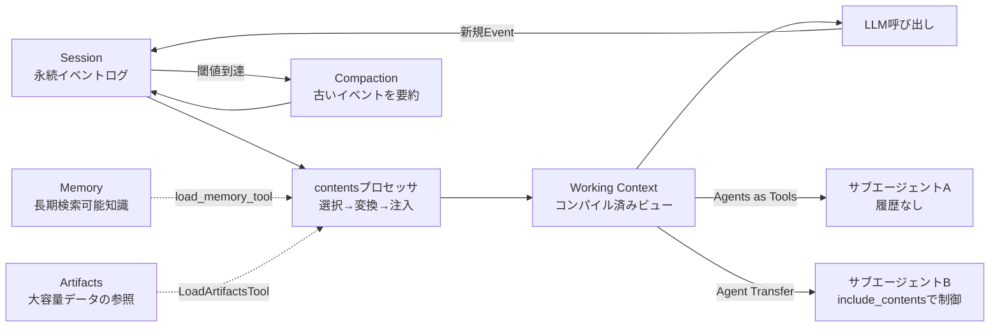
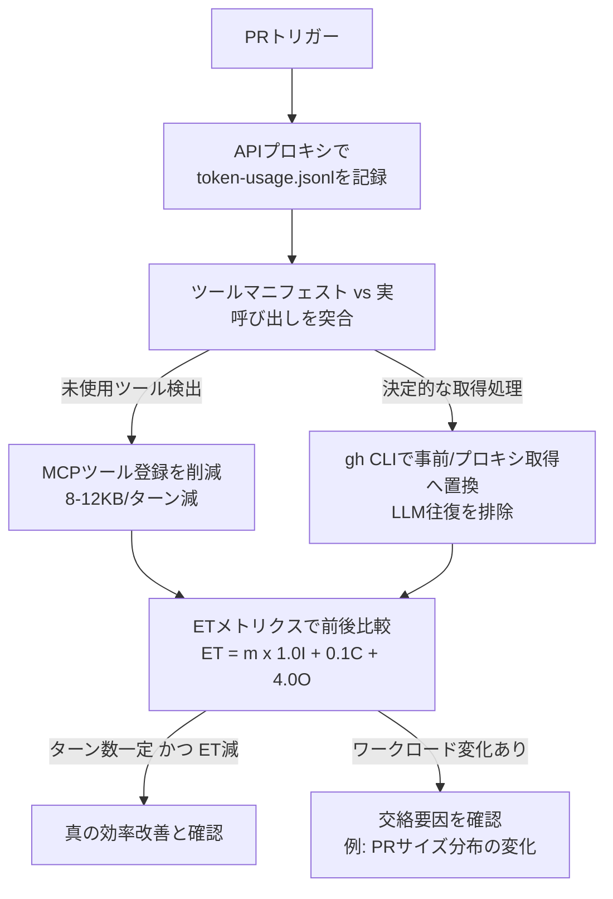
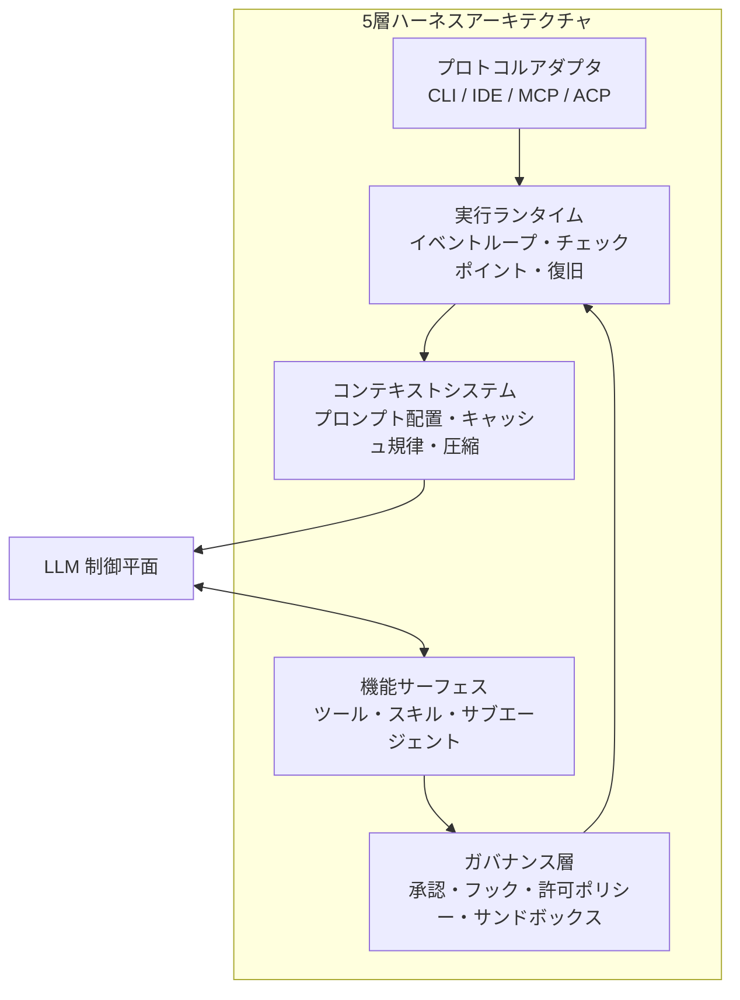

# Daily Briefing 2026-07-31

## 1. 本番運用向けAIエージェントのためのコンテキストエンジニアリング（原題: Architecting efficient context-aware multi-agent framework for production）

- **URL**: https://developers.googleblog.com/architecting-efficient-context-aware-multi-agent-framework-for-production/
- **公開日**: 2025-12-04
- **著者・媒体**: Hangfei Lin（Google Developers Blog / Agent Development Kit チーム）

### 本文翻訳
AIエージェント開発は単発チャットボットを超え、ワークフロー自動化・リサーチ・コードベース保守といった「長時間タスク」へ広がっている。この野心は即座に根本的なボトルネック――コンテキスト――に突き当たる。エージェントが長く動くほど、チャット履歴・ツール出力・外部文書・中間推論など追跡すべき情報は爆発的に増える。主流の対処はより大きなコンテキストウィンドウへの依存だが、「単にテキストを貼り付ける余地を増やすことが唯一のスケーリング戦略にはなり得ない」と筆者は述べる。素朴な「全部詰め込む」方式は3方向から破綻する。コストとレイテンシの急増、無関係なログや古いツール出力による「シグナル劣化」（直近の指示ではなく過去パターンへの固執を招く）、そして実運用のRAG結果や長い会話履歴がどんな固定ウィンドウも最終的にあふれさせる物理的限界である。解決策は「詰め込む量」ではなく「コンテキストをどう表現・管理するか」を変えることにある。

Google ADK（Agent Development Kit）はこれを4本柱で実現する。

第一に「階層化ストレージ」。ワーキングコンテキストは1回の呼び出し用の即時プロンプト（システム指示・履歴・ツール出力・アーティファクト参照）。セッションはやり取りの永続ログで、すべてのメッセージ・ツール呼び出し・結果・エラーを生の文字列でなく構造化Eventとして記録し、ストレージ形式とプロンプト形式を分離してモデル非依存性と分析可能性を確保する。メモリはセッションをまたぐ長期知識、アーティファクトは大容量データを名前とバージョンで参照する外部化領域である。重要な洞察は「セッションが真実であり、ワーキングコンテキストは随時最適化できる計算済みの投影にすぎない」という点だ。

第二に「コンパイル済みビュー」。ADKは「コンテキストは可変な文字列バッファではなく、より豊かなステートフルシステムの上のコンパイル済みビューである」と捉える。セッションとアーティファクトが「ソース」、Flowとプロセッサが「コンパイラパイプライン」、生成されるワーキングコンテキストが「その1回の呼び出し用の成果物」となる。原則は、ストレージと表現の分離、名前付き順序付きプロセッサによる明示的変換（観測・テスト可能にする）、デフォルト最小化（追加情報はツール経由で明示取得）の3つ。contentsプロセッサは「選択→変換→注入」の3段階でこれを実行する。

第三に「パイプライン処理」。Compactionはセッション層で動作し、閾値到達時に非同期でLLMが古いイベントを要約し新イベントとして書き戻す。これによりセッションは物理的に管理可能なサイズを保ち、圧縮戦略はエージェントコードを変更せずに調整できる。Cachingは、コンテキストを「安定したプレフィックス（システム指示・長期要約）」と「可変なサフィックス（最新ターン・新規出力）」に分け、頻用部分を先頭、動的内容を末尾に置くようパイプライン順序を制御し、キャッシュ親和性を設計制約として強制する。

第四に「厳密なスコーピング」。単一エージェントのコンテキスト肥大化はマルチエージェントで劇的に増幅される。ADKは「Agents as Tools」（専門エージェントを関数的に呼び出し、履歴は渡さず結果のみ受け取る）と「Agent Transfer」（制御を完全委譲し`include_contents`でルートからの継承量を制御）の2パターンを提供する。委譲時にはモデルが固定role（system/user/assistant）しか理解できない制約に対応し、過去のアシスタント発言を「[参考: エージェントAが述べたように]」のようにナラティブへ再キャストし、ツール呼び出しにも印や要約を付けて、新エージェントが結果を自分の出力と混同しないようにする。

### 重要ポイント
- コンテキストを「文字列バッファ」ではなく階層化ストレージ＋コンパイル済みビューとして設計する発想
- Working Context / Session / Memory / Artifactsの4層分離により、モデル非依存性と分析可能性を確保
- Compaction（要約による圧縮）とCaching（安定プレフィックス/可変サフィックスの分離）でコストとレイテンシを制御
- マルチエージェントでは「Agents as Tools」と「Agent Transfer」を使い分け、コンテキストの伝播範囲を明示的に制御する
- サブエージェントへの引き継ぎ時は過去のアシスタント発言をナラティブに再キャストし、役割混同を防ぐ

### 図解


### 現場での適用方法

**CLAUDE.md への追記例**
```markdown
## コンテキスト設計ルール（ADK方式を参考に）
- ツール出力が3000トークンを超える場合、本文をそのままコンテキストに
  貼らず `.claude/artifacts/<id>.md` に保存し、要約とパスだけを応答に含める
- サブエージェントへタスクを委譲する際は、親の会話履歴を丸ごと渡さない。
  タスクに必要な情報のみを1つのプロンプトとして再構成して渡すこと
  （「Agents as Tools」パターン: 呼び出し側は結果だけを受け取る）
- システムプロンプト・ツール定義・長期要約は常に会話の先頭に固定し、
  変動する内容（直近のツール出力・最新ユーザー発言）は末尾に置くこと
  （プロンプトキャッシュのヒット率を落とさないため）
```

**スクリプト化の例**（大容量ツール出力をアーティファクト化するラッパー）
```bash
#!/usr/bin/env bash
# <REPO_PATH>/scripts/artifact_wrap.sh
# 3000文字を超えるツール出力を .claude/artifacts/ に退避し、
# コンテキストには要約と参照パスのみを残す
set -euo pipefail
OUT_DIR="<REPO_PATH>/.claude/artifacts"
mkdir -p "$OUT_DIR"

raw_output="$("$@")"
if [ "${#raw_output}" -gt 3000 ]; then
  id="$(date +%s)-$$"
  echo "$raw_output" > "$OUT_DIR/$id.txt"
  head -c 300 <<< "$raw_output"
  echo -e "\n...(省略) 全文は $OUT_DIR/$id.txt を参照"
else
  echo "$raw_output"
fi
```

### 期待効果
ADKの実装では、アーティファクトの外部化により数MB級のペイロードを軽量な参照へ縮小できるとされる。Compactionにより極端に長い会話でもセッションを物理的に管理可能なサイズへ保ち、キャッシュ親和性を意識したプロセッサ順序制御によりキャッシュヒット率とレイテンシの改善が期待できる。

### 注意点
- 記事の仕組み（tiered storage・compiled views等）はADKというフレームワーク固有の実装であり、他のエージェントフレームワークでは同等の機構を自前で構築する必要がある
- Compactionは古いイベントをLLM要約に置き換えるため、要約の粒度次第では細部の情報欠落リスクがある
- 「Agent Transfer」で`include_contents`を誤って広く設定すると、階層化の意図に反してコンテキスト爆発が再発する

## 2. GitHub Agentic Workflowsにおけるトークン効率化（原題: Improving token efficiency in GitHub Agentic Workflows）

- **URL**: https://github.blog/ai-and-ml/github-copilot/improving-token-efficiency-in-github-agentic-workflows/
- **公開日**: 2026-05-07（5月13日更新）
- **著者・媒体**: Landon Cox, Mara Kiefer（GitHub Blog）

### 本文翻訳
プルリクエストのたびに自動実行されるエージェント型ワークフローは、対話的な開発セッションと異なり予測しづらい形でAPI費用を静かに積み上げていく。GitHub Agentic Workflowsチームは2026年4月から自社の本番ワークフローを対象に体系的なトークン使用量の最適化に着手し、その知見を公開した。

まず着手したのはトークン使用状況のロギングである。もともとセキュリティ目的で構築していたAPIプロキシ基盤を活用し、異なるエージェントフレームワーク間でも統一的に扱えるよう正規化したメトリクスを収集した。各ワークフロー実行は`token-usage.jsonl`という成果物を生成し、入力トークン・出力トークン・キャッシュ読み取りトークン・キャッシュ書き込みトークン・モデル種別・プロバイダ・タイムスタンプをAPI呼び出しごとに記録する。この履歴データにより、消費パターンの把握と最適化前後の比較が可能になった。

次に見つかった最も一般的な無駄が「未使用のMCPツール」である。LLM APIはステートレスなため、エージェントのランタイムは毎リクエストごとに完全なMCPツールスキーマを含めて送信する。40個のツールを持つGitHub MCPサーバーは、エージェントが実際には2つしか使わない場合でも、ターンあたり10〜15KBのオーバーヘッドを追加してしまう。ツールマニフェストと実際のツール呼び出しを突き合わせてこのパターンを検出し、未使用登録の削除を推奨した結果、スモークテスト系ワークフローでは呼び出しあたり8〜12KBのコンテキストを削減し、「挙動を変えずに1回の実行あたり数千トークンを節約」できた。

より大きな効果をもたらしたのが「GitHub MCPをGitHub CLIへ置き換える」構造的な最適化である。MCPツール呼び出しは、データ取得そのものを超えてLLMの推論ステップとしてトークンを消費する。エージェントがツール呼び出しを判断し引数を組み立て出力を処理する一連のLLM往復には、スキーマのオーバーヘッドと応答のコンテキストが伴う。決定的な`gh`コマンドを代わりに使えば、LLMの関与自体を排除できる。実装は2通りで、（1）エージェント起動前に`gh`コマンドでセットアップを実行しワークスペースのファイルへ結果を書き出す「事前エージェント的データ取得」、（2）エージェントのCLIトラフィックを軽量なHTTPプロキシ経由でGitHub APIへルーティングし、認証トークンを露出せずランタイム側で必要なデータを取得できる「エージェント内CLIプロキシ置換」である。

異なるモデル階層間で比較可能にするため、チームは「Effective Tokens（ET）」という独自メトリクスを考案した。式は ET = m × (1.0×I + 0.1×C + 4.0×O) で、mはモデルのコスト係数（Haiku=0.25、Sonnet=1.0、Opus=5.0）、Iは新規処理された入力トークン、Cはキャッシュ読み取りトークン、Oは出力トークンである。出力トークンが最もコストが高いことを反映して4倍の重みを、キャッシュ読み取りは割安なため0.1倍の重みを与えている。LLM API呼び出し回数もあわせて追跡し、「1回あたりのターン数が一定でトークン数だけが減っていれば、真の効率改善である」ことを確認した。

十分な前後データが揃った5つのワークフローのうち、Auto-Triage Issuesは109回の実行で62%削減（観測期間で約780万ET節約）、Security Guardはセキュリティに関係しないPRでLLM処理をスキップする関連性ゲートの追加で43%改善（「最も安いLLM呼び出しは、そもそも呼び出さないことだ」）、Smoke Claudeは積極的なMCPツール削減とHaikuへのモデル階層切り替えで59%削減、Daily Compiler Qualityは19%、Daily Community Attributionは37%改善した。一方Contribution Checkは5%増加しており、これは最適化期間中に大きめのPRの比率が9%から65%へ変化した交絡要因によるものだった。教訓は、決定的なデータ収集はLLM推論から切り離せること、未使用ツールのコストは高いこと、そして単一の設定ミスが暴走ループを招くこと（あるワークフローはbashの許可リストが必要なツールアクセスを塞いだために64ターンのフォールバックループに陥り、設定を1行直すことで解決した）である。

### 重要ポイント
- 自動実行されるエージェント型ワークフローはAPI費用が静かに蓄積するため、まず正規化されたトークンロギング基盤を用意することが最適化の前提
- 未使用のMCPツール登録がターンあたり10〜15KBのスキーマオーバーヘッドを生む「見えない税金」になっている
- 決定的に取得できるデータはLLM推論に頼らずCLI（`gh`コマンド等）で事前取得すべき。MCP経由の呼び出しはスキーマ＋推論往復のコストを伴う
- モデル・プロバイダ非依存で比較するため独自の「Effective Tokens」指標（出力4倍・キャッシュ読み取り0.1倍で重み付け）を導入
- ワークフローごとに19〜62%のトークン削減を達成した一方、ワークロード変化という交絡要因で見かけ上悪化するケースもあり、ターン数と併読しないと誤解しやすい

### 図解


### 現場での適用方法

**スクリプト化の例**（未使用MCPツールを検出する簡易チェッカー）
```bash
#!/usr/bin/env bash
# <REPO_PATH>/scripts/find_unused_mcp_tools.sh
# MCPサーバーの tools/list 結果と、実行ログに残る実際のツール呼び出しを
# 突き合わせ、未使用のツール定義を洗い出す
set -euo pipefail
MANIFEST="<MCP_TOOLS_MANIFEST_JSON>"   # 例: mcp tools/list の出力を保存したファイル
CALL_LOG="<AGENT_RUN_LOG_DIR>/*.jsonl" # 例: token-usage.jsonl 等の実行ログ群

jq -r '.tools[].name' "$MANIFEST" | sort -u > /tmp/defined_tools.txt
jq -r '.tool_name // empty' $CALL_LOG | sort -u > /tmp/used_tools.txt

echo "=== 未使用ツール（削除候補） ==="
comm -23 /tmp/defined_tools.txt /tmp/used_tools.txt
```

**ETメトリクス計算スクリプト**
```python
# <REPO_PATH>/scripts/effective_tokens.py
# GitHub Blogの Effective Tokens (ET) 式で複数モデルのワークフローコストを比較する
MODEL_MULTIPLIER = {"haiku": 0.25, "sonnet": 1.0, "opus": 5.0}

def effective_tokens(model: str, input_tokens: int, cache_read_tokens: int, output_tokens: int) -> float:
    m = MODEL_MULTIPLIER[model]
    return m * (1.0 * input_tokens + 0.1 * cache_read_tokens + 4.0 * output_tokens)
```

### 期待効果
記事内の実測では、Auto-Triage Issuesで62%（約780万ET節約）、Smoke Claudeで59%、Security Guardで43%、Daily Community Attributionで37%、Daily Compiler Qualityで19%のトークン削減を達成している。未使用ツールの削除だけでも呼び出しあたり8〜12KBの削減が見込める。

### 注意点
- ETは同チームが自社比較のために設計した相対指標であり、他社・他システムとの絶対比較には使えない
- ワークロード変化（PRサイズ分布の変化など）を無視して前後比較すると、Contribution Checkの例のように誤った結論（改善したのに悪化して見える／その逆）を導く
- bashの許可リスト設定ミスのような単純な誤りが、64ターンの暴走フォールバックループのような大きなコスト増を招きうるため、ツール実行の失敗パスも監視対象に含める必要がある

## 3. 現代的エージェントハーネスの設計指針2026（原題: Modern Agent Harness Blueprint 2026）

- **URL**: https://gist.github.com/amazingvince/52158d00fb8b3ba1b8476bc62bb562e3
- **公開日**: 2026-03-01
- **著者・媒体**: amazingvince（GitHub Gist）

### 本文翻訳
著者は、現代的なハーネスはLLMを「推論のための制御平面」として機能させる一方で、状態管理・実行・ストレージ・承認・トランスポート・可観測性は周辺システムに委ねるべきだと主張する。モデルにプロンプトだけですべてを解決させるのではなく、モデルの意思決定をアーキテクチャ上のガードレールでより信頼できるものにする、という発想である。著者はこれを「理論上ではなく実践上のニューロシンボリック分割」と呼ぶ。中核テーゼは「決定性・記憶・ポリシーをハーネス側へ移せば移すほど、システム全体の信頼性は高まる」というものであり、6つの基本原則――ハーネスはループそのものより重要である、キャッシュの安定性がアーキテクチャ選択を駆動すべきである、ファイルシステムは作業記憶として機能する、行動空間は意図的にコンパクトに保つ、サブエージェントは「高度に見える」ためではなくコンテキスト分離のために使う、ガードレールはプロンプトではなくランタイムに置く――を掲げる。

この分割は、モデルの推論・計画責任を決定的な実行・状態管理・ポリシー適用から切り離すことでシステムをより予測可能にする、という発想に基づく。モデルは最も得意なこと（判断と推論）に専念し、ハーネスは最も苦手なこと（詳細の記憶・制約の強制・長い系列にわたる一貫性の維持）を担う。この役割分担は、モデルが有能な推論者ではあっても、実運用の唯一の制御平面としては不十分であるという認識に立脚している。

著者はハーネスを5層に整理する。「実行ランタイム」はイベントループ・セッション状態・チェックポイント・復旧機構を管理し、一時停止・再開・リプレイを可能にする。「コンテキストシステム」はプロンプト配置・アーティファクト参照・圧縮戦略・キャッシュ規律を制御し、コンテキストを希少で管理された資源として保つ。「機能サーフェス」は組み込みツール・外部連携・スキル・サブエージェントを包含し、意図的に小さく名前空間化しておく。「ガバナンス層」は承認・フック・許可/拒否ポリシー・サンドボックス・来歴追跡を強制し、モデルだけでなく人間と決定的なチェックがリスクの高い行動を制御できるようにする。「サーフェス/プロトコルアダプタ」（CLI・IDE・Web UI・ACP・MCP）はランタイムのコアから切り離され、差し替え可能なままにしておく。

著者は避けるべきアンチパターンを10項目挙げる。エージェントを「単なるプロンプト」として扱う（複数ステップ・複数ツール・複数セッションに及ぶタスクで即座に破綻する）。セッション中にツールセットを動的に書き換える（キャッシュの局所性を壊し状態を混乱させる）。生のツール出力でコンテキストを溢れさせる（早期にアーティファクト化すべき）。単に高度に見えるという理由でマルチエージェントを使う（コンテキスト分離や並列性が明確に有用な場合のみ使う）。危険な行動の自己規制をモデルに委ねる（ポリシー層とサンドボックス層で強制すべき）。冗長で人間向けのツール出力をそのまま返す（構造化された簡潔な出力とアーティファクト参照を返すべき）。エラーをモデルから隠す（機密の秘匿が必要な場合を除き証拠は保持すべき）。すべての指示をシステムプロンプトに詰め込みすぎる（スキルやツール検索・read/searchツールを使うべき）。ハーネス自体の評価を省略する（ツールのテストだけでは不十分で、再開・圧縮・承認・委譲も評価すべき）。MCP・ACP・A2Aというプロトコルを混同する（それぞれ異なる問題を解くので適所で使い分けるべき）。

結論として著者は、2026年における最良のハーネスとは、ツール数・エージェント数・コンテキストウィンドウの大きさで測られるものではなく、「安定したキャッシュ済みプレフィックスを維持し」「状態をアーティファクトとファイルへ外部化し」「小さく扱いやすい行動空間を提示し」「モデルに見せる前にコード実行でデータを圧縮し」「必要な場合のみ隔離されたコンテキストへ作業を委譲し」「安全性を決定的なランタイム層で強制し」「あらゆる重要なステップを再開・リプレイ・検査・監査できる」ものだと述べる。スキルや高度なプロトコル、リモートのエージェント群、UIの洗練、ドメイン特化といった要素はすべて、この基盤の上に積み重なるものだとしている。

### 重要ポイント
- ハーネスはLLMを制御平面としつつ、状態・実行・ポリシーはハーネス側に委ねる「ニューロシンボリック分割」が中核思想
- 実行ランタイム／コンテキストシステム／機能サーフェス／ガバナンス層／プロトコルアダプタの5層構造で責務を分離する
- キャッシュファースト設計（セッション中にツールセットを書き換えない、システムプロンプトを動的に変えない）がアーキテクチャ全体を左右する
- 10項目のアンチパターン（単なるプロンプト扱い・動的ツール書き換え・生出力の垂れ流し・自己規制依存など）は実装前のチェックリストとして使える
- 最良のハーネスはツール数やエージェント数ではなく、安定キャッシュ・外部化状態・小さな行動空間・決定的ガバナンス・完全な監査可能性で測られる

### 図解


### 現場での適用方法

**CLAUDE.md への追記例**
```markdown
## ハーネス設計原則（Modern Agent Harness Blueprint 2026 準拠）
- セッション中にMCPツールの追加・削除を行わない。ツール構成を変える場合は
  新しいセッションを開始すること（プロンプトキャッシュの局所性を壊さないため）
- 3000トークンを超えるツール出力はそのまま応答に含めず、ファイルに保存し
  要約+パスのみを返すこと（生出力でコンテキストを溢れさせない）
- サブエージェントは「高度に見えるから」ではなく、コンテキスト分離または
  並列実行が明確に必要な場合にのみ使用すること
- 破壊的な操作（削除・本番デプロイ・DB変更等）は、モデルの自己判断に
  頼らずフック/許可ポリシーで機械的にブロックすること
```

**フックスクリプト例**（セッション中のツール構成変更を検知してブロック）
```bash
#!/usr/bin/env bash
# <REPO_PATH>/scripts/check_stable_toolset.sh
# SessionStart時のツール構成を記録し、セッション途中の変更を検知したら警告する
set -euo pipefail
SNAPSHOT="<REPO_PATH>/.claude/toolset_snapshot.json"
CURRENT="$(claude mcp list --format json)"

if [ -f "$SNAPSHOT" ]; then
  if ! diff -q <(echo "$CURRENT") "$SNAPSHOT" > /dev/null; then
    echo "警告: セッション中にツール構成が変更されました。キャッシュ局所性が失われます" >&2
    exit 1
  fi
else
  echo "$CURRENT" > "$SNAPSHOT"
fi
```

### 期待効果
著者の主張に沿えば、キャッシュ安定性・状態の外部化・小さな行動空間・決定的なガバナンスを備えたハーネスは、プロンプトキャッシュのヒット率低下によるコスト増、コンテキスト溢れによる誤動作、マルチエージェント委譲時のコンテキスト爆発、ガードレールの欠如による事故といった典型的な失敗を構造的に防ぎやすくなる。

### 注意点
- 本記事は個人がまとめたGitHub Gistであり、査読済みの論文や公式ドキュメントではない点に留意する
- 記事内のPhase 0〜4のロードマップは新規構築を前提としており、既存ハーネスへ後付けで適用する場合はリファクタリングコストを見込む必要がある
- ガバナンス層で何を許可・拒否するか（リスク階層化のしきい値）は依然としてチームが個別に判断する必要があり、ブループリント自体は具体的なポリシー値を与えない
