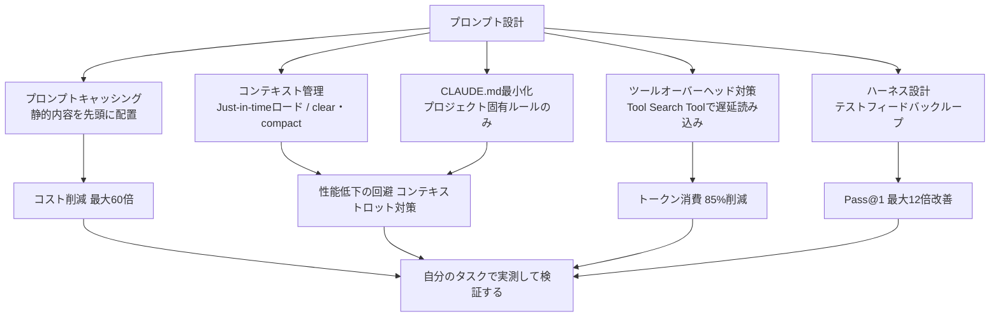
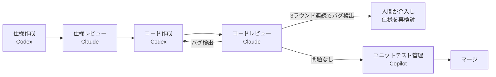
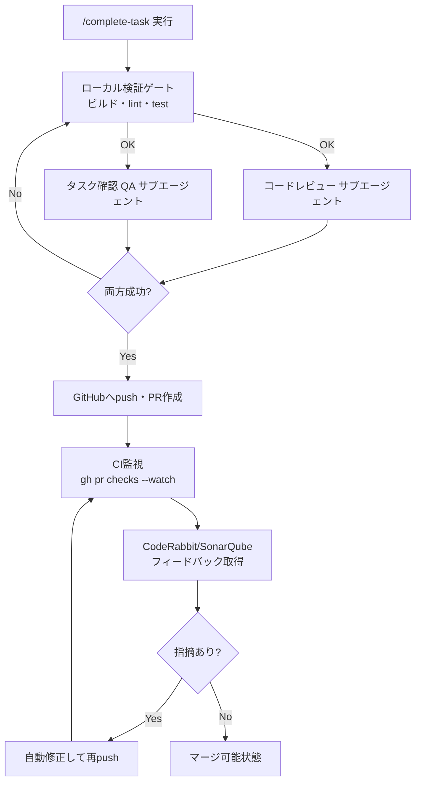

# Daily Briefing 2026-08-01

## 1. コーディングエージェント向けプロンプトエンジニアリングの実際の科学（原題: The actual science of prompt engineering for coding agents）

- **URL**: https://bence-a-toth.medium.com/the-actual-science-of-prompt-engineering-for-coding-agents-d5f5c040263b
- **公開日**: 2026-07-08
- **著者・媒体**: Bence A. Tóth（Medium）

### 本文翻訳
ネット上で広まる「プロンプトエンジニアリングの助言」の多くは、実際にモデルを開発している研究者たちが公開している知見と逆向きである。モデルは誤った指示に従っても害を明示しないため、フィードバックループがほぼ存在しない。Anthropicは2026年4月に「ツール呼び出し間のテキストは25語以下」という簡潔性ルールを追加したが、内部評価では問題を検出できず、後の詳細なアブレーション分析で初めてOpus 4.6/4.7の両方でコーディング評価が3%低下していたことが判明し、即座に撤回した。

最大のコスト削減要因はテキスト圧縮ではなくプロンプトキャッシングである。静的コンテンツを先頭に、動的コンテンツを末尾に配置する設計が原則で、独立研究（Lumer et al., 2025）は500以上のエージェントセッションでClaude Sonnet 4.5が78〜79%のコスト削減を達成したと報告。ProjectDiscoveryはキャッシュヒット率を3.2%から91.8%に改善し約60倍のコスト差を得た。タイムスタンプやUUIDを接頭辞に含めることが最大の反パターンとされる。

Chroma Researchの「Context Rot」研究は18のフロンティアモデル全てが、長い入力（113kトークン）よりも焦点を絞ったプロンプト（300トークン）で明確に高い性能を示すことを実証した。Anthropicは「望む結果の可能性を最大化する、最小限の高信号トークン集合を見つけよ」と推奨し、just-in-timeロード（軽量な識別子のみ保持しツール経由でオンデマンド取得）や`/clear`・`/compact`の活用を勧める。

MCPサーバーのツール定義もコンテキストを圧迫する。5サーバー×30ツールで150ツールとなると3〜6万トークンのオーバーヘッドが発生し、ある監査では200Kウィンドウの51%をMCPツール定義が占めていた。Anthropicが公開した「Tool Search Tool」（`defer_loading: true`）はツール定義トークンを85%削減し、ツール選択精度もOpus 4で49%→74%に改善した。MCPサーバーを追加する前に「CLIツールやシェルスクリプトで同じことができないか」を検討すべきとされる。

CLAUDE.mdは毎セッション課金され実タスクとの注意の奪い合いになるため最小限にすべきで、340行・8000トークンのCLAUDE.mdはプロンプト前にコンテキストの20%以上を占有し応答品質を下げていた。含めるべきはプロジェクト固有コマンドや検証プロトコルであり、性格ルールや普遍的な指示（「クリーンコードを書け」等）は不要。モノレポではディレクトリ単位のCLAUDE.md分割が有効。

ハルシネーション対策としては、モデルの自己検証よりも実行ベースの検証（テスト・lint・型チェック）が信頼性が高く、「誤った検証器は検証器なしより有害」とされる。スキルは段階的開示（メタデータ約100トークンのみ常時ロード、本体は活性化時のみ）でコンテキスト肥大化を防ぐ業界標準パターンとなっている。

ハーネスアーキテクチャの重要性はモデル選択とほぼ同等であることが研究（Patel et al., Claw-SWE-Bench 2026）で示された。350件のGitHub issue解決タスクで、モデル選択のPass@1への影響が29.4ポイント、ハーネス選択の影響が27.4ポイントとほぼ拮抗し、同一モデルでもアダプタ設計だけで54ポイントのスイングが生じた。テストフィードバックループの有無は最大12倍の性能差を生む。長時間実行エージェントには大きなコンテキストウィンドウより、進捗ログ・JSONチェックリスト・初期化スクリプトによる「退屈だが検証可能な状態管理」の方が有効という。

結論として著者は「エージェントの動作を変更するなら、信頼する前に自分のタスクで測定せよ」と強調する。

### 重要ポイント
- プロンプトキャッシングが最大のコスト削減要因（78〜91%超）。静的内容を先頭、動的内容を末尾に配置し、キャッシュ接頭辞をセッション間で安定させることが鍵
- コンテキストは長ければ良いわけではなく、無関係な情報が「コンテキストロット」を招き性能を下げる。最小限の高信号トークンを保つ設計が重要
- MCPツール定義がコンテキストを大量消費する（数万トークン規模）。Tool Search Toolの遅延読み込みで85%削減可能、CLIツールで代替できないか常に検討すべき
- CLAUDE.mdは肥大化させず、プロジェクト固有の実務的ルールのみに絞るべき。攻撃的な簡潔性指示はむしろコーディング品質を下げるリスクがある
- ハーネス（テストフィードバックループ、検証設計）の巧拙はモデル選択と同等以上に成果を左右する。効果測定なしに巷の「テクニック」を信用しない

### 図解


### 現場での適用方法

**CLAUDE.md への追記例**
```markdown
## コンテキスト運用ルール（context-engineering.md より）

- CLAUDE.md はプロジェクト固有のコマンド・検証プロトコル・危険な操作の
  トリップワイヤーのみを記載する。汎用的な「クリーンコードを書け」等は書かない
- 複数セクション/複数の例を書く場合は XML タグで構造化する
- セッション途中でツールの追加・削除を行わない（キャッシュ接頭辞が破壊される）
- 「〜禁止」のような攻撃的な簡潔性指示は追加しない。効果を測定してから導入する
```

**スクリプト化の例（CLAUDE.md変更の効果を自分のタスクで測定するシェルスクリプト）**
```bash
#!/usr/bin/env bash
# usage: ./bench-claude-md.sh <task-file> <variant-A.md> <variant-B.md>
set -euo pipefail
TASK_FILE="$1"; VARIANT_A="$2"; VARIANT_B="$3"
REPO="<REPO_PATH>"

run_variant () {
  local variant="$1" label="$2"
  cp "$variant" "$REPO/CLAUDE.md"
  local start=$(date +%s)
  claude -p "$(cat "$TASK_FILE")" --output-format json > "result-${label}.json"
  local end=$(date +%s)
  echo "${label}: $((end-start))s, tokens=$(jq '.usage.total_tokens' "result-${label}.json")"
}

run_variant "$VARIANT_A" "A"
run_variant "$VARIANT_B" "B"
echo "各バリアントの結果を result-A.json / result-B.json で比較し、コスト・所要時間・テスト結果を確認する"
```

### 期待効果
プロンプトキャッシング最適化だけでキャッシュヒット率次第で最大60倍のコスト差、Tool Search Toolでツール定義トークンを85%削減、テストフィードバックループの整備でタスク成功率が最大12倍向上——といった報告が引用されている。ただし著者自身が強調する通り、これらは文脈依存の数値であり、自分のワークロードで再測定して初めて意味を持つ。

### 注意点
記事で紹介される「◯◯%削減」系の主張の多くは単発ショットの簡単なタスクで測定されたものであり、数十ターンにわたる多ターンのコーディングセッションでは前提が崩れる場合がある（CLAUDE.mdの入力トークンコストが出力削減分を上回るケースなど）。効果を鵜呑みにせず、必ず自分のタスク・モデルバージョンで検証すること。

---

## 2. AIでものを作ることについての雑感（2026年7月版）（原題: Miscellaneous Thoughts About Building Stuff with AI）

- **URL**: https://www.brentozar.com/archive/2026/07/miscellaneous-thoughts-about-building-stuff-with-ai/
- **公開日**: 2026-07-30
- **著者・媒体**: Brent Ozar（Brent Ozar Unlimited ブログ）

### 本文翻訳
著者は自身を専門家ではないとしながら、サイトのダークモード対応、新規コンテンツシリーズの制作、OSSツールの機能追加、WordPressから静的サイトへの移行、ポッドキャストの自動化、新規ゲーム開発など複数のAI駆動プロジェクトから得た実践知を共有する。

最も重要な助言として挙げるのが「敵対的開発（Adversarial Development）」である。仕様作成・仕様レビュー・コード作成・コードレビュー・テストという各工程を、同一のLLMではなく異なるベンダーのLLMに担当させる。2026年7月時点の著者の構成例は、Codexが仕様作成、Claudeが仕様レビュー、Codexがコード作成、Claudeがコードレビュー、Copilotがユニットテスト管理というものだ。コスト最適化として、高機能・高コストなモデル（ChatGPT 5.6 Sol High、Fable 5 Highなど）は初期設計に集中投入し、実装作業自体は安価で高速なモデル（Claude Sonnet、ChatGPT 5.6 Sol Lightなど）にGitHub Issue単位の細かいタスクとして渡す。重要なのは撤退基準で、「コードレビュアーが3ラウンド連続でバグを発見した場合はそこで人間が介入する」というルールを設けている。3ラウンド続くバグは大抵、初期仕様の不備・スコープの過大・モデルの能力不足に起因するため、レビュアーが実装コードを直そうとするより仕様書に立ち返るべきだという。

次に挙げるのが「トラブルシューティングダッシュボードの自動構築」である。アプリケーションが本番稼働してしばらく経った段階で、LLMに「本番の障害対応・根本原因分析・修正・検証はすべてお前の責任だ。問題を起こしうる全コンポーネントの状態を一目で確認できるウェブページを用意しろ」と指示する。監視すべきメトリクスの洗い出し→低コストモデルによる計装実装→ステータスページ構築、という3段階で進める。さらに高度な活用として、ダッシュボードにアラートが表示されると自動的にGitHub Issueが（決定論的な命名で重複を避けつつ）生成され、エージェントに割り当てられる仕組みを構築している。

3つ目は「明確なフィニッシュラインの定義」。各セッション冒頭で「今回のフィニッシュラインは◯◯だ。何が必要かインタビューしてから、あとは独力で進めろ」と伝えることで、エージェントが漂流せず、進捗確認も「フィニッシュラインは越えたか」の一言で済むようになる。さらに機能パリティ達成やAI予算枯渇まで反復させる「ループ」の概念も紹介される。

4つ目は「フックによる自動化された強制ルール」。各セッション後にLLM自身へ成功点・改善点を自己評価させ、AIプラットフォーム用のフックをLLMに書かせた上で、別ベンダーのLLMに敵対的レビューさせる。ユーザーに手作業（テスト実行やコピペ）を依頼してきた場合は「自分でできるようにしてくれ」と押し返し、長時間の無中断作業を実現する。「overnight」タグ付きのIssueリストを用意し深夜起動させる運用例もある。

5つ目は「アプリごとの声と個性の定義」。voice.mdファイルにチャット・ドキュメント・エラーメッセージのトーンを定義することで、AIが「読みたい文体」で一貫して書けるようにする。声を定義しないと出力が乾いた無機質な文章になりがちだという。最後に、予算やクォーターが余った際にコードベース全体を全LLMにレビューさせ、敵対的にダブルチェックする運用も紹介されている。

### 重要ポイント
- 「敵対的開発」＝仕様・レビュー・実装・テストの各工程を異なるベンダーのLLMに担当させ、バグを早期発見する
- 撤退基準（3ラウンド連続バグ）を明確化し、実装の手直しではなく仕様に立ち返るタイミングを判断する
- トラブルシューティングダッシュボードをLLM自身に構築・監視・自己修復させる仕組みが本番運用の負荷を下げる
- タスクごとに明確な「フィニッシュライン」を定義することで、エージェントの漂流と進捗確認コストを削減できる
- voice.md でアプリごとの文体・トーンを定義すると、AI生成コンテンツの品質と親しみやすさが向上する

### 図解


### 現場での適用方法

**CLAUDE.md への追記例**
```markdown
## 敵対的開発ルール

- このリポジトリでは、仕様作成・仕様レビュー・実装・コードレビュー・テストの
  各工程を別々のAIベンダーに担当させる運用とする
- 実装フェーズで作成したコードは、必ず別ベンダーモデルによるレビューを経てからPRを作成する
- コードレビューで3ラウンド連続して新規バグが検出された場合、実装をやり直すのではなく
  人間にエスカレーションし、元の仕様（docs/specs/ 配下）を再検討する
- タスク開始時は「このセッションのフィニッシュラインは何か」を最初に明文化し、
  それを満たすまで確認質問を行ってから自律作業に入る
```

**運用手順（voice.md によるトーン統一の導入）**
```bash
# 1. プロジェクトルートに voice.md を作成
cat > <REPO_PATH>/voice.md << 'EOF'
# このプロダクトの声

- ユーザー向けメッセージは丁寧だが堅苦しくない、対等な同僚のようなトーン
- エラーメッセージは原因と次の一手を必ず添える。責任転嫁の表現は使わない
- 「チーム」「ご不便をおかけしました」等の企業的な受け身表現は避ける
EOF

# 2. コミットメッセージ・PRテンプレート・システムプロンプトから voice.md を参照するよう明記
echo "docs/architecture/overview.md に voice.md への参照を追加" 
```

### 期待効果
記事内に厳密な定量評価は無いが、著者は「3ラウンド連続バグ」ルールにより無駄な手直しループを断ち切れると述べ、フィニッシュラインの明確化により長時間無中断でのエージェント稼働（深夜バッチ運用含む）を実現している。ダッシュボード自動構築は障害対応の初動時間短縮に寄与するとされる。

### 注意点
敵対的開発には複数ベンダーのLLM契約・APIアクセスが前提となりコストが増える。撤退基準（3ラウンド）は著者の経験則であり、プロジェクトの複雑度によって調整が必要。ダッシュボード自動生成Issueは重複防止のため命名を決定論的にする配慮が要る点、LLMの自己評価（「完了した」という自己申告）は過信できない点も本文中で触れられている。

---

## 3. コーディングエージェント開発ワークフロー（原題: Coding Agent Development Workflows）

- **URL**: https://medium.com/nick-tune-tech-strategy-blog/coding-agent-development-workflows-af52e6f912aa
- **公開日**: 2026-01-07
- **著者・媒体**: Nick Tune（Medium「Nick Tune's weird ideas」）

### 本文翻訳
著者は個人プロジェクトで「100%AI生成コードで最高品質を目指す」実験を行い、そこで得たワークフロー設計の学びを共有している。目標は、チケット割り当てからマージ可能なPR完成まで、エージェントが自律的にライフサイクル全体を遂行できるようにすることだ。

設計原則として「決定論的な動作にはシェルスクリプト、解釈が必要な複雑な処理にはAIサブエージェント」という使い分けを採用している。フィーチャーブランチ作成やタスク状態更新、GitHubからのPRフィードバック取得はスクリプト化し、`/complete-task`のような複雑な調整業務はサブエージェントに任せる。サブエージェントを使う理由は、メインエージェントのコンテキストウィンドウ飽和を避けることと、専用エージェントの方が単一の明確なフォーカスで指示遵守精度が上がるためだ。

`/complete-task`ワークフローは、ローカル検証ゲート（ビルド・リント・テスト）を通過後、コードレビューサブエージェントとタスク確認（QA）サブエージェントを並列実行し、両者が成功して初めてGitHubへプッシュしPRを作成する。PR作成後はCI/CDチェック（CodeRabbit・SonarQube含む）を`gh pr checks --watch --fail-fast -i 30`のようなコマンドで監視し、GraphQL API（`gh api graphql`）でレビュースレッドの解決状況を取得、フィードバックを自動的に修正する。エージェントにはローカルチェック・CI・CodeRabbitの指摘を自律的に修正する権限が与えられ、マージ可能またはブロック状態になるまで作業を継続する。

複数のAIエージェントとツールが関与するワークフローでは規約の不整合が無駄を生むため、著者は`docs/conventions/`配下に規約ドキュメントを集約し、全てのエージェント・ツールがこれを参照する「単一情報源」設計を採る。CodeRabbitの設定では`knowledge_base.code_guidelines.filePatterns`にこれらのMarkdownファイルとADR（Architecture Decision Record）を明示的に指定し、レビューボットがADR不準拠を検出した際にADRへのリンクを付与できるようにしている。

根本のマインドセットは「手作業の介入が発生したなら、なぜ次回は自動で防止できないのか」という問いである。CodeRabbitやSonarQubeが指摘した問題は、ESLint等のローカルリントルールに落とし込めないか検討し、ルールが存在しなければ設計ドキュメントに追記する、という改善ループを回す。

組織・チームでの導入における課題として、著者は3点を挙げる。第一に「標準の明確化」——AI支援ワークフローは明示的な規約がある状況で最良に機能するため、暗黙知の多い組織ではまず標準化が必須になる。第二に「継続的改善マインドセット」——ソフトウェアエンジニアリングは「コードを書く」から「AIが自動でコードを生成できる環境（ワークフローとコンテキスト）を整備する」仕事へと重心が移る。第三に「組織レベルとチームレベルの規約のバランス」——著者は「各チームはAIエージェントとレビューツールがアクセスできる、ドキュメント化されたコーディング標準とADRを持つべき」という原則を設定し、その範囲内でチームごとの独自標準を許容する、原則駆動型のアプローチを推奨する。

実装前の企画フェーズでは、単なる記録係ではなく探索的な質問を投げかける「PRD専門家エージェント」を使い、ドラフト→企画→承認というライフサイクルを構造化する。`/create-tasks`コマンドは、成果物・コンテキスト・PRD要件へのトレーサビリティ・受け入れ基準・エッジケース・実装ガイドライン・テスト戦略・検証コマンドなど10セクションの記載を強制し、いずれかが曖昧なタスクは却下される。著者は最後に、これらは「ベストプラクティス」ではなく個人的な試行錯誤の学びであり、数ヶ月で陳腐化しうると率直に述べている。

### 重要ポイント
- 決定論的な処理はシェルスクリプト、解釈を要する調整業務はサブエージェントという明確な使い分け原則
- `/complete-task`のような多段階パイプライン（ビルド・レビュー・QA並列実行→PR作成→CI監視→自動修正）で人手を介さずマージ可能状態まで到達させる
- `docs/conventions/`への規約集約とCodeRabbitなどレビューツールへの参照設定で、複数ツール間の判断基準を統一する
- 「手作業の介入＝自動化すべきシグナル」という継続的改善ループを回す
- PRDと`/create-tasks`の10セクション構造で、実装エージェントに渡す情報の曖昧さを排除する

### 図解


### 現場での適用方法

**スクリプト化の例（PR全チェック待機 + レビュー未解決確認）**
```bash
#!/usr/bin/env bash
# usage: ./wait-for-pr-ready.sh <PR_NUMBER>
set -euo pipefail
PR_NUMBER="$1"
REPO_OWNER="<REPO_OWNER>"
REPO_NAME="<REPO_NAME>"

gh pr checks "$PR_NUMBER" --watch --fail-fast -i 30

UNRESOLVED=$(gh api graphql -f query='
  query($pr: Int!, $owner: String!, $name: String!) {
    repository(owner: $owner, name: $name) {
      pullRequest(number: $pr) {
        reviewDecision
        reviewThreads(first: 100) {
          nodes { isResolved }
        }
      }
    }
  }' -F pr="$PR_NUMBER" -F owner="$REPO_OWNER" -F name="$REPO_NAME" \
  --jq '.data.repository.pullRequest.reviewThreads.nodes | map(select(.isResolved==false)) | length')

if [ "$UNRESOLVED" -gt 0 ]; then
  echo "未解決レビューコメントが ${UNRESOLVED} 件あります。修正が必要です。"
  exit 1
fi
echo "PR #${PR_NUMBER} はマージ可能状態です。"
```

**運用手順（規約の単一情報源をCodeRabbitに接続）**
```yaml
# .coderabbit.yaml
knowledge_base:
  code_guidelines:
    enabled: true
    filePatterns:
      - "docs/conventions/software-design.md"
      - "docs/conventions/anti-patterns.md"
      - "docs/conventions/testing.md"
      - "docs/architecture/overview.md"
```

```markdown
## CLAUDE.md への追記例

- 実装後は必ず `/complete-task` ワークフローを実行し、ローカル検証・
  コードレビューサブエージェント・QAサブエージェントを通過させてからPRを作成する
- コーディング規約・アーキテクチャ判断の根拠は `docs/conventions/` および
  `docs/adr/` を単一情報源とする。矛盾する指示を見つけた場合はそちらを更新する
- CIやレビューツールの指摘を手動で直したら、同種の問題を再発防止できる
  lintルールやドキュメント追記が可能か必ず検討する
```

### 期待効果
ローカル検証・コードレビュー・QAを並列自動化することで、人間のレビュー待ちによるリードタイムを削減し、規約の単一情報源化によりツール間の指摘の食い違いによる手戻りを防げる。著者は組織導入によって「AI生成コードでも高品質を維持できる」ことを目標に据えている（定量数値は記事内に明記なし）。

### 注意点
GitHub CLI・GraphQL APIやCodeRabbit/SonarQubeなど複数ツールの連携設定が前提となり、導入コストは小さくない。著者自身が「個人的な学びであり数ヶ月で陳腐化しうる」と明言している通り、組織導入前に自分たちの規模・ツールチェーンで検証すべきである。また、暗黙的な規約が多いチームではワークフロー自動化の前にまず規約の明文化が必要になる。
