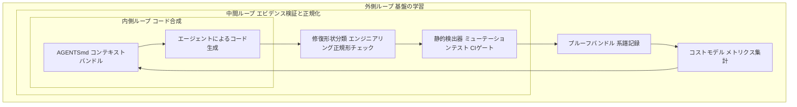
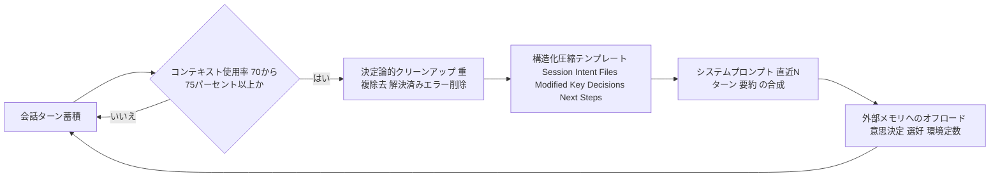
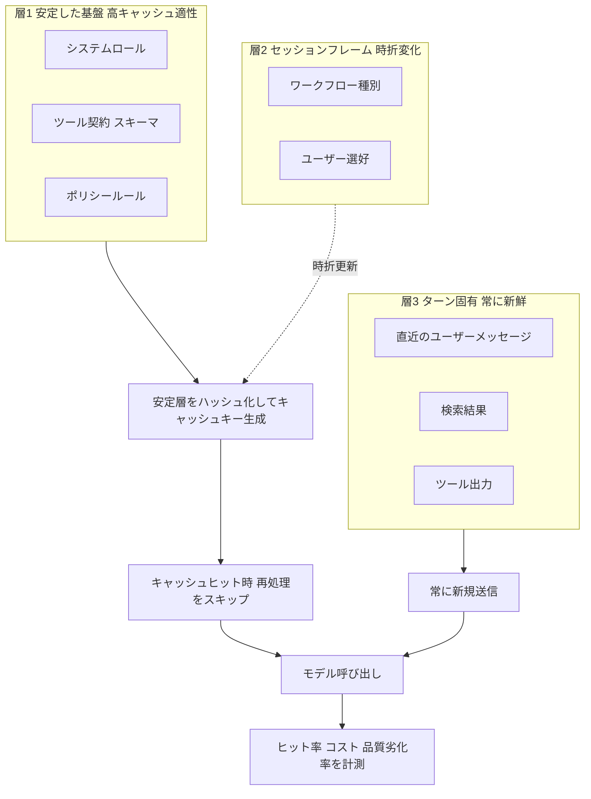

# Daily Briefing 2026-08-02

## 1. ハーネスエンジニアリング：エージェントプロンプトから工学的制御システムへ（原題: Harness Engineering: From Agent Prompts to Engineering Control Systems）

- **URL**: https://gtcode.com/articles/harness-engineering/
- **公開日**: 2026-03-04（2026-05-23更新）
- **著者・媒体**: GTCode.com

### 本文翻訳
ハーネスエンジニアリングとは、AIエージェントがソフトウェア開発作業を信頼性高く、安全に、計測可能に、かつアーキテクチャ上の逸脱を抑えた形で遂行できるよう、その周囲に実行可能な制御システムを設計する規律であると著者は定義する。エージェント主導の開発では、コード生成自体は安価になる一方でレビュー・検証・アーキテクチャ判断が希少資源となる「希少性の逆転」が起きており、この逆転に対応する仕組みがハーネスである。

ハーネスは意図・知識・コンテキスト・能力・合成・抽出・エビデンス・正規化・ガバナンスという9層で構成され、内側のループがコード合成を、中間ループがエビデンス検証と出力の正規化を、外側のループが失敗事例をもとにハーネス自体を進化させるという入れ子構造を成す。

基盤となるのは「リポジトリ常駐知識」で、人間向けREADMEとは別に、エージェントが発見しやすい`AGENTS.md`を用意し、コマンドを冒頭に、具体例・境界・技術スタック・テスト方法・git運用・制約を明記する。さらに`ARCHITECTURE.md`やdocs/design/配下の意思決定記録を整備する。

重要な指針は散文のままでは不十分で、静的検出器・自動生成テスト・テンプレート・CIゲートという「実行可能な形」へ昇格させる必要がある。例えば「ビジネスロジックをコールバック内に置かない」という指針は、ASTベースの検出ルール`otp.callback.functional_core_boundary`とマージゲートのブロックへと変換される。各ルールは代表的な違反を検出できることをミューテーションテストで証明しなければならない。

「コンテキストバンドル」は、タスクごとに関連仕様・許可/禁止ファイルと操作・期待される実行時形状・必須テストと完了基準をまとめたパケットで、「全部渡す」ではなく「重要な物だけをコンパイルする」という発想に基づく。

「エンジニアリング正規形」は、モジュール種別ごとに許容される実装形状を定義する。純粋ドメインモジュールは決定論的なデータイン・データアウトのみを許し、プロセス生成やファイル・ネットワーク書き込みは禁止。ステートフルプロセスは状態所有の正当化・公開APIファサード・child_spec・スーパーバイザ配置の証明を要求する。

「修復形状分類」では、コード生成前に修復範囲を分類する。ローカルなロジック修正は許可、公開API変更は要挑戦、実行時トポロジ変更は強く要挑戦、セキュリティ境界変更はブロックまたは高信頼レビューとする。ローカルなバグに対してグローバルなトポロジ変更を選ぶような不釣り合いな修復は、差分生成前に却下されるべきとする。

さらに、仕様・実装・エビデンス・実行時・コスト・系譜という複数のグラフを維持する「グラフ基盤」、主要サブシステムの振る舞い・所有権・境界・コストを要約する「アーキテクチャカプセル」、読み取りは広く変更は狭く許可する「能力制限付きエージェント」、繰り返す失敗を静的検出器・回帰テスト・CIゲート・改修手順に変換する「ノーグッド・コンパイル」、テスト合格後にLOC・モジュール数・公開関数数を測定し「同じ振る舞いをより少ない概念で実現できないか」を挑戦する「圧縮・書き換えチャレンジ」など、多数の実践的技法を提示する。

コストモデルではモジュール=1.0、公開関数=0.4、ステートフルプロセス=4.0、単一実装ビヘイビア=5.0、未宣言の副作用=無限大、といった重みを明示的な契約として扱い、テスト・ゲート・可観測性を通じて強制する。マージ判断は修復形状に応じた段階的リスクルーティングで行い、ローカルな純粋関数変更は高速パス、実行時トポロジ変更はライフサイクル・障害・負荷テストのエビデンスを要求する。著者は最終的な運用原則を「モデルは提案し、ハーネスは処分し、基盤は学習する」と要約している。

### 重要ポイント
- ハーネスは意図〜ガバナンスの9層構造で、内側/中間/外側の入れ子フィードバックループを持つ
- 指針は散文のままでなく、静的検出器・CIゲート等の「実行可能な強制機構」へ昇格させるべき
- コンテキストバンドル・修復形状分類・エンジニアリング正規形により、タスクごとに必要な情報とエージェントの変更範囲を絞り込む
- コストモデルで「モジュール1つ=1.0」のような重みを定義し、アーキテクチャの肥大化を定量的に管理する
- 運用原則は「モデルは提案し、ハーネスは処分し、基盤は学習する」

### 図解


### 現場での適用方法

**CLAUDE.md への追記例**
```markdown
## ハーネス運用ルール（harness-engineering より）

- 新規プロセス・並行処理（キュー/ワーカー/スケジューラ等）を追加する場合、
  PR説明に次を明記する: なぜプロセスである必要があるか / 状態の所有者 /
  公開APIファサード / 再起動戦略 / タイムアウト方針
- 公開APIの変更、実行時トポロジの変更は「ローカル修正で対応できないか」を
  先に検討し、できない理由を一行で書く
- テスト合格後、diffサマリに新規モジュール数・新規公開関数数を含め、
  「より少ない概念で同じ振る舞いを実現できないか」を自問してから提出する
- セキュリティ境界（認証・認可・秘密情報の扱い）に触れる変更は、
  人間による高信頼レビューを必須とする
```

**スキル化の例（SKILL.md）**
```yaml
---
name: repair-shape-classifier
description: バグ修正やタスク着手前に、修正範囲（ローカルロジック/ローカルデータ形状/公開API/実行時トポロジ/セキュリティ境界）を分類し、範囲に不釣り合いな変更を提案しないためのチェックリストを提示する。コード変更に着手する前に必ず使用する。
---
```
本文骨子:
1. タスク内容から修正が及ぶ範囲を上記5段階で分類させる
2. 分類結果に応じて要求するエビデンス（テストのみ／API diff／ライフサイクルテスト／高信頼レビュー）を提示する
3. 元のバグ報告より大きい分類が選ばれた場合は理由を明記させ、妥当性を人間に確認させる

### 期待効果
散文的な開発ガイドラインを機械的に検証可能な形へ変換することで、レビュー負担を「高リスクな意思決定」に集中させられるとされる。コストモデルの導入により、アーキテクチャの肥大化（不要なプロセス・単一実装インターフェース等）を数値で継続監視できる。

### 注意点
記事の具体例はElixir/OTPが中心で、9層すべてを一度に導入するのは非現実的。著者が示す段階的ロードマップ（MVP相当の監査コマンドから開始し、コンテキストバンドル、ゲート、圧縮、系譜記録の順で拡張）に沿った導入が前提となる。過度な形式化はかえって人間側の運用負荷を増す可能性があるため、まず小さく始めて効果を測定すべき。

## 2. 長時間稼働するエージェントセッションにおけるコンテキスト圧縮：手法とトレードオフ（原題: Agent Context Compaction for Long-Running Sessions: Techniques and Tradeoffs）

- **URL**: https://zylos.ai/research/2026-04-21-agent-context-compaction-long-running-sessions/
- **公開日**: 2026-04-21
- **著者・媒体**: Zylos Research

### 本文翻訳
長時間稼働するAIエージェントのセッションでは、会話履歴が蓄積するにつれてトークンコストが「二次関数的」に増大する。たとえば20ステップのエージェントループで各ステップが1,000トークンを生成する場合、単純計算では2万トークンで済むはずが、各ステップが過去の全履歴を再送するため累計入力トークンは21万トークンに達する。

長時間セッションは3つの失敗モードに直面する。第一に上記の二次関数的コスト増大。第二に「Lost-in-the-middle」効果で、複数文書に対する質問応答タスクにおいて、回答が長いコンテキストの中間に位置する場合、性能が30ポイント以上低下することが研究で示されている。これは位置埋め込みが系列中間部への注意を減衰させるためである。第三に「コンテキスト・ロット（腐敗）」で、無関係なツール出力や冗長な再読み込みがエラー信号を伴わずに静かに蓄積し、精度を劣化させる。

圧縮手法は主に4種類に分類される。「要約（サマライゼーション）」はローリングまたは階層的な要約で会話履歴をコンパクトな記述に置き換える手法で、シンプルかつプロバイダ非依存だが、評価では「どのファイルが変更されたか」という成果物の追跡精度が5点満点中2.19〜2.45点と低い。「選択的な追い出し（イビクション）」はLRUやアテンション重みに基づき古い・重要度の低いトークンを破棄する手法で高速だが、参照連鎖を壊すリスクがあり、過去のアテンションに基づく重要度スコアは新しいタスクとの関連性を見誤りやすい。「検索拡張型エピソード記憶」は各ターンをベクトルDBに保存し必要に応じて取得する方式で、無制限の深さにスケールするが、選好の推論やターンをまたいだ因果推論が苦手である。そして業界標準となっているのが「ハイブリッド方式」で、システムプロンプトと直近Nターンをそのまま保持しつつ、それ以前の履歴を要約に置き換える。AnthropicのAPIの`compact_20260112`はこのパターンを実装している。

圧縮の前段階として、同一のツール実行結果の重複除去・解決済みエラーメッセージの削除・冗長なAPIレスポンスの定型的な切り詰めといった「決定論的な構造クリーンアップ」を行うことで、モデルを一切使わずにコンテキストを15〜30%削減できるとされる。またアーキテクチャ上の意思決定・ユーザーの選好・環境定数は、圧縮時にまとめて処理するのではなく、確定した時点で即座に構造化ファイルやキーバリューストアへ書き出す「外部メモリへのオフロード」が、圧縮チェーンに依存しない永続性を実現する。

本番運用上のトレードオフとして、圧縮処理自体が5〜15秒のレイテンシスパイクを生み、かつ「意味的な断絶点（ハード・セマンティック・ブレーク）」としてキャッシュされたプレフィックスを無効化する。プロンプトキャッシングはバイト単位でのプレフィックス一致を要求するため、これは重大な問題であり、推奨アーキテクチャは`cache_control`のブレークポイントを安定したシステムプロンプト側に置き、揮発性の高い会話領域には置かないというものである。

構造化された圧縮（変更ファイル・重要な意思決定・次のステップなどの明示的セクションを持つテンプレート）は自由記述の要約より優れた成果を出す。素朴な要約ベースラインは多段階タスクで深刻な精度劣化を示したという知見が引用されている。

最も重要な推奨事項は、コンテキストウィンドウの95〜98%ではなく70〜75%で圧縮をトリガーすることである。たとえば20万トークンのウィンドウであれば15万トークンの時点で圧縮を開始すれば、質の高い要約を生成するための十分な出力トークン余地が残る。トリガーが遅れると「コンテキスト不安」と呼ばれる状態に陥り、不完全な圧縮しか生成できなくなる。

### 重要ポイント
- 長時間セッションは「トークンコストの二次関数的増大」「Lost-in-the-middle」「コンテキスト・ロット」という3つの失敗モードを持つ
- 圧縮トリガーはウィンドウの70〜75%が最適。95〜98%まで待つと圧縮の質（「コンテキスト不安」）が落ちる
- ハイブリッド方式（システムプロンプト＋直近Nターン保持＋それ以前を要約）が業界標準。構造化テンプレートが自由記述要約より成果物追跡精度で優れる
- モデルを使わない決定論的クリーンアップ（重複排除・解決済みエラー削除）だけでコンテキストを15〜30%削減可能
- 圧縮はプロンプトキャッシュのプレフィックスを破壊するため、cache_controlは安定したシステムプロンプト側に置くべき

### 図解


### 現場での適用方法

**CLAUDE.md への追記例**
```markdown
## コンテキスト圧縮運用ルール（context-compaction より）

- 長時間タスクでは /context でトークン使用率を随時確認し、
  70〜75% に達したら早めに /compact する（限界まで待たない）
- 圧縮前に、同一のツール実行結果の重複や、既に解決済みのエラーメッセージは
  「不要」と明示してから圧縮する
- 確定したアーキテクチャ上の決定・環境定数・ユーザーの選好は、都度
  <REPO_PATH>/docs/decisions.md に追記する。圧縮まで待って記録しない
- 圧縮後の要約には必ず「変更したファイルの一覧（フルパス）」を含めるよう
  指示し、含まれていなければ再生成させる
```

**運用手順**
```bash
# 長時間セッション運用手順
# 1. セッション開始時に意思決定ログを用意する
mkdir -p <REPO_PATH>/docs
touch <REPO_PATH>/docs/decisions.md

# 2. 作業の節目ごとに使用率を確認する（Claude Code CLI 内で）
/context

# 3. 使用率が 70-75% に達したら圧縮を実行する
/compact

# 4. 圧縮後、要約に「変更ファイル一覧」が含まれているか目視確認する
```

### 期待効果
決定論的クリーンアップのみでコンテキストを15〜30%削減できる。圧縮トリガーを70〜75%に早めることで、Lost-in-the-middle由来の30ポイント超の性能低下や、圧縮そのものの品質劣化（コンテキスト不安）を回避しやすくなる。

### 注意点
圧縮はプロンプトキャッシュのプレフィックスを破壊し、5〜15秒のレイテンシスパイクとコスト増を招きうるため、圧縮頻度とキャッシュヒット率のトレードオフを測定すべき。成果物（変更ファイル）の追跡精度は主要な圧縮手法いずれでも5点満点中2点台前半と弱点であり、圧縮後は人間が変更ファイル一覧を確認する工程を省略しないこと。

## 3. AIエージェントのためのプロンプトキャッシング：コンテキストを壊さずにコストとレイテンシを削減する（原題: Prompt Caching for AI Agents: How to Cut Cost and Latency Without Breaking Context）

- **URL**: https://medium.com/toward-next-ai/prompt-caching-for-ai-agents-how-to-cut-cost-and-latency-without-breaking-context-245dc2502b4b
- **公開日**: 2026-04-28
- **著者・媒体**: Anna Jey（Toward Next AI, Medium）

### 本文翻訳
著者はまず、プロンプトキャッシングを検索拡張生成（RAG）や長期記憶と区別する。プロンプトキャッシングは、それ以外なら毎回送信・再処理されるはずの安定したプロンプト要素を再利用する、より狭い概念である。エージェントが同じシステムプロンプト・同じツールスキーマ・似た指示構造を何百回も再送している場合、そのたびにモデルは同一のテキストを再処理しており、これはコストとレイテンシの両面で無駄である。

著者はプロンプトを3層のモデルで整理することを提案する。「層1：安定した基盤」はシステムロール・行動ルール・ツール契約であり、最もキャッシュに適する。「層2：セッションフレーム」はワークフロー種別・メタデータ・ユーザーの選好で、時折変化する。「層3：ターン固有」は最新のユーザーメッセージ・検索結果・ツール出力で、常に新鮮さが求められる。

キャッシュに適した要素はシステム指示・ツールスキーマと説明・静的な参照ドキュメント・Few-shot例・ポリシールールであり、逆にキャッシュすべきでない要素はユーザーの要求・検索結果・現在のツール出力・一時的なコメントである。

実装のための設計パターンとして5つのステップが示される。ステップ1は「アセットと組み立ての分離」で、プロンプトの構成要素をハードコードされた文字列としてではなく、`system_core.md`や`tool_routing.md`のような独立したファイルとして保存する。ステップ2は「安定層のハッシュ化」で、著者は以下のようなコード例を示す。

```javascript
function stableCacheKey(parts) {
  const normalized = JSON.stringify(parts,
    Object.keys(parts).sort());
  return crypto.createHash("sha256")
    .update(normalized).digest("hex");
}
```

ステップ3は「キャッシュキーから高速に変化する値を除外する」ことで、タイムスタンプやリトライ回数、ツール出力をキャッシュキーの計算対象から外す。ステップ4は「コンテキスト圧縮の実装」でプロンプトの肥大化を防ぐ。ステップ5は「レイテンシだけでなく、キャッシュヒット率・タスクあたりコスト・品質劣化率を計測すること」である。

著者はチームが陥りがちな落とし穴として、古いポリシー指示の残存、ツールスキーマのドリフト（キャッシュされた説明と実際の実装のズレ）、検索結果の過剰キャッシュ、キャッシュの断片化、そして共有キャッシュへの機微情報混入によるプライバシー漏洩を挙げる。

記事の核心的な主張は「このプロンプトのどの部分を、毎回無意味に再構築しているのか」という単純な問いから始めよ、というものであり、プロンプトキャッシングはコンテキストの新鮮さを犠牲にすることなくエージェントを効率的にスケールさせるために、何が一定で何が変化するのかについてアーキテクチャ上の明確さを強制する、と結論づけている。

### 重要ポイント
- プロンプトを「安定した基盤／セッションフレーム／ターン固有」の3層に分け、層ごとにキャッシュ戦略を変える
- キャッシュキーは安定要素のみで決定論的にハッシュ化し、タイムスタンプ・リトライ回数・ツール出力等の高頻度変化値を含めない
- プロンプト資産（system_core.md等）を組み立てロジックから分離して管理する
- 計測すべきはレイテンシだけでなく、キャッシュヒット率・タスクあたりコスト・品質劣化率
- 落とし穴はツールスキーマのドリフト、キャッシュの断片化、共有キャッシュへの機微情報混入

### 図解


### 現場での適用方法

**スクリプト化の例（層構造プロンプトの組み立てとキャッシュキー生成）**
```javascript
// prompt-assembler.js
const fs = require("fs");
const crypto = require("crypto");

function loadStableLayer() {
  return {
    system: fs.readFileSync("<REPO_PATH>/prompts/system_core.md", "utf8"),
    tools: fs.readFileSync("<REPO_PATH>/prompts/tool_routing.md", "utf8"),
  };
}

function stableCacheKey(parts) {
  const normalized = JSON.stringify(parts, Object.keys(parts).sort());
  return crypto.createHash("sha256").update(normalized).digest("hex");
}

function assemblePrompt({ sessionFrame, turnMessage }) {
  const stable = loadStableLayer();
  const cacheKey = stableCacheKey(stable);
  return {
    cacheKey,
    // 安定層は常に先頭、ターン固有情報は必ず末尾に置く
    messages: [
      { role: "system", content: stable.system },
      { role: "system", content: stable.tools },
      { role: "system", content: JSON.stringify(sessionFrame) },
      { role: "user", content: turnMessage },
    ],
  };
}

module.exports = { assemblePrompt };
```

**CLAUDE.md への追記例**
```markdown
## プロンプトキャッシング運用ルール（prompt-caching より）

- システムプロンプト・ツール定義は先頭に固定し、セッション途中で
  内容や順序を変更しない（キャッシュプレフィックスを破壊するため）
- タイムスタンプ・セッションID・リトライ回数などの動的な値は、
  必ず末尾（最新のユーザーメッセージ側）に置く
- ツールスキーマを変更したら、対応するキャッシュキーも再生成する運用を徹底する
- 週次で「キャッシュヒット率」「タスクあたりコスト」を確認し、
  レイテンシだけを見て最適化したと判断しない
```

### 期待効果
記事内には具体的な削減率は示されていないが、安定層と可変層を明確に分離することで、プロンプトキャッシュのヒット率を構造的に高めやすくなり、レイテンシとコストの双方の削減につながるとされる。ツール定義や参照ドキュメントなど「毎回無意味に再構築している」部分を洗い出すこと自体が、アーキテクチャの明確化に寄与する。

### 注意点
ツールスキーマを更新した際にキャッシュされた古い説明との乖離（ドリフト）が生じないよう、スキーマ変更時はキャッシュキーの再生成を徹底する必要がある。機微情報を含むセッションフレームを共有キャッシュに混在させるとプライバシー漏洩につながるため、層ごとにアクセス範囲を分離すること。
