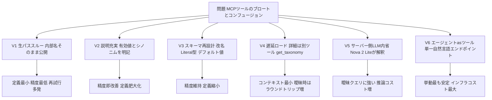
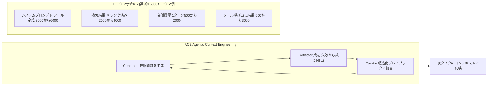
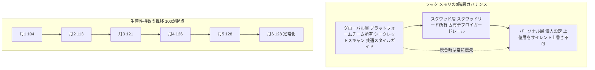

# Daily Briefing 2026-08-03

## 1. MCPツール設計：実践的アプローチとトレードオフ（原題: MCP tool design: Practical approaches and tradeoffs）

- **URL**: https://aws.amazon.com/blogs/machine-learning/mcp-tool-design-practical-approaches-and-tradeoffs/
- **公開日**: 2026-07-09
- **著者・媒体**: Daniel Wells, Raian Osman（AWS Machine Learning Blog）

### 本文翻訳
著者らは、Model Context Protocol（MCP）ツールの性能低下はプロトコル自体の欠陥ではなく「ツール設計」に起因すると指摘する。多くのチームは既存のバックエンドAPIをそのままMCPツールとして公開し、エージェントがそれに適応するものと期待するが、これが「ブロート（コンテキストの肥大化）」と「コンフュージョン（LLMの誤選択）」という2つの問題を生む。ツール定義は接続されている限り毎ターンLLMのコンテキストに読み込まれ、コンテキストが埋まるほど推論精度が落ちる。精度低下がさらに誤ったツール呼び出しと再試行を招き、再試行がまたコンテキストを消費するという悪循環に陥る。

記事は教育コンテンツ検索APIを題材に、同一バックエンドに対する6種類の実装（V1〜V6）を比較する。**V1（生のパススルー）**はバックエンドの内部パラメータ名をそのまま14個公開し、有効値やシノニムの説明を持たない反パターンで、LLMは「quiz」を渡すべきところを誤って別の値を渡し、失敗しても空の結果しか返らず何を直せばよいか分からない。**V2（説明充実）**はスキーマは変えず、各フィールドの有効値とシノニムマッピング（例：'quiz'/'test' → Assessment）を書き込み、即座に精度を改善するがツール定義自体は肥大化する。**V3（スキーマ再設計）**はパラメータ名をLLMの思考に合わせて改名し（discipline→subject等）、有限値フィールドをLiteral型で制約し、頻用値をデフォルト化することで、V2より小さい定義で同等以上の精度を達成する。**V4（遅延ロード）**は検索ツール本体を最小限の短いヒントのみにとどめ、詳細な有効値・シノニムは別ツール`get_taxonomy`の背後に隠す。単純なクエリはヒントだけで解決しラウンドトリップを避けられ、曖昧なクエリのときだけ`get_taxonomy`を呼び出す。**V5（LLM内省）**はAmazon Bedrock上のNova 2 Liteが自然言語の質問を解釈し推奨フィルタとその根拠を返す専用ツールを挟むことで、クライアント側のモデルを弱いものに切り替えても結果が安定する。**V6（エージェントasツール）**はStrands Agentsで構築した単一の自然言語エンドポイント`agentic_search_content(question)`のみを公開し、タクソノミー検索・詳細取得・応答整形をすべてサーバー内部のエージェントに委譲する。会話履歴も呼び出しを跨いで保持されるため、クライアントの推論能力に関わらず挙動が安定するが、インフラコストと遅延は最大になる。

5種類のテストクエリ（例：「7年生の分数のクイズを探して」「n-sc-1096の詳細が欲しい」）で、初回呼び出しでの正答率・必要な呼び出し回数・コンテキスト消費速度を比較したところ、V2はリファクタ不要で最速に精度を改善できる選択肢、V4は最もコンテキスト効率の良いベースライン、V5は他バージョンが取りこぼす曖昧なクエリに強く、V6は挙動の一貫性と制御を最大化する代わりに最も重いインフラを要求するという結論に至った。著者は「唯一の正解は存在せず、ブロートとコンフュージョンのどちらをどれだけ許容できるかで選ぶべき」と述べ、AWS MCPサーバー群、Amazon Bedrock AgentCore、Strands Agents SDKを実装の出発点として挙げている。

### 重要ポイント
- MCPツールの性能問題は「プロトコル」ではなく「ツール設計」に起因し、ブロート（コンテキスト肥大化）とコンフュージョン（誤選択）の悪循環が本質
- V2（説明充実）、V3（スキーマ制約とデフォルト値）、V4（遅延ロード）、V5（サーバー側LLM内省）、V6（エージェントasツール）の5パターンで、精度・定義サイズ・レイテンシ・インフラコストのトレードオフが明確に異なる
- パラメータ名をバックエンドの内部用語ではなくLLMが解釈しやすい語に改名するだけでも精度と定義サイズの両方が改善する
- 曖昧なクエリへの対応が必要ならV5/V6のようにサーバー側で解釈を肩代わりする設計が有効
- 6実装は比較可能な形でコードとして公開されており、自分の環境で同じ5クエリを流して再現検証できる

### 図解


### 現場での適用方法

**CLAUDE.md への追記例**
```markdown
## MCPツール設計ルール（mcp-tool-design より）

- 新しいMCPツールをバックエンドAPIから機械的に生やさない。まず
  「LLMが選ぶ可能性のある自然言語の言い回し」を洗い出し、有効値・
  シノニムマッピングをツール説明に明記する（V2パターン）
- 内部専用の変数名（例: content_bucket, discipline）をそのまま
  パラメータ名にしない。LLMの語彙に合わせて改名し、頻用値は
  デフォルト値として省略可能にする（V3パターン）
- 列挙候補が多いフィールドは、メインツールの説明に埋め込まず
  get_taxonomy 的な補助ツールに退避し、曖昧なクエリのときだけ
  呼び出させる（V4パターン）
- ツール変更後は必ず代表的な5パターンのクエリで「初回呼び出しの
  正答率」「呼び出し回数」「/context 表示上のコンテキスト消費速度」
  を比較してから本番反映する
```

**運用手順**
```bash
# 既存MCPツールの設計を検証する手順（AWS記事の比較実験を再現）
# 1. 代表的なテストクエリを5〜10個用意する（曖昧なものを含める）
cat > <REPO_PATH>/test-queries.txt <<'EOF'
7年生の分数のクイズを探して
中学校でのスペイン語のレッスンはある?
n-sc-1096の詳細が欲しい
何のコンテンツが検索できる?
EOF

# 2. 各クエリをエージェントに投げ、初回呼び出しで正しいパラメータが
#    選ばれたか、呼び出し回数、/context のトークン消費を記録する
# 3. 誤りが多いパラメータには V2（説明+シノニム追記）または
#    V3（改名+Literal型+デフォルト値）を適用し、再テストする
# 4. 曖昧なクエリの誤りが残る場合のみ、V4（遅延ロードの補助ツール）
#    または V5（サーバー側内省ツール）の追加を検討する
```

### 期待効果
記事内に統一的な削減率の数値提示はないが、比較実験ではV2適用後に初回呼び出し精度が改善し、V4はベースラインより少ないコンテキスト消費で同等の解決率を達成したとされる。段階的にV2→V3→V4/V5と適用することで、大規模リファクタなしにツール呼び出しの誤りと再試行コストを抑えられる。

### 注意点
V5・V6はサーバー側の推論呼び出しが増えるため、追加のレイテンシとインフラコストが発生する。全ツールに一律で最も手厚いパターン（V6）を適用するのは過剰投資になりやすく、まず自分のツール群でV1〜V4相当のどこに位置するかを診断し、曖昧なクエリの失敗率が実際に高い場合にのみV5/V6を検討すべきである。

## 2. コンテキストエンジニアリング：2026年のAIエージェント実践プレイブック（原題: Context Engineering: The 2026 Playbook for AI Agents）

- **URL**: https://cruxdigits.nl/blog/context-engineering-ai-agents-2026/
- **公開日**: 2026-07-24
- **著者・媒体**: Santhul Joseph（Crux Digits）

### 本文翻訳
コンテキストエンジニアリングとは、限られたコンテキストウィンドウの中に、システム指示・ツール定義・取得ドキュメント・会話履歴のどのトークンを配置するかを判断する学問である。2025〜2026年の研究により、フロンティアモデルはウィンドウが物理的に満杯になる前から、入力長の増加に応じて測定可能に性能が低下することが示されている。Chroma Researchが2025年7月に発表した研究では、GPT-4.1・Claude 4・Gemini 2.5を含む18のフロンティアモデルをテストし、すべてのモデルで精度低下が段階的ではなく「ウィンドウの定格上限よりずっと手前で急落する崖」として現れることを確認した。200Kトークンのウィンドウでも約50Kトークンの入力で深刻な精度低下が始まり、20文書のコンテキスト中5〜15番目に正解の事実が置かれると、先頭または末尾に置いた場合と比べ30ポイント以上精度が落ちるモデルもあった。解決策はウィンドウを大きくすることではなく、「規律あるトークン予算」だと著者は主張する。

対処法はWrite（外部への書き出し。スクラッチパッドやメモリファイルに退避し、既に確立した事実を再導出させない）、Select（RAGやツール呼び出しで必要な情報だけを取り込む。過剰な検索はそれ自体が問題になりうる）、Compress（解決済みターンの要約、生のツール出力のトリミング、完了したサブタスクの削除）、Isolate（サブエージェントやサンドボックス化されたステップで作業を分割し、あるタスクのノイズが別タスクのコンテキストを汚染しないようにする）の4つに整理される。

さらに記事は、Stanford・SambaNova・UC Berkeleyによる研究「Agentic Context Engineering（ACE）」を紹介する。従来はエンジニアが手動でトークン予算を決めていたが、ACEはエージェント自身にコンテキストを管理させる仕組みで、Generator（推論軌跡を生成）・Reflector（何が機能し何が失敗したかから具体的な教訓を抽出）・Curator（それらの教訓を、静的な単一システムプロンプトではなく構造化された進化する「プレイブック」に統合）という3つの役割で構成される。モデル自体の重み更新を一切行わなくても、ACE管理下のコンテキストはエージェントタスクで10.6%、金融分析タスクで8.6%、強いベースラインを上回った。著者はこれを「モデルが賢くなったのではなく、コンテキストが賢くなった」と表現する。

具体的なトークン予算の目安として、オランダの中小企業向けカスタマーサービスエージェントを例に、システムプロンプトとツール定義で3,000〜6,000トークン、検索結果（適切にリランク・フィルタ済みの場合。生のチャンクをそのままダンプすると10倍に膨らむ）で2,000〜4,000トークン、会話履歴が1ターンあたり500〜2,000トークン、ツール呼び出し結果（注文検索やCRMレコードなど、生のAPI JSONをそのまま貼ると膨張する）が500〜3,000トークンで、8ターンのチケット1件で合計約16,500トークンに達するという内訳を示す。Chromaのデータでは200K〜1Mトークンの定格ウィンドウでも実質的に関連する情報は5万トークン前後から精度低下が始まるため、著者は「ウィンドウの定格上限ではなく、その一部を作業コンテキストの予算とし、ツールや検索ソースを追加するたびに再測定せよ」と助言する。オランダの中小企業がn8nやExact Online、AFASと連携する場合の最大の誤りは「安全のため」とバックオフィスのエクスポート全体をシステムプロンプトに貼り付けることであり、Selectを絞り込む（全体エクスポートではなく個別レコード検索）、Isolateを活用する（1エージェントに全チケットを持たせず取り込み・検索・ドラフト・承認の小さなサブエージェントに分割する）、Compressを実施する（チケット解決後は履歴を圧縮し、数週間後の再連絡が過去のノイズを引きずらないようにする）という3つのパターンを推奨する。16,500トークンの各々がそのターンの全モデル呼び出しに課金されるため、圧縮されない履歴は精度劣化と同時にコスト増大としても複合していく。

### 重要ポイント
- コンテキストの精度低下はウィンドウが埋まる前から始まり、200Kウィンドウでも約5万トークン付近で崖のように劣化する（Chroma Research, 18モデル調査）
- 対処法はWrite/Select/Compress/Isolateの4分類。Selectの過剰利用（検索し過ぎ）自体が新たな問題になりうる
- ACE（Generator/Reflector/Curator）はモデルの再学習なしにコンテキスト自体を進化させ、エージェントタスクで10.6%、金融分析で8.6%の改善を報告
- 実務では16,500トークン程度の内訳例のように、システムプロンプト・検索結果・履歴・ツール出力を項目ごとに見積もり、追加のたびに再測定すべき
- 中小企業の典型的な失敗は「安全のため」に生データを丸ごとシステムプロンプトへ貼ること。個別レコード検索・サブエージェント分割・履歴圧縮で対処する

### 図解


### 現場での適用方法

**CLAUDE.md への追記例**
```markdown
## コンテキスト予算ルール（context-engineering-playbook より）

- 新しいツールや検索ソースを追加するたびに、そのツールが平均何トークン
  消費するかを実測し、docs/context-budget.md に追記して再集計する
- 検索結果・API/ツール出力は生JSONをそのままコンテキストへ貼らない。
  必要な3〜5フィールドに絞ってから渡す（フィルタなしは約10倍に膨張する）
- 1つのエージェントに「取り込み→検索→ドラフト作成→承認」を全部持たせず、
  各工程を独立したサブエージェント/サブタスクに分割する（Isolate）
- チケットやタスクが解決したら、次の関連タスクに引き継ぐ前に履歴を要約し、
  未解決の論点だけを残す（Compress）
```

**運用手順**
```bash
# コンテキスト予算の可視化・監査手順
# 1. 主要なエージェントフロー1件につき、項目別トークン使用量を記録する
cat >> <REPO_PATH>/docs/context-budget.md <<'EOF'
## <フロー名> のトークン予算 (計測日: <YYYY-MM-DD>)
- システムプロンプト+ツール定義: <TOKENS>
- 検索結果: <TOKENS>
- 会話履歴 (1ターン平均): <TOKENS>
- ツール呼び出し結果: <TOKENS>
- 合計: <TOKENS>
EOF

# 2. ツールや検索ソースを追加した際は、追加後の合計を再計測して
#    ウィンドウ定格上限の70%を超えていないか確認する
# 3. 超えている場合は Select を絞る（フィルタ強化）か
#    Compress を実施する（履歴要約）か Isolate（サブエージェント分割）を検討する
```

### 期待効果
トークン予算を項目別に可視化し追加ごとに再測定する運用により、Lost-in-the-middle的な精度崖（記事内では最大30ポイント超の劣化例）を未然に防ぎやすくなる。ACEのような自己改善型コンテキスト管理は現状研究段階だが、Write/Select/Compress/Isolateの手動運用だけでも、金融分析タスクで8.6%、一般エージェントタスクで10.6%という改善幅に近い効果が期待できるとされる。

### 注意点
ACEはまだ研究フェーズであり、記事も「中小企業には時期尚早」と明記している。今すぐ現場で使えるのは手動のトークン予算設計（Write/Select/Compress/Isolate）の部分であり、自動キュレーションの導入は時期を見て検討すべきである。またコンテキスト予算の見積もりは環境依存性が高く、記事内の16,500トークンという数字はオランダの一事例であり、自社のツール構成・検索パイプラインで必ず実測し直す必要がある。

## 3. 100人開発チームでのAIコーディング導入 実践事例（半年間のデータ）（原題: Case Study: AI Coding Rollout at a 100-Dev Team 2026）

- **URL**: https://www.digitalapplied.com/blog/case-study-ai-coding-rollout-100-dev-team-quarterly-data-2026
- **公開日**: 2026-05-13
- **著者・媒体**: Digital Applied Team

### 本文翻訳
この組織は12ヶ月前、約30人の開発者を対象にClaude Codeの試験導入を行ったが10週間で静かに中止していた。事後分析では、採用率が約45%で頭打ちになったこと、指定エディタ以外を使うメンバーが半数いたこと、生産性メトリクスパネルがエンジニアリング側・財務側の双方から信頼されなかったことの3点が失敗要因として挙げられた。この教訓を踏まえ、100人の開発者（4プロダクトスクワッド、12サービス、TypeScript/Go/Python中心）を対象にした半年間の再挑戦が本稿の題材である。

再挑戦での最大の戦略転換は、エディタ選択を「制御すべき変数」ではなく「所与の制約」として扱ったことだ。チームはClaude CodeとCursorの両方のライセンスを全開発者に配布する「デュアルツール戦略」を採用した。ライセンス費用は単一ツール導入の約1.7倍に膨らむが、エディタ強制によって失われる採用率とグッドウィルの機会費用の方がはるかに大きいと判断された。ターミナルファーストのClaude CodeはIntelliJ系ユーザー（全体の60%）がサイドペインでリファクタ・複数ファイル編集・依存関係監査に使い、エディタファーストのCursorはVS Code系ユーザー（30%）が行レベル補完やインライン生成に使うというように、月6時点で利用シェアはClaude Code 62%・Cursor 38%に分かれた。

2ツールの分裂を防いだのが「スキルライブラリ」という標準化層である。プラットフォームチームが用意した初期9個のスキル（レビュー・リファクタ・スキャフォルド・デバッグ・可観測性の基本タスク向け）から出発し、2〜6週目にかけて各スクワッドが繰り返しタスク（JIRAからPRへの雛形生成、サービステンプレート生成、依存関係監査レポート等）を提案して18個まで急増、7〜12週目にはプラットフォームチームがレビュープロセスを導入して増加率を意図的に落とし、月6時点で32個（プラットフォーム9個、スクワッド提案23個）に落ち着いた。週あたりの呼び出しは約1,400回で、上位8スキルが全呼び出しの78%を占めるパレート分布を示した。貢献ガバナンスは「誰でも提案できるが、プラットフォームチームの審査と実行トレーステストの合格が必須」という折衷案に落ち着いている。

もう一つの柱がフックとメモリの3階層ガバナンスである。30人規模では全員が同じテンプレートをコピーするだけで済んだが、100人規模では単一テンプレートは数週間で対立を生んだ。そこでグローバル層（プラットフォームチーム所有。シークレットスキャンやリント・テストの事前コミットフック、共有スタイルガイドのメモリ。月6時点で11フック+23メモリエントリ）、スクワッド層（スクワッドリード所有。スクワッド固有のデプロイガードレールやランブック）、パーソナル層（個人の出力形式設定などで、上位層をサイレントに上書きできない）の3段構造を導入し、競合時は常にグローバル>スクワッド>パーソナルの順で解決するルールを敷いた。この運用にはプラットフォームチームだけで週2〜4時間（8週目以降）の継続的な工数が必要になっている。

生産性の測定では、前回失敗した「行コード数・週間PR数・マージまでの時間」といった生パフォーマンス指標を意図的に排除し、代わりに(1)実行トレース完了を伴うスキル呼び出し成功、(2)欠陥なくレビューを通過したPR受理、(3)個人評価に使わない週次2問アンケートによるチーム単位の「開発者報告摩擦」、(4)12サービス横断の欠陥率推移、という4つのエンゲージメント加重シグナルによる指数を設計した。指数はベースライン100から月1で104、月2で113（スキルライブラリ18エントリ到達と連動）、月3で121（第1四半期レビューで経営層がパネルとデュアルツール戦略を承認）、月4で126（フック規律の吸収に注意が向き伸びが鈍化）、月5で128（ライブラリ29エントリ、指数を再ベースライン化）、月6も128を維持して定常状態に達した。最終的に採用深度は前回の45%から87%まで伸び、経営陣はプログラムをパイロットから継続予算枠へ格上げした。著者は「もう一度やるなら、月6で完成度の高いパネルを作るより、1週目から意図的に不完全なパネルを配置する方が、経営層の不確実性を早期に解消できた」と振り返っている。

### 重要ポイント
- 前回パイロット失敗の主因は「エディタ強制」「不信感を招くメトリクス」であり、今回はエディタ選択を制約として受け入れるデュアルツール戦略（Claude Code + Cursor、ライセンス費1.7倍）で採用深度を45%→87%に改善
- スキルライブラリが2ツール間の標準化層として機能。9個→32個へ成長させつつ、後半はレビュープロセスで増加率を意図的に抑制（上位8スキルが呼び出しの78%）
- フック・メモリはグローバル/スクワッド/パーソナルの3階層で管理し、競合解決順位を明文化。100人規模ではこのガバナンス自体が継続的な工数（週2〜4時間）を要する仕事になる
- 生パフォーマンス指標（LOC・PR数・マージ時間）を排除し、スキル呼び出し成功・欠陥なきPR受理・週次摩擦アンケート・欠陥率推移の4シグナルで生産性指数を設計したことが経営層とエンジニア双方の信頼獲得につながった
- 6ヶ月で生産性指数は100→128（+28%）、月4〜5で伸びが鈍化してから定常化するカーブを描いた

### 図解


### 現場での適用方法

**運用手順**
```bash
# デュアルツール + スキルライブラリ導入のステップ（30人超の組織向け）
# 1. 主要ツールを1つに強制せず、利用実態に合わせて複数ライセンスを許容する
#    （エディタ内訳を先に調査してから決める）

# 2. プラットフォームチームが最頻出タスク3〜5個をスキル化する
mkdir -p <REPO_PATH>/.claude/skills/review-basic
cat > <REPO_PATH>/.claude/skills/review-basic/SKILL.md <<'EOF'
---
name: review-basic
description: PRの基本レビュー(命名 テスト網羅性 秘密情報混入)を自動チェックする。PR作成時に必ず使用する。
---
1. 変更ファイル一覧を取得する
2. 命名規則 テストカバレッジ 秘密情報の混入を順にチェックする
3. 指摘事項をPRコメント形式でまとめる
EOF

# 3. スキル追加は「誰でも提案可、プラットフォームチーム審査+実行トレーステスト必須」
#    というルールをCONTRIBUTING.mdに明記する

# 4. フックはグローバル/スクワッド/パーソナルの3階層でディレクトリを分離する
mkdir -p <REPO_PATH>/.claude/hooks/{global,squad,personal}
```

**CLAUDE.md への追記例**
```markdown
## 生産性計測ルール（100-dev-rollout-case-study より）

- LOCや週間PR数などの生パフォーマンス指標だけで評価しない。
  スキル呼び出しの成功、欠陥なきPR受理率、週次の開発者摩擦アンケート
  （個人評価には使わない）、欠陥率推移の4シグナルで判断する
- フック/メモリの変更はグローバル層を最優先とし、スクワッド層・
  パーソナル層は上位層をサイレントに上書きしてはならない
- 開発者報告摩擦が2週連続で悪化した場合、プラットフォームチームの
  優先監査タスクとしてエスカレーションする
```

### 期待効果
記事の事例では6ヶ月で生産性指数が28%向上し、採用深度が45%から87%に改善したと報告されている。同様にエディタ選択の強制をやめ、標準化層（スキルライブラリ）とガバナンス（3階層フック）を先に整備すれば、複数ツール運用でも組織的な分裂を避けつつ採用を深められる可能性が示唆される。

### 注意点
本事例は単一企業（Digital Applied自身の顧客案件とみられる）の内部データに基づくものであり、独立した第三者検証はない。デュアルツール戦略はライセンス費用が約1.7倍になるコスト増を伴うため、組織の採用停滞リスクとライセンスコストを比較した上で判断すべきである。またフック・メモリの3階層ガバナンスは、100人規模でもプラットフォームチームに週2〜4時間の継続工数を要しており、導入時にこの運用コストを予算化しておく必要がある。
