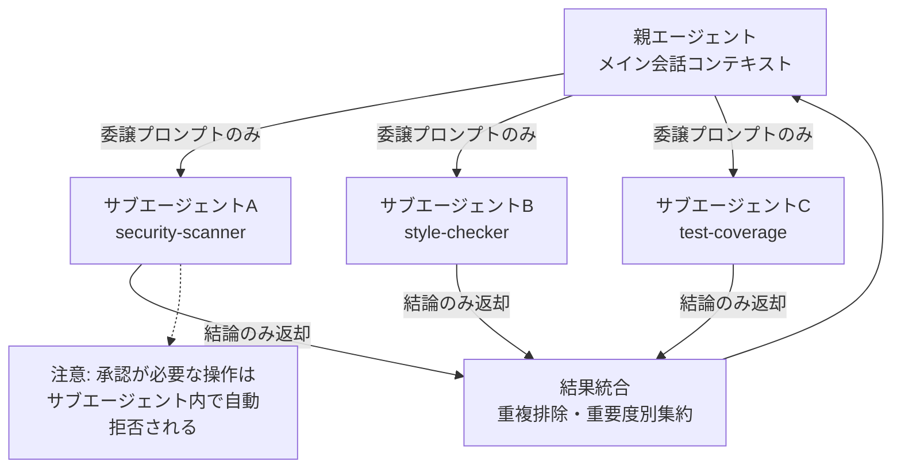
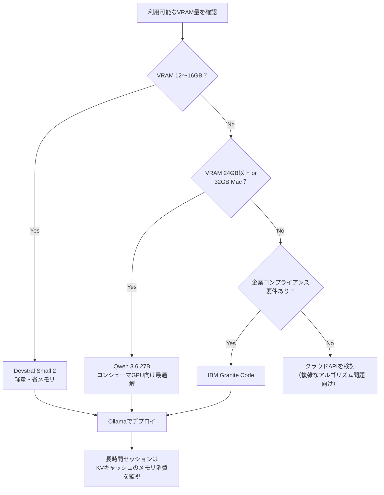
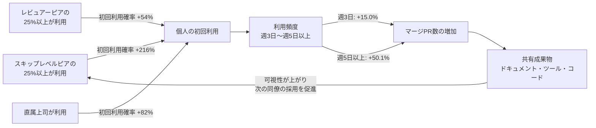

# Daily Briefing 2026-08-05

## 1. Claude Codeサブエージェント＆マルチエージェント・オーケストレーションガイド（原題: Claude Code Subagents and Multi-Agent Orchestration Guide — Delegation, Parallel Fan-Out, and Custom Agent Definitions）

- **URL**: https://hidekazu-konishi.com/entry/claude_code_subagents_and_orchestration_guide.html
- **公開日**: 2026-06-07
- **著者・媒体**: Hidekazu Konishi（個人技術ブログ）

### 本文翻訳
Claude Codeのサブエージェントは、独立したコンテキスト境界を持ち「結論のみを親エージェントに返す」ことを前提に設計されている。親からサブエージェントへの情報伝達は委譲プロンプトのみが唯一のチャネルであり、戻り値は最終メッセージに限定される。組み込みエージェントにはHaikuで動く読み取り専用の検索用「Explore」、計画前のコンテキスト収集用「Plan」、全ツールを使える汎用の「General-purpose」がある。

カスタムエージェントはMarkdown＋YAML frontmatterで定義し、`.claude/agents/`（プロジェクトスコープ）または`~/.claude/agents/`（ユーザースコープ）に置く。必須フィールドは`name`と`description`のみで、本文がそのままシステムプロンプトになる。他に`tools`（許可リスト）、`disallowedTools`（拒否リスト）、`model`、`permissionMode`、`maxTurns`、`skills`、`mcpServers`、`memory`、`background`、`isolation`が指定できる。ここでの最大の落とし穴は「`tools`を省略すると全ツールを継承する」という点で、省略＝ツールなしではなく、省略＝無制限であることを強く警告している。

オーケストレーションパターンとして、(1)高ボリューム操作の分離（テスト実行結果の要約のみ返す等）、(2)並列ファンアウト（複数モジュールを別々のサブエージェントで同時調査）、(3)パイプライン実行（レビュー→修正のように前段の出力を次段へ渡す）、(4)ロールパネル（セキュリティ・スタイル・カバレッジなど異なる観点のレビュアーを並列実行し結果を統合）、(5)バックグラウンド実行（長時間の自己完結タスクを承認不要で走らせる）の5つを紹介する。

委譲すべきでない条件として、編集と密結合した作業、小規模な既定の変更、途中承認が必要な作業、フェーズ間でのコンテキスト共有が重い作業を挙げる。特に「サブエージェントは`AskUserQuestion`が使えず、バックグラウンド実行時は確認プロンプトが自動的に拒否される」という制約が最大のピットフォールだとしている。

失敗モードとして、(1)中途承認不可、(2)冗長な結果によるコンテキスト肥大化、(3)サブエージェント自身のコンテキスト枯渇、(4)コールドスタートによる無駄な再調査、(5)並列編集によるワークツリー競合、(6)エージェント定義のディスク上変更がセッション再起動まで反映されない定義陳腐化、の6つを具体的な回復策とともに解説している。

### 重要ポイント
- サブエージェントは独立コンテキストを持ち、委譲プロンプトが唯一の情報伝達チャネルである
- `tools`フィールドを省略すると全ツールを継承するため、明示的な許可リスト指定が安全
- 並列ファンアウト・パイプライン・ロールパネル・バックグラウンド実行の4パターンを使い分ける
- サブエージェントは中断承認ができないため、承認が必要な作業はフォアグラウンドで実行する
- `isolation: worktree`で並列編集時のファイル競合を防止できる

### 図解


### 現場での適用方法
リポジトリの`.claude/agents/`にレビュー用サブエージェント3種を追加し、`CLAUDE.md`にロールパネル運用ルールを追記する形で導入する。

`.claude/agents/security-scanner.md`:
```markdown
---
name: security-scanner
description: "Reviews changes for security issues only - injection, secrets, authz gaps. Use as part of a review panel."
tools: Read, Grep, Glob, Bash
model: sonnet
---

あなたはセキュリティレビュー専門のサブエージェントです。
差分に対してインジェクション、シークレット漏洩、認可漏れのみを確認し、
発見事項を重要度（critical/high/medium/low）付きで簡潔に返してください。
編集は行わず、報告のみに徹してください。
```

`.claude/agents/style-checker.md`:
```markdown
---
name: style-checker
description: "Style and formatting review only"
tools: Read, Grep, Glob
---

コーディング規約とフォーマットの逸脱のみを確認し、ファイル・行番号付きで簡潔に報告してください。
```

`CLAUDE.md`への追記例:
```markdown
## サブエージェント運用ルール
- ブランチのレビューは security-scanner / style-checker / test-coverage を
  並列実行し、「重要度別に重複排除した単一リスト」として結果を統合すること
- 並列編集が必要なタスクは isolation: worktree を付与したサブエージェント定義を使う
- 委譲プロンプトには対象パス・既知のエラーメッセージ・関連するCLAUDE.mdルールを
  明示的に含める（コールドスタートでの再調査を防ぐため）
- 途中承認が必要な作業（外部API呼び出し、破壊的操作）はサブエージェントに
  委譲せず、メイン会話で実行する
```

### 期待効果
レビュー観点ごとにコンテキストを分離することで、メイン会話のコンテキスト消費を抑えつつ、セキュリティ・スタイル・カバレッジを並列かつ独立した基準でチェックできる。記事は「委譲プロンプトへの情報明示」によりコールドスタート起因の無駄な再調査を防げるとしている。

### 注意点
- `tools`省略は「全ツール継承」であり、最小権限の原則を破る危険なデフォルトである
- サブエージェントは承認プロンプトに応答できないため、破壊的操作や外部連携は不向き
- エージェント定義ファイルをディスク上で変更した場合、セッション再起動まで反映されないことがある（`/agents`インターフェース経由の変更は即時反映）

---

## 2. 自己ホスト型コーディングLLMの現状（2026年8月版）（原題: Leveling Up: The Current State of Self-Hosted Coding LLMs in August 2026）

- **URL**: https://dev.to/lightningdev123/leveling-up-the-current-state-of-self-hosted-coding-llms-in-august-2026-1pfb
- **公開日**: 2026-07-30
- **著者・媒体**: Lightning Developer（dev.to、個人技術ブログ）

### 本文翻訳
2026年8月時点で、オープンウェイトのコーディングモデルとクラウドの最上位モデルとの性能差は非常に小さくなった。著者はArtificial AnalysisとLiveBenchのベンチマークを引用し、現時点で最も高性能なオープンウェイトモデルはGLM-5.2で、LiveBench Coding Averageで79.65、SWE-Bench Proでも上位に位置すると報告する。比較対象としてMiniMax M3（SWE-Bench Pro 59.0）、Kimi K2.7（同58.6）、DeepSeek-V4-Pro-Max（同55.4）を挙げ、GLM-5.2がSWE-Bench Proで62.1と最上位であるとしている。

ハードウェア階層別の推奨としては、消費者向けGPU（コンシューマGPU）で動かせる現実的な選択肢としてQwen 3.6 27Bを、より軽量な選択肢としてDevstral Small 2を、企業のコンプライアンス要件に適したモデルとしてIBM Granite Codeを挙げている。24〜30Bクラスのモデルはローカル開発機に適したサイズ帯であるとしている。

セットアップに関しては、Ollamaが依然として最も手軽なデプロイ手段であり、`curl -fsSL https://ollama.com/install.sh | sh`一行でインストールできる。OpenCodeとの統合例として`ollama launch opencode --model qwen3.6:35b-a3b`のようなコマンドが紹介されている。長時間の対話セッションで128kトークンを超えるような長いコンテキストウィンドウを扱う場合、KVキャッシュのメモリ消費に注意が必要であると警告している。

著者の結論は、自己ホスティングはもはや「品質の妥協」ではなく、機密性の高いソースコードや顧客データ、知的財産を完全に手元でコントロールするための実践的な選択肢になったというものである。ただし、複雑なアルゴリズム的問題においては、依然としてクラウドの最上位モデルがオープンウェイトモデルを10〜25%上回るとされ、用途に応じた使い分けが推奨されている。

### 重要ポイント
- 2026年8月時点のオープンウェイト最上位はGLM-5.2（LiveBench Coding Average 79.65、SWE-Bench Pro 62.1）
- 消費者GPU向けの現実解はQwen 3.6 27B、軽量選択肢はDevstral Small 2
- Ollamaは`curl -fsSL https://ollama.com/install.sh | sh`一行でセットアップ可能
- 128kトークン超の長時間セッションではKVキャッシュのメモリ消費に注意
- 複雑なアルゴリズム問題ではクラウド最上位モデルが依然10〜25%優位

### 図解


### 現場での適用方法
ハードウェア環境に応じてローカルコーディングモデルを自動選択するセットアップスクリプトを用意する。

`<REPO_PATH>/scripts/setup-local-llm.sh`:
```bash
#!/usr/bin/env bash
set -euo pipefail

# Ollama未導入ならインストール
if ! command -v ollama >/dev/null 2>&1; then
  curl -fsSL https://ollama.com/install.sh | sh
fi

# VRAM量を検出（NVIDIA GPU想定、環境に応じて調整）
VRAM_GB=$(nvidia-smi --query-gpu=memory.total --format=csv,noheader,nounits 2>/dev/null \
  | awk '{printf "%d", $1/1024}' || echo 0)

if [ "$VRAM_GB" -ge 24 ]; then
  MODEL="qwen3.6:35b-a3b"
elif [ "$VRAM_GB" -ge 12 ]; then
  MODEL="devstral-small-2"
else
  echo "VRAM不足のためローカル実行は非推奨。クラウドAPIの利用を検討してください。"
  exit 1
fi

echo "選択モデル: ${MODEL}（VRAM: ${VRAM_GB}GB）"
ollama pull "${MODEL}"
ollama launch opencode --model "${MODEL}"
```

`CLAUDE.md`への追記例:
```markdown
## ローカルLLMフォールバック方針
- 機密性の高いコードや顧客データを含む作業は、まず `scripts/setup-local-llm.sh` で
  起動したローカルモデルで実施を試みる
- 複雑なアルゴリズム設計・大規模リファクタリングなど難易度が高いタスクは
  クラウドモデルにエスカレーションする
- 128kトークンを超える長時間セッションでは、定期的にコンテキストを要約・圧縮し
  KVキャッシュのメモリ膨張を防ぐ
```

### 期待効果
機密性の高い作業をローカル完結させつつ、GLM-5.2クラスのモデルであればLiveBench Coding Averageで79.65相当の性能が期待でき、クラウド依存を減らしつつ実用的なコーディング支援を得られる。

### 注意点
- 複雑なアルゴリズム的問題ではクラウド最上位モデルが依然10〜25%程度優位とされ、全面的なクラウド代替にはならない
- 128kトークンを超える長時間セッションはKVキャッシュのメモリ消費が大きく、ハードウェアリソースの見積もりが必要
- 記事はベンチマーク数値の引用元（Artificial Analysis、LiveBench）に依拠しており、実タスクでの再現性は環境依存

---

## 3. コマンドラインAIコーディングエージェントの採用と影響：MicrosoftにおけるClaude CodeとGitHub Copilot CLIの2026年初期展開調査（原題: Adoption and Impact of Command-Line AI Coding Agents: A Study of Microsoft's Early 2026 Rollout of Claude Code and GitHub Copilot CLI）

- **URL**: https://arxiv.org/abs/2607.01418
- **公開日**: 2026-07-01
- **著者・媒体**: Emerson Murphy-Hill, Jenna Butler, Alexandra Savelieva（arXiv, Microsoft Research）

### 本文翻訳
本研究は、Claude CodeおよびGitHub Copilot CLIのようなエージェント型コマンドラインツールを組織展開する際に「誰が試すか」を予測する必要があるという課題意識から出発する。Microsoft社内の数万人のエンジニアを対象に、2025年10月1日〜2026年1月4日を採択前期間、2026年1月5日〜4月29日（約4ヶ月間）を観察期間として、採用パターンと生産性への影響を定量分析した。採用研究はCopilot CLIのみを対象とし、既存のAIツールアクセス保有者を除外することで統一的な採択決定環境を構築した。影響研究は両ツールを対象とし、内部開発者調査（609件の回答）も実施している。

最も強い知見は、初回利用が主にソーシャルネットワーク経由で拡散するという点である。スキップレベルピア（上司の上司と同じ報告系統に属する同僚）の25%以上が既に利用している場合、初回利用の確率は+216%上昇する。レビュアーピアの25%以上が利用している場合は+54%、直属の上司が利用している場合は+82%上昇する。人口統計学的要因よりも、こうした可視的なピア利用の有無の方が採択の予測因子として強いことが示された。

生産性への影響については、CausalImpactによる合成対照分析の結果、採用者は非採用シナリオと比較してマージされたプルリクエスト数が+24.0%（95%信頼区間 +14.5%〜+33.7%）増加した。週あたりの利用日数による用量反応分析では、週3日利用で+15.0%、週5日以上利用で+50.1%の増加が見られた。この効果は2月時点で+29.4%、3〜4月でも+20.0%と、観察期間を通じて減衰しなかった。

ツール間の比較では、Claude Code利用週の効果が+11.4%（+9.4%〜+13.6%）であったのに対し、Copilot CLI利用週の効果は+24.9%（+23.0%〜+26.8%）と、Copilot CLIの効果がClaude Codeの約2.2倍（p<0.0001）であった。著者はMicrosoftがGitHubを保有しているため、Copilot CLIが社内プロセスとより密に統合されている可能性を示唆している。キャリアステージ別では、ジュニア層（IC2・IC3）は保持率が-13%〜-14%低下する一方、シニア層（IC5・IC6）は約+22%と保持率が向上した。調査回答者は、ツール導入後にドキュメントやツール、コードといった「共有成果物」がチーム全体の活動に広く貢献し、それが同僚の採用をさらに強化する好循環を報告している。

著者は、組織が展開戦略を立てる際は可視的なピア利用を中心に据えるべきであり、単なるアクセス付与や研修だけでは不十分だと結論づけている。ただし本研究はMicrosoftの特定時期に限定された分析であり、品質指標の欠落が今後の課題として挙げられている。

### 重要ポイント
- 初回利用の最大の予測因子はソーシャルネットワーク：スキップレベルピアの25%以上利用で初回利用確率+216%
- 採用者はマージPR数が+24.0%増加し、週5日以上利用では+50.1%まで拡大、4ヶ月間効果は減衰しなかった
- Copilot CLIの効果（+24.9%）はClaude Code（+11.4%）の約2.2倍で、社内プロセスとの統合度が要因と推測される
- ジュニア層は保持率が-13%〜-14%低下する一方、シニア層は+22%向上と、キャリアステージで採用継続パターンが逆転する
- 展開戦略は「可視的なピア利用」を中心に設計すべきであり、単なるツール配布・研修だけでは不十分

### 図解


### 現場での適用方法
組織内でのエージェント型CLIツール展開を、本研究の知見に沿った「ピア可視化型ロールアウト」として運用手順化する。

ロールアウト運用手順（`<TEAM_DOCS_PATH>/agentic-cli-rollout-playbook.md`）:
```markdown
# エージェント型CLIツール ロールアウト・プレイブック

## ステップ1: スキップレベル・レビュアーネットワークの特定
- 各チームのスキップレベル報告構造（上司の上司の管轄範囲）を洗い出す
- コードレビューの相互関係からレビュアーピア集団を特定する

## ステップ2: 可視的な早期採用者（チャンピオン）を各集団に配置
- 各スキップレベル集団に最低1名、シニア層（IC5相当以上）から
  チャンピオンを選定し、先行して利用してもらう
- チャンピオンの成果物（ドキュメント・ツール・コード）を
  チームの共有チャンネルで可視化する

## ステップ3: 直属マネージャーへの先行導入
- 直属上司が利用している場合、部下の初回利用確率が+82%上昇するため、
  マネージャー層への導入・トレーニングを優先する

## ステップ4: 利用頻度のモニタリングと介入
- 週の利用日数が3日未満のユーザーには、ペアプログラミング等で
  利用頻度を週5日以上に引き上げる支援を行う（+50.1%効果帯を狙う）

## ステップ5: ジュニア層への継続支援
- ジュニア層（IC2・IC3相当）は保持率が低下する傾向があるため、
  導入後1〜2ヶ月はメンタリングとフィードバックの機会を重点的に設ける
```

社内のPRマージ数推移を簡易計測するスクリプト例（GitHub CLI利用）:
```bash
#!/usr/bin/env bash
# 特定ユーザーの週次マージPR数を集計し、ツール導入前後を比較する
set -euo pipefail
USER="$1"
SINCE="$2"   # 例: 2026-01-05
UNTIL="$3"   # 例: 2026-04-29

gh search prs --author="${USER}" --merged \
  --created ">=${SINCE}" \
  --json number,mergedAt \
  --jq '.[] | select(.mergedAt <= "'"${UNTIL}"'") | .mergedAt' \
  | sort | uniq -c
```

### 期待効果
研究では、採用者は非採用シナリオ比でマージPR数+24.0%（週5日以上利用で+50.1%）を達成し、効果は4ヶ月間減衰しなかった。ピア可視化を軸にしたロールアウトにより、この論文が示す「ソーシャルネットワーク経由の拡散」（スキップレベルピア利用で初回利用確率+216%）を意図的に組織内で再現できる可能性がある。

### 注意点
- 本研究はMicrosoftという特定組織・特定時期（2026年1〜4月）の分析であり、他組織へそのまま一般化できるとは限らない
- 品質指標（バグ率、コードレビュー指摘数など）が欠落しており、マージPR数の増加が必ずしも品質向上を意味しない
- ジュニア層は保持率が低下する傾向があるため、画一的な展開ではなくキャリアステージ別の支援設計が必要
- Copilot CLIとClaude Codeの効果差は、Microsoft社内のGitHub統合度という組織固有の要因に起因する可能性があり、他社での再現性は未検証

---

以上の3件は、いずれもselected-articles.md記載の既存選定記事（2026-07-19〜2026-08-04分）とURL・内容ともに重複しないことを確認した上で選定した。
