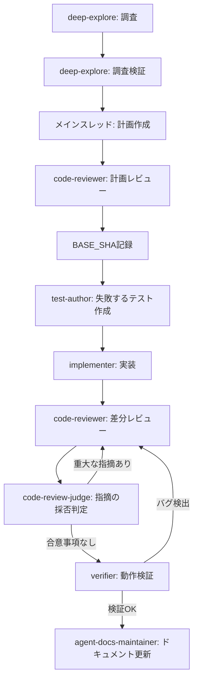
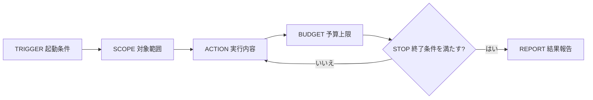
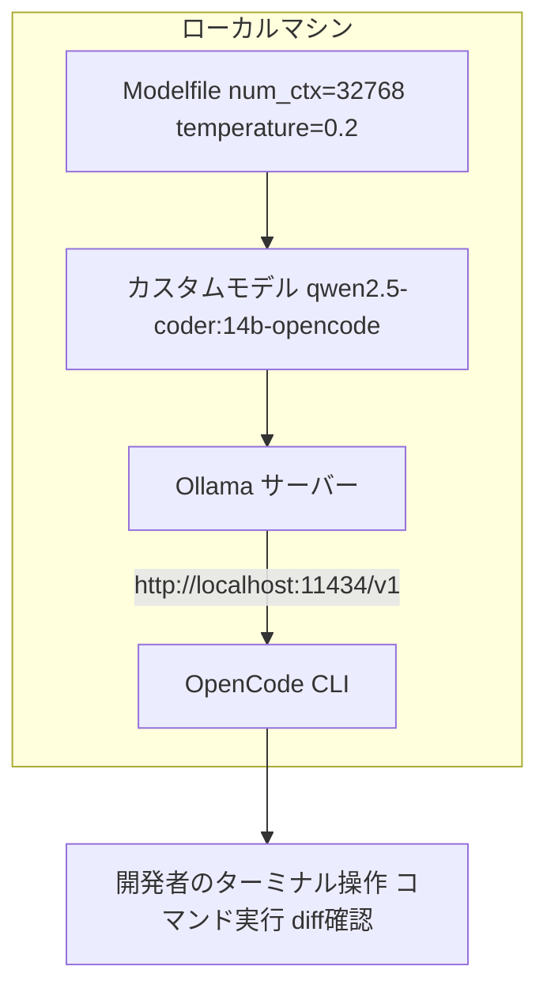

# Daily Briefing 2026-08-06

## 1. サブエージェントでClaude Codeの成果を改善する（原題: Using Subagents to Improve Claude Code Results）

- **URL**: https://software.rajivprab.com/2026/07/13/using-subagents-to-improve-claude-code/
- **公開日**: 2026-07-13
- **著者・媒体**: Rajiv Prab（ブログ「Software the Hard Way」）

### 本文翻訳
著者はClaude Codeの出力品質を上げるため、単一スレッドでの対話ではなく、役割の異なる複数のサブエージェントを組み合わせた13段階の開発ワークフローを構築した。出発点にあるのは「コンテキストウィンドウが満杯に近づくほど性能が著しく低下する」という観察で、これを防ぐために各作業をできるだけ独立したサブエージェントへ委譲し、メインスレッドのコンテキストを圧縮する。

ワークフローは次の順で進む。(1) `deep-explore` サブエージェントがコードベースを読み取り専用で調査し `research-<task>.md` に結果を記録。(2) 別の `deep-explore` 呼び出しで既存レポートをスポットチェックし誤りを補正。(3) メインスレッドが `plan-<task>.md` に実装計画を詳細化。(4) `code-reviewer` が計画をレビューし `review-plan-<task>.md` に指摘を記録。(5) `git rev-parse HEAD` で基準コミット（BASE_SHA）を記録。(6) `test-author` が実装前に失敗するテストをコミット。(7) `implementer` がテストが通るまで実装し、ドキュメントは README のみ更新（CLAUDE.mdは触らない）。(8) `code-reviewer` が `git diff $BASE_SHA HEAD` を検査し `[critical]/[major]/[minor]` タグ付きで `review-<task>-rN.md` に記録。(9) `code-review-judge` が指摘の妥当性を判定し、合意した提案のみ実装。(10) 重大・主要な指摘が実装された場合はステップ8に戻る。(11) `verifier` が実際にアプリを動かし、観測できた事実のみを `verify-<task>-rN.md` に記録。(12) 検出したバグはステップ8からループし直す。(13) 最後に `agent-docs-maintainer` が必要に応じて `CLAUDE.md`/`AGENTS.md` を更新する。

各エージェントは役割が固定されている。`deep-explore` はコードベース調査専任の読み取り専用エージェント、`test-author` はテストのみを書き実装コードには触れない、`implementer` はテスト実装専任、`code-reviewer` は変更差分の検査専任、`code-review-judge` はレビュー指摘の採否判定専任、`verifier` は実行時の動作確認専任である。役割を分けることで、一つのエージェントが「自分の書いたコードを自分でレビューして自分を甘やかす」問題を避けられるとしている。設定ファイルは `~/.claude/CLAUDE.md`（グローバル指示）、`~/.claude/skills/dev-workflow/SKILL.md`（ワークフロー定義）、`~/.claude/agents/*.md`（各サブエージェント定義）、`thoughts/<repo-name>/`（成果物保存先）という構成に整理されている。著者は「このガイドには改善の余地が大いにあり、新しいモデルが出るたびに陳腐化するだろう」と述べ、複数モデルの使い分けや領域別レビュアーの追加、単純な変更向けの簡易パスなど今後の拡張案も挙げている。

### 重要ポイント
- コンテキストウィンドウが埋まるほど性能が劣化するため、各工程を独立したサブエージェントに切り出してメインスレッドを軽量に保つ
- 13段階のワークフロー（調査→計画→レビュー→テスト→実装→レビュー→判定→検証→ドキュメント更新）を固定化し再現性を持たせる
- 役割ごとに専用サブエージェント（deep-explore, test-author, implementer, code-reviewer, code-review-judge, verifier）を用意し「自己採点」を避ける
- テストを実装より先にコミットし、`git diff $BASE_SHA HEAD` を基準にレビューすることで差分の追跡性を確保
- 中間成果物をすべてMarkdownファイルに出力することで監査可能性と再開容易性を高める

### 図解


### 現場での適用方法

**スキル化の例（`~/.claude/skills/dev-workflow/SKILL.md`）**
```yaml
---
name: dev-workflow
description: 調査から実装・レビュー・検証までを専用サブエージェントで分業する多段階開発フロー。機能追加やバグ修正で「テスト→実装→複数ラウンドレビュー→動作検証」を厳密に踏みたい時に使う。
---

# 手順
1. deep-explore サブエージェントでコードベースを調査し
   thoughts/<REPO_NAME>/research-<TASK>.md に記録する
2. 別の deep-explore 呼び出しで内容をスポットチェックし補正する
3. メインスレッドで thoughts/<REPO_NAME>/plan-<TASK>.md に実装計画を書く
4. code-reviewer に計画をレビューさせ review-plan-<TASK>.md に記録する
5. git rev-parse HEAD で BASE_SHA を記録する
6. test-author に失敗するテストのみを書かせてコミットする
7. implementer にテストが通るまで実装させる（README以外のドキュメントは触らない）
8. code-reviewer に git diff $BASE_SHA HEAD をレビューさせ
   [critical]/[major]/[minor] 付きで review-<TASK>-rN.md に記録する
9. code-review-judge に指摘の採否を判定させ、合意分のみ実装する
10. 重大/主要な指摘を実装した場合は手順8に戻る
11. verifier にアプリを実際に動かして検証させ verify-<TASK>-rN.md に記録する
12. バグが見つかれば手順8からやり直す
13. agent-docs-maintainer に CLAUDE.md / AGENTS.md の更新要否を判断させる
```

**CLAUDE.md への追記例**
```markdown
## 開発ワークフロー
非自明な機能追加・バグ修正では dev-workflow スキルを必ず使うこと。
単純なタイポ修正や1行変更には適用しない。
各サブエージェントの成果物は thoughts/<REPO_NAME>/ 配下に残し、
セッションをまたいで参照できるようにする。
```

### 期待効果
コンテキストウィンドウの圧迫を避けつつ、レビュー・検証を独立したエージェントに任せることで、単一エージェントの自己レビューでは見逃しがちな誤りを検出しやすくなる。中間成果物がファイルとして残るため、途中で作業を中断・再開してもコンテキストを再構築しやすい。

### 注意点
13段階すべてを毎回律儀に踏むと小さな変更でもオーバーヘッドが大きい。著者自身も「簡易パスの導入」を今後の改善案として挙げており、変更の複雑度に応じてステップを間引く判断が必要。またサブエージェントごとに追加のAPI呼び出しが発生するため、コスト・レイテンシとのトレードオフを踏まえて導入範囲を決めるべき。

## 2. ループ・エンジニアリング：コーディングエージェントのループ設計法（原題: Loop Engineering: How to Design Coding Agent Loops）

- **URL**: https://explainx.ai/blog/loop-engineering-coding-agents-claude-code-guide-2026
- **公開日**: 2026-06-09
- **著者・媒体**: Yash Thakker（explainx.ai Blog）

### 本文翻訳
記事は2026年6月8日のPeter Steinbergerのツイート「もうコーディングエージェントにプロンプトを打つ時代じゃない。ループを設計する時代だ」を起点に、エージェント運用のパラダイムシフトを整理する。エンジニアの仕事は「コードを書くこと」から「コードを書くシステムを設計すること」へ移行しつつあるという主張だ。

系譜としてReAct（2022）→AutoGPT（2023）→ralphループ（2025）→`/goal`（2026年春）→オーケストレーションループという5段階の進化を提示し、各段階でエージェントの自律度と信頼性が上がってきたと説明する。

中心的なフレームワークが「ループ契約（loop contract）」で、TRIGGER（いつ起動するか：15分ごと、PRコメント時、CI失敗時など）、SCOPE（対象範囲：自分が作成したPRのみ、特定リポジトリのみなど）、ACTION（実行内容：テスト実行、リント修正、レビュー対応など）、BUDGET（上限：1ティックあたり最大3サブエージェント・50kトークンなど）、STOP（終了条件：全PR合格、10イテレーション到達、$5消費のいずれか）、REPORT（報告先：Slack #eng-bots など）の6要素で構成される。

実装は難易度別に3レベルで示される。Level 0は単一PRの監視で、`/loop 10m` にCI失敗時の修正・未解決コメントへの対応・グリーン&承認時の停止を指示する1行コマンドで済む。Level 1は「ralph with guardrails」で、`PROMPT.md` にTODOリストから次の項目を読み実装しテストを実行、失敗が同一エラーで2回続いたら`BLOCKED`と書いて終了、というルールを書き、それを外側のbashループ（最大10回、`grep`でTODO/BLOCKED状態を確認して抜ける）で回す。Level 2はオーケストレーションで、`/loop`＋スキル＋クラウドセッション＋`/goal`を組み合わせ、ループ・ポリシー、ツール表面、コンテキスト、サンドボックス、マルチエージェント経路、可視性、モデル経路という7層フレームワークを参照しながら数時間規模の作業を実現する。

ガードレールは3種。(1) イテレーション上限：bashの`while`ループに`MAX_ITER`を設けて明示的に打ち切る。Claude Codeの`/goal`は自動でターンを追跡するが、独立したralphループは明示的な上限が必須。(2) 進捗停滞検知：同一エラー・空の差分・同一失敗テストがN回連続したら停止する。著者は「ralphのプロンプトはギターのようにチューニングし続ける必要がある」と表現する。(3) トークン／ドル予算：Uberの事例として「一人あたり月1,500ドル」の上限を設けたが、それでも4か月で年間AI予算を使い切った例が紹介され、予算設計の難しさを示す。

事例としては、Geoffrey Huntleyが2025年7月にralphループ（本質はbashループ）でesoteric言語「Cursed」を約297ドルのAPI費用で構築した話、Steve Yeggeが2026年1月に「Gas Town」で20〜30のClaude Codeインスタンスを「Mayor」エージェントが統括し、状態をgitに保存することでクラッシュ耐性を持たせた話、Boris Chernyが`/loop 5m /babysit`（PR自動修正）、`/loop 30m /slack-feedback`（Slackフィードバック対応）、`/loop 5m check the deploy`（デプロイ状態のポーリング）のように区間長を使い分けている例が紹介される。区間を省略すると、ビルド完了待ちのような場面では短く、保留タスクがなければ長くと、Claudeが1分〜1時間の範囲で動的に選ぶという。

アンカーファイルとしては、`VISION.md`（プロダクトの方向性・制約・「完了」の定義を書き、各ティックが毎回意図を再導出しなくて済むようにする）、`CLAUDE.md`/`AGENTS.md`（スタック・コマンド・ティックごとのガードレールを記述。Steinbergerの公開リポジトリ`steipete/agent-scripts`が共有ルール集の例として紹介される）、`PROMPT.md`/`loop.md`（毎イテレーションの入力プロンプト。`loop.md`はビルトインのメンテナンスプロンプトを置き換える用途）が挙げられ、さらにテスト・型チェックのような「ノーと言える仕組み」がエージェントへのフィードバックとして不可欠だとしている。

### 重要ポイント
- ループ契約（TRIGGER/SCOPE/ACTION/BUDGET/STOP/REPORT）の6要素でループの仕様を明文化する
- Level 0（単一コマンド監視）→Level 1（bashループ+ガードレール）→Level 2（オーケストレーション）と段階的に導入できる
- イテレーション上限・進捗停滞検知・トークン/ドル予算の3つのガードレールがないと暴走や予算超過のリスクがある
- アンカーファイル（VISION.md, CLAUDE.md/AGENTS.md, PROMPT.md）で毎ティックの意図再導出コストを下げる
- Uberの「月1,500ドル/人」上限の事例のように、予算設計は具体的な数値を伴って初めて機能する

### 図解


### 現場での適用方法

**スクリプト化の例（Level 1: ralph with guardrails）**
```bash
#!/bin/bash
# run-ralph-loop.sh
set -euo pipefail

REPO_PATH="<REPO_PATH>"
MAX_ITER=10
cd "$REPO_PATH"

for i in $(seq 1 "$MAX_ITER"); do
  echo "=== iteration $i / $MAX_ITER ==="
  cat PROMPT.md | claude -p --dangerously-skip-permissions

  if grep -q "BLOCKED" specs/TODO.md; then
    echo "blocked, stopping loop"
    break
  fi
  if ! grep -q "\[ \]" specs/TODO.md; then
    echo "all tasks done, stopping loop"
    break
  fi
  sleep 10
done
```

```markdown
<!-- PROMPT.md -->
You are an autonomous coding agent working in <REPO_PATH>.

1. Read specs/TODO.md for the next unchecked item.
2. Implement exactly that item, nothing more.
3. Run `npm test`.
4. If tests pass: commit with a descriptive message, mark the item done.
5. If the same test fails twice in a row: write "BLOCKED: <reason>"
   to specs/TODO.md and exit.
6. Exit after handling exactly one item, pass or fail.
```

**CLAUDE.md への追記例**
```markdown
## ループ運用ルール
- 自動ループ実行時は必ず MAX_ITER を明示し、無限ループを禁止する
- 同一エラーが2回連続したら BLOCKED として停止し、人間にエスカレーションする
- 1ティックあたりのトークン予算・サブエージェント数の上限を PROMPT.md に明記する
```

### 期待効果
ループ契約を明文化することで、エージェントに何をどこまで任せるかの合意形成コストが下がる。Boris Chernyの事例のように用途別に区間長（5分・10分・30分）を使い分けることで、監視系タスクとフィードバック対応タスクを同じ仕組みで扱える。Geoffrey Huntleyの事例では約297ドルという具体的な低コストで言語処理系の実装を完走している。

### 注意点
ガードレールを設けないと、Uberの「月1,500ドル/人」上限の事例のように、それでも4か月で年間予算を消費するリスクがある。進捗停滞検知は「同一エラーが何回続いたら停止するか」の閾値調整が必要で、著者も「ギターのチューニングのように継続調整が必要」と述べている。またLevel 2のオーケストレーションは7層のフレームワーク理解が前提になるため、小規模チームがいきなり導入するにはハードルが高い。

## 3. OpenCodeとOllamaで作るローカルAIコーディングエージェント（原題: Local AI coding agent setup with OpenCode and Ollama）

- **URL**: https://stridenote.net/local-ai-coding-agent-tutorial/
- **公開日**: 2026-07-22（更新日）
- **著者・媒体**: Hillary（stridenote.net）

### 本文翻訳
記事はOpenCodeとOllamaを組み合わせ、APIキーやサブスクリプション不要ですべての処理をローカルマシン内で完結させるコーディングエージェントの構築手順を解説する。クラウドサービスに依存しないため、コードやデータが外部に送信されない点をメリットとして強調している。

ハードウェア要件は、7B〜14Bパラメータのモデルには16GBの統合メモリまたはRAM、30B以上またはMoE構成のモデルには24GB以上を推奨。Apple Silicon（M系チップ）はMetal加速により最も快適な体験が得られるとし、著者自身はM4 Pro Mac 48GB環境で14B〜35B範囲のモデルを快適に動かせたと報告している。対応OSはmacOS、Linux、WindowsはWSL2経由。

インストールはOpenCodeを`curl -fsSL https://opencode.ai/install | bash`で導入しPATHを通し、Ollamaは`curl -fsSL https://ollama.com/install.sh | sh`（またはHomebrewで`brew install ollama && brew services start ollama`）で導入する。モデルは`ollama pull qwen2.5-coder:14b`のように取得する。

Ollamaはデフォルトでコンテキストウィンドウが4,096トークンしかなく、エージェント用途には不足するため、カスタムModelfileで拡張する。`FROM qwen2.5-coder:14b` に続けて `PARAMETER num_ctx 32768`（コンテキスト長を32,768トークンに拡張）、`PARAMETER temperature 0.2`（コーディング用途では0.1〜0.3が最適とされる）を指定し、`ollama create qwen2.5-coder:14b-opencode -f Modelfile` でカスタムモデルとして登録する。

OpenCode側の設定は`~/.config/opencode/opencode.json`に、`provider.ollama`としてOpenAI互換のnpmパッケージ（`@ai-sdk/openai-compatible`）を指定し、`baseURL`を`http://localhost:11434/v1`とする。著者は「baseURLの末尾は必ず`/v1`で終わる必要がある」こと、また同じモデルをmain用とsmall_model用の両方に設定しないと「GPUメモリの競合とレイテンシスパイクが発生する」ことを注意点として挙げている。

推奨モデルとしては、Qwen2.5-Coder 14B（「実用に耐える最小構成」、単一ファイル編集向け、16GB）、Qwen2.5-Coder 32B（「現状の品質リーダー」、複数ファイル変更対応、24GB以上）、DeepSeek Coder V2 16B（「ツール呼び出しの規律が強い」、16GB以上）、Gemma 4 26B・MoE構成（「品質とメモリ消費のバランスが良い」、Apple Silicon推奨）を挙げる一方、9B以下のパラメータのモデルは「ツール使用のパターンで苦戦する」、DeepSeek R1やQwQのような推論モデルは「60秒規模の遅延につながる」として避けるよう勧めている。

著者は総括として「1年前はローカルでコーディングエージェントを動かすというと低品質な応答を我慢することを意味したが、2025年末から2026年初にかけて改善が進んだ」とし、実際の使用感は「相変わらずターミナルでコマンドを打ち、diffを読む」という従来のワークフローを維持しつつ、プライバシーとオフライン動作という利点が加わると述べている。

### 重要ポイント
- 7B〜14Bモデルには16GB、30B以上には24GB以上のメモリが必要で、Apple Siliconが最も快適
- Ollamaのデフォルトコンテキスト長4,096トークンはエージェント用途では不足するため、Modelfileで32,768トークンへ拡張する
- コーディング用途ではtemperatureを0.1〜0.3に設定するのが最適
- OpenCode設定の`baseURL`は末尾を`/v1`にする必要があり、main/small_modelを異なるモデルにしないとGPUメモリ競合が起きる
- 9B以下のモデルや推論特化モデル（DeepSeek R1, QwQ等）はツール呼び出しや応答速度の面でエージェント用途に不向き

### 図解


### 現場での適用方法

**運用手順**
```bash
# 1. OpenCode インストール
curl -fsSL https://opencode.ai/install | bash
export PATH="$HOME/.opencode/bin:$PATH"
opencode --version

# 2. Ollama インストール（Linux/macOS）
curl -fsSL https://ollama.com/install.sh | sh
# macOS + Homebrewの場合
# brew install ollama && brew services start ollama

# 3. ベースモデル取得（マシンのメモリに応じて選択）
ollama pull qwen2.5-coder:14b   # 16GB環境向け
# ollama pull qwen2.5-coder:32b # 24GB以上の環境向け

# 4. エージェント用にコンテキスト長を拡張したModelfileを作成
cat > <REPO_PATH>/Modelfile <<'EOF'
FROM qwen2.5-coder:14b
PARAMETER num_ctx 32768
PARAMETER temperature 0.2
EOF
ollama create qwen2.5-coder:14b-opencode -f <REPO_PATH>/Modelfile

# 5. OpenCode をローカルモデルに接続
mkdir -p ~/.config/opencode
cat > ~/.config/opencode/opencode.json <<'EOF'
{
  "$schema": "https://opencode.ai/config.json",
  "model": "ollama/qwen2.5-coder:14b-opencode",
  "provider": {
    "ollama": {
      "npm": "@ai-sdk/openai-compatible",
      "name": "Ollama Local",
      "options": {
        "baseURL": "http://localhost:11434/v1"
      },
      "models": {
        "qwen2.5-coder:14b-opencode": {
          "name": "Qwen 2.5 Coder 14B OpenCode"
        }
      }
    }
  }
}
EOF

# 6. 動作確認
cd <REPO_PATH>
opencode
```

### 期待効果
APIキーやサブスクリプション費用なしにコーディングエージェントを利用でき、コードが外部に送信されないためオフライン環境や機密性の高いリポジトリでも使える。著者のM4 Pro Mac 48GB環境では14B〜35B範囲のモデルが快適に動作したと報告されており、ローカル環境でも実用的な速度・品質が得られる水準に達している。

### 注意点
デフォルト設定のままではコンテキストウィンドウが4,096トークンしかなく、実用的なエージェント動作には不十分なため、必ずModelfileでの拡張が必要。`baseURL`の末尾を`/v1`にし忘れると接続に失敗する。またmain用とsmall_model用に異なるモデルを設定しないとGPUメモリの競合でレイテンシが悪化する。9B以下の小型モデルや推論特化モデルはツール呼び出しの安定性・速度の面で不向きなため、モデル選定を誤ると体感品質が大きく損なわれる。
