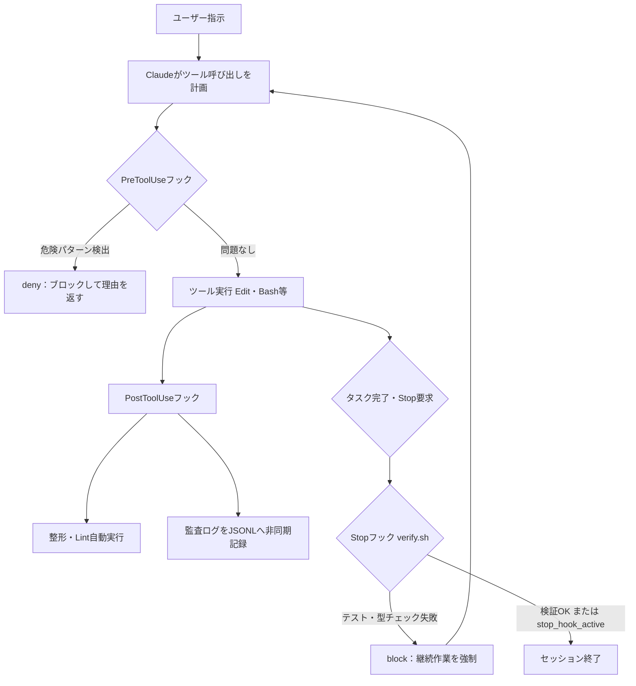
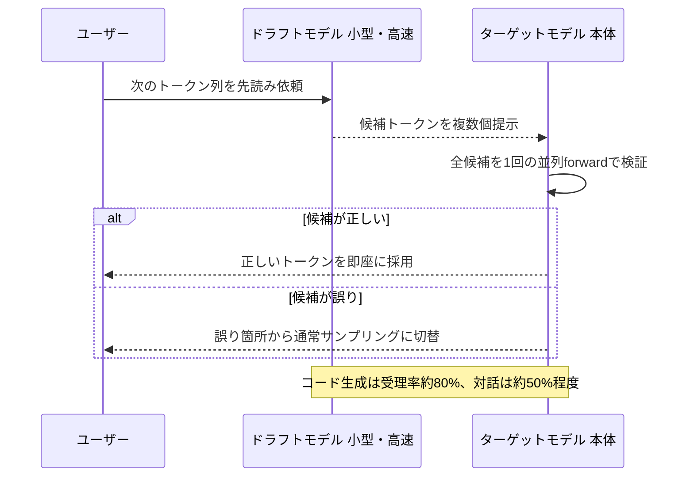
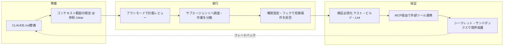

# Daily Briefing 2026-08-07

## 1. Claude Codeフックの実践：Lintから堅牢化されたAIワークフローまで（原題: Claude Code Hooks: From Linting to Hardened AI Workflows）

- **URL**: https://thomas-wiegold.com/blog/claude-code-hooks/
- **公開日**: 2026-05-10
- **著者・媒体**: Thomas Wiegold（個人ブログ）

### 本文翻訳
著者はClaude Codeの「フック（hooks）」機能を、確率的に振る舞うLLMの周囲に決定論的なシェルコマンドの層を築く仕組みとして紹介し、4段階の導入プロセスで解説する。

第1段階は「フォーマットとリント」。ファイル編集直後に走るPostToolUseフックで、TypeScript/JSファイルにoxfmt・oxlintを`--no-install`オプション付きで自動実行する。著者はPrettier/ESLintでも動くとしつつ、Rust製ツールの速度面から乗り換えたと述べる。型チェックのような10〜30秒かかる重い処理は、このフックには含めるべきではないと注意している。

第2段階は「セキュリティとガードレール」。PreToolUseフックでBashコマンドを検査し、`rm -rf`や`main`/`master`へのforce push、`.env`への書き込み、`--no-verify`などの危険なパターンを正規表現で検出して`permissionDecision: "deny"`を返す。ここで重要なのは、このdeny応答は`--dangerously-skip-permissions`実行時でも有効に機能するという点で、著者はこれを「絶対的な安全網」と位置づける。

第3段階は「ロギングと可観測性」。PostToolUseフックで全ツール呼び出しをJSONL形式の監査ログとしてファイルに追記する。`async: true`を指定することでエージェントのループをブロックせずに実行でき、HTTP版に差し替えればSlackやDatadogへの送信も可能になる。

第4段階が最も重要とされる「強制検証」。Claudeがタスクを終えて停止しようとするタイミングで発火するStopフックから`verify.sh`を呼び出し、`tsc --noEmit`とテストスイートを実行する。失敗した場合は`decision: "block"`と失敗内容の末尾50行を返し、Claudeに継続作業を強制する。無限ループを避けるため、`stop_hook_active`フラグをチェックしてすでに検証済みの停止イベントでは即座に終了する実装が必須とされる。

著者はマッチャーの仕様（正規表現メタ文字を含まない場合は文字列一致、`mcp__memory`だけでは`mcp__memory__.*`のような形が必要な場合がある点）や、終了コード0が成功・2がブロックを意味する点、認証情報漏洩を防ぐ`allowedEnvVars`設定にも触れる。また27種類あるライフサイクルイベントのうち実務で頻用するのはPreToolUse・PostToolUse・Stopの3つだと述べ、Codex CLIやOpenCodeとの設計比較でこの記事を締めくくる。

### 重要ポイント
- フックは「決定論的なシェルコマンド」であり、確率的なLLMの判断に頼らず安全性・品質を担保する仕組みとして機能する
- PreToolUseフックの`deny`応答は`--dangerously-skip-permissions`下でも有効な、唯一の絶対的なブロック手段
- Stopフックでの検証強制が最も効果が大きいが、`stop_hook_active`チェックを怠ると無限ループに陥る
- ログ出力は`async: true`でエージェントの動作をブロックしないようにする
- 重い処理（typecheck等）をPostToolUseの編集フックに置くと体感速度が悪化するため避ける

### 図解


### 現場での適用方法

**スクリプト化の例（`.claude/settings.json` と `verify.sh`）**

```json
{
  "hooks": {
    "PreToolUse": [{
      "matcher": "Bash",
      "hooks": [{
        "type": "command",
        "command": "INPUT=$(cat); CMD=$(echo \"$INPUT\" | jq -r '.tool_input.command // empty'); if echo \"$CMD\" | grep -qE '\\brm\\b.*-rf|git\\s+push.*--force.*\\b(main|master)\\b|>\\s*\\.env|--no-verify'; then jq -n --arg r \"Blocked: dangerous command pattern\" '{hookSpecificOutput:{hookEventName:\"PreToolUse\",permissionDecision:\"deny\",permissionDecisionReason:$r}}'; fi; exit 0"
      }]
    }],
    "PostToolUse": [
      {
        "matcher": "Edit|Write",
        "hooks": [{
          "type": "command",
          "command": "jq -r '.tool_input.file_path' | xargs -I{} sh -c 'case \"{}\" in *.ts|*.tsx|*.js|*.jsx) npx --no-install oxfmt \"{}\" && npx --no-install oxlint --fix \"{}\" ;; esac'",
          "timeout": 30
        }]
      },
      {
        "hooks": [{
          "type": "command",
          "command": "jq -c '{ts: now, session: .session_id, tool: .tool_name, input: .tool_input, ok: (.tool_response.is_error | not)}' >> <REPO_PATH>/.claude/audit.jsonl",
          "async": true
        }]
      }
    ],
    "Stop": [{
      "hooks": [{ "type": "command", "command": "<REPO_PATH>/.claude/hooks/verify.sh", "timeout": 180 }]
    }]
  }
}
```

```bash
#!/bin/bash
# <REPO_PATH>/.claude/hooks/verify.sh
INPUT=$(cat)
[ "$(echo "$INPUT" | jq -r '.stop_hook_active')" = "true" ] && exit 0

cd "$CLAUDE_PROJECT_DIR" || exit 0
OUTPUT=$(npx tsc --noEmit 2>&1 && npx vitest run --reporter=basic --no-watch 2>&1)
if [ $? -ne 0 ]; then
  jq -n --arg out "$(echo "$OUTPUT" | tail -50)" \
    '{decision:"block",reason:("Verification failed:\n" + $out)}'
fi
exit 0
```

### 期待効果
著者によれば、この4段構成によりフォーマット崩れの手戻りが消え、危険コマンドの実行事故を構造的に防止でき、全ツール呼び出しの監査証跡が残る。特にStopフックによる検証強制は「テストが通るまでエージェントを解放しない」ため、レビュー前に明らかな壊れたコードが混入する確率を大きく下げられるとしている。

### 注意点
- `jq`・`npx`等のCLIが実行環境にインストールされている必要がある
- `stop_hook_active`チェックを省略すると、検証失敗→Stopフック再発火→再検証……の無限ループに陥る
- 重い処理をPostToolUseの編集フックに置くとレイテンシが悪化するため、Stopフックなど発火頻度の低いイベントに寄せる設計が必要
- 危険コマンド検出は正規表現ベースであり、パターンに一致しない新たな危険操作までは防げない

---

## 2. ローカルLLMでついに実用段階に入ったSpeculative Decoding（原題: Speculative Decoding Is Finally Useful for Local LLMs）

- **URL**: https://blog.bymar.co/posts/speculative-decoding-local-llms-2026/
- **公開日**: 2026-05-07
- **著者・媒体**: Marco（個人ブログ blog.bymar.co）

### 本文翻訳
著者はまず、speculative decodingの目的を明確にする。「正しく実装されたspeculative decodingは、モデルを賢くするのではなく、target modelの出力分布を保ったまま遅延を減らす」技術であり、品質を犠牲にする近似手法ではないと強調する。仕組みは3段階：安価な方法で複数トークンを先読みする「ドラフト」、本体モデルが並列で妥当性を検証する「検証」、正しい予測だけを採用して継続する「コミット」である。

記事は現在ローカル環境で使える3つの実装方式を比較する。1つ目は追加モデルを必要としない「n-gram推測」で、コードや構造化テキストのように同じトークン列が繰り返される場面に強く、llama.cppに低リスクの実装としてマージ済みである。2つ目はQwen3.6などのモデルに組み込まれた「MTP（Multi-Token Prediction）」で、vLLMおよびllama.cppでの対応が進んでおり、実ユーザーからは約2倍の速度向上が報告されている。3つ目は長文脈でのメモリ課題に対応する「TurboQuant」というKVキャッシュ圧縮技術で、vLLM上で利用可能だが、著者は「パワーユーザー向け」であり、十分にテストされていない環境では「トークンループ」のような不具合が報告されていると警告する。

実測値として、Qwen3.6-27B+MTPをRTX 4090上で動かした場合、262kコンテキストで80〜87 tokens/秒、ドラフト受理率は73%。BeeLlama.cppというフォークをRTX 3090上でシンプルなコード生成に使うと最大130 tokens/秒、2.3〜3.7倍の高速化が確認されている。Radeon 7900 XTX上でVulkan+MTPを使う構成では約81 tokens/秒が報告されている。

著者は導入パスを3つに整理する。低リスクに始めたいなら「llama.cpp + n-gram推測」を既知のモデルで、高い期待値を狙うなら「Qwen3.6-27B + MTP」をvLLMまたはllama.cpp経由で、さらに先端を追うならIndras-MirrorやBeeLlama.cppといったフォーク版を勧める。AMD環境ではVulkan（速度重視）かROCm/HIP（TurboQuantの実験用）を使い分けるとよいとしている。

最後に著者は、tokens per secondだけを見て速いと判断するのは危険だと釘を刺す。prefillとdecodeの速度を分離して計測すること、ドラフト受理率、VRAM使用量、長文脈での性能劣化、ツール呼び出しの有効性、JSON・文法出力の安定性、一時的なVRAMスパイクまで含めて総合的に評価すべきだと述べている。

### 重要ポイント
- speculative decodingは出力品質を保ったまま推論速度のみを向上させる技術であり、量子化のような精度トレードオフとは性質が異なる
- n-gram推測は追加モデル不要で低リスク、MTPは組み込みモデルで高い実効速度（実測2倍前後）、TurboQuantは長文脈のメモリ課題向けだが不安定さが残る
- コード生成タスクはドラフト受理率が高く（記事では対話タスクの約50%に対しコードは約80%）、speculative decodingの恩恵を受けやすい
- 評価はtokens/secondの単一指標だけでなく、ドラフト受理率・VRAM・文脈長劣化・ツール呼び出し安定性まで含めて行うべき
- MTPとTurboQuantの併用は現時点でパワーユーザー向けであり、本番投入前には十分な検証が必要

### 図解


### 現場での適用方法

**運用手順（低リスク経路から段階導入）**

```bash
# 1. 既存モデルでn-gram推測を試す（追加モデル不要・最も低リスク）
llama-server -m <MODEL_PATH>/qwen3-coder.gguf \
  --draft-min 1 --draft-max 8 \  # n-gram推測のドラフト長レンジ（環境により要調整）
  --port 8080

# 2. 高期待値経路：MTP対応モデルに切り替え、受理率とtok/sを計測
llama-server -m <MODEL_PATH>/qwen3.6-27b-mtp.gguf \
  --spec-type mtp \
  --port 8080

# 3. 効果測定：prefill / decode / 受理率を分離してログ出力
curl -s http://localhost:8080/metrics | grep -E "prefill|decode|accept_rate"
```

- `<MODEL_PATH>` は実際のGGUFモデル格納先に置き換える
- 本番投入前に、通常運用と同じプロンプト・ツール呼び出しを含むワークロードで「tok/s」だけでなく受理率とVRAM使用量を記録し、既存構成と比較してから切り替える

### 期待効果
記事内の実測では、RTX 3090上のコード生成ワークロードで2.3〜3.7倍、RTX 4090+MTP構成で80〜87 tokens/秒という具体的な数値が報告されており、特にコード生成のようにトークン列の予測可能性が高いタスクでローカルLLMの体感速度を大きく改善できる可能性がある。

### 注意点
- MTPやTurboQuantの対応状況はモデル・推論エンジンのバージョンに強く依存し、記事執筆時点でも実装が進行中の機能を含む
- TurboQuantとMTPの併用は「トークンループ」等の不具合報告があり、本番環境への安易な投入は避けるべき
- 速度向上効果はタスクの予測可能性（ドラフト受理率）に依存するため、コード生成以外の自由度が高い対話タスクでは効果が限定的になりうる
- 記事は具体的なインストール手順までは提供しておらず、各自の環境でのベンチマークが前提とされている

---

## 3. Claude Codeベストプラクティス：痛い目を見て学んだ8つのルール（原題: Claude Code Best Practices: 8 Rules I Learned the Hard Way）

- **URL**: https://www.iwoszapar.com/p/claude-code-best-practices
- **公開日**: 2026-06-19（2026-08-06 更新）
- **著者・媒体**: Iwo Szapar（個人ブログ）

### 本文翻訳
著者はClaude Codeを日常的に使う中で痛い経験を経て学んだ8つのルールを、それぞれ「何が失敗するか」とセットで解説する。

1つ目は`CLAUDE.md`の整備。毎セッション同じプロジェクト説明を繰り返す無駄を防ぐため、コマンド・コード規約・アーキテクチャ決定を約200行以内にまとめる。`/init`で自動生成した後、必ず人手で精査する。プロジェクト共通の`~/.claude/CLAUDE.md`と個人用の`./CLAUDE.local.md`を使い分け、セッションの学習内容を自動メモとして次回に引き継ぐ運用を勧める。

2つ目はコンテキスト範囲の制限。リポジトリ全体を一度に投げ込むと文脈が枯渇し性能が落ちるため、`@path/to/file`のようにファイルを明示的に参照し、「authをクリーンアップして」ではなく「validateEmail関数を書き、テストケース[一覧]で実行し失敗を修正して」という具体性を持たせる。関連性のないタスクに移る際は`/clear`で文脈汚染を断つ。

3つ目はプランモードの活用。Shift+Tabで編集不可の読み取り専用サンドボックスに切り替え、「探索→計画→実装」の3段階を踏む。複数ファイルにまたがる変更で特に効果があり、誤字修正のような軽微な作業では省略してよいとしている。

4つ目はサブエージェントへの作業分散。大規模な調査は読み取り専用のExploreエージェントや`.claude/agents/`に定義した専用エージェントに委譲し、メインセッションの文脈汚染を防ぐ。バッチ処理には`claude -p "migrate $file..." --allowedTools "Edit,Bash(git commit *)"`のようなループを使う例を挙げている。

5つ目は権限管理。`/permissions`で`npm run lint`のような信頼済みコマンドをホワイトリスト化し、危険操作は明示的に拒否する。`--allowedTools`フラグやPreToolUse/PostToolUseフックと組み合わせ、「モデルに忘れられては困るルールは、助言ではなくコードにすべきだ」と述べる。

6つ目は検証の必須化。テスト・ビルド・リンターの合否をエージェントが読める形で組み込み、プロンプトで「実装後にテストを実行し失敗を修正せよ」と明記する。Stopフックで検証完了まで停止させる、または`/code-review`で別エージェントに差分を確認させる方法も紹介する。

7つ目はMCPサーバー経由での外部ツール接続。Issueトラッカーやデータベース、Figmaなどに直接アクセスし、手作業でのデータ転記をなくす。ただし外部コンテンツの取得はプロンプトインジェクションのリスクを伴うため、信頼できるサーバーから始めるべきとしている。

8つ目はシークレット管理。APIキーを会話に貼り付けない、`.env`を`.gitignore`に入れる、`.env`読み込みやSSH鍵アクセスを`/permissions`で拒否する、本番認証情報がある環境では`curl`のような外部通信コマンドも制限する。OSレベルのサンドボックスでファイルシステムとネットワークの境界を物理的に区切ることも推奨している。

### 重要ポイント
- CLAUDE.mdの整備は「最もレバレッジの高い」投資であり、200行以内・具体的な記述を保つ
- コンテキストは「全部渡す」のではなく`@`参照と`/clear`で意図的に絞る
- 「モデルに忘れられては困るルールはコードにする」＝助言ではなくフック・権限設定で強制する
- 検証（テスト・ビルド・リント）を必須プロセスとして組み込み、プラシーボ的な「動いてそう」を排除する
- シークレットとネットワーク境界はOSレベルのサンドボックスまで含めて物理的に制約する

### 図解


### 現場での適用方法

**CLAUDE.md への追記例**

```markdown
## 作業ルール（Claude Code運用）
- 実装前に必ずプランモード（Shift+Tab）で計画を提示し、承認を得てから編集すること
- ファイル参照は `@path/to/file` を使い、リポジトリ全体のダンプを要求しないこと
- 無関係なタスクに移る前に `/clear` を実行し、文脈汚染を避けること
- 実装完了後は必ずテスト・型チェック・リントを実行し、失敗を修正してから完了報告すること
- 大規模調査（複数ファイル横断の探索等）は専用のExploreサブエージェントに委譲すること
```

**運用手順（権限とフックの最小導入）**

```bash
# 1. 信頼済みコマンドをホワイトリスト登録
/permissions add "Bash(npm run lint)"
/permissions add "Bash(npm test)"

# 2. 危険操作を明示的に拒否
/permissions deny "Bash(rm -rf *)"
/permissions deny "Read(./.env)"
/permissions deny "Read(~/.ssh/**)"

# 3. .gitignore に機密ファイルを確実に追加
echo ".env" >> <REPO_PATH>/.gitignore
echo "*.pem" >> <REPO_PATH>/.gitignore
```

### 期待効果
著者の実体験ベースでは、CLAUDE.mdとプランモードの徹底により誤った前提のまま実装が進むリスクが下がり、サブエージェント分離と`/clear`の活用でメインセッションの文脈汚染による性能劣化を回避できるとしている。権限設定とStopフックの組み合わせにより、危険操作の実行事故とテスト未実施のままのリリースを構造的に防止できる。

### 注意点
- ルールを「助言」としてCLAUDE.mdに書くだけでは遵守されないことがあり、強制力が必要な項目はフックや`/permissions`で機械的に縛る必要がある
- MCPサーバー経由の外部コンテンツ取得はプロンプトインジェクションのリスクを伴うため、信頼できる提供元から段階的に導入すべき
- サブエージェントやプランモードの多用はタスクによってはオーバーヘッドになりうるため、軽微な修正では簡略化してよい
- OSレベルサンドボックスの構築は環境依存性が高く、記事はあくまで方向性の提示にとどまり具体的なサンドボックス構成手順までは示していない
