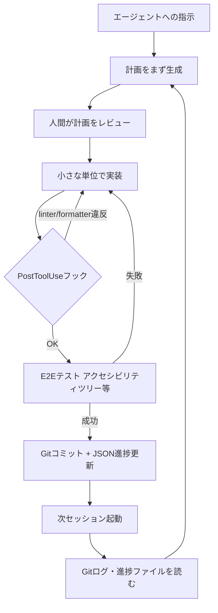
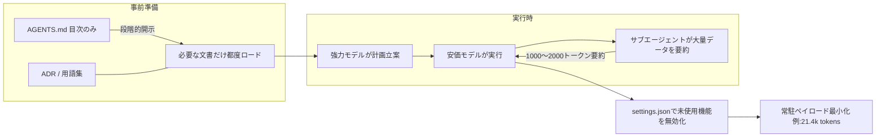
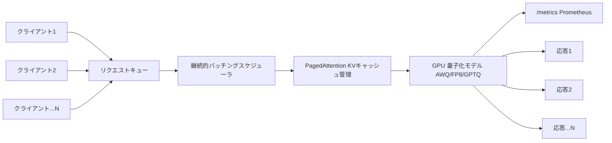

# Daily Briefing 2026-08-08

## 1. Claude Code／Codexユーザーのためのハーネスエンジニアリング実践ガイド（原題: Harness Engineering Best Practices for Claude Code/Codex Users, Explained Plainly）

- **URL**: https://nyosegawa.com/en/posts/harness-engineering-best-practices-2026/
- **公開日**: 2026-03-09
- **著者・媒体**: Sakasegawa-chan（nyosegawa.com、個人ブログ）

### 本文翻訳
著者はまず、コーディングエージェントの成果を左右するのはモデルそのものよりも「ハーネス」だと述べる。同一タスクでハーネスを差し替えると成績が22ポイント変動する一方、モデルを差し替えた場合の変動はわずか1ポイントにとどまるという観測を根拠に、「良いモデルより良い環境を作れ」という主張を展開する。

その上で7つの原則を提示する。第一に「リポジトリの衛生管理」。リポジトリには実行可能な成果物（コード・テスト・設定）と不変のADR（アーキテクチャ決定記録）だけを置き、腐りやすい説明文書は最小限にする。「テストは実行すれば嘘をつかないが、文書は必ず陳腐化する」という考え方が根底にある。

第二に「決定論的ツールによる品質担保」。エージェントへの指示ではなくlinter・formatter・型チェッカーに頼る。フィードバックの速度が重要で、PostToolUse（ミリ秒単位）＞pre-commit（秒単位）＞CI（分単位）＞人間レビューの順で早い段階ほど有効だとし、TypeScriptにはOxlint＋Biome（ESLintの50〜100倍高速）、PythonにはRuff、Goにはgolangci-lint、Rustにはpedanticモードのclippyを推奨する。

第三に「AGENTS.md／CLAUDE.mdはポインタとして設計する」。指示ファイルは50行未満に抑えるべきで、150個を超える指示があるとプライマシーバイアスにより遵守率が大きく落ちるとする。実装の詳細を書き込むのではなく、ADRやlinter設定、テストコマンドへの参照だけを置く。

第四に「計画とコーディングの分離」。着手前にエージェントへ計画を作らせ人間がレビューする。大きなゴールは小さな構成要素に分解し、完了判定はコンパイル通過ではなくE2Eテストで行う。

第五に「アプリ種別ごとのE2E戦略」。Webにはアクセシビリティツリー（Playwright CLIやagent-browser、MCP経由よりも好ましい）、モバイルにはXcodeBuildMCPやmobile-mcp、CLIにはbats-core、APIにはHurl、インフラにはterraform testやconftestを充てる。スクリーンショットより構造化テキストの方が決定論的に検証できるとする。

第六に「セッションをまたぐ状態管理」。起動時ルーチン（作業ディレクトリ確認、Gitログと進捗ファイルの読み込み、次タスク選定、動作確認）を標準化し、Gitコミットをセッション間の橋渡し、進捗記録にはMarkdownではなくJSONを使う。

第七に「Codex／Claude Codeそれぞれの強みの使い分け」。Codexは並列非同期実行に強く、Claude CodeはHooksが全ツールに対応し充実している。両者を「Claude Codeで計画・品質管理、Codexで並列実行」というハイブリッド運用にすることを勧める。最後に、プロンプトだけに頼る／説明文書を溜め込む／1000行超のAGENTS.mdを作るといったアンチパターンと、週1でのMVH（最小限のハーネス）構築から3か月以降の高度なフィードバックループ構築までのロードマップを示して締めくくる。

### 重要ポイント
- ハーネス差し替えは22ポイント、モデル差し替えは1ポイントの性能差しか生まない、という観測が全体の前提
- フィードバックはPostToolUse（ミリ秒）→pre-commit（秒）→CI（分）→人間レビューの順で早いほど効く
- AGENTS.md／CLAUDE.mdは50行未満・実装への「ポインタ」に留め、150指示を超えると遵守率が落ちる
- E2Eテストはスクリーンショットよりアクセシビリティツリー（構造化テキスト）を優先する
- ハーネスへの投資は複利的に効く。1つのlinterルール・テスト・Hook設定が以後すべてのセッションで同じミスを防ぐ

### 図解


### 現場での適用方法

**CLAUDE.md への追記例（ポインタ設計・50行未満を意識）**
```markdown
## Repository Rules
- 実装の説明はここに書かない。詳細は `docs/adr/` の該当ADRを参照すること
- 品質チェックは PostToolUse Hook（`.claude/settings.json`）が自動実行する。手動でlintを回す必要はない
- E2Eテストは `bin/e2e-web.sh`（アクセシビリティツリー検証）を使う。スクリーンショット比較は使わない
- タスク完了の定義：コンパイル通過ではなく `bin/e2e-web.sh` が緑になること
- 新しいミスを見つけたら、AGENTS.mdに文章を足すのではなく linter ルールかテストを1つ追加すること
```

**スクリプト化の例（`.claude/settings.json` の PostToolUse フック）**
```json
{
  "hooks": {
    "PostToolUse": [{
      "matcher": "Edit|Write",
      "hooks": [{
        "type": "command",
        "command": "F=$(cat | jq -r '.tool_input.file_path'); case \"$F\" in *.ts|*.tsx) npx --no-install biome format --write \"$F\" && npx --no-install oxlint --fix \"$F\" ;; *.py) ruff check --fix \"$F\" ;; *.go) golangci-lint run --fix \"$F\" ;; esac",
        "timeout": 15
      }]
    }]
  }
}
```

**運用手順（Minimum Viable Harness 導入ステップ）**
1. `CLAUDE.md` を50行以内で作成し、実装詳細ではなくADR・テストコマンドへの参照だけを書く
2. 上記フックを `.claude/settings.json` に追加し、`git commit` 前に自動整形が走ることを確認する
3. 最初のE2Eテスト（Web案件なら `bin/e2e-web.sh`）を1本作り、「タスク完了＝このテストが緑」と定義する
4. 以後、エージェントが同じミスを2回繰り返したら、都度linterルールかテストを1件追加する（プロンプトへの追記はしない）

### 期待効果
著者の観測ベースでは、ハーネスの質はモデルの質より大きく成果に効き（22ポイント対1ポイント）、フィードバックをPostToolUse段階（ミリ秒）に前倒しするほど手戻りコストが下がる。ハーネスへの投資は複利的に蓄積し、セッションを重ねるごとに同種のミスが再発しなくなる。

### 注意点
- AGENTS.md／CLAUDE.mdを分厚くする対症療法は逆効果。150指示を超えると遵守率がむしろ落ちる
- Codex側のHooksは2026年3月時点でBashのみ対応など、プラットフォームごとの機能差を踏まえて使い分ける必要がある
- MVHロードマップは1週目→1か月→3か月と段階的な投資を前提としており、一度に全て導入しようとすると運用が破綻しやすい

---

## 2. コーディングエージェントのトークンを削減する11のコンテキストエンジニアリング術（原題: 11 Context Engineering Tips to Cut Coding Agent Tokens）

- **URL**: https://www.decodingai.com/p/11-context-engineering-tips-cut-coding-agent-tokens
- **公開日**: 2026-08-04
- **著者・媒体**: Paul Iusztin（Decoding AI, Substack）

### 本文翻訳
著者は2026年2月にAnthropicの200ドルプランを契約して以来、トークン予算を使い切ってしまう失敗を重ねる中で編み出した11個のコンテキスト節約術を紹介する。

1つ目は「段階的開示」。AGENTS.mdやWiki、Obsidianなどに階層構造の目次を作り、必要なファイルだけを都度読ませる。Anthropicの言うとおり、コンテキストウィンドウ内のすべてのトークンはモデルの注意資源を奪い合っているため、丸ごと読み込ませない設計が要になる。2つ目は「計画は高コストに、実行は低コストに」。最も強力なモデルに「既知の既知」「既知の未知」「未知の既知」「未知の未知」の4象限で詳細な計画を立てさせ、その計画を安価なモデルに渡して実行させる。3つ目は新規開発向けの「LLM Wiki」で、大量の文書をプロンプトに直接詰め込む代わりに、ファイルと参照だけの軽量なコンテキスト層を構築する。

4つ目は「読み込みをサブエージェントに任せる」。HaikuやSonnetのような安価なモデルに大量のデータを要約させ、数万トークンを消費させた末に1000〜2000トークンの要約だけをメインエージェントへ返させる。5つ目はADR（アーキテクチャ決定記録）と用語集の整備で、これらは将来の機能開発のための永続的なコンテキストとして機能する。6つ目は「コードベースのグラフインデックス化を避ける」。ドキュメントは常にコードからドリフトし同期コストがかかるため、ADRと用語集をコードベースと直交させたまま保つ方が良いとする。

7つ目は「モジュール構造そのものをグラフとして使う」。インターフェースが明確なモジュール設計は、それ自体が情報構造として機能する。判定基準は「このモジュールを別プロジェクトに貼り付けてそのまま動くか」。8つ目はシステムプロンプトの不要機能を削ぎ落とすことで、著者自身の設定では常駐ペイロードが21.4kトークン、MCPツール46個を追加コストゼロで使えている。9つ目は自動メモリ機能のオフで、AGENTS.mdやADRなど自分で管理する成果物からセッション間の継続性を得ている場合には不要とする。10個目はverboseな出力を最小限の言い回しに圧縮する「Caveman」プラグインの活用。11個目はAGENTS.mdを小さく保つ原則として、追加より削除を優先すること、説明・ドキュメント・コードとも必要最小限の語数にすること、新しいルールには「200トークンのチャンクサイズ」のような具体例を添えることを挙げる。

### 重要ポイント
- コンテキストウィンドウ内の全トークンはモデルの注意資源を奪い合うため、「読ませない」設計が最優先
- 高コストモデルで計画、安価モデルで実行という役割分担でコストとトークンを両方削減できる
- サブエージェントに読み込みを任せ、数万トークンを消費させて1000〜2000トークンの要約だけを受け取る
- コードのグラフインデックス化はドリフトしやすく、ADR・用語集をコードと直交させる方が持続可能
- 著者の設定では常駐システムプロンプトが21.4kトークン、MCPツール46個を追加コストなしで維持できている

### 図解


### 現場での適用方法

**CLAUDE.md への追記例（AGENTS.md縮小ルール）**
```markdown
## Context Budget Rules
- AGENTS.md は常に「追加より削除」。新ルールを足すときは既存の冗長な記述を1つ削ること
- 大きなログ・ドキュメント・過去の調査結果は直接貼らず、サブエージェントに要約させて1000〜2000トークンで受け取ること
- 新しいルールには必ず具体例を添える（悪い例："適切なチャンクサイズにする" → 良い例："チャンクサイズは200トークンにする"）
- コードのグラフインデックスは作らない。ADR・用語集をコードベースと分離して管理する
```

**スキル化の例（`.claude/skills/summarize-and-report/SKILL.md`）**
```markdown
---
name: summarize-and-report
description: 大きなログ・ドキュメント・検索結果を読み込み、1000〜2000トークンの要約のみをメインエージェントに返す。ファイル読み込みや大量出力を伴う調査タスクで使用する。
---

## 手順
1. 対象ファイル・出力を全文読み込む（このサブエージェントのコンテキスト内で消費し、メインには返さない）
2. 目的に関連する事実・数値・手順のみを抽出する
3. 1000〜2000トークン以内の箇条書き要約としてメインエージェントに返す
4. 元データへの参照（ファイルパス・行番号）は残すが、全文は返さない
```

**運用手順（settings.jsonでの不要機能トリム）**
1. `claude config` または `.claude/settings.json` で使っていないビルトイン機能・MCPツールを一覧化する
2. 実際に呼び出し頻度が低いツール定義を無効化し、常駐システムプロンプトのトークン数を計測する（`/context` 等で確認）
3. 自動メモリ機能が有効な場合、AGENTS.md/ADRで継続性を担保できているなら無効化する
4. 定期的に常駐ペイロードのトークン数を記録し、増加傾向がないか監視する

### 期待効果
著者自身の運用では、常駐システムプロンプトを21.4kトークンまで削減しつつMCPツール46個を維持できており、サブエージェントによる要約委譲で「数万トークン消費→1000〜2000トークン受領」という圧縮を実現している。段階的開示と役割分担（計画は高コスト・実行は低コスト）により、同じ作業量でもAPIコストとコンテキスト消費の両方を抑えられる。

### 注意点
- 自動メモリを無効化する判断は、AGENTS.md/ADRなど代替の継続性メカニズムが整っていることが前提
- サブエージェントへの委譲は要約の粒度によって情報が失われるリスクがあるため、重要な数値や手順は明示的に保持させる必要がある
- 「Caveman」的な出力圧縮は可読性とのトレードオフがあり、チームでの共有ドキュメントには不向きな場合がある

---

## 3. vLLM完全セットアップガイド：ローカルLLMのインストール・チューニング・サービング（原題: vLLM Complete Setup Guide for Local LLMs (2026): Install, Tune, Serve）

- **URL**: https://localaimaster.com/blog/vllm-complete-setup-guide
- **公開日**: 2026-05-01
- **著者・媒体**: LocalAimaster Research Team

### 本文翻訳
記事はvLLMを「UC Berkeley発のオープンソース推論・サービングエンジン」と紹介し、複数ユーザーが同時アクセスするワークロードにおいてOllama比で5〜20倍のアグリゲートスループットを実現すると位置づける。最小構成はPython 3.10〜3.12の仮想環境上に`pip install vllm`し、`vllm serve meta-llama/Llama-3.1-8B-Instruct --port 8000`で起動するだけとシンプルだ。

ハードウェア要件はCompute Capability 7.0以上のNVIDIA GPU（V100/T4が下限、Ampere以降推奨）、8BモデルをBF16で動かす場合VRAM 18GB、AWQ-INT4量子化なら8GBで足りるとする。ドライバはバージョン535以上、最適動作には550以上が必要で、OSはLinux（Ubuntu 22.04以降）が基本、WindowsはWSL2経由、macOSは非対応と明記する。

技術的な中核として「PagedAttention」（KVキャッシュを固定サイズブロックで管理し、従来スケジューラで起きがちなメモリ断片化を解消する）と「継続的バッチング」（デコーディングの各イテレーションで新規リクエストをスケジューリングし、GPUのアイドル時間を防ぐ）を挙げる。ベンチマークでは、RTX 4090上でLlama 3.1 8B（AWQ量子化）を64並列リクエストで動かした場合、アグリゲートスループット2,200トークン/秒を達成したと報告する。

デプロイ方式はDockerの単一コンテナ、docker-compose構成、Kubernetesのベアデプロイ、KServeのInferenceService連携までカバーし、いずれの本番例でもGPUリソース要求とヘルスチェックプローブを含めるとする。量子化戦略としては、汎用性が高く対応モデルも多い「AWQ-INT4」、Ada/Blackwell世代GPUで最高性能（BF16比でスループット倍増）を出す「FP8」、やや旧式だが依然サポートされる「GPTQ-INT4」の3方式を比較する。

高度な機能としてプレフィックスキャッシング（繰り返し使われるプロンプト部分の再利用）、チャンク化プリフィル（混在ワークロードのスケジューリング最適化）、小型ドラフトモデルによる投機的デコーディング、ツール呼び出しと構造化JSON出力対応、複数GPU・複数ノードにまたがる分散推論を挙げる。可観測性については、`/metrics`エンドポイントでリクエストキュー長・KVキャッシュ使用率・初回トークンまでの時間（TTFT）・トークンごとのレイテンシをPrometheus形式で公開し、`--otlp-traces-endpoint`によるOpenTelemetryトレーシングにも対応するとする。最後に、Ollama（同時1〜4ユーザー、起動60秒）・vLLM（同時256ユーザー以上、起動5分）・TensorRT-LLM（同時128ユーザー以上、起動30〜60分）を比較する表を示し、「同時アクセスが4ユーザーを超えるならvLLMへ切り替えるべき」という指針で締めくくる。

### 重要ポイント
- vLLMはOllama比で5〜20倍のアグリゲートスループットを、複数ユーザー同時アクセス時に発揮する
- PagedAttention（メモリ断片化解消）と継続的バッチング（GPUアイドル時間の削減）がスループットの核
- RTX 4090・Llama 3.1 8B・AWQ量子化・64並列で2,200トークン/秒を達成したベンチマークが示されている
- AWQ-INT4／FP8／GPTQ-INT4の3量子化方式にはそれぞれ用途とGPU世代の向き不向きがある
- 「同時アクセス4ユーザーを超えたらvLLMへ切り替える」という定量的な判断基準が提示されている

### 図解


### 現場での適用方法

**スクリプト化の例（`serve-vllm.sh`）**
```bash
#!/usr/bin/env bash
set -euo pipefail

python3.11 -m venv <VENV_PATH>
source <VENV_PATH>/bin/activate
pip install vllm

vllm serve <HF_MODEL_ID> \
  --host 0.0.0.0 --port 8000 \
  --quantization awq \
  --gpu-memory-utilization 0.90 \
  --max-model-len 8192 \
  --enable-prefix-caching \
  --enable-chunked-prefill \
  --max-num-seqs 256 \
  --otlp-traces-endpoint <OTLP_ENDPOINT>
```

**運用手順（社内ローカルLLMエンドポイントの導入）**
1. GPUのCompute Capability・VRAM・ドライババージョン（535以上）を確認し、要件を満たすホストを用意する
2. 上記スクリプトでvLLMを起動し、`curl http://localhost:8000/v1/chat/completions` でOpenAI互換APIが応答することを確認する
3. `/metrics` エンドポイントをPrometheusに登録し、キュー長・KVキャッシュ使用率・TTFTを監視ダッシュボード化する
4. 同時アクセスユーザー数が4を超えた時点で、Ollamaベースの検証環境からこのvLLM構成へ切り替える運用ルールを決めておく
5. 本番投入時はDocker/Kubernetesマニフェストにヘルスチェックプローブ（`/health`相当）とGPUリソース要求を明記する

### 期待効果
記事のベンチマークでは、RTX 4090・AWQ量子化のLlama 3.1 8Bで64並列リクエスト時にアグリゲート2,200トークン/秒を達成しており、Ollama比で5〜20倍のスループット向上が見込めるとされる。プレフィックスキャッシングやチャンク化プリフィルにより、混在ワークロードでもGPUアイドル時間を抑えられる。

### 注意点
- macOSは非対応であり、Apple Silicon環境でのローカル検証にはOllama等の代替が必要
- AWQ-INT4は汎用的だが、FP8など量子化方式ごとに対応GPU世代（Ada/Blackwell等）が異なるため事前確認が必要
- 同時アクセスが少ない個人利用やプロトタイピングでは、vLLMの起動・チューニングコスト（5分〜、パラメータ調整含む）がOllama（60秒）に対して過剰になる場合がある
