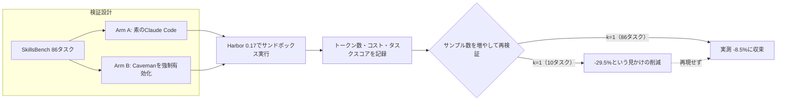
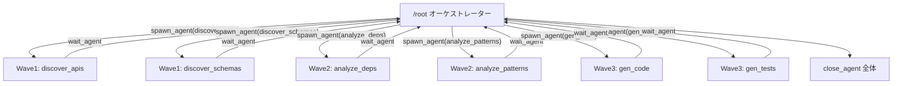
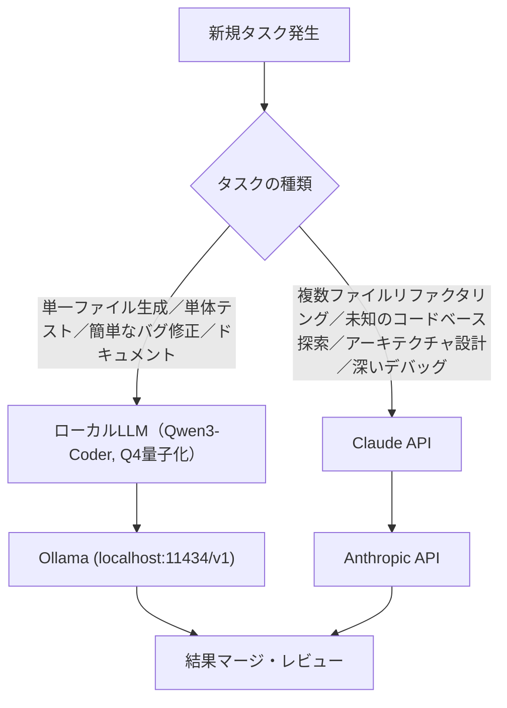

# Daily Briefing 2026-08-09

## 1. 「原始人語」でトークンは65%削減できるか？ JetBrainsが検証（原題: Speaking to AI Agents like Cavemen Saves 65% of Tokens. We Test.）

- **URL**: https://blog.jetbrains.com/ai/2026/07/speak-to-ai-agents-like-cavemen-tosave-tokens/
- **公開日**: 2026-07（詳細日不明、直近数週間以内）
- **著者・媒体**: Denis Shiryaev（JetBrains AI Blog）

### 本文翻訳
JetBrainsのDenis Shiryaevは、AIエージェントに「原始人のような簡潔な話し方」をさせることでトークン消費を65%削減できるとうたうスキル「Caveman」の宣伝文句を検証した。このスキル自身の説明文は "Skill make agent talk like caveman. Why use many token when few do trick."（原始人のように話させるスキル。少ない単語で済むのに多くのトークンを使う理由がある？）というもので、コード・コマンド・エラー文字列などは一切変更せず、ツール呼び出しの合間のナレーション（説明文）だけを圧縮する設計になっている。

検証にはHarbor 0.17（Dockerサンドボックス上のタスク検証フレームワーク）を用い、Claude Code 2.1.200をヘッドレスモードで、モデルはClaude Sonnet 5・reasoning effortは「low」に固定。ベンチマークにはコーディングエージェント向けスキル評価用のオープンソースデータセットSkillsBenchの87タスク中86タスクを使用し、3回の実行で計約240試行、総コスト約106ドルをかけた。Arm A（Caveman未使用の素のClaude Code）とArm B（"Use caveman mode…" という指示でCavemanを強制的に有効化）を同一タスク・同一設定でペア比較した。なお強制的に有効化する設定は「ベストケース」を測るものであり、エージェントが自律的にスキルを起動する通常運用ではこれより効果は下がるとしている。

結果、実際のトークン削減率は宣伝の65%ではなく8.5%にとどまった（82件のペアタスクで592,000トークンから542,000トークンへの減少）。興味深いのは、最初の10タスクだけのラン（k=1）では-29.5%という大きな削減が観測されたが、サンプル数を増やすと再現しなかった点である。著者は「最初の10タスク実行では-30%の削減が『見えた』。サンプル数を増やすとそれは消えた。k=1の評価を絶対に信用するな」と述べている。品質面では82件のペアタスクで統計的に有意な差はなく（符号検定 p=0.82、平均スコア差は0.326対0.311でわずか0.015）、8タスクで改善・10タスクで悪化・64タスクで同等という結果だった。コスト面では1タスクあたりの比較では約10%の削減が見られたものの、ラン全体の合計コストではむしろCaveman有効時の方が11.6%高くなった（40.60ドル対36.39ドル）。これは依存関係監査タスク1件が長文コンテキスト処理により高額な課金ティアに突入し、8.29ドル（未使用時は0.33ドル）を記録した外れ値が原因である。

宣伝されている65%という数字はチャット形式のQ&Aで測定されたものであり、地の文（説明文）が支配的なそうした場面では圧縮効果が大きい。一方コーディングエージェントの出力は、コードブロック・正確なエラー文字列・構造化されたツール呼び出しが大半を占め、これらはCavemanが意図的にそのまま保持する対象であるため、圧縮できるのはツール呼び出しの合間の乏しいナレーション部分だけとなり、実際の削減効果は小さくなる。結論として著者は、このスキルを「安全で、話し方については正直だが、削減効果については誇大宣伝されている」と評し、「好きなら使えばいい。楽しいし、測定可能な品質低下は生じない」としつつ、現実的な期待値は「一桁台後半パーセント」の削減にとどめるべきだとまとめている。

### 重要ポイント
- 宣伝の「65%削減」に対し、実測値は8.5%（強制有効化時のベストケース）にとどまった
- コーディングエージェントの出力はコード・diff・ツール呼び出しが大半で、Cavemanが保持する対象と一致するため圧縮余地が小さい
- 品質低下は統計的に有意でない（p=0.82）が、コスト面では外れ値1件により合計コストが逆転する脆さがある
- k=1（10タスクのみ）の初期評価は-29.5%という誤った結論を導いた。サンプル数を増やすことの重要性を示す好例
- ベンチマーク基盤（Harbor 0.17 + SkillsBench）自体が、自作スキルの効果測定に転用できる再現可能な手法

### 図解


### 現場での適用方法
自社で使っているClaude Codeのスキルやプロンプトテクニックが本当に効果があるかを、同じ手法で検証できる。以下はGitHub Actions等から呼び出せる簡易検証スクリプトの骨子。

```bash
#!/usr/bin/env bash
# scripts/eval-skill.sh
# 使い方: ./eval-skill.sh <REPO_PATH> <TASK_LIST_FILE> <SKILL_NAME>
set -euo pipefail

REPO_PATH="$1"
TASK_LIST_FILE="$2"   # 1行1タスクのプロンプト集
SKILL_NAME="$3"

run_arm () {
  local arm="$1"        # baseline | with_skill
  local extra_instruction=""
  if [[ "$arm" == "with_skill" ]]; then
    extra_instruction="Use ${SKILL_NAME} mode for this task."
  fi

  while IFS= read -r task; do
    claude --headless --print \
      --model claude-sonnet-5 \
      --append-system-prompt "$extra_instruction" \
      --cwd "$REPO_PATH" \
      "$task" \
      | tee -a "results/${arm}.jsonl"
  done < "$TASK_LIST_FILE"
}

mkdir -p results
run_arm baseline
run_arm with_skill

# トークン数・コストの差分集計は results/*.jsonl を jq で突合
```

CLAUDE.mdに追記する例（安易な「効果あり」の主張を鵜呑みにしないためのルール）：

```markdown
## スキル・テクニック採用の基準
- 新しいトークン節約テクニックやスキルを採用する前に、実タスク80件以上・複数ランでのA/Bベンチマークを実施すること
- 10タスク程度の少数サンプルでの結果だけで効果を確定させない（k=1評価を信用しない）
- 削減率だけでなく、タスクスコア（品質）と合計コスト（外れ値込み）の両方を確認する
```

### 期待効果
自作・導入予定のスキルについて、宣伝文句と実測値の乖離（今回の例では65%→8.5%）を事前に把握でき、過大な期待に基づく投資判断を避けられる。品質を落とさずに一桁%台のコスト削減が見込めるスキルかどうかを、$100程度の検証コストで判定できる。

### 注意点
- 検証にはSkillsBenchのようなタスクセットと約100ドル規模の検証コストが必要で、個人利用では簡略化が要る
- 少数サンプル（k=1）の結果は容易に誤った結論を導く。今回のケースでも10タスクの初期結果は最終結果と真逆の傾向だった
- 「強制有効化」で測った数値はベストケースであり、エージェントが自律判断でスキルを起動する実運用ではさらに効果が下がる点に注意

## 2. Codex CLI マルチエージェント・オーケストレーションv2 完全ガイド（原題: Codex CLI Multi-Agent Orchestration v2: Complete Guide）

- **URL**: https://codex.danielvaughan.com/2026/04/11/codex-cli-multi-agent-orchestration-v2-complete-guide/
- **公開日**: 2026-04-11（2026-08-08更新）
- **著者・媒体**: Daniel Vaughan（Codex Knowledge Base）

### 本文翻訳
Codex CLIのマルチエージェント機能は、オーケストレーター役のエージェントが複数のサブエージェントを起動・調整し、結果を収集できる仕組みである。v1では不透明な`ThreadId`文字列でエージェントを識別していたため、あるエージェントが兄弟エージェントに直接メッセージを送ったり、エージェント構成全体を把握したりすることが困難だった。v2ではこれを、`/root/researcher/summarizer`のような階層的な「パスベースアドレッシング」に置き換え、さらに構造化されたメッセージングツールを導入することで、本番運用規模での複雑なオーケストレーションを実践的にした。

単一エージェントとマルチエージェントの制約を比較すると、単一エージェントではコンテキストウィンドウをすべてのタスクで共有せねばならず、ツール呼び出しは逐次実行に限られ、幻覚（ハルシネーション）が起きるとセッション全体を汚染してしまう。マルチエージェント構成では各エージェントが専用のコンテキストウィンドウを持ち、並列実行が可能で、障害の影響範囲がエージェント単位に隔離される。

パスは`/root`を起点とする階層構造で、`/root/researcher/summarizer`のように子・孫エージェントを表現する。エージェント名には小文字・数字・アンダースコアのみ使用可能で、`root`という名前は予約済みである。絶対パス（`/root`から始まる）はどこからでもグローバルに解決され、相対パス（先頭にスラッシュなし）は呼び出し元エージェントの位置から解決される。

エージェント管理には6つのツールが用意されている。`spawn_agent`は新規サブエージェントを生成し、`message`（タスクの指示文）と`task_name`（親パスに付与する名前セグメント）が必須パラメータ、`agent_type`（`.codex/agents/`内のロール設定にマッピング）、`model`（モデルの上書き）、`reasoning_effort`（"low"/"medium"/"high"）、`fork_turns`（"all"を指定すると親の会話履歴全体をフォークして引き継ぐ）が任意パラメータとなる。デフォルトでは`agent_max_depth = 3`まで再帰的に子エージェントを生成できる。`send_message`は稼働中のエージェントにメッセージを送り即座に新しいターンを起動し、`followup_task`はターンを即時起動せずメッセージをキューに積む（`interrupt: true`で現在のターンを中断させることも可能）。`wait_agent`は対象エージェントの完了を待ってその結果を返し、`list_agents`はセッション内の全エージェントのパス・ロール・状態（active/idle/closed）を返し、`close_agent`は対象エージェントを終了しリソースを解放する。

オーケストレーションパターンとして5つが紹介されている。「逐次パイプライン」は分析→実装→テストのように各段階が前段の出力に依存する場合に使う（並列性はないがステージ間の一貫性は最大）。「並列ファンアウト」はフロントエンド・バックエンド・DBマイグレーションのように互いに独立したタスクを同時実行する（スループットは最大だが、結果のマージでファイル競合が起きうる）。「ウェーブ単位のフェーズ実行」はAPI発見→分析→実装のように内部依存はあるが各フェーズ内では並列化できるタスクに用い、各ウェーブの完了を待ってから次のウェーブに進む。「ディスパッチャルーティング」は異なるモデル・ロール設定を要する多様なリクエストを振り分ける。「ピアツーピア協調」はオーケストレーターを介さず、`send_message`で絶対パスを指定してエージェント同士が直接連絡を取り合う。

ロール設定は`.codex/agents/`配下のファイル（例: `analyzer.md`）で行い、`spawn_agent`に`agent_type: "analyzer"`を指定すると、そのファイルの内容が追加指示として読み込まれる。`config.toml`では`agent_max_depth = 3`のほか、`[multi_agent_v2]`セクションの`hide_spawn_agent_metadata`、`[features]`セクションの`multi_agent_v2 = true`を設定する。シェル環境の継承は`[shell_environment_policy]`の`inherit = "core"`で、HOME・PATH・SHELL・USER・LOGNAMEなどプラットフォーム必須変数のみを子プロセスに渡し、`KEY`・`SECRET`・`TOKEN`を含む変数名はデフォルトで除外され、認証情報の漏洩を防ぐ。

実運用の事例として、ある金融サービス企業ではウェーブ型オーケストレーションを200以上のマイクロサービスに適用し、第1ウェーブで8つの発見エージェントがAPI契約・DBスキーマ・設定を走査、第2ウェーブで4つの分析エージェントがコンプライアンス規則と突き合わせ、第3ウェーブで2つの是正エージェントが非準拠サービスへのパッチを生成する構成により、コンプライアンスレビューを3人日から45分に短縮した（各エージェントは`workspace-read`サンドボックスで実行し誤った変更を防止）。IoTプラットフォームチームでは、デバイスファミリごとに`validator`エージェントを1つ生成し、さらにそれぞれがバイナリ解析・依存関係チェック・テスト生成のサブエージェントを生成する構成で、6デバイスファミリの並列検証を従来4時間かかっていた逐次処理から12分に短縮した。モノレポのリファクタリング事例では、共有ライブラリを利用する15サービスそれぞれに対して並列に`migrator`エージェントを生成し、`fork_turns: "all"`でオーケストレーターの分析結果を再解析なしで各エージェントに引き継ぐことで、トークンと時間の両方を節約している。

### 重要ポイント
- v2の核心は「パスベースアドレッシング」。`/root/researcher/summarizer`のような階層パスでエージェント間の通信・追跡が可能になった
- `spawn_agent`／`send_message`／`followup_task`／`wait_agent`／`list_agents`／`close_agent`の6ツールが基本プリミティブ
- 逐次パイプライン・並列ファンアウト・ウェーブ型フェーズ実行・ディスパッチャ・P2Pの5パターンをタスク特性で使い分ける
- `fork_turns: "all"`で親の会話履歴を子に引き継げば、再分析なしでトークンと時間を節約できる
- `agent_max_depth`とシェル環境変数のフィルタリングにより、暴走的な再帰生成や認証情報漏洩を防ぐ設計になっている

### 図解


### 現場での適用方法
モノレポの横断リファクタリングのような「同種タスクをN個のサービスに並列適用する」ケースで、そのまま使える`.codex/`設定とオーケストレーション手順。

```toml
# .codex/config.toml
agent_max_depth = 3

[features]
multi_agent_v2 = true

[multi_agent_v2]
hide_spawn_agent_metadata = false

[shell_environment_policy]
inherit = "core"

[shell_environment_policy.set]
CI = "false"
```

```markdown
<!-- .codex/agents/migrator.md -->
# migrator ロール
あなたは単一サービスの移行担当エージェントです。
- 与えられた <SERVICE_NAME> のインポート文と呼び出し箇所を新API仕様に合わせて更新する
- 既存のテストスイートを実行し、失敗があれば修正する
- 変更はそのサービスのディレクトリ配下に限定する
```

運用手順（オーケストレーター側のプロンプト骨子）:
1. `spawn_agent(task_name="analyzer", message="共有ライブラリ<LIB_NAME>の破壊的変更を洗い出す")` を実行し `wait_agent` で結果取得
2. 対象サービス一覧（例: 15件）それぞれに対し `spawn_agent(task_name="migrate_<SERVICE_NAME>", agent_type="migrator", fork_turns="all", message="分析結果: {analyzer結果}。<SERVICE_NAME>を移行せよ")` を並列発行
3. 全エージェントに `wait_agent` を順次適用し、結果を収集
4. `list_agents` で状態を確認し、失敗したエージェントのみ `followup_task` で再指示
5. 完了後 `close_agent` を全対象に実行してリソースを解放し、収集結果から統合PRを作成

### 期待効果
記事内の事例では、コンプライアンスレビューが3人日→45分（約95倍）、6デバイスファミリの検証が4時間→12分（約20倍）に短縮されている。モノレポの15サービス移行では、`fork_turns: "all"`による分析結果の使い回しでトークン消費と処理時間の両方を削減できる。

### 注意点
- `agent_max_depth`（既定3）を超える再帰的生成はエラーになるため、深いサブエージェント階層を設計する際は事前に上限を意識する
- 並列ファンアウトはスループットが高い反面、複数エージェントが同一ファイルを変更するとマージ時に競合が起きうるため、独立性の高いタスク分割が前提
- シェル環境変数は`inherit = "core"`かつ`KEY`/`SECRET`/`TOKEN`を含む変数名が既定で除外される設計だが、除外パターンの範囲を過信せず、機密情報を渡す設計自体を避けるべき

## 3. ローカルLLM対Claude、489ドルのGPUで実践比較（原題: Local LLM vs Claude for Coding: $500 GPU Tested）

- **URL**: https://www.kunalganglani.com/blog/local-llm-vs-claude-coding-benchmark
- **公開日**: 2026-03-27（2026-07-12更新）
- **著者・媒体**: Kunal Ganglani（個人ブログ）

### 本文翻訳
著者は、489ドルのNVIDIA RTX 4070 Ti Super（16GB VRAM）1枚で動かすオープンウェイトモデルが、Claude Sonnet 5のAPIを実務レベルで代替できるかを検証した。背景には、Claude Sonnet 5のAPI価格が2026年8月31日以降、入力$2／出力$10から入力$3／出力$15へと50%値上げされることと、2026年7月にリリースされたQwen3-Coderが品質面でクラウドモデルに急接近している事情がある。

検証環境はUbuntu 24.04上のOllama、CUDA 12.6。VRAMからのCPUメモリへの溢れ出しを避けるため、各モデルを4bit量子化（Q4_K_M中心）で動かした。テスト対象はQwen3-Coder（Q4_K_M、14GB VRAM、約38トークン/秒、256K文脈・1Mまで拡張可）、Qwen2.5-Coder-32B（Q4_K_M、14GB、約35トークン/秒）、DeepSeek-Coder-V2（Q4_K_M、14GB、約32トークン/秒）、Gemma 4 12B（Q8_0、10GB、約55トークン/秒）、そして比較対象のClaude Sonnet 5（クラウドAPI、約80トークン/秒、1M文脈）。

ベンチマークは実務を模した50タスクで構成され、単一ファイル生成・単体テスト生成・バグ診断・複数ファイルにまたがるリファクタリング・コードレビューの5カテゴリに各10タスクを配分。各タスクを正確性・完全性・品質の3軸×1〜5点（最大15点）で採点した。総合平均スコアはClaude Sonnet 5が13.2点、Qwen3-Coderが12.4点で、その差はわずか6%（94%のパリティ）にとどまった。Qwen2.5-Coder-32Bは11.1点、DeepSeek-Coder-V2は10.9点、Gemma 4 12Bは10.6点だった。カテゴリ別では、単一ファイル生成（Claude 13.0 対 Qwen3-Coder 13.1）と単体テスト生成（12.8対13.0）でほぼ互角、むしろローカルモデルが僅差で上回る場面もあった一方、バグ診断（13.8対12.5）・複数ファイルリファクタリング（13.6対11.4）・コードレビュー（12.8対12.0）ではClaudeが明確に優位だった。特に複数ファイルにまたがる文脈保持が必要なタスクでの差（2.2点）が最も大きい。

コスト試算では、1日50回のエージェント型コーディングセッション（1回あたり入力約5万トークン・出力約1万トークンを想定）を行う開発者の場合、Claudeの導入価格では月額約225ドル（1日7.50ドル）、値上げ後の標準価格では月額約337ドル（1日11.25ドル）かかる。対してローカルGPUは初期費用489ドル＋電気代月15〜20ドルで済む。値上げ後の価格を基準にすると、ヘビーユースの開発者ではGPU投資は約6〜7週間で回収できるという。

著者はハイブリッド運用を推奨している。タスクの60〜70%（単一ファイル生成、単体テストの雛形作成、簡単なバグ修正、ドキュメント作成・説明、コード補完）はローカルモデルに任せ、残り30〜40%（複数ファイルにまたがるリファクタリング、不慣れなコードベースの探索、アーキテクチャ設計判断、深いスタックトレースのデバッグ）はClaude APIに回すというすみ分けで、品質を落とさずに50〜70%のコスト削減が見込めるとする。またClaude Code自体はOpenAI互換エンドポイント経由でサードパーティのモデルプロバイダをサポートしており、`localhost:11434/v1`でOllamaを公開し、Claude Codeの接続先をそのローカルエンドポイントに向け、Qwen3-Coderを選択することで実現できるが、「Claude Codeはインターネット接続を必要とし、ローカルバックエンドを使っても完全にオフラインでは動作しない」という制約も明記している。ローカルモデルは曖昧なプロンプトに対してClaudeよりも性能が落ちやすい傾向があり、プロンプトの明確さがより重要になる点にも触れている。

### 重要ポイント
- Qwen3-Coder（Q4量子化・16GB VRAM）はClaude Sonnet 5に対し総合スコアで94%のパリティを達成
- 単一ファイル生成・単体テストではローカルモデルが互角以上だが、複数ファイルリファクタリングではClaudeが2.2点差で明確に優位
- 2026年8月31日のClaude API値上げ（50%）を踏まえると、ヘビーユースではGPU投資が6〜7週間で回収可能
- タスクの60〜70%をローカル、30〜40%をClaude APIに振り分けるハイブリッド運用で品質を保ちつつ50〜70%のコスト削減が見込める
- Claude Code自体はOllamaのOpenAI互換エンドポイントに接続できるが、完全オフライン動作はできない

### 図解


### 現場での適用方法
Claude Codeの接続先をタスクに応じてローカル/クラウドで切り替える運用をシェルスクリプト化する例。

```bash
#!/usr/bin/env bash
# scripts/claude-route.sh
# 使い方: ./claude-route.sh <local|cloud> "<プロンプト>"
set -euo pipefail

MODE="$1"
PROMPT="$2"

if [[ "$MODE" == "local" ]]; then
  export ANTHROPIC_BASE_URL="http://localhost:11434/v1"
  export ANTHROPIC_MODEL="qwen3-coder"
else
  unset ANTHROPIC_BASE_URL
  export ANTHROPIC_MODEL="claude-sonnet-5"
fi

claude --print "$PROMPT"
```

CLAUDE.mdへの追記例（タスク種別に応じたモデル選択ルール）：

```markdown
## モデル選択ルール（コスト最適化）
以下のタスクは `scripts/claude-route.sh local` でローカルモデル（Qwen3-Coder等）を優先する:
- 単一ファイルのコード生成・単体テストの雛形作成
- 明確な仕様があるバグ修正
- ドキュメント作成・コード説明

以下のタスクは `scripts/claude-route.sh cloud` でClaude APIを使う:
- 複数ファイルにまたがるリファクタリング
- 未知のコードベースの探索・設計判断
- 深いスタックトレースを伴うデバッグ
```

Ollama起動手順:
```bash
# 1. Ollamaインストール後、モデルをpull
ollama pull qwen3-coder:q4_k_m

# 2. サーバー起動（OpenAI互換エンドポイントを公開）
ollama serve

# 3. 動作確認
curl http://localhost:11434/v1/models
```

### 期待効果
記事の試算では、ヘビーユース開発者（1日50セッション想定）の場合、値上げ後のClaude単体運用が月337ドルに対し、ハイブリッド運用では50〜70%のコスト削減が見込め、GPU初期投資489ドルは約6〜7週間で回収できる。単一ファイル生成や単体テスト生成ではローカルモデルがClaudeと同等以上のスコアを記録している。

### 注意点
- 複数ファイルにまたがる複雑なリファクタリングやアーキテクチャ判断ではClaudeとの差（2.2点、約17%）が明確に残るため、重要タスクをローカルモデルに任せるのはリスクがある
- Claude Code自体はローカルバックエンドを使っても完全オフラインでは動作しない制約がある
- ローカルモデルは曖昧・不明確なプロンプトに対する性能低下がClaudeより大きい傾向があり、プロンプト設計の丁寧さがより求められる
- 検証は16GB VRAMの単一GPU・4bit量子化という条件下の結果であり、VRAMやモデルサイズが異なれば結果は変わりうる
