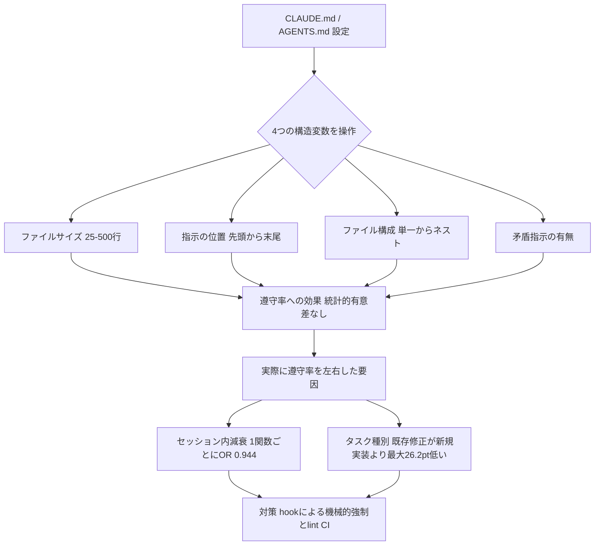
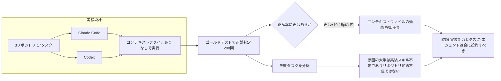
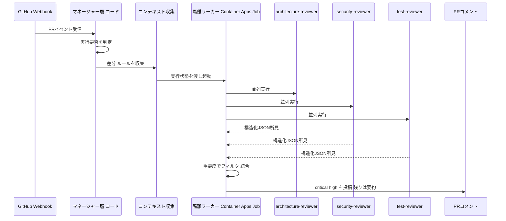

# Daily Briefing 2026-08-10

## 1. コーディングエージェント設定ファイルの指示遵守率：4つのファイル構造変数に関する要因実験（原題: Instruction Adherence in Coding Agent Configuration Files: A Factorial Study of Four File-Structure Variables）

- **URL**: https://arxiv.org/abs/2605.10039
- **公開日**: 2026-05-11
- **著者・媒体**: Damon McMillan（arXiv preprint）

### 本文翻訳
「CLAUDE.mdやAGENTS.mdはファイルサイズを小さく保つべきだ」「重要な指示は先頭に書くべきだ」――実務者の間で広く信じられているこうした通説を、本研究は初めて大規模な統制実験で検証した。対象はClaude Code CLI（Sonnet 4.6を中心に1,200セッション、Opus 4.6・4.7で追加検証）で、Next.jsボイラープレート「ixartz」と分析基盤「Umami」の2つのTypeScriptコードベース上で、5種類の実タスク（ヘルスAPI追加、ボタンコンポーネント作成、NextAuth統合、サイドバーリファクタ、ダッシュボード実装）を実行させた。

検証したのは4つのファイル構造変数――(1) ファイルサイズ（25/100/250/500行）、(2) 指示の位置（ファイル先頭〜末尾の5段階）、(3) ファイルアーキテクチャ（単一CLAUDE.mdのみ／AGENTS.md併用／ネストしたCLAUDE.mdまで含む）、(4) AGENTS.md内に矛盾する指示を混入させるか――である。遵守対象の指示は「新規・変更した全関数の1行目に`// @tracked`コメントを追加する」という単純な静的アノテーションで、git diffから自動抽出した16,050関数についてAST解析で機械的に判定した。

結果は驚くべきことに、4つの構造変数のいずれも、また3つの2要因交互作用のいずれも、多重比較補正後に統計的に有意な差を生まなかった（ファイルサイズの主効果はχ²=5.16, p=0.16、指示位置の主効果はχ²=1.47, p=0.83で「Lost in the Middle」で予測されるU字型の減衰も検出されず）。ベイズ検定でもファイルサイズ（BF₁₀=0.096）と矛盾指示（BF₁₀=0.053）は「強い帰無支持」という結果だった。

一方、分析中に偶然発見された最大の効果は「セッション内での遵守率の減衰」だった。1関数生成するごとに遵守のオッズが約5.6%低下し（OR=0.944, 95%CI [0.937, 0.951], p=1.08×10⁻⁴⁹）、この効果はタスクの複雑さによって形が大きく異なった（新規実装のT5は直線的に減衰、既存コード修正のT4はより複雑な非単調減衰）。さらにタスクの種類そのものが遵守率に与える影響（サイドバーリファクタのT4で45.1%、同程度の関数数のダッシュボード実装T5で71.3%、差26.2ポイント）は、どの構造変数の効果よりもはるかに大きかった。設定ファイルなしのベースラインでは0/524関数が遵守（0.0%）だったため、遵守という現象自体は指示によって駆動されていることは確認されている。

著者は実務者への提言として、(1) ファイル構造の微調整（サイズ・位置・分割方法）への投資対効果は乏しく、(2) 長時間セッションでの遵守率低下にはhooksによる再提示や事後的なlinter・CIでの強制など「セッション内メカニズム」で対抗すべきであり、(3) 複数コンポーネントにまたがる既存コード修正タスクほどenforcement（強制検証）を優先すべきだ、とまとめている。

### 重要ポイント
- ファイルサイズ（25〜500行）・指示位置・ファイル構成・矛盾指示の有無、いずれも指示遵守率に検出可能な影響を与えなかった（一部はベイズ検定で「強い帰無支持」）
- 最大の効果はセッション内での遵守率減衰：1関数生成ごとにオッズ比0.944（約5.6%低下）、p<10⁻⁴⁸
- タスクの種類（新規実装 vs 既存コード修正）による差（最大26.2ポイント）が、構造変数のどの効果よりも大きい
- Opus 4.6はSonnet 4.6より遵守率が12.8ポイント低く、「高性能モデルほど指示に忠実」という直感に反する結果
- 設定ファイルなしでは遵守率0%であり、遵守自体は明示的な指示に駆動されている

### 図解


### 現場での適用方法
研究結果から、CLAUDE.mdのサイズや指示位置を調整するより「長時間セッションでの減衰をhookで機械的に強制する」方が効果的と言える。

**CLAUDE.md への追記例**:
```markdown
## ルール遵守について
- CLAUDE.md のファイルサイズや指示位置を調整しても遵守率は変わらないことが実証されている（arXiv:2605.10039）。
- 長時間セッションでは指示遵守率がセッション経過とともに低下する（1関数あたり約5.6%）。
- 重要なルールは lint / hook で機械的に強制する。CLAUDE.md に書くだけで満足しない。
- 複数ファイルにまたがる既存コード修正タスクでは特に遵守率が下がりやすいため、自動検証を必須にする。
```

**スクリプト化の例（`.claude/hooks/post-edit-enforce.sh`）**:
```bash
#!/usr/bin/env bash
# Edit/Write 後に呼ばれ、必須ルールを機械的にチェックする
set -euo pipefail

CHANGED_FILES=$(git diff --name-only --diff-filter=ACM -- '*.ts' '*.tsx')
FAIL=0

for f in $CHANGED_FILES; do
  if ! grep -q "// @tracked" "$f" 2>/dev/null; then
    echo "warning: $f に // @tracked コメントがありません" >&2
    FAIL=1
  fi
done

if [ "$FAIL" -eq 1 ]; then
  echo "必須アノテーションが不足しています。修正してください。" >&2
  exit 2
fi
exit 0
```

`<REPO_PATH>/.claude/settings.json` 側の設定:
```json
{
  "hooks": {
    "PostToolUse": [
      {
        "matcher": "Edit|Write",
        "hooks": [
          { "type": "command", "command": ".claude/hooks/post-edit-enforce.sh" }
        ]
      }
    ]
  }
}
```

### 期待効果
設定ファイルなしでの遵守率0%に対し、明示的な指示＋自動チェックの併用により、放置すればセッション経過とともに55〜70%程度まで下がりうる遵守率を機械的に引き上げられると期待できる。特に既存コード修正タスク（研究内では新規実装より最大26.2ポイント遵守率が低かった）でhookによる強制を優先すると投資対効果が高い。

### 注意点
- 遵守対象は「関数先頭への静的アノテーション追加」という単純な指示のみを検証しており、複雑な条件分岐や多段階の指示、クロスファイルの推論を要する指示への一般化は未検証
- 対象はTypeScript・Next.js系の2コードベース、Claude系3モデルのみ。他言語・他エージェントへの一般化は未確認
- Opus 4.7の結果はモデルバージョン・CLIバージョン・thinkingモードの3要因が交絡しており、著者自身が解釈不能と明記している
- セッション内減衰は観察研究であり、原因（プロンプト構成の劣化か、モデル内部のドリフトか）は未特定

## 2. コンテキストファイルはコーディングエージェントの助けになるか？ 実リポジトリでの2エージェント・アブレーション研究（原題: Do Context Files Help Coding Agents? A Two-Agent Ablation Study on Real Repositories）

- **URL**: https://arxiv.org/abs/2607.27250
- **公開日**: 2026-07-28
- **著者・媒体**: Prakhar Khatri（arXiv preprint）

### 本文翻訳
多くのチームが「CLAUDE.mdやAGENTS.mdのようなコンテキストファイルを書けばエージェントの精度が上がる」と信じて運用しているが、その効果を厳密に検証した研究は少ない。本研究はClaude CodeとCodex（それぞれ最先端のコーディングエージェント）を対象に、3つの実リポジトリから抽出した17件の実務タスク（15件は両エージェント共通、2件はCodex専用）で計288回の評価を実施し、コンテキストファイルの有無・内容を系統的に変化させるアブレーション実験を行った。評価はゴールドテスト（合否基準となるテストスイート）による自動判定である。

結果、コンテキスト注入戦略は両エージェントの正解率を測定可能な水準では向上させなかった。等価性検定により、効果があるとしても±10〜15ポイントの範囲内に制限されると推定された。実際にコンテキストファイルを与えても、「あと一歩で正解」という惜しいケースを成功に転換することはできなかった。

失敗要因を分析すると、エージェントがタスクに失敗する主因はリポジトリ知識の不足（コンテキストファイルが補える領域）ではなく、機能設計・実装パターンの選択・正確な配線といった実装スキルそのものの不足にあることが分かった。つまりコンテキストファイルは「エージェントが知らないこと」を教える手段としては機能するが、「エージェントができないこと」を底上げする手段にはなっていない。

さらに興味深い発見として、タスクの難易度はエージェント固有であることが判明した。同じタスクでもClaude CodeとCodexで難易度の序列が入れ替わる度合いが強く、両者の相関はSpearman順位相関係数ρ=0.75にとどまった。これは、先行研究間でコンテキストファイルの効果について矛盾する結論が出ていた一因が、評価に使うエージェントの選択に依存していた可能性を示唆している。

著者らは、コンテキストファイルの作成・維持に過度なエンジニアリング投資をするよりも、エージェント自体の実装能力の底上げや、タスクとエージェントの相性を見極めたタスク選定・エージェント選定に投資する方がリターンが大きいと結論づけている。

### 重要ポイント
- 288回の評価（17タスク・3リポジトリ・2エージェント）で、コンテキストファイルによる正解率向上は検出できず（効果は±10〜15ポイント以内）
- エージェントの失敗主因はリポジトリ知識不足ではなく、機能設計・パターン選択・配線といった実装スキル不足
- タスク難易度はエージェント固有（Spearman ρ=0.75）で、同じコンテキストファイルでもエージェントによって効くかどうかが変わりうる
- 「惜しい失敗」をコンテキストファイルで成功に転換することはできなかった
- コンテキストファイル執筆より、実装能力の底上げやタスク-エージェントの相性選定に投資する方が投資対効果が高い

### 図解


### 現場での適用方法
**運用手順（自分のリポジトリで簡易的な効果測定を行う）**:
1. ゴールドテスト（合否判定可能なテスト）が書ける代表タスクを5〜10件用意する
2. 各タスクを (a) CLAUDE.md/AGENTS.mdなし、(b) 現行のCLAUDE.mdあり、の2条件で最低3回ずつ実行し、テスト合否を記録する
3. 合格率の差が測定誤差（±10〜15ポイント程度）を明確に超えるか確認する
4. 差がない場合、コンテキストファイルの拡充より、失敗タスクの実装パターン（設計・配線の具体例）をCLAUDE.mdに書く、または該当タスクを別エージェント/モデルに任せることを優先する

```bash
#!/usr/bin/env bash
# scripts/context-file-ablation.sh
# CLAUDE.md の有無でタスク合格率を比較する簡易ハーネス
set -euo pipefail
TASK_DIR=<TASK_DIR>   # 例: tasks/
RUNS=3

for cond in with without; do
  pass=0; total=0
  for task in "$TASK_DIR"/*; do
    for i in $(seq 1 $RUNS); do
      if [ "$cond" = "without" ]; then mv CLAUDE.md CLAUDE.md.bak 2>/dev/null || true; fi
      claude -p "$(cat "$task/prompt.txt")" --headless
      if bash "$task/verify.sh"; then pass=$((pass+1)); fi
      total=$((total+1))
      if [ "$cond" = "without" ]; then mv CLAUDE.md.bak CLAUDE.md 2>/dev/null || true; fi
    done
  done
  echo "$cond: $pass/$total"
done
```

### 期待効果
自分のリポジトリ・タスクセットで「コンテキストファイルの限界（±10〜15ポイント）」を定量把握でき、CLAUDE.md執筆に割いていた工数を、失敗タスクの実装パターンの明文化やタスク-エージェントの相性選定に振り向けられる。研究ではタスク難易度がエージェント固有（ρ=0.75）だったため、同じタスクでもエージェントを変えるだけで結果が変わりうる。

### 注意点
- 288回評価・17タスク・3リポジトリという比較的小規模な検証であり、「コンテキストファイルは無意味」と断定するには早い。効果が±10〜15ポイントの範囲に限定されるという結論であり、ゼロと証明されたわけではない
- 検証対象はClaude CodeとCodexの2エージェントのみ
- 「実装スキル不足が主因」という結論は、逆に言えば実装パターンの具体例（コード片）をコンテキストファイルに含めることの効果までは否定していない。本研究は主に「リポジトリ説明」型のコンテキストファイルを検証したと考えられる

## 3. コーディングエージェントで自前のPRレビュアーを構築する（原題: Building your own PR reviewer with coding agents）

- **URL**: https://www.huuhka.net/building-your-own-pr-reviewer-with-coding-agents/
- **公開日**: 2026-03-11
- **著者・媒体**: Pasi Huuhka（個人ブログ）

### 本文翻訳
多くのチームがAIによる自動PRレビューの構築を試みるが、著者のPasi Huuhka氏は「うまく動くAIレビュアーの本質は、AIの部分ではなくむしろ従来型のソフトウェアエンジニアリングにある」と説く。本記事は、実際にプロダクションで運用したPRレビューシステムの設計を、コードレベルまで踏み込んで解説する。

システム全体は7段階のパイプラインで構成される。(1) GitHubなどのソースシステムからWebhookイベントを受信、(2) マネージャー層（コード側で決定論的に制御）がレビュー実行の要否を判断、(3) 差分・関連ファイル・プロジェクトルールなどのコンテキストを収集、(4) 実行状態をテーブルストレージに保存、(5) Azure Container Appsのジョブとして隔離されたワーカーを起動、(6) コーディングハーネス（GitHub Copilot SDKやOpenCode SDKなど）経由でLLMレビューを実行し構造化出力を強制、(7) 結果を元のPRにコメントとして投稿、という流れである。

重要な設計原則は「制御フローの主権をどこまでコードが握り、どこからLLMに委ねるか」の明確な線引きである。いつ起動するか、どのリポジトリを対象にするか、失敗時のリトライ戦略といった判断はすべて決定論的なコードが担い、LLMには「このコードにリスクはあるか」「テストは十分か」「所見をどうまとめるか」といった評価的な判断のみを委ねる。著者は「タスクが限定的であればあるほど、モデルの周囲の処理は決定論的に保つべきだ」と述べている。

エージェント設計では、単一の巨大プロンプトで全観点をカバーさせるのではなく、アーキテクチャレビュー担当・セキュリティレビュー担当・テスト充足性担当・プロジェクト固有ルール担当という専門特化したサブエージェントを並列実行し、それぞれ異なる視点からコードを検査させる。出力例として、`{"summary": "string", "findings": [{"severity": "critical|high|medium|low", "title": "string", "path": "string", "line": 123, "body": "string"}]}` のような重要度付きの構造化JSONを強制することで、後段のフィルタリングや自動処理を可能にしている。

運用上の課題として、モデルは有用な指摘をする一方で冗長な出力も大量に生成するため、重要度でフィルタリングし、低重要度の所見は1つのコメントにまとめて開発者の負担を抑える工夫をしている。同じアーキテクチャは問題トリアージやバグ再現、ドキュメント生成、`/fix`のような自動修正コマンドにも横展開できるとし、ローカル開発環境と本番サーバーで同一のハーネス・スキル・指示を共有することがフィードバックサイクルの高速化とドリフト防止に有効だとまとめている。

### 重要ポイント
- PRレビュー自動化の本質は「AI部分」ではなく、イベント受信・状態管理・隔離実行・結果投稿という従来型のソフトウェアエンジニアリングにある
- 起動判定・リトライ戦略などの制御はコード側が決定論的に担い、リスク評価や所見のまとめのみをLLMに委ねる設計原則
- アーキテクチャ・セキュリティ・テスト充足性などの専門特化したサブエージェントを並列実行し、視点の異なるレビューを統合する
- 重要度付きの構造化JSON出力を強制し、critical/highのみを個別コメント、medium/lowは1件に集約して開発者の負担を抑える
- 同一のハーネス・スキル・指示をローカル開発と本番で共有することで、フィードバックサイクルの高速化とドリフト防止に寄与する

### 図解


### 現場での適用方法
記事の「制御フローはコードに、評価判断はLLMに」という原則を、Claude Codeのカスタムサブエージェント＋フックで再現する。

**スキル化の例（`<REPO_PATH>/.claude/skills/pr-review/SKILL.md`）**:
```markdown
---
name: pr-reviewer
description: PRの差分をアーキテクチャ・セキュリティ・テスト充足性の3観点でレビューし、重要度付きの所見をJSONで返す。「PRをレビューして」「差分をチェックして」と言われたら使う。
---

# PRレビュー手順
1. `git diff origin/main...HEAD` で差分を取得する
2. 以下の3つの観点それぞれについて、専門サブエージェントに委譲する
   - architecture-reviewer: 設計 パターン逸脱 不要な複雑化
   - security-reviewer: シークレット漏洩 SSRF SQLi 安全でないデシリアライズ
   - test-reviewer: 変更に対するテストカバレッジの過不足
3. 各サブエージェントの結果を以下のJSON形式に統一する
   { "summary": string, "findings": [{ "severity": "critical|high|medium|low", "path": string, "line": number, "body": string }] }
4. critical/highのみをPRコメントとして投稿し、medium/lowは1件のサマリーコメントにまとめる
```

**フックによるゲーティング（`<REPO_PATH>/.claude/settings.json`）**:
```json
{
  "hooks": {
    "SubagentStop": [
      {
        "matcher": "security-reviewer",
        "hooks": [
          { "type": "command", "command": "<REPO_PATH>/.claude/hooks/block-on-critical.sh" }
        ]
      }
    ]
  }
}
```

```bash
#!/usr/bin/env bash
# .claude/hooks/block-on-critical.sh
# security-reviewer の出力に critical があれば処理を止めて注意喚起する
set -euo pipefail
FINDINGS_JSON="$1"
if echo "$FINDINGS_JSON" | jq -e '.findings[] | select(.severity=="critical")' > /dev/null; then
  echo "critical な指摘があります。マージ前に対応してください" >&2
  exit 2
fi
exit 0
```

### 期待効果
単一の巨大プロンプトでレビューさせるより、専門特化したサブエージェントを並列実行し重要度でフィルタリングすることで、開発者が読むべきコメント数を絞り込みつつ、architecture/security/testという見落としがちな3観点を機械的に網羅できる。ローカル開発と本番で同一のハーネス・スキル定義を共有すれば、記事が指摘するようにフィードバックサイクルの高速化とドリフト防止にもつながる。

### 注意点
- 記事のシステムはAzure Functions/Container Apps Jobs前提の本番インフラであり、上記のスキル化例はその設計思想をClaude Codeのローカル運用に翻案したもので、記事そのままの実装ではない
- 重要度の判定基準（critical/high/medium/low）はLLMの評価的判断に委ねているため、誤検知・見落としのリスクは残る。人間レビューの完全な代替にはならない
- 出力の冗長性対策（重要度フィルタリング・低重要度の集約）を怠ると、開発者がコメントを読まなくなる「アラート疲れ」を招く
