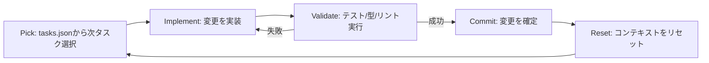
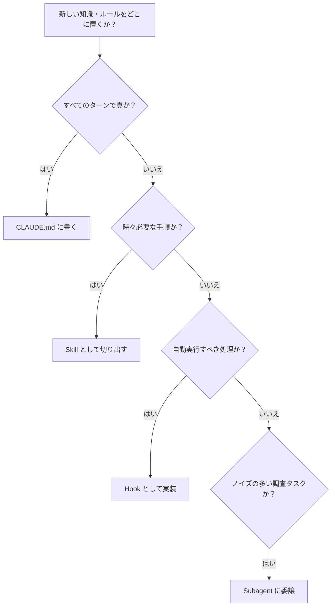
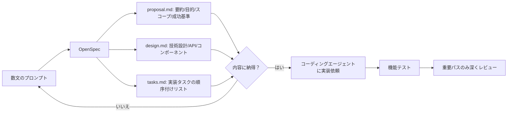
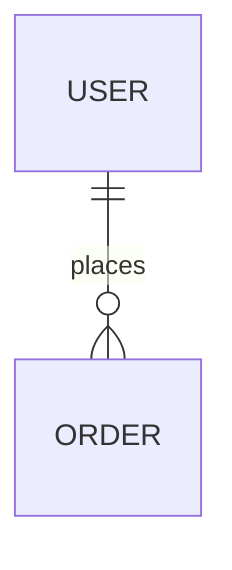

# Daily Briefing 2026-08-11

## 1. コード・エージェント・オーケストラ ― マルチエージェント・コーディングを機能させる要素（原題: The Code Agent Orchestra – what makes multi-agent coding work）

- **URL**: https://addyosmani.com/blog/code-agent-orchestra/
- **公開日**: 2026-03-26
- **著者・媒体**: Addy Osmani（個人ブログ）

### 本文翻訳
開発者のAIツール活用は8段階の習熟度曲線をたどるが、本記事は特に後半のレベル5〜8、すなわち「単一エージェントを同期的に操作するコンダクター・モデル」から「複数エージェントを非同期に調整するオーケストレーター・モデル」への移行に焦点を当てる。著者はこの移行を支える3つのコアパターンを提示する。

第一のパターンは「サブエージェント」である。親のオーケストレーターがTaskツールを使って専門化した子エージェントを生成し、依存関係は手動で管理する。実例として、ブックマーク管理アプリ「Link Shelf」の構築では、データ層エージェントが`db.js`と`DATA.md`レポートを作成し、続くビジネスロジックエージェントがそのレポートを読んで`validation.js`と`LOGIC.md`を作り、最後にAPIルートエージェントが両方のレポートを読んでから`server.js`を組み上げた。この3段階の実装は約22万トークンで完了し、費用対効果が高いと評価されている。

第二のパターンは「エージェントチーム」である。環境変数`CLAUDE_CODE_EXPERIMENTAL_AGENT_TEAMS=1`で有効化すると、チームリード・共有タスクリスト・チームメイトの3層アーキテクチャが立ち上がる。共有タスクリストは依存関係の追跡とファイルロックを担い、チームメイトはそれぞれ独立したコンテキストでtmuxの分割ペイン上で並列実行される。チームメイト同士はリードを迂回してピアツーピアでメッセージをやり取りでき、`Ctrl+T`でタスク状況を可視化できる。著者の経験では最適なチームサイズは3〜5人で、コストはチームサイズに対しほぼ線形に増加する。

第三のパターンは大規模オーケストレーションで、ツールをティア別に整理する。ティア1は対話的な単一セッション（Claude Code、Agent Teams）、ティア2はローカルでの並列実行（Conductor、Vibe Kanban、Gastown）、ティア3はクラウド上の非同期実行（Claude Code Web、GitHub Copilot Agent、Jules）である。

信頼性を担保する質保証ゲートとして、著者は(1)実装前に戦略を書かせて承認する「計画承認」、(2)タスク完了時に自動でテスト・リントを走らせ失敗時はエージェントに継続作業させる「ライフサイクルフック」、(3)AGENTS.mdにSTYLE/GOTCHAS/ARCH_DECISIONSのセクションを持たせる「複合学習」の3つを挙げる。ただし機械生成したAGENTS.mdは成功率を約3%下げ推論コストを20%増やす一方、開発者がキュレーションしたAGENTS.mdは約4%の改善をもたらすという対照的な結果が示されている。

さらに実装テクニックとして、計画立案はGemini・実装はClaude Opus/Sonnet・レビューはセキュリティ特化モデルに割り当てる「マルチモデルルーティング」、`agent-spin`/`agent-merge`/`agent-clean`のワークツリー・ライフサイクルスクリプト、エージェントごとにトークン予算を設定し85%到達で自動一時停止、同一エラーで3回以上スタックしたら再割当する「トークン予算管理」、そしてPick→Implement→Validate→Commit→Resetの5段階を繰り返す「Ralphループパターン」が紹介される。Ralphループのメモリはgitコミット履歴・進捗ログ・tasks.json・AGENTS.mdの4チャネルで構成される。

著者は「ボトルネックは生成から検証にシフトした」「曖昧な仕様は50エージェント並列実行時に誤りを増幅する、つまりスペックが支配力を持つ」「判断そのものをエージェントに委譲するな」という3原則を強調し、まず今日はサブエージェントから、来週はAgent Teamsを、その先で品質ゲートと複合学習を導入するよう段階的な着手を勧めている。

### 重要ポイント
- コンダクターモデル（単一エージェント同期操作）からオーケストレーターモデル（複数エージェント非同期調整）への移行が2026年のマルチエージェント開発の核
- サブエージェント／エージェントチーム／大規模オーケストレーションの3段階パターンがあり、最適チームサイズは3〜5人
- 計画承認・ライフサイクルフック・AGENTS.md複合学習の3つの品質ゲートが信頼性を担保する
- 機械生成AGENTS.mdは逆効果（成功率-3%・推論コスト+20%）、人間によるキュレーションが必須（+4%改善）
- Ralphループ（Pick→Implement→Validate→Commit→Reset）はコンテキストをリセットしながら継続実行する型

### 図解


### 現場での適用方法

**AGENTS.md への追記例（複合学習パターン）**
```markdown
## STYLE
- 関数コンポーネント + Hooksを使う。クラスコンポーネントは禁止

## GOTCHAS
- SQLiteは並行読み取りのためWALモード必須（`PRAGMA journal_mode=WAL;`）
- 外部APIはレート制限540req/minを超えないこと

## ARCH_DECISIONS
- 全ての永続状態はSQLiteに保存し、メモリキャッシュは使わない
- 認証はJWT、リフレッシュトークンはhttpOnly Cookieに格納する

<!-- このセクションは機械生成せず、開発者が変更発生ごとにレビュー・追記すること -->
```

**ワークツリー・ライフサイクルスクリプト例**
```bash
#!/usr/bin/env bash
# agent-spin: feature用worktreeを作成しエージェントセッションを開始
set -euo pipefail
FEATURE="$1"
git worktree add "../<REPO_NAME>-$FEATURE" -b "agent/$FEATURE"
cd "../<REPO_NAME>-$FEATURE"
claude --task "Implement: $FEATURE. Read AGENTS.md first."
```
```bash
#!/usr/bin/env bash
# agent-clean: mainにマージ済みのagent worktreeを一括削除
set -euo pipefail
git worktree list --porcelain | awk '/^worktree/{print $2}' | while read -r wt; do
  branch=$(git -C "$wt" branch --show-current)
  if [[ "$branch" == agent/* ]] && git branch --merged main | grep -q "$branch"; then
    git worktree remove "$wt"
    git branch -d "$branch"
  fi
done
```

### 期待効果
3〜5人の専門特化チームは1人の汎用エージェントの3倍の時間をかけた場合より一貫して優位、並列実行によりスループットが3倍になる。開発者キュレーションのAGENTS.mdで成功率が約4%改善し、サブエージェント方式は約22万トークンという費用対効果を実現する。

### 注意点
機械生成のAGENTS.mdは成功率-3%・推論コスト+20%と逆効果になるため、必ず人間がレビューして書く。サブエージェントパターンは依存関係を手動管理する必要がある。曖昧な仕様のまま大規模並列実行すると誤りが増幅されるため、着手前の仕様明確化が前提条件。Agent Teamsのコストはチームサイズにほぼ線形に増加するため、無制限な拡大は避けるべき。

---

## 2. 4か月間の日次使用から生まれたClaude Codeセットアップ（原題: My Claude Code Setup After 4 Months of Daily Use (2026)）

- **URL**: https://okhlopkov.com/claude-code-setup-mcp-hooks-skills-2026/
- **公開日**: 2026-08-01
- **著者・媒体**: Daniil Okhlopkov（個人ブログ）

### 本文翻訳
著者Daniil Okhlopkovは、4か月間Claude Codeを日常的に使い続けて到達した設定を公開している。中心的な考え方は「CLAUDE.mdはエージェント自身の振る舞いを説明するファイルではなく、あなたの世界がどう機能しているかを説明するファイルである」というもので、著者は個人のObsidian Vault管理を例に、ファイルを150行未満に保ち`[[links]]`で相互参照する構成ルールや、AIが音声ノートの生コンテンツを編集しないという制約、受信した音声メッセージをプロジェクト関連なら`projects/X/ai-docs/`へ、個人用なら`personal/diary/`へ振り分けたうえでタグ付け・TODO抽出・プロジェクト概要更新まで行わせる具体的な運用ルールをCLAUDE.mdに書き込んでいる。

MCPサーバーについては`.mcp.json`でCoolify（アプリのデプロイ・サービス再起動・ログ確認・DB管理）、Telegram（メッセージ読み取り・返信送信・チャネル管理）、Codex（OpenAIモデルによる独立レビュー）の3種を運用し、シークレットが必要なサーバーの設定はコミットせず環境変数やネイティブのシークレットストアから読み込むというスコープ原則を徹底している。

Hooksの実例としては、コミット前にステージされたファイル名を正規表現でチェックし、`.env`・`.key`・`.pem`拡張子や`creds.md`のようなファイルが含まれていればコミットをブロックするpre-commitフックが紹介されている。著者はこの仕組みを「24時間無人で動作するエージェントでも認証情報漏洩やブランチ誤操作を防止できる安全装置」と位置づけている。

Skillsは、Dune向けSQLクエリ作成のスキーマ知識・典型的なエラー・APIポーリング方法を約200行のMarkdownにまとめた`ton-analyst`、TONウォレットの接続関係を内部API呼び出しとグラフデータ構築で調査する`ton-profiler`、ロシア語・英語・中国語の複数言語で配信文を作る`crosspost`など、SDKやAPI呼び出しを一切書かずMarkdownの指示だけで実装されている。

Subagentsの活用例としては、ブロックチェーン調査タスクにおいてリードエージェントが質問を受け取り、Dune SQLを実行する「データエージェント」、内部ウォレットDBを調べる「プロファイリングエージェント」、両者の出力から最終分析をまとめる「レポートエージェント」に分割する構成が紹介され、「通常は半日かかる作業が15分で完了した」という。

著者はレイヤーごとの使い分けの判断基準を「すべてのターンで真である指示はCLAUDE.mdに、時々必要な手順はskillに、自動実行すべきスクリプトはhookに、ノイズの多い調査はsubagentに担わせる」と明確に定式化している。長時間セッションでは`/compact`コマンドとCLAUDE.mdの堅牢なルールを組み合わせることで、自動圧縮後も重要な状態を保持できるとしている。インストールは`curl -fsSL https://claude.ai/install.sh | bash`（macOS/Linux/WSL）または`irm https://claude.ai/install.ps1 | iex`（Windows PowerShell）で行い、`claude doctor`で検証、MCPサーバーの追加は`claude mcp add --transport http <名前> <URL>`で行える。

### 重要ポイント
- CLAUDE.mdは「エージェントの説明書」ではなく「あなたの世界の説明書」という設計思想
- CLAUDE.md／Skill／Hook／Subagentを「常に真／時々必要／自動実行／ノイズの多い調査」で明確に使い分ける
- pre-commitフックで秘密情報コミットを機械的にブロックし、無人稼働の安全性を確保
- MCPサーバーはコミットせず環境変数で管理し、用途を絞って最小限に運用する
- subagent分割によりブロックチェーン調査が半日から15分に短縮

### 図解


### 現場での適用方法

**pre-commitフック例**
```bash
#!/usr/bin/env bash
# .claude/hooks/pre-commit.sh
# 機密ファイルのコミットを機械的にブロックする
if git diff --cached --name-only | grep -qE '\.(env|key|pem)$|creds\.md$'; then
  echo "BLOCKED: 機密情報を含む可能性のあるファイルがステージされています" >&2
  exit 1
fi
```

**CLAUDE.md への追記例（レイヤー使い分けルール）**
```markdown
## Context Routing Rules
- すべてのターンで真であるルール・規約 → このCLAUDE.mdに書く
- 時々必要になる技術知識・手順 → .claude/skills/ 以下にSkillとして切り出す
- コミット前チェックなど自動実行すべき処理 → .claude/hooks/ にHookとして実装
- 大量のログ・DB調査などノイズの多い探索 → subagentに委譲しレポートのみ受け取る
```

**.mcp.json 設定例**
```json
{
  "mcpServers": {
    "coolify": {
      "command": "npx",
      "args": ["-y", "@masonator/coolify-mcp"],
      "env": {
        "COOLIFY_ACCESS_TOKEN": "${COOLIFY_ACCESS_TOKEN}",
        "COOLIFY_BASE_URL": "${COOLIFY_BASE_URL}"
      }
    }
  }
}
```

### 期待効果
subagent分割により調査作業が半日から15分に短縮。pre-commitフックにより無人稼働中の認証情報漏洩を機械的に防止できる。

### 注意点
MCPサーバーのシークレットはコミットしない運用が前提。フックはブロックだけでなく誤検知（false positive）のチューニングが必要。CLAUDE.mdを150行未満に保つ運用は個人Vault向けの目安であり、プロジェクトの性質によっては別途調整が必要。

---

## 3. エージェント型AIをシンプルに保つ ― ソフトウェア開発のための実践的ワークフロー（原題: Keep Agentic AI Simple: A Practical Workflow for Software Development）

- **URL**: https://timdeschryver.dev/blog/keep-agentic-ai-simple-a-practical-workflow-for-software-development
- **公開日**: 2026-04-23
- **著者・媒体**: Tim Deschryver（個人ブログ）

### 本文翻訳
著者Tim Deschryverは、ASP.NET API・Angular・.NET Aspireで構成する開発現場での実践から、「エージェント型AIはシンプルに保つべきだ」と説く。AIエージェントを自転車ロードレースの「スーパー・ドメスティック」に見立て、開発者はチームを率いる立場としてエージェントに戦略を指示する関係を提案し、複雑なプロンプトエンジニアリングよりも構造化されたシンプルな仕組みの方が効果的だと主張する。

中核となるのはAGENTS.mdファイルで、技術スタック・ビルドやテストやリントのコマンド・コーディング規約・アプリケーション全体のフローを記載し、エージェントがリクエストのたびに自動的に読み込む。加えてデータベース図をMermaid構文で追記することを勧めており、「新しい概念を導入した後にエージェント自身へAGENTS.mdの更新を依頼する」「エージェントが繰り返すミスをこのファイルに追記して精度を上げる」という運用で継続的に育てていく。

Agent Skillsは`npx skills add dotnet/skills`のようなコマンドで導入するMarkdownベースの知識モジュールで、エージェントは関連性を検出すると自動的にロードし、スラッシュコマンドでオンデマンド呼び出しもできる。著者はAngularの公式スキル・.NETベストプラクティス・pnpm/NuGet/Aspire向けスキル、色やフォントやコンポーネント定義を扱うデザインスキル、エンドポイントのテンプレートスキルなどを導入し、複数のエージェント間で知識を共有している（探索は https://skills.sh で行える）。

大きめの機能を作る際にはOpenSpecによる仕様駆動開発を用いる。数文のプロンプトから、要約・目的・スコープと対象外・成功基準をまとめた`proposal.md`、変更/新規領域・APIエンドポイント・Angularコンポーネント・モデル・実装詳細を記した`design.md`、実装タスクを順序立てた`tasks.md`の3ファイルが自動生成される。内容に不満があれば2度目・3度目のプロンプトで容易に修正でき、これらはプロジェクトに残るアーカイブドキュメントとしても機能する。小規模な修正にはこの仕組みを使わず、従来通りの直接指示で対応する。

一方で著者はMCPサーバーの多用に明確に警鐘を鳴らす。「MCPサーバーはエージェントのコンテキストウィンドウを膨張させ、結果として出力品質を低下させるため使用しない」とし、多くの場合はSkillやCLIツール（PlaywrightのCLI、GitHub CLIなど、Skillと組み合わせて使える）で代替できるとする。実際に採用しているのはAspire MCPのみで、Figma MCPとGoogle StitchのMCPは試験導入したが成果が出ず取りやめている。

働き方そのものにも変化が生じているという。2週間スプリント単位で提供していた成果が数日単位で出荷されるようになり、大きなレビューを数日〜数週間おきに行うのではなく、頻繁なチェックインと小さなレビューで早期に問題や不整合を検出する体制が必須になった。プロダクトオーナーの重要性も増しており、「問題はリソース不足ではなく、重要でない機能の過剰供給である」ため、ビジネス価値のある領域に焦点を当てる技術が差別化要因になるという。ペアプログラミングも「開発者2人」から「開発者とステークホルダーや主要ユーザー」という新しい形へ広がる可能性が示唆され、エンジニアの役割は「技術詳細を書くこと」から「エージェントが機能するための優れたガードレールを提供しつつプロダクトの所有権を保持すること」へ再定義されつつある。著者は、すべての仕組みを一度に導入するのではなく、シンプルに始めてエージェントが同じ過ちを繰り返す箇所に気づくたびに段階的に足していくことを勧めている。

### 重要ポイント
- AGENTS.md／Skills／Hooks／MCPを役割分担させ、複雑なプロンプトエンジニアリングより構造化されたシンプルな仕組みを優先する
- OpenSpecでproposal.md／design.md／tasks.mdを自動生成する仕様駆動開発が大規模機能に有効
- MCPサーバーはコンテキストウィンドウを圧迫し品質を落とすため多用せず、Skill／CLIで代替する
- 2週間スプリントから数日出荷へのシフトに伴い、頻繁な小さいレビューとチェックインが必須になった
- エンジニアの役割は実装詳細を書くことから、ガードレール提供とプロダクト所有権の保持へシフトしている

### 図解


### 現場での適用方法

**AGENTS.md テンプレート例**
````markdown
## Tech Stack
- ASP.NET API / Angular / .NET Aspire

## Commands
- Build: `dotnet build`
- Test: `dotnet test && npx ng test`
- Lint: `npx eslint . --fix`

## Conventions
- APIは非同期メソッドのみ公開する
- Angularはstandalone component + signalsを使う

## Database


## Known Mistakes（エージェントが繰り返した過ちをここに追記していく）
- N+1クエリを書きがち → 必ずEager Loadingを使う
````

**OpenSpec風の仕様駆動ディレクトリ構成と導入コマンド**
```
specs/
  <feature-name>/
    proposal.md   # 要約・目的・スコープ・成功基準
    design.md     # 技術設計・API・コンポーネント
    tasks.md      # 実装タスクの順序付けリスト
```
```bash
npx openspec init
npx openspec propose "<feature-name>"
# proposal.md/design.md/tasks.md が生成される。内容を確認し、必要なら追加プロンプトで修正する
```

### 期待効果
2週間かかっていた機能提供が数日単位に短縮される。仕様のブレを実装前に解消できるため、実装後の手戻りを削減できる。AGENTS.mdを継続更新することでエージェントの同じミスの再発を防げる。

### 注意点
MCPサーバーを増やしすぎるとコンテキストウィンドウ圧迫により品質が低下する。小規模な修正にOpenSpecを使うのは過剰であり、その場合は従来通り直接指示すべき。頻繁な小さいレビュー体制へ移行するにはチームのプロセス変更が必要で、ツール導入だけでは効果が出ない。
