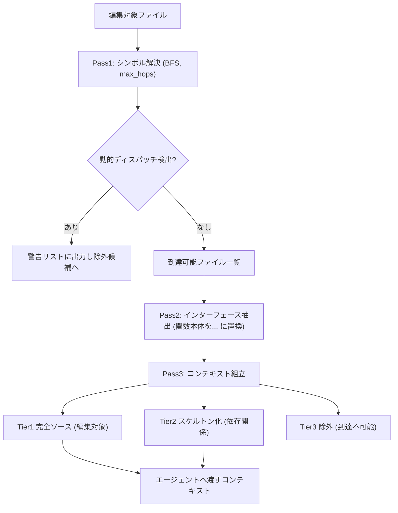
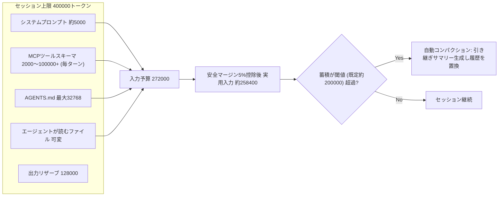
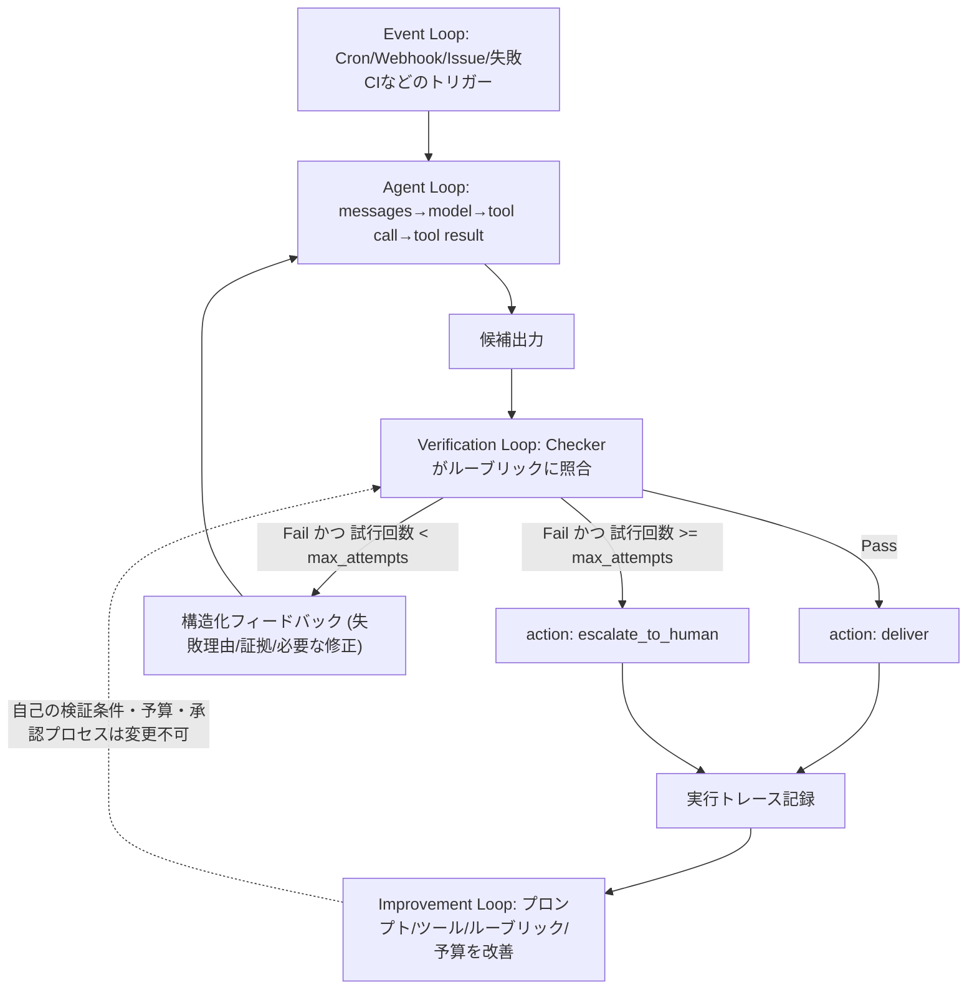

# Daily Briefing 2026-08-12

## 1. コーディングエージェントに必要なのは大きなコンテキストウィンドウではなく「コンテキストコンパイラ」だ（原題: Coding Agents Don't Need Bigger Context Windows — They Need a Context Compiler）

- **URL**: https://towardsdatascience.com/coding-agents-dont-need-bigger-context-windows-they-need-a-context-compiler/
- **公開日**: 2026-08-01
- **著者・媒体**: Emmimal P Alexander / Towards Data Science

### 本文翻訳
コーディングエージェントの問題は「コンテキストウィンドウが小さいこと」ではなく「賢いフィルタリングがないこと」だと著者は主張する。解決策として、コンパイラ設計の原則をエージェントのコンテキスト構築に応用した「コンテキストコンパイラ」を提案する。コンパイラは単なる圧縮ツールではなく、次の処理段階が実際に必要とするものだけを隔離するフィルタである、という理解が核になっている。

処理は3パスで構成される。

**Pass 1: シンボル解決** — 編集対象ファイルから出発し、リポジトリ内で実際に参照される依存関係を幅優先探索（BFS）で`max_hops`まで特定する。明示的な`import`を優先し、`.save()`のような呼び出しがインポートで説明できない場合はリポジトリ全体のシンボルテーブルにフォールバックする。`getattr()`による動的ディスパッチや`@receiver`のようなイベントデコレータ登録は静的解析では追跡できないため、検出時は明示的に警告リストへ出力する。「間違った依存グラフを渡すより、未知を報告するほうがよい」という設計哲学に基づく。

**Pass 2: インターフェース抽出** — 到達可能だが編集対象ではないファイルを「スケルトン化」する。関数シグネチャとdocstringは保持し、関数本体は単一のプレースホルダ`...`に置き換える。実測では448文字が173文字（61%削減）になった例が示されている。エージェントは依存先の実装詳細ではなく、存在・引数・デフォルト値だけを知れば十分という考え方に基づく。

**Pass 3: コンテキスト組立** — Tier1（編集対象ファイルの完全ソース）、Tier2（スケルトン化された到達可能な依存関係）、Tier3（到達不可能なため除外）の3層に分けて最終コンテキストを組み立てる。

3つのリポジトリでベンチマークした結果、素朴な全ファイルダンプに対しトークン削減率は34.9%〜74.3%、ビルド時間は12〜66ミリ秒だった。主要な調整パラメータは`max_hops`で、デフォルト値2（直接依存+1層）がベンチマークで使われている。値を1にすると最小ペイロードだがヘルパー関数を見落とす可能性があり、3以上にすると呼び出しグラフは広がるが削減効果は薄れる。

限界として、動的ディスパッチの追跡不可、メソッド名衝突時の安全側フェイルオーバー（両方をTier2に含めてトークン膨張）、トークン数推定が`characters // 4`という粗いヒューリスティックであることなどが挙げられている。数百ファイル規模の巨大モノレポではインデックス生成自体がボトルネックになるため不向きとしている。

### 重要ポイント
- コンテキスト削減の核心は「圧縮」ではなく「そもそも不要なものを含めない」フィルタリング設計
- 依存関係を「完全ソース／スケルトン化／除外」の3層に分けることで、実装詳細ではなく型・シグネチャ情報だけを安価に渡せる
- ベンチマークでは34.9%〜74.3%のトークン削減を実測（ビルド時間はミリ秒オーダー）
- 動的ディスパッチなど静的解析の限界は隠さず警告として出力する設計が信頼性を支えている
- 単一ファイルスクリプトや巨大モノレポには不向きで、適用場面を見極める必要がある

### 図解


### 現場での適用方法
簡易版のシンボル解決＋スケルトン化スクリプトの導入手順（本家はPython実装、`ast`モジュールで関数本体を`...`に置換する）:

```bash
# 1. 元ツールを取得して挙動を確認
git clone https://github.com/Emmimal/context-compiler.git
cd context-compiler
python demo.py

# 2. 自分のリポジトリの特定ファイルに対して実行
python benchmark.py <REPO_PATH> <REPO_PATH>/path/to/target_file.py --max-hops 2
```

CLAUDE.md への追記例（Claude Codeにマルチファイル編集時の振る舞いとして指示する場合）:

```markdown
## コンテキスト取得の方針（マルチファイル編集時）
- 編集対象ファイル以外を読む際は、まず依存関係が直接インポート/呼び出しされているかを
  1〜2ホップの範囲で確認し、それ以外のファイルは開かないこと。
- 依存先ファイルの実装詳細ではなく、関数シグネチャ・型・docstringのみが必要な場合は、
  該当関数の中身を読まずシグネチャ行のみを参照すること。
- `getattr()` 等の動的ディスパッチが疑われる箇所は、追跡できない旨を明示してから
  次の手段（grepでの呼び出し元探索など）に切り替えること。
```

### 期待効果
実測ベンチマークでナイーブな全文ダンプ比34.9%〜74.3%のトークン削減。処理時間もミリ秒オーダーで、マルチファイルタスクにおけるコンテキスト予算の圧迫を大きく緩和できる。

### 注意点
`getattr()`や動的インポート、イベントデコレータ登録による依存関係は静的解析で検出できず、安全側に倒すため対象ファイルがTier2に混入しトークン膨張が起きうる。単一ファイルスクリプトや数百ファイル規模のモノレポでは効果が薄い、またはインデックス生成自体がボトルネックになる。

---

## 2. Codexコンテキストウィンドウの実態：公称100万トークンがなぜ実効27.2万トークンまで絞られるのか（原題: The Context Window Gap: Why Codex CLI Caps GPT-5.6's Million-Token Window at 272K — and Why That's Sensible Engineering）

- **URL**: https://codex.danielvaughan.com/2026/07/20/context-window-gap-codex-cli-gpt56-advertised-vs-effective-budget-compaction-strategy/
- **公開日**: 2026-07-20
- **著者・媒体**: Daniel Vaughan

### 本文翻訳
GPT-5.6 Solは公称100万5,000トークンのコンテキストウィンドウを持つが、Codex CLI v0.144.6（2026年7月18日リリース）では実際の入力上限を272,000トークンに制限している。著者はこれを「制限」ではなく「合理的なエンジニアリング判断」と位置づけて分析する。

セッション予算の内訳は、セッション上限400,000トークンのうち入力予算272,000トークン・出力リザーブ128,000トークン。安全マージン5%を引いた実用入力容量は約258,400トークンとなる。セッション開始前から消費される要素として、システムプロンプト約5,000トークン、MCPサーバーごとのツールスキーマ2,000〜100,000トークン超（毎ターン再読み込み）、AGENTS.mdファイル最大32,768トークンが挙げられている。複数のMCPサーバー（GitHub、Slack、Jira、DB等）を同時接続すると、毎ターン10万トークン超のスキーマオーバーヘッドが発生しうる。

制限の技術的根拠として2点挙げる。1つ目は「Lost in the Middle」問題——コンテキスト中央に配置された情報の検索精度がフロンティアモデルでも10〜25%低下するという2026年の研究結果。2つ目はAttentionの系列長に対する二次的なコストスケーリングで、GPT-5.6 Solは入力$5/百万トークン・出力$30/百万トークンのため、反復的なコーディングセッションでコストが積み上がる。

自動コンパクションはトークン蓄積が閾値（デフォルト約200,000）を超えると発動し、会話履歴全体をモデルに渡して「引き継ぎサマリー」を生成後、元の履歴を置き換える。これは本質的にロッシーな処理であり、272Kという上限は「深い調査1回あたり約1回のコンパクション」で収まる設計だとしている。実際、2026年7月13日を境にCodex CLIの実効上限は353,400トークンから258,400トークンへ事前通知なしに26.9%削減されており、著者はこれをOpenAIによるサーバーサイドのコスト・品質調整の一環と見ている。

Claude Code・OpenCode・Codex CLIのコンパクション戦略も比較している。Claude Codeはツール結果トリミング→プロンプトキャッシュ最適化→構造化9セクションサマリーの3層プログレッシブアプローチでLLM呼び出しを最終層まで回避する。OpenCodeはタイムスタンプベースの非表示→5見出しLLMサマリー→最後の指示の自動リプレイという段階的ガバナンスでデータを物理削除せず保持する。Codex CLIは単層のハンドオフサマリーで常にLLM呼び出しを要し、元履歴を物理的に削除するため最もシンプルだが予測可能性が高いとされる。

実運用データとして、本番LLMリクエストの78%は16Kトークン未満という統計を引き、「公開されているウィンドウはボックスのサイズ、有効ウィンドウは精度を失わずに実際に推論できるサイズ」という原則を示す。

### 重要ポイント
- 公称コンテキストウィンドウと実効入力予算は別物であり、システムプロンプト・MCPツールスキーマ・AGENTS.mdが事前に大きく消費する
- Lost in the Middle問題とAttentionの二次コストが「ウィンドウを埋めない」設計の技術的根拠になっている
- コンパクション戦略はツール（Claude Code / OpenCode / Codex CLI）ごとに層数・LLM呼び出し要否・データ保持方針が異なる
- ベンダーは実効ウィンドウを事前通知なく変更しうる（実例：26.9%の突然の削減）
- 未使用MCPサーバーの無効化やツール限定でスキーマ税を大きく回収できる

### 図解


### 現場での適用方法
Codex CLIの`config.toml`に追記できる、コンテキスト予算を意識した実践設定例:

```toml
# コンパクション時の保持内容をワークフローに合わせてカスタマイズ
compact_prompt = """
Summarise this session as a handoff brief. Retain:
1. All architectural decisions and their rationale
2. Test results and remaining failures
3. File paths modified and their purpose
4. Active constraints from AGENTS.md
Discard: tool output, intermediate debugging, exploratory dead ends.
"""

# 未使用のMCPサーバーを無効化してスキーマ税を削減
[mcp_servers.jira]
enabled = false

# 使うツールだけに限定する
enabled_tools = ["mcp__github__create_pull_request", "mcp__github__get_file_contents"]

# 上級者向け: ウィンドウ値を明示上書き（オートコンパクトの計算が崩れる場合があるため要検証）
model_context_window = 350000
model_auto_compact_token_limit = 280000
```

セッション運用時のコマンド:

```
/status       # 現在のトークン使用状況・残り予算を確認
/statusline   # フッターにライブトークンカウンターを常時表示
/compact      # 機能実装やバグ修正など論理的な区切りで手動コンパクション
/new          # 同じリポジトリで新規セッションを開始（履歴を持ち越さない）
```

### 期待効果
未使用MCPサーバーの無効化とツール限定だけで、毎ターン発生するスキーマオーバーヘッド（数千〜10万トークン超）を大幅に回収できる。カスタム`compact_prompt`により、要件（アーキテクチャ決定・テスト結果・変更ファイル）を失わずにコンパクションできる。

### 注意点
実効コンテキストウィンドウはベンダー側の都合で事前通知なく変動しうる（実例：26.9%削減）。`model_context_window`のような明示上書きは、バージョンによってはオートコンパクトのトークンカウンタ計算を壊す可能性があるため、変更後は必ず動作検証すること。

---

## 3. エージェントループの実装工学：理論を超えたLoop Engineering（原題: Loop Engineering for AI Agents: Implementation Beyond Theory）

- **URL**: https://pub.towardsai.net/loop-engineering-for-ai-agents-implementation-beyond-theory-f92cd3a79f19
- **公開日**: 不明（直近数週間以内、記事内の「5日前投稿」表記から2026年8月上旬と推定）
- **著者・媒体**: Marcus Chang / Towards AI (Medium)

### 本文翻訳
Loop Engineeringの核心は「エージェントを`while True`の中に置くこと」ではなく「エージェントの周囲にシステムを設計すること」だと著者は述べる。そのシステムは、作業を発見し、タスクを実行し、結果を検証し、制限を実施し、状態を保持し、次に何をするかを決める、という機能を持つ。記事では4つの連動するループを提示する。

**1. Agent Loop（タスク実行ループ）** — 最小実行単位は`messages → model → tool call → tool result → messages → model`。コード例:
```python
def run_agent(messages, tools):
    while True:
        response = call_model(messages=messages, tools=tools)
        messages.append(response)
        if response.has_tool_call:
            result = execute_tool(response.tool_call)
            messages.append(to_tool_result(tool_call=response.tool_call, result=result))
            continue
        return response.text
```
重要なのは、モデル自身が「完了した」と判断してもそれを無条件に受け入れてはならないという点。このループは候補結果を生成するだけである。

**2. Verification Loop（検証ループ）** — Worker（エージェント）が候補を生成し、Checkerが外部で定義された完了基準（ルーブリック）に照合してpass/failを判定する。
```python
def verified_run(task, worker, checker, rubric, max_attempts=2):
    feedback = None
    attempts = []
    for attempt_number in range(1, max_attempts + 1):
        candidate = worker(task=task, feedback=feedback)
        verdict = checker(task=task, output=candidate, rubric=rubric)
        attempts.append({"attempt": attempt_number, "passed": verdict.passed, "reason": verdict.reason})
        if verdict.passed:
            return {"ok": True, "output": candidate, "attempts": attempts, "action": "deliver"}
        feedback = {
            "previous_output": candidate,
            "failure_reason": verdict.reason,
            "evidence": verdict.evidence,
            "required_correction": verdict.required_correction,
        }
    return {"ok": False, "output": None, "attempts": attempts, "action": "escalate_to_human"}
```
設計原則として、(a) Worker自身に自己採点させない（同じコンテキストが誤りを生成した場合、その誤りの判定にも同じ盲点が再現されうるため、別コンテキストや客観的テストで検証する）、(b) 検証手段は多様に用意する（ユニットテスト、統合テスト、スキーマ検証、静的解析、ポリシールール、DB制約、新鮮なコンテキストを持つ別LLM、人間レビューなど）、(c) ルーブリックはエージェントが修正できない形で外部定義する、(d) フィードバックは「再試行してください」のような曖昧な指示ではなく、失敗理由・証拠・必要な修正を構造化して渡す、(e) 試行回数の予算はプロンプトではなくコードで強制する（`for`ループの`max_attempts`で担保し、超過時は`escalate_to_human`として人間に回す）、という5点が挙げられている。

**3. Event Loop（トリガーと自動性レベル）** — 作業開始のきっかけにはCronスケジュール、GitHubウェブフック、Slack/Discordメッセージ、新規Issue、失敗CI、キュー投入などがある。自動性は3段階で漸進的に上げていく。Level1「Report」はデータ読み取りとレポート生成のみで人間が行動判断（例：失敗CI分析、古い依存関係検出）。Level2「Assisted」は変更準備までだが人間承認が必須（例：ブランチ作成、PRオープン、依存更新提案）。Level3「Unattended」は自動実行し事後監査のみ（例：フォーマット修正、狭いリグレッション対応）。Level1で一貫して正しい結果が出るようになったらLevel2へ、Level2で修正なく承認され続けたらLevel3へ、という段階的昇格を推奨している。

**4. Improvement Loop（システム改善ループ）** — 実行トレース（成功/失敗、試行回数、ツール失敗頻度、見落とされがちな要件、トークン消費、人間介入の必要性など）を蓄積し、システムプロンプト・ツール説明・検証ルーブリック・リトライ予算・モデルルーティングなどを改善していく。ただし改善ループ自身が自分の許可制限・予算・検証条件・承認プロセスを緩めることは禁止する必要があるとしている（テストを削除して見かけ上の成功率を上げるような退化を防ぐため）。

記事は、APIエンドポイントに認可処理を追加するタスクの実行例を示す。試行1ではWorkerが「完了」と自己判断したがCheckerが未認可リクエストのテスト欠如を検出しFAIL、構造化フィードバックを受けた試行2で403応答の確認テストを追加しPASSした、という具体例が記録される。

よくある失敗パターンとして、(1)停止条件がなくトークン切れまで改善要求し続ける、(2)Workerが自己採点してしまう、(3)Checkerのルーブリックが曖昧で常に承認してしまう、(4)改善ループが自分自身の制限を緩めてしまう、の4点を挙げ、それぞれの対策を提示している。

### 重要ポイント
- Agent Loop・Verification Loop・Event Loop・Improvement Loopの4層でエージェントシステムを設計する
- Workerの自己申告した「完了」を信用せず、外部定義のルーブリックとCheckerで必ず検証する
- リトライ予算はプロンプトでなくコード（`max_attempts`のforループ）で強制し、超過時は人間にエスカレーションする
- 自動性はLevel1（レポートのみ）→Level2（人間承認必須）→Level3（無人実行＋事後監査）と段階的に上げる
- 改善ループは実行トレースから学習するが、自分自身の安全装置（検証条件・予算・承認プロセス）は変更できないようにする

### 図解


### 現場での適用方法
検証ループをそのまま流用できるPythonスクリプト例（`worker`・`checker`・`rubric`は呼び出し側で用意する）:

```python
def verified_run(task, worker, checker, rubric, max_attempts=2):
    feedback = None
    attempts = []
    for attempt_number in range(1, max_attempts + 1):
        candidate = worker(task=task, feedback=feedback)
        verdict = checker(task=task, output=candidate, rubric=rubric)
        attempts.append({"attempt": attempt_number, "passed": verdict.passed, "reason": verdict.reason})
        if verdict.passed:
            return {"ok": True, "output": candidate, "attempts": attempts, "action": "deliver"}
        feedback = {
            "previous_output": candidate,
            "failure_reason": verdict.reason,
            "evidence": verdict.evidence,
            "required_correction": verdict.required_correction,
        }
    return {"ok": False, "output": None, "attempts": attempts, "action": "escalate_to_human"}
```

CLAUDE.md への追記例（自己申告完了を検証必須にするルール）:

```markdown
## タスク完了の検証ルール
- 「完了した」という自己判断だけでタスクをクローズしない。以下を必ず確認すること:
  1. 既存テストがすべてパスしているか（`npm test` / `pytest` 等の実行結果を提示）
  2. 変更内容に対応する新規テストが追加されているか
  3. 既存テストの削除・skip化が発生していないか
- 検証に失敗した場合は、失敗理由・証拠・必要な修正を明記した上で再試行する。
  再試行は最大2回までとし、それでも解決しない場合は人間にエスカレーションすること
  （「とりあえず動いた」状態での報告は禁止）。
```

低リスクな自動化から始める運用手順（Event LoopのLevel1導入例）:
```bash
# 1. 毎日1回、失敗したCI実行をレポートするだけのcronジョブから始める
#    (このステージでは変更は一切加えない、レポート生成のみ)
0 9 * * * /usr/bin/env bash -c 'claude -p "直近24時間の失敗CI実行を確認し、原因と修正案をレポートせよ。コードは変更しない" >> <REPO_PATH>/reports/ci-daily-$(date +\%F).md'

# 2. Level1で1〜2週間安定したら、Level2（ブランチ作成・PRオープンまで、人間承認必須）へ昇格
# 3. Level2で修正なく承認され続けたら、Level3（フォーマット修正など狭いタスクのみ無人実行）へ昇格
```

### 期待効果
Worker自己採点を排除し外部ルーブリックで検証することで、「テストは通っているが要件を満たしていない」といった見落としを試行2回程度で捕捉できる（記事内の認可テスト追加の実例では試行1でFAIL・試行2でPASS）。リトライ予算をコードで強制することで、トークン枯渇までの無限改善ループを防止できる。

### 注意点
Checkerのルーブリックが曖昧（例:「出力が良いか確認」）だと常にPASSしてしまい検証が形骸化する。改善ループが自分自身の検証条件やリトライ予算を緩めることを許すと、テスト削除など見かけ上の成功率向上に走る退化リスクがあるため、これらの安全装置は外部システム側で保護する必要がある。
