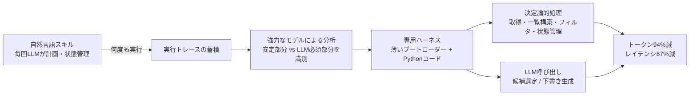
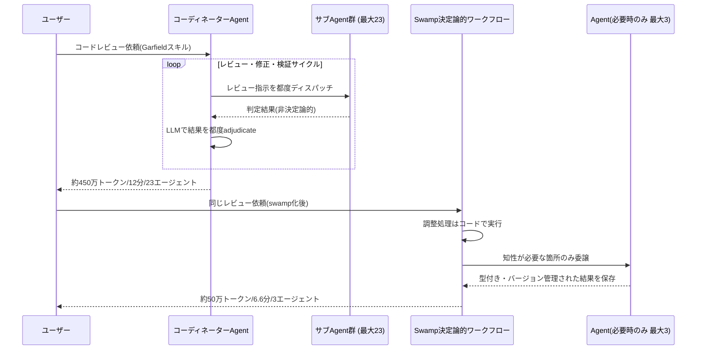
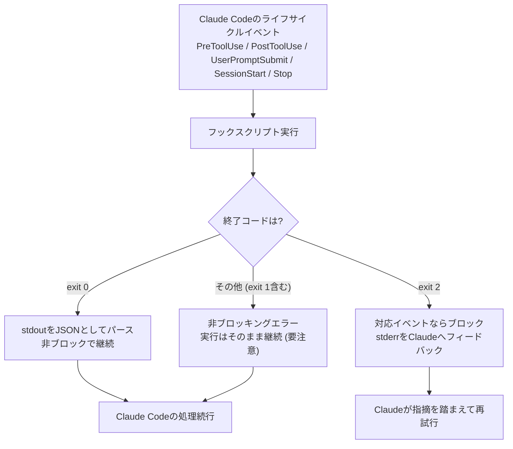

# Daily Briefing 2026-08-13

## 1. AIエージェントのトークン使用量を94%削減した話（原題: How I Cut an AI Agent's Token Use by 94%）

- **URL**: https://vivekhaldar.com/articles/compiling-an-ai-agent-skill/
- **公開日**: 2026-07-13
- **著者・媒体**: Vivek Haldar（個人ブログ）

### 本文翻訳
著者はかねてより「専用ハーネス（specialized harness）」と、それをタスク仕様から「コンパイル」するという発想について書いてきたが、それが抽象的に聞こえがちなので、日々運用している具体例を紹介する。

著者には、自分の過去のブログ記事を検索し、再投稿する価値のあるものを見つけ、直近で言及していないか確認したうえでLinkedIn投稿の下書きを作る「Agent Skill」がある。下書きは自動投稿されず、多くは自分の言葉で書き直すためのきっかけとして使う。

元のバージョンはすべて自然言語の指示として書かれたAgent Skillだった。検索対象のソース、直近履歴のチェック方法、選定基準、最終的な下書きの形を記述しており、実行のたびにエージェント（現在はCodex）はその指示を解釈し、計画を立て、ツールを呼び出し、ワークフローの状態を管理する必要があった。これは最初のバージョンを作る上では良いやり方だった。自然言語なら発想を表現しやすく、変更もしやすい。

しかし、このスキルは何度も実行されるうちに、その挙動の大半がもはや探索的ではなくなっていることに気づいた。毎回同じ場所を検索し、同じコンテンツ一覧を作り、同じ「直近投稿」フィルタを適用し、同じ中間状態を保存する。これらは毎回ゼロから推論し直す必要がなく、LLMすら不要な部分も多い。

LLMが本当に必要なのは次の2ステップだけだった。
1. フィルタ済みの候補一覧から良い候補を選ぶこと
2. LinkedIn用の下書きを書くこと

それ以外はすべて通常の決定論的なコードにできる。そこで著者はこのスキルを専用ハーネスへと「コンパイル」した。新しいスキルはもはやスキルと呼べるほどのものではなく、Pythonプログラムを呼び出す薄いブートローダーになった。そのプログラムが既知のソースを取得し、一覧を構築し、直近投稿をチェックし、フィルタを適用し、ワークフローを管理する。LLMを呼ぶのは選定と生成の2箇所だけである。

結果は劇的だった。トークン数94%削減、レイテンシ87%削減、出力品質はほぼ同等。モデルを安価なものに置き換えたわけではなく、選定・生成のステップは同じモデルを使い続けている。節約分は、コードで代替可能だったモデル呼び出しをすべて取り除いたことによるものだ。

「コンパイル」とは、以前のスキル実行履歴（トレース）を、元のスキルおよび専用ハーネスに関する著者の考察と一緒に強力なモデルに渡し、「どのステップが本当にLLMを要するか」「どのステップが十分に安定してコード化できるか」を識別させ、専用ハーネスを構築させることを指す。自然言語スキルが高水準の仕様として機能し、トレースがモデルの推論の結果得られた運用上の詳細を供給する。

推奨されるパターンは次の5段階である。
1. ワークフローを自然言語スキルとして表現する
2. 何度も実行してトレースを集め、挙動を洗練させる
3. 安定・決定論的になった部分を見つける
4. それらをコードにコンパイルする
5. 意味的判断が必要な少数の箇所だけにLLM呼び出しを残す

コンパイル自体には一度きりのコストがかかるが、それは何百回・何千回もの実行にわたって償却される。著者はローカルエージェントを好むようになった理由の一つとして、スキルやトレース、状態、過去実行の成果物が蓄積され、それがハーネス自体を改善する材料になる点を挙げている。

最後に著者は、この種の最適化がモデルベンダー自身から積極的に提案されることは期待していないと述べる。彼らのビジネスはトークンを売ることだからだ。品質を保ったままトークン消費を94%削減する手法は、トークン使用量に比例して収益が伸びる企業の経済合理性に反する。だからこそ、繰り返し実行されるエージェントワークフローを調べ、決定論的な部分をコードへ移す専用ハーネスやコンパイラを作る余地が、ユーザーや独立系の開発者に大きく開かれている。

### 重要ポイント
- 自然言語スキルは最初のバージョンを素早く作るには適しているが、何度も実行されるうちに挙動の大半は「決定論的」になっていく
- 過去のトレース＋自然言語スキル＋設計思想を強力なモデルに渡し、LLMが本当に必要な箇所だけを見極めさせて専用ハーネス（コード）に「コンパイル」する
- 94%のトークン削減・87%のレイテンシ削減を、モデルを変えずに達成した（決定論的にできる処理からLLM呼び出しを取り除いただけ）
- 「まず自然言語で流動的に作り、安定してから最適化する」という順序が重要。最初から専用ハーネスを書くのは時期尚早
- モデルベンダーはトークン消費を減らすインセンティブが薄いため、この種の最適化はユーザー・開発者側から生まれる

### 図解


### 現場での適用方法
毎日・毎週回している自動化スキルを「トレース収集 → 決定論的コードへの切り出し」の手順で棚卸しする運用手順として導入する。

```markdown
# CLAUDE.md への追記例

## 定型スキルのコンパイル運用
- 新しい自動化スキルは、まず自然言語（SKILL.md）で実装し、最低10回以上実行してトレースを集めてから最適化を検討する
- スキルの各ステップを「毎回同じ手順を踏むだけの決定論的な処理」と「文脈依存の判断が要るLLM必須処理」に分類する
- 決定論的な処理はPythonスクリプト等に切り出し、SKILL.mdはそのスクリプトを呼ぶ薄いブートローダーにする
- コンパイル対象を選ぶ基準: 直近5回の実行ログを見て、毎回ほぼ同じツール呼び出し・分岐をしているステップがあれば候補にする
```

```bash
# 運用手順（コマンド付き）
# 1. 対象スキルの実行ログ（トレース）を集める
mkdir -p ./traces
cp ~/.codex/sessions/<SKILL_NAME>/*.jsonl ./traces/

# 2. トレースとSKILL.mdを渡し、安定部分/LLM必須部分の切り分けを依頼する
claude "以下のSKILL.mdと過去10回分のトレース(./traces/)を読み、
毎回同じ処理になっている決定論的なステップと、
文脈判断が必要でLLM呼び出しが必須なステップに分類してください。
決定論的な部分はPythonスクリプトとして切り出し、
SKILL.mdはそのスクリプトを呼ぶだけの薄い手順書に書き換えてください。" \
  --file <SKILL_PATH>/SKILL.md

# 3. 生成されたスクリプトとSKILL.mdの差分をレビューし、
#    旧バージョンと新バージョンでトークン数・実行時間を比較する
```

### 期待効果
記事の実例ではトークン94%削減、レイテンシ87%削減を、出力品質をほぼ落とさずに達成している。日次・週次で回している定型的な自動化スキルほど効果が大きい。

### 注意点
- コンパイルには「強力なモデル＋十分な量のトレース」という一度きりのコストがかかる。実行回数が少なく安定していないスキルには不向き
- 「意味的判断」が必要な部分（候補選定・文章生成など）まで無理にルールベース化すると品質が落ちる。LLMが必要な箇所を見誤らないことが重要
- ローカルにトレースが蓄積される運用（ローカルエージェント）でないと、この手法の材料（過去の実行履歴）が手に入りにくい

---

## 2. トークン消費を実践的に削減するガイド（原題: A Practical Guide to Reducing Token Spend）

- **URL**: https://www.adamhjk.com/blog/a-practical-guide-to-reducing-token-spend/
- **公開日**: 2026-07-16
- **著者・媒体**: Adam Jacob（個人ブログ）

### 本文翻訳
著者は、スキルだけでAIエージェントに複雑なワークフローとロジックを埋め込むのは著しく非効率だと主張する。「swamp workflow」という仕組みを使うことで、複雑なコードレビュー処理のトークン使用量を8倍、実行時間を2倍削減できたという。

きっかけは、Sentryの創業者David Cramerが「We Can't Afford Your Inference（推論費用が払えない）」という投稿で、週1万ドル超をトークン代に費やしたと明かしたことだった。Cramerは「1週間あたり開発者1人1000ドルは想定していたが、1日1000ドルは想定外だった」と述べ、新しいモデルは広く使うには高価すぎるとの結論に達した。彼はコストの大きな要因として、コーディング規約の遵守を確認する適応型コードレビュー「Garfieldスキル」を挙げた。

著者がCodex上でGarfieldスキルを代表的な問題に対して実行したところ、コーディネーターエージェントが一連のサブエージェントを繰り返しディスパッチし、各サブエージェントがコードをレビューしてコーディネーターに判定を返す、というレビュー・修正・検証ループになっていた。最終的に約450万トークンを使用し、実行時間は約12分、サブエージェント総数は23だった。Garfieldの優れている点は、LLM自身の知性を使ってコードを評価し、自らの成果を再評価し、目標が達成されたかを判断できることだが、その分「非決定論的な判定者に、他の非決定論的な処理の結果を評価させる」という、最も高コストなループになっていた。

著者はこれをswamp extensionに翻訳することで経済性を大きく変えられると考えた。同等の機能を持つswampワークフローは、トークン使用量が約50万（約8倍削減）、実行時間は約6.5分（半減）、エージェント数は3にまで減った。swampモデルはコーディネーターの調整作業を決定論的コードとして扱い、知性が必要な部分だけをエージェントに委ね、成果を決定論的に評価する。各サブエージェントの結果は型付きでバージョン管理されたデータとして保存され、過去の作業履歴を参照できるため、無駄な手戻りを避けられる。

具体的な手順は以下の通り。
- **ステップ0**: swampをインストールし（`curl -fsSL https://swamp-club.com/install.sh | sh`）、既存のエージェント/スキル実装のコードベースで `swamp repo init --tool codex` を実行してswampリポジトリとして初期化する
- **ステップ1**: 対象スキルの現在の挙動を理解する。自分でスキルを読み、Codexに「skillを読んで、実際の挙動をASCII図で説明して」と依頼して理解を確認する
- **ステップ2**: 対象スキルをswamp extensionに翻訳する。まず包括的な実装計画を立てさせ、計画がスキル本来の「意図した結果」を正しく反映しているかをレビューしてから実装させる
- **ステップ3**: 旧スキルと新swampワークフローの両方を実行し、成功可否・トークン数・実行時間を測定するブラックボックスの受け入れテストを書かせる
- **ステップ4**: テスト結果を基にリファクタリングを繰り返す

ベンチマークでは、`contained-dry-run`ケースでGarfieldスキルが463万9565トークン・23エージェント・12.8分、swampワークフローが50万6484トークン・3エージェント・6.6分。より複雑な`payment-idempotency`ケースでは両方とも失敗したが、Garfieldスキルは問題を見逃したまま「成功」と誤判定する「失敗がオープンに倒れる」挙動を示したのに対し、swampワークフローは未解決の指摘が残っていることを正しく報告する「失敗がクローズに倒れる」挙動を示した。

著者は「エージェントを使って、エージェント自体への依存を最小化するプログラムを構築する」ことが核心だと結論づけている。

### 重要ポイント
- コーディネーターエージェントが非決定論的な判定を繰り返す設計（Garfieldスキル）は、23サブエージェント・約450万トークン・12分という高コストな構造になっていた
- 決定論的に書けるコーディネーション処理をコード化し、知性が必要な部分だけをエージェントに残す「swamp workflow」化で、トークン8倍減・実行時間半減を実現
- 移行手順は「現状理解→swamp拡張への翻訳（計画レビュー付き）→ブラックボックステストで新旧比較→リファクタリング」の4ステップ
- ベンチマークで判明した重要な副産物として、決定論的ワークフローは「未解決のまま」を正しく報告する（失敗がクローズに倒れる）のに対し、元のスキルは見逃しを「成功」と誤判定していた（失敗がオープンに倒れる）
- 「エージェントでエージェント要らずのプログラムを作る」という発想が、繰り返し実行されるワークフローのコスト構造を根本的に変える

### 図解


### 現場での適用方法
既存の「コーディネーターAgent＋複数サブAgent」型スキルを、決定論的ワークフローへ移行する運用手順として提示する。

```bash
# 運用手順: 既存スキルをswamp workflow化する

# Step 0: swampインストールとリポジトリ初期化
curl -fsSL https://swamp-club.com/install.sh | sh
cd <REPO_PATH>
swamp repo init --tool codex   # 使用中のharness(codex/claude等)を指定

# Step 1: 現状の挙動を理解する
claude "<SKILL_PATH>のskillを読んで、その挙動と実行時の解釈のされ方を
ASCII図を使って要約してください。"

# Step 2: swamp extensionへの翻訳計画を立てさせ、レビューしてから実装させる
claude "<SKILL_PATH>のskillをswamp extensionに翻訳してください。
目標は、決定論的コードで表現できる部分をできるだけ直接swampの
modelとworkflowに落とし込むことです。まず包括的な実装計画を
提示し、私のレビューを待ってください。"
# -> 計画が「意図した結果」を正しく反映しているかを確認してから実装を進める

# Step 3: 旧スキルとswampワークフローを比較するブラックボックステストを作らせる
claude "既存のskillと新しいswamp workflowの両方を実行する
ブラックボックス受け入れテストを書いてください。
成功可否・トークン使用量・実行時間を測定し、改善率を報告してください。"

# Step 4: テスト結果に基づきリファクタリングを繰り返す
# (未解決の指摘を握りつぶしていないか等、失敗の倒れ方を優先的にチェックする)
```

### 期待効果
記事の実例ではトークン使用量8倍削減（約4.6M→約0.5Mトークン）、実行時間が約12分から約6.6分へ半減、サブエージェント数が23から3に削減された。副次効果として、決定論的ワークフロー化により「見逃しを成功と誤判定する」失敗モードも改善された。

### 注意点
- 本手法はswamp（外部の専用ツール／製品）の利用を前提としており、同種の効果を得るには自前でコーディネーション層をコード化する設計力が必要
- より複雑なケース（記事中の`payment-idempotency`）では新旧どちらの方式も完全には成功しておらず、決定論的ワークフロー化がすべての問題を解決するわけではない
- 移行の初手では「現状の挙動を正しく理解する」ことが必須で、これを怠ると翻訳後のワークフローが元の意図とズレるリスクがある

---

## 3. Claude Codeフックの仕組み解説（原題: Claude Code Hooks Explained: The Deterministic Layer Around Your Agent）

- **URL**: https://blakecrosley.com/blog/claude-code-hooks-explained
- **公開日**: 2026-07-01
- **著者・媒体**: Blake Crosley（個人ブログ）

### 本文翻訳
フックとは、Claude Codeがライフサイクル上の決まったタイミングで自動的に実行するユーザー定義のシェルコマンド（加えてHTTPエンドポイント、MCPツール、モデルプロンプト）である。パーミッションとCLAUDE.md指示に次ぐ第三の制御層であり、モデルの挙動によらず実行が保証される唯一の仕組みだ。

記事は、フックを「非決定論的なコアの周りに保証を作る」ものと位置づける。指示やスキルはモデルが通常従う「提案」に過ぎないが、フックは確実に実行される。フォーマッタは編集のたびに発火し、コマンドガードはBash呼び出しのたびに評価し、完了ゲートは終了のたびにチェックされる。

最も重要な注意点は「exit 1は何もブロックしない」ということだ。サポートされているイベントでアクションをブロックできるのはexit code 2のときだけである。それ以外の終了コードは非ブロッキングのエラーとして扱われ、実行はそのまま継続してしまう。これは開発者が陥りがちな大きな落とし穴だ。

システムには3つの周期にまたがる31のライフサイクルイベントが定義されている。セッション単位（SessionStart、SessionEnd）、ターン単位（UserPromptSubmit、Stop、StopFailure）、ツール呼び出し単位（PreToolUse、PostToolUse）。実運用でよく使われるのはPreToolUse、PostToolUse、UserPromptSubmit、SessionStart、Stopの5つに集中している。

フックはstdinでJSONを受け取る。含まれるのはsession_id、transcript_path、cwd、permission_mode、hook_event_name、およびイベント固有のフィールドだ。exit 0の場合はstdoutをJSONとしてパースし、exit 2の場合はブロック（対応イベントのみ）しつつstderrをClaudeへのフィードバックとして使う。それ以外の終了コードは非ブロッキングエラーとして扱われる。

記事では5つの実用パターンを紹介している。
1. **編集後の自動フォーマット**: PostToolUseでEdit|Writeにマッチさせ、`jq`で対象ファイルパスを取り出しprettierを実行する
2. **危険なコマンドのブロック**: `rm -rf`や`git push --force`、`DROP TABLE`などのパターンをBashガードスクリプトで検出し、exit code 2で実行を防ぎつつエラー説明をClaudeに返す
3. **セッションコンテキストの注入**: SessionStartフックがプレーンテキストを出力すると、それがClaudeが参照できるコンテキストになる。現在のgitブランチや未コミットファイル数のような動的な状態は、静的なCLAUDE.mdではなくここに置くべき
4. **完了ゲート（Stopイベント）**: Claudeが完了と判断する前にテストを実行するゲートスクリプト。無限ループを防ぐために`stop_hook_active`をチェックし、テストが通るまで`decision: "block"`で作業継続を強制する
5. **ディスパッチャーパターン**: イベントごとに1つのマスターディスパッチャースクリプトを登録し、`.claude/hooks/{EventName}/`配下の小さく組み合わせ可能なフックスクリプトへルーティングする。これによりsettings.jsonの肥大化を防ぎ、個々のスクリプトをテスト可能に保てる。

パーミッションとフックの相互作用にも触れている。PreToolUseフックはパーミッションモードのチェックより先に発火するため、フックのdeny判定は`bypassPermissions`モードでも呼び出しをブロックできる。逆にフック側の許可がsettingsのdenyルールを上書きすることはできない。フックはポリシーを厳しくすることしかできず、緩めることはできない。複数のPreToolUseフックが競合した場合の優先順位は deny > defer > ask > allow である。

ハンドラの種類はcommand（シェル）、HTTP（POSTエンドポイント）、MCPツール、prompt（単発のモデル呼び出し）、agent（アクセス制限付きサブエージェント）の5種類。デフォルトのタイムアウトはcommand/HTTP/MCPが600秒、promptが30秒、agentが60秒で、UserPromptSubmitなど一部のイベントはさらに短い上限（30秒・10秒）になる。

フックには制約もある。ツールやスラッシュコマンドを呼び出せない、PostToolUseで結果を取り消すことはできない（防止はPreToolUseで行う必要がある）、PreToolUseでは@参照ファイルが見えない、並列の`updatedInput`書き換えでは信頼性が保証されない、タイムアウトを迎えると遅いゲートはゲートとして機能しなくなる、出力は10,000文字が上限で超過分はファイルに書き出される、フックはユーザーのフルシステム権限で実行されるためセキュリティレビューが不可欠、といった点だ。

最後に、フック・CLAUDE.md・スキル・メモリの使い分けを提示する。フックは「強制」（スキップされると困る安全性やフォーマット）、CLAUDE.mdは「指針」（モデルが知っておくべき慣習）、スキルは「能力」（手順とスクリプトを伴う処理）、メモリは「想起」（あるセッションで学んだことを後で使う）。判断基準は「モデルが一度でも無視したら事故になるなら、フックとして実装する。迷惑レベルのものはCLAUDE.mdに書く」というものだ。

よくある落とし穴として、ポリシー系フックでexit 1をexit 2の代わりに使ってしまう、exit 0以外でJSON出力を期待してしまう、大文字小文字を区別するマッチャーの不一致、起動時にechoするシェルプロファイルがJSON出力を壊す、`stop_hook_active`をチェックしないStopフックがリトライ上限を消費してしまう、同じツール入力を巡って並列フックの書き換えが競合する、の6点が挙げられている。

### 重要ポイント
- フックは「モデルが従うかもしれない提案」ではなく「必ず実行される決定論的レイヤー」であり、パーミッション・CLAUDE.mdに次ぐ第三の制御層
- 最重要の落とし穴は「exit 1はブロックしない、ブロックできるのはexit 2だけ」という終了コードの仕様
- 実運用で使われる5大イベントはPreToolUse・PostToolUse・UserPromptSubmit・SessionStart・Stopに集中する
- PreToolUseフックのdeny判定はbypassPermissionsモードでも有効（フックは常にポリシーを厳しくする方向にしか働かない）
- 判断基準は明快：「モデルが一度無視したら事故になるものはフック、迷惑で済むものはCLAUDE.mdに書く」

### 図解


### 現場での適用方法
危険コマンド防止と完了ゲートの2種類のフックを、そのまま導入できる形で示す。

```json
// .claude/settings.json への追記例
{
  "hooks": {
    "PreToolUse": [
      {
        "matcher": "Bash",
        "hooks": [
          {
            "type": "command",
            "command": "<REPO_PATH>/.claude/hooks/pretooluse/bash-guard.sh"
          }
        ]
      }
    ],
    "PostToolUse": [
      {
        "matcher": "Edit|Write",
        "hooks": [
          {
            "type": "command",
            "command": "jq -r '.tool_input.file_path' | xargs npx prettier --write"
          }
        ]
      }
    ],
    "Stop": [
      {
        "hooks": [
          {
            "type": "command",
            "command": "<REPO_PATH>/.claude/hooks/stop/completion-gate.sh"
          }
        ]
      }
    ]
  }
}
```

```bash
#!/usr/bin/env bash
# <REPO_PATH>/.claude/hooks/pretooluse/bash-guard.sh
# 危険なコマンドをブロックする。exit 2でなければブロックされない点に注意。
input=$(cat)
command=$(echo "$input" | jq -r '.tool_input.command // empty')

if echo "$command" | grep -qE 'rm -rf|git push --force|DROP TABLE'; then
  echo "危険なコマンドを検出したためブロックしました: $command" >&2
  exit 2
fi
exit 0
```

```bash
#!/usr/bin/env bash
# <REPO_PATH>/.claude/hooks/stop/completion-gate.sh
# テストが通るまで完了させない完了ゲート。無限ループ防止に stop_hook_active を必ずチェックする。
input=$(cat)
stop_hook_active=$(echo "$input" | jq -r '.stop_hook_active // false')

if [ "$stop_hook_active" = "true" ]; then
  exit 0
fi

if ! npm test --silent; then
  echo '{"decision":"block","reason":"テストが失敗しています。修正してから完了してください。"}'
  exit 0
fi
exit 0
```

### 期待効果
フォーマッタ・危険コマンドブロック・完了ゲートをフック化することで、モデルの挙動に依存せず「必ず守られるルール」を実現できる。記事の枠組みに従えば、CLAUDE.mdに書くだけでは守られなかった規約が、フック化により100%の確実性で強制される。

### 注意点
- exit 1とexit 2を混同するとブロックしたつもりが素通りする。ポリシー系フックは必ずexit 2を返すこと
- フックはユーザーのフルシステム権限で動くため、外部から渡される`tool_input`の値をそのままシェルに展開しない等、スクリプト自体のセキュリティレビューが必須
- Stopフックで`stop_hook_active`をチェックし忘れると、完了ゲートが無限ループしリトライ上限を消費する
- タイムアウト（commandは600秒など）を超えると「遅いゲート」は機能しなくなるため、重いテストをゲートに使う場合は時間設計に注意する
