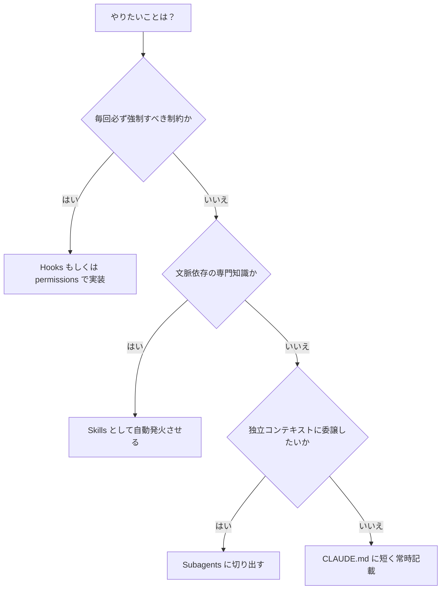
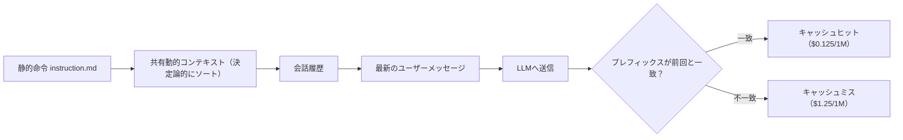
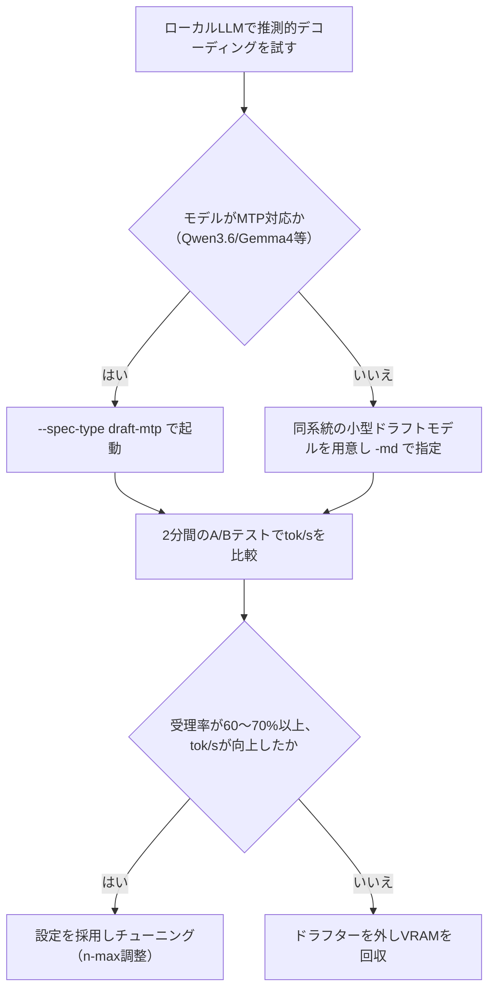

# Daily Briefing 2026-08-14

## 1. Claude Codeの上級ベストプラクティス：Hooks・Subagents・コンテキスト管理のための11の実践手法（原題: Claude Code Advanced Best Practices: 11 Practical Techniques for Hooks, Subagents & Context Management）

- **URL**: https://smartscope.blog/en/generative-ai/claude/claude-code-best-practices-advanced-2026/
- **公開日**: 2026-07-06
- **著者・媒体**: SmartScope Blog（著者名非公開）

### 本文翻訳
本記事は「制約はプロンプトではなくシステムで実装すべき」というパラダイムシフトを軸に、Claude Codeの4つの機能（Hooks／Subagents／Skills／CLAUDE.md）の使い分けを11の手法として整理する。

まず判断基準として、「規則が必須なら Hooks か permissions、状況依存の知識なら Skills、独立したコンテキストへの委譲なら Subagents、常時有効なプロジェクト指針なら CLAUDE.md を短く保つ」という原則を示す。Hooksは PreToolUse/PostToolUse などのタイミングで決定論的に発火し、毎回確実に実行される点でCLAUDE.mdの「助言的」な指示と対照的である。例としてセンシティブファイル（.env, .key, .pem）への書き込みをブロックするシェルスクリプトと、それを `settings.json` の `PreToolUse` フックに登録する設定を提示。exit code 2 でブロックされる点、旧来の `decision/reason` 形式は非推奨である点が強調される。

Subagentsは `.claude/agents/` に定義し、それぞれ独立したコンテキストウィンドウとツールセットを持つ。探索・検証・レビューをメインの会話から分離することで、メインコンテキストの汚染を防ぐ。Skillsは `.claude/skills/<name>/SKILL.md` にYAML frontmatter（name, description）と本文を置き、関連する文脈が生じたときに自動的に読み込まれる点でスラッシュコマンド（明示的実行）と異なる。危険な操作（本番デプロイなど）には `disable-model-invocation: true` を指定し、モデルによる意図しない自動発火を防ぐ。

CLAUDE.mdについては「長いほど良い」ではなく簡潔性こそ性能要件だと指摘し、各指示を「削除したらClaudeは誤るか」「他の場所（README・Skills）で代替できるか」「常に必要か特定文脈のみか」の3問で棚卸しするフレームワークを提示する。

権限管理では、許可コマンドのallowlistとOSレベルのsandboxを組み合わせ、承認疲れによる「なんでもクリックしてしまう」リスクを下げる。permissionsは `deny → ask → allow` の順で評価され、`.env` などを `deny` に設定するとHooksでブロックするより安全（Claudeから見えなくなる）と説明する。`--dangerously-skip-permissions` はネットワーク接続のない隔離環境でのみ許容されるべきとし、組織全体で禁止するための `disableBypassPermissionsMode: true` 設定にも触れる。

運用面では、著者独自のルールとして「同じ問題で2回失敗したら `/clear` して再開する方が速い」という経験則、`/compact` に要約方針（保持したい情報）を指示できること、Checkpointsが会話とコードを独立にロールバックできること、仕様策定セッションと実装セッションを分けてSPEC.mdを介して引き継ぐパターン、Writer/Reviewerや先にテストを書く役割分担をgit worktreeで物理的に分離する並列セッション活用、そして少数ファイルで検証してから `--allowedTools` と `--output-format json` を指定して無人的に全体展開する「ファンアウト」パターンが紹介されている。

### 重要ポイント
- Hooksは「必須の制約」、CLAUDE.mdは「助言的な指示」という役割分担が性能を左右する
- CLAUDE.mdは「削除しても誤らないか」で棚卸しし、簡潔性を性能要件として扱う
- permissionsの評価順序は deny → ask → allow。センシティブファイルはdenyで「不可視化」する方が安全
- 仕様策定と実装を別セッションに分け、SPEC.mdで引き継ぐと手戻りが減る
- 並列セッションはgit worktreeで物理分離し、Writer/Reviewerなど役割を分けるとバイアスを避けられる

### 図解


### 現場での適用方法

**スクリプト化の例（センシティブファイル書き込みブロックのHook）**
```bash
#!/bin/bash
# ./scripts/block-sensitive-writes.sh
set -euo pipefail

INPUT="$(cat)"
TOOL="$(echo "$INPUT" | jq -r '.tool // empty')"
FILE_PATH="$(echo "$INPUT" | jq -r '.tool_input.file_path // .tool_input.path // empty')"

if [[ "$TOOL" =~ ^(Write|Edit)$ ]] && echo "$FILE_PATH" | grep -qE '\.(env|key|pem)$'; then
  echo "Blocked: sensitive file write is not allowed: $FILE_PATH" >&2
  exit 2
fi

exit 0
```

`<REPO_PATH>/.claude/settings.json` への追記:
```json
{
  "permissions": {
    "allow": ["Bash(npm run lint:*)", "Bash(npm run test:*)", "Read", "Glob", "Grep"],
    "ask": ["Bash(git push:*)"],
    "deny": ["Read(./.env)", "Read(./.env.*)", "Read(./secrets/**)"]
  },
  "hooks": {
    "PreToolUse": [
      { "matcher": "Write|Edit", "hooks": [{ "type": "command", "command": "./scripts/block-sensitive-writes.sh" }] }
    ]
  }
}
```

**CLAUDE.mdへの追記例（compactポリシーの明示）**
```markdown
## Compact 指示
この会話を要約するとき:
- すべてのAPI変更とその根拠を保持
- エラーメッセージとその解決策を保持
- 修正したファイルのリストを保持
- 探索の試行錯誤は簡潔に要約する
```

### 期待効果
Hooksによる決定論的な制御でセキュリティ・lint等の抜け漏れがなくなり、Subagentsによるコンテキスト分離でメインセッションの汚染が減る。CLAUDE.mdの棚卸しにより指示の遵守率が上がる（長すぎるCLAUDE.mdは指示無視の確率を高めると指摘）。ファンアウトパターンでは、2〜3ファイルでの試験を経てから全体展開することで大規模移行の失敗率を下げられる。

### 注意点
「2回失敗したら/clear」は著者個人の運用ルールであり公式ベストプラクティスではない。`--dangerously-skip-permissions` は本番環境や機密データのある環境では使用しないこと。Hooksの戻り値は `decision/reason` 形式が非推奨化されており、exit code方式（0=許可、2=ブロック）に統一する必要がある。Checkpointsはgitの代替ではなく、外部プロセスによる変更は追跡されない点に注意。

---

## 2. 本番AIエージェントの入力コストをプロンプトキャッシュで77%削減した方法（原題: How prompt caching cut our production AI agent input costs by 77%）

- **URL**: https://derivai.substack.com/p/prompt-caching-production-ai-agent-costs
- **公開日**: 2026-07-23
- **著者・媒体**: Osama Ghazal（Deriv, シニアAIエンジニア）／ Substack「Derivai」

### 本文翻訳
著者はDerivの本番AIエージェントにおいて、プロンプトキャッシュを「機能を有効にするだけ」ではなく「アーキテクチャ設計の問題」として扱うことで、入力コストを77%削減した経緯を報告する。月間30億トークンを処理する想定で、キャッシュ未使用時のコストは月$37,500。単純にキャッシュ機能を有効化しただけ（構造が不適切）の場合はヒット率が約20%にとどまり月$30,750。一方、以下の4ステップで構造を最適化した結果、キャッシュヒット率85.8%を達成し、月$8,540まで削減された（差額は月あたり約$22,210）。

**ステップ1: 静的命令と動的コンテキストの分離。** 安定した命令文は `instruction.md` として保存し `static_instruction` として処理パイプラインに渡す。リクエストごとに変わる情報は `DYNAMIC_CONTEXT_TEMPLATE` として別途レンダリングする。

**ステップ2: 共有コンテキストを会話履歴より前に配置。** 従来のデフォルト実装では動的な命令が会話履歴の後ろに置かれていたため、ユーザーごとに異なる部分が前方に来てキャッシュのプレフィックス一致が崩れていた。`relocate_dynamic_instruction` という処理を導入し、最終的なプロンプト構造を「① 静的命令 → ② 共有動的コンテキスト → ③ 会話履歴 → ④ 最新のユーザーメッセージ」の順に固定した。

**ステップ3: プロンプトブロックの決定論的な生成。** Skillsの読み込み順序によってブロックのレンダリング順序が変わり、意味的には同じでもバイト列が一致せずキャッシュミスが発生していた。Skill名でソートしてからレンダリングし、セット・マップ・DB検索結果・ツール定義など順序が保証されないデータ構造もすべて決定的な順序で出力するようにした。

**ステップ4: 本番環境でのキャッシュヒット率の継続監視。** 各リクエストについて「キャッシュ入力トークン ÷ 総入力トークン × 100」でヒット率を計算し、時系列で追跡する。価格計算式は「入力コスト = (非キャッシュトークン数 × $1.25/100万トークン) + (キャッシュトークン数 × $0.125/100万トークン)」。キャッシュトークンは無料ではなく10分の1の割引価格であるため、85.8%のヒット率がそのまま77%のコスト削減率にはならない点が説明されている。経験則として「月間節約額 ≈ 月間入力トークン数（十億単位）× キャッシュヒット率 × $1,125」という概算式も提示される。

### 重要ポイント
- プロンプトキャッシュは機能のON/OFFではなく、プロンプト構造の設計問題として扱う
- 静的命令 → 共有動的コンテキスト → 会話履歴 → 最新メッセージ、の順にプレフィックスを固定するとヒット率が上がる
- Skill名やデータ構造の出力順序を決定論的にすることでバイト単位のキャッシュ一致率が向上する
- キャッシュヒット率とコスト削減率は別物（キャッシュトークンは無料ではなく割引価格）
- 本番ではヒット率を継続監視し、回帰（低下）を検知する仕組みが必要

### 図解


### 現場での適用方法

**スクリプト化の例（プロンプト組み立てとヒット率計測）**
```python
# prompt_builder.py
import hashlib
import json

def build_prompt(static_instruction: str, dynamic_context: dict, history: list, user_message: str) -> str:
    # dynamic_context のキーを決定論的にソートしてから結合する
    sorted_context = json.dumps(dynamic_context, sort_keys=True, ensure_ascii=False)
    parts = [
        static_instruction,        # 1. 静的命令（instruction.md の内容）
        sorted_context,            # 2. 共有動的コンテキスト（会話履歴より前に配置）
        *[f"{m['role']}: {m['content']}" for m in history],  # 3. 会話履歴
        f"user: {user_message}",   # 4. 最新のユーザーメッセージ
    ]
    return "\n".join(parts)

def record_cache_hit_rate(cached_tokens: int, total_input_tokens: int) -> float:
    rate = cached_tokens / total_input_tokens * 100
    # <METRICS_ENDPOINT> へ送信し、時系列でダッシュボード監視する
    return rate
```

**CLAUDE.md への追記例**
```markdown
## プロンプト構築ルール（キャッシュ最適化）
- LLM呼び出し用プロンプトを組み立てる際は、必ず「静的命令 → 共有動的コンテキスト → 会話履歴 → 最新メッセージ」の順序を守ること
- 動的コンテキストに辞書・セット・DB検索結果を含める場合は、キーやIDでソートしてから文字列化すること（順序が非決定的だとキャッシュヒット率が悪化する）
- 新しいプロンプトテンプレートを追加したら、cached_tokens / total_input_tokens の比率を計測し <METRICS_ENDPOINT> に記録すること
```

### 期待効果
記事の実測値では、月間30億トークン処理の環境でキャッシュヒット率20%→85.8%への改善により、月間コストが$30,750→$8,540（総額比で約77%削減、差額換算で月$22,210）となった。プレフィックス一致率が上がることでレイテンシ改善（TTFB短縮）も副次的に期待できる。

### 注意点
キャッシュトークンは無料ではなく約1/10の割引価格であるため、ヒット率とコスト削減率を混同しないこと。キャッシュ書き込みは通常より高コスト（記事の文脈では読み取りとのブレークイーブンは複数回の再利用後）になるため、再利用頻度が低いプレフィックスまで無理にキャッシュ化すると逆効果になりうる。構造変更後も継続的にヒット率を監視し、Skill追加やデータ構造変更で非決定的な出力に戻ってしまう回帰を防ぐ体制が必要。

---

## 3. 2026年のローカルLLM向け推測的デコーディング：トークン/秒を2倍にする設定と、逆効果になるとき（原題: Speculative Decoding for Local LLMs in 2026: The Setup That Doubles Your Tokens per Second (and When It Backfires)）

- **URL**: https://runaihome.com/blog/speculative-decoding-llama-cpp-local-llm-setup-2026/
- **公開日**: 2026-07-04
- **著者・媒体**: RunAIHome Team

### 本文翻訳
推測的デコーディングは、小さな「ドラフト」モデルに複数トークンをまとめて推測させ、大型モデル（ターゲット）がそれを一括検証することで生成速度を1.5〜3倍に高速化する技術。数学的にはロスレスで、ターゲットモデルが全トークンを検証するため出力品質は単体実行と同一、変わるのは速度のみである。2026年にはQwen3.6・Gemma 4に複数トークン予測（MTP）用のヘッドが組み込まれ、別途ドラフトモデルを用意しなくてもセットアップが簡素化された。ただし制約のある環境ではむしろ遅くなる場合がある。

llama.cppでは2026年にフラグ名が変更され、`--draft-max`→`--spec-draft-n-max N`（ステップあたり最大ドラフトトークン数、デフォルト3）、`--draft-min`→`--spec-draft-n-min N`、`--draft-p-min`→`--spec-draft-p-min P`となった。推測方式は `--spec-type [draft|draft-mtp|draft-eagle3|ngram-simple]` で指定する。

**従来型（別モデルドラフト）**では、トークナイザー・語彙が一致する同系統の小型モデルが必須（例: Llamaターゲットには必ずLlamaドラフター）。コマンド例は `./llama-server -m Llama-3.1-8B-Instruct-Q4_K_M.gguf -md Llama-3.2-1B-Instruct-Q4_K_M.gguf -ngl 99 -ngld 99 -fa on -c 8192 --spec-draft-n-max 8 --spec-draft-n-min 1 --port 8080`。`-md`でドラフトGGUFを指定、`-ngld 99`でドラフトの全レイヤーをGPUに配置、`-fa on`はバッチ検証に必要なFlash Attentionを有効化する。DataCampの計測ではLlama 3.1 8B＋Llama 3.2 1Bの組み合わせ（ドラフト長5）で1.83倍のスループット、RTX 4090では130 tok/sから180 tok/s超に向上したと報告されている。

**MTP方式**はllama.cppで`--spec-type draft-mtp`として実装され、別モデル不要（Qwen3.6は分離したMTP GGUFが必要）。コマンド例は `./llama-server -m Qwen3.6-27B-Q4_K_S.gguf --spec-type draft-mtp --spec-draft-n-max 2 -c 8192 -fa on --temp 0.6 --top-p 0.95 --top-k 20 --min-p 0.0`。`--spec-draft-n-max 2`はMTPドラフターが短いドラフト長に最適化されているため。A10G 24GB環境でQwen3.6-27Bが25→45 tok/s（78%増）、Apple SiliconでGemma 4が「コーディングエージェント用途で約90%高速化」と報告された。

Ollamaは`DRAFT`ディレクティブをModelfileに追加でき（`FROM /path/to/gemma4/main` + `DRAFT /path/to/gemma4/draft`）、`ollama create --experimental -f Modelfile mymodel --quantize nvfp4 --draft-quantize nvfp4`でも構築可能。LM Studioはv0.3.10からGUIでドラフトモデルを選択するだけで有効化できる。

**逆効果になるケース**として、Gemma 4とint4ドラフトの不適切な組み合わせでトークン一致率が41%にとどまり、生成速度が60 tok/sから45 tok/sへ低下した例が紹介される。受理率が60〜70%を下回ると通常は損益分岐を割る。8〜12GB VRAM環境ではドラフトモデルがメモリを圧迫しターゲットのCPUオフロードを誘発するため逆効果になりやすい。創作文のような高エントロピーテキストでは次トークン候補が拮抗し受理率が崩壊する。多数リクエストを同時バッチ処理するサービングではスループット上限に律速されるため恩恵が薄い。

推奨テスト法は「ドラフトあり／なしで同一プロンプトを2分間実行し、サーバーログのtok/sを比較する」こと。改善が見られなければドラフターを外してVRAMを回収すべきとしている。

### 重要ポイント
- 推測的デコーディングは出力品質を変えず速度のみ1.5〜3倍改善する（数学的にロスレス）
- MTP方式（Qwen3.6・Gemma 4）は別モデル不要で導入が容易、従来型は同系統・同語彙の小型ドラフトモデルが必須
- 受理率60〜70%が損益分岐点。低受理率だと逆に遅くなる
- 8〜12GBなど低VRAM環境ではドラフトモデルがCPUオフロードを誘発し逆効果になりやすい
- 導入判断は「2分間のA/Bテストでtok/sを比較する」だけで十分

### 図解


### 現場での適用方法

**スクリプト化の例（起動スクリプトと2分間A/Bテスト）**
```bash
#!/bin/bash
# <MODEL_DIR>/run_spec_decode.sh
# MTP対応モデル（例: Qwen3.6-27B）向けの起動例
./llama-server \
  -m <MODEL_DIR>/Qwen3.6-27B-Q4_K_S.gguf \
  --spec-type draft-mtp \
  --spec-draft-n-max 2 \
  -c 8192 -fa on -ngl 99 \
  --temp 0.6 --top-p 0.95 --top-k 20 --min-p 0.0 \
  --port 8080
```

```bash
#!/bin/bash
# ab_test_spec_decode.sh: 推測的デコーディングの有無を2分間比較する
PROMPT="<TEST_PROMPT_FILE>"

echo "=== ベースライン（推測的デコーディングなし） ==="
timeout 120 ./llama-server -m <MODEL_DIR>/target.gguf -ngl 99 -fa on --port 8081 &
sleep 5
curl -s http://localhost:8081/completion -d "{\"prompt\": \"$(cat $PROMPT)\"}" | tee baseline.log
kill %1

echo "=== 推測的デコーディングあり ==="
timeout 120 ./llama-server -m <MODEL_DIR>/target.gguf --spec-type draft-mtp --spec-draft-n-max 2 -ngl 99 -fa on --port 8081 &
sleep 5
curl -s http://localhost:8081/completion -d "{\"prompt\": \"$(cat $PROMPT)\"}" | tee spec.log
kill %1

echo "サーバーログの tok/s を比較し、改善がなければドラフターを外すこと"
```

### 期待効果
記事内の実測値では、Qwen3.6-27B + MTP（A10G 24GB）で25→45 tok/s（78%増）、同モデルのApple Siliconで約7→16 tok/s（受理率82%）、Llama 3.1 8B + Llama 3.2 1Bドラフトで1.83倍、Gemma 4 + MTP（Apple Silicon MLX）でコーディングエージェント用途において約90%高速化という結果が報告されている。

### 注意点
受理率が60〜70%を下回ると純増ではなく速度低下を招く（記事内の実例では60→45 tok/sに低下）。ドラフトモデルは常にGPU上（`-ngld 99`）に置くこと。8〜12GB VRAMなど余裕のない環境では逆効果になりやすいため事前にVRAM試算が必要。創作文など高エントロピーな出力タスクや、多数リクエストを同時バッチ処理する本番サービングでは恩恵が薄いか無いことがある。従来型ドラフトはターゲットと同系統・同語彙のモデルでなければ受理率が崩壊する点にも注意。
