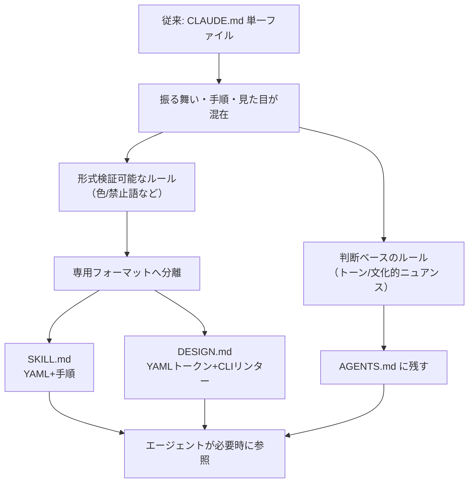
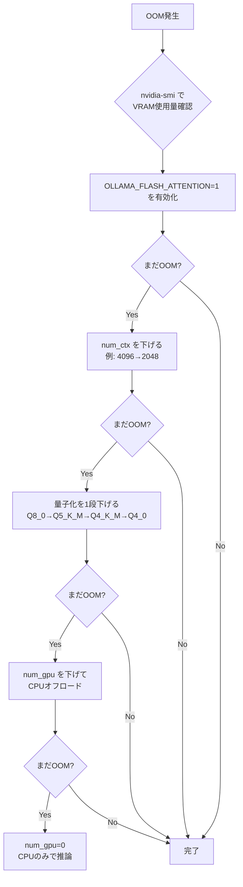
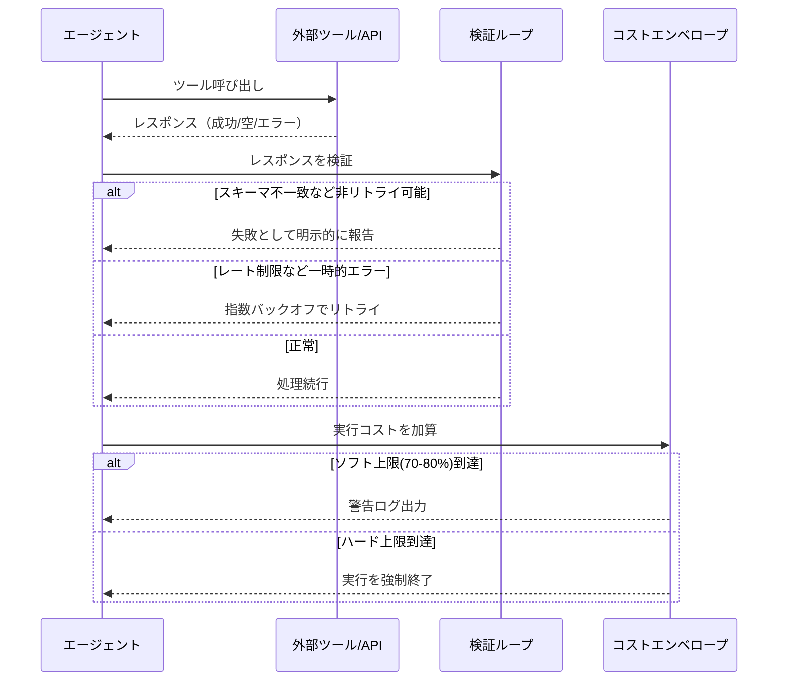

# Daily Briefing 2026-08-15

## 1. AGENTS.md・SKILL.md・DESIGN.md ― AI向け指示書が3つの層に分かれていく（原題: AGENTS.md, SKILL.md, DESIGN.md: How AI Instructions Split into Three Layers）

- **URL**: https://dev.to/aws-builders/agentsmd-skillmd-designmd-how-ai-instructions-split-into-three-layers-d0g
- **公開日**: 2026-05-02（zenn.dev初出、AWS Community Buildersに転載）
- **著者・媒体**: Kento IKEDA / DEV Community（AWS Community Builders）

### 本文翻訳
これまでAIコーディングエージェント向けの指示は、CLAUDE.mdのような単一ファイルに何でも詰め込むのが一般的だった。しかし2026年に入り、この単一ファイルは「振る舞い」「作業手順」「見た目」という性質の異なる3つの関心事を無理に一つにまとめていたことが問題視されるようになり、指示書は3つの専用フォーマットへと分化しつつある。

第一層はAGENTS.md（あるいはCLAUDE.md）で、エージェントの役割・禁止事項・境界線といった「全体の振る舞い」を扱う。この層はほぼ完全に人間可読なテキストで書かれ、文脈的なニュアンスを伝えることに主眼が置かれる。

第二層はSKILL.mdで、Anthropicがagentskills.ioを通じて標準化した、個別タスクの再利用可能な手順や専門知識を記述する層である。YAMLのフロントマターで名前や説明などのメタデータを機械可読に定義しつつ、本文はMarkdownで手順を人間可読に書く、というハイブリッド構造を取る。

第三層はDESIGN.md。2026年4月にGoogle Labsが発表したデザインシステム仕様で、色・タイポグラフィ・スペーシングなどのデザイントークンをYAMLで機械可読に定義し、`npx @google/design.md lint`のようなCLIバリデータで検証可能にする。すでにGitHub上で1万1000スター超を集める実装例が存在し、日本語ローカライズ版（kzhrknt/awesome-design-md-jp）も登場している。

3つの層はいずれも「形式的に検証可能なルール」（色のコントラスト比、禁止語の置換など）と「判断を要するルール」（トーン、文化的ニュアンスなど）を分離しようとする点で共通しており、Spec-Driven Development（Kiro、GitHub Spec Kitなど）とも思想的に近い。ただしSDDの仕様書が一時的な機能記述であるのに対し、この3層構造は長期的に持続するプロジェクトルールを扱う点で性格が異なる。

著者は、既存の巨大なCLAUDE.mdを一気に分割するのではなく、まず「形式的に検証可能な項目」と「判断ベースの項目」を棚卸しし、検証可能なものから段階的に専用フォーマットへ移行する漸進的な移行を推奨している。

### 重要ポイント
- AI向け指示書は「振る舞い（AGENTS.md）」「手順（SKILL.md）」「見た目（DESIGN.md）」の3層に分化しつつある
- DESIGN.mdはYAMLトークン＋CLIリンターで機械的に検証可能、SKILL.mdはYAMLメタデータ＋Markdown手順のハイブリッド構造
- 既存のCLAUDE.mdは「検証可能なルール」と「判断ベースのルール」が混在しており、これが管理を難しくしている
- 移行は一括ではなく、検証可能な項目から段階的に専用ファイルへ抽出するのが現実的
- Spec-Driven Developmentとは「持続するルール」対「一時的な機能仕様」という点で異なる

### 図解


### 現場での適用方法
**スキル化の例**（既存のCLAUDE.mdから検証可能なデザインルールを抽出し、Claude Codeのスキルとして分離する）

```yaml
---
name: design-tokens
description: このプロジェクトの配色・タイポグラフィ・スペーシングのルールを適用する際に使用する。UIコンポーネントの実装・修正時に必ず参照すること。
---
```

続けて本文には、DESIGN.md形式にならい以下の骨子を記述する：
1. 検証可能なトークン定義（color / typography / spacing をYAMLで明示）
2. 各トークンの適用ルール（人間可読な説明）
3. 検証コマンド（例: リポジトリ内のlintスクリプトを呼び出す一文）

**CLAUDE.md への追記例**
```markdown
## 指示ファイルの分離ルール
- 色・命名規則・禁止フレーズなど「機械的に正誤判定できるルール」は
  .claude/skills/design-tokens/SKILL.md に記載する。ここには書かない。
- トーン・優先順位・文化的な配慮など「判断が必要なルール」のみ
  このファイルに残す。
```

### 期待効果
巨大な単一指示ファイルによる「どのルールが今のタスクに関係するか分からない」問題が緩和され、エージェントが参照すべき情報量（コンテキスト消費）を必要な層だけに絞れる。検証可能なルールをCLIで機械チェックできるようになれば、レビュー時の見落としも減らせる。

### 注意点
DESIGN.mdやSKILL.mdの標準は2026年に入ってからの新しい取り組みであり、ツールチェーン（linter等）の対応状況はエコシステムによって差がある。移行コストを考えると、既存のCLAUDE.mdをいきなり全廃するのではなく、検証可能な部分から段階的に切り出す方針が現実的。

## 2. Ollamaパフォーマンスチューニング：バッチ処理・KVキャッシュ・OOM対策の実践ガイド（原題: Ollama Performance Tuning: Batching, KV Cache, and OOM）

- **URL**: https://eastondev.com/blog/en/posts/ai/20260410-ollama-performance-optimization/
- **公開日**: 2026-04-10（2026-07-30更新）
- **著者・媒体**: Easton Dev（個人技術ブログ）

### 本文翻訳
ローカルLLMの性能はハードウェアだけで決まるわけではなく、多くの場合ボトルネックは設定にある、というのが本記事の主張だ。著者はOllamaのパフォーマンスを左右する3つのレバー――量子化・バッチ処理・メモリチューニング――を、具体的な数値とともに解説する。

まず量子化について。7BモデルはFP16で約14GBのVRAMを要するが、4bit量子化まで圧縮すれば約3.5GBまで下げられる。GGUF形式はメモリマップに対応しており、必要な部分だけをオンデマンドで読み込める。日常利用にはQ4_K_M（7Bで約4.7GB、品質劣化は最小限）が推奨され、VRAMが24GB以上ある場合はQ5_K_MやQ8_0を自由に選べる。VRAMが8GB以下ならQ4_K_M一択となる。

次にバッチ処理。GPU推論を1トークンずつ行うと計算資源を無駄にするため、複数トークンをまとめて処理する`num_batch`パラメータ（デフォルト512）を増やすことでスループットが向上する。著者の計測では、RTX 3080・7B・Q4_K_Mの条件で、num_batchを512→1024→2048と上げると45→72→98トークン/秒まで伸び、同時実行シナリオでは2048設定によりスループットが118%改善した。ただし個々のリクエストのレイテンシはほぼ変わらず、これはあくまでスループット向上策である点に注意が必要だ。VRAM消費は512で5.2GB、2048で7.4GBに増える。

コンテキスト長とKVキャッシュの関係は「KVキャッシュメモリ ≈ 2 × レイヤー数 × 隠れ次元数 × num_ctx × 精度バイト数」という式で近似できる。例えば7Bモデルでnum_ctxを4096にすると追加で1〜2GBのVRAMが必要になる。

VRAM不足（OOM）への対処法として、著者は明確な優先順位を提示する。(1) `OLLAMA_FLASH_ATTENTION=1`を有効にする（KVキャッシュのVRAM使用量が30〜50%減少）、(2) num_ctxを下げる、(3) 量子化レベルを一段下げる（Q8_0→Q5_K_M→Q4_K_M→Q4_0の順で各段階約20〜25%のVRAM削減）、(4) `num_gpu`パラメータで一部レイヤーをCPUにオフロードするハイブリッド推論、(5) 最終手段としてCPUのみの推論に切り替える、という順序だ。14B・Q4_K_M・RTX3080+i7-12700Kの環境では、num_gpu=30で18トークン/秒・9.2GB、num_gpu=20で12トークン/秒・6.5GB、num_gpu=0（CPUのみ）で4トークン/秒・0.5GBという具体的な数値が示されている。

### 重要ポイント
- ローカルLLMのボトルネックは多くの場合ハードウェアではなく設定（num_batch, num_ctx, quantization）
- num_batchを512→2048に上げると同時実行スループットが最大118%改善（レイテンシは不変）
- KVキャッシュメモリは「2×レイヤー数×隠れ次元×num_ctx×精度バイト」で概算できる
- OOM対策には明確な優先順位がある：Flash Attention有効化 → num_ctx削減 → 量子化ダウングレード → CPUオフロード
- `OLLAMA_FLASH_ATTENTION=1`だけでKVキャッシュのVRAM使用量を30〜50%削減できる

### 図解


### 現場での適用方法
**スクリプト化の例**（Ollamaサーバーの推奨環境変数とModelfileテンプレート）

```bash
# ollama-tuned.env - Ollamaサーバー起動前に読み込む
export OLLAMA_FLASH_ATTENTION=1
export OLLAMA_KV_CACHE_TYPE=q8_0
export OLLAMA_GPU_OVERHEAD=1073741824   # 1GB分をシステム用に確保
export OLLAMA_KEEP_ALIVE=24h
export OLLAMA_CONTEXT_LENGTH=4096
export OLLAMA_MAX_QUEUE=512
```

```dockerfile
# Modelfile: <MODEL_NAME> 用チューニング設定
FROM <BASE_MODEL>:<QUANT_TAG>   # 例: llama3:8b-q4_K_M
PARAMETER num_batch 1024        # VRAMに余裕があれば2048へ
PARAMETER num_ctx 4096
PARAMETER num_keep 128
```

```yaml
# docker-compose.yml 抜粋
services:
  ollama:
    image: ollama/ollama
    environment:
      - OLLAMA_FLASH_ATTENTION=1
      - OLLAMA_KEEP_ALIVE=24h
      - OLLAMA_MAX_QUEUE=512
    deploy:
      resources:
        reservations:
          devices:
            - driver: nvidia
              count: all
              capabilities: [gpu]
```

導入手順は、`<REPO_PATH>`で上記envファイルを読み込んだ上で`ollama serve`を再起動し、`ollama show <MODEL_NAME> --modelfile`で現在の設定を確認しながら`num_batch`を段階的に引き上げ、`nvidia-smi`でVRAM使用量を監視するだけでよい。

### 期待効果
同時リクエストのスループットが最大2倍以上（num_batch 512→2048で118%増）、Flash Attention有効化でKVキャッシュのVRAM使用量が30〜50%削減されるなど、追加のハードウェア投資なしに現有GPUの性能を大きく引き出せる。

### 注意点
記事中の数値はRTX 3060/3080/3090/4090およびApple Silicon（M2シリーズ）での計測値であり、GPU世代やドライバ、Ollamaのバージョンによって結果は変動する。num_batchを上げるとVRAM消費も増えるため、常時起動する本番サーバーでは他プロセスとのVRAM競合に注意。単一リクエストのレイテンシ改善策ではない点も誤解しやすいポイント。

## 3. AIエージェントを本番投入して学んだ教訓（原題: Lessons Learned from Deploying AI Agents in Production）

- **URL**: https://harness-engineering.ai/blog/lessons-learned-from-deploying-ai-agents-in-production/
- **公開日**: 2026-04-02
- **著者・媒体**: Dr. Sarah Chen / Harness Engineering ブログ

### 本文翻訳
本番環境でAIエージェントを運用して見えてきた失敗は、そのほとんどがモデル層ではなくハーネス層（モデルを包むオーケストレーションロジック、ツール統合コード、コンテキスト管理、エラーハンドリング、検証ステップ）で起きている、というのが著者の中心的な主張だ。多くのチームはプロンプトの調整に時間を費やすが、実際にはハーネスをエンジニアリングする方がリターンが大きい。ある事例では、検証ループと構造化されたエラーハンドリングの導入だけでタスク完了率が90%から97%まで改善した。

最大の信頼性キラーは「サイレントなツール呼び出し失敗」である。外部APIが失敗した際、エージェントは空のレスポンスを「失敗」ではなく「結果なし」と解釈してしまい、以降の処理を汚染することがある。解決策は、リトライ可能な失敗（レート制限、一時的な500エラー）とリトライ不可能な失敗（スキーマ不一致など）を区別する検証ループを、すべてのツール呼び出しの後に挟むことだ。ある本番デプロイでは、このパターンだけでタスク完了率が81%から94%に改善し、追加レイテンシは1回のツール呼び出しあたり30〜50ミリ秒に留まった。

コンテキストウィンドウは、最も重要な複雑・多段階のタスクでこそ枯渇しやすい。対策として、LLM呼び出し前にトークン予算を追跡すること、コンテキストを「永続」「作業中」「アーカイブ可能」の3階層に整理すること、長時間タスク向けにチェックポイント再開機能を実装することが挙げられている。

通常のアプリケーション監視ではエージェントのデバッグには不十分であり、各ステップのスパンレベルのトレース、ツール呼び出しの入出力ログ、意思決定ポイントでのコンテキストスナップショット、タスクごとのコスト帰属という計装が必要になる。これにより、失敗発生時に「モデルが何を見ていたか」を再構築できる。

コスト管理についても厳格な姿勢が示される。アラートだけでは暴走コストを防げず、著者はリトライループが40分間で800ドルを消費してしまった事例を紹介している。ハード上限は実行を強制的に終了させ、ソフト上限（ハード上限の70〜80%）で事前に警告を出す二段構えが必要だ。

最後に、継続的な評価パイプラインが「本番インフラの一部」として位置づけられている。デプロイ前のテストだけでなく、本番タスクに対するモデル採点評価、時系列でのメトリクス追跡、劣化検知アラート、エンジニアリングへのフィードバックループを継続的に回すことが求められる。

著者は最終的に、優先実装チェックリストとして「すべてのツール呼び出し後の構造化検証」「ハード上限付きコストエンベロープ」「ステップレベルの実行トレース」「指数バックオフ付きリトライポリシー」「コンテキスト予算追跡」「長時間タスクのチェックポイント再開」「継続的評価パイプライン」の7項目を挙げ、本番エージェントの信頼性は本質的にシステムエンジニアリングの問題であり、モデルの最適化だけでは解決しないと結論づけている。

### 重要ポイント
- 本番エージェントの失敗の多くはモデルではなくハーネス（オーケストレーション・エラー処理・検証）に起因する
- ツール呼び出し後の検証ループ導入だけでタスク完了率が81%→94%に改善（追加レイテンシ30〜50ms）
- コスト管理はアラートではなく「強制終了するハード上限」＋「70〜80%地点のソフト上限」の二段構えが必要
- コンテキストは「永続／作業中／アーカイブ可能」の3階層で管理し、長時間タスクにはチェックポイント再開を実装する
- 継続的評価パイプラインをデプロイ後も回し続けることが本番インフラの一部として不可欠

### 図解


### 現場での適用方法
**スクリプト化の例**（ツール呼び出し検証とコストエンベロープの骨子・Python）

```python
def verify_tool_output(response, required_fields):
    """ツール呼び出し結果を検証し、リトライ可否を判定する"""
    if response.status_code in (429, 500, 502, 503):
        return {"ok": False, "retryable": True, "reason": "transient_error"}
    if response.status_code >= 400:
        return {"ok": False, "retryable": False, "reason": "schema_or_client_error"}
    body = response.json()
    missing = [f for f in required_fields if f not in body]
    if missing:
        return {"ok": False, "retryable": False, "reason": f"missing_fields:{missing}"}
    return {"ok": True, "retryable": False, "reason": None}


class CostEnvelope:
    def __init__(self, hard_limit_usd, soft_ratio=0.75):
        self.hard_limit = hard_limit_usd
        self.soft_limit = hard_limit_usd * soft_ratio
        self.spent = 0.0

    def record(self, cost_usd):
        self.spent += cost_usd
        if self.spent >= self.hard_limit:
            raise RuntimeError(f"Hard cost limit reached: ${self.spent:.2f}")
        if self.spent >= self.soft_limit:
            print(f"[WARN] Soft cost limit reached: ${self.spent:.2f} / ${self.hard_limit}")
```

**CLAUDE.md への追記例**
```markdown
## 長時間タスクの運用ルール
- 外部ツール呼び出しの結果は必ず verify_tool_output() 相当のチェックを通す。
  空レスポンスや部分的な成功を「成功」と誤認しないこと。
- 実行コストが想定を超える恐れがあるタスクは CostEnvelope で
  ハード上限（例: $<LIMIT>）を設定し、超過時は処理を停止して報告する。
- 長時間タスクは <CHECKPOINT_DIR> に進捗を保存し、中断後は
  チェックポイントから再開する。
```

### 期待効果
記事内の実例では検証ループ導入でタスク完了率が81%→94%（追加レイテンシ30〜50ms）、ハーネス全体の改善でタスク完了率90%→97%という数値が報告されている。コストエンベロープの導入により、リトライループの暴走（40分で800ドル消費という実例）のような事故を未然に防げる。

### 注意点
検証ループやトレーシングの追加はレイテンシとエンジニアリングコストを伴うため、すべてのツール呼び出しに一律適用するのではなく、失敗時の影響が大きい箇所から優先的に導入するのが現実的。本記事はHarness Engineering社のブログであり、自社サービスへの誘導リンクも含まれる点は割り引いて読む必要があるが、提示されているコード例や数値自体は具体的で再現性がある。
