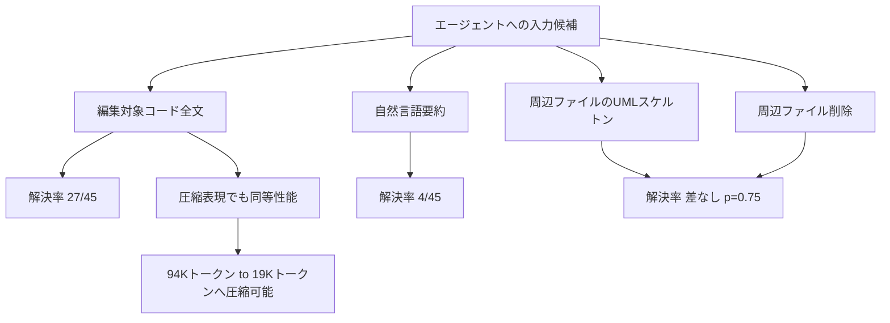
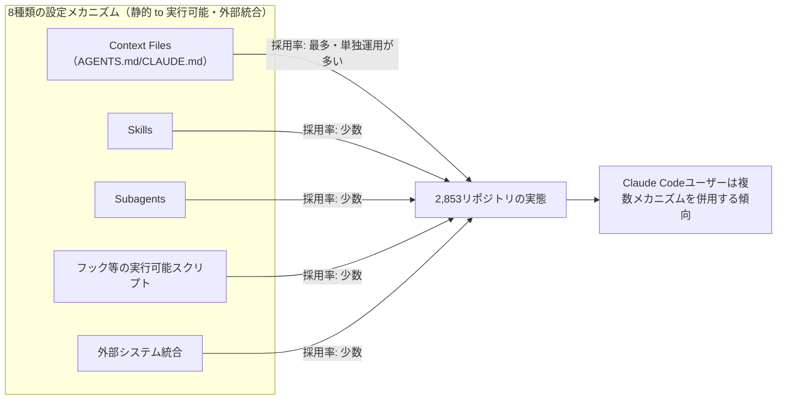
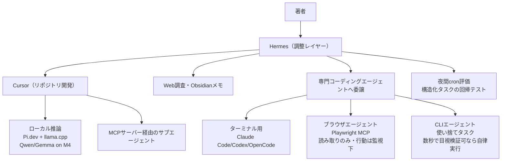

# Daily Briefing 2026-08-16

## 1. コーディングエージェントが編集時に本当に必要とするコンテキストとは何か（原題: What Context Does a Coding Agent Actually Need to Act?）

- **URL**: https://arxiv.org/abs/2607.09691
- **公開日**: 2026-06-19
- **著者・媒体**: Brian Sam-Bodden（arXiv, cs.SE）

### 本文翻訳
現代のコーディングエージェントはリポジトリ全体をコンテキストウィンドウに収められるが、その読み込みの大半は無駄になっている。重要な問いは「エージェントがどれだけのコンテキストを使えるか」ではなく「実際に何を必要としているか」である。本研究はこの問いを、エージェントがコードを編集するという最も重要な瞬間に絞って検証する。

作業対象箇所の特定（localization）と、そこでの実際の編集行為を分離するため、オラクル（正解位置）を使って作業位置を固定し、コードの「表現方法」だけを変化させ、SWE-bench Verified 上での実際の課題解決率でスコアリングした。

結果は驚くほど最小主義的だった。シグナルは編集対象のコードそのものに宿っている。自然言語による要約は、ソースコードが答えられる行動上の問いにほとんど答えられない（要約 4/45 問 vs ソースコード 27/45 問、ホールドアウトしたリポジトリ、独立judgeによる評価）。しかもこのギャップは要約者の能力ではなく「表現形式」に起因する——frontierモデルによる要約も、3Bモデルによる要約も、まったく同じくらい低い正答率だった。

周辺コンテキストもほとんど重要ではない。Verified中の全マルチファイル事例において、データ収集前に凍結したプロトコルの下で、ファイルの残り部分をUMLスケルトンやシグネチャとして描画しても、その部分を完全に削除した場合と比べて解決できる課題数は増えなかった（N=70、正確なMcNemar検定 p=0.75）。これは事前登録した仮説であり、それは棄却された。

一方で、圧縮されたコンテキストはファイル全文と同等の性能を、3分の1のトークン数で達成する——1課題の解決に必要なコンテキストトークンは94Kではなく19Kで済む。

この実験装置はもう一つ、分野全体が留意すべき知見も生んだ。temperature=0のAPI推論でも、バイト単位で同一の実行間で約9%のインスタンス単位の結果が入れ替わる。これは、このベンチマーク上で報告されるあらゆる小さな効果（本研究の結果を含む）の下に存在するノイズフロアである。著者らは、金標準で検証済みの環境、各アームのコンテキストから参照編集が表現可能であることの事例ごとの証拠、決定的なパッチ構築手順、そして帰無仮説を含めて事前登録した仮説一式を、計測器として公開している。

### 重要ポイント
- 編集対象コードそのものが最重要シグナルであり、自然言語要約は代替にならない（27/45 vs 4/45）
- 要約の質はモデルサイズに依存しない——frontierモデルも3Bモデルも同程度に情報を失う
- 周辺ファイルをUMLスケルトン化しても、丸ごと削除するのと解決率は変わらない（p=0.75）
- 圧縮コンテキストは全文コンテキストと同等の性能を約1/5のトークン数で達成できる（19K vs 94K）
- temperature=0でも約9%の結果が実行間で反転する——ベンチマーク評価にはこのノイズを考慮する必要がある

### 図解


### 現場での適用方法

**CLAUDE.md への追記例**:
```markdown
## コンテキスト構築ルール（研究知見に基づく）
- コード変更タスクでは、編集対象ファイルの「全文」を必ずコンテキストに含める。
  自動生成した要約や説明文だけを渡すのは禁止（要約は編集判断に必要な情報の
  大半を落とす）。
- 周辺ファイルは全文を渡す必要はない。関数シグネチャ・型定義・import 一覧
  程度の軽量表現で十分。無理に全文を含めてコンテキストを圧迫しない。
- 大規模リポジトリでは「編集対象ファイル本文 + 周辺の軽量シグネチャ一覧」
  という構成を既定にし、無関係ファイルの全文投入を避ける。
```

**運用手順（コンテキスト圧縮の実践）**:
1. `git grep` や LSP でタスクに関連するファイルを特定する（localization）。
2. 編集対象ファイルは `cat <file>` 相当で全文をコンテキストに含める。
3. 参照するだけの周辺ファイルは `ctags` や `ast-grep --pattern 'function $NAME($$$) { $$$ }'` 等でシグネチャのみ抽出し、コンテキストに追加する。
4. コンテキストサイズをタスク開始時と終了時で計測し、全文投入運用と比較してトークン削減率を記録する。

### 期待効果
編集対象ファイルを全文、周辺ファイルを軽量表現にするだけで、全文丸ごと投入と同等の課題解決率を約1/5のトークン量（19K vs 94K）で達成できる可能性がある。コンテキスト予算の逼迫やコスト削減に直結する再現性のある知見。

### 注意点
- SWE-bench Verified というベンチマーク特性（Python中心、既存OSSリポジトリ）に基づく結果であり、他言語・他ドメインでの再現性は未検証
- temperature=0でも約9%の結果反転があるため、少数サンプルでの効果比較は統計的に不安定になりやすい。評価する際はこのノイズフロアを踏まえた統計的検定が必要
- 「周辺コンテキストが不要」という結論は、localizationが正確であることが前提（オラクルで作業位置を固定した実験のため、実運用でのlocalization精度が低い場合はこの限りではない）

---

## 2. エージェント型AIコーディングツールにおけるハーネスエンジニアリング：探索的研究（原題: Harness Engineering for Agentic AI Coding Tools: An Exploratory Study）

- **URL**: https://arxiv.org/abs/2602.14690
- **公開日**: 2026-02-16（最終版: 2026-06-30）
- **著者・媒体**: Matthias Galster, Seyedmoein Mohsenimofidi, Jai Lal Lulla, Muhammad Auwal Abubakar, Christoph Treude, Sebastian Baltes（arXiv, cs.SE / AIware 2026）

### 本文翻訳
エージェント型AIコーディングツールはソフトウェア開発タスクをますます自動化している。開発者はこれらのツールを、バージョン管理されたリポジトリレベルの成果物（MarkdownファイルやJSONファイルなど）を通じて設定できる。本論文は、Claude Code、GitHub Copilot、Cursor、Gemini、Codex を対象に、これらの設定メカニズムを体系的に分析したものである。

研究チームは、静的なコンテキスト提供から実行可能なスクリプト、外部システムとの統合まで、8種類の設定メカニズムを特定した。そのうえで、GitHub上の2,853個のリポジトリを対象とした実証研究により、これらのメカニズムが実際にどのように、そしてどの程度採用されているかを調査し、特に「Context Files」「Skills」「Subagents」の3つについて詳細な分析を行った。

主要な発見は次の通りである。第一に、Context Files（AGENTS.mdやCLAUDE.mdなどのコンテキストファイル）が設定構成全体を支配しており、多くのリポジトリで唯一の設定メカニズムとして機能している。特に AGENTS.md は、複数のツール間で相互運用可能な標準として台頭しつつある。

第二に、SkillsやSubagentsのような高度なメカニズムを採用しているリポジトリはごく少数にとどまる。採用されている場合でも、Skillsは実行可能なスクリプトよりも静的な指示文に依存する傾向が強い。

第三に、ツールごとに異なる設定文化が形成されつつある。中でもClaude Codeの利用者は、調査対象の中で最も広い範囲の設定メカニズムを採用しており、単一のコンテキストファイルにとどまらず、Skills・Subagents・フックなど複数のメカニズムを組み合わせて活用する傾向が見られた。

著者らは、本研究が開発者の設定実践に関するベースラインを確立するものであり、AGENTS.md がエージェント設定への「自然な入り口」として位置づけられると結論づけている。今後は、これらの設定戦略がどのように進化し、実際の開発生産性やコード品質にどう影響するかを、縦断的・実験的に検証することが求められるとしている。

### 重要ポイント
- Context Files（AGENTS.md / CLAUDE.md 等）が設定メカニズムの中で圧倒的多数を占め、多くのリポジトリで唯一の設定手段になっている
- AGENTS.md はツール横断の相互運用可能な標準として台頭している
- SkillsやSubagentsといった高度な機能の採用率は依然として低い
- Skillsが採用されている場合でも、実行可能スクリプトより静的指示文が中心
- Claude Code利用者は他ツールの利用者より広範な設定メカニズムを組み合わせて使う傾向がある

### 図解


### 現場での適用方法

**運用手順（自リポジトリの設定成熟度チェック）**:
```bash
# 1. リポジトリ内の設定メカニズムを棚卸しする
find <REPO_PATH> -maxdepth 2 \
  \( -iname "AGENTS.md" -o -iname "CLAUDE.md" -o -iname "SKILL.md" \
     -o -path "*.claude/agents/*" -o -path "*.claude/hooks/*" \) -print

# 2. Context Fileが存在しない/1つしかない場合は、まずAGENTS.md（またはCLAUDE.md）
#    を「自然な入り口」として整備する（本研究の推奨に基づく）
[ -f <REPO_PATH>/AGENTS.md ] || [ -f <REPO_PATH>/CLAUDE.md ] && \
  echo "Context File あり" || echo "Context File 未整備: 最優先で作成"

# 3. Context Fileが整備済みなら、次段階としてSkills/Subagentsの導入を検討
#    （調査上まだ少数派＝差別化ポイントになりうる）
ls <REPO_PATH>/.claude/skills 2>/dev/null || echo "Skills 未導入"
ls <REPO_PATH>/.claude/agents 2>/dev/null || echo "Subagents 未導入"
```

**CLAUDE.md への追記例**:
```markdown
## リポジトリ設定の段階的整備方針
本リポジトリの設定は以下の順で成熟させる（Galster et al. 2026 の実証研究に基づく）:
1. AGENTS.md / CLAUDE.md によるコンテキスト共有（最優先・最も効果が高い）
2. 頻出タスクをSkillsとして切り出す（静的指示文から開始し、必要に応じてスクリプト化）
3. 独立性の高いサブタスクをSubagentsに委譲する
4. 上記が定着してからフック等の実行可能な自動化を追加する
```

### 期待効果
設定メカニズムの整備状況をベンチマーク（2,853リポジトリの実態）と比較でき、自チームの成熟度を客観的に把握できる。特にAGENTS.md/CLAUDE.mdの整備は「最も採用されている＝最も効果を検証しやすい」投資であり、優先順位付けの根拠になる。

### 注意点
- 本研究は「採用率」の実証分析であり、各メカニズムが実際の開発生産性やコード品質に与える因果効果までは検証していない（著者ら自身が今後の課題としている）
- 対象はGitHub上の公開リポジトリであり、非公開の企業内リポジトリでの実態は異なる可能性がある
- 「Claude Codeユーザーが最も広範なメカニズムを使う」という結果は、ツール自体の機能差（Skills/Subagentsの提供有無）にも影響される可能性があり、単純な優劣比較には注意が必要

---

## 3. 2026年7月時点での私のエージェント型開発ワークフロー（原題: My Agentic Development Workflow (as of July 2026)）

- **URL**: https://vishsubramanian.me/my-agentic-development-workflow-as-of-july-2026/
- **公開日**: 2026-07-11
- **著者・媒体**: Vishwanath Subramanian（個人ブログ）

### 本文翻訳
AIツールセットは数週間単位で変化するため、このワークフロー記録も遠からず陳腐化するだろう、と著者は前置きする。単一の統合ツールではなく、複数のツールを組み合わせた「寄せ集め」で運用している。すべてのユースケースを一つのプラットフォームでカバーできるツールは存在しないためだ。核となる方針の一つは、機密データを外に出さないためM4 Mac上でのローカル推論を優先することだが、LinkedInで日々流れてくる新モデルの話題にFOMOを感じることも認めている。

**調整レイヤー：Hermes**。Nous ResearchのHermesが日次タスク管理、cronジョブ、Web調査の実行、Obsidianへのメモ統合、専門コーディングエージェントへの委譲を担う主要オーケストレーターである。以前使っていたOpenClawはリリースのたびにデバッグを繰り返す不満から乗り換えた。Hermesは会話的インターフェースとセッション状態の永続化を評価しており、OpenRouter経由でモデルを選択するため、高価なfrontierモデルと安価なモデルを他のスタックを崩さずに切り替えられる。

**IDEでの開発：Cursor**。リポジトリベースの作業における「日常の相棒」。大型機能開発用、デバッグ用、OSS探索（Pi、OpenCode）用と、目的別に複数のコンテキストウィンドウを並行運用する。バックグラウンドエージェントが並行して動く間に他の作業を進められる。CursorはHermesと接続されたMCPサーバーとも連携し、コード執筆だけでなく調査やクリーンアップ作業もサブエージェントを介して行える。

**ローカル推論戦略**。Pi.devがOpenAI互換エンドポイントを提供し、M4上でllama.cpp経由でQwenやGemmaを動かして、計画立案やツール呼び出しに使う。ターミナル単体よりCursorのワークベンチでdiffのレビュー・編集を行うことを好む。「frontierモデルより遅いが、機密データを扱う対価としては妥当」とトレードオフを受け入れている。実行間のプロンプトキャッシュにより性能は改善する。GLM 5.2のローカル実行も調査したいが、Macが音声・アンプモデリング作業と同時実行で苦しくなる場合は費用対効果が下がると述べる。

**ターミナル・使い捨てタスク**。Claude Code、Codex、OpenCodeは、プロジェクト外の使い捨てスクリプトや素早いタスクに使い、その時点でのトークン残量に応じて選ぶ。永続メモリを複数プロバイダのエンドポイントにまたがって持たせる Claude-Mem も試験導入している（コンシューマー向けモデルの提供停止リスクへの備え）。ワークフロー移行のためのメタハーネスとして Omnigent も検討中。

**ナレッジ管理：Obsidian**。Karpathyのアプローチに影響を受けた「常時稼働する脳」として、日次TODO・TOPICS.md・プロジェクトノート・セッション間で永続する情報を保持する。

**モデル選定ロジック**。Hermesとの直接会話にはOpenRouter経由の kimi-k2.7-code をデフォルトとして使用。重い推論はホスト型モデルへ、分類やグルーコードのような軽量タスクは安価なローカルモデルへ、という原則で振り分けるが、「ルールは常に変わり続ける」と認めている。

**専門領域：オーディオエンジニアリング**。Claudeがミキサー/プロデューサー役として、ミックスのサイン波を判断し、コンプレッションの追加やゲイン調整を行う。自作のLLMベースのトーン生成ツールにより、週末のトーン調整時間を80%削減できたという。

**ブラウザエージェント**。Playwright MCPを使い、ペイウォールやログインが必要なドキュメント調査・価格比較・changelog確認・プリセットライブラリのスクレイピング・要約のノート保存などを行う。厳格なルールは「Webを読むことは許可するが、監視なしにWeb上で行動させることは絶対にしない」。ログインやフォーム送信は、低リスクな場面に対して消費するトークンが割に合わないとしている。

**CLIエージェント**。マイグレーション、一括リネーム、ログ検索など小規模な使い捨て作業に使用。判断基準は「数秒で目視確認できるなら自律実行を許可」「ディスクやネットワークへの書き込みを伴う、あるいは一時的なエラーを繰り返し生成する操作は手動監視を維持」。`git checkout .` による素早いロールバックで迅速な反復を可能にしている。

**評価手法**。構造化タスクには既知の正解スキーマと検証アサーションの小規模セットを用意し、Hermesが毎晩cronで再評価して失敗を通知する（本人は無視しがちだが）。「あいまいなタスク」についてはLLM judgeを使うべきだと分かってはいるが、まだ着手できていないと率直に述べている。

振り返ると、チャット画面へのコピペと無料Gemini APIの浪費から始まり、現在の調整レイヤー・ローカル推論・永続メモリ・夜間評価を備えたスタックへと進化してきた。著者は「この構成も6ヶ月後には笑い話になっているかもしれない」としつつ、他者がツール選定や避けるべき落とし穴を判断する助けになればと、記録として公開している。

### 重要ポイント
- 単一ツールに統一せず、Hermes（調整）・Cursor（IDE）・ローカルLLM・Obsidian（記憶）を役割分担で併用している
- 機密データはM4上のローカルLLM（llama.cpp + Qwen/Gemma）で処理し、frontierモデルの速度と引き換えにデータ非流出を優先
- 「ブラウザエージェントに読ませるのは可、書き込み・行動させるのは監視下のみ」という明確なガードレールを持つ
- CLIエージェントの自律実行可否を「数秒で目視検証できるか」で判断する具体的な基準を持つ
- 構造化タスクは毎晩cronで自動評価し、失敗を検知する体制を構築している

### 図解


### 現場での適用方法

**運用手順（今日から試せるガードレール設計）**:
1. 自分が使っているエージェントを「調整層」「実行層（IDE/CLI）」「ローカル/機密データ処理」「記憶層」に役割分担で棚卸しする。
2. ブラウザ操作エージェントには「読み取り専用」フラグを既定にし、ログイン・送信など書き込み系操作は明示許可制にする。
3. CLIエージェントの自律実行可否判定基準を明文化する（例: 結果を数秒で目視確認できるかどうか）。

**CLAUDE.md への追記例**:
```markdown
## エージェント自律実行のガードレール
- ブラウザ操作エージェントは既定で読み取り専用とする。ログイン・フォーム送信・
  購入などWeb上での「行動」を伴う操作は、事前に明示的な許可を得てから実行する。
- CLI/ターミナルエージェントの自律実行は「実行結果を数秒で目視検証できる」
  タスクに限定する。ディスク書き込み・ネットワーク送信を伴う操作や、
  一時的なエラーを繰り返す操作は必ず人間の確認を挟む。
- 機密データを扱うタスクはローカルLLM（<LOCAL_LLM_ENDPOINT>）にルーティングし、
  外部frontierモデルには送らない。速度より非流出を優先する。
```

**スクリプト化の例（構造化タスクの夜間回帰評価）**:
```bash
#!/usr/bin/env bash
# nightly-eval.sh: 構造化出力タスクの既知スキーマ検証を毎晩cronで実行
set -euo pipefail

SCHEMA_DIR="<REPO_PATH>/eval/schemas"
RESULT_LOG="<REPO_PATH>/eval/results/$(date +%F).json"

for schema in "$SCHEMA_DIR"/*.json; do
  task_name=$(basename "$schema" .json)
  output=$(<EVAL_COMMAND> --task "$task_name")
  if ! echo "$output" | jq -e --slurpfile schema "$schema" \
       '. as $out | $schema[0] as $s | ($out | keys) == ($s.required)' >/dev/null; then
    echo "FAIL: $task_name" | tee -a "$RESULT_LOG"
    <NOTIFY_COMMAND> "Nightly eval failed: $task_name"
  fi
done
```

### 期待効果
役割ごとにツールを分離することで、機密データの流出リスクを抑えつつ（ローカルLLM活用）、重いタスクはfrontierモデルに任せるコスト・速度のバランスが取れる。著者はローカルLLM活用の一例として、自作トーン生成ツールで作業時間を80%削減したと報告している。ブラウザ/CLIエージェントへの明確な自律実行境界線は、事故（誤操作・意図しない書き込み）を未然に防ぐ実践的なガードレールとして機能する。

### 注意点
- 本記事は個人開発者向けの構成であり、チーム開発や本番運用への適用にはアクセス権限管理やレビュー体制など追加の調整が必要
- ツールセットの変化が非常に速いため、記載されているツール（Hermes、Pi.dev、Omnigent等）自体は数ヶ月で陳腐化する可能性が高い。重要なのは個別ツールではなく「役割分担」「自律実行の境界線設計」という設計思想
- 夜間cron評価は「失敗通知を本人が無視しがち」と著者自身が認めており、通知を設計しただけでは運用が形骸化するリスクがある。アラート疲れ対策も併せて設計する必要がある
