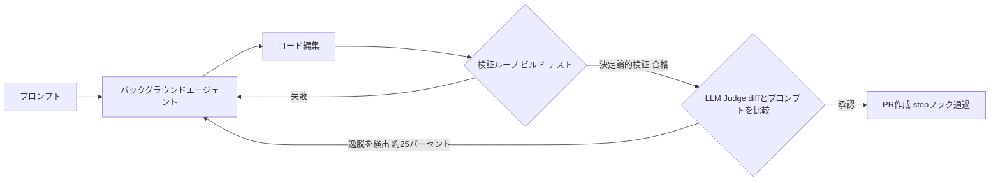
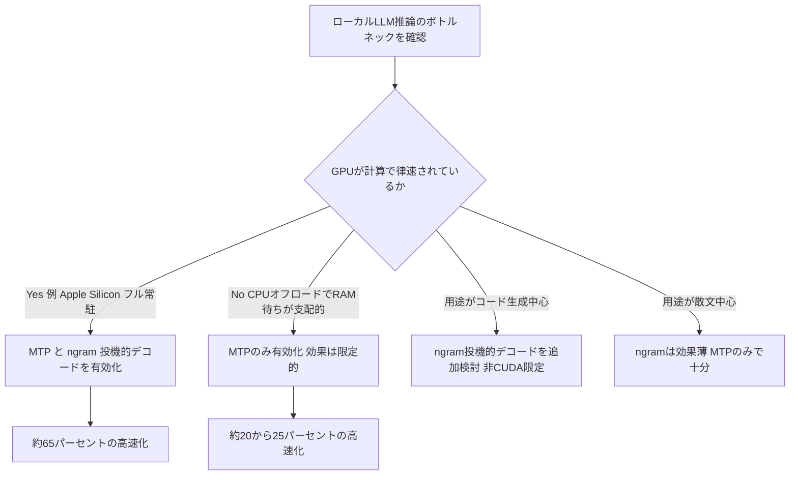

# Daily Briefing 2026-08-17

## 1. MCPにおけるコード実行：より効率的なAIエージェントを構築する（原題: Code execution with MCP: building more efficient AI agents）

- **URL**: https://www.anthropic.com/engineering/code-execution-with-mcp
- **公開日**: 2025-11-04
- **著者・媒体**: Anthropic Engineering Blog

### 本文翻訳
Model Context Protocol（MCP）は、AIエージェントを外部システムに接続するためのオープン標準であり、2024年11月の発表以来急速に普及し、コミュニティが構築したサーバーは数千に上る。しかし接続するツールの数が増えるほど、すべてのツール定義を事前にロードする従来方式はエージェントを遅くし、コストを増大させるという課題が顕在化してきた。

問題は大きく二つある。第一に、`gdrive.getDocument`や`salesforce.updateRecord`のようなツールの説明文そのものがコンテキストウィンドウを圧迫し、応答時間とコストを増加させる。数千のツールに接続されたエージェントでは、これだけで数十万トークンに達することもある。第二に、中間結果の消費だ。たとえばミーティングの文字起こしをGoogle Driveから取得し、Salesforceへ書き込むワークフローでは、取得したドキュメント全体がいったんモデルのコンテキストを経由してから次のツール呼び出しに渡される。大きなドキュメントはコンテキスト上限を超えてしまうことすらある。

Anthropicが提案する解決策は、MCPサーバーを直接のツール呼び出しの集合としてではなく「コードAPI」として提示することだ。具体的には、ツールをサーバーごとにファイルシステム上に整理する（例: `./servers/google-drive/getDocument.ts`）。各ツールはMCP呼び出しを薄くラップした型安全なTypeScript関数として実装される。

```typescript
import { callMCPTool } from "../../../client.js";
export async function getDocument(input: GetDocumentInput): Promise<GetDocumentResponse> {
  return callMCPTool<GetDocumentResponse>('google_drive__get_document', input);
}
```

エージェントはこのファイルシステムを探索し、必要なツールだけをオンデマンドで発見・利用する。実例では、この方式によりトークン消費が15万トークンから2,000トークンへ、実に98.7%削減されたと報告されている。

主な利点は五つある。(1) 段階的開示: モデルは自然にファイルシステムをナビゲートでき、事前に全ツールをロードする必要がない。(2) コンテキスト効率の良いツール結果: 1万行のスプレッドシートを取得する場合でも、実行環境内でフィルタリングしてから未処理の注文だけをモデルに返せる。(3) 複雑なロジックと制御フロー: Slackのデプロイ通知を待つポーリングループのような処理は、MCP呼び出しとsleepを交互に行うより、通常のforループやif文で書いた方が効率的。(4) プライバシー保護: 中間結果はデフォルトで実行環境内にとどまり、モデルには明示的にログ出力したものしか見えない。クライアント側でPIIを自動的にトークン化し、モデルには「[EMAIL_1]」のようなプレースホルダのみを見せつつ、実際のメールアドレスはGoogle SheetsからSalesforceへ直接流すことも可能。(5) 状態の永続化とスキル化: エージェントは操作間で中間結果をファイルに書き出したり、再利用可能な関数（例: `./skills/save-sheet-as-csv.ts`）をSKILL.mdの形で保存し、将来のセッションで再利用できる。

一方で、コード実行の導入自体が新たな複雑性を持ち込む点には注意が必要だ。エージェントが生成したコードを実行するには、適切なサンドボックス化・リソース制限・監視を備えた安全な実行環境が必要であり、トークン削減や低レイテンシ、優れた合成可能性といった利点は、この実装コストと運用オーバーヘッドと比較衡量する必要がある。記事は、確立されたソフトウェア工学のパターン（コンテキスト管理やツール合成のための既存の解決策）が、コード実行を伴うMCPエージェントにもそのまま有効に適用できると結論づけている。

### 重要ポイント
- MCPの直接ツール呼び出しは、ツール定義の事前ロードと中間結果の往復でコンテキストを浪費する
- ツールをファイルシステム上のTypeScript APIとして提示し、エージェントにコードを書かせることで98.7%のトークン削減を実現した実例がある
- 実行環境内でのデータフィルタリングにより、大量データも要点だけをモデルに渡せる
- PIIの自動トークン化など、コード実行はプライバシー保護の効果もある
- サンドボックス化・監視などの運用コストとのトレードオフを考慮する必要がある

### 図解


### 現場での適用方法
MCPサーバーを多用するプロジェクトでは、頻用ツールをコードAPI化してエージェントに「探索して使わせる」運用に切り替えると効果的です。

**CLAUDE.md への追記例**
```markdown
## MCP ツールの利用方針
- 3ステップ以上にわたる MCP 連携（例: 取得→加工→別サービスへ書き込み）は、
  個別のツール呼び出しを連鎖させず、./servers/<server>/<tool>.ts の
  TypeScript ラッパーをコードとして呼び出すこと。
- 大きなデータ（数百行以上のスプレッドシート、長い文字起こし等）は、
  実行環境内でフィルタ・集計してから結果のみをコンテキストに返すこと。
- 個人情報（メールアドレス・電話番号等）を含む中間結果は、
  ログに出力せず変数のまま次の処理に渡すこと。
```

**スクリプト化の例（TypeScript ラッパーの雛形）**
```typescript
// servers/<mcp-server-name>/<tool-name>.ts
import { callMCPTool } from "../../client.js";

export async function toolName(input: ToolInput): Promise<ToolOutput> {
  return callMCPTool<ToolOutput>('<mcp_tool_id>', input);
}
```
`<REPO_PATH>/servers/` 配下にMCPサーバーごとのディレクトリを作り、ツールをこの形式でラップしておくと、エージェントは `ls`/`Read` で必要なツールだけを発見して呼び出せるようになる。

### 期待効果
記事内の実例では、同等のワークフローでトークン消費が150,000→2,000（98.7%削減）に低下している。接続するMCPサーバー・ツール数が多い環境ほど効果が大きいと考えられる。

### 注意点
コード実行環境のサンドボックス化・リソース制限・監視が必須で、導入コストがかかる。既存のツール呼び出し中心のフローを丸ごと置き換えるのではなく、まずは中間結果が大きい・多段階のワークフローから適用するのが現実的。

## 2. バックグラウンドコーディングエージェント：強力なフィードバックループによる予測可能な結果（Honk パート3）（原題: Background Coding Agents: Predictable Results Through Strong Feedback Loops (Honk, Part 3)）

- **URL**: https://engineering.atspotify.com/2025/12/feedback-loops-background-coding-agents-part-3
- **公開日**: 2025-12-09
- **著者・媒体**: Max Charas, Marc Bruggmann（Spotify Engineering）

### 本文翻訳
Spotifyは、数千のソフトウェアコンポーネントにまたがるコード変更を自動化するバックグラウンドコーディングエージェント「Honk」を運用している。大規模に自律エージェントを走らせると、失敗の仕方は三段階に分かれる。(1) エージェントがそもそもPRを作成できない（軽微な迷惑）、(2) PRは作成されるがCIに失敗する（レビュー負荷を増やす）、(3) CIには通るが機能的に誤っている（最も深刻で、自動化への信頼を損なう）。特に数千のコンポーネントに同時に変更を加える場合、(3)のような不具合はレビューで見逃されやすい。原因はテストカバレッジ不足、エージェントがプロンプトの範囲を超えて「創造的」になってしまうこと、ビルドやテストを正しく実行できないことなどだ。Spotifyはこれに対処するため「土台から予測可能性を設計する」方針を取った。

中核となるのが「検証ループ（verification loop）」だ。設計原則として重要なのは、エージェント自身は検証が何をどうチェックしているかを知らず、ただ「呼び出せる（場合によっては呼び出さなければならない）」ことだけを知っている点である。個々のベリファイアはエージェントに直接公開されず、対象コンポーネントの内容に応じて自動的に有効化される。たとえば`pom.xml`が見つかればMavenベリファイアが起動する。ベリファイアはMCPのツール定義として公開され、実装の詳細を抽象化する。これによりエージェントはビルドシステムの呼び出し方やテスト出力の解析方法を理解する必要がなくなる。失敗時は正規表現でエラーメッセージを抽出して返し、成功時は簡潔な確認メッセージのみを返す。ベリファイアはツール呼び出しとして実行されるほか、Claude Codeの「stopフック」によりPR作成前に自動的に実行され、失敗するとPR作成がブロックされる。

決定論的なベリファイアの上にもう一段、「LLM as a judge（判定者としてのLLM）」の層を追加した。エージェントがプロンプトの範囲を超えて「野心的」になりすぎるのを防ぐのが目的で、diffと元のプロンプトをLLMに渡して評価させる。この判定は標準の検証ループに組み込まれ、決定論的ベリファイアの後に実行される。実運用では、数千件のエージェントセッションのうち約4分の1が判定者によって拒否（veto）され、そのうち約半数はエージェントが自力で軌道修正できている。最も多いトリガーは、エージェントがプロンプトで示された指示の範囲外に踏み出すケースだ。ただしSpotify自身、この判定者に対する体系的な評価（eval）にはまだ投資できていないと認めている。

もう一つの柱がエージェントのスコープを絞り込む設計だ。バックグラウンドコーディングエージェントは「プロンプトを受け取り、可能な限り良いコード変更を行う」という一つのことだけを行うよう作られている。エージェントが直接アクセスできるのは関連するコードベースと編集ツール、ベリファイアの呼び出しのみで、コードのpush、Slackでのやり取り、プロンプトの作成自体はエージェントの外側のインフラが担う。この柔軟性の制限がエージェントの予測可能性を高め、副次的にセキュリティ面でも良い効果をもたらしている。エージェントは権限を絞ったコンテナ内で実行され、利用可能なバイナリは少なく、周辺システムへのアクセスもほぼない。

今後の課題として、(1) 現状Linux x86のみに対応しているベリファイア基盤をmacOS（iOS開発向け）やARM64（バックエンド向け）へ拡張すること、(2) 高速な「内側のループ」であるベリファイアを補完する「外側のループ」として、GitHub PR上のCIチェック結果に基づいてエージェントが行動できるようにすること、(3) システムプロンプトの変更を体系的に評価し、新しいエージェントアーキテクチャを実験し、異なるLLMプロバイダーをベンチマークするための、しっかりしたeval基盤を整備すること、の三点を挙げている。

### 重要ポイント
- 大規模自律コーディングエージェントの失敗は「PR未作成」「CI失敗」「CI通過だが機能的に誤り」の3段階があり、3番目が最も深刻
- 検証ループはエージェントに実装を隠したまま自動発動するベリファイア（例: pom.xml検出でMaven検証）で構成し、MCPツールとして公開する
- 決定論的検証の上に「LLM as a judge」を重ね、diffとプロンプトを突き合わせて逸脱を検出（拒否率約25%、うち半数は自己修正）
- エージェントの権限とアクセス範囲を意図的に狭めることで予測可能性とセキュリティを同時に高めている
- 今後はCI結果を使った「外側のループ」やプロンプト変更のeval基盤整備を計画

### 図解


### 現場での適用方法

**スキル化の例（SKILL.md）**
```markdown
---
name: pr-verification-gate
description: コード変更をPRとして提出する前に、ビルド・テスト・diffレビューを自動検証するゲート。エージェントが自律的にコード変更を行うワークフローで使用する。
---

# PR検証ゲート

1. コード変更後、必ず以下を実行してから PR を作成すること:
   - プロジェクトのビルドコマンド（例: mvn verify, npm test）を実行し、
     失敗した場合は失敗メッセージ（正規表現で抽出したエラー箇所のみ）を読んで修正する。
   - 変更後の diff を元のプロンプト（タスク指示）と突き合わせ、
     指示の範囲を超えた変更が含まれていないか自己レビューする。
2. 上記いずれかが失敗した場合、PR は作成せず修正を継続する。
3. 全て合格した場合のみ PR を作成する。
```

**運用手順（stopフックによる強制）**
1. `.claude/settings.json` の `hooks.Stop` に、PR作成前チェックスクリプトを登録する。
2. チェックスクリプトはビルド/テストを実行し、失敗時は非ゼロ終了してエージェントの停止を妨げる。
3. 合格時のみ `gh pr create` 等でPRを作成するステップに進む。

### 期待効果
Spotifyの実運用では、この二層検証（決定論的ベリファイア＋LLM judge）により、数千件のセッション規模でも機能的に誤ったPRの割合を抑制し、judgeの拒否からエージェントが約半数のケースで自力回復できている。

### 注意点
LLM judgeの拒否判定自体に体系的な評価（eval）が確立されておらず、判定の精度・再現性は継続的な検証が必要。ベリファイアはコンポーネントの技術スタックごとに個別実装が必要なため、対応言語・OSの拡張には継続投資が要る。

## 3. llama.cppのアップデート1つでローカルAIが65%高速化した（原題: One llama.cpp Update Made Local AI 65% Faster）

- **URL**: https://python.plainenglish.io/one-llama-cpp-update-made-local-ai-65-faster-78e5ee25a82e
- **公開日**: 2026-05-26
- **著者・媒体**: Nicolas Rowan（Python in Plain English, Medium）

### 本文翻訳
同じフラグを2台の異なるマシンで有効にしたのに、得られた高速化はまったく違った——この記事は、その理由を掘り下げる。鍵となるのは、llama.cppが実装したMulti-Token Prediction（MTP、マルチトークン予測）という投機的デコード（speculative decoding）の新方式だ。

投機的デコード自体は目新しい技術ではなく、ドラフトモデルを使った実験はこれまでも行われてきた。しかしMTPの決定的な違いは、ドラフト用の予測ヘッドがモデル本体に最初から同梱されて出荷される点にある。これにより導入の手間が一変した。仕組みとしては、1トークンずつ逐次生成する代わりに、小さな予測ヘッドが将来の複数トークンを先読みで推測し、本体モデルがそれらをまとめて（バッチで）検証する。

セットアップは以下のフラグを追加するだけで完了する。
```
--speculative-draft-type mtp --speculative-draft-max 3
```

ベンチマークは2つの異なる環境で行われた。1つ目はMacBook Pro（M5、27BのDenseモデルを完全にユニファイドメモリ上で実行）で、ベースラインは約10 tokens/sec、MTP有効化で約14 tokens/sec、さらにngram投機的デコードを重ねると約16.5 tokens/secに達し、合計で約65%の高速化、受理率（acceptance rate）は92.8%だった。2つ目は予算重視のCUDA環境（35BのMoEモデルで37層をCPUオフロード）で、ベースラインは約16 tokens/sec、MTP有効化で約19.7 tokens/secと、こちらは23%の改善にとどまった。

この差が生まれる理由は、ボトルネックの所在が異なるからだ。MacBookの構成はほぼ完全にGPU律速で、節約された計算サイクルがそのまま速度向上に直結する。一方、予算重視のCUDA構成はすでにGPU律速ではなく、GPUはシステムRAM上に置かれたCPU側のexpertレイヤーの処理待ちになっていた。つまりMTPで計算量を削減しても、そもそものボトルネックがGPU計算でなければ効果は限定的になる。なお、MTPの利用には64Kコンテキスト設定で約900MBの追加VRAMが必要になる点にも注意したい。

おまけの機能として、繰り返しパターンを探すngram投機的デコードも紹介されている。コード生成のように構文パターンが繰り返される用途では良好に機能する一方、散文（prose）では受理率が7〜8%程度と低迷する。また、これはCUDA以外のシステムでのみ利用可能という制約がある。

記事の結論は、ローカル推論の性能が「生のハードウェアスケーリング」というより「システムズエンジニアリング」の様相を強めているという点だ。ハードウェアを買い替える前に、ソフトウェア工学でどこまで性能を絞り出せるかを問うべき局面に来ている。

### 重要ポイント
- MTPはドラフト予測ヘッドがモデルに同梱されているため、別途ドラフトモデルを用意する手間なく投機的デコードを使える
- セットアップは `--speculative-draft-type mtp --speculative-draft-max 3` を追加するだけ
- GPU律速な環境（Apple Silicon等）では最大65%高速化、CPUオフロードでボトルネックがCPU/RAM側にある構成では23%程度に留まる
- ngram投機的デコードはコード生成と相性が良いが散文では効果が薄く、CUDA非対応という制約がある
- MTP有効化には追加VRAM（64Kコンテキストで約900MB）が必要

### 図解


### 現場での適用方法

**運用手順**
1. llama.cppを最新版に更新する（MTP対応版であることを確認）。
   ```bash
   cd <LLAMA_CPP_REPO_PATH>
   git pull
   cmake --build build --config Release
   ```
2. MTP対応のドラフトヘッド同梱モデル（例: Gemma系の該当サイズ）のGGUFを用意する。
3. サーバー起動時に投機的デコードフラグを追加する。
   ```bash
   ./llama-server \
     -m <MODEL_GGUF_PATH> \
     --speculative-draft-type mtp \
     --speculative-draft-max 3 \
     -c 65536
   ```
4. 自分のハードウェア構成でベースライン（フラグなし）とMTP有効時の tokens/sec を計測し、ボトルネックがGPU計算かCPU/RAM待ちかを判断する。
5. コード生成用途かつ非CUDA環境であれば、ngram投機的デコードの併用も試す。

**CLAUDE.md への追記例（ローカルLLMをサブエージェント/補助推論に使う場合）**
```markdown
## ローカルLLM推論設定
- llama.cpp サーバーは --speculative-draft-type mtp --speculative-draft-max 3 を
  常時有効にする（対応モデル使用時）。
- GPUがボトルネックでない構成（CPUオフロードあり）では、MTPの効果は
  20〜25%程度に留まることを前提にレイテンシ見積もりを行うこと。
- 64Kコンテキストでは追加で約900MBのVRAMを見込んでメモリ計画を立てること。
```

### 期待効果
GPU律速な環境では最大65%のトークン生成速度向上（記事内実測値）。ハードウェア更新なしでスループットを引き上げられる。

### 注意点
効果はハードウェア構成（特にCPUオフロードの有無）に強く依存し、CPU/RAM待ちがボトルネックの構成では効果は限定的。追加VRAMが必要なため、VRAMがぎりぎりの環境では逆にOOMを招く可能性がある。ngram投機的デコードはCUDA環境では利用不可。
