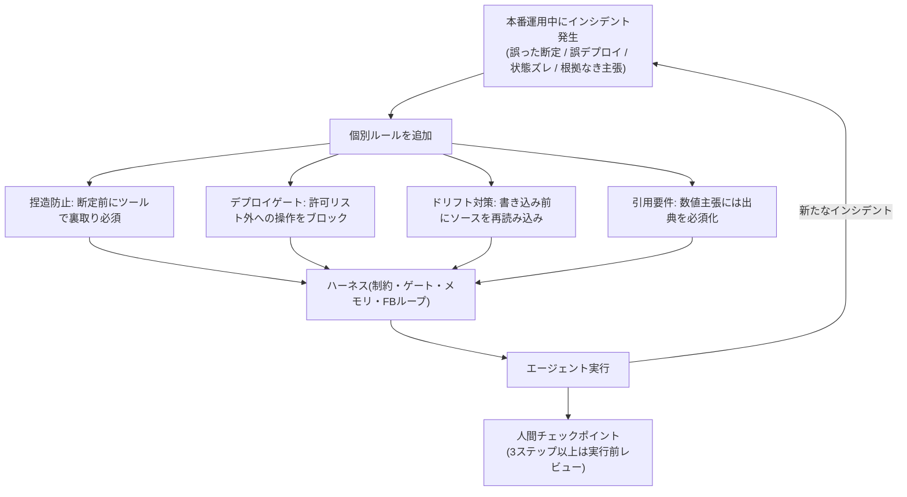
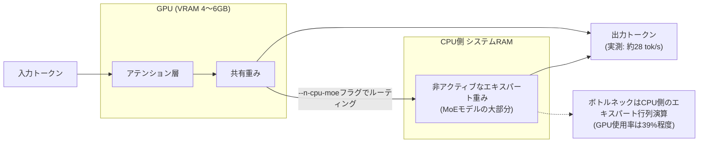
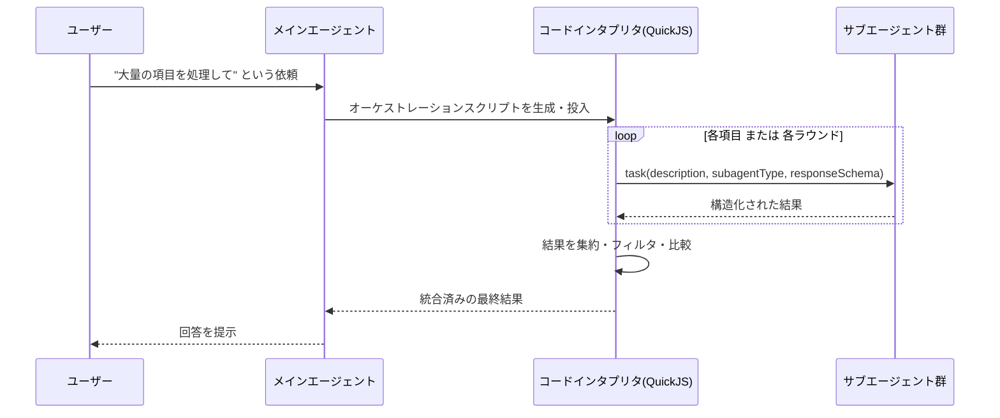

# Daily Briefing 2026-08-18

## 1. ハーネスエンジニアリングをやっていたと後から気づいた話（原題: I Didn't Know I Was Doing Harness Engineering）

- **URL**: https://dev.to/tomtokita/i-didnt-know-i-was-doing-harness-engineering-5a01
- **公開日**: 2026-05-05（2026-05-13に一部更新）
- **著者・媒体**: Tom Tokita（Aether Global Technology共同創業者、マニラ拠点のAIコンサルタント）／dev.to

### 本文翻訳
著者は、40以上のプロジェクトで実運用のAIエージェントを日常的に動かしているコンサルタントである。2026年2月にMitchell Hashimotoが「ハーネスエンジニアリング」という言葉を提唱し、その後OpenAIやMartin Fowler、Red Hatなどが概念を整理していったが、著者は自分がすでに同じことをインシデント対応の積み重ねとして実践していたことに後から気づいたという。

著者の整理では「Agent = Model + Harness」であり、ハーネスとはモデルの出力を本番環境で信頼できるものにするための制約・ゲート・メモリ機構・フィードバックループの総体を指す。重要なのは、これは最初から設計図を描いて作ったものではなく、実際の事故（インシデント）ひとつひとつへの対応として後付けで積み上がっていったという点だ。著者はこれを「アーキテクチャ駆動ではなく、インシデント駆動」と表現している。

具体的に育っていったルールは次のようなものだ。まず「捏造防止ルール」。エージェントがファイルを実際に読まずにメソッド名やパス名を断定してしまう問題に対し、ツールで裏取りするまでは断定的主張を禁止する機械的な検証を組み込んだ。次に「デプロイゲート」。誤った環境（例えば本番Salesforce組織）へメタデータを誤って送信してしまう事故を防ぐため、プロジェクトごとにデプロイ先の許可リスト（allowlist）を設け、リスト外への操作は機械的にブロックするようにした。三つ目は「ドリフト対策プロトコル」。複数回のツール呼び出しを経るうちに、エージェントが認識している「ファイルの状態」と実際のファイルの中身がずれてしまう問題に対し、外部への書き込みなど重要な操作の直前には必ずソースを再読み込みさせるルールを設けた。四つ目は「引用要件」。数値やデータに基づく主張をする際には、必ず検証可能な出典を示すことを義務付けた。

著者はさらに、見落とされがちな3つの課題を挙げている。1つ目は、会話ウィンドウの圧縮（コンパクション）が起きた際にルールや状態が失われてしまう「コンテキストのサバイバル」問題。2つ目は、計画と実行の間に人間のチェックポイントを挟む必要性――特に3ステップ以上のタスクでは、実行前に必ず計画をレビューさせ、単一ステップのタスクでも意図を表明させてから少し待つ運用にしている。3つ目は、独立に開発していたにもかかわらず、業界の他の実践者たちと似た構造に収束していったという点だ。著者の運用には40以上の「フィードフォワード制御」――実行前にブロックする仕組み――が存在し、これには単純なJSONリストとの照合のような計算的な制御と、モデル自身に不確実性をフラグ立てさせる推論的な制御の両方が含まれる。

結論として著者は、ハーネスエンジニアリングは採用すべきフレームワークではなく、実運用で実際に賭け金のあるAIシステムを動かせば自然と収束していく「形」であると述べている。モデルそのものよりも、それを取り巻く運用ハーネスの規律の方が出力品質を大きく左右し、規律あるハーネスに支えられた弱いモデルは、無制約に動く強いモデルに勝るとまとめている。

### 重要ポイント
- ハーネスは設計図から作るものではなく、実際の事故対応の積み重ねから「インシデント駆動」で育っていく
- 捏造防止・デプロイゲート・ドリフト対策・引用要件という4種の具体的ルールが軸になっている
- コンテキスト圧縮時のルール消失、計画と実行の間の人間チェックポイントが特に見落とされやすい
- 40以上のフィードフォワード制御（実行前ブロック）を計算的チェックと推論的チェックの両方で構成している
- 「ハーネスの規律が製品そのもの」であり、モデルの強さより運用ハーネスの質が出力を左右する

### 図解


### 現場での適用方法
記事の4ルールは、そのままCLAUDE.mdの運用ルールとHookの機械的ゲートに落とし込める。

**CLAUDE.md への追記例**
```markdown
## ハーネスルール（インシデント駆動）
- 捏造防止: メソッド名・ファイルパス・API仕様を断定する前に、
  必ず Read/Grep で該当箇所を実際に確認すること。未確認のまま
  「〜のはずです」と断定しない。
- デプロイゲート: <ALLOWED_DEPLOY_TARGETS> に含まれない環境への
  デプロイ・書き込み系操作は実行しない。対象外の場合はユーザーに確認する。
- ドリフト対策: 複数回のツール呼び出しの後に外部へ書き込みを行う場合は、
  書き込み直前に対象ファイルを再読み込みし、想定内容と一致するか確認する。
- 引用要件: 数値・統計・ベンチマーク結果を主張する際は、
  取得元（ファイルパス・URL・コマンド出力）を併記する。
- 3ステップ以上の作業計画は、実行前に計画内容を提示しユーザーの承認を待つ。
```

**スクリプト化の例（デプロイゲートを PreToolUse Hook で強制）**
```bash
#!/usr/bin/env bash
# <REPO_PATH>/.claude/hooks/deploy-gate.sh
# settings.json の PreToolUse (Bash) から呼び出す想定
ALLOWED_TARGETS_FILE="<REPO_PATH>/.claude/allowed-deploy-targets.txt"
CMD="$1"

if echo "$CMD" | grep -qE 'deploy|sf project deploy|kubectl apply'; then
  TARGET=$(echo "$CMD" | grep -oE '\-\-target[= ][^ ]+' | cut -d' ' -f2)
  if ! grep -qxF "$TARGET" "$ALLOWED_TARGETS_FILE"; then
    echo "BLOCKED: deploy target '$TARGET' is not in allowlist" >&2
    exit 1
  fi
fi
exit 0
```

### 期待効果
記事内に定量的な削減率などの数値は示されていないが、著者は40以上の実運用インシデントの積み重ねからこれらのルールを導出し、現在も本番運用中と述べている。同種のルールをHookとして機械的に強制することで、CLAUDE.mdの記述だけでは守られない「絶対に破ってはいけないルール」の遵守率を上げられると期待できる。

### 注意点
記事のルールは著者自身の実運用（Salesforce連携・複数プロジェクト横断）から生まれたものであり、そのまま移植するのではなく自分たちのインシデント履歴に基づいてルールを育てる姿勢が重要。ルールを増やしすぎるとエージェントの動きを過度に制約し、単純作業まで人間の承認待ちにしてしまうため、フィードフォワード制御は「実際に事故が起きた操作」に絞って追加するのが現実的。

## 2. GPU貧者のための2026年ローカルLLM推論ガイド（原題: A GPU-Poor's Guide to Local LLM Inference in 2026）

- **URL**: https://pub.towardsai.net/a-gpu-poors-guide-to-local-llm-inference-in-2026-48d59cafd215
- **公開日**: 2026-06-23
- **著者・媒体**: Artha Mukherjee／Towards AI（Medium）

### 本文翻訳
著者は、VRAM4〜12GB程度の「GPU貧者」でも、2026年時点では実用的なローカルLLM推論が可能になったとして、その実現を支える4つの技術を実機検証つきで解説している。

1つ目はMoE（混合エキスパート）モデルの活用だ。例として挙げられている「Qwen3.6 35B-A3B」は、パラメータ総数は約350億だが、1トークンあたり実際に動くのは約30億パラメータ分のエキスパートのみである。密結合モデルと違い、使われていないエキスパートの重みをVRAM外（システムRAM）に置いても性能劣化が小さいため、小容量VRAMでも大きなモデルを載せられる。

2つ目はMoE構造を意識したテンソル配置だ。llama.cppの`--n-cpu-moe`フラグを使うと、アテンション層と共有重みはGPUに、エキスパート重みはCPU側RAMに配置できる。これにより、密結合モデルを単純にレイヤー単位でオフロードするより効率的にVRAMを使い切れる。

3つ目は高度なKVキャッシュ量子化だ。標準的なq8_0量子化よりも進んだ手法として、Turboquantフォークが提供する`turbo4`（キー用）・`turbo3`（バリュー用)のコードブックが紹介されている。これはアテンションテンソルの分布特性に合わせた非対称量子化で、128Kコンテキストを使う場合でも約1.4GB分のVRAMヘッドルームを追加で確保できるという。

4つ目はMCPによるツール統合だ。Model Context Protocolを通じてローカルモデルをWeb検索やコード編集ツールに接続することで、単なるチャットボットではなく実用的なコーディングエージェントとして使えるようにしている。

著者は実際に2019年製のゲーミングノートPC（Intel Core i7-9750H、GTX 1660 Ti・VRAM6GB）で、Qwen3.6 35B-A3BモデルをQ4_K_M量子化・フルの128Kコンテキストで動かすベンチマークを実施した。結果は生成速度27.65±0.57 tok/s（中央値付近27.92）、プロンプト評価速度約43.2 tok/s、キャッシュ済みの場合のTTFT（最初のトークンが出るまでの時間）約90ミリ秒、VRAM使用量は4.77/6.14GBだった。興味深いことに、この間のGPU使用率はわずか39%にとどまっており、ボトルネックはCPU側でのエキスパート行列演算にあることが判明した。つまりGPUを上位機種に交換しても伸びしろは小さく、CPU側のメモリ帯域幅の向上の方が効果的だという逆説的な結論を導いている。

用途としては、opencodeと連携させたクラウド不要のコーディングエージェント、`local-deep-research`というMCPサーバーと組み合わせたWeb検索付きチャット、128Kコンテキストを活かした機密文書のQ&Aなどが挙げられている。一方で限界として、複数ファイルにまたがるアーキテクチャ的な推論や、Q4_K_M量子化による品質面の妥協、8K超の長いプロンプトでの性能低下が挙げられている。VRAM容量別の推奨としては、4〜6GBならQwen3.6 35B-A3B＋積極的な`--n-cpu-moe`とturbo3/4量子化、8GBなら密結合の7B〜13BモデルをQ4でオフロードなしで、12GB以上なら14B〜24Bの密結合モデル、あるいは`--n-cpu-moe`の設定を緩めてMoEモデルの性能を上げる、という使い分けが示されている。

### 重要ポイント
- MoEモデルは「総パラメータは大きいが動くのは一部」という特性上、小容量VRAMとの相性が良い
- llama.cppの`--n-cpu-moe`フラグでアテンション層をGPU、エキスパート重みをCPU RAMに配置できる
- Turboquant系のKVキャッシュ量子化（turbo3/turbo4）で128Kコンテキストの追加ヘッドルームを確保できる
- 実機（GTX 1660 Ti・6GB VRAM）で35B-A3Bモデルを28 tok/s前後・128Kコンテキストで動作させた実測値がある
- ボトルネックはGPUではなくCPU側のエキスパート行列演算であり、GPU増強より帯域幅改善が効果的な場合がある

### 図解


### 現場での適用方法
自分のGPUのVRAM容量に応じて、以下のようなllama.cpp起動スクリプトのテンプレートを用意し、コーディングエージェントのローカルバックエンドとして使う運用が考えられる。

**スクリプト化の例（VRAM別 llama.cpp 起動スクリプト）**
```bash
#!/usr/bin/env bash
# <REPO_PATH>/scripts/run-local-llm.sh
# 使い方: ./run-local-llm.sh <vram_gb>
VRAM_GB="${1:-6}"
MODEL_PATH="<MODEL_DIR>/qwen3.6-35b-a3b-q4_k_m.gguf"

if [ "$VRAM_GB" -le 6 ]; then
  # 4〜6GB: MoEモデル + 積極的なCPUオフロード + KVキャッシュ量子化
  llama-server -m "$MODEL_PATH" \
    --n-cpu-moe 28 \
    --ctx-size 131072 \
    --cache-type-k turbo4 --cache-type-v turbo3 \
    --port 8080
elif [ "$VRAM_GB" -le 8 ]; then
  # 8GB: 密結合7B〜13BモデルをQ4でフルGPUオフロード
  llama-server -m "<MODEL_DIR>/qwen3-13b-q4_k_m.gguf" \
    --ctx-size 32768 --port 8080
else
  # 12GB以上: 密結合14B〜24B、またはCPUオフロードを緩めたMoE
  llama-server -m "$MODEL_PATH" \
    --n-cpu-moe 12 \
    --ctx-size 131072 \
    --cache-type-k turbo4 --cache-type-v turbo3 \
    --port 8080
fi
```

**CLAUDE.md への追記例（ローカルLLMをサブエージェントのバックエンドに使う場合）**
```markdown
## ローカルLLMの使い分け
- 機密情報を含む調査・下読みタスクは、まず <LOCAL_LLM_ENDPOINT>
  (llama.cpp / Qwen3.6 35B-A3B) に投げてから、必要な要約結果のみを
  Claude Code のコンテキストに渡すこと。
- ローカルLLMの応答が明らかに不十分な場合のみ、クラウドモデルに
  フォールバックする。
```

### 期待効果
6GB VRAM級のノートPCでも35Bクラス(実効約3B)のMoEモデルを128Kコンテキスト・約28 tok/sで動かせるため、機密情報の下処理や簡易な調査タスクをクラウドAPIに送らずローカルで完結できる可能性がある。プロンプトキャッシュのTTFTも約90ミリ秒と体感速度は悪くない。

### 注意点
複数ファイルにまたがる複雑なアーキテクチャ推論や、微妙なバグ探しのような高度なタスクではローカルモデルの精度は依然クラウドの最上位モデルに劣る。`--n-cpu-moe`やTurboquantフォークはllama.cppの標準機能ではなく特定のビルド・フォークに依存する部分があるため、導入時はビルド構成の差異に注意が必要。

## 3. Deep Agentsにおける動的サブエージェントの導入（原題: Introducing Dynamic Subagents in Deep Agents）

- **URL**: https://www.langchain.com/blog/introducing-dynamic-subagents-in-deep-agents
- **公開日**: 2026-06-29
- **著者・媒体**: Sydney Runkle, Colin Francis, Hunter Lovell／LangChain Blog

### 本文翻訳
LangChainのDeep Agentsフレームワークが導入した「動的サブエージェント（Dynamic Subagents）」は、メインのエージェントが1件ずつツール呼び出しでサブエージェントを起動する従来方式に代えて、エージェント自身に短いオーケストレーションスクリプトを書かせ、それを軽量なコードインタプリタ（Deep AgentsにはQuickJSベースの実装が同梱されている）上で実行させる仕組みである。

従来のツール呼び出し方式は、例えば「300ページのドキュメントを処理する」といった大規模タスクや、複雑な条件分岐を伴う処理に弱かった。エージェントが1つずつツールを呼び出して結果を見てから次を判断する形では、扱う項目数が増えるほど呼び出し回数と往復コンテキストが膨らみ、途中で処理範囲の判断がぶれてしまうこともある。動的サブエージェントは、この問題をfor文・while文・並列実行といった通常のコードのパターンで解決する。エージェントは`task()`というグローバル関数を呼び出すコードを書き、その引数として処理内容の説明・使用するサブエージェントの種類（subagentType）・必要に応じて構造化された返り値のスキーマ（responseSchema）を指定する。

この仕組みの利点は大きく2つある。第一に「網羅性の確定性」だ。ループで対象を機械的に処理する構造にすることで、エージェントの都度の判断に処理範囲を委ねるのではなく、確実にすべての対象を処理させられる。第二に「オーケストレーションの信頼性」だ。複雑なタスクにおいて、ツール呼び出しの連鎖を再現するよりも、コードとしてオーケストレーションを記述させた方が安定して動作するという。

記事では、この仕組みを使う際に自然に現れる典型的なパターンを6種類挙げている。(1) 分類して実行（Classify and Act）: 項目をタイプ別に振り分け、それぞれ専門のサブエージェントに処理させる。(2) 展開して統合（Fanout and Synthesize）: 多数の項目に対して並列に作業させ、その後結果をまとめる。(3) 敵対的検証（Adversarial Verification）: まず何らかの発見・主張を出させ、その後別のサブエージェントに独立して検証させる。(4) 生成してフィルタ（Generate and Filter）: 複数の解を生成し、比較・ランキングして絞り込む。(5) トーナメント方式（Tournament）: 候補同士を1対1で比較させ、勝ち残りだけを次のラウンドに進める。(6) 完了するまでループ（Loop Until Done）: 新しい発見がなくなるまで反復的に探索を続ける。

実際に使い始めるための入り口として、`dcode`というターミナル型コーディングエージェントには、この動的サブエージェント機能が標準で有効化されており、追加設定なしにこのパターンを使い始められるという。

### 重要ポイント
- サブエージェント呼び出しを個別のツールコールの連鎖ではなく、エージェントが書くオーケストレーションスクリプト（コード実行）として扱う
- for/while/並列実行といった通常のコードパターンにより、処理範囲の網羅性を確定的に担保できる
- 典型パターンは「分類して実行」「展開して統合」「敵対的検証」「生成してフィルタ」「トーナメント」「完了するまでループ」の6種類
- `task()`関数はdescription・subagentType・responseSchema（任意）を受け取り、型付きの結果を返せる
- QuickJSベースの軽量コードインタプリタをDeep Agents側で用意しており、任意の実行環境構築は不要

### 図解


### 現場での適用方法
このパターンは、本セッションで用いている「Workflow」ツールのpipeline/parallel構成そのものに近い。Claude Codeでの再現例として、スキル化とCLAUDE.mdの両方を示す。

**スキル化の例（SKILL.md frontmatter + 本文骨子）**
```markdown
---
name: dynamic-subagent-orchestration
description: 大量の項目（ファイル群・調査対象・生成候補など）を処理する際に、
  1件ずつのツール呼び出しではなく、分類/並列展開/敵対的検証/生成とフィルタ/
  トーナメント/完了までループ、のいずれかのパターンでオーケストレーションを
  設計すべきときに使用する。「大量の〜を処理して」「網羅的に調べて」
  「複数案を比較して」等のリクエストで起動する。
---

## 手順
1. タスクの形を6パターン（分類/展開統合/敵対的検証/生成フィルタ/
   トーナメント/ループ完了）のどれに当てはめられるか判断する。
2. 該当パターンに沿って、対象リストを機械的に網羅する構造
   （for的な反復・並列実行）を設計する。都度の判断で範囲を絞らない。
3. Workflow ツールの pipeline()/parallel() を使い、
   各対象をサブエージェントに委譲する。
4. 結果を集約し、必要なら別のサブエージェントで検証・比較させる。
```

**CLAUDE.md への追記例**
```markdown
## 大量処理タスクの設計方針
- 対象が10件を超える調査・検証・生成タスクは、1件ずつ順番に
  ツール呼び出しするのではなく、対象リストを機械的に網羅する
  ループ構造（Workflow の pipeline/parallel）で処理すること。
- 「発見」を伴うタスクは、発見と検証を別のサブエージェントに分離し、
  検証側には反証を試みさせる（敵対的検証）こと。
```

### 期待効果
記事内に具体的な削減率の数値は示されていないが、300ページ規模のドキュメント処理のような大規模タスクでも、コード化されたオーケストレーションにより処理範囲の抜け漏れを防ぎ、都度の対話的なツール呼び出しよりも安定して完走できると説明されている。

### 注意点
コードインタプリタ上でオーケストレーションスクリプトを実行する分、単純な少数項目のタスクには過剰な仕組みになりうる。パターン選定を誤ると（例えば敵対的検証が不要な場面で導入するなど）、かえってサブエージェント呼び出し回数とコストが増える点に留意が必要。
