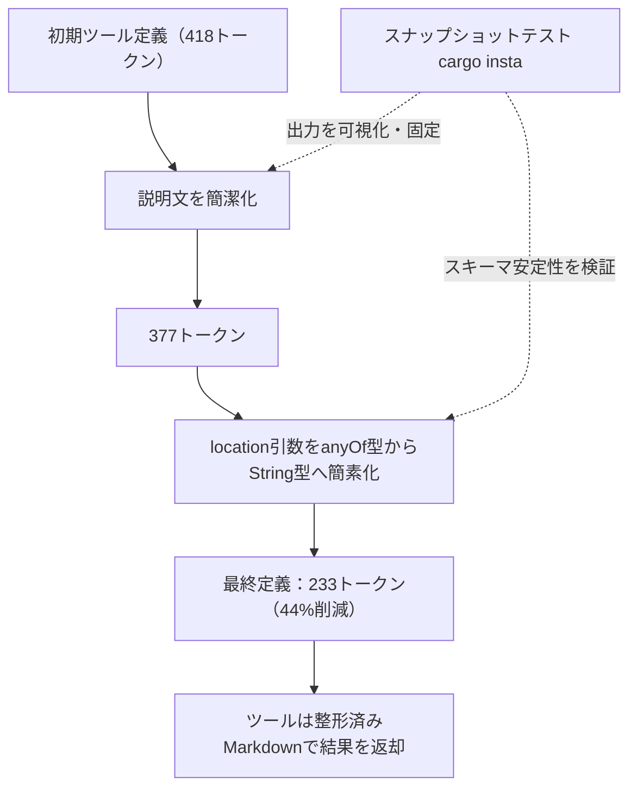
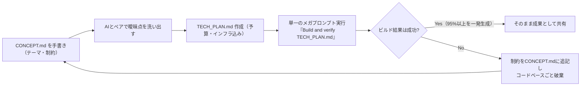
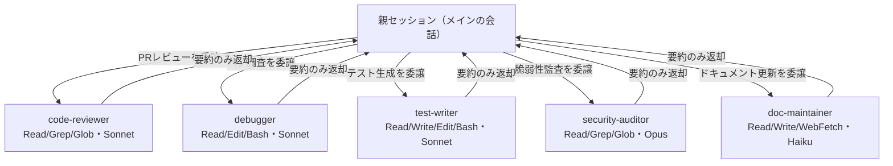

# Daily Briefing 2026-08-19

## 1. MCPツールをトークン効率よく設計する（原題: Engineering MCP Tools for Token Efficiency）

- **URL**: https://compilersaysno.com/posts/engineering-mcp-tools-for-token-efficiency/
- **公開日**: 2026-04-16（"Compiler says no!" ブログ、元はPydantic Blog掲載）
- **著者・媒体**: mbr / Compiler says no!（個人技術ブログ）

### 本文翻訳
筆者はOpen-Meteo天気APIをラップするMCPサーバーを題材に、ツール定義がどれだけコンテキストウィンドウを圧迫するかを実測しながら最適化していく。MCPは「エージェントにツールとその引数を説明する短い文章を注入する、いわば回りくどいRPC」であり、その説明文と入出力スキーマがそのままトークンコストになる。

まず出力形式について、JSONをそのまま返すかプレーンテキストで返すかを検討し、「どのみち加工が必要なら、最初から人間にも読めるMarkdownを返すべき」と判断。`comfy-table`クレートのLLM向け`ASCII_MARKDOWN`プリセットで表形式に整形する。ここで威力を発揮するのがスナップショットテスト（`cargo insta`）である。出力を固定してテストするだけでなく、「LLMに実際何が見えているか」を人間がレビューできる可視化手段になる点を強調している。

次にツール定義そのものの最適化に入る。`mercutio`ライブラリの`tool_registry!`マクロで定義した初期バージョンは418トークン。説明文を簡潔にしただけで377トークンに減る。最大の効果があったのは、`location`引数の型を`{lat, lon}` / `{place_id}` / 文字列のいずれかを受け付ける`anyOf`型（複雑なJSON Schema）から、単なる`String`型に変更したことだ。パース処理はRust側の`From<String>`実装に押し込め、`JsonSchema`実装を手書きして「見た目はただの文字列」のスキーマにする。結果、`location`の説明にコード例（"48.858, 2.294"など）を数行加えるだけで済み、最終的なツール定義は233トークンとなり、当初比44%削減を達成した。

筆者はさらに、Claude Opus 4.5のコンテキスト内訳（システムプロンプト2.5k、システムツール16.6k、MCPツール3.3k、メモリファイル8.2k、自動圧縮バッファ45.0kなど）を例示し、コンテキストウィンドウが「作業メモリ」である以上、埋まり具合が結果の質に直結すると説く。結論として、複雑な型定義をLLMに理解させるよりも、パース処理をコード側に隠して「文字列＋実例」で説明する方が、トークンも消費エラーも減らせるとまとめている。

### 重要ポイント
- ツール定義のスキーマ簡素化だけで44%のトークン削減（418→233トークン）を実測
- `anyOf`のような複雑なJSON Schemaはコスト大。パース処理をコード内に隠し、外部にはString型として見せるテクニックが有効
- スナップショットテスト（`cargo insta`等）はLLMが実際に見る出力を人間が確認・固定する手段として機能する
- 出力はJSONではなく整形済みMarkdownで返すとLLMの解釈精度が上がる
- コンテキストウィンドウ内訳を可視化すると、どこを削るべきかの優先順位が判断できる

### 図解


### 現場での適用方法

**スキル化の例（SKILL.md）**
```markdown
---
name: mcp-tool-token-audit
description: MCP/ツール定義のトークンコストを監査し、スキーマを簡素化する。新しいツールを追加した後や、コンテキスト逼迫時に使う。
---

## 手順
1. 対象ツールの入力スキーマ（JSON Schema）をAnthropic API の
   `count_tokens` エンドポイント、または `tiktoken` 等で計測する。
2. 以下を順に適用し、都度トークン数を再計測する:
   - 説明文（description）から冗長な前置きを削る
   - `anyOf` / `oneOf` など複数型を許容する引数は、
     可能な限り単純な `string` 型 + パース処理（コード側）に置き換える
   - パース可能な形式は description 内に実例を1〜2個示すだけにする
3. 出力形式は生JSONではなく、人間可読なMarkdown/表形式に整形する。
4. スナップショットテストで「LLMに見える最終出力」を固定し、
   変更時に差分がレビューできるようにする。
```

**運用手順**
1. `<REPO_PATH>` 配下のMCPサーバー実装で、各ツールの `input_schema` をJSONとして出力するテストを追加する。
2. `count_tokens` API等でJSON文字列のトークン数を測定し、閾値（例: 300トークン）を超えるツールを一覧化する。
3. 上記スキル手順に従いスキーマを簡素化し、Before/Afterのトークン数をPRの説明に記載する。

### 期待効果
記事の実測では、ツール定義のトークン数が418→233トークン（44%削減）まで圧縮された。ツールを複数登録するMCPサーバーでは、この最適化をツールごとに積み重ねることで、コンテキストウィンドウの空き容量（記事の例では約58%が「空き」）を大きく確保でき、長いセッションでの自動圧縮（オートコンパクト）発生頻度を下げられる。

### 注意点
- Rust特有の実装（`mercutio`、`schemars`の`JsonSchema`手動実装）が題材のため、他言語では同等のパース隠蔽層を自前で実装する必要がある
- 型をStringに簡素化すると、スキーマレベルでの型安全性チェックは失われる。パース失敗時のエラーメッセージ設計が別途必要
- スナップショットテストは出力形式が固定的な場合に有効。出力が毎回大きく変わるツールでは効果が薄い

---

## 2. 2026年の私のAI活用術（コーディング・執筆・学習・アシスタント運用）（原題: How I Use AI in 2026 (Coding, Writing, Learning, Assistant-ing)）

- **URL**: https://blog.sshh.io/p/how-i-use-ai-in-2026-coding-writing
- **公開日**: 2026-08-17
- **著者・媒体**: Shrivu Shankar / 個人ブログ（Substack）

### 本文翻訳
筆者は2025年版の投稿の続編として、コーディング・執筆・学習・パーソナルアシスタント運用の4領域でのAI活用を具体的に記す。

コーディングの中核は「CONCEPT.md → AIとの壁打ち → TECH_PLAN.md → 単一のメガプロンプト」という4段階フローだ。まず自分の手で数段落のCONCEPT.mdを書き、プロジェクトの理論的前提・テーマ・制約を定める。次にAIモデルとペアになり、曖昧な点や考慮漏れを洗い出す。その結果を予算やインフラ要件を含むTECH_PLAN.mdに落とし込み、最後に「Build and verify TECH_PLAN.md」という一つの巨大なプロンプトを投げて実行させる。「最初のメガビルド実行で95%以上のコードが書かれる」とし、これは細切れのチャットで段階的に直すのではなく、上流の計画に投資する「シフトレフト」思想だと説明する。ビルド結果はほぼ二値的に扱われ、うまくいかなければ細かく手直しするのではなく制約をCONCEPT.mdに追記してコードベースごと破棄し、最初からやり直す。

ツールは素のCodexとClaude Codeを使い、カスタムスキルやプラグインは「ペアプログラミング的ワークフローの補助輪」とみなしてほとんど使わない。ビルドは午前7時・午後9時に走らせ、離席中に無人実行させる。リモートでの介入は「中間成果物へのアンチパターン」として避け、tech planに基づく自動モードで人間の途中確認なしに走らせる。ハードウェアはRTX 5090搭載ゲーミングPC（機械学習・強化学習・グラフィックス研究用）、Mac mini（cloudflaredトンネル経由の日常プロジェクト用）、Modal（並列CPU/GPU計算用）の3系統を併用し、複数のtmuxターミナルで同時にエージェントを走らせる。

執筆については、AI丸投げの「スラップ（AI-slop）」への反動として、人間向け文章は手打ちを基本にし、AIは誤字・文法チェックなど生成AI以前レベルの補助に限定する。学習面では、論文や記事の全文をAIに渡し「ここで何が新しいかを説明するインタラクティブなプレイグラウンドartifactを作って」と指示し、生成された.htmlファイルで対話的に理解を深める手法を使う。パーソナルアシスタントは`/start-ops-team`という自作スキルをtmux上で常駐実行し、支払いの代行、LinkedInのDM選別、予約管理などを任せつつ、「相手が実はAIと話していると気づかないまま長々と会話させない」ことを運用上の一線として明言している。コストは月額$800（2025年）から$500（2026年）に減少（サブスク統合による）、実費換算では月$6,000相当の利用量になるという。

### 重要ポイント
- コーディングは「CONCEPT.md→AIと壁打ち→TECH_PLAN.md→単一メガプロンプト」の4段階。最初の1回の実行で95%以上のコードを生成し切る「シフトレフト」戦略
- ビルド結果は二値評価。失敗したら微修正せず、制約をCONCEPT.mdに足してゼロから作り直す
- カスタムスキル・プラグインは意図的に最小限。チャットでの細切れ指示より上流計画への投資を優先
- 無人実行前提（午前7時・午後9時に起動、途中介入なし）でエージェントを回す運用
- 月額コストはサブスク統合で$800→$500に削減しつつ利用量は増加

### 図解


### 現場での適用方法

**CLAUDE.md への追記例**
```markdown
## プロジェクト開始時のワークフロー（Shift-Left方式）

新規機能・新規プロジェクトを始める際は、以下の順で進めること。
チャットでの細切れ指示は避け、上流の計画に時間をかける。

1. `CONCEPT.md` を人間が手書きする（数段落）。
   - このプロジェクト/機能の目的・前提・制約を明記する。
2. Claude とペアで `CONCEPT.md` の曖昧点・考慮漏れを洗い出す。
   プロンプト例:
   「CONCEPT.md を読み、実装前に確認すべき曖昧な点、
   抜けているエッジケース、リスクを箇条書きで指摘して」
3. 洗い出した内容を `TECH_PLAN.md` にまとめる。
   予算（トークン/時間）、依存関係、インフラ要件を含めること。
4. 実装は単一の指示で実行する:
   「Build and verify TECH_PLAN.md」
5. 結果は二値で評価する。動かない/要件を満たさない場合は
   小さな修正を重ねるのではなく、CONCEPT.md に制約を追記して
   最初からやり直すことを検討する。
```

**運用手順**
1. リポジトリ直下に `templates/CONCEPT.md` と `templates/TECH_PLAN.md` の雛形を用意する。
2. 新規タスク着手時は `cp templates/CONCEPT.md ./CONCEPT.md` から開始し、人間がまず記入する。
3. `claude "CONCEPT.mdの曖昧点を洗い出して"` のように壁打ちフェーズを実行し、`TECH_PLAN.md` を作成する。
4. `claude --dangerously-skip-permissions "Build and verify TECH_PLAN.md"` のように無人実行し、完了をログで確認する。

### 期待効果
記事の著者は、この手法により最初のビルド実行だけでコードの95%以上が完成すると述べており、細かいチャット往復による手戻りコストを大幅に減らせる可能性がある。また複数マシン・複数ターミナルでの並列無人実行により、離席時間もアウトプットに変換できる。サブスクリプション統合によりコストは前年比37.5%減（$800→$500/月）となった一方、利用量自体は増加している。

### 注意点
- 「うまくいかなければ全部破棄してやり直す」戦略は、使い捨て前提の研究プロジェクトだからこそ成立する面がある。本番コードや長期保守が前提のプロダクトにそのまま適用すると、レビュー不足によるリスクが増す
- 無人実行（`--dangerously-skip-permissions`相当）は、実行環境の隔離やアクセス権限の制御を事前に整えないと事故のリスクがある
- 「95%を一発生成」という成果は、CONCEPT.md/TECH_PLAN.mdの質に強く依存する。計画フェーズを省略すると同じ結果は期待できない

---

## 3. Claude Codeサブエージェント実践ガイド2026（原題: Claude Code Subagents: A 2026 Practical Guide）

- **URL**: https://www.tembo.io/blog/claude-code-subagents
- **公開日**: 2026-05-15
- **著者・媒体**: Tembo（Agentic Engineering ブログ）

### 本文翻訳
サブエージェントは「独自のコンテキストウィンドウ・システムプロンプト・スコープ限定ツール・独立した権限を持つ、特定タスク専用のClaude実体」である。最大の利点はコンテキストの分離にある。調査やファイル読み込み、中間的な試行錯誤をすべてメインの会話に積み上げるのではなく、「4,000行のスタックトレース」のようなノイズをサブエージェント側のトランスクリプトに閉じ込め、親セッションには結果の要約だけを返す。これにより親セッションのコンテキストウィンドウ膨張や自動圧縮の発生を防ぐ。

サブエージェントは`.claude/agents/`（プロジェクトスコープ）または`~/.claude/agents/`（ユーザースコープ）配下のMarkdownファイルとして定義する。YAMLフロントマターに`name`と`description`は必須、`model`・`tools`・`disallowedTools`は任意。設定の優先順位は「管理者設定 → `--agents`CLIフラグ → プロジェクトの`.claude/agents/` → ユーザーの`~/.claude/agents/` → プラグインのagentsディレクトリ」の順。

標準搭載のサブエージェントは3種類：読み取り専用でHaikuを使う`Explore`（コードベース調査用、Write/Editは拒否）、プランモード用の読み取り専用`Plan`、全ツールを継承する`General-purpose`。カスタムサブエージェントは`/agents`コマンドで対話的に作成でき、許可ツール・禁止ツール・モデル（Haiku/Sonnet/Opus/inherit）を指定する。呼び出し方法は、タスク内容に応じた自動振り分け、「test-runnerサブエージェントを使って」のような自然言語指定、`@`メンション、セッション全体を切り替える`--agent`フラグの4通りがある。フォアグラウンド（ブロッキング）実行のほか、`Ctrl+B`でバックグラウンド（並行）実行も可能。実験的な「フォークモード」（v2.1.117+、環境変数`CLAUDE_CODE_FORK_SUBAGENT=1`）では、親の会話コンテキストとプロンプトキャッシュを共有継承できる。

現場でよく使われる5パターンとして、`code-reviewer`（Read/Grep/Glob、Sonnet、PRレビュー用）、`debugger`（Read/Edit/Bash/Grep/Glob、Sonnet、障害再現とパッチ適用）、`test-writer`（Read/Write/Edit/Bash/Glob/Grep、Sonnet、テスト生成）、`security-auditor`（Read/Grep/Glob、Opus、読み取り専用の脆弱性スキャン）、`doc-maintainer`（Read/Write/Edit/Glob/Grep/WebFetch/WebSearch、Haiku、ドキュメント保守）が紹介されている。制約として、サブエージェントはネストして子サブエージェントを持てないこと、毎回新規インスタンスとして起動しレイテンシがあること、バックグラウンド実行時は未承認ツールを自動拒否すること、Bash呼び出しをまたいで`cd`が永続しないこと、`bypassPermissions`は`.git`や`.claude`の変更を含む全プロンプトをスキップしてしまうことが挙げられている。

### 重要ポイント
- サブエージェントの本質的価値は「コンテキストの分離」。ノイズの多い中間作業を親セッションから切り離し、要約だけを返す
- 定義は`.claude/agents/`配下のMarkdown+YAMLフロントマター。優先順位は管理者設定＞CLIフラグ＞プロジェクト＞ユーザー＞プラグイン
- 現場では読み取り専用系（code-reviewer, security-auditor）と書き込み系（debugger, test-writer）でツール許可リストを明確に分離するのが定石
- モデル選択はHaiku（高頻度・低コスト）／Sonnet（汎用）／Opus（複雑な推論・セキュリティ監査）で使い分ける
- ネスト不可・`cd`が非永続・バックグラウンド時は未承認ツール自動拒否、といった制約を踏まえた設計が必要

### 図解


### 現場での適用方法

**スキル化の例（`.claude/agents/code-reviewer.md`）**
```markdown
---
name: code-reviewer
description: PRの差分をレビューし、重大度付きの指摘リストを返す。コード変更後に自動的に使う。
tools: Read, Grep, Glob
model: sonnet
---

あなたはコードレビュー専門のサブエージェントです。
与えられた差分（diff）に対して、以下の観点でレビューし、
重大度（critical/major/minor）付きの箇条書きで報告してください。
- 正しさ（ロジックのバグ、境界条件）
- セキュリティ（インジェクション、権限、秘密情報の露出）
- 保守性（命名、重複、過剰な抽象化）
書き込み系のツールは使わず、指摘のみを返してください。
```

**追加のサブエージェント雛形（`.claude/agents/security-auditor.md`）**
```markdown
---
name: security-auditor
description: リリース前に読み取り専用でセキュリティ脆弱性をスキャンする。
tools: Read, Grep, Glob
model: opus
---

コードベースを読み取り専用で監査し、OWASP Top 10に該当する
脆弱性の疑いがある箇所をファイルパスと行番号付きで報告してください。
修正は行わず、報告のみを行ってください。
```

**運用手順**
1. `<REPO_PATH>/.claude/agents/` を作成し、上記のような役割別Markdownを配置する。
2. `/agents` コマンドでチームに合わせて許可ツール・モデルを調整する。
3. 高頻度・定型タスク（ドキュメント更新等）は`model: haiku`、複雑な推論（セキュリティ監査等）は`model: opus`に振り分ける。
4. バックグラウンド実行が必要なタスクは`Ctrl+B`で起動し、未承認ツールが必要な場合は事前に許可リストへ追加しておく。

### 期待効果
役割ごとにツール許可リストとモデルを分離することで、親セッションのコンテキストにノイズ（大量のログや失敗した試行）が混入しなくなり、自動圧縮の発生を抑えられる。Haiku/Sonnet/Opusを役割に応じて使い分けることで、コスト効率と精度のバランスを取りやすくなる。

### 注意点
- サブエージェントは子サブエージェントをネストできないため、多段階の委譲が必要な設計にはならない
- 各呼び出しは基本的に新規インスタンスであり、明示的にメモリを有効化しない限り前回のコンテキストは引き継がれない
- `bypassPermissions`は`.git`や`.claude`ディレクトリの変更を含むあらゆる確認をスキップするため、書き込み系サブエージェントに安易に付与しない
- バックグラウンド実行中のサブエージェントは未承認ツールを（確認プロンプトなしに）自動拒否するため、事前のツール許可設計が重要
