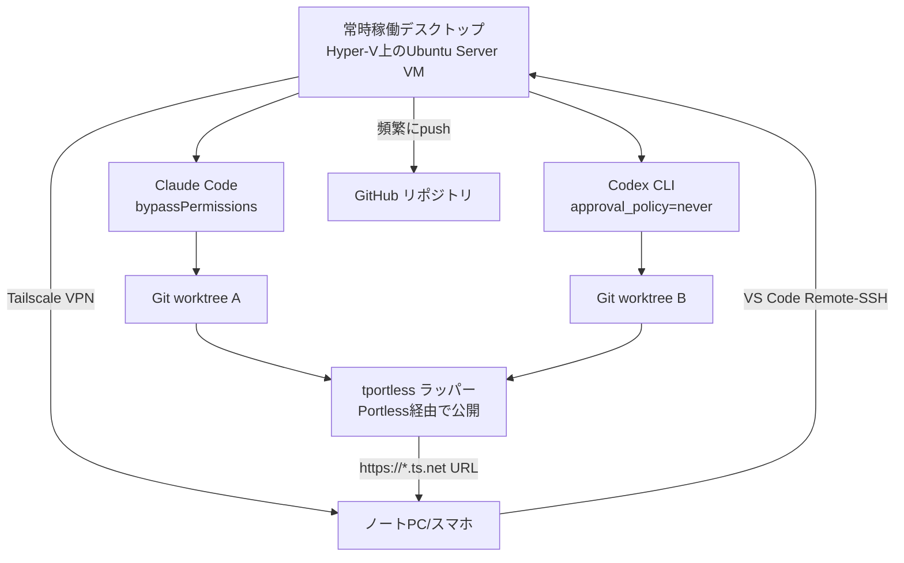
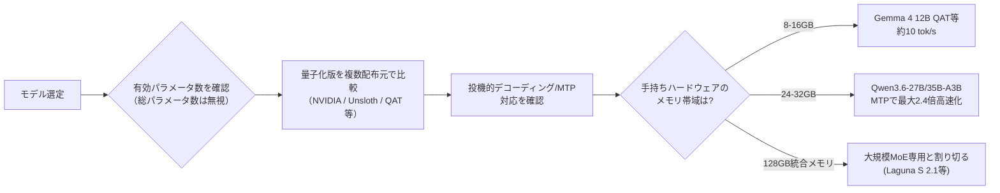
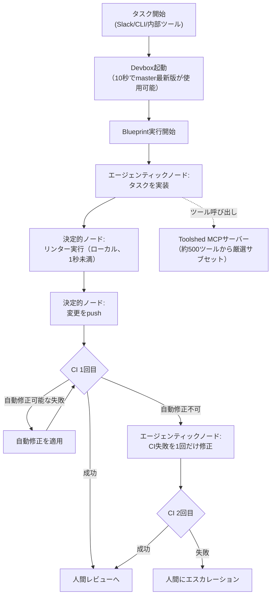

# Daily Briefing 2026-08-20

## 1. 私のエージェンティック・コーディング環境構築記（2026年7月版）（原題: My Agentic Coding Setup, July 2026）

- **URL**: https://domenic.me/agentic-coding-setup/
- **公開日**: 2026-07-23
- **著者・媒体**: Domenic Denicola / 個人ブログ

### 本文翻訳
筆者は、企業の制約下でのAIコーディングから離れ、個人で試行錯誤を重ねた末に「電車の中からスマホで本番環境のバグを直す」ことまで可能にするセットアップに辿り着いた経緯を綴る。

出発点は要件の洗い出しだ。エージェントはBashなどUnix系ツールで訓練されているため「Windows上でのエージェンティック・コーディングは事実上不可能」と判断し、Linuxを前提とする。さらに、デスクトップとノートPC間でのセッション・作業ツリー・gitignore対象ファイル（`.env`等）を保った seamless な引き継ぎ、ノートPCを閉じても継続するバックグラウンド実行、`AGENTS.md`やスキルなどユーザーグローバル設定のバージョン管理、VS Codeでのコードレビュー、HTTPS/localhostのセキュアコンテキストを持つ開発サーバー、同一プロジェクトでの並列エージェント実行、そして理想的には`--dangerously-skip-permissions`相当で動かせる使い捨てVM、という要件を列挙する。

中核はHyper-V上に構築した常時稼働デスクトップ上のUbuntu Server VMと、Tailscaleの組み合わせだ。Tailscaleは「知らなかったことが不思議なほど素晴らしいソフトウェア」で、全マシンをホスト名でSSH/HTTP(S)アクセス可能なプライベートネットワークに結びつける。SSHルールを`"check"`から`"accept"`に変更し鍵の有効期限を無効化、HTTPS証明書を有効化、Taildriveでファイル移動も可能にしている。

VM上ではClaude CodeとCodex CLIを並行運用する。クライアント側はChatGPTデスクトップアプリのSSHサポートが「非常に滑らか」で、ローカル/リモート作業をネイティブに理解し切断時も適切に扱う一方、Claudeデスクトップアプリはセッション同期が効かず、サイドバーで手動の「プロジェクト」作成が必要など課題が残る（Anthropicのエンジニアからも「チームが目指す方向ではない」とのフィードバックを得たという）。

セキュリティ面では、Codex CLIの`~/.codex/config.toml`に`approval_policy = "never"`、`sandbox_mode = "danger-full-access"`を設定。Claudeの`~/.claude/settings.json`には`"defaultMode": "bypassPermissions"`と`skipDangerousModePermissionPrompt: true`を設定する。加えてsudoers追加や`gh` CLIのログインも行う。筆者は「この設定では、エージェントがGitHubリポジトリを削除したり、gitignore対象の秘密情報をアップロードしたり、ユーザー名義でIssueに返信したり、VMのホームディレクトリを丸ごと消したりし得る」とリスクを認めつつ、「実際にはうまくいっている。エージェントは（今のところ）integrityがあり悪意がないようだ」と述べる。実際にChatGPT 5.6 Solが「マージして」という指示をレビュー待ちせず実行してしまった例も紹介し、対策として「頻繁にGitHubへコミットをpushする」ことでVMリセット時の被害を最小化している。

並列作業にはGit worktreeを使う。ChatGPT/Claude両アプリともチェックボックスでworktree作成に対応するが、Claudeのデフォルト配置（プロジェクト内`.claude/worktrees/`）はNode.jsのモジュール探索が古い依存関係を辿ってしまう、`deno task --recursive`がworktree内に迷い込む等の問題を引き起こすため、目下ChatGPT側を優先しているという。

コードレビューはVS CodeのRemote-SSH拡張機能とTailscale SSHを組み合わせて実現。開発サーバーの公開には、当初のポートフォワーディングから`Portless`に移行し、`PORTLESS_TAILSCALE=1`と`PORTLESS_PORT`を設定するラッパースクリプト`tportless`を作成、`AGENTS.md`に「`npm run dev`等を直接実行せず`tportless`を使うこと」と明記した。これにより並列worktree間でポート衝突しない、tailnet内限定の`https://...ts.net:8443/`のようなURLが得られる。

設定同期には`chezmoi`を用い、複数マシンのdotfiles・スキル・ハーネス設定・`AGENTS.md`をプライベートGitHubリポジトリで一元管理する。セットアップ自体もエージェントに「各ホストの既存dotfilesを調べて、プラットフォーム別ガード付きで統合案を作って」と指示して構築させたという。

最後に、パーティで見つけた本番バグを電車の中からChatGPTモバイルアプリで修正し、プッシュ通知で受け取ったtailnet経由のプレビューURLで確認、PRを作成し、帰宅前にGitHub Actionsが完了してデプロイが完了する、というモバイル起点のワークフロー例を紹介。今後の課題としては、dev containerによる安全性向上、フォルダ名変更時のセッション履歴消失問題、セッション記録のバックアップ機構の欠如を挙げ、「ハーネスアプリ自体に組み込まれるまでは真にシームレスにはならないだろう」と結んでいる。

### 重要ポイント
- 使い捨てVM（Ubuntu Server on Hyper-V）＋Tailscaleにより、`--dangerously-skip-permissions`相当の権限を安全な隔離環境で使える
- Codex CLIは`approval_policy = "never"` + `sandbox_mode = "danger-full-access"`、Claude Codeは`defaultMode: bypassPermissions`で無承認実行を設定
- 事故対策の要は「頻繁なGitHubへのpush」。VMが壊れても作業はリモートに残る
- Git worktreeでの並列エージェント実行時、Claude Codeのデフォルトworktree配置（プロジェクト内）はNode.js依存解決等と衝突するため注意が必要
- `tportless`のような軽量ラッパーでTailscale経由の開発サーバー公開を自動化し、`AGENTS.md`に使用ルールを明記する運用が有効

### 図解


### 現場での適用方法

**AGENTS.md への追記例**
```markdown
## 開発サーバーの起動ルール

プレビュー用サーバーを立ち上げる際は、`npm run dev` 等を直接実行しないこと。
必ず `tportless` ラッパー経由で起動する。
- 単体: `tportless`（プロジェクトのdevスクリプトをプロキシ経由で実行）
- 汎用: `tportless <アプリ名> <コマンド…>`

これにより並列worktree間でのポート衝突を避け、Tailscale経由の
セキュアなプレビューURLを利用者に提示できる。
```

**スクリプト化の例（`~/.local/bin/tportless`）**
```bash
#!/usr/bin/env bash
set -euo pipefail

export PORTLESS_TAILSCALE=1
export PORTLESS_PORT="${PORTLESS_PORT:-1355}"

exec portless "$@"
```

**運用手順**
1. `<VM_HOST>` にUbuntu Server等の使い捨てVMを用意し、Tailscaleをインストールして`tailscale up --ssh`でSSHアクセスを有効化する。
2. Tailscale管理画面でSSHルールを`accept`に変更し、必要に応じて鍵の有効期限を無効化する。
3. VM上に`Portless`をインストールし、上記`tportless`スクリプトを`$PATH`に配置する。
4. Claude Code設定（`~/.claude/settings.json`）で無承認実行を有効化する前に、必ずGit worktreeでの並列実行運用と「頻繁にpushする」ルールを`AGENTS.md`へ明記してからチームに展開する。
5. クライアント端末にVS Code Remote-SSH拡張を入れ、`Remote-SSH: Connect to Host…`でVMへ接続してレビューを行う。

### 期待効果
記事では明確な定量効果は示されていないが、モバイル起点で「電車に乗っている間にバグ修正PRを作成し、帰宅前にデプロイまで完了する」という具体例が挙げられており、常時稼働の隔離環境と無承認実行の組み合わせにより、人間の待機時間をゼロにした非同期開発が可能になることを示している。

### 注意点
- `bypassPermissions`や`danger-full-access`は、GitHubリポジトリの削除や秘密情報の漏洩など重大な事故リスクを伴う。使い捨てVMなど強い隔離環境なしに本番環境や共有マシンへ適用すべきではない
- Claude Codeのworktreeデフォルト配置に起因する依存解決の不具合など、ハーネス側の未成熟な部分に依存した回避策が含まれるため、ツールのアップデートで動作が変わる可能性がある
- 個人の趣味的なセットアップの記録であり、組織のセキュリティポリシーやコンプライアンス要件がある環境ではそのまま適用できない

---

## 2. 2026年夏のローカルLLM事情を整理してみた（原題: I tried to organize the state of local LLMs in the summer of 2026）

- **URL**: https://dev.classmethod.jp/en/articles/local-llm-guide-2026-summer/
- **公開日**: 2026-07-24
- **著者・媒体**: 森茂洋（Hiroshi Morishige） / Classmethod（DevelopersIO）

### 本文翻訳
2026年1月に書いた前回のローカルLLMガイドから半年分のアップデートをまとめた記事。検証はDGX Spark（GB10、128GB統合メモリ）とMac mini M4（16GB）で実施している。

最大の変化は「MoE＋4bit量子化が主流になったこと」と「投機的デコーディング（speculative decoding）が実用段階に入ったこと」だ。1月時点ではdenseモデルが主流だったが、7月にはQwen3.6-35B-A3B、Gemma 4 26B-A4B、DeepSeek V4など新規リリースのほぼすべてがMoEアーキテクチャを採用。量子化についても「ユーザー側の節約テクニック」から「配布元が最初からNVFP4/QAT版を提供する」方式へとビジネスモデルレベルで変化した。投機的デコーディングはMTP（Multi-Token Prediction）による実装でvLLMやOllama上で1.4〜2.4倍の高速化を達成している。

用途別のおすすめモデルも刷新された。日本語の汎用チャットはQwen3-14BからQwen3.6-35B-A3BまたはGemma 4 26B-A4Bへ、コーディングはDevstral Small 2からQwen3.6-27B-coding・Devstral 2・Laguna S 2.1へ、16GB帯の軽量モデルはgpt-oss-20b/Qwen3-1.7BからGemma 4 12B（QAT）/gpt-oss-20bへ移行した。Qwen3.6とGemma 4はいずれもApache 2.0ライセンスであり、「商用利用の観点から選びやすい上位2択」と評価している。日本語性能（Nejumi Leaderboard 4、2026年7月）ではQwen3.6が引き続きオープンモデル最上位を独占（27Bクラスで0.80超）、Gemma 4は「○」から「◎」に格上げされ31Bがオープンモデル3位（0.8077）となった。

デコード速度の本質について、筆者は「デコード速度はほぼ完全に『1トークンあたりに読み込むバイト数』で決まる」と指摘する。これは「有効パラメータ数×量子化のバイト数」に反比例し、総パラメータ数は速度の指標にならない。実測ではQwen3.6-35B-A3Bが素の状態で76.66 tok/s、投機的デコーディングで108.3 tok/s（1.4倍）。Qwen3.6-27B（dense）は12.13 tok/sに対し、MTPで29.38 tok/s（2.4倍）まで向上する。総パラメータ118BのLaguna S 2.1（有効8.5B）が、27Bのdenseモデルより速いという逆転現象も普通に起こると説明している。

量子化フォーマットの選択も速度に大きく影響する。同じQwen3.6-35B-A3Bでも、NVIDIA配布のNVFP4（76.66 tok/s）はUnsloth版NVFP4（67.52 tok/s）に勝るが、Gemma 4 26B-A4Bでは逆にUnsloth版（49.13 tok/s）がNVIDIA版（31.63 tok/s）を+55%上回る。さらにOllamaでのGemma 4公式QAT版は55.46 tok/sを記録し、vLLMのNVFP4ベース（49.13）を上回った。筆者は「同じモデルの4bit版を複数の配布元が出している場合は両方試して速い方を使うべき」と助言する。

ハードウェア要件は8GB〜128GB統合メモリまでの階層で整理されており、特に注目すべきは「128GB統合メモリ」の現実的な選択肢化だ。AMD Ryzen AI Max+ 395（Strix Halo）搭載機は約256GB/s帯域（DGX Sparkの273GB/sに近い）を持ち、2026年7月時点で最低$1,800〜2,000、上位モデルは$3,000以上。ただし「24GBクラスの単体GPUより帯域が狭いため、大きなdenseモデルはメモリに載っても速く動かない」とし、「128GB統合メモリ機は大規模MoEモデル専用ハードウェアと考えるのが現実的」と釘を刺す。Mac mini M4（16GB）でのGemma 4 12B QATはOllamaで11.26 tok/s、Nemotron 9BはLM Studioで9.29 tok/sと、「待っている間に読み進められる程度の10 tok/s前後」と評価している。中古GPU市場では「中古RTX 4090が新品RTX 5080より高い」逆転現象が起きており、中古RTX 3090（24GB）が引き続き定番だがマイニング酷使品には注意が必要という。

ツール面では、Ollamaが0.20系の59.70 tok/sから0.32.3系で76.19 tok/s（ランタイム更新だけで+28%）と大幅に高速化し、「Ollamaは便利だが遅い」という従来の定説はシングルストリーム用途では過去のものになったと評価。Apple SiliconではGemma 4のMTPがデフォルト化し約90%高速化、エージェント連携もClaude Codeから16種類（Codex、Copilot、Cline等）に拡大した。一方LM Studioは0.3.23で導入された「MoEエキスパートをCPUにオフロードするトグル」が0.4系でレイヤー単位のスライダーに置き換えられ、旧トグルの復活を求める声がバグトラッカーに上がっているという。llama.cppは`--spec-type draft-mtp`によるDeepSeek/GLMのMTPヘッド対応の投機的デコーディングを追加した。またApple純正のFoundation ModelsフレームワークがHugging Face MLXコミュニティのサードパーティモデルを受け入れるようになり、「MacのローカルLLMはGGUF一強からMLXが第二の標準になりつつある」と指摘する。

最後に、モデルをオーケストレーションするルーティング層の萌芽にも触れ、筆者自身「ローカルのQwen3.6でディスパッチ判断をする構成を使っている」と明かし、「スペックシートを見る時は総パラメータ数ではなく有効パラメータ数を見る」「量子化版は複数配布元を試す」「投機的デコーディング/MTPを常にチェックする」という3つの実践的習慣を推奨して締めくくっている。

### 重要ポイント
- MoE＋4bit量子化が主流化し、配布元が最初から量子化版を提供するようになった。デコード速度は「有効パラメータ数×量子化バイト数」で決まり、総パラメータ数は指標にならない
- 投機的デコーディング（MTP）はQwen3.6-27Bで2.4倍、Qwen3.6-35B-A3Bで1.4倍の実測高速化
- 同一モデルでも量子化配布元によって速度が大きく異なる（Gemma 4でUnsloth版がNVIDIA版を+55%上回る例あり）ため、複数配布元を試すべき
- 128GB統合メモリ機（Strix Halo等、$1,800〜)は大規模MoE専用と割り切るのが現実的。24GB級GPUより帯域が狭い
- Ollamaはランタイム更新だけで+28%高速化し、「便利だが遅い」という評価は単一ストリーム用途では過去のものに

### 図解


### 現場での適用方法

**運用手順（ローカルLLM選定チェックリスト）**
1. 候補モデルのスペックシートで「Active Parameters（有効パラメータ）」を確認する。総パラメータ数だけで速度を判断しない。
2. 同一モデルの量子化版が複数配布元（例: NVIDIA NVFP4、Unsloth、公式QAT）から出ている場合、Ollama等で両方ダウンロードして実測比較する。
   ```bash
   ollama pull gemma4:26b-a4b-qat
   ollama pull gemma4:26b-a4b-nvfp4
   # それぞれで同一プロンプトのtok/sを比較
   ollama run gemma4:26b-a4b-qat --verbose
   ```
3. 投機的デコーディング（MTP）対応の有無を確認する。llama.cppでは以下のように有効化する。
   ```bash
   llama-server -m model.gguf --spec-type draft-mtp
   ```
4. 手持ちのVRAM/統合メモリ容量から下表の階層を参照し、該当する候補モデルに絞り込む（8GB/16GB/24GB/32GB/64GB+/128GB統合メモリ）。
5. 選定結果と実測tok/sをチームのWikiやREADMEに記録し、半年後の再評価に備える。

**CLAUDE.md への追記例（ローカルLLMをサブタスクに使う場合）**
```markdown
## ローカルLLMの使い分けルール

軽量なディスパッチ判断・ルーティング用途にはローカルのQwen3.6系モデルを使う。
以下を満たさない場合はローカルLLMを使わず、クラウドモデルにフォールバックすること。
- 有効パラメータが手元GPU/統合メモリの帯域で実用速度（10 tok/s以上）が出る
- 量子化版が複数配布元から出ている場合は事前にベンチマーク済みである
- 投機的デコーディング（MTP等）が有効化されている
```

### 期待効果
記事の実測では、ランタイム更新のみでOllamaが+28%高速化、投機的デコーディング（MTP）併用でQwen3.6-27Bが2.4倍、Qwen3.6-35B-A3Bが1.4倍の速度向上を達成している。量子化配布元の選び直しだけでも+55%の速度差が生じるケースがあり、モデル選定時のチェックリスト運用によって、追加のハードウェア投資なしに体感速度を大きく改善できる可能性がある。

### 注意点
- ベンチマーク数値はDGX Spark（128GB統合メモリ）とMac mini M4という特定ハードウェアでの実測であり、他の環境（Windows+単体GPU等）ではそのまま再現しない可能性がある
- 128GB統合メモリ機は「大規模モデルが載る」ことと「速く動く」ことが必ずしも一致しない点に注意が必要。購入前に用途（大規模MoEか否か）を明確にすべき
- ツールのアップデート速度が非常に速い分野であり（Ollamaが半年で+28%等）、本記事の数値も半年後には陳腐化する可能性が高い。定期的な再検証が前提となる

---

## 3. Stripeの一発完結型コーディングエージェント「Minions」その2：Devbox・Blueprint・Toolshedの内部構造（原題: Minions: Stripe's one-shot, end-to-end coding agents—Part 2）

- **URL**: https://stripe.dev/blog/minions-stripes-one-shot-end-to-end-coding-agents-part-2
- **公開日**: 2026-02-19
- **著者・媒体**: Alistair Gray / Stripe Dot Dev Blog

### 本文翻訳
Stripeの自律コーディングエージェント「Minions」は、人間の監督なしに毎週1,300件超のプルリクエストをマージしている（Part 1公開時点の1,000件から増加）。本稿はPart 1（開発者体験編）に続き、インフラ構造（devbox、blueprint、Toolshed）に焦点を当てる。

基盤となるのは**devbox**と呼ばれる標準化されたAWS EC2インスタンス群だ。Stripeのエンジニアが日常的にSSH接続して使う開発環境そのものであり、「ペットではなく家畜」として扱われる——つまり個別カスタマイズされた長期稼働マシンではなく、標準化され容易に置き換え可能なものとして運用する。事前プロビジョニングとウォームアップにより起動から10秒で準備完了となり、Stripeの全主要リポジトリのmasterの最新コピーがチェックアウトされ、REPLの起動・テスト実行・コード変更と型チェック・Webサービス起動が即座に可能な状態になる。この隔離性が鍵で、「エージェントが起こしうるミスは1つのdevboxという限定されたblast radius（被害範囲）に閉じ込められる」ため、フル権限で安全に動かせる。

オーケストレーションの中核が**blueprint**だ。「blueprintはコードで定義されたワークフローであり、workflowの決定性とagentの柔軟性を組み合わせたもの。各ノードは決定的なコードを実行することも、特定タスクに集中したエージェントループを実行することもできる」と説明される。決定的ノード（図では四角形）は「設定済みリンターの実行」「変更のpush」のようにLLMを介さず確実に実行され、エージェンティックノード（雲形）は「タスクの実装」「CI失敗の修正」のように広い裁量を持ってLLMが判断する。この設計思想について筆者は「『always lint changes at the end of a run』のように事前に予測できる小さな判断を決定的コードで処理することで、スケール時のトークン数（およびCIコスト）を節約でき、エージェントが間違える余地も減る。『LLMを閉じた箱に入れる』ことの積み重ねが、システム全体の信頼性向上につながる」と述べる。各チームは独自のblueprintを構築でき、「単純な決定的codemodでは実現できない、コードベース全体にまたがる厄介なLLM支援マイグレーション」を実行するカスタムblueprintの例も紹介されている。

コンテキスト取得にはルールファイル（CLAUDE.md/AGENTS.md形式）を用いるが、グローバルな広範ルールはコンテキストを圧迫するため、「特定のサブディレクトリやファイルパターンにスコープされ、エージェントがファイルシステムを辿る際に自動的に付与される」形式を採用。Stripeはこの機能をサポートする人気の高いルール形式——Cursorの形式——を標準に定め、独自ハーネスを改修してMinionsが従来の自社形式に加えてCursorルールも読めるようにした。現在はCursorルールをClaude Code互換形式へ同期させ、Minions・Cursor・Claude Codeの間で一貫性を持たせている。

ツールアクセスは社内MCPサーバー**Toolshed**が担う。社内システムやSaaSプラットフォーム向けに約500のMCPツールを提供し、ノーコード内製ビルダー・専用サービスエージェント・サードパーティツール・CLIエージェントツール・Slackボットなど、Stripeの全エージェント系システムから利用される。「エージェントは、丁寧に厳選された小さな道具箱を与えられたときに最も良く機能する」という方針のもと、各エージェントはToolshedの一部サブセットのみを要求するよう設定されており、Minionsもデフォルトでは意図的に絞り込まれたツールセットしか持たない（ユーザーごとのカスタマイズで追加のテーマ別ツールセットを設定することは可能）。加えてdevboxはQA環境で動作するため、「Minionsは実データ、本番サービス、任意のネットワーク egress にアクセスできない」というセキュリティ境界も設けられている。

フィードバックの仕組みは2段階のCIラウンド制を採用する。まずpush前にローカルでリンターを実行する決定的ノードがあり、バックグラウンドデーモンがlint結果をキャッシュすることで通常1秒未満でフィードバックが得られる。次にpush後にフルCIスイートが実行され、失敗したテストには自動修正が適用される。それでも自動修正できない失敗が残った場合、blueprintのエージェントノードに失敗情報が渡され1回だけ追加の修正を試みる。2回目のpush・CI実行後は、人間のレビュー担当者にブランチが引き継がれる。「CI実行はトークン・計算資源・時間のコストがかかり、LLMを無制限にフルCIループへ回し続けることには収穫逓減がある」というのがその理由だ。Stripeは300万件超のテストを保持しており、これらが自動フィードバックの基盤となっている。「フィードバックを左にシフトする」思想のもと、CIのみに頼らずIDE・pre-push段階でのチェックを重視している。

MinionsはBlock社のオープンソースコーディングエージェント「goose」のフォークを基盤とし、2024年後半からStripe独自のLLM基盤向けにカスタマイズされてきた。人間の監督なしに動作する点が、CursorやClaude Codeのような人間同伴型ツールと異なり、フル権限や確認プロンプトのスキップを可能にしている最大の要因である。

### 重要ポイント
- 「blueprint」は決定的コードノード（lint実行・push等）とエージェンティックノード（実装・CI修正等）を組み合わせたステートマシン。予測可能な小タスクをコードに固定することでトークン消費とエラー機会を削減する
- devboxという標準化・使い捨て可能な隔離環境（10秒起動）が「エージェントのミスの被害範囲を1台に限定する」ことでフル権限運用を安全にしている
- ルールファイル（CLAUDE.md/AGENTS.md）はグローバル一括ではなく、サブディレクトリ/ファイルパターン単位でスコープし、業界標準（Cursor形式）に合わせて他ツールとも互換性を持たせる
- 社内MCPサーバー「Toolshed」（約500ツール）から、エージェントごとに意図的に絞り込んだツールサブセットのみを与える「小さな道具箱」戦略
- CIループは2回までで打ち切り、それ以上は人間にエスカレーションする収穫逓減ベースの設計

### 図解


### 現場での適用方法

**運用手順（blueprint的なCI打ち切りルールの導入）**
社内のエージェントハーネスに、Stripeと同様の「2回で打ち切り」パターンを導入する手順の例。

1. リポジトリのpre-pushフックにローカルリンターを追加し、結果をキャッシュしてサブ秒でフィードバックできるようにする。
   ```bash
   # .git/hooks/pre-push またはCIの最初のステップ
   npx eslint . --cache --cache-location .eslintcache
   ```
2. CIワークフロー側で「1回目のCI失敗時は自動修正パッチを試す→再度失敗したらエージェントに1回だけ修正を依頼する→それでも失敗したら人間にアサインする」という上限2ラウンドのロジックを実装する。
3. エージェント向けのルールファイルは、リポジトリ直下に1つの巨大な設定を置くのではなく、`packages/*/CLAUDE.md`のようにサブディレクトリ単位で分割し、該当パスを扱う時だけコンテキストに読み込まれるようにする。

**スキル化の例（`.claude/skills/ci-escalation-guard/SKILL.md`）**
```markdown
---
name: ci-escalation-guard
description: CI失敗時の自動修正試行を2回までに制限し、それ以上は人間にエスカレーションする。無限リトライによるトークン浪費を防ぐために使う。
---

## 手順
1. CI失敗のログを受け取ったら、まず自動修正可能なエラー（lintルール違反、
   フォーマット崩れ等）かどうかを判定し、可能なら自動修正パッチを適用して
   再実行する。
2. 自動修正で解決しない失敗が出た場合、原因を分析し1回だけ修正を試みる。
3. 2回目の修正後もCIが失敗する場合は、それ以上リトライせず、失敗内容を
   要約して人間の担当者にエスカレーションする（PRコメント等で明示）。
```

### 期待効果
Stripeの実例では、この「決定的ノード＋エージェンティックノード」のハイブリッド設計と2ラウンド制のCIエスカレーションにより、週1,300件超（従来1,000件から増加）のプルリクエストを完全無人でマージまで到達させている。CI実行を無制限に回さない設計により、トークン・計算資源・時間のコストを抑えつつ、エージェントが自力で解決できない問題を早期に人間へ引き渡す仕組みが機能している。

### 注意点
- この規模のインフラ（500ツールを提供する自社MCPサーバー、300万件超のテスト、専用devbox基盤）は大企業のエンジニアリング組織を前提としており、小規模チームがそのまま模倣するのは難しい。エッセンスである「決定的ノードとエージェンティックノードの分離」「CIラウンド数の上限設定」から段階的に導入するのが現実的
- Minionsがdevbox＝QA環境で動作し本番データや任意のネットワークegressにアクセスできないという前提があってこそフル権限運用が成立している。同様の隔離を用意せずに無制限権限を与えるのは危険
- ルールファイルのサブディレクトリ単位スコープや業界標準形式（Cursor形式）への統一は、既存の自社ルール資産の移行コストを伴う可能性がある

