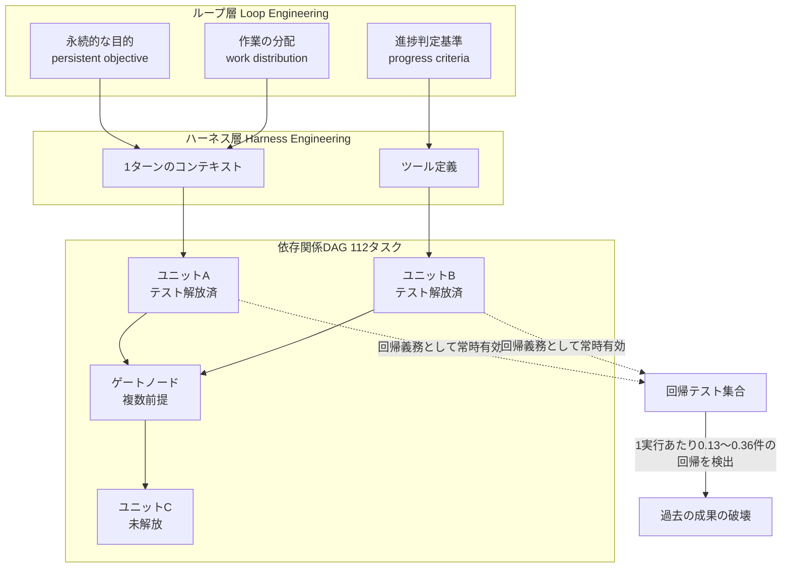
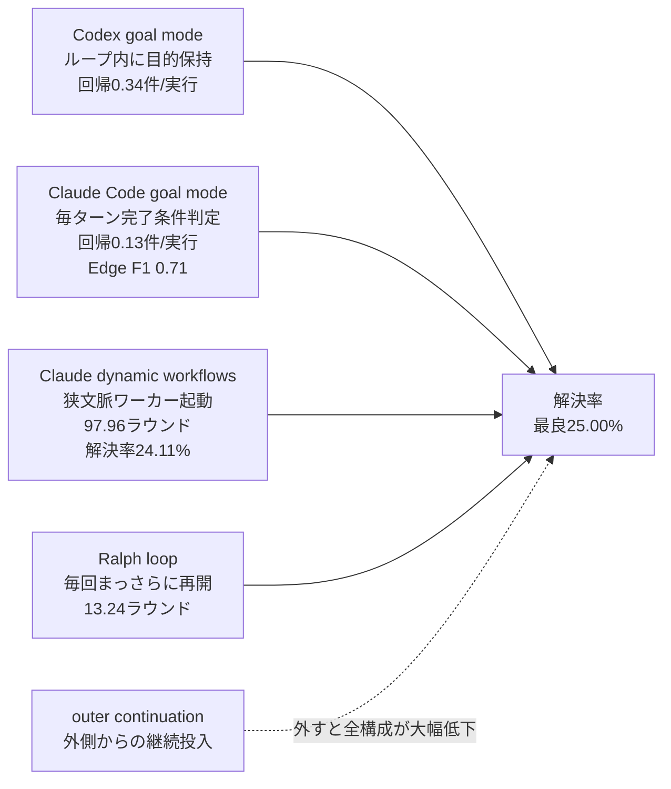
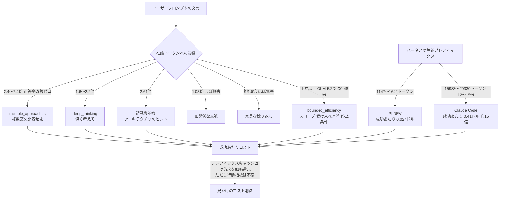
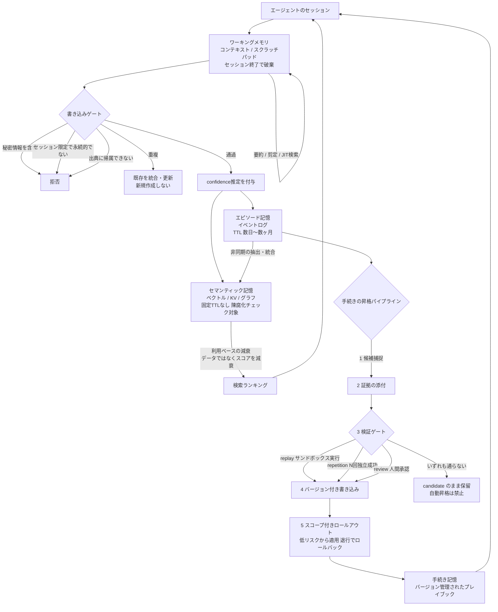

# Daily Briefing 2026-08-21

## 1. LoopsBench: コーディングエージェント評価におけるハーネスエンジニアリングからループエンジニアリングへ（原題: LoopsBench: From Harness Engineering to Loop Engineering in Coding Agent Evaluation）

- **URL**: https://arxiv.org/abs/2608.00267
- **公開日**: 2026-07-31（2026-08-10 改訂）
- **著者・媒体**: Han Li, Zhemin Fang, Rili Feng ほか / arXiv（ベンチマークは microsoft/Loopsbench としてOSS公開）

### 本文翻訳
コーディングエージェントのインフラは、局所的なコード生成とテストに焦点を当てた「ハーネスエンジニアリング」から、長期にわたる持続的実行を管理する「ループエンジニアリング」へと重心を移しつつある。ハーネスが「1ターンでモデルに何を見せ、どのツールを与えるか」を扱うのに対し、ループ層は永続的な目的（persistent objective）、作業の分配（work distribution）、そして長時間の実行をまたいで維持される進捗判定基準（progress criteria）を扱う。既存のベンチマークは局所的なタスクか最終成果物のみを見ており、依存関係が積み上がる状況でエージェントがどう振る舞うかを診断できない。

そこで著者らは LOOPSBENCH を構築した。各タスクは「個別にテスト可能な開発ユニット」をノードとする依存関係DAGであり、エッジは原典から根拠を得た前提条件（source-evidenced prerequisite edges）として与えられる。タスクは112件、8つのプログラミング言語と9つのドメイン（システム、機械学習、ゲームエンジン、形式検証など）にまたがる。出典は3系統で、GitHubのPRシーケンスが29件、大学のコースラボが57件、研究論文の発展過程が26件。総計5,300以上の開発ユニットと実行可能テストが含まれる。

エッジの認定パターンは4種類ある。逐次的なPRチェーン、構造的なモジュール再利用、機能的な生産者-消費者関係、そして合成的な階層化である。ランタイムは「flow-aware」で、DAGの ready frontier（前提が満たされた層）に沿ってテストを層ごとに解放していく。複数の前提を持つノードはゲートとして働き、そのテストは通過するまで封印され、通過後は後続層に対する**回帰テスト（regression obligation）として恒久的に有効化され続ける**。これにより「一度満たした要件をループが保持できているか」を直接測定できる。

評価では4つのループ実装を比較した。(1) Codex goal mode はCodexのループ内部に永続的な目的を保持する。(2) Claude Code goal mode は各ターン終了後にセッションの完了条件を判定する。(3) Claude dynamic workflows はタスク固有のワーカーを起動し、それぞれ狭いローカルコンテキストで作業させる。(4) Ralph loop は残余作業に対して毎回まっさらな呼び出しを再開する。加えて全プロファイルに「outer continuation（外側からの継続投入）」を与え、浅い停滞パターンを補正した。

主要結果（RQ1、進捗の持続性）は厳しいものだった。最強構成である Opus-4.7 + Claude Code + outer continuation でも解決率は **25.00%** にとどまる。GPT-5.5 は 21.43%、Sonnet-4.5 は 17.86%（いずれも継続投入あり）。継続投入を外すと全構成で解決率が大幅に落ちるため、ループは深い依存構造に対して単独では容易に停滞することが分かる。

RQ2（計画・コード・テストの状態）では、記録された計画が原典由来の前提条件を大きく取りこぼしていた。計画の忠実度（Edge F1）は Claude Code の 0.71 から mini-swe-agent の 0.27 まで幅がある。つまりクローズドソースの実装ですら、参照DAGの前提エッジの多くを計画に書き残していない。またパッチ長は一貫して参照実装を上回り（トークン重複は保たれているため方向性は同等）、テストの新規作成はどの実装でも希薄だった。

RQ3（ループエンジニアリング要因）では、コンテキスト予算の更新頻度がプロファイル間で大きく異なった。dynamic workflows は 97.96 ラウンドを要するのに対し Ralph は 13.24 ラウンド。回帰イベントは全プロファイルで観測され、1実行あたり dynamic 0.36件、Codex 0.34件、Claude Code 0.13件。注目すべきは、**コンテキストを更新（renewal）しても回帰圧力は消えない**という点である。コンテキスト上限を回避するために投入されたワーカーは、明示的な状態追跡がなければ以前の成果を壊す。それでも dynamic workflows はコンテキストの断片化を抱えながら最高の解決率 24.11% を記録した。

著者らの結論は明快だ。長期的なコーディングにおいて律速となるのはモデル選択だけではなく**ループ設計そのもの**である。取りこぼした依存関係と希薄なテスト記述は反復のたびに複合的に悪化する。前提条件を通じてどう作業を分配するかというルーティング判断が回帰リスクを形作る。外側からの継続投入は効果はあるが十分ではない（それでも75%のタスクが未解決）。改善の方向は生の生成性能ではなく、構造化された状態維持と前提条件ルーティングにある。

### 重要ポイント
- ループ設計の焦点は「永続的な目的・作業の分配・進捗判定基準」の3点であり、ハーネス（1ターンの文脈とツール）とは層が異なる
- 最強構成（Opus-4.7 + Claude Code + 外側継続）でも長期タスクの解決率は25.00%。継続投入を外すと全構成が大幅に低下する
- 計画の忠実度（Edge F1）は最良の Claude Code でも0.71。エージェントは自分の計画に前提条件を書き残せていない
- **コンテキストを更新しても回帰は消えない**。ワーカーを分離しただけでは以前の成果を壊す。明示的な状態追跡が必須
- 完了済みユニットのテストを「回帰義務」として常時有効化し続けることで、ループの状態保持能力を可視化できる

### 図解




### 現場での適用方法

論文の核心は「ループには明示的な状態追跡と回帰義務がなければ、コンテキストを更新しても過去の成果を壊す」という点である。これを自分のリポジトリで再現するには、(a) 完了したユニットのテストを恒久的な回帰スイートに昇格させ、(b) ループの各反復でそれを必ず実行し、(c) 計画ファイルに前提条件を明示的に書き残させる、という3点を仕組みとして固定する。

**1) CLAUDE.md への追記例（ループ実行時の状態追跡ルール）**

```markdown
## 長期タスクのループ実行ルール

`/goal` や `/loop`、あるいはワーカー分割で長期作業を進める際は、以下を必ず守ること。

### 計画ファイル（PLAN.md）に前提条件を明示する
作業を分解したら `PLAN.md` に DAG として書き出す。各ユニットについて
「ID / 内容 / 前提となるユニットID / 検証コマンド」の4列を必ず埋める。
前提が思い当たらない場合も `前提: なし` と明記する（空欄禁止）。

| ID | 内容 | 前提 | 検証コマンド |
|----|------|------|--------------|
| U1 | パーサのトークナイザ実装 | なし | `pytest tests/test_tokenizer.py` |
| U2 | AST構築 | U1 | `pytest tests/test_ast.py` |

### 完了ユニットは回帰義務になる
ユニットの検証コマンドが通ったら、そのコマンドを `scripts/regression.sh` に
追記する。以降**すべての反復の冒頭で** `scripts/regression.sh` を実行し、
1件でも失敗したら新規実装より先にその修復を行うこと。

### ワーカーに作業を委譲する場合
サブエージェント／ワーカーへ渡すプロンプトには、必ず
「PLAN.md の該当ユニットの前提IDと、scripts/regression.sh の実行結果」を含める。
狭いコンテキストで作業させること自体が回帰の原因になるため、
状態はコンテキストではなくファイルで受け渡す。
```

**2) スクリプト化の例（回帰義務スイートと、それを強制するループ）**

`scripts/regression.sh` — 完了ユニットの検証コマンドを追記していく台帳。

```bash
#!/usr/bin/env bash
# 完了した開発ユニットの検証コマンドを追記していく回帰義務スイート。
# ユニットが通るたびに1行追加する。行は絶対に削除しない。
set -euo pipefail

run() {
  echo "--- $* ---"
  if ! "$@"; then
    echo "REGRESSION: $*" >&2
    exit 1
  fi
}

# U1: トークナイザ
run pytest -q tests/test_tokenizer.py
# U2: AST構築
run pytest -q tests/test_ast.py
# 以降、ユニット完了ごとに追記
```

`scripts/loop.sh` — 反復のたびに回帰義務を先に検証してから次の作業へ進むループ。

```bash
#!/usr/bin/env bash
# 依存DAGに沿った長期タスクを、回帰義務チェック付きで反復実行する。
# 使い方: ./scripts/loop.sh [最大反復回数]
set -uo pipefail

REPO="<REPO_PATH>"
MAX_ITER="${1:-20}"
STALL_LIMIT=3          # 同一エラーがN回続いたら人間にエスカレーション
cd "$REPO"

prev_sig=""
stall=0

for i in $(seq 1 "$MAX_ITER"); do
  echo "=== iteration $i / $MAX_ITER ==="

  # 1) まず回帰義務。ここが赤ければ新規実装より修復が最優先
  if ! ./scripts/regression.sh > /tmp/regression.log 2>&1; then
    task="回帰が発生している。/tmp/regression.log を読み、PLAN.md の完了済みユニットを壊した箇所を特定して修復せよ。新しい機能の実装はするな。"
  else
    task="PLAN.md を読み、前提が満たされていて未完了のユニットを1つだけ選び実装せよ。完了したら検証コマンドを scripts/regression.sh に追記し、PLAN.md の状態を更新せよ。"
  fi

  claude -p "$task" --permission-mode acceptEdits

  # 2) 停滞検知: 回帰ログとgit差分のハッシュが変わらなければ停滞とみなす
  sig="$(cat /tmp/regression.log | sha256sum)$(git -C "$REPO" diff --stat | sha256sum)"
  if [ "$sig" = "$prev_sig" ]; then
    stall=$((stall + 1))
    echo "no progress ($stall/$STALL_LIMIT)"
    if [ "$stall" -ge "$STALL_LIMIT" ]; then
      echo "STALLED: 人間のレビューが必要です。" >&2
      exit 2
    fi
  else
    stall=0
  fi
  prev_sig="$sig"

  # 3) 全ユニット完了で終了
  if ! grep -q '^| U[0-9]* .*| *TODO' PLAN.md; then
    echo "ALL UNITS DONE"
    exit 0
  fi
done

echo "最大反復回数に到達しました。PLAN.md を確認してください。" >&2
exit 3
```

**3) 運用手順（既存リポジトリへの導入）**

```bash
# 1. 台帳とループスクリプトを配置
mkdir -p <REPO_PATH>/scripts
# 上記2ファイルを作成し実行権限を付与
chmod +x <REPO_PATH>/scripts/regression.sh <REPO_PATH>/scripts/loop.sh

# 2. 現時点で通っているテストを回帰義務の初期状態として登録
cd <REPO_PATH> && ./scripts/regression.sh   # 通ることを確認

# 3. PLAN.md をエージェントに作らせる（前提列の空欄を禁じるのが要点）
claude -p "このリポジトリで <実装したい機能> を実現するための開発ユニットを、\
個別にテスト可能な粒度で分解し PLAN.md に表形式で書き出せ。\
各行に ID / 内容 / 前提ユニットID / 検証コマンド / 状態(TODO) を必ず埋めること。\
前提が無い場合も「なし」と明記し、空欄にしてはならない。"

# 4. 人間が PLAN.md の前提列をレビューしてから起動
./scripts/loop.sh 20
```

### 期待効果
- 論文では回帰イベントが1実行あたり0.13〜0.36件観測されており、これは「反復のたびに一定確率で過去の成果が壊れている」ことを意味する。回帰義務スイートを毎反復の冒頭で実行することで、この破壊を次の反復に持ち越さず即座に検出できる
- 外側からの継続投入（outer continuation）は解決率に明確に寄与しており、これを外すと全構成で大幅に低下した。上記 `loop.sh` の反復は同じ役割を果たす
- 計画忠実度（Edge F1）は最良でも0.71。前提列の空欄を禁じるテンプレートを強制することで、エージェントが暗黙に飛ばす前提条件を人間がレビュー可能な形に引き出せる
- コンテキストの断片化を抱える dynamic workflows でも24.11%と最高水準の解決率を出した。狭文脈ワーカー戦略は有効だが、状態をファイルで受け渡すことが前提となる

### 注意点
- 論文の最高解決率が25.00%であることが示す通り、**長期タスクの完全自動化は現時点で成立しない**。上記の仕組みは「壊れたことに早く気づく」ためのものであり、放置して完走させる前提で運用してはならない
- 停滞検知（`STALL_LIMIT`）とコスト上限を必ず設けること。回帰修復モードに入ったまま出口のないループになり得る
- `scripts/regression.sh` は行が増え続けるため、実行時間がボトルネックになる。ユニットテストのみを対象とし、遅いE2Eテストは別スイートに分離する
- ベンチマークのタスクはPRシーケンス・大学のコースラボ・論文の発展過程から構成されており、業務コードの改修とは分布が異なる。数値をそのまま自社環境の期待値としない
- `claude -p ... --permission-mode acceptEdits` は編集を自動承認する。必ず使い捨て環境か、コミット済みで復元可能な状態で実行すること

---

## 2. 大規模推論モデルにおけるプロンプト起因の無駄：コーディングエージェントの事前登録型2ハーネス・ベンチマーク（原題: Prompt-Induced Waste in Large Reasoning Models: A Preregistered Two-Harness Benchmark of Coding Agents）

- **URL**: https://arxiv.org/abs/2608.01347
- **公開日**: 2026-08-02
- **著者・媒体**: Sarel Weinberger, Amir Hozez（PointFive）/ arXiv

### 本文翻訳
コーディングエージェントとして配備された大規模推論モデルは、思考（deliberation）・ツール呼び出し・エージェントターンに対して課金される。本研究は、ユーザープロンプトの文言がこれらの消費量に**因果的に**どう影響するかを、タスク成功率とは独立に測定した事前登録型ベンチマークである。6つの大規模モデル、2つのハーネス、24の決定論的コーディングタスクにわたり4,643回の実験を実施した。

著者らが定義する「無駄（waste）」とは、タスク成功の改善を伴わずに消費される思考トークンのことである。すなわち、正答率をまったく上げないまま推論トークンだけを倍増させる言い回しは、純粋な計算資源の浪費である。

実験設計の要は「2ハーネス設計」だ。同一のモデル・タスク・プロンプトの組み合わせを、2つの異なるエージェントハーネス上で走らせる。PI.DEV 0.82.1 は OpenAI chat completions プロトコルを直接使い、静的プレフィックスは1,147〜1,642トークン。Claude Code 2.1.220 は LiteLLM ゲートウェイ経由で Anthropic Messages プロトコルを使い、静的プレフィックスは15,983〜20,330トークン、実に**12〜15倍**である。この分離により、極めて重要な発見が得られた——**ハーネスがプロンプトを圧倒する**。同一のモデル・タスク・プロンプトの三つ組が、Claude Code 上では成功あたり **5〜30倍** のコストになる。その駆動要因はプロンプトの効果ではなく、静的プレフィックスのサイズとターン数である。

対象モデルはいずれも500B以上のパラメータを持つ DeepSeek-V4-Pro、Kimi-K2.6、Kimi-K2.7-Code、Kimi-K3、Nemotron-3-Ultra、Inkling、GLM-5.2、そしてプロバイダ横断検証用の Claude Sonnet 5。プロンプト変種は18種類で、うち9種は目的を保存する主要変種、7種は意図的に欠陥（曖昧さ、誤誘導的なヒント、無関係な文脈）を注入した「ストレス」変種である。主要変種には baseline（簡潔で厳密）、deep_thinking（明示的な思考の呪文）、multiple_approaches（「複数のアプローチを考えて比較せよ」）、bounded_efficiency（明示的なスコープ・受け入れ基準・停止条件）、max_certainty（確信を迫る）などが含まれる。

タスクは24件の決定論的な多言語コーディングタスク（低・中・高難易度が各8件、Python 9件、JavaScript 9件、Go 6件）。各タスクには可視のテストに加え、エージェント実行中には一切露出しない隠れた決定論的評価器を用意した。事前登録により開発用16タスクと検証用8タスクを凍結している。

結果として最も無駄が大きかったのは **「複数のアプローチを考えて比較してから選べ」** という指示だった。全モデルで推論トークンを **2.4〜7.4倍** に増やし、正答率の改善はゼロ。凍結ホールドアウトでも再現した。次いで deep_thinking の呪文は3つのデータセットで1.6〜2.2倍の無駄として再現。逆に bounded_efficiency の枠組みは全6モデルで中立以上であり、GLM-5.2 では推論を半減させた（0.48倍）。入力側の欠陥では、誤誘導的なアーキテクチャのヒントが最も高価で推論2.61倍。一方、冗長な繰り返しは約1.0倍、無関係な文脈は1.03倍とほぼ無害だった。

ハーネス経済性の数値も鮮烈だ。Claude Code のベースラインの成功あたりコストは PI.DEV の約15倍（$0.41 対 $0.027、キャッシュなし）。12〜15倍のプレフィックス倍率と2〜7倍の追加ターンが原因である。さらに重要な発見として、プロバイダ側のプレフィックスキャッシュは**課金の約61%を還元したが、行動指標は一切変えなかった**。つまりコスト削減を効率改善と混同してはならない。

事前登録後に追加された Kimi-K3 の再現では、このモデルのベースライン思考量が約6分の1と低いため、プロンプトの効果が支配的なレバーとなり、multiple_approaches はローカルベースライン比で16.6倍に達した（絶対的な無駄トークンは少ないにもかかわらず）。Claude Sonnet 5 でのプロバイダ横断検証でも効果は転移し、multiple_approaches は PI.DEV 上で2.70倍、ネイティブ Claude Code 上で2.52倍。ただし max_certainty（オープンモデルでは DeepSeek 特有の癖だった）が Sonnet 5 では最悪の4.13倍として浮上し、deep_thinking は最も軽微（1.25〜1.30倍）だった。これはモデルの適応的思考が明示的な思考要求を吸収しているためと考えられる。

著者らは再現性を生き延びた5つのルールを提示する。(1) **解法トーナメントを避ける**——比較自体が成果物でない限り、複数のアプローチを比較させてはならない。(2) **思考の演出を排除する**——明示的な深い思考の呪文を足してはならない。(3) **スコープ拡大を防ぐ**——意図的な拡大を望む場合を除き、自律性を促す言い回しを入れない（差分を広げる唯一の言い回しである）。(4) **bounded-efficiency テンプレートを使う**——明示的なスコープ・受け入れ基準・停止条件は全モデルで無料の保険となる。(5) **正しく値付けする**——プロンプトは推論／ツール／ターンの指標を**キャッシュなしコストで**評価し、キャッシュ後の請求額で判断してはならない。入力の衛生は非対称に効く。「無駄な饒舌を削ってもほとんど節約にならないが、未検証のアーキテクチャのヒントと曖昧さを取り除くと大きく節約できる」。

### 重要ポイント
- 「複数のアプローチを考えて比較せよ」は最悪のトークン浪費指示。推論トークンを2.4〜7.4倍にして正答率の改善はゼロ
- 「深く考えて」といった思考の呪文も1.6〜2.2倍の純粋な無駄。モデルの適応的思考がすでに吸収している
- 逆に効果的なのは bounded_efficiency（明示的なスコープ・受け入れ基準・停止条件）。全モデルで中立以上、GLM-5.2 では推論を半減
- **ハーネスがプロンプトを圧倒する**。同一条件でも静的プレフィックスの大きさとターン数により成功あたり5〜30倍のコスト差
- 冗長な文章は約1.0倍でほぼ無害だが、**誤誘導的なアーキテクチャのヒントは2.61倍**。削るべきは饒舌ではなく未検証の推測
- プレフィックスキャッシュは請求を約61%減らすが行動指標は不変。コスト削減を効率改善と混同してはならない

### 図解


### 現場での適用方法

この論文の知見は、そのまま「プロンプトの禁止リスト」と「定型テンプレート」に落とせる。チーム全員のプロンプト習慣を変えるより、エージェントの設定ファイルとスラッシュコマンドで固定するほうが確実である。

**1) CLAUDE.md / AGENTS.md への追記例（プロンプト衛生ルール）**

```markdown
## プロンプト衛生ルール（トークン浪費の回避）

出典: arXiv:2608.01347（4,643実験、6モデル、24タスクの事前登録型ベンチマーク）

### 使ってはいけない言い回し
以下は推論トークンを大きく増やすが、正答率をまったく改善しないことが実証されている。
依頼時にもエージェント自身の自己プロンプトにも使わないこと。

| 禁止する言い回し | 実測倍率 | 理由 |
|------------------|----------|------|
| 「複数のアプローチを考えて比較してから選べ」 | 推論2.4〜7.4倍 | 正答率の改善ゼロ。比較自体が成果物の場合のみ許可 |
| 「深く考えて」「じっくり推論して」 | 推論1.6〜2.2倍 | 適応的思考がすでに吸収済み |
| 「自律的に判断して進めて」 | 差分が拡大 | スコープ拡大を意図する場合のみ |
| 未検証のアーキテクチャの推測を混ぜる | 推論2.61倍 | 入力欠陥の中で最も高価 |

### 逆に安いもの（削っても効果が薄い）
- 冗長な繰り返し: 約1.0倍
- 無関係な背景説明: 1.03倍

→ 節約のために文章を短くする努力は割に合わない。
   削るべきは**未検証の推測と曖昧さ**であって、文字数ではない。

### 依頼は必ず bounded-efficiency 形式で書く
スコープ・受け入れ基準・停止条件の3点を明示する。全モデルで中立以上、
GLM-5.2 では推論トークンを半減（0.48倍）させた唯一の形式である。
```

**2) スキル化の例（bounded-efficiency の依頼テンプレートを常用する）**

`.claude/skills/bounded-task/SKILL.md`

```markdown
---
name: bounded-task
description: コーディング依頼を bounded-efficiency 形式（スコープ・受け入れ基準・停止条件）に整形してから実行する。実装・修正・リファクタリングの依頼を受けたとき、および依頼が曖昧でスコープが定まっていないときに使う。
---

# bounded-task

依頼を受けたら、実装に着手する前に必ず以下の3ブロックを埋めて提示し、
ユーザーの確認を得てから実行する。

## 1. スコープ（触るもの／触らないもの）
- 変更対象ファイル: （具体的なパスを列挙。推測で広げない）
- 変更しないもの: （公開API、スキーマ、依存関係など明示的に除外する対象）

## 2. 受け入れ基準（機械的に検証可能な形で）
- 通すべきコマンド: 例 `pytest tests/test_foo.py -q`
- 満たすべき条件: 例「既存の全テストが緑のまま」

## 3. 停止条件
- 受け入れ基準を満たしたら即座に停止する
- 同じエラーが3回連続したら実装を止めてユーザーに報告する
- スコープ外の変更が必要と判明したら、実装せずに提案として提示する

## 禁止事項
- 複数の実装案を並べて比較しない（比較自体が依頼された場合を除く）。
  推論トークンを2.4〜7.4倍にするが正答率は改善しない
- 「深く考える」ための前置きを自分で追加しない
- ユーザーが提示していないアーキテクチャ上の前提を推測で持ち込まない。
  必要なら実装ではなく質問で確認する
```

**3) スクリプト化の例（プロンプトの禁止パターンを検知するフック）**

`.claude/settings.json` にユーザープロンプト送信時のフックを登録し、浪費パターンを警告する。

```json
{
  "hooks": {
    "UserPromptSubmit": [
      {
        "hooks": [
          {
            "type": "command",
            "command": "<REPO_PATH>/.claude/hooks/prompt-waste-check.sh"
          }
        ]
      }
    ]
  }
}
```

`<REPO_PATH>/.claude/hooks/prompt-waste-check.sh`

```bash
#!/usr/bin/env bash
# UserPromptSubmit フック: 実証済みのトークン浪費パターンを検知して警告する。
# stdin から {"prompt": "..."} 形式のJSONを受け取る。
set -euo pipefail

prompt="$(jq -r '.prompt // ""')"

warn() { printf '注意: %s\n' "$1" >&2; }

hits=0
if grep -qiE '複数の(アプローチ|案|方法|実装)|いくつかの案|比較して(から)?(選|決)|multiple approaches' <<<"$prompt"; then
  warn "「複数案を比較」は推論トークンを2.4〜7.4倍にしますが正答率は改善しません（arXiv:2608.01347）。比較自体が成果物でなければ削除してください。"
  hits=$((hits+1))
fi
if grep -qiE '深く考え|じっくり(考|推論)|よく考えて|think (deeply|hard|step by step)|ultrathink' <<<"$prompt"; then
  warn "明示的な思考指示は1.6〜2.2倍の無駄です。モデルの適応的思考がすでに吸収しています。"
  hits=$((hits+1))
fi
if ! grep -qiE '受け入れ基準|完了条件|停止条件|通(れ|る)ば|acceptance criteria' <<<"$prompt"; then
  warn "受け入れ基準・停止条件が見当たりません。bounded-efficiency 形式（スコープ／受け入れ基準／停止条件）は全モデルで中立以上でした。/bounded-task の利用を検討してください。"
  hits=$((hits+1))
fi

# 警告のみ。ブロックはしない（exit 0）。
exit 0
```

**4) 運用手順（コストの正しい計測）**

```bash
# キャッシュ後の請求額ではなく、キャッシュなし換算の推論・ツール・ターン数で評価する。
# Claude Code のセッションログから1タスクあたりのターン数を確認する例:
jq -s '[.[] | select(.type=="assistant")] | length' \
  ~/.claude/projects/<PROJECT_SLUG>/<SESSION_ID>.jsonl

# ハーネスの静的プレフィックスの大きさを確認する（セッション開始直後のトークン数）
# Claude Code 内で:
#   /context
# → MCPサーバやツール定義が占めるトークンを確認し、使っていないMCPを外す。
#   論文ではプレフィックスの12〜15倍差が成功あたりコストの5〜30倍差を生んでいた。
```

### 期待効果
- 「複数案を比較」「深く考えて」の2パターンを排除するだけで、推論トークンが最大7.4倍／2.2倍のケースを消せる。両者とも正答率の改善はゼロなので、削減による品質低下のリスクはない
- bounded-efficiency 形式は全6モデルで中立以上、GLM-5.2 では推論トークンを **0.48倍（半減）** に削減
- 未検証のアーキテクチャのヒントを取り除くと推論2.61倍のペナルティを回避できる
- ハーネスのプレフィックス削減（未使用MCPの除去等）は、プロンプト改善より桁違いに効く。論文では成功あたりコストで $0.41 対 $0.027 の約15倍差が観測された

### 注意点
- **キャッシュ後の請求額で効果を判定してはならない**。論文ではプレフィックスキャッシュが請求の約61%を還元したが、推論トークン・ツール呼び出し・ターン数といった行動指標は一切変わらなかった。「安くなった＝効率が上がった」ではない
- 効果はモデル依存の部分がある。Claude Sonnet 5 では deep_thinking が最も軽微（1.25〜1.30倍）だった一方、max_certainty（確信を迫る言い回し）が最悪の4.13倍として浮上した。自環境のモデルで測り直すこと
- 「複数案の比較」は**比較そのものが成果物である場合には正当**。設計検討フェーズまで一律禁止にしないこと
- 上記フックは警告のみでブロックしない設計にしてある。誤検知でユーザーの正当な依頼を止めないため、`exit 0` を維持すること
- タスクは決定論的な評価器を持つ24件の合成的なコーディング課題であり、業務コードの改修とは分布が異なる。倍率は方向性の指標として扱う

---

## 3. AIエージェントのメモリ設計ガイド — 忘却と陳腐化の管理を含むワーキング／長期／手続き記憶（原題: AI Agent Memory Design Guide - Working, Long-Term, and Procedural Memory with Forgetting and Staleness Management）

- **URL**: https://hidekazu-konishi.com/entry/ai_agent_memory_design_guide.html
- **公開日**: 2026-06-11（2026-08-17 更新）
- **著者・媒体**: Hidekazu Konishi / 個人技術ブログ

### 本文翻訳
本稿は「エージェントが指示を忘れた」という本番障害が、モデルの問題であることは稀で、実際にはメモリ設計の問題——より正確には、意図的なメモリ設計が存在しないことの帰結である、という主張から出発する。

著者はまず認知科学の CoALA フレームワークに基づく4分類を提示する。**ワーキングメモリ**は現在の意思決定に必要な能動的情報（タスク、計画、直近の観測）で、コンテキストウィンドウか構造化されたスクラッチパッドに置かれ、明示的に永続化しない限りセッション終了で破棄される。**エピソード記憶**は「いつ何が起きて結果どうだったか」という具体的経験の記録で、イベントログや会話ログに格納され、TTLにより数日〜数ヶ月で失効する。**セマンティック記憶**は一般的事実（ユーザーの好み、サービスの詳細）で、ベクトルストア・KVストア・知識グラフに置かれ、長寿命だが陳腐化チェックの対象となる。**手続き記憶**はタスクの遂行方法（プレイブック、スキル、システムプロンプト）で、バージョン管理されたリポジトリに置かれ、長寿命であり意図的な昇格（promotion）によってのみ変更される。

忘却と陳腐化の設計は3つの機構からなる。第一に **TTL**。これが基盤であり、生のエピソードデータには必ず、デバッグ要件とコンプライアンス要件に整合したTTLを付ける。推奨デフォルトはセッションスコープのスナップショットがセッション終了、生の会話ログが数日〜数ヶ月、要約が中期、セマンティックな事実は固定TTLなし、手続きはTTLを付けない。第二に**利用ベースの減衰**。検索のランキングを類似度だけでなく新しさと強化（reinforcement）と組み合わせ、`half_life_days`・`times_retrieved_and_confirmed`・`confidence` を含む式で算出する。重要なのは**データではなくスコアを減衰させる**こと——可逆性を保つためである。第三に**陳腐化の検出**。書き込み時に鮮度メタデータ（任意で `validity_basis`）を付ける、重大なアクションの前に再検証する、外部の変更イベント（リポジトリ、インフラ）から無効化フックを受け取る、の3パターンがある。

記録の最小形（record envelope）として、著者は次のJSONを提示する。

```json
{
  "memory_id": "mem_01HXAMPLE",
  "type": "semantic",
  "namespace": "/users/user-123/preferences",
  "content": "...",
  "source": { "kind": "extracted", "session_id": "sess_0142", "evidence_event_ids": ["evt_889"] },
  "confidence": 0.86,
  "written_at": "2026-06-02T09:14:00Z",
  "last_confirmed_at": "2026-06-02T09:14:00Z",
  "expires_at": null,
  "supersedes": "mem_01HOLDER"
}
```

各フィールドはライフサイクル上の役割を持つ。`namespace` はテナント分離、`source` は監査、`confidence` はランキング、各タイムスタンプは陳腐化管理を可能にする。

ワーキングメモリの管理は3つの合成可能な機構で行う。**要約**（「ゴミを剪定し、本質を永続化する」——古い履歴を凝縮表現に置き換える。著者は決定事項・制約・ファイルパス・未解決の問い・現在の計画を優先する「保存契約」の例を示す）、**剪定**（古いツール結果などを丸ごと削除。要約より安価で論理構造に対して無損失）、そして **just-in-time 検索**（ワーキングセットを小さく保ち、必要になったらツール経由で長期記憶を読み込む。ワーキングメモリは参照だけを持ち、参照解決は明示的に行う）。**スクラッチパッド・パターン**では、エージェントが目的・決定事項・次のステップ・未解決の問いを含む状態ファイルを維持し、これがコンパクションを生き延びて次セッションを起動する。Anthropic の memory tool は `/memories` ディレクトリ内のファイルとしてこれを実装している。

格納基盤の対応付けも明快だ。ベクトルストア＝意味的類似性による検索、抽出された事実やエピソード要約向け。KVストア＝厳密なキー参照、ユーザーの好み・設定・セッション状態向け。グラフ／リレーショナル＝関係の探索、エンティティ関係や依存マップ向け。リレーショナルテーブル＝構造化述語、エピソードのメタデータや監査ログ向け。バージョン管理されたファイル＝パス／名前による参照、プレイブック・スキル・プロンプトルール向け。

**手続き記憶の書き込みポリシー**が最も重要かつ危険な層である。設計原則は「検証されていない手続きを、恒久的な手続き記憶へ自動的に昇格させてはならない」。昇格パイプラインは5段階からなる。(1) 候補の捕捉——セッション中／後に候補となる手続きを抽出。(2) 証拠の添付——動機づけとなったエピソードにリンク。(3) 検証ゲート——replay（サンドボックスで実行）、repetition（独立にN回成功）、review（人間の承認）のいずれか少なくとも1つ。(4) バージョン付き書き込み——来歴付きでバージョン管理に着地させ、決してその場で書き換えない。(5) スコープ付きロールアウト——低リスクのタスクに先に適用し、退行があればロールバック。

プレイブックの形は次の通り。

```yaml
name: rollback_failed_deployment
status: active            # candidate | active | deprecated
provenance:
  promoted_from: ["sess_0091"]
  validated_by: "replay"
  approved_by: "platform-team"
preconditions: [...]
steps: [...]
escalation: "..."
```

マネージド基盤との境界も整理されている。Amazon Bedrock AgentCore Memory は短期メモリとして生の不変タイムスタンプ付きイベント（TTLは最大365日）を保持し、長期メモリへは**ストラテジ**を通じて非同期に抽出し階層的な名前空間に格納する。組み込みストラテジはユーザー選好、セマンティックな事実、セッション要約、エピソード記録（エピソード横断の内省を含む）。Claude の memory tool（`memory_20250818`）は `/memories` ディレクトリに対するファイル操作（`view` / `create` / `str_replace` / `delete` / `rename`）のモデル向けインターフェースで、ストレージのバックエンドは開発者が完全に所有する。プラットフォームがカバーするのはTTL付きのエピソード捕捉、非同期の抽出・統合、名前空間スコープ、意味検索、パイプラインのオーケストレーションまで。**自分で所有せねばならないのは**、検証ゲート付きの手続き記憶、confidence と supersession のセマンティクス、外部システムに対する陳腐化検出、利用ベースの減衰ランキング、ストア横断の一貫性である。

長期記憶への書き込み前に適用する**書き込みゲート**は、秘密情報・資格情報を含めば拒否、セッションスコープに留まり永続的でなければ拒否、出典エピソードに帰属できなければ拒否、重複なら統合（既存を更新し新規作成しない）、通過すれば confidence 推定を付けて受理、という判定を行う。抽出と統合は非同期にすべきで、生のイベントは安価に書き、バックグラウンドプロセスが後から候補へ統合する。セッション内で必要なものはワーキングメモリに留める。

セキュリティ面では**メモリポイズニング**が主要リスクである。攻撃者が偽の事実をメモリに注入すると、将来のセッションで別のユーザー・別のタスクに対して指示が実行される。防御は書き込みゲートでの帰属要件と内容スクリーニング。そして**分離はストレージ層で強制されねばならず、決してモデルへのプロンプトで実現してはならない**。ユーザー単位・テナント単位のスコープは名前空間とIAM条件によりクエリパスで担保する。システムプロンプトの但し書きに頼ってはならない。PIIと保持については、生の発話ではなく永続的な事実を抽出し、書き込みゲートで最小化し、型ごとにTTLを強制し、削除を追跡可能にする（完全な削除のため、記録は出典エピソードにリンクしていなければならない）。

最後に7つの典型的な落とし穴が挙げられる。(1) 全部を記憶する（書き込みゲートの欠如→ノイズの蓄積）、(2) 何も忘れない（TTLも減衰もない→世界が変わるにつれ本番性能が劣化）、(3) 検証されていない手続きを昇格させる（標準指示の自動的な自己改変）、(4) セッション状態と知識を混同する（作業メモを事実として永続化）、(5) 全部を1つのストアに入れる（異なる型を単一のベクトルインデックスに通すと管理機構を失う）、(6) プロンプトによる分離（アクセス制御の脆弱性）、(7) エージェントが必要とする前にメモリを設計する（早すぎるインフラ）。

### 重要ポイント
- 「エージェントが指示を忘れた」の正体はモデルの問題ではなく、意図的なメモリ設計の不在である
- メモリは4種類（ワーキング／エピソード／セマンティック／手続き）に分け、それぞれ別の格納基盤・別のTTL・別の書き込み規律を与える
- **減衰させるのはデータではなくスコア**。可逆性を保つため、生データは消さずランキングだけ下げる
- 手続き記憶は最も高レバレッジかつ最も危険。replay／repetition／review のいずれかの検証ゲートを通さずに自動昇格させてはならない
- **メモリ分離はストレージ層で強制する。プロンプトで実現してはならない**。メモリポイズニングは将来の別ユーザーのセッションで発火する
- マネージド基盤（Bedrock AgentCore、Claude memory tool）が担うのは捕捉・抽出・名前空間まで。検証ゲート・陳腐化検出・減衰・ストア横断の一貫性は自前で持つ必要がある

### 図解


### 現場での適用方法

Claude Code のようなコーディングエージェントでこの設計を最小コストで実践するなら、「ワーキングメモリ＝スクラッチパッドファイル」「手続き記憶＝バージョン管理されたスキル」「昇格には検証ゲート」の3点に絞るのが実効的である。

**1) CLAUDE.md への追記例（スクラッチパッドと昇格規律）**

```markdown
## セッション状態の扱い（メモリ設計）

### ワーキングメモリはファイルに置く
コンテキストのコンパクションで消えて困る情報は、必ず `.agent/state.md` に書く。
コンテキストウィンドウを信用しないこと。以下の5項目だけを保持する（それ以外は書かない）。

- **目的**: 今のセッションで達成すること（1〜2行）
- **決定事項**: 選んだ方針と、その理由（採用しなかった案は書かない）
- **制約**: 触ってはいけないファイル・API・スキーマ
- **次のステップ**: 次に実行する具体的なコマンドまたは編集
- **未解決の問い**: 人間に確認が必要な事項

作業の区切りごと、およびコンパクションが起きそうなタイミングで更新する。
`.agent/state.md` は git 管理下に置かず `.gitignore` に入れる（セッション状態は知識ではない）。

### 恒久ルールへの昇格は検証を通す
「今後はこうして」という指示を受けても、**その場で CLAUDE.md や
`.claude/skills/` を書き換えてはならない**。次の手順を踏む。

1. `.agent/candidates.md` に候補として追記する。
   形式: `- [candidate] <ルール> (根拠: <セッションで実際に起きたこと>)`
2. 同じ状況で独立に2回以上再現したか、テストで機械的に検証できたか、
   人間が明示的に承認したか——いずれかを満たしたときのみ昇格する
3. 昇格時は必ず根拠（どのセッションの何が動機か）をコメントとして残す

検証されていないルールを恒久化すると、以後すべてのセッションのコストと
挙動に影響し、原因の切り分けが極めて困難になる。
```

**2) スキル化の例（昇格ゲートをスキルとして固定する）**

`.claude/skills/memory-promote/SKILL.md`

````markdown
---
name: memory-promote
description: セッション中に得た知見を恒久的なルール（CLAUDE.md やスキル）へ昇格させる。ユーザーが「今後はこうして」「これをルールにして」と依頼したとき、およびセッション終了時に候補を棚卸しするときに使う。
---

# memory-promote

検証されていない手続きを恒久的なルールへ自動昇格させてはならない。
以下のパイプラインを必ず通す。

## 1. 候補の捕捉
`.agent/candidates.md` に追記する。

```
- [candidate] <ルール本文>
  - 根拠: <このセッションで実際に起きた具体的な出来事>
  - 提案日: <YYYY-MM-DD>
  - 検証: none
```

## 2. 検証ゲート（いずれか1つ以上を満たすこと）
- **replay**: サンドボックスまたはテストで実際に再現し、ルールが問題を防ぐことを確認した
- **repetition**: 独立した2セッション以上で同じ問題が再発したことを記録で確認した
- **review**: 人間が明示的に承認した

いずれも満たさない場合は candidate のまま残し、昇格しない。
「たぶんそうだろう」で昇格させないこと。

## 3. バージョン付き書き込み
昇格が決まったら、CLAUDE.md または該当スキルに追記する。
既存行のその場書き換えではなく、追記と明示的な置換で行い、
必ず1コミットとして分離する（`chore(agent): promote rule - <要約>`）。
根拠のセッションIDまたは日付をコミットメッセージに含める。

## 4. スコープ付きロールアウト
影響範囲が広いルール（全ターンで読まれる CLAUDE.md への追記など）は、
まず該当ディレクトリの CLAUDE.md や個別スキルに置く。
全体へ広げるのは、狭いスコープで問題が出なかったことを確認してから。

## 5. 陳腐化の管理
ルールには前提を明記する（例: 「Node 22 系での挙動に基づく」）。
前提が変わったルールは削除ではなく `status: deprecated` として残し、
なぜ無効になったかを1行添える。
````

**3) スクリプト化の例（陳腐化した候補の棚卸しフック）**

`.claude/hooks/stale-candidates.sh` — SessionStart フックで、長く放置された候補を可視化する。

```bash
#!/usr/bin/env bash
# SessionStart フック: 30日以上昇格も棄却もされていない候補ルールを警告する。
# 「何も忘れない」を避けるための棚卸し機構。
set -euo pipefail

CAND="<REPO_PATH>/.agent/candidates.md"
[ -f "$CAND" ] || exit 0

TTL_DAYS=30
now=$(date +%s)
stale=0

# "提案日: YYYY-MM-DD" 行を走査する
while IFS= read -r line; do
  d="${line##*提案日: }"
  d="${d%% *}"
  ts=$(date -d "$d" +%s 2>/dev/null) || continue
  age=$(( (now - ts) / 86400 ))
  if [ "$age" -gt "$TTL_DAYS" ]; then
    stale=$((stale+1))
  fi
done < <(grep '提案日:' "$CAND" || true)

if [ "$stale" -gt 0 ]; then
  printf '未処理の候補ルールが %d 件、%d日以上放置されています。%s を確認し、昇格するか棄却してください。\n' \
    "$stale" "$TTL_DAYS" "$CAND"
fi
exit 0
```

`.claude/settings.json` への登録:

```json
{
  "hooks": {
    "SessionStart": [
      {
        "hooks": [
          { "type": "command", "command": "<REPO_PATH>/.claude/hooks/stale-candidates.sh" }
        ]
      }
    ]
  }
}
```

**4) 運用手順（導入ステップ）**

```bash
# 1. 状態ディレクトリを作り、セッション状態は git 管理外にする
mkdir -p <REPO_PATH>/.agent
printf '.agent/state.md\n' >> <REPO_PATH>/.gitignore
# 候補台帳はチームで共有したいので git 管理下に置く
touch <REPO_PATH>/.agent/candidates.md
git -C <REPO_PATH> add .agent/candidates.md

# 2. スキルとフックを配置
mkdir -p <REPO_PATH>/.claude/skills/memory-promote <REPO_PATH>/.claude/hooks
# 上記 SKILL.md と stale-candidates.sh を作成
chmod +x <REPO_PATH>/.claude/hooks/stale-candidates.sh

# 3. 既存の CLAUDE.md を棚卸しする（「何も忘れない」の是正）
#    各ルールに前提と根拠があるか確認し、根拠不明のものは candidates.md へ差し戻す
```

### 期待効果
- コンパクションやセッション跨ぎで文脈が失われる典型的な障害を、スクラッチパッド（5項目に限定した状態ファイル）で回避できる
- CLAUDE.md の無秩序な肥大化を防げる。記事が挙げる落とし穴「全部を記憶する（書き込みゲートの欠如→ノイズの蓄積）」と「何も忘れない（TTLも減衰もない→世界が変わるにつれ本番性能が劣化）」の両方に対処する
- 昇格ゲートにより、単発の思いつきが全セッションの恒久コストになる事態を防げる。ルールは全ターンで読まれるため、1行の追記が継続的なトークン費用になる
- 候補の棚卸しフックにより、前提が変わって無効になったルールを検出できる

### 注意点
- 記事自身が最後の落とし穴として **「エージェントが必要とする前にメモリを設計する（早すぎるインフラ）」** を挙げている。単発のコーディングセッションにベクトルストアや減衰ランキングを持ち込むのは過剰である。まずはスクラッチパッドと昇格ゲートの2つだけから始めること
- 記事の中核であるベクトルストア・名前空間・IAM条件による分離は、**マルチテナントの本番エージェント向け**の設計である。個人のコーディング環境にそのまま適用する必要はない
- **分離をプロンプトで実現してはならない**という原則は本番システムでは絶対条件。「システムプロンプトに他ユーザーのデータを見るなと書く」はアクセス制御ではない
- メモリポイズニングは実在するリスク。エージェントが外部から取得した内容（Web、Issue本文、他者のコメント）をそのまま長期記憶へ書き込むパスを作らないこと
- 上記フックの `date -d` は GNU coreutils 前提。macOS では `gdate` を使うか `date -j -f "%Y-%m-%d"` に読み替えること
