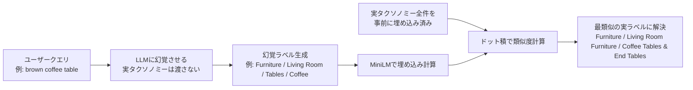
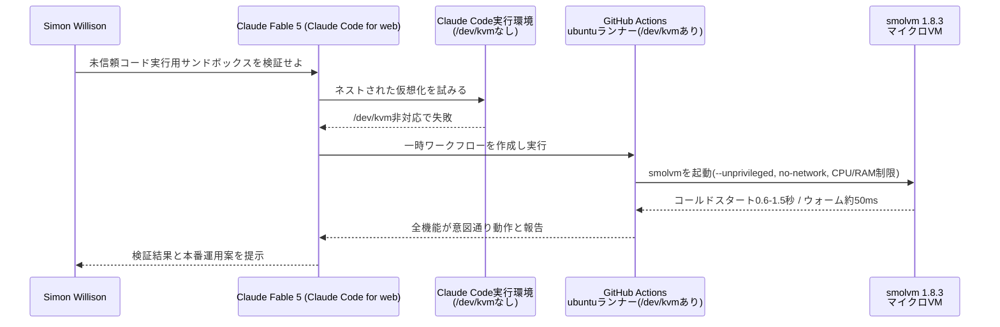
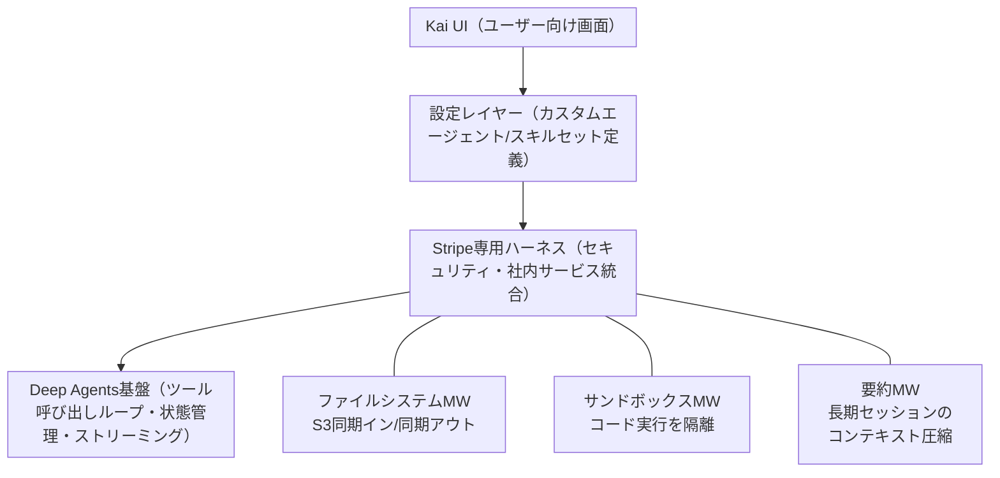
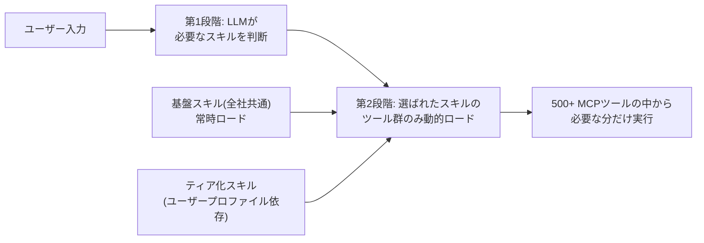

# Daily Briefing 2026-08-22

## 1. 分類するな、幻覚を見よ（原題: Don't Classify. Hallucinate!）

- **URL**: https://softwaredoug.com/blog/2026/08/10/hypothetical-classifications
- **公開日**: 2026-08-10
- **著者・媒体**: Doug Turnbull（個人ブログ softwaredoug.com。Simon Willisonのブログでも紹介・拡散された）

### 本文翻訳
LLMに商品やクエリを既存の分類体系（タクソノミー）に振り分けさせる分類タスクでは、従来は数百項目に及ぶ「合法な語彙リスト」をプロンプトやPydanticの`Literal`型として毎回モデルに渡す必要があった。Wayfairの商品検索データセット「WANDS」を例に、「wood coffee table」のようなクエリを正しいカテゴリ階層に割り当てる場面を考えると、この語彙リストが長大かつ頻繁に変化するほど、プロンプトへの埋め込みはスケールしなくなる。

Turnbullが提示する解決策は、順序を逆転させる二段階アプローチである。第一段階では、LLMに実在する語彙リストを一切与えず、「これまで見たことのない、新規の（"novel, never seen before"）分類」を自由に創造させる。例えば「brown coffee table」というクエリに対し、LLMは「Furniture / Living Room / Tables / Coffee」のような、実在はしないがもっともらしい階層ラベルを"幻覚"として出力する。

第二段階では、この幻覚された分類ラベルをMiniLMなどの軽量な埋め込みモデルでベクトル化し、あらかじめ計算しておいた実在する全分類ラベルの埋め込みとの内積（コサイン類似度相当）を計算する。最も類似度が高い実在ラベルを選べば、幻覚ラベルは実在の正しいカテゴリに解決される。記事の実験では、幻覚された「Furniture / Living Room / Tables / Coffee」が、実在する「Furniture / Living Room Furniture / Coffee Tables & End Tables / Coffee Tables」に正確にマッピングされたことが示されている。

この手法の利点は3つある。第一に、LLMに毎回スキーマ（語彙リスト全体）を送信する必要がなくなり、プロンプトが短く済む。第二に、分類判断そのものは「自由な言語生成」というLLMが最も得意なタスクに帰着するため、より安価で非力なモデルでも実用的な精度が出せる。第三に、実際のタクソノミーが変更・拡張されても、プロンプト側の変更は不要で、埋め込みインデックス側の更新だけで追従できる。著者は実装をColabノートブックとGitHubリポジトリ（`cheat-at-search`）で公開している。

### 重要ポイント
- 巨大な語彙リストをプロンプトに毎回埋め込む従来の分類手法はスケールしない
- 「LLMに幻覚させてから、埋め込み類似度で実在ラベルに解決する」二段階パターンが有効
- MiniLM等の軽量埋め込みモデルとドット積（コサイン類似度）だけで解決フェーズは実装可能
- 分類判断が自由生成タスクになるため、安価・非力なモデルでも実用精度が出せる
- タクソノミー変更時もプロンプト修正不要、埋め込みインデックスの更新だけで追従できる

### 図解



### 現場での適用方法

自社データのタグ付け・カテゴリ分類パイプラインに応用できるスクリプトの骨子例:

```python
# classify_by_hallucination.py
# 用途: 商品・チケット・ドキュメント等を既存タクソノミーへ分類する
# 依存: sentence-transformers, 任意のLLM API クライアント

from sentence_transformers import SentenceTransformer
import numpy as np

embedder = SentenceTransformer("all-MiniLM-L6-v2")

# 1. 実タクソノミーを事前に埋め込み(1回だけ実行しキャッシュ)
REAL_CATEGORIES = [
    "Furniture / Living Room Furniture / Coffee Tables & End Tables / Coffee Tables",
    "Kitchen & Tabletop / Kitchen Organization / Food Storage",
    # ... <YOUR_TAXONOMY_HERE> 全件
]
real_embeddings = embedder.encode(REAL_CATEGORIES, normalize_embeddings=True)

def hallucinate_category(query: str, llm_client) -> str:
    """スキーマを渡さず、安価なモデルに自由分類させる"""
    prompt = f"""Create a novel, never-before-seen hierarchical
classification (like Category / Subcategory / Type) that best
fits this search query. Do not use any predefined list.

Query: {query}
Classification:"""
    return llm_client.complete(prompt, model="<CHEAP_MODEL_NAME>")

def resolve_to_real_category(hallucinated: str) -> str:
    """幻覚ラベルを実タクソノミーへドット積で解決"""
    fake_emb = embedder.encode([hallucinated], normalize_embeddings=True)
    scores = np.dot(real_embeddings, fake_emb.T).flatten()
    best_idx = int(np.argmax(scores))
    return REAL_CATEGORIES[best_idx]

def classify(query: str, llm_client) -> str:
    fake = hallucinate_category(query, llm_client)
    return resolve_to_real_category(fake)
```

CLAUDE.md への追記例（データ分類タスクを伴うプロジェクト向け）:

```markdown
## タクソノミー分類タスクの方針
大規模な分類語彙（100件超）を持つ分類タスクを実装する際は、
語彙リストを毎回プロンプトに埋め込まない。代わりに
「LLMに自由分類させ、埋め込み類似度で実カテゴリに解決する」
2段階パターン（hallucinate → resolve）を用いること。
詳細: scripts/classify_by_hallucination.py を参照。
```

### 期待効果
分類プロンプトからスキーマ全件の埋め込みが不要になり、トークン消費とレイテンシが削減される。安価・軽量なモデルでも実用精度が得られるため、大量データの一括分類コストを抑えられる。タクソノミー変更時にプロンプト改修が不要になり、運用の保守コストも下がる。

### 注意点
埋め込みモデルの表現力に分類精度が依存するため、専門用語が多いドメインではMiniLMより高精度な埋め込みモデルへの切り替えが必要になる場合がある。また類似度が僅差のケースでは誤分類のリスクがあるため、しきい値を下回る場合は人間レビューにフォールバックする仕組みを併用するのが望ましい。

## 2. smolmachines / smolvmによる未信頼コード実行のサンドボックス化検証（原題: Research: smolmachines / smolvm as a sandbox for untrusted Python & JavaScript）

- **URL**: https://simonwillison.net/2026/Aug/19/smolmachines-untrusted-sandbox/
- **公開日**: 2026-08-19
- **著者・媒体**: Simon Willison（simonwillison.net）。実際の検証作業はClaude Code for web上で動くClaude Fable 5に委任し、リポジトリ github.com/simonw/research 上に成果を公開

### 本文翻訳
Simon Willisonは、AIエージェントが生成した未信頼なPython/JavaScriptコード（データ変換タスクなど）を安全に実行するためのサンドボックス基盤として、`smolmachines`/`smolvm`が使えるかどうかをClaude Code for web上のエージェント（Claude Fable 5）に検証させた。要件は、無限ループ対策のCPU/RAM制限、ネットワークアクセスの禁止、指定ファイル以外へのファイルシステムアクセス禁止という3点である。

検証は一筋縄ではいかなかった。Claude Codeのサンドボックス実行環境自体（Linux 6.18.5、4vCPU、15GB RAM）には`/dev/kvm`が存在せず、ネストされた仮想化（VM内でさらにマイクロVMを起動すること）ができないという制約に直面した。ここでエージェントは、単に「できません」と報告するのではなく、GitHub Actionsのubuntuランナーが`/dev/kvm`を公開していることに自ら着目し、一時的なGitHub Actionsワークフローを組んでその上でsmolvmのテストを実行するという回避策を編み出した。この「環境制約に対して予測的・能動的に問題解決する」振る舞いそのものが、記事の重要な観察点として位置づけられている。

実際のテスト対象はsmolvm 1.8.3。結果として、コールドスタート（初回起動）は0.6〜1.5秒、ウォーム実行（起動済みVMでの再実行）は約50ミリ秒という数値が得られた。機能面では、オフラインのローカルイメージ利用、ネットワーク遮断状態での実行、CPU/RAM使用量制限、ゲスト側で強制されるタイムアウト、ストレージクォータ、読み取り専用の入力マウント、書き込み可能な出力マウント、非特権実行を強制する`--unprivileged`フラグのすべてが「意図通りに動作した」と報告されている。

これは、コンテナ型のサンドボックス（カーネル共有型）ではなくハードウェアレベルで隔離されたマイクロVMを使うアプローチが、AIエージェントに未信頼コードを実行させる用途に十分な速度と分離性を両立できることを示す一次データである。本番運用については、タスクごとに使い捨てVMを1台起動する方式、または高いスループットが必要な場合は永続的・フォーク型のVMプールを使う方式のいずれかが選択肢として挙げられている。

### 重要ポイント
- AIエージェントが生成した未信頼コードの実行環境として、マイクロVM（smolvm）方式の実運用適性を実測した一次データ
- コールドスタート0.6〜1.5秒、ウォーム実行約50ミリ秒という具体的な性能数値
- ネットワーク遮断・CPU/RAM制限・タイムアウト・ストレージクォータ・read-only/writableマウント・非特権実行のすべてが検証で意図通り動作
- 検証環境自体に`/dev/kvm`がない制約を、GitHub Actionsランナーの活用という創造的な回避策で突破した点が示唆的
- 本番運用は「タスクごとの使い捨てVM」か「永続/フォーク型VMプール」の二択で設計する

### 図解



### 現場での適用方法

AIエージェントが生成したコードを検証・実行するCI設定の例:

```yaml
# .github/workflows/agent-sandbox-test.yml
# 用途: /dev/kvmが使えない開発コンテナの代わりに
#       GitHub Actionsランナー上でマイクロVMサンドボックスを検証する
name: agent-sandbox-test
on: [workflow_dispatch]

jobs:
  smolvm-test:
    runs-on: ubuntu-latest
    steps:
      - uses: actions/checkout@v4
      - name: Install smolvm
        run: |
          curl -fsSL https://smolmachines.com/install.sh | sh
      - name: Run untrusted code in isolated microVM
        run: |
          smolvm run \
            --unprivileged \
            --no-network \
            --cpu-limit 1 \
            --mem-limit 512m \
            --timeout 30 \
            --mount-ro ./input:/input \
            --mount-rw ./output:/output \
            --image <UNTRUSTED_CODE_RUNNER_IMAGE> \
            -- python /input/agent_generated_script.py
```

CLAUDE.md への追記例:

```markdown
## 未信頼コードの実行方針
エージェントが生成したPython/JavaScriptコードをこのリポジトリ内で
直接実行しない。実行が必要な場合は smolvm（マイクロVM方式）による
サンドボックスを使い、以下を必須とする:
- --unprivileged / --no-network を必ず付与
- CPU/RAMの上限とタイムアウトを明示的に設定
- 出力ディレクトリ以外は read-only マウントとする
ローカル環境で /dev/kvm が使えない場合は
.github/workflows/agent-sandbox-test.yml を使い
GitHub Actions ランナー上で検証すること。
```

### 期待効果
コンテナより強い隔離（ハードウェアレベル）をコールドスタート1.5秒以内・ウォーム50ミリ秒程度という実用的な速度で実現でき、AIエージェントに任意コードを生成・実行させる機能を安全に提供できるようになる。開発コンテナ側に`/dev/kvm`がなくてもCI環境を使って検証・実行できるため、ローカル環境の制約に左右されない。

### 注意点
この検証はあくまで単発タスクの実行性能に関するものであり、高頻度・高並列のワークロードでの挙動（VMプール運用時のリソース管理やコールドスタートの累積コスト）は別途評価が必要。また`/dev/kvm`が使えるランナー・ホスト環境を用意できることが前提となるため、完全にサンドボックス化されたCI環境（ネストされた仮想化非対応の環境）では別のワークアラウンドが必要になる点に注意。

## 3. StripeはDeep Agentsを使って社内AIエージェント基盤Kaiを1週間で構築した（原題: How Stripe Built Their Knowledge AI Platform on Deep Agents）

- **URL**: https://www.langchain.com/blog/how-stripe-built-their-knowledge-ai-platform-on-deep-agents
- **公開日**: 2026-08-03
- **著者・媒体**: Sofia Sulikowski / LangChain Blog（Stripe社エンジニアへの取材記事）

### 本文翻訳
Stripeの社内向けAIエージェント基盤「Kai」は、LangChainが提供するオープンソースのエージェント基盤「Deep Agents」の上に構築された。Deep Agentsはツール呼び出しループ、ミドルウェア構成、ストリーミング、状態管理といったLLMインタラクションの汎用的な基盤要素を提供する。Staff Software EngineerのAnupam Upadhyayが1週間でKaiの初期版を開発し、その週のうちに四半期の採用目標を達成、その後4週間で利用者は296人から5,000人超へ急拡大した。現在はStripe全従業員の83%が週次でKaiを利用し、アクティブセッション数は期間あたり6万件を超える。特にマーケティング(95%)とGTM(営業関連, 87%)チームでの採用率が高い。

アーキテクチャは4層構造になっている。最下層がDeep Agents基盤（汎用的なLLMインタラクション部分）、その上にStripe固有のセキュリティ・インフラ・社内サービス統合を担う「Stripe専用ハーネス」、さらにカスタムエージェントインスタンスやスキルセットを設定する「設定レイヤー」、最上位がユーザー向けの「Kai UI」である。Engineering ManagerのSharadh Krishnamurthyは「Deep Agentsレイヤーが汎用的な問題をすべて解決してくれるので、我々はStripe固有の問題解決に集中できる」と述べている。

本番運用を支える鍵は3つのミドルウェアである。ファイルシステムミドルウェアは、S3を裏側に持つ仮想ファイルシステムを実装し、エージェントがターンをまたいでファイルを読み書き・参照できるようにする。サンドボックス実行前に関連ファイルを「同期イン」し、実行後の変更を「同期アウト」してS3に反映するパターンで、セッション全体を通じた一貫性のあるファイル環境を実現している。サンドボックスミドルウェアは、Python分析やPDF・プレゼンテーション処理などの任意コード実行をエージェント本体の外で隔離実行し、LLM生成コードのセキュリティリスクを回避する。要約ミドルウェアは、長時間の複数ターン会話でコンテキストが肥大化し性能劣化やトークン上限超過が起きるのを防ぐため、要約閾値や要約に使うモデルなど複数のチューニングパラメータを提供する。

Kaiは500以上の社内MCPツールと1,000以上のスキル(特定タスクの実装方法とツール群をカプセル化したモジュール)で動作する。管理は「フェデレーテッド方式」で、各チームが自チームのスキルを所有・保守する。全社共通の基盤スキルは常時ロードされ、ユーザーのプロファイル(営業運用か財務かなど)に応じてティア化されたスキルが動的に追加される。ツール数増大への対策として二段階システムを採用し、まずLLMがどのスキルを使うか判断し、その判断に基づいて必要なツールのみを動的にコンテキストへロードすることで、500以上の全ツールを最初からコンテキストに入れる無駄を避けている。

開発チームが得た教訓として、Ruby/Java中心だった社内インフラにあえてPythonを持ち込む投資判断が、1週間での開発成功によって即座に正当化されたこと、また非技術職員に開発者向けツールを押し付けるのではなく実務に即したUIを設計したことで初期予測の16倍を超える採用につながったことが挙げられている。一方で課題として、150以上のスキルが存在する状況ではフロンティアモデルでもスキル選択精度が低下することが判明し、純粋なLLM選択からRAGや分類器による事前フィルタリングへの移行が進行中である。今後はハイブリッド型スキル選択、大規模展開に向けたガバナンス・ガードレール強化、ユーザー文脈に応じた動的な振る舞い適応、複数従業員が同じAI生成物を協調編集できるセッション横断機能の実装が計画されている。

### 重要ポイント
- Deep Agents基盤の採用により、1人のエンジニアが1週間で社内AIエージェント基盤の初期版を構築し、即座に量的目標を達成した
- ファイルシステム・サンドボックス・要約の3種のミドルウェアが本番運用を支える中核設計
- 500以上のMCPツール・1,000以上のスキルを「フェデレーテッド管理+二段階動的ロード」で捌く設計パターン
- スキル数が150を超えるとフロンティアモデルでも選択精度が低下し、RAG/分類器による事前フィルタリングが必要になるという実運用上の限界値
- ユーザー中心のUI設計が採用率を予測の16倍に押し上げた、という定量的な効果

### 図解





### 現場での適用方法

大規模なスキル・ツールライブラリを持つ社内エージェント基盤の設計指針として、CLAUDE.md へ追記する例:

```markdown
## エージェント基盤のスキル管理方針(Stripe Kai事例より)
スキル・ツール数が増えるにつれ選択精度が劣化する(150件超で
フロンティアモデルでも低下)ため、以下の方針を採る:

1. スキルは「基盤スキル(常時ロード)」と
   「ティア化スキル(利用者の役割に応じて動的追加)」に分離する
2. 全ツールを一度にコンテキストへ入れず、
   まずLLMに使用するスキルだけを判断させ、
   選ばれたスキルのツール定義のみ後から動的ロードする(二段階ロード)
3. スキルの所有権は横断チームで一元管理せず、
   各チームが自チーム領域のスキルを保守する
   フェデレーテッド方式を採用する
4. 長時間セッションでは要約ミドルウェア相当の
   コンテキスト圧縮処理を挟み、閾値超過でトークン上限に
   達する前に古い履歴を要約する
```

二段階スキルロードを模したスクリプト骨子（Claude Code のカスタムツール定義に応用する場合）:

```python
# two_stage_skill_loader.py
# 用途: スキル/ツール数が多いエージェントで、
#       全ツール定義を一括ロードせず段階的にロードする

FOUNDATIONAL_SKILLS = ["billing_lookup", "policy_check"]  # 常時ロード

def select_skill(user_query: str, user_profile: str, llm_client) -> str:
    """第1段階: どのスキルを使うかだけをLLMに判断させる
    (この時点ではツール定義の詳細は渡さない)"""
    tiered = TIERED_SKILLS_BY_PROFILE.get(user_profile, [])
    candidates = FOUNDATIONAL_SKILLS + tiered
    prompt = f"""User query: {user_query}
Available skill names: {candidates}
Which single skill best handles this? Return only the name."""
    return llm_client.complete(prompt, model="<ROUTING_MODEL>")

def load_tool_context(skill_name: str) -> list[dict]:
    """第2段階: 選ばれたスキルのツール定義のみを動的ロード"""
    return SKILL_TOOL_REGISTRY[skill_name]  # <YOUR_TOOL_REGISTRY>
```

### 期待効果
記事内の実測値として、初期版を1人のエンジニアが1週間で構築し四半期目標を即週達成、4週間で利用者296人→5,000人超に拡大、現在は全社員の83%が週次利用、アクティブセッション6万件超/期間という定量的な成果が示されている。二段階スキルロード設計により、ツール数が数百規模に増えてもコンテキスト消費を抑えつつ機能を拡張できる。

### 注意点
150スキルを超えるとフロンティアモデルでもスキル選択精度が低下するため、スキル数が多い環境ではLLM単独選択に頼らずRAGや分類器による事前フィルタリングを組み合わせる設計が前提となる。またフェデレーテッド管理はチームごとの品質・セキュリティ基準のばらつきを生みうるため、基盤スキルの「ピニング」やガバナンス層への継続投資が必要になる点が記事内でも今後の課題として明記されている。
