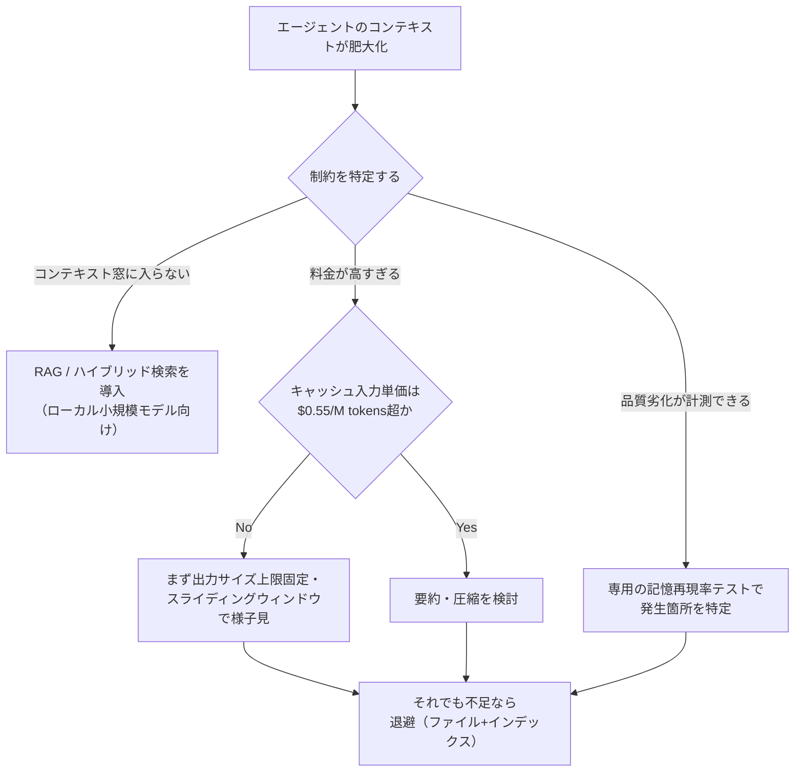
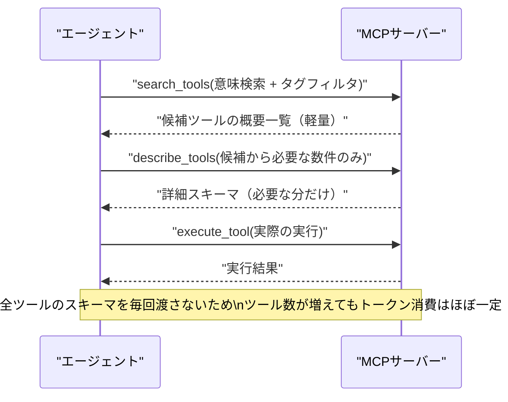

```mermaid
flowchart TD
    subgraph Loop["TAORループ（コアランタイム）"]
        T["Think"] --> A["Act（ツール呼び出し）"]
        A --> O["Observe（結果観察）"]
        O --> R{"継続 or 停止"}
        R -->|"継続"| T
    end
    A --> PR["権限リゾルバ\n(ツール名/コマンド/スコープを検査)"]
    Mem["6層メモリ\n(組織/プロジェクト/ユーザー/ローカル/自動学習/セッション)"] --> T
    Loop -->|"約50%使用で発火"| Compact["自動コンテキスト圧縮"]
    Loop -->|"委譲"| Sub["サブエージェント\n(独立TAORループ、要約のみ親へ返す)"]
    A -->|"決定的イベント"| Hook["Hooks\n(PreToolUse/PostToolUse等、LLM不使用)"]
```

# Daily Briefing 2026-08-23

## 1. なぜ私たちはエージェントのコンテキスト圧縮をやめたのか（原題: Context Engineering in 2026: Why We Stopped Compacting Our Agent's Context）

- **URL**: https://www.louisbouchard.ai/context-engineering-2026/
- **公開日**: 2026-08-18
- **著者・媒体**: Louis-François Bouchard（What's AI）

### 本文翻訳
著者は自社の本番AIチューター（Next.js UI → FastAPI → LangChainの単一エージェント構成）を使い、「要約による圧縮は本当に得なのか」を実測した。結論は業界の常識と逆で、プロンプトキャッシュが普及した2026年時点では「全履歴を残す方が、要約するより安く・速く・記憶精度も高い」というものだった。

比較実験では、全履歴保持が1ターンあたり0.11ドル・応答17秒・記憶再現率92%だったのに対し、要約を含む本番プリセットは0.24ドル・21秒・再現率38%と、コスト面でも品質面でも全履歴保持に劣っていた。原因は単純で、要約はキャッシュされたプレフィックスを書き換えてしまうため、キャッシュによる50倍近いコスト優位を失う。DeepSeekのように50倍安いキャッシュ料金であれば、要約は「50分の1まで圧縮できて初めて損益分岐点」という非現実的な条件を満たさねばならない。彼らが導き出したしきい値は「キャッシュ入力単価が100万トークンあたり0.55ドルを超える場合のみ要約を検討する」というものだ。

そのうえで著者は圧縮手法を3階層に整理する。①「無料/自明」層＝ツール出力のサイズ上限固定、直近ターンのみ保持するスライディングウィンドウ、消費済みツール出力を再取得可能なポインタに置換する処理。上限固定だけで記憶ロスなしにコスト38%削減を達成した。②「モデル呼び出しを伴う」層＝選択的な情報保持、要約、完全圧縮。いずれもキャッシュ経済を踏まえると全履歴保持に劣った。③「退避」層＝情報を消さずファイルへ逃がし、コンテキストにはインデックスだけ残して必要時に取得させる、可逆性の高い方法。

特に重要なのは「隠れた失敗モード」の発見だ。本番プリセットは記憶再現率58%にもかかわらず、LLM審査員による総合評価は97〜99%と高評価がついた。事実を確実に忘れたターンでも、審査員は100%「良い回答」と判定していた。つまり通常の品質指標は、エージェントが自信満々に的外れな回答を返す問題を覆い隠してしまう。

ローカルモデル（32B級）やドキュメント大量投入のケースでは話が変わる。コンテキスト窓が32kトークン程度しかないローカルモデルでは全履歴保持は成立せず、RAG検索が必須になる。ハイブリッド検索（密ベクトル＋BM25＋リランク）は40万トークンまで100%の再現率を維持したが、密ベクトルのみの検索は20万トークンを超えると再現率が0%まで崩壊した。

著者らが実際に採用している構成は、キャッシュの効くクラウドモデル（DeepSeek V4 Flash）、ハイブリッド検索パイプライン、要約トリガーは80万トークン（実運用ではほぼ発火せず、セッションは平均28.7万トークン程度でピークを迎える）、ツール出力クリアは無効。結論として著者は「デフォルトで圧縮するな。まず制約を名指しし、自分のシステム・自分のユーザーの質問で実測せよ」と述べている。

### 重要ポイント
- プロンプトキャッシュ環境下では、要約による圧縮はキャッシュ利益を破壊しコスト・速度・精度すべてで劣化しうる
- 圧縮の要否はキャッシュ入力単価のしきい値（記事内基準：100万トークンあたり0.55ドル）で判断する
- 無料でできる「出力サイズの上限固定」だけで記憶ロスなしに約38%のコスト削減が可能
- 品質評価（LLM審査員のスコア）は記憶喪失を検出できないことがある。専用の記憶再現率テストが必要
- ローカル小規模モデルやドキュメント過多のケースでは、全履歴保持ではなくRAG（特にハイブリッド検索）が必須

### 図解


### 現場での適用方法
本記事の知見をCLAUDE.mdへのルールとして追記する例：

```markdown
## コンテキスト圧縮ポリシー
- デフォルトでは会話履歴を圧縮・要約しない。プロンプトキャッシュの効果を優先する。
- ツール出力（grep/検索結果など）は再利用可能な参照（ファイルパス等）を残し、
  本文は直近のもの以外は要約せず「再取得可能なポインタ」に置き換えてよい。
- 圧縮（summarize/compact）を実行してよいのは以下のいずれかを満たす場合のみ：
  1. コンテキスト長が上限の80%を超えた
  2. ユーザーが明示的に「要約して」と指示した
- 圧縮を行った場合は、要約前の重要な制約・決定事項を先頭に必ず残すこと。
```

運用手順として、まず自チームのエージェントで「圧縮あり/なし」のA/Bログを取り、①コスト ②応答時間 ③記憶再現率（意図的に会話序盤で仕込んだ制約を、終盤で守れているか）の3指標を比較することを推奨する。

### 期待効果
記事の実測値では、圧縮をやめて全履歴を保持しただけで1ターンあたりのコストが0.24ドル→0.11ドルへ低下し、応答速度も21秒→17秒に改善、記憶再現率は38%→92%へ大幅改善した。出力サイズ上限固定のみでも記憶ロスなしで約38%のコスト削減効果が確認されている。

### 注意点
- この結論はキャッシュ料金の安いモデル（DeepSeek等）を前提としており、キャッシュ割引率が小さいプロバイダやローカルモデルには当てはまらない
- コンテキスト窓が小さいローカルモデルでは全履歴保持は破綻するため、RAG導入が前提になる
- 「品質は良いのに記憶は失っている」という失敗は通常のLLM審査員評価では発見できないため、別途記憶再現率を測る評価ハーネスが必要

---

## 2. MCPのトークン使用量を100分の1に削減する方法（コード実行モードは不要）（原題: Reducing MCP token usage by 100x — you don't need code mode）

- **URL**: https://www.speakeasy.com/blog/how-we-reduced-token-usage-by-100x-dynamic-toolsets-v2/
- **公開日**: 不明（直近数週間以内）
- **著者・媒体**: Speakeasy（企業ブログ）

### 本文翻訳
MCP（Model Context Protocol）を使うと、AIエージェントが多数の外部ツールを呼び出せるようになる一方、ツール数が増えるほど各リクエストに含まれるツールスキーマが肥大化し、トークン消費が爆発するという課題がある。20個程度のツールを持つMCPサーバーでも、呼び出さないツールの分まで含めて1リクエストあたり2,000〜4,000トークンが追加されることがある。

Speakeasyはこの問題に対し「コード実行モード」（LLMにコードを書かせてツールを間接的に呼ばせる方式）を使わずに、"Dynamic Toolset"という3関数構成のアプローチで解決した。
1. `search_tools`：埋め込みベースの意味検索と、カテゴリ概要・タグによるフィルタ（例：`source:hubspot`）を組み合わせ、発見しやすさと精度を両立する
2. `describe_tools`：必要になったツールについてのみ詳細なスキーマを返す。ツールの入力スキーマがトークン消費全体の大部分を占めるため、ここを遅延ロードにする効果が大きい
3. `execute_tool`：発見済みのツールをそのまま実行する

このアプローチにより、単純タスクでは入力トークンを96.7%、複雑タスクでも91.2%削減。合計トークン消費量もそれぞれ96.4%、90.7%削減した。しかもベンチマークでは、ツールセットのサイズやタスクの複雑さに関わらず「全構成で成功率100%」を達成している。重要な特性として、トークン消費量はツール数が40個であろうと400個であろうほぼ一定に保たれる。これにより、数百〜数千のツールを持つMCPサーバーをコンテキスト窓を圧迫せずに構築できるようになる。

一方でトレードオフも存在する。ツール呼び出し回数は静的な方式の3回程度に対し6〜8回に増え、実行時間もおよそ50%増加する。ただし記事は、会話履歴内でスキーマが再利用される長時間実行のエージェントでは、この時間的不利は相殺されうると指摘している。

Speakeasyは、MCPに対するこれらの批判は「プロトコル自体の欠陥」ではなく「大規模にAIエージェントを実用化することの本質的な難しさ」を反映したものだと位置づけ、柔軟なツールディスカバリー機構によって実運用の要求に適応できると結論づけている。

### 重要ポイント
- MCPサーバーのツール数が増えるほど、リクエストごとのスキーマオーバーヘッドがトークン消費を圧迫する
- `search_tools`（意味検索＋タグフィルタ）→`describe_tools`（遅延スキーマ取得）→`execute_tool`の3段構成で、コード実行モードなしに大幅な削減を実現
- 入力トークン最大96.7%削減、合計トークン最大96.4%削減、成功率は100%を維持
- トークン消費量はツール総数に対してほぼ一定（40個でも400個でも変わらない）
- 代償としてツール呼び出し回数が2〜3倍、実行時間が約50%増加する

### 図解


### 現場での適用方法
自作MCPサーバーの設計指針として、シェルスクリプト風の擬似実装例（Node.js想定）：

```javascript
// mcp-dynamic-toolset.js
// ツールを一括公開せず、3段階のディスカバリーで公開する最小実装イメージ

const TOOL_INDEX = loadToolCatalog(); // { name, tags, shortDesc, embedding } の配列

async function search_tools({ query, tags }) {
  // 埋め込み類似度 + タグフィルタで上位N件のみ返す（詳細スキーマは含めない）
  const candidates = semanticSearch(TOOL_INDEX, query, { tags, topK: 5 });
  return candidates.map(t => ({ name: t.name, shortDesc: t.shortDesc }));
}

async function describe_tools({ names }) {
  // 選ばれたツールだけ詳細スキーマを返す（遅延ロード）
  return names.map(name => getFullSchema(name));
}

async function execute_tool({ name, args }) {
  return invokeTool(name, args);
}

module.exports = { search_tools, describe_tools, execute_tool };
```

導入手順：
1. 既存MCPサーバーの全ツール定義を棚卸しし、`name` / `tags`（例: `source:xxx`）/ 短い説明文 の索引を作る
2. 索引に対する埋め込み検索（`search_tools`）とタグフィルタを実装する
3. 詳細スキーマの取得（`describe_tools`）と実行（`execute_tool`）を分離する
4. 既存の「全ツール一括公開」方式と本方式でトークン数・成功率・レイテンシを比較計測する

### 期待効果
記事のベンチマークでは、入力トークンを単純タスクで96.7%・複雑タスクで91.2%削減し、成功率は100%を維持している。ツール数が増えてもトークン消費がほぼ一定に保たれるため、数百〜数千ツール規模のMCPサーバーを実用的に運用できるようになる。

### 注意点
- ツール呼び出し回数が2〜3倍に増え、実行時間もおよそ50%増加するため、レイテンシに敏感な用途では検討が必要
- 意味検索の精度がツール発見率を左右するため、タグ設計と短い説明文の質が重要になる
- 短時間・少数ツールの単発タスクでは、静的にスキーマを全公開する従来方式の方がシンプルで有利な場合もある

---

## 3. Claude Codeのアーキテクチャをリバースエンジニアリングする（原題: Claude Code Architecture (Reverse Engineered)）

- **URL**: https://vrungta.substack.com/p/claude-code-architecture-reverse
- **公開日**: 2026-02-17
- **著者・媒体**: Vikash Rungta（Chain Of Thought / Substack）

### 本文翻訳
本記事はAnthropicのClaude Codeを題材に、エージェント設計の6つのアーキテクチャ的転換と、あらゆるAIエージェントに共通する8つの失敗モードを分析したケーススタディである。

6つの転換とは、①コードで固定されたワークフローではなく「モデルがCEO」となりTAORループ（Think→Act→Observe→Repeat）でモデル自身が意思決定する、②ハーネス（脳を包む身体）としてファイルシステムアクセス・シェル統合・メモリを提供する、③100個の専用連携ではなくRead/Write/Execute/Connectという4つの原始的能力（特にBash）の組み合わせで無限のワークフローを構成する、④20万トークンのコンテキスト窓を最重要の希少資源として扱い自動圧縮・意味検索・サブエージェント分離で対処する、⑤暴走ループや健忘症、権限の混乱を「バグ」ではなく「管理された機能」に変換する構造的解決、⑥モデルの能力向上に合わせてハード実装した足場（明示的な計画ステップなど）を削除していく共進化、である。

ハーネスの中核はTAORループそのもので、約50行程度の最小オーケストレータがモデルに次の行動を思考・実行・観察・継続判断させる。ツールはRead/Write/Execute/Connectの4原始で構成され、Bashが「万能アダプタ」として機能し、人間が使うあらゆるCLIツールを呼び出せるようにする。

権限解決層は、ツール名・具体的なコマンド（例:「git commit」は許可か）・スコープ（例:「rm -rf /」は不可）の3階層でツール呼び出しを検査し、`plan`（読み取り専用）、`default`（編集・シェル実行前に確認）、`acceptEdits`（編集は自動承認、シェルは確認）、`dontAsk`（許可リスト内は自動承認）、`bypassPermissions`（全チェックをスキップ、管理された組織向け）という段階的モードを持つ。

メモリは6層構造で、組織全体のポリシー、プロジェクト単位のCLAUDE.md、ユーザー単位のCLAUDE.md、ローカル設定、過去セッションから学習した自動記憶、現在のセッション状態がセッション開始時に全てロードされ、エージェントが「ゼロ知識」から始まらないようにしている。

コンテキスト管理はウィンドウ使用量が約50%に達すると自動圧縮が発火し、古いターンを意味的要約に置き換え、生の会話ログを判断ログに置き換えて意図を保持しつつトークンを解放する。サブエージェントは親とは独立に圧縮されるため、親のコンテキストが汚染されない。

拡張の仕組みは宣言的で、コードを書かずにMarkdown/JSON/YAMLで拡張する。スキル（SKILL.md）は`disable-model-invocation: true`で「純粋なコンテキストとして常駐、呼び出しコストゼロ」にでき、`context: fork`で隔離実行できる。サブエージェントは独立したTAORループを持ち、親には要約のみが返る。フォアグラウンド実行は会話をブロックし権限確認をユーザーに渡す一方、バックグラウンド実行は権限を事前にまとめて収集し、許可リスト外は自動拒否される。実験的な「Agent Teams」はサブエージェント（子プロセス）とは異なり、共有タスクリストを介して並行動作するピアプロセスであり、専門化されたチームメイト（認証担当、テスト担当、ドキュメント担当）が未割当タスクを自己認識して着手する。

フック（Hooks）はLLMを介さない決定的なライフサイクルイベントで、`SessionStart`、`UserPromptSubmit`、`PreToolUse`/`PostToolUse`、`PermissionRequest`、`PreCompact`などの注入点を持ち、例えば全ファイル書き込み後に自動でLintを走らせるといった用途に使える。

### 重要ポイント
- ハーネスの核はTAORループ（思考→実行→観察→継続判断）という最小限のオーケストレータであり、知能は全てモデルとプロンプト側に置く設計思想
- ツールは専用連携を増やすのではなく、Read/Write/Execute/Connect（特にBash）という少数の原始的能力を組み合わせる
- コンテキスト窓は最も希少な資源として扱われ、約50%使用時点での自動圧縮とサブエージェントによる隔離で守られる
- メモリは組織→プロジェクト→ユーザー→ローカル→自動学習→セッションの6層構造でセッション開始時に全ロードされる
- 拡張性はコードではなくMarkdown/JSON/YAMLによる宣言的な仕組み（Skills/Hooks/Sub-Agents/MCP/Plugins）で実現される

### 図解


### 現場での適用方法
自分のAIエージェント運用にこの設計思想を取り入れる際のSKILL.md骨子例：

```markdown
---
name: harness-health-check
description: エージェントのハーネス設計（権限・メモリ・コンテキスト管理・フック）が
  記事の8失敗モード（暴走ループ、コンテキスト崩壊、権限の混乱、健忘症、
  単一コンテキスト過負荷、ハードコード依存、不透明な動作、単一スレッド化）
  に対して対策済みか点検したいときに使用する。
---

## 点検項目
1. 暴走ループ対策: 最大ターン数 / 停止条件が明示されているか
2. コンテキスト崩壊対策: 圧縮トリガー（トークン数 or 使用率）が定義されているか
3. 権限の混乱対策: allow/deny リストがコマンド単位で定義されているか
4. 健忘症対策: プロジェクト単位の永続コンテキスト（CLAUDE.md相当）が存在するか
5. 単一コンテキスト過負荷対策: 調査タスクをサブエージェントに分離しているか
6. ハードコード依存対策: 頻出ワークフローがコード実装ではなく設定/スキル化されているか
7. 不透明な動作対策: 重要なツール呼び出し前後にログ/フックが入っているか
8. 単一スレッド化対策: 並列化可能なタスクが直列実行に固定されていないか
```

また、`PreToolUse`/`PostToolUse`相当のフックをシェルスクリプトで実装する運用例（Claude Code設定を想定したプレースホルダ）：

```bash
#!/usr/bin/env bash
# <REPO_PATH>/.claude/hooks/post-write-lint.sh
# ファイル書き込み後に自動でLintを走らせ、LLMの判断を介さず品質を担保する
set -euo pipefail
FILE="$1"
case "$FILE" in
  *.ts|*.tsx) npx eslint --fix "$FILE" ;;
  *.py) ruff check --fix "$FILE" ;;
esac
```

### 期待効果
記事は8つの共通失敗モード（暴走ループ、コンテキスト崩壊、権限の混乱、健忘症、単一コンテキスト過負荷、ハードコード依存、不透明な動作、単一スレッド化）それぞれに対応するハーネス側の構造的解決策を提示しており、これをチェックリスト化することで自作エージェント／ハーネスの弱点を体系的に洗い出せる。特にサブエージェントによるコンテキスト隔離とフックによる非LLM的な品質担保は、既存の運用に比較的低コストで組み込みやすい。

### 注意点
- 記事はClaude Code固有の実装（npmで配布される公開バンドルの分析）に基づく推測を含み、内部実装の詳細は将来のアップデートで変わりうる
- 公開日は2026年2月であり、Claude Code自体は2026年8月時点でAuto Mode既定化やサブエージェントのフォーク挙動変更など仕様が更新されている可能性がある点は割り引いて読む必要がある
- 6層メモリや自動学習パターンなど一部機能は組織向け・実験的機能を含み、個人利用や小規模チームではそのまま再現できない場合がある
