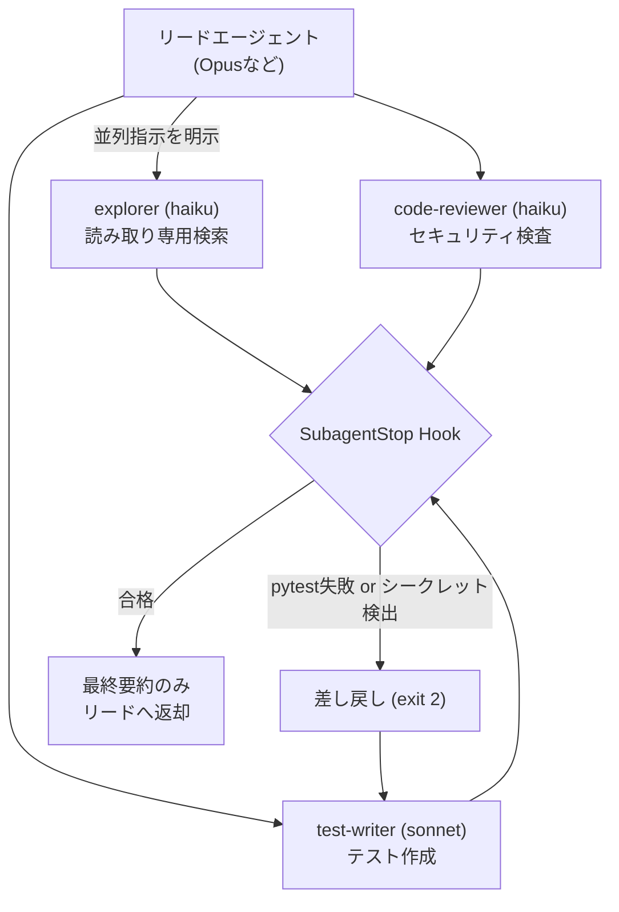
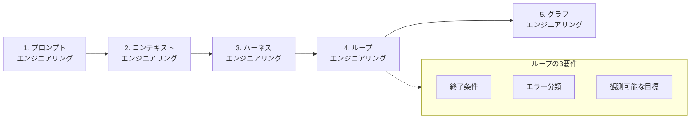
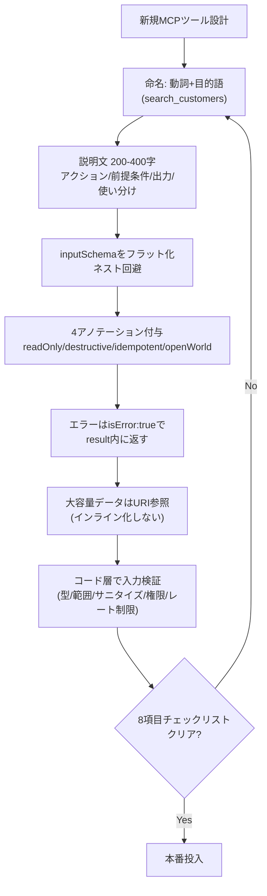

# Daily Briefing 2026-08-24

## 1. Claude Code サブエージェント: 2026年プロダクション運用ガイド（原題: Claude Code Subagents: The 2026 Production Playbook）

- **URL**: https://www.totalum.app/blog/claude-code-subagents-totalum
- **公開日**: 2026-08-11
- **著者・媒体**: Francesc / Totalum Blog

### 本文翻訳

本記事は、Claude Code のサブエージェント機能を本番環境で運用するための実践フレームワークを提示する。著者らは「Skill（手法を教える）・Hook（ルールを強制する）・Subagent（作業を隔離する）」の三点セットこそが本番グレードの要件だと主張する。

サブエージェントは `.claude/agents/` ディレクトリ内の Markdown ファイルとして定義し、frontmatter に `name`（識別子）、`description`（リードが委譲判断に使う説明）、`tools`（スコープを絞った権限）、`model`（コスト最適化のため明示指定）を記述する。各サブエージェントは独自のコンテキストウィンドウを持ち、リードエージェントの「すでに混雑した transcript」をきれいに保つ。リードはサブエージェントの中間過程を見ず、最終要約だけを受け取る。

著者らが推奨する実装ロスターは、explorer（読み取り専用のコード検索、Read/Grep/Glob/WebSearch、haiku）、code-reviewer（セキュリティ・デッドコード検査、Read/Grep/Bash、haiku）、test-writer（テスト作成・実行、Read/Edit/Bash、sonnet）、doc-writer（README・変更ログ更新、Read/Edit、haiku）、migration-writer（スキーママイグレーション作成、Read/Edit/Bash、sonnet）の5種構成。「1つの汎用エージェントより、5〜7個の絞り込まれたロスターの方が優れている」と強調する。

実装例として SubagentStop Hook のシェルスクリプトが掲載されている。テストが失敗した場合、またはコミット済み差分にシークレットらしき文字列（`sk-` や `AKIA` で始まるパターン）が検出された場合、exit code 2 を返してサブエージェントを差し戻し、成功時は監査ログを additionalContext として付与する。

並列実行を意図する場合は「In parallel using separate subagents」のような明示的な語句が必須であり、曖昧な指示では順序実行されてしまう可能性があると指摘する。ネストしたサブエージェントの最大深度は5階層だが、実運用での推奨深度は2〜3階層（リード→モジュールオーナー→ファイルワーカー）にとどめるべきとしている。

2026年版の重要な仕様変更として、サブエージェントは明示指定がない限りリードエージェントの現在のモデルを継承する点が挙げられる。Opus で実行中のリードが軽量なトリアージ用サブエージェントを不本意に Opus 価格で実行してしまう事態を避けるため、`model: claude-haiku-4-5` のように必ず明示すべきと警告している。

よくある失敗パターンとして、(1) モデル未指定による継承、(2) 過剰なツール権限付与（研究用サブエージェントが本番APIを編集してしまう）、(3) 深すぎるネストによるコンテキスト・コスト爆発、(4) 複数サブエージェントによる同一ファイルの共有状態レースの4つを挙げ、それぞれの対策（明示的なモデル指定、最小権限付与、深度キャップ、事前のファイル分割）を示している。

最後に、Skill・Hook・Subagent の使い分けの判断軸を提示する。Skill は「良いやり方を知っていて毎回実行させたい手続き」、Hook は「信頼できない非交渉的ルール」、Subagent は「内部プロセスを見せたくない作業隔離」である。この3分類により、チームは何を「教え・強制し・委譲するか」を構造的に判断できる。

### 重要ポイント
- Skill（教える）・Hook（強制する）・Subagent（隔離する）の3層で役割分担する
- サブエージェントは `model` を明示しないと親の（高コストな）モデルを継承してしまう
- SubagentStop Hook でテスト失敗・シークレット漏洩を機械的にブロックできる
- 並列実行には「In parallel using separate subagents」等の明示的な指示が必要
- ネスト深度は最大5だが、実運用は2〜3階層に抑えるべき

### 図解



### 現場での適用方法

**スクリプト化の例**（`.claude/agents/test-writer.md` と SubagentStop Hook）:

```markdown
---
name: test-writer
description: Writes and runs tests for changed code. Use when a feature or fix needs test coverage.
tools: Read, Edit, Bash
model: claude-sonnet-5
---

You write and run tests for the code just changed. Keep new tests
minimal and scoped to the actual change. Run the test suite before
returning and fix failures yourself before handing back.
```

```bash
#!/usr/bin/env bash
# .claude/hooks/subagent-stop-guard.sh
set -euo pipefail

if ! pytest -q; then
  echo "tests failed; subagent must fix before returning" >&2
  exit 2
fi

if git diff --cached | grep -E 'sk-[A-Za-z0-9]{20,}|AKIA[0-9A-Z]{16}'; then
  echo "secret detected in subagent diff" >&2
  exit 2
fi

echo '{"hookSpecificOutput":{"additionalContext":"tests passed, no secrets in diff"}}'
```

`<REPO_PATH>/.claude/settings.json` の `hooks.SubagentStop` に `subagent-stop-guard.sh` を登録すれば、全サブエージェントの返却前にテストとシークレット検査が強制される。

**CLAUDE.md への追記例**:

```markdown
## サブエージェント運用ルール
- 新規サブエージェントを追加する際は `model` を必ず明示する（未指定は親モデルを継承しコスト爆発の原因になる）
- 複数サブエージェントを並列実行させたい場合は「in parallel using separate subagents」と明示的に指示する
- サブエージェントのネストは最大2〜3階層までに抑える
- 研究・調査系サブエージェントには本番APIへの書き込み権限を付与しない
```

### 期待効果
リードのコンテキストが汚染されず、モデル明示によるコスト最適化（軽量タスクを haiku に固定）と、Hook によるテスト・シークレット漏洩の自動ブロックが実現できる。5〜7個の専門ロスター構成は単一汎用エージェントより保守しやすいと著者は主張している。

### 注意点
モデルを明示しないサブエージェント定義は静かに高コスト化する。ネストが深くなるとコンテキストとコストが指数的に膨らむため深度キャップが必須。複数サブエージェントが同一ファイルを編集するとレース状態になるため、事前のファイル・モジュール分割が前提となる。

---

## 2. ハーネス・グラフ・ループエンジニアリング: プロンプトとコンテキストを超えた進化（原題: Harness, Graph, and Loop Engineering — How to Evolve From Prompts and Context）

- **URL**: https://sarthakai.substack.com/p/harness-graph-and-loop-engineering
- **公開日**: 2026-08-04
- **著者・媒体**: Sarthak Rastogi / Substack「AI Agent Engineering」

### 本文翻訳

著者は、LLMベースのエージェント開発が5つの段階的な「エンジニアリング分野」として進化してきたと整理する。プロンプトエンジニアリング（質問の言葉遣いの最適化）→コンテキストエンジニアリング（モデルが参照する情報の選別）→ハーネスエンジニアリング（モデル周辺のシステム設計）→ループエンジニアリング（自律的なサイクル実行の制御）→グラフエンジニアリング（複数エージェントの協調）という順で、各層は下位の層を包含しながら複雑性を増していく。

コンテキストエンジニアリングの段階では、「ベクトルストアから取得した50件の候補を再ランク付けして正確なトップ5に絞り込む方が、50件全てをプロンプトに詰め込むより効果的である」と説く。ハーネスエンジニアリングの段階では、ファイルシステム・コード実行・サンドボックス・メモリ・コンテキスト管理をモデルの周囲に具体的に構築する必要があるとし、Databricks の事例として「GPT-5.5 に専用ハーネスを組み合わせることで成功率が36.10%から52.63%に向上した」というデータを挙げている。

ループエンジニアリングでは、終了条件・エラー分類・具体的で観測可能な目標の3要素が必須だと主張する。「無制限のリトライは、隠れた前提の存在を高いコストで露呈させるだけだ」と警告し、ループが停止すべきタイミングを設計段階で明確化することの重要性を説く。

グラフエンジニアリングの段階では、パイプライン・ルーター・並列処理・オーケストレーター/ワーカーという4つの協調パターンを紹介する一方、「ほとんどのタスクは複雑なグラフを必要としない」と強調し、必要以上に複雑な多エージェント構成に手を出す「グラフエンジニアリングの罠」に警鐘を鳴らす。

具体例として、Apple のカスタマーサポートボットを題材にした5段階の Python 実装が示される。(1) プロンプトのみの単純版、(2) 検索と再ランク付けを搭載した版、(3) サンドボックス化されたツール実行を持つ版、(4) 反復上限とエラー分類を備えたループ版、(5) 人間承認ゲートを含むオーケストレーター版、という順に段階的に機能を積み上げていく構成になっている。

記事は Sourcegraph、Elastic、Databricks、Cognition、Spotify といった企業の実例や、LangChain Blog、METR、Anthropic の技術資料を参照しながら議論を展開している。ただし著者自身、「グラフエンジニアリング」という用語が2026年7月18〜19日頃に X（旧Twitter）上で生まれたばかりの新語であることに触れ、流行語への過信に注意を促している。実際、記事内で言及されていたスタンフォード大学の助成金に関する情報の一部は後に捏造と判明したというエピソードも紹介されており、バズワードの検証なき採用に対する健全な懐疑を示している。

### 重要ポイント
- 5層モデル（Prompt→Context→Harness→Loop→Graph）でエージェント開発の複雑性の進化を整理
- ループの3要件：終了条件・エラー分類・具体的で観測可能な目標
- 専用ハーネス設計だけで GPT-5.5 の成功率が36.10%→52.63%に向上した事例
- ほとんどのタスクは複雑なグラフを必要としない「グラフエンジニアリングの罠」に注意
- 新語・バズワードへの過信を戒める姿勢（未検証の話題への懐疑）

### 図解



### 現場での適用方法

**CLAUDE.md への追記例**（ループ設計の規律を明文化）:

```markdown
## エージェントループの設計ルール
このリポジトリで自律ループ（テスト修正・リファクタリング等の反復タスク）を
実行する際は、以下を必ず満たすこと：

1. **終了条件を先に決める**: 「全テストがgreenになるまで」等、曖昧な
   「完璧になるまで」は禁止。最大反復回数（例: 5回）も設定する。
2. **エラーを分類してから対応する**: 環境起因（flaky/依存関係）か
   コード起因かを切り分けてから修正方針を決める。切り分け不能なまま
   同じ修正を繰り返さない。
3. **観測可能な目標を持つ**: 「品質を上げる」ではなく「lintエラー0件、
   カバレッジ80%以上」のように検証可能な形で目標を書く。
4. 上記3条件を満たさない自律ループは提案しない。まず人間に確認する。
```

**運用手順**（既存の単一プロンプト運用から段階導入する場合）:

```bash
# 1. 現状の運用がどの層にあるかを棚卸しする
#    (プロンプトのみ？ 検索+再ランクあり？ サンドボックスあり？)

# 2. ハーネス層を先に固める（ループより優先）
#    - ツール実行をサンドボックス化する
#    - ファイルシステム/メモリアクセスの権限を明示的に絞る

# 3. ループ層は「終了条件・エラー分類・観測可能目標」の
#    3点セットが揃うまでは導入しない

# 4. グラフ（複数エージェント協調）は最後の手段。
#    単一エージェント+ハーネス+ループで足りるかを先に検証する
```

### 期待効果
記事中の事例では、専用ハーネスの導入だけで GPT-5.5 のタスク成功率が36.10%から52.63%へと約16.5ポイント向上したと報告されている。ループの終了条件・エラー分類を明確化することで、無制限リトライによるコスト超過を防げる。

### 注意点
記事はアーキテクチャ思考の提示が中心で、完全に動作するコード全文は提示されていない。ハイパーパラメータ調整やデバッグの詳細なノウハウは限定的。「グラフエンジニアリング」という用語自体が生まれたばかりの新語であり、著者自身が周辺情報の一部が誤り（捏造）だったと注意喚起している点にも留意すべき。

---

## 3. MCPツールスキーマ設計ガイド2026 — name・description・inputSchema・annotationsのための7原則（原題: MCP Tool Schema Design Guide 2026 — 7 Principles for name, description, inputSchema, and annotations）

- **URL**: https://kansei-link.com/en/insights/mcp-tool-schema-design-guide-2026.html
- **公開日**: 2026-05-19
- **著者・媒体**: KanseiLink Research

### 本文翻訳

本記事は「MCPサーバーの品質は8割がツールスキーマ設計で決まる」という主張を軸に展開する。理由は、ツール定義そのものがコンテキストウィンドウに常駐するため、スキーマの冗長性がそのままトークン消費に直結するからだ。記事は実測値として「最適化前はツール定義だけで134,000トークンを消費していたが、最適化後は約85%削減された」という事例を紹介している。

7つの原則が提示される。第1に命名規則。`search_customers` や `create_invoice` のように「動詞+目的語」の形式を snake_case または camelCase で一貫させる。`customers` や `InvoiceCreate` のような命名は避けるべきで、サーバー内での命名規則の混在はLLMのツール選択精度を下げる。

第2に説明文の長さと内容。200〜400文字を目安に、(a) 何を行うアクションか、(b) 必要な入力前提条件・認可スコープ、(c) 戻り値の型や件数制限などの出力期待値、(d) 類似ツールとの使い分け、の4要素を含めるべきとする。冗長な説明文はトークン浪費の最大要因とされる。

第3に inputSchema のフラット化。ネストは最小限にし、深い階層が必要な場合はむしろ複数の特化ツールに分割することを推奨する。具体例として、日付範囲を `date_range` というネストしたオブジェクトにせず、`start_date` と `end_date` をトップレベルのプロパティとして展開する方法が示されている。

第4にツールアノテーション。`readOnlyHint`・`destructiveHint`・`idempotentHint`・`openWorldHint` の4つのヒントの欠落が、Claude Connector Directory での却下理由の30%を占めるという。ただしこれらのヒントは「契約ではなく情報シグナル」であり、クライアント側での検証は依然として必須と釘を刺す。たとえば分析DBへの書き込みを伴う「検索」ツールに `readOnlyHint:true` を設定してはならない、という具体的な注意も含まれる。

第5にエラー処理。プロトコルレベルのエラーではなく、`isError:true` と構造化メッセージを result 内に含める形で返すべきとする。プロトコルレベルのエラーはLLMがその内容を見ることができず、復帰行動を取れないためだ。

第6に大規模ペイロードの扱い。ファイルやログなど大きなデータはインライン化せず、URI/Resources 参照として返し、必要なときにだけ fetch させることでコンテキストの無駄な消費を防ぐ。

第7に入力検証。JSON Schema の宣言だけに頼らず、コード層での厳密な検証（型・必須フィールド・長さや範囲・ファイルパスやURLのサニタイゼーション・認可スコープ・レート制限）を境界で実装することが必須とされる。

記事はトークン消費の実測値も提示している。単一ツールの定義は100〜500トークン、10ツール規模で1,500〜3,000トークン、5サーバー・58ツール構成では約55,000トークン、Jira単独のツール定義だけで17,000トークンを消費するという。またスキーマ品質が低下すると、ツール選択精度が43%から14%まで急落するという報告も紹介されている。最後に、名前規則・説明文・スキーマのフラット化・アノテーション・エラー処理・ペイロード処理・検証実装・トークン測定の8項目からなる本番投入前チェックリストが示される。

### 重要ポイント
- MCPサーバー品質の8割はツールスキーマ設計（特に description と inputSchema）で決まる
- 命名は「動詞+目的語」、説明文は200〜400文字で4要素（アクション・前提条件・出力・使い分け）を含める
- readOnlyHint等4アノテーションの欠落がツール却下理由の30%を占める
- エラーはプロトコルレベルではなく `isError:true` として結果内に返す
- スキーマ品質低下でツール選択精度が43%→14%に急落する

### 図解



### 現場での適用方法

**スクリプト化の例**（Zod/JSON Schema でのツール定義テンプレート）:

```typescript
// mcp-tools/search-customers.ts
export const searchCustomersTool = {
  name: "search_customers",
  description:
    "顧客レコードを名前・メール・契約状態で検索する。read:customers " +
    "スコープが必要。最大50件をページネーションなしで返す。" +
    "1件のIDが既知の場合は get_customer を使うこと。",
  inputSchema: {
    type: "object",
    properties: {
      // ネストしたdate_rangeではなく、トップレベルに展開する
      query: { type: "string", maxLength: 200 },
      start_date: { type: "string", format: "date" },
      end_date: { type: "string", format: "date" },
      status: { type: "string", enum: ["active", "churned", "trial"] },
    },
    required: ["query"],
  },
  annotations: {
    readOnlyHint: true,
    destructiveHint: false,
    idempotentHint: true,
    openWorldHint: false,
  },
};

export async function handleSearchCustomers(input) {
  // 境界での入力検証（JSON Schema宣言だけに頼らない）
  if (input.query.length > 200) {
    return { isError: true, content: [{ type: "text", text: "query too long" }] };
  }
  try {
    const results = await db.searchCustomers(input);
    return { content: [{ type: "text", text: JSON.stringify(results) }] };
  } catch (e) {
    return { isError: true, content: [{ type: "text", text: `search failed: ${e.message}` }] };
  }
}
```

**運用手順**（既存MCPサーバーの棚卸し）:

```bash
# 1. 現在のツール定義の総トークン数を測定する
#    (概算: 文字数 / 4 でトークン数を見積もる)
wc -c <MCP_SERVER_DIR>/tools/*.json

# 2. 各ツールについて8項目チェックリストを確認する
#    - 命名は動詞+目的語か
#    - description は200-400字で4要素を含むか
#    - inputSchemaはフラットか
#    - 4アノテーションは設定済みか
#    - エラーはisError:trueで返しているか
#    - 大容量データはURI参照か
#    - コード層での入力検証はあるか
#    - 上記を反映しトークン数を再測定したか

# 3. 55,000トークンのような超過が見つかった場合、
#    使用頻度の低いツールをまとめる/分割し直す
```

### 期待効果
記事の事例では、ツールスキーマの最適化によりツール定義のトークン消費が約85%削減されたと報告されている。アノテーションを適切に設定することで却下率（Claude Connector Directory向け）の30%を占める要因を解消でき、スキーマ品質改善によりツール選択精度が43%から回復する余地がある。

### 注意点
アノテーションはあくまで「情報シグナル」であり契約ではないため、クライアント側の検証を省略してはならない。読み取り専用に見えるツールでも副作用（分析ログ書き込み等）がある場合は `readOnlyHint:true` を安易に付けないこと。記事にはKanseiLink自社サービスへの誘導が含まれるが、技術的な原則・数値自体は独立して検証可能な内容である。
