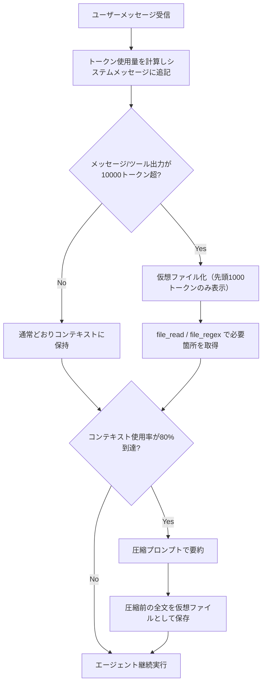
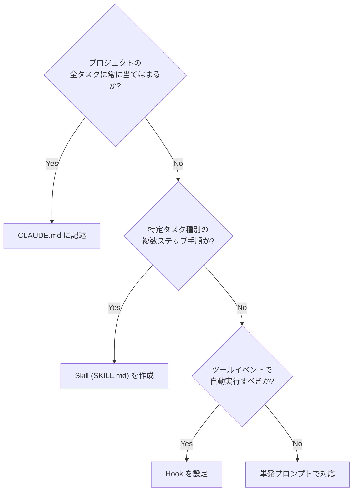
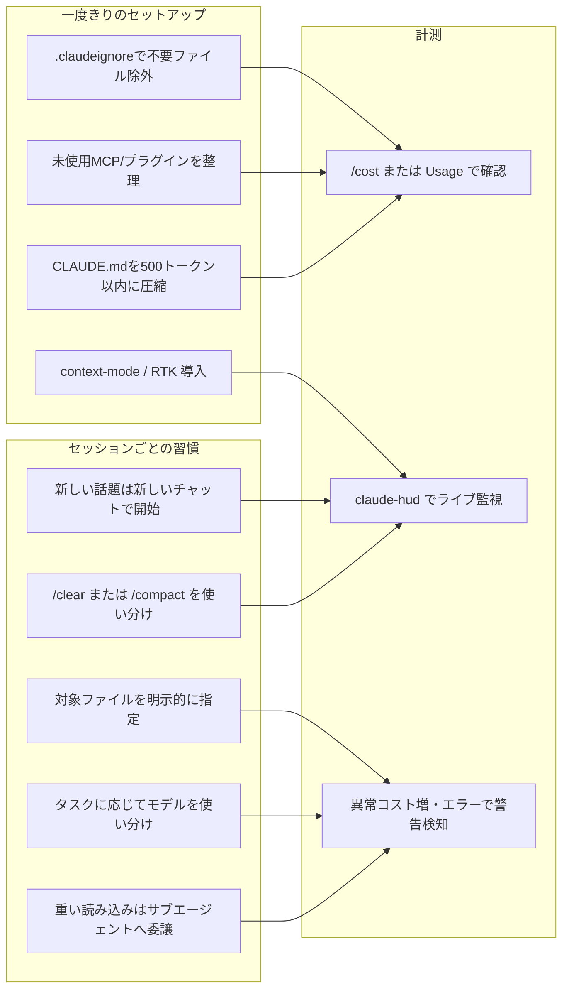

# Daily Briefing 2026-08-25

## 1. 内製エージェントの構築：コンテキストウィンドウの圧縮設計（原題: Building an internal agent: Context window compaction）

- **URL**: https://lethain.com/agents-context-compaction/
- **公開日**: 2025-12-26
- **著者・媒体**: Will Larson（Irrational Exuberance）

### 本文翻訳
著者はソフトウェアエンジニアリング組織向けに社内エージェントを構築するシリーズの一環として、長時間稼働するエージェントが直面する「コンテキストウィンドウ枯渇」問題への対処法を記している。ChatGPT 4.1 のような 1,047,576 トークンという巨大なコンテキストウィンドウであっても、ツール呼び出しやユーザーメッセージ、大きなファイルを多数扱うワークフローでは枯渇しうると指摘する。ほとんどのケースではコンテキストウィンドウ枯渇は問題にならないが、堅牢なエージェントを目指すなら対処は避けられないとする。

最初の実装は素朴なもので、コンテキストが足りなくなったら古いツールレスポンスを単純に破棄し続けるというものだった。しかしワークフローが複雑化するにつれ、この方式では有用な情報まで失われてしまい不十分になった。

そこで著者のチームは以下の5段構成のアーキテクチャへと発展させた。

1. **トークン追跡**：ユーザーメッセージごとに、現在消費済み・利用可能なトークン数と、アクセス可能なファイル一覧を示すシステムメッセージを追加する。
2. **仮想ファイル化**：10,000トークンを超えるメッセージ（レスポンスやツール出力）は「仮想ファイル」として扱われ、コンテキストウィンドウには先頭1,000トークンのみが含まれる。残りを読みたい場合はファイル操作ツールを使う必要がある（両方の閾値は設定可能）。
3. **ベースツール**：仮想ファイルを扱うために `file_read`（全文・行範囲・バイト範囲の読み取り）と `file_regex`（設定した上限件数までの正規表現マッチ）という2つの標準ツールを常時利用可能にする。どのファイルがどこまで読まれたかはマニフェストで追跡される。
4. **自動圧縮（コンパクション）**：コンテキスト使用量がモデルの利用可能ウィンドウの80%（設定可能な値）に達すると、「Reddit で Claude Code が使っていると噂される」圧縮プロンプトを適用して過去の文脈を要約する。
5. **コンテキストの復元**：圧縮後は、直前のコンテキストウィンドウ全体を仮想ファイルとして保存し、エージェントが失われた情報を後から取り出せるようにする。

著者はこの設計について「long, long time 忘れて放置できるくらい十分に機能する」と評価し、ほとんどのワークフローは極端な最適化を必要としないとしつつも、ファイルという構成要素を後付けではなく最初から中核概念として設計に組み込むことを推奨している。

### 重要ポイント
- 巨大なコンテキストウィンドウを持つモデルでも、長時間稼働するツール多用エージェントはトークン枯渇に直面しうる
- 単純な「古いツールレスポンスを破棄する」方式は複雑なワークフローでは不十分
- 10,000トークン超のメッセージを「仮想ファイル」として扱い、先頭1,000トークンのみをコンテキストに残す設計が核心
- `file_read` / `file_regex` という最小限の2ツールでファイルアクセスを標準化する
- コンテキスト使用率80%到達時に自動で圧縮し、圧縮前の全文は仮想ファイルとして保持し復元可能にする

### 図解


### 現場での適用方法

**スクリプト化の例**（コンテキスト管理エージェント用の擬似設定・しきい値定義。実際のエージェントランタイムのラッパー関数として実装する想定）

```python
# context_manager.py
VIRTUAL_FILE_THRESHOLD_TOKENS = 10_000   # これを超えたメッセージは仮想ファイル化
VIRTUAL_FILE_PREVIEW_TOKENS = 1_000      # コンテキストに残す先頭トークン数
COMPACTION_TRIGGER_RATIO = 0.8           # コンテキスト使用率がこの値を超えたら圧縮

def maybe_virtualize(message, files_manifest):
    if count_tokens(message) > VIRTUAL_FILE_THRESHOLD_TOKENS:
        file_id = files_manifest.register(message)
        preview = truncate_to_tokens(message, VIRTUAL_FILE_PREVIEW_TOKENS)
        return f"<file id='{file_id}'>{preview}...(file_read/file_regexで続きを取得)</file>"
    return message

def maybe_compact(context_window, model_max_tokens):
    if context_window.used_tokens / model_max_tokens > COMPACTION_TRIGGER_RATIO:
        summary = run_compaction_prompt(context_window)
        archive_id = context_window.archive_as_virtual_file()
        return build_new_context(summary, archive_ref=archive_id)
    return context_window
```

**CLAUDE.md への追記例**

```markdown
## コンテキスト管理方針
- 大きなツール出力（ログ、ファイル全文など）は要約してから会話に載せる。全文が必要な場合は
  ファイル参照（パス＋行範囲）で指示すること。
- 会話が長くなり出力が繰り返し必要になった場合は、いったん `/compact` して要点を残してから
  作業を続行する。
```

### 期待効果
数値ベンチマークは示されていないが、著者は「long, long time 気にせず放置できる」水準まで枯渇問題が解消したと述べている。仮想ファイル化と自動圧縮の組み合わせにより、巨大なツール出力を持つ長時間セッションでもエージェントが動作を継続できる。

### 注意点
- 圧縮プロンプト自体は「Reddit 上で Claude Code が使っていると噂される」ものを流用しており、正式に公開された仕様ではない点に留意
- 各種閾値（10,000トークン、1,000トークン、80%）は環境やモデルのコンテキストサイズに応じて調整が必要
- 圧縮後に仮想ファイルとして保持した旧コンテキストへの参照が増えすぎると、結局それ自体が新たなトークンコストになりうる

---

## 2. Claude Code の3つのカスタマイズ手段「CLAUDE.md・Skills・Hooks」使い分け完全ガイド（原題: Skills vs Hooks vs Prompts: Claude Code Decision Guide (2026)）

- **URL**: https://explainx.ai/blog/skills-vs-hooks-vs-prompts-when-to-use-each-2026
- **公開日**: 2026-06-27（2026-08-19 更新）
- **著者・媒体**: Yash Thakker（explainx.ai Blog）

### 本文翻訳
本記事は、多くの Claude Code 利用者が CLAUDE.md・Skills（SKILL.md）・Hooks という3つのカスタマイズ手段を誤用し、本来別の仕組みが担うべき責務を混同していると指摘するところから始まる。それぞれの役割を明確化することが記事の主眼である。

**CLAUDE.md（システムプロンプト）**は、技術スタックやコーディング規約、リポジトリ構成、チームのルールなど「プロジェクトについて常に真であること」を記述する場所と位置づけられる。記事は「初日の請負業者に渡すブリーフィング資料だと思えばよい」と表現する。CLAUDE.md は毎リクエストごとに読み込まれるため、そこに手順（プロシージャ）を書くと、実際には必要ない場面でもトークンを消費し続けてしまう点が大きな制約として挙げられる。また、CLAUDE.md はイベントに応じて条件付きで発火したり、自律的にシェルコマンドを実行したりすることはできない。

**Skills（SKILL.md）**は、データベースマイグレーションの追加、PR 説明文の作成、API エンドポイントの作成、コンポーネントのひな形生成など、特定タスク種別に対する複数ステップの手順を担う。Skills は「progressive disclosure（段階的開示）」という仕組みを使い、Claude Code はまずスキルの description だけをスキャンして現在のタスクに合致するものを探し、マッチしたスキルのみ SKILL.md 本文全体を読み込む。そのため、使われていないスキルのトークンコストは最小限に抑えられる。一方で Skills はシェルコマンドを自律的に実行したり、ファイル変更に独立して反応したりすることはできない。

**Hooks**は、PreToolUse・PostToolUse などのツールイベント発生時に自動でシェルコマンドを実行する仕組みで、Lint・型チェック・監査など「毎回必ず自動実行してほしい検証」に向いている。記事は TypeScript の型チェックを Edit ツール実行後に走らせる例を示す：

```json
{
  "hooks": {
    "PostToolUse": [
      {
        "matcher": "Edit",
        "hooks": [
          { "type": "command", "command": "npx tsc --noEmit 2>&1 | head -20" }
        ]
      }
    ]
  }
}
```

記事は「Hooks はインフラレベルでポリシーを強制し、Skills は推論レベルで知識を与える」と両者の違いを端的にまとめている。

判断フローとしては、(1) プロジェクトの全タスクに当てはまるか→ CLAUDE.md、(2) 特定タスク種別の複数ステップ手順か→ Skill、(3) ツールイベントに応じて自動実行すべきか→ Hook、(4) いずれでもなければ単発プロンプトで対応、という順で検討することを勧めている。

アンチパターンとしては、CLAUDE.md に手順を書いてしまい不要な場面でもトークンを浪費すること、「あらゆるファイル編集」で発火するスキルを作ってしまい実質壊れた CLAUDE.md になっていること、そして同じ事実を複数の場所に重複して書いてしまい ORM 変更時などに一部だけ更新して不整合を生むこと、が挙げられている。「事実は1箇所にだけ持て」という原則が強調される。

最後に、データベースマイグレーションを例に3手段の連携例が示される。CLAUDE.md には「マージ済みマイグレーションは変更しない」というルールを、Skill には実際の手順を、Hook にはスキーマ編集後の自動検証を、それぞれ担わせる構成である。

### 重要ポイント
- CLAUDE.md ＝常時ロードされる「常に真であるプロジェクト事実」の置き場所。手順を書くと毎回トークンを浪費する
- Skills ＝ progressive disclosure により、マッチしたタスクのときだけ本文が読み込まれる複数ステップ手順
- Hooks ＝ ツールイベントに応じて自動でシェルコマンドを実行する、インフラレベルの強制手段
- 判断は「常に真か→CLAUDE.md／特定タスクの手順か→Skill／イベント駆動の自動実行か→Hook」の順で行う
- 同じ事実を複数箇所に重複させないことが保守性の鍵

### 図解


### 現場での適用方法

**スキル化の例**（データベースマイグレーション追加用スキル）

```markdown
---
name: add-database-migration
description: >-
  Use this skill when the user asks to add a database migration, change
  the database schema, or add/remove/modify a table or column.
version: 1.1.0
---

## 手順
1. `npx prisma migrate dev --name <descriptive-name>` を実行してマイグレーションを生成する
2. 生成された SQL を確認し、破壊的変更（DROP COLUMN 等）がないかチェックする
3. 既存データに対するバックフィルが必要か判断し、必要なら別マイグレーションとして追加する
4. マージ済みのマイグレーションファイルは絶対に直接編集しない（CLAUDE.md のルール参照）
```

**CLAUDE.md への追記例**

```markdown
## データベース変更に関するルール
- マージ済みのマイグレーションファイルは変更禁止。修正が必要な場合は新しいマイグレーションを追加する。
- スキーマ変更の手順は `add-database-migration` スキルを参照すること（ここには手順を書かない）。
```

**運用手順（Hook 設定）**

1. `<REPO_PATH>/.claude/settings.json` を開く（なければ作成）
2. 以下を追記して Edit 実行後に型チェックを自動実行させる
   ```json
   {
     "hooks": {
       "PostToolUse": [
         { "matcher": "Edit", "hooks": [{ "type": "command", "command": "npx tsc --noEmit 2>&1 | head -20" }] }
       ]
     }
   }
   ```
3. `claude` を再起動して設定を反映する

### 期待効果
CLAUDE.md を「常に真の事実」だけに絞り、手順を Skills に、強制検証を Hooks に分離することで、毎リクエストのベーストークンコストを抑えつつ、必要なときだけ詳細な手順やチェックが働く構成になる。記事ではスキルの description 部分のみのディスカバリーコストは数十トークン程度、フルボディは数百トークン程度に収まるとされ、CLAUDE.md 単体に全てを詰め込むより効率的とされる。

### 注意点
- 3手段の責務が重複すると、更新漏れによる不整合（ORM 変更時など）が発生しやすい
- Hooks はシェルコマンドを直接実行するため、コマンドインジェクションのリスクや実行権限の設計に注意が必要
- Skills はあくまで「マッチしたときだけ読み込まれる」仕組みであり、常時必要な情報を Skill 側に置くと実質機能しなくなる

---

## 3. Claude Code のトークン消費を体系的に削減する（原題: Claude Code Token Optimization: Full System Guide (2026)）

- **URL**: https://buildtolaunch.substack.com/p/claude-code-token-optimization
- **公開日**: 2026-04-14
- **著者・媒体**: Jenny Ouyang（Build to Launch, Substack）

### 本文翻訳
著者は、慎重に使っていたつもりの Claude Code の利用料が2か月で1,600ドルに達した経験から本記事を書き起こしている。原因は雑なプロンプトではなく「目に見えないアーキテクチャ」、つまり気づかないうちに積み上がっていくコンテキストだったと分析する。

トークンを消費する主因は3つに整理される。第一に**ツール呼び出しの出力**。Claude がファイルを読んだり、シェルコマンドを実行したり、MCP サーバーを呼んだりするたびに、その全出力が会話に追加され、以降の全メッセージで運ばれ続ける。1万行のログが一度出力されるだけで、以降のやり取りすべてにそのコストがのしかかる。第二に**会話の蓄積**。Claude は毎メッセージで会話全体を先頭から読み直すため、50通目のメッセージは5通目よりも高コストになる。タスクが難しくなったからではなく、単に過去の文脈を再処理しているからだという。第三に**CLAUDE.md とシステムプロンプト**。CLAUDE.md はコードを読む前、タスクを読む前、何よりも先に読み込まれるため、5,000トークンのファイルなら作業を始める前から毎ターン5,000トークンのコストがかかる。

これらに対する対策は「一度きりのセットアップ」と「セッションごとの習慣」に分けて示される。

セットアップ面では、まず `.gitignore` のように機能する `.claudeignore` を作成し、`node_modules/`・`.next/`・`dist/`・`*.log`・`__pycache__/` などを除外する。1週間使っていない MCP サーバーは接続を切り、使っていないプラグインも無効化する。さらに、ツール出力を会話に直接流し込むのではなくサンドボックス化されたナレッジベースに振り分ける MCP「context-mode」（50〜90%削減）や、Bash コマンドの出力を圧縮された等価表現に書き換える「RTK（Rust Token Killer）」（CLI 出力を60〜90%削減）の導入を勧める。CLAUDE.md 自体は500トークン以内、ルールは最大3つ、ファイルポインタも3つまでに絞り、フルドキュメントを書き込まないようにする。

セッションごとの習慣としては、「新しい話題＝新しいチャット。例外なし」という原則、完全リセットの `/clear` と要約継続の `/compact` の使い分け、リポジトリ全体ではなく関連ファイルを名指しで指定すること、自分で読むだけのデータはスクリプトで処理し Claude に読み込ませないこと、MCP を使う前に同じことができる CLI ツールがないか確認すること、タスクの複雑さに応じて Haiku（機械的作業）・Sonnet（日常作業）・Opus（複雑な推論）を使い分けること、推論を必要としないタスクでは `/effort low` や `MAX_THINKING_TOKENS=8000` で拡張思考を制限すること、大きな読み込みが必要な作業はサブエージェントに委譲してコンテキストを分離することが挙げられている。

計測面では、API 利用者はセッション後に `/cost` を確認し、サブスクリプション利用者は `Settings → Usage` でクォータを監視する。ターミナルにライブオーバーレイを表示する `claude-hud` プラグインの導入も紹介されている。同じ作業が突然10倍のコストになった場合はキャッシュのバグを、`ECONNRESET`/`EPIPE` エラーが出た場合はコンテキスト過負荷を、「Chat has reached its limit」というメッセージはハードなコンテキスト上限到達を、それぞれ疑うべき警告サインとして挙げる。

著者は「コンテキストが毎メッセージで積み上がっていくというメカニズム自体は今後の製品アップデートでも変わらない根本原理だ」と結論づけている。

### 重要ポイント
- ツール出力の蓄積・会話全体の再読み込み・CLAUDE.md の常時ロードが3大トークン消費源
- `.claudeignore` で不要ディレクトリを除外し、未使用の MCP・プラグインは切断/無効化する
- CLAUDE.md は500トークン以内、ルール最大3つ・ファイルポインタ最大3つに圧縮する
- 「新しい話題＝新しいチャット」を徹底し、`/clear` と `/compact` を使い分ける
- `/cost`・`Settings → Usage`・`claude-hud` で実際の消費を計測し、異常な10倍コストやエラーメッセージを監視する

### 図解


### 現場での適用方法

**スクリプト化の例**（`.claudeignore`）

```gitignore
# <REPO_PATH>/.claudeignore
node_modules/
.next/
dist/
build/
*.log
__pycache__/
.venv/
coverage/
```

**CLAUDE.md への追記例**（500トークン以内を意識した圧縮版）

```markdown
# プロジェクト概要
- スタック: <言語/フレームワーク>
- ルール1: マージ済みマイグレーションは変更禁止
- ルール2: 新規APIエンドポイントは必ずテストを追加
- ルール3: 型チェック(`npx tsc --noEmit`)を通過させてからコミット
- 詳細手順: `docs/CONTRIBUTING.md`, `.claude/skills/`, `docs/ARCHITECTURE.md` を参照
```

**運用手順**

1. リポジトリ直下に `.claudeignore` を作成し、上記の除外対象を記載する
2. `claude mcp list` で現在接続中の MCP サーバーを確認し、1週間以上使っていないものを `claude mcp remove <name>` で切断する
3. CLAUDE.md を500トークン程度まで圧縮し、詳細はファイルポインタで外出しする
4. 長い調査・大量ファイル読み込みが必要な作業は、都度サブエージェントに委譲して本セッションのコンテキストを汚さないようにする
5. セッション終了後に `/cost`（API）または `Settings → Usage`（サブスクリプション）で消費を確認し、想定より高ければ上記1〜4を見直す

### 期待効果
著者は「集中したタスクでは40〜70%の削減」、複数の MCP ツールと context-mode を併用した場合はさらに高い削減率が得られたと報告している（具体的なビフォーアフターの金額比較は記事内には示されていない）。

### 注意点
- 記事内の削減率（40〜70%、context-mode の50〜90%、RTK の60〜90%）は著者の実運用に基づく報告であり、第三者による定量検証は示されていない
- `.claudeignore` や context-mode・RTK のようなサードパーティ／周辺ツールは、バージョンやプロジェクト構成によって挙動が変わりうるため導入前に自環境での検証が必要
- CLAUDE.md を過度に圧縮しすぎると、逆に必要なルールが欠落し手戻りが増えるリスクがある
