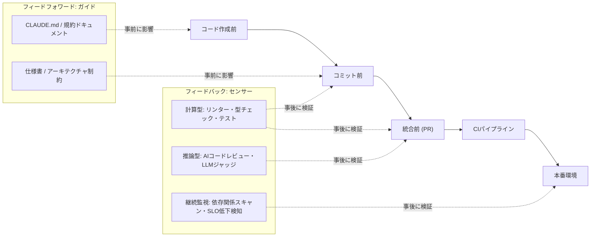
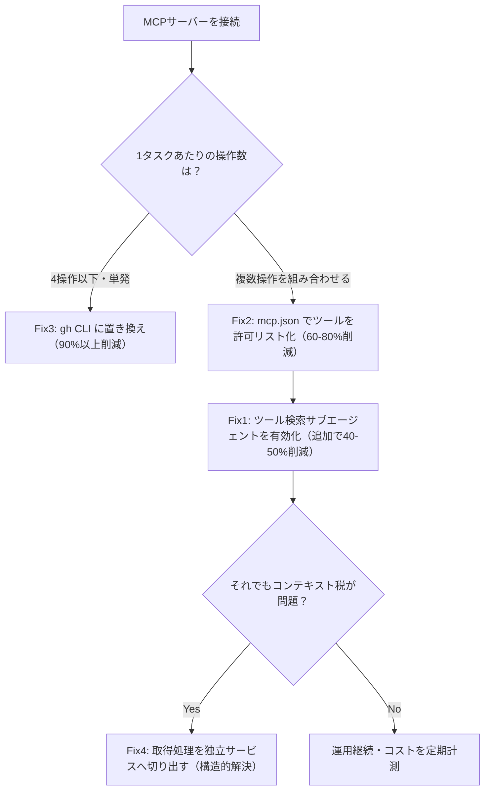
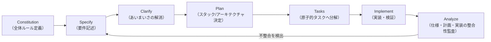

# Daily Briefing 2026-08-26

## 1. コーディングエージェント利用者のためのハーネスエンジニアリング（原題: Harness engineering for coding agent users）

- **URL**: https://martinfowler.com/articles/harness-engineering.html
- **公開日**: 2026-04-02
- **著者・媒体**: Birgitta Böckeler（Thoughtworks Distinguished Engineer, martinfowler.com）

### 本文翻訳
著者はコーディングエージェントを「Agent = Model + Harness」という等式で捉える。同じモデルでも、周囲に構築する「ハーネス」（人間が構築・運用できる外部の制御機構）次第で信頼性が大きく変わるという立場から、実務者が自分たちのプロジェクトで構築できるハーネスの設計論を展開する。

ハーネスを構成する規制メカニズムは、時間軸上で2種類に分かれる。**フィードフォワード（ガイド）**はエージェントが行動を起こす前に働きかけ、最初から良い結果が出る確率を上げるもの（CLAUDE.md のようなガイドドキュメント、アーキテクチャ規約、仕様書など）。**フィードバック（センサー）**はエージェントが行動した後にその結果を観察し、自己修正を促すもの（テスト、リンター、型チェッカー、AIコードレビューなど）である。両者は補完関係にあり、ガイドだけでは逸脱を防ぎきれず、センサーだけでは手戻りコストが高くなる。

センサーはさらに2つの型に分類される。**計算型（Computational）**は決定論的で高速・高信頼度な機構（テスト実行、静的解析、カバレッジ計測など）であり、**推論型（Inferential）**はセマンティックな判断を伴う分、遅く非決定論的な機構（AIによるコードレビュー、LLMジャッジなど）である。著者は「まず計算型で捕捉できるものを最大化し、推論型は計算型でカバーしきれない領域に限定投入すべき」という優先順位を示す。

ハーネスは変更のライフサイクル全体（コード作成前 → コミット前 → 統合前 → CIパイプライン → 本番環境）に段階的に配置される。上流ほど低コスト・高速な機構（LSP、ガイドドキュメント、基本的なリンター）を置き、下流に行くほど高コストで詳細な機構（ミューテーションテスト、詳細なレビュースキル、本番監視）を配置するという設計原則が示される。

さらに著者はハーネスが規制する対象を3カテゴリに整理する。**保守性ハーネス**（重複コード・循環的複雑度・テストカバレッジ不足など構造的問題を計算型センサーで検出する、最も成熟した領域）、**アーキテクチャ適性ハーネス**（性能要件や観測性の規約をガイド化し、フィットネス関数として機能させる）、**振る舞いハーネス**（仕様書をフィードフォワードとして与え、AI生成テストをフィードバックとするが、現状はまだ手動テストへの依存が大きく、最も未成熟な領域）である。

実例として、OpenAI社内チームがカスタムリンターと構造テストでレイヤードアーキテクチャを強制し、定期的な「ガベージコレクション」的レビューでドリフトを検出している例、Stripe がプッシュ前フックとヒューリスティックベースのリンター選別、「ブループリント」によるセンサーのエージェントワークフローへの統合を行っている例が紹介される。

著者は「harnessability（ハーネス構築可能性）」という概念も提示する。強い型付けの言語は型チェッカーというセンサーを既に持っている、明確なモジュール境界はアーキテクチャ制約ルールの設定を容易にする、といった具合に、技術選定そのものがハーネスの構築しやすさに直結する。人間の開発者にとっての暗黙のハーネスである「環境的アフォーダンス」（組織的な整合性の認識、慣習の内在化、技術的負債への感覚的な許容度判断）は、エージェントには備わっていないため、明示的なハーネスとして外部化する必要があると指摘する。

最後に、トポロジー（CRUD API サービス、イベント処理、ダッシュボードなど）ごとにガイドとセンサーをバンドル化した「ハーネステンプレート」を用意し、扱うシステムの多様性を人為的に絞り込む（アシュビーの法則の応用）ことで、包括的なハーネスを現実的なコストで構築できると結論づけている。

### 重要ポイント
- Agent = Model + Harness。ハーネスはガイド（事前・フィードフォワード）とセンサー（事後・フィードバック）の組み合わせで構成される
- センサーは計算型（決定論的・高速）を優先し、推論型（AIレビュー等）は計算型で拾えない領域に限定投入する
- ハーネスは変更ライフサイクル全体に段階配置し、下流ほど高コスト・高精度な検証を置く
- 保守性ハーネスが最も成熟、振る舞いハーネス（仕様とAI生成テストの組み合わせ）は最も未成熟な領域
- トポロジー別のハーネステンプレートを用意し多様性を絞り込むことで、現実的なコストで包括的な制御が可能になる

### 図解


### 現場での適用方法

**CLAUDE.md への追記例**（ハーネス設計方針をエージェント自身にも明示する）

```markdown
## ハーネス方針（このリポジトリでの規制メカニズム）

### フィードフォワード（作業前に必ず参照）
- アーキテクチャ規約: docs/architecture-guardrails.md
- API 変更時は先に specs/<feature>/spec.md を更新してから実装すること

### フィードバック（作業後に必ず通過）
- コミット前: `npm run lint && npm run typecheck`（計算型・低コスト）
- PR 作成前: `npm test -- --coverage`（計算型・中コスト、カバレッジ80%未満は差し戻し）
- 大きな設計変更を伴う PR は `/code-review --level high` を実行し推論型センサーを通す

### ドリフト検知
- 依存関係の脆弱性スキャンと循環的複雑度チェックは CI で毎回実行される。
  警告が出た場合は無視せず、原因のリファクタリングか issue 化のどちらかを行うこと。
```

**運用手順**（既存プロジェクトへの段階導入）

```bash
# 1. まず計算型センサーの棚卸し（既にある lint/test/typecheck を列挙）
grep -r "\"scripts\"" -A 20 package.json

# 2. コミット前フックとして最低限のセンサーを固定化
cat > .husky/pre-commit <<'EOF'
#!/bin/sh
npm run lint && npm run typecheck
EOF
chmod +x .husky/pre-commit

# 3. PRテンプレートに「参照した仕様書」「実行したセンサー」の記入欄を追加し、
#    ガイドとセンサーの適用状況を可視化する
```

### 期待効果
記事は定量的なベンチマークよりも枠組みの提示に重点を置いているが、OpenAI・Stripe の事例では、計算型センサーの多層配置と定期的なドリフト検知の運用により、エージェントの自律稼働率を上げつつ品質劣化を早期に検出できているとされる。ガイドとセンサーを両輪で整備することで、人間のレビュー負荷を構造的問題（保守性）から設計判断（振る舞い・アーキテクチャ）へとシフトできる。

### 注意点
- 振る舞いハーネス（仕様とテストで正しさを保証する領域）はまだ未成熟であり、現状は人間のレビューに依存せざるを得ない部分が残る
- 推論型センサー（AIレビュー等）は非決定論的なため、計算型で代替できる箇所まで推論型に頼ると検証コストと不安定性が増す
- ハーネステンプレートはトポロジーを絞り込むことが前提であり、扱うシステムが多様すぎる組織ではテンプレート自体の保守コストが増大する

---

## 2. GitHub MCP のトークンコスト解剖：42,000トークンの「コンテキスト税」と4つの削減策（原題: GitHub MCP Token Cost: A 2026 Autopsy and 4 Fixes）

- **URL**: https://getunblocked.com/blog/github-mcp-token-cost/
- **公開日**: 2026-05-15
- **著者・媒体**: Dennis Pilarinos（getunblocked.com Blog）

### 本文翻訳
著者はまず、GitHub公式 MCP サーバーを何も考えずに接続すると、作業を始める前から約42,000〜55,000トークン（200Kコンテキストウィンドウの21%以上）を消費してしまうという実測結果を提示する。原因は93個ものツール定義がすべて JSON スキーマとしてシステムプロンプトに事前ロードされることにある。記事はこのコストを「コンテキスト税」と呼び、内訳を機能領域別に分解する：リポジトリ操作が約10,000トークン、プルリクエスト操作が約9,000トークン、イシュー操作が約7,000トークン、ワークフロー/Actions関連が約6,000トークン、コード検索・ファイル操作が約5,000トークン、ユーザー/組織/チーム操作が約3,000トークン、その他が約2,000トークンという構成である。この税は、その回答にツールが一切関係しない質問に対しても、会話のたびに同じだけ課金され続ける点が問題だと強調する。

これに対し著者は、効果の実測値付きで4つの改善策を効果順・実施難易度順に提示する。

**Fix 1: ツール検索サブエージェント**は、ツール定義を最初から全部プロンプトに詰め込むのではなく、必要になった時点で検索・ロードする仕組みで、Joe Njenga による実測では51,000トークンから8,500トークンへと46.9%の削減効果があったとされる。設定変更のみで導入できるため難易度は「低」。

**Fix 2: MCP ツールの許可リスト（allowlist）化**は、`mcp.json` の該当サーバー設定に実際に使うツール名だけを列挙する方式で、スキーマオーバーヘッドの60〜80%を削減できる。難易度は「中」（設定ファイルの編集が必要）。

**Fix 3: GitHub CLI への代替**は、単発の操作であれば MCP 経由よりも `gh` CLI 呼び出しの方がスキーマの事前ロードが一切不要なため90%以上の削減になるという比較で、月間1万操作でのコスト比較では CLI が3.20ドル、MCP が55.20ドルという試算を示す。ただし複数操作を組み合わせる複雑なワークフローには不向きで、著者は「4操作以下の単一処理」を分岐点の目安としている。

**Fix 4: オンデマンド取得コンテキストレイヤー**は、取得（フェッチ）処理をエージェントのツール呼び出しループそのものから切り離し、独立したサービスとして外部化するアーキテクチャ変更で、スキーマコストを構造的にゼロへ近づけられる。効果は状況依存だが最大の削減余地を持つ一方、実装難易度は「高」。

著者は推奨する導入順序として、まず Fix 1（ツール検索サブエージェント）と Fix 2（許可リスト化）を組み合わせることで90%以上の削減を狙い、次に Fix 3 を単一ワークフローに限定して検証し、最終的に構造的な解決策として Fix 4 を検討するという段階的アプローチを提案している。Fix 1 と Fix 2 は独立した仕組みであるため相乗的に効くとも述べている。

### 重要ポイント
- GitHub 公式 MCP サーバーは何も対策しないと約42,000〜55,000トークン（200Kウィンドウの21%以上）を毎回消費する
- 内訳はリポジトリ操作・PR操作・イシュー操作・Actions関連・検索/ファイル操作・ユーザー/組織操作の順にコストが大きい
- ツール検索サブエージェント（Fix 1）と許可リスト化（Fix 2）の組み合わせで90%以上の削減が可能
- 単発・少数操作（4操作以下）なら CLI 代替（Fix 3）の方が MCP よりコスト効率が良い
- 根本解決にはフェッチ処理をエージェントループから切り離す構造変更（Fix 4）が必要だが実装難易度は高い

### 図解


### 現場での適用方法

**設定ファイルの例**（`mcp.json` でのツール許可リスト化＝Fix 2）

```json
{
  "mcpServers": {
    "github": {
      "command": "npx",
      "args": ["-y", "@modelcontextprotocol/server-github"],
      "env": {
        "GITHUB_PERSONAL_ACCESS_TOKEN": "${GITHUB_TOKEN}"
      },
      "tools": [
        "get_repository",
        "list_pull_requests",
        "get_pull_request",
        "list_issues",
        "search_code"
      ]
    }
  }
}
```

**運用手順**（コスト計測 → 削減策の適用 → 効果検証）

```bash
# 1. 現状のコンテキスト税を計測する（Claude Code のコストエンドポイント等を利用）
#    導入前後でシステムプロンプトのトークン数を比較する
claude --print "test" --output-format json | jq '.usage'

# 2. 実際に使っているツールだけを洗い出す（過去ログから呼び出し実績を集計）
grep -o '"tool_name":"[a-z_]*"' ~/.claude/logs/*.jsonl | sort | uniq -c | sort -rn

# 3. 上記の結果を <REPO_PATH>/.mcp.json の "tools" 配列に反映し、
#    未使用ツールを除外する

# 4. 単発・少数操作のワークフローは gh CLI に置き換える
gh pr list --state open --limit 5
gh issue view 123 --json title,body,state
```

### 期待効果
記事の実測値では、ツール検索サブエージェント単体で46.9%（51,000→8,500トークン）、許可リスト化で60〜80%、両者の併用で90%以上のコンテキスト税削減が見込める。単発操作をCLIに置き換えた場合、月間1万操作規模の試算でコストが約17分の1（55.20ドル→3.20ドル）になるとされる。

### 注意点
- 許可リスト化は使うツールを事前に洗い出す運用コストが発生し、新機能追加のたびにリストの見直しが必要になる
- CLI代替は複数操作を組み合わせる複雑なワークフローでは構成が煩雑になり、かえって非効率になりうる（4操作以下が目安）
- Fix 4（取得層の分離）はアーキテクチャ変更を伴うため、既存のエージェント実装への影響範囲を事前に精査する必要がある

---

## 3. スペック駆動開発（SDD）実践ガイド：仕様を真実のソースにする2026年の開発手法（原題: Spec-Driven Development in 2026: What It Is, the Tooling, and How Teams Actually Use It）

- **URL**: https://dev.to/krlz/spec-driven-development-in-2026-what-it-is-the-tooling-and-how-teams-actually-use-it-2fk2
- **公開日**: 2026-06-19
- **著者・媒体**: krlz（DEV Community）

### 本文翻訳
記事は、AIコーディングエージェントの時代において「仕様（spec）を真実のソースとし、コードは検証可能な生成物として扱う」というスペック駆動開発（SDD）の考え方を、あいまいなプロンプトから出力を垂れ流す「vibe coding」への対抗軸として提示する。AIエージェントはコードを書くのは得意でも、開発者が本当に意図したことを推測するのは苦手であるため、2026年にSDDが主流化したと説明する。

著者はSDDの成熟度を3段階に整理する。**Spec-First**（初期生成後は仕様とコードの乖離を許容する、プロトタイプ向け）、**Spec-Anchored**（仕様とコードをテストで同期させながら共進化させる、本番システムに推奨される水準）、**Spec-as-Source**（仕様のみを編集しコードは完全自動生成される、より未来志向の段階）である。

具体的なワークフローは7段階で構成される：**Constitution**（プロジェクト全体で常に真であるべきルールの定義）→ **Specify**（ビジネス要件の記述）→ **Clarify**（あいまいさをエージェントが実装前に発見し解消する）→ **Plan**（技術スタックやアーキテクチャの決定）→ **Tasks**（原子的な作業単位への分解）→ **Implement**（実装と検証）→ **Analyze**（仕様・計画・実装間の一貫性監査）。

仕様をAIが誤読しないように記述するための技法として、**EARS記法**（Easy Approach to Requirements Syntax）の5パターンが紹介される：`Ubiquitous`（The system SHALL [action]、常時成立する要件）、`Event-driven`（WHEN [condition] THE system SHALL [action]）、`State-driven`（WHILE [state] THE system SHALL [action]）、`Unwanted`（IF [error] THEN [response]、異常系の扱い）、`Optional`（WHERE [flag] THE system SHALL [action]、フラグ依存の挙動）。

記事はマジックリンク認証機能を例に、`spec.md`（「有効なメールアドレス送信時に15分間有効なリンクを送る」「リンクは1回しか使えず、2回目は HTTP 410 を返す」「未登録メールアドレスにはアカウント列挙攻撃を防ぐため HTTP 202 を返す」「トークンは平文保存せずハッシュ化する」といった要件をEARS記法で記述）、`plan.md`（Node 22 + Fastify、PostgreSQL 16、Redis というスタック選定、32バイトCSPRNG＋SHA-256ハッシュというトークン設計の決定）、`tasks.md`（マイグレーション、エンドポイント実装、契約テスト、レート制限実装という原子的タスクへの分解、各タスクに元の仕様の節番号を参照させる）という3ファイル構成の具体例を示す。

ツールの選定については、GitHub Spec Kit（ベンダーロックインを避けたい場合の参照実装）、AWS Kiro（サーバーレス指向）、Claude Code の cc-sdd（`/sdd:specify` などのスラッシュコマンドを搭載）、Cursor の Plan Mode（IDE統合重視）、OpenSpec（軽量・独立型）、Tessl（規制業界向け）を用途別に比較している。

実践上の推奨事項として、`.specify/memory/constitution.md` に「TypeScript strict mode を必須とする」といったユビキタスな宣言を最初に置くこと、`specs/NNN-feature-name/{spec.md, plan.md, tasks.md}` というディレクトリ構成を徹底すること、コミットメッセージに仕様への参照（例: `feat(auth): magic link refs specs/004-magic-link/spec.md`）を含めることを挙げている。

一方で著者は自己批判的な視点も併記する。Brandon Kindred の指摘として「SDDは契約による設計（Design by Contract）の再ブランド化に過ぎない」という懐疑論、Thoughtworks の立場として「実装コードこそが真実のソースであり仕様だけでは不十分」という反論を紹介し、間違った仕様を厳密に満たしても意味がない「偽りの自信」のリスクや、仕様が疑似コード化してしまい二重の工数がかかる過度な仕様化のリスクにも言及する。導入判断の目安として、AIコーディングアシスタントを使う・要件が複雑・複数人で保守する・規制対象システムであるケースでは価値が大きいが、使い捨てのプロトタイプや単独開発者の短期プロジェクト、要件が未確定な探索的開発ではスキップを推奨している。

### 重要ポイント
- SDDは「仕様が真実のソース、コードは検証可能な生成物」という原則に基づき、Spec-First / Spec-Anchored / Spec-as-Source の3段階の成熟度を持つ
- ワークフローは Constitution → Specify → Clarify → Plan → Tasks → Implement → Analyze の7段階
- EARS記法（Ubiquitous / Event-driven / State-driven / Unwanted / Optional）で仕様のあいまいさを排除する
- `specs/NNN-feature-name/{spec.md, plan.md, tasks.md}` という3ファイル構成とコミットメッセージへの仕様参照が実務上の骨格
- 複雑な要件・複数保守者・規制対象システムでは効果が大きい一方、使い捨てプロトタイプや探索的開発には不向き

### 図解


### 現場での適用方法

**スキル化の例**（Claude Code のスキルとして SDD ワークフローを組み込む）

```markdown
---
name: spec-driven-feature
description: 新機能を追加する際、コーディング前に仕様(spec.md)・計画(plan.md)・タスク(tasks.md)を作成し、EARS記法で要件を明文化してから実装する。「新機能を追加して」「仕様から実装して」等の依頼で使用する。
---

# 手順
1. `specs/<連番>-<機能名>/spec.md` を作成し、EARS記法（SHALL / WHEN...THE system SHALL /
   WHILE...THE system SHALL / IF...THEN / WHERE...THE system SHALL）で要件を列挙する。
   あいまいな点はユーザーに確認してから記述する。
2. `plan.md` に技術スタック・データモデル・主要な設計判断を記述する。
3. `tasks.md` に原子的なタスクへ分解し、各タスクに spec.md の該当節番号を付記する。
4. tasks.md の順に実装する。各タスク完了時、対応する spec.md の要件を満たすテストを書く。
5. 実装完了後、spec.md / plan.md / tasks.md と実装コードの整合性を確認し、
   矛盾があれば報告する（Analyze フェーズ）。
6. コミットメッセージには `refs specs/<連番>-<機能名>/spec.md` を含める。
```

**運用手順**（既存リポジトリへの導入）

```bash
mkdir -p .specify/memory
cat > .specify/memory/constitution.md <<'EOF'
# プロジェクト憲法
- THE system SHALL use TypeScript strict mode
- THE system SHALL require contract tests for all public API endpoints
EOF

mkdir -p specs/001-example-feature
touch specs/001-example-feature/{spec.md,plan.md,tasks.md}
```

### 期待効果
記事は具体的な社内数値は示していないが、早期採用チームの報告として、非自明なタスクにおけるAIエージェントの一発成功率が3〜10倍向上したという結果を引用している。仕様に思考のレバレッジを集中させることで、実装フェーズでのAIとのやり取りの手戻りを減らせるとされる。

### 注意点
- 「契約による設計の再ブランド化」という批判があり、SDD自体が新規性のある銀の弾丸ではない点に留意
- 仕様が厳密であっても内容が間違っていれば、それを満たす実装も誤りである（偽りの自信のリスク）
- 仕様の記述が過度に詳細化すると疑似コード化し、仕様とコードの二重メンテナンスコストが発生する
- 使い捨てプロトタイプ・単独開発者の短期プロジェクト・要件未確定の探索的開発にはオーバーヘッドが見合わない
