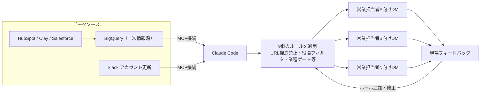
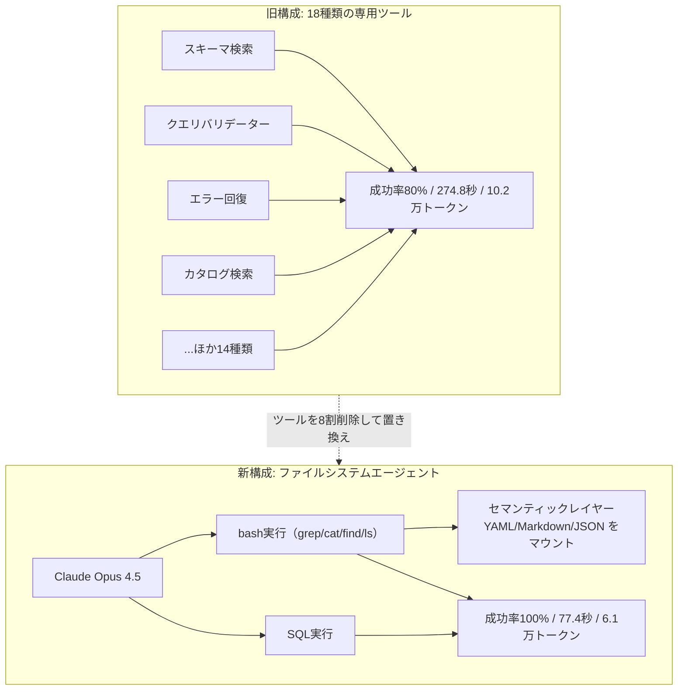
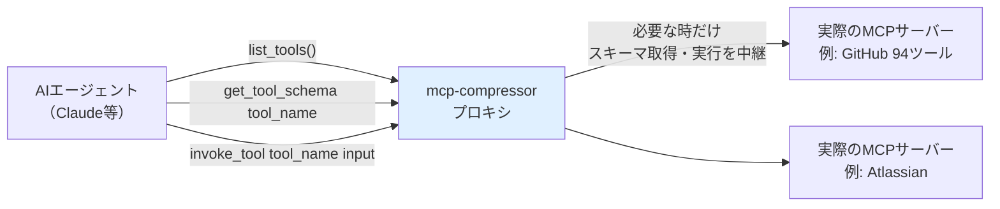

# Daily Briefing 2026-08-27

## 1. Anthropicのフィールドマーケターは、Claude Codeで営業担当者ごとの週次パーソナライズ通知をどう自動化したか（原題: How an Anthropic field marketer uses Claude Code to send weekly personalized updates to every sales rep）

- **URL**: https://claude.com/blog/how-an-anthropic-field-marketer-uses-claude-code-to-send-weekly-personalized-updates-to-every-sales-rep
- **公開日**: 2026-08-24
- **著者・媒体**: Adam Ward（Anthropic フィールドマーケティング担当）/ Claude by Anthropic 公式ブログ

### 本文翻訳
著者のAdam Wardは以前、日曜の夜にその週の営業向けスライドを手作業でまとめ、月曜朝のスタンドアップで全員に同じ内容を共有していた。しかし営業担当者は自分の担当アカウントに関係しないイベントや資料の情報を聞き流してしまい、有用な情報が埋もれていた。そこで彼はClaude Codeを使い、BigQueryを一次情報源としつつHubSpot・Clay・SalesforceのデータもBigQuery経由で統合し、SlackのアカウントアップデートとあわせてMCP（Model Context Protocol）でClaudeに接続する仕組みを構築した。Claudeは担当者ごとの担当テリトリー・アカウント一覧・コンタクトの役職・業種分類を突き合わせ、各営業担当者専用のSlack DMを毎週月曜に自動生成する。

最初のバージョンは1週間の試験運用後、ユーザーからのフィードバックをもとに9個の明確なルールへと磨き上げられた。代表的なものは「存在しないURLを絶対に作り出さない」「有効なURLがないイベントは記載自体を落とす」「コンタクトの役職とイベントの想定オーディエンスを照合してフィルタする」「業種ゲート（例：金融向けイベントには小売系アカウントを載せない）」「担当アカウントがまだない新任担当者には歓迎メッセージを出す」「元データのシート見出しが変わっても動的に読み取る」といった、実運用で起きた失敗一つひとつをルール化したものだ。メッセージ本文は「今週の優先アクション3件」「担当アカウントに関連するフィールドイベント」「登録済みのウェビナー参加者」「関連マーケティングコンテンツ」「フォローアップ提案」という固定フォーマットに統一されている。

10人規模の1チームでの試験導入後、BDR（新規開拓担当）、カスタマーサクセス、アライアンスなど複数の部門へ横展開された。プロンプト構造自体は変えず「フィールドを1つ変えるだけ」で別部門向けに転用できた点が特筆される。結果として、あるエグゼクティブ向けディナーの参加登録数は導入後1週間で倍増し、現在は承認プロセスなしで完全自動配信されており、送信履歴は監査証跡として保存される。著者が休暇中もシステムは問題なく稼働し続けた。著者は「深く理解している既存の手作業プロセスから始めること」「平易な言葉で指示を書き、変更履歴付きでドキュメントをバージョン管理すること」「小規模でコミットしたフィードバックグループから始めること」「ユーザーのフィードバックを都度、明示的なルールに変換していくこと」を成功要因として挙げている。

### 重要ポイント
- 既存の手作業プロセス（週次スライド作成）を出発点にすることで、要件が明確な状態でエージェント化を始められた
- MCP経由でBigQuery（+HubSpot/Clay/Salesforce/Slack）に接続し、担当者ごとの動的パーソナライズを実現
- ルールは一度に設計せず、実運用のフィードバックを都度ルール化して積み上げる方式（9ルールに収束）
- 「URLを捏造しない」「該当なしは表示しない」など、ハルシネーション対策のルールが具体的で再利用可能
- 同じプロンプト構造のまま1フィールド変更するだけで、他部門（BDR・CS・アライアンス）へ横展開できた

### 図解


### 現場での適用方法

**スキル化の例（SKILL.md）**: 「担当者ごとのパーソナライズ通知」を汎用スキルとして切り出す場合の骨子。

```markdown
---
name: personalized-digest-generator
description: 複数の担当者（営業・カスタマーサクセス等）向けに、共有データソースから
  担当範囲でフィルタしたパーソナライズ通知を生成する。週次レポート・ダイジェスト作成を
  依頼されたときに使用する。
---

# パーソナライズ通知ジェネレーター

## 手順
1. 一次情報源（例: BigQuery / スプレッドシート）から最新データを取得する
2. 担当者マスタ（担当テリトリー・アカウント・役職）と突き合わせる
3. 以下のガードレールを必ず適用する:
   - 出典データにないURL・固有名詞を生成しない
   - 必須フィールド（URL等）が欠落した項目は出力から除外する
   - 対象者の役職・業種と合致しない項目はフィルタする
   - 担当データが空の場合は専用の代替メッセージを出す
4. 固定フォーマット（優先アクション → 関連イベント → 関連コンタクト → 推奨フォローアップ）で
   担当者ごとに出力する
5. 送信前に1件サンプルをレビューし、フィードバックを本ファイルのガードレールに追記する
```

**運用手順（既存の手作業レポートをエージェント化する場合）**
```bash
# 1. 現在手作業でやっている週次レポートの「入力データ」「判断基準」「出力フォーマット」を書き出す
# 2. 入力データソースへMCP接続を用意する（例: BigQuery MCPサーバー）
# 3. 小規模なテストグループ（1チーム程度）に1週間試験配信する
# 4. フィードバックを都度「明示的なルール」としてSKILL.md/プロンプトに追記する
# 5. ルールが安定したら承認ステップを外し完全自動化、送信履歴を監査ログとして残す
```

### 期待効果
実例では、あるイベントの参加登録数が導入後1週間で倍増し、担当者の情報伝達漏れが解消された。手作業だった週次レポート作成（日曜夜の作業）がゼロになり、担当者拡大時も「1フィールドの変更」で複数部門へ展開できるため、横展開コストが極めて低い。

### 注意点
ハルシネーション対策のルール（URL捏造禁止、欠落データの除外）は事前に網羅できず、実運用のフィードバックを重ねて収束させる必要がある。完全自動化（承認プロセスなし）に踏み切るのは、ルールが十分に安定してからにすべきで、初期段階ではサンプルレビューを挟むこと。

## 2. エージェントのツールを8割削除したら性能が上がった話（原題: We removed 80% of our agent's tools）

- **URL**: https://vercel.com/blog/we-removed-80-percent-of-our-agents-tools
- **公開日**: 2025-12-22
- **著者・媒体**: Andrew Qu / Vercel Engineering Blog

### 本文翻訳
Vercelは社内の自然言語→SQL変換エージェント「d0」を開発する過程で、当初はスキーマ検索ツール・クエリバリデーター・エラー回復ツール・カタログ検索・意図確認ツール・構文検証・複数の専用実行ツールなど、合計18種類の専用ツールを備えた複雑な構成を採用していた。これは重いプロンプトエンジニアリングと事前フィルタ済みコンテキスト、制約されまくった推論経路によって成り立っており、著者らの言葉を借りれば「モデルの代わりに人間が考えてやっていた」状態だった。エッジケースが出るたびにパッチを重ね、モデルを更新するたびに制約の再調整が必要になるという保守負担が積み上がっていった。それでも成功率は80%（5件中4件成功）にとどまっていた。

そこでチームは大胆な簡素化に踏み切る。ツールを実質的に「バッシュコマンド実行」（Vercel Sandbox経由）と「SQL実行」の2つだけに絞り、Cubeのセマンティックレイヤー（ディメンション定義・メジャー計算・結合関係を記述したYAML/Markdown/JSONファイル群）をそのままサンドボックスにマウントした。Claude Opus 4.5は、事前に要約・フィルタされた情報に頼るのではなく、grep・cat・find・lsといった標準的なUnixコマンドを使って自分自身でセマンティックレイヤーを探索できるようになった。技術スタックはAI SDK経由のClaude Opus 4.5、実行環境にVercel Sandbox、ルーティングにVercel Gateway、インターフェースはNext.js APIルート＋Slack Boltという構成である。

代表的な5クエリでベンチマークした結果は劇的だった。実行時間は274.8秒から77.4秒へと3.5倍高速化し、成功率は80%（5件中4件）から100%（5件中5件）に向上、トークン消費量は約10.2万から約6.1万へと37%削減、処理ステップ数も約12から約7へと42%減少した。旧アーキテクチャの最悪ケースでは724秒・14万5463トークンを消費した末に失敗していたクエリが、新方式では141秒・6万7483トークンで成功している。

著者らは「モデルを信頼していなかったから推論を制約していた」という姿勢そのものが、モデルが賢くなるほど裏目に出ると指摘する。もう一つの重要な教訓は、成功の前提条件がドキュメントの品質にあるという点だ。セマンティックレイヤーの命名やディレクトリ構造が整理されていなければ、生のファイルアクセスは単に「質の悪い結果への到達を速める」だけになる。設計思想として掲げられているのが「引き算による改善（addition by subtraction）」であり、ツールを1つ追加するたびにそれはモデルに代わって下した「選択」であり、モデル自身がより優れた解決策を見つける可能性を狭めているかもしれない、という考え方だ。さらに「今のモデルではなく、半年後のモデルのために設計する」ことで、モデルが進化するたびに技術的負債化する過剰な足場を避けられるとしている。著者らは、まず「モデル＋ファイルシステム＋目的」という最小構成から始め、複雑さは本当に必要になったときにだけ足すべきであり、ツールの巧妙さよりもドキュメントの品質・命名の一貫性・データ構造の明快さへの投資の方が重要だと結論づけている。

### 重要ポイント
- 18種類の専用ツール（スキーマ検索・バリデーター等）を廃止し、バッシュ実行＋SQL実行の2ツールに集約
- セマンティックレイヤーのファイル群を直接マウントし、grep/cat/find/lsで自己探索させる設計
- 実行時間3.5倍高速化、成功率80%→100%、トークン消費37%減、ステップ数42%減という具体的な改善数値
- 「モデルの代わりに考える」設計は、モデルが賢くなるほど性能の足かせになる
- 成功の前提はツールの巧妙さではなく、ドキュメント（命名・構造）の品質にある

### 図解


### 現場での適用方法

**CLAUDE.md への追記例**（新規ツール追加を検討する際のガードレールとして）

```markdown
## ツール設計方針（ツール最小主義）

新しいカスタムツール（MCPツール・関数ツール等）を追加する前に、以下を必ず確認する。

1. 「このツールは本当にモデルの代わりに判断をしているだけではないか？」を自問する。
   単なる情報整形・要約であれば、生データへの直接アクセス（ファイル読み取り・grep等）で
   代替できないか検討する。
2. 既存のドキュメント（スキーマ定義・設定ファイル等）が十分に整理されているなら、
   専用の「検索ツール」を作る前に、まずファイルシステムへの直接アクセスを試す。
3. ツールを追加する場合は、それが解決する具体的な失敗事例（再現手順つき）を
   PRの説明に必ず記載する。「念のため」の追加は却下する。
4. モデルを更新した際は、既存ツール群のうち「もう不要になった制約」がないか棚卸しする。
```

**運用手順（既存の多ツール構成を見直す場合）**
```bash
# 1. 現状のツール一覧と、各ツールが解決している問題を棚卸しする
# 2. 「情報を要約・整形しているだけ」のツールを洗い出す
# 3. 対象データ（スキーマ・設定等）をサンドボックス環境にファイルとしてマウントし、
#    bash実行ツール1つに置き換えて代表的なタスクでA/B比較する
# 4. 成功率・トークン消費量・所要時間を旧構成と比較して定量的に判断する
# 5. 置き換え後も失敗するケースがあれば、まずドキュメント（命名・構造）を改善してから
#    ツール追加を検討する
```

### 期待効果
記事内の実測値として、実行時間3.5倍高速化、成功率80%→100%、トークン消費37%減、処理ステップ42%減が報告されている。ツールの保守コスト（エッジケースごとのパッチ、モデル更新のたびの再調整）も構造的に減少する。

### 注意点
この手法が機能する前提は「土台となるドキュメント・データ構造がすでに整理されていること」である。命名が乱雑でスキーマがドキュメント化されていない環境では、生アクセスを与えても悪い結果への到達が速まるだけになりかねない。また記事はClaude Opus 4.5クラスの高性能モデルを前提としており、より小型・非力なモデルでは専用ツールによる制約が依然有効な場合がある点にも留意が必要。

## 3. MCPのツール肥大化を70〜97%圧縮する mcp-compressor（原題: MCP compression: Preventing tool bloat in AI agents）

- **URL**: https://www.atlassian.com/blog/developer/mcp-compression-preventing-tool-bloat-in-ai-agents/
- **公開日**: 2026-03-29
- **著者・媒体**: Tim Esler（Atlassian, Senior Principal Machine Learning Engineer）/ Atlassian Developer Blog

### 本文翻訳
複数のMCP（Model Context Protocol）サーバーをエージェントに接続すると、実際の作業が始まる前からツール定義（スキーマ・説明文）だけで大量のコンテキストトークンが消費される「ツールブロート」が発生する。記事によれば、Atlassian自社のMCPサーバーだけで約1万トークン、GitHubのMCPサーバーは94種類のツールで約1万7600トークンを消費し、複数サーバーを組み合わせると3万トークンを超えることも珍しくない。これはプロンプト予算の大部分を、問題解決が始まる前に食いつぶすことを意味する。

Atlassianが公開したオープンソースツール「mcp-compressor」は、全ツールのスキーマを最初から丸ごと提示するのではなく、3つの汎用ラッパーツールに置き換えるアプローチをとる。`get_tool_schema(tool_name)` は特定ツールの詳細なドキュメントをオンデマンドで取得し、`invoke_tool(tool_name, tool_input)` は構造化された入力でツールを実行し、`list_tools()`（最も積極的な圧縮レベルでのみ使用）は利用可能なツール一覧を列挙する。

圧縮の強度は4段階の詳細度設定で調整でき、GitHubの94ツールを例にすると、圧縮なし（ベースライン）で1万7600トークンだったものが、`full`（完全な説明文、圧縮度は最も低いが発見しやすさは最大）で3900トークン、`brief`（1行の説明文、バランス型）で3300トークン、`minimal`（ツール名と引数名のみ、積極的な圧縮）で2200トークン、`none`（ツール一覧を埋め込まず `list_tools()` を明示的に呼ばせる、最大圧縮）で500トークンまで下げられる。設定例として、以下のようなMCPサーバー設定でGitHubのMCPサーバーをラップできる。

導入は既存のMCPサーバー設定に `mcp-compressor` コマンドを挟むだけで完結し、生成されるツール名には `mcp__atlassian__*` のような一貫したプレフィックスが付くため名前空間の衝突を避けられる。ラッパーのインターフェース自体は安定しているため、プロンプトキャッシュの効率も向上する。検証では、ツール圧縮によるエンドツーエンドの品質への影響は「ほぼ皆無」だったと報告されており、モデルは全スキーマを常に必要としているわけではなく、必要なときに確実にアクセスできればよい、という結論が導かれている。Atlassianはこの圧縮機構を自社のRovo Dev のランタイムに直接組み込んでいる。記事の最後では、AnthropicのTool Search ToolやCloudflareのCode Modeなど「使わないツール定義を読み込まない」という同じ発想の別アプローチも紹介されており、mcp-compressorによるスキーマ圧縮とコード実行型アプローチは競合ではなく補完関係にあるとしている。

### 重要ポイント
- 複数MCPサーバーの接続だけで3万トークン超を消費しうる「ツールブロート」が実務上の課題
- `get_tool_schema` / `invoke_tool` / `list_tools()` という3つの汎用ツールに置き換えることで70〜97%圧縮
- 詳細度設定（full / brief / minimal / none）で圧縮の強度を柔軟に選べる
- 圧縮によるエンドツーエンドの品質劣化は「ほぼ皆無」という検証結果
- 名前空間プレフィックスとラッパーの安定インターフェースにより、プロンプトキャッシュ効率も向上する

### 図解


### 現場での適用方法

**運用手順（既存のMCPサーバー構成をmcp-compressorでラップする）**

```bash
# 1. 現状、各MCPサーバーが消費しているトークン量を確認する
#    （Claude Code の /context コマンド等でツール定義の占有量を確認）

# 2. 既存の mcpServers 設定を mcp-compressor 経由に置き換える
#    <MCP_SERVER_URL> と <SERVER_NAME> は対象サーバーに合わせて置き換える
```

```json
{
  "mcpServers": {
    "<SERVER_NAME>": {
      "command": "uvx",
      "args": [
        "mcp-compressor",
        "<MCP_SERVER_URL>",
        "--server-name",
        "<SERVER_NAME>",
        "--verbosity",
        "brief"
      ]
    }
  }
}
```

```bash
# 3. まずは verbosity=brief（バランス型）から試し、
#    ツール呼び出しの成功率が落ちていないかを既存タスクで確認する
# 4. 問題なければ minimal / none まで段階的に強めてトークン消費量を最小化する
# 5. 複数MCPサーバーを併用している場合は、全サーバーを個別にラップし、
#    サーバーごとに --server-name でプレフィックスを分けて名前空間衝突を防ぐ
```

### 期待効果
GitHubの94ツールの例では、ベースライン1万7600トークンに対し、`brief` 設定で3300トークン（約81%削減）、最大圧縮の `none` 設定で500トークン（約97%削減）まで抑えられる。複数MCPサーバーを常用する開発環境では、これだけでコンテキストウィンドウの実質的な空き容量が大幅に増える。

### 注意点
圧縮を強めるほど（`minimal`/`none`）、モデルがツールの存在自体に気づきにくくなり、タスクによっては本来使うべきツールを呼び出さないリスクが増える。まずは `brief` 程度から始め、自社のタスクセットで成功率を計測しながら段階的に強度を上げることが推奨される。また、ラッパー層を挟むことで呼び出しのレイテンシがわずかに増える点や、mcp-compressor自体のバージョン追随（アップストリームMCPサーバーの仕様変更への追従）が新たな運用コストになる点にも留意する。
