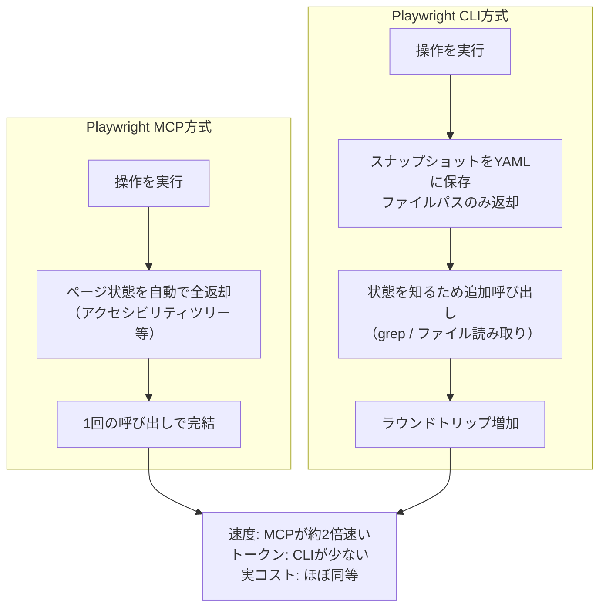
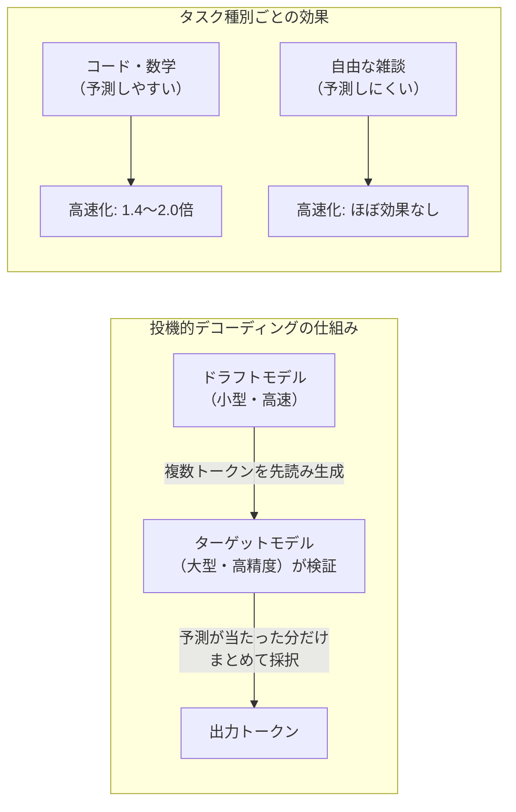
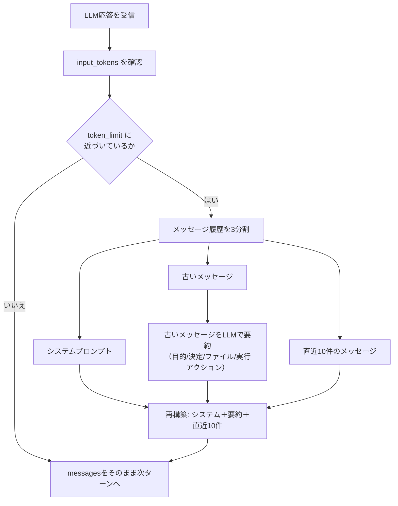

# Daily Briefing 2026-08-28

## 1. トークン削減の隠れたコスト：Playwright MCP対CLIの実測比較（原題: The Hidden Cost of Fewer Tokens）

- **URL**: https://outpost.ranger.net/post/the-hidden-cost-of-fewer-tokens/
- **公開日**: 2026-04-03
- **著者・媒体**: Mikayla Thompson / Outpost（Rangerエンジニアリングチーム）

### 本文翻訳
Rangerのエンジニアリングチームは、ブラウザ自動化エージェントのツールとして広く使われている「Playwright MCP」に対し、より新しい「Playwright CLI」を試すことにした。業界では「CLIの方がMCPより文脈（コンテキスト）効率に優れる」という主張が支配的だったが、著者は実際にこの仮説を検証した。比較対象にはVercelのオープンソースプロジェクト「agent-browser」も加え、Claude Sonnet 3.5を用いてMozillaのホームページ上で約10ステップの操作を行う2つのシナリオ（シナリオ1はすべて正しい検証、シナリオ2は2箇所に不正な検証を含む）でテストした。評価は単なる成否だけでなく、必要なページを訪問したか・スクリーンショットやDOMスナップショットを取得したか・検証基準を明示的に言及したかというルーブリック基準でも行った。

結果は直感に反するものだった。3ツールともほぼ完璧な精度でタスクを完遂した一方、速度面ではMCPが圧倒的に優れていた。MCPのセッションはシナリオ1で平均約90秒、シナリオ2で約120秒だったのに対し、CLIは240〜304秒、agent-browserも179〜369秒を要した。最も速いCLI実行でさえ、最も遅いMCP実行より遅かったという。ツール呼び出し回数もMCPが14〜17回で済んだのに対し、CLIは40〜50回、agent-browserは29〜56回に達した。トークン消費量はMCPが5万〜7万、CLIが1万9000〜4万5000と、確かにCLIの方が少ない。しかし実際のコストで比較すると、シナリオ1ではMCPが15ターンで0.39ドル、CLIが42ターンで0.54ドルとなり、トークン効率の良さがそのままコスト優位につながっていなかった。

著者はこの結果の核心を「これはMCP対CLIというプロトコルの比較ではなく、特定のインターフェース設計選択の比較だ」と分析する。MCPは各操作後にアクセシビリティツリーなどページの完全な状態を自動的に返すため、トークンは多く使うが追加のツール呼び出しが不要になる。一方CLIはページのスナップショットをYAMLファイルへ保存し、ファイルパスだけを返す設計のため、エージェントは状況を理解するためにgrepやファイル読み取りといった追加ツール呼び出しを重ねる必要があり、これがラウンドトリップのオーバーヘッドとして跳ね返ってくる。さらにコスト構造を分解すると、出力トークンの単価差（MCP 0.04ドル対CLI 0.13ドル）や、プロンプトキャッシュの読み書きパターンの違い（MCPはキャッシュ読み取りで有利、CLIはキャッシュ書き込みで有利）が絡み合い、単純なトークン数の比較だけではコストを正しく予測できないことも分かった。著者は「プロトコルは単なる配管であり、重要なのはそのツールがエージェントのタスク完了をどれだけ助けるか、あるいは妨げるかだ」と結論づけ、今後はCLIの文脈効率とMCPの状態把握の速さを両立させる、状態を自動的に返す`click-and-see-state`のようなラッパーコマンドの検討を示唆している。

### 重要ポイント
- 「CLIの方が文脈効率が良い＝速くて安い」という直感は誤りで、MCPの方が約2倍高速だった
- トークン消費量の差は、実際の実行コスト（キャッシュ構造込み）の差にほぼ直結しなかった
- 速度差の原因はプロトコルではなく、「1回の呼び出しで状態を返すか、追加呼び出しを要求するか」というインターフェース設計にある
- 効果性（正確さ）だけでツールを選ぶのは不十分で、速度・トークン・実コストを分けて計測する必要がある
- 今後の改善案として、CLIの効率とMCPの即時状態返却を両立するラッパー設計が挙げられている

### 図解


### 現場での適用方法

**CLAUDE.md への追記例**（ツール選定・計測の指針として）

```markdown
## 外部ツール（MCP / CLI）選定の指針

新しいMCPサーバーやCLIラッパーをエージェントに組み込む際は、
「トークン消費量が少ない＝優れている」と即断しない。導入前に以下を計測する。

1. 代表的なタスクを3〜5件選び、候補ツールごとに実行時間・ツール呼び出し回数・
   トークン消費量（入力/出力/キャッシュ読み書き別）・実コストを個別に記録する
2. 「1回の呼び出しで必要な状態を返すツール」か「差分/参照のみを返し追加呼び出しを
   要求するツール」かを見極め、後者を採用する場合はラウンドトリップ増加による
   速度低下を許容できるか判断する
3. トークン数だけでなく実コスト（キャッシュ読み取り単価とキャッシュ書き込み単価の違い）
   を必ず併記して比較する
```

**運用手順（既存の自動化ツールをMCP/CLIどちらにするか比較検証する場合）**
```bash
# 1. 対象タスクの代表シナリオを2〜3種類定義する（正常系・異常系を含む）
# 2. 候補ツールごとに同一シナリオを複数回実行し、以下を記録する
#    - 完了までの時間（秒）
#    - ツール呼び出し回数
#    - 入力/出力/キャッシュ読み取り/キャッシュ書き込みトークン数
#    - 実際の課金コスト
# 3. トークン数が少ない候補でも、実コスト・速度で劣後していないか必ず確認する
# 4. 最終判断は「タスク完了に必要なラウンドトリップ数」を基準に行う
```

### 期待効果
記事内の実測値では、MCP方式はCLI方式に対し実行時間で約2倍高速（シナリオ1で90秒対240秒）だった一方、トークン消費量はCLIが最大で半分以下に抑えられている。実コストではシナリオ1でMCP 0.39ドル・CLI 0.54ドルと、トークン効率の良さが必ずしもコスト優位に直結しないことが定量的に示された。ツール選定の際にトークン数以外の指標も測ることで、体感速度やコストの誤算を防げる。

### 注意点
この結果はPlaywright MCP/CLIという特定の実装・特定のモデル（Claude Sonnet 3.5）・特定のタスク種別（ブラウザ操作）における計測であり、他のMCPサーバーやCLIツールにそのまま当てはまるとは限らない。プロンプトキャッシュの効き方はセッション構造や再利用パターンに強く依存するため、自社のワークロードで同様の計測を行わずに「MCPの方が常に速い」と一般化しないこと。

## 2. 投機的デコーディングは家庭用GPUで本当に効くのか：llama.cppの実測ベンチマーク（原題: llama.cpp Speculative Decoding: Does It Work on Cheap GPUs?）

- **URL**: https://inventivehq.com/blog/llama-cpp-speculative-decoding-consumer-gpu
- **公開日**: 2026-06-25
- **著者・媒体**: InventiveHQ Team / InventiveHQ Lab

### 本文翻訳
NVIDIAは2026年6月、投機的デコーディング（speculative decoding）を用いてDGX B300を8台束ねたデータセンター構成で「最大15倍のスループット向上」を達成したと発表した。しかしこれはバッチ処理で多数のユーザーに同時応答するラック規模の話であり、単一GPUでローカルにモデルを動かす一般的なユーザーの環境とは条件が大きく異なる。InventiveHQのチームは、この技術が実際に家庭用GPUで意味のある効果を持つのかを検証するため、3種類のハードウェア（新型のRTX 5060 Ti・約570ドル、8年落ちのGTX 1080 Ti、GPUなしのCPU単体構成）でベンチマークを行った。

検証条件は厳密に標準化されている。単一GPU、4096トークンのコンテキスト長、貪欲デコーディング（greedy decoding）、プロンプトあたり256トークン生成、そしてコード・数学・推論・要約・雑談の5カテゴリからなる12種類のプロンプトのベンチマークスイートを使用した。ターゲットモデルにはQwen2.5-Coder-7B-Instruct（Q4_K_S量子化、約4.3GB）、ドラフトモデルにはQwen2.5-Coder-0.5B-Instruct（Q8_0量子化、約0.5GB）を採用し、llama.cppのCUDA/Vulkanビルドで動作させた。

結果は直感に反するものだった。RTX 5060 Tiで14Bモデルを使った場合、数学タスクで最大1.85倍の高速化が得られた一方、同じGPUで7Bモデルを使うとCUDA上ではむしろ0.27倍まで性能が低下した。著者らはこれを「投機的デコーディングにはサイクルごとのオーバーヘッドが存在する。すでに高速な7Bモデルではこのオーバーヘッドが利益を上回りCUDA上で負けた（0.27倍）が、より低速な14BモデルではCUDA上で勝った（1.4倍）」と説明する。8年落ちのGTX 1080 Tiでも数学タスクで最大1.16倍、GPUなしのCPU単体構成（3Bモデル使用）でも数学タスクで最大2.03倍の高速化が確認された。一方で、オープンエンドな雑談タスクでは利益がほぼ消失した。著者らは「テキストの予測しやすさが高いほど、効果は大きくなる」と述べており、コードや数学のように構造が明確なタスクではドラフトモデルの予測（採択率）が当たりやすく、投機的デコーディングが効果を発揮しやすい一方、自由な会話では予測が外れやすく恩恵が薄いためだと分析している。

追加のドラフトモデルを用意せずに使える「Nグラムベース」の投機的デコーディング手法についても言及されており、これは追加モデルのダウンロード・管理が不要な「安全な既定選択肢」として推奨されている。設定例として、`llama-server`にターゲットモデルとドラフトモデルを指定し、`--spec-type draft-simple --spec-draft-n-max 5`のようなフラグで投機的デコーディングを有効化する具体的なコマンドが示されている。結論として、NVIDIAが謳う「15倍」は多数ユーザー向けのバッチサービングという特殊な条件下の数字であり、単一ユーザーがコンシューマGPUで得られる現実的な高速化は「1.4〜1.85倍程度」であるとまとめている。著者らはGitHub上でベンチマークスイートを公開しており、多様なコンシューマGPU構成での実測データをコミュニティから募っている。

### 重要ポイント
- NVIDIAの「15倍」はデータセンターのバッチサービング向けの数字で、単一ユーザーのローカル環境には当てはまらない
- コンシューマGPU（RTX 5060 Ti等）での現実的な高速化は「1.4〜1.85倍程度」
- 効果はタスク依存：コード・数学など予測しやすいテキストで効果が大きく、雑談ではほぼ消失する
- ターゲットモデルがすでに高速（軽量）な場合、投機的デコーディングのオーバーヘッドが上回り逆に遅くなることがある
- 追加ドラフトモデル不要な「Nグラムベース」手法が、手間の少ない既定の選択肢として推奨される

### 図解


### 現場での適用方法

**運用手順（llama.cppでローカルコーディングモデルに投機的デコーディングを導入する）**

```bash
# 1. ターゲットモデル（実際に使いたい高精度モデル）と
#    同系統・小型のドラフトモデルを用意する
#    例: Qwen2.5-Coder-7B-Instruct（ターゲット）+ Qwen2.5-Coder-0.5B-Instruct（ドラフト）

# 2. llama-server を投機的デコーディング有効で起動する
llama-server -m <TARGET_MODEL_GGUF> \
  -md <DRAFT_MODEL_GGUF> \
  --spec-type draft-simple --spec-draft-n-max 5 -ngl 999

# 3. 自分のよく使うタスク種別（コード生成/雑談/要約など）ごとに
#    投機的デコーディングON/OFFでtokens/secを比較する

# 4. 小型モデル（7B以下）を使っていて効果が出ない、または悪化する場合は
#    追加モデル不要な「Nグラムベース」手法（--spec-type draft-n-gram 等、
#    利用中のllama.cppバージョンのオプション名を要確認）を既定として試す

# 5. 数学・コードなど構造化タスク中心のワークロードでのみ、
#    ドラフトモデル併用型の投機的デコーディングを本採用する
```

### 期待効果
記事のベンチマークでは、コード・数学タスクにおいてRTX 5060 Ti（14Bモデル）で最大1.85倍、CPU単体（3Bモデル）でも最大2.03倍の高速化が確認された。8年落ちのGTX 1080 Tiでも1.16倍の改善が見られており、新しいGPUを買わずに手持ちの環境で生成速度を底上げできる可能性がある。

### 注意点
効果はタスクの予測しやすさに強く依存し、雑談や自由記述など予測が外れやすいタスクでは恩恵がほとんどない。また、すでに高速な小型ターゲットモデル（7B程度）を使っている場合、投機的デコーディングのオーバーヘッドが利益を上回り、かえって性能が低下するケース（記事では0.27倍）が確認されているため、導入前に自分のモデルサイズとタスク特性で必ず事前検証すること。

## 3. ゼロからコーディングエージェントを作る：長時間セッションのためのプロンプト圧縮実装（原題: Build a Coding Agent from Scratch: Prompt Compaction）

- **URL**: https://justacuriousengineer.substack.com/p/build-a-coding-agent-from-scratch-aac
- **公開日**: 2026-01-04
- **著者・媒体**: A Curious Engineer / Substack「ゼロからコーディングエージェントを構築する」シリーズ第5部

### 本文翻訳
著者は自作のコーディングエージェントを一から構築する連載の最終回として、長時間実行されるエージェントが必ず直面する「LLMの文脈ウィンドウ」という制約への対処法を解説する。エージェントが複雑なタスクに長時間取り組み続けると、会話履歴が積み重なって古いメッセージが押し出され、最初に立てた目標や、途中で下した重要な決定を「忘れてしまう」現象が起きる。これに対する著者の解決策が「プロンプト圧縮（prompt compaction）」であり、これは長時間の会話をLLMの文脈ウィンドウ内に収め続けるための技術で、古いメッセージを単純に切り捨てるのではなく、要約に凝縮する点が特徴だと説明する。

具体的な実装アルゴリズムは次の通りである。まずLLMからの応答を受け取るたびに、その応答に含まれるトークン使用量（`input_tokens`）を確認し、あらかじめ設定した上限に近づいているかを判定する。近づいていれば、会話履歴を「システムプロンプト」「古いメッセージ」「直近のメッセージ（最新10件）」の3つに分割する。次に「古いメッセージ」の部分だけをLLM自身に要約させ、その要約結果で置き換える。最後に「システムプロンプト＋要約＋直近10件のメッセージ」という形で会話履歴を再構築し、これを以降のやり取りの新しい土台とする。

要約を生成させる際のプロンプトには、単なる自由記述の要約ではなく、必ず含めるべき4つの要素を明示的に指示する：（1）ユーザーが達成しようとしている目的、（2）これまでに下された重要な決定、（3）言及されたファイルやリソース、（4）実際に実行されたアクション。これにより、要約が「読み物としての要約」ではなく、エージェントがタスクを継続するために必要な作業メモとして機能するよう設計されている。コード上の実装は、LLM呼び出しの直後に圧縮要否を判定する関数を挟み込む形で組み込まれる。

```python
response = await model.ainvoke(messages)
input_tokens = response.usage_metadata.get("input_tokens", 0)
messages = await compact_messages_if_needed(
    messages=messages,
    current_input_tokens=input_tokens,
    token_limit,
    recent_count=10
)
```

`compact_messages_if_needed`は、渡された`current_input_tokens`が`token_limit`に近づいている場合にのみ圧縮処理を実行し、そうでなければ元のメッセージリストをそのまま返す。圧縮後に得られる新しい`messages`が、次のLLM呼び出しの入力としてそのまま使われる。著者は、この仕組みによってエージェントは「記憶しておくべきことを覚えている状態」を保ったまま、文脈ウィンドウの制約を超えて長時間の会話を継続できるようになると結論づけている。

### 重要ポイント
- 文脈ウィンドウ超過対策として、古いメッセージを「切り捨て」ではなく「要約」で圧縮する
- 圧縮のトリガーはLLM応答の`input_tokens`を都度チェックする方式で、閾値に近づいた時だけ発火させる
- 会話を「システムプロンプト／古いメッセージ／直近N件」に3分割し、古い部分だけを要約対象にする
- 要約プロンプトに「目的・決定事項・ファイル/リソース・実行済みアクション」の4項目を明示的に指定することで、要約の質と再利用性を担保する
- 直近メッセージ（例: 10件）はそのまま残すことで、直前の文脈の解像度を落とさない

### 図解


### 現場での適用方法

**スキル化の例（SKILL.md）**: 自作エージェント・カスタムループにプロンプト圧縮を組み込む場合の骨子

```markdown
---
name: prompt-compaction
description: 長時間実行されるエージェントの会話が文脈ウィンドウの上限に近づいた際、
  古いメッセージを目的・決定事項・ファイル・実行アクションを保持した要約に置き換えて
  会話を継続させる。長時間セッション、マルチターンのタスクで文脈ウィンドウ超過が
  懸念される場合に使用する。
---

# プロンプト圧縮

## 手順
1. 各LLM応答後、入力トークン数を確認する
2. 設定した閾値（例: モデルの文脈ウィンドウの70〜80%）に近づいた場合のみ発火する
3. メッセージ履歴を「システムプロンプト」「古いメッセージ」「直近N件（例: 10件）」に分割する
4. 古いメッセージ部分のみを以下4項目を含む形でLLMに要約させる：
   - ユーザーの目的
   - これまでの重要な決定事項
   - 言及されたファイル・リソース
   - 実行済みのアクション
5. 「システムプロンプト＋要約＋直近N件」で会話履歴を再構築し、以降の入力とする
```

**スクリプト化の例（Python、圧縮判定関数の骨子）**

```python
async def compact_messages_if_needed(
    messages, current_input_tokens, token_limit, recent_count=10
):
    if current_input_tokens < token_limit * 0.8:  # 閾値は要調整
        return messages

    system_prompt = messages[0]
    recent = messages[-recent_count:]
    old_messages = messages[1:-recent_count]

    summary_prompt = (
        "以下の会話を要約してください。必ず次の4点を含めること: "
        "1) ユーザーの目的 2) これまでの重要な決定事項 "
        "3) 言及されたファイル・リソース 4) 実行済みのアクション。"
        "前置きなしで要約結果のみを出力すること。"
    )
    summary = await model.ainvoke(
        old_messages + [{"role": "user", "content": summary_prompt}]
    )

    return [system_prompt, {"role": "system", "content": summary.content}] + recent
```

### 期待効果
自作エージェント・カスタムオーケストレーションループを運用している場合、文脈ウィンドウ超過によるエージェントの「目標忘れ」「手戻り」を防ぎ、長時間・多ターンのタスクを打ち切らずに継続できるようになる。既製のエージェントフレームワーク（Claude Code等）を使う場合でも、独自のツール実行ループやサブエージェント管理を自前で書く際の圧縮ロジックの参考実装として使える。

### 注意点
要約は本質的に不可逆な圧縮であり、要約プロンプトの4項目に含まれない細かい情報（正確な数値や一時的な試行錯誤の経緯など）は失われる可能性がある。閾値の設定が緩すぎると圧縮が頻発してLLM呼び出しコストが増え、逆に厳しすぎると圧縮前に文脈ウィンドウを超過するリスクがあるため、自分のタスクの典型的なトークン消費ペースに合わせて閾値と`recent_count`を調整する必要がある。
