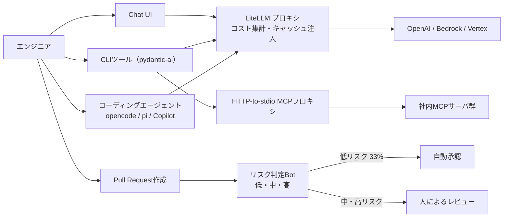
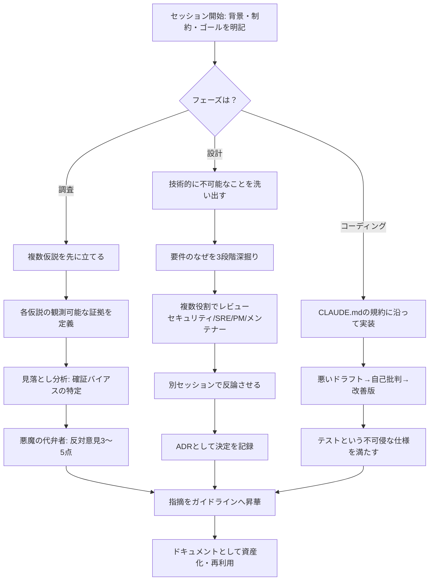
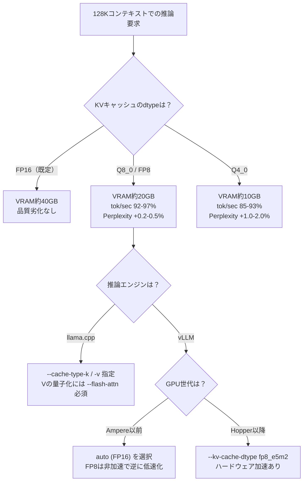

# Daily Briefing 2026-08-29

## 1. Zalando社におけるAgentic Engineeringの現在地（原題: Agentic Engineering at Zalando: a snapshot）

- **URL**: https://engineering.zalando.com/posts/2026/08/agentic-engineering-at-zalando-a-snapshot.html
- **公開日**: 2026-08-14
- **著者・媒体**: Bartosz Ocytko（Executive Principal Engineer）/ Zalando Engineering Blog

### 本文翻訳
Zalandoは2.5年にわたりAgentic Engineeringに取り組んできた。基盤は2024年1月に導入したLiteLLMベースのAPIプロキシで、OpenAI・AWS Bedrock・Google Vertexへの一元アクセスを提供する。post-callフックで匿名化されたコスト集計を行い、pre-callフックでUser-Agentヘッダを見てクライアントのバージョンアップを強制する。自動プロンプトキャッシュの注入や2万リクエストごとの再起動も組み込まれており、わずか6つの小型Pod（各2 CPUコア・4GBメモリ）で月間2,000人のアクティブユーザーを支えている。

APIプロキシに加え、オープンソースをフォークしたChat UIと、pydantic-aiで自作したCLIツールを提供する。CLIはMCP対応のエージェントモードを持ち、Bearerトークンを自動注入し、設定ファイルに秘密情報を書かずに社内MCPサーバへアクセスできるHTTP-to-stdioのMCPプロキシを内蔵する。これは利用者がエンジニア以外にも広がる中で重要なセキュリティ対策となった。

ツール選定は特定製品を強制せず、opencode・pi・GitHub Copilotなど複数のコーディングエージェント向けにリファレンス設定をgitリポジトリで配布し、各チームが好みで選べるようにしている。「モデルの好みも回答スタイルの好みに直結し、使い慣れたツールへの心理的な愛着が、技術的な障壁が低くても乗り換えをためらわせる」と指摘する。

コードメトリクスの変化も定量的に観測している。PRサイズは2年間で一貫して増加し、特にSonnet 4がリリースされた2025年第2四半期以降、500〜1k・1k〜2k文字のバケットが顕著に拡大した。4つのコードベース（新規Go・10年超のGo参照系・4年のJava・12年超のJava参照系）でサイクロマティック複雑度を追跡した結果、エージェント導入時点で複雑度が明確に上昇する変曲点が見られ、ゼロからエージェントのみで構築したコードベースは複雑度が急上昇した後に頭打ちになる傾向があった。コミットメッセージも5,000文字前後に肥大化する事例（ユニットテストのログ全体を含むケースも）があり、pre-commitフックでの制約が必要になった。

最も効果が出ているのがリスクベースPR自動承認botで、PR作成時にロールアウトリスクを低・中・高で評価する。結果として全PRの33%が低リスクとして自動承認され、PRリードタイムは全体平均比で20〜40%短縮した。ルールは過去のインシデント分析から技術スタック別に構築されており、設定ミスは高リスク、後方互換性の問題は中リスクに分類される。エンジニアは低リスク判定を得やすいように、後方互換の変更と破壊的な削除をPRごとに分離するといった行動変化も見せている。

社内ポータル「Sunrise」（Backstageベース）にAI専用のTech Radarセクションを設け、Dockerイメージスキャンによるモデル利用の自動検知とオーナーへのドキュメント作成・法務レビュー依頼のトリガーも整備した。知識共有は毎週1時間のLLM Guild（20分プレゼン×複数、録画あり）、10テーマ・2〜3日のハッカソン、20名規模のGenAI Lab、月次トレーニングなど多層的に運営している。トレーニングでは「手動でコーディングすべき場面を明示する」ことが重要と学んだ——参加者はしばしばコーディングエージェントを近道として使ってしまい、スキル習得を妨げるためだ。

社内ツールagentsviewとcodeburnによるセッションデータ分析では、プラン名やターミナルタイトル、アイドルセッションの再要約といった不要なトークン消費が発覚したほか、あるユーザー事例ではキャッシュヒット率が期待値80%超に対し30%未満に留まっていたことが判明し、専用パーサーでキャッシュ性能を診断する取り組みが生まれた。今後はリポジトリのAI対応度を測る「AI Readiness Scanner」や、kagentを用いた社内エージェント基盤、OAuth2委任チェーンやトークンボールティングを担うIdentity Brokerの構築を計画している。

### 重要ポイント
- LiteLLMプロキシ＋Chat UI＋CLIの3層構成で、6小型Podで月間2,000人を支える省リソース運用を実現
- リスクベースPR自動承認により33%のPRが自動承認、リードタイムを20〜40%短縮
- エージェント導入後にPRサイズとサイクロマティック複雑度が明確に増加する変曲点が観測された
- キャッシュヒット率30%未満という事例があり、セッションデータの可視化ツールが不可欠
- トレーニングでは「あえて手動コーディングを指示する場面」を明示し、スキル低下を防止

### 図解


### 現場での適用方法

**運用手順（社内AI活用の可視化基盤を段階導入する）**:
```bash
# 1. LLM呼び出しをプロキシ経由に統一し、コストとキャッシュ利用を可視化する
#    (LiteLLM を例に、既存の複数プロバイダ呼び出しを1エンドポイントに集約)
pip install litellm[proxy]
litellm --config litellm_config.yaml --port 4000

# litellm_config.yaml の骨子（プレースホルダは環境に応じて置換）
cat <<'EOF' > litellm_config.yaml
model_list:
  - model_name: default
    litellm_params:
      model: <PROVIDER_MODEL_NAME>
      api_key: <API_KEY_ENV_VAR>
litellm_settings:
  cache: true
  success_callback: ["<COST_TRACKING_WEBHOOK_URL>"]
EOF

# 2. セッションログからキャッシュヒット率を定期集計するスクリプト例
grep -o '"cache_read_input_tokens":[0-9]*' <SESSION_LOG_DIR>/*.jsonl \
  | awk -F: '{sum+=$2} END {print "cache_read_tokens:", sum}'
```

**CLAUDE.md への追記例（PRリスク分類の明文化）**:
```markdown
## PRの分割ルール（低リスク判定を得やすくするため）
- 後方互換性のある変更（新規追加・非破壊的リファクタ）と、
  破壊的変更（削除・スキーマ変更・設定ファイル変更）は
  必ず別々のPRに分ける
- 設定ファイル（*.yaml, *.env.example 等）の変更を含むPRは
  変更理由をPR本文の先頭に明記する
- 1PRあたりの差分は原則500行以内を目安にする
  （超える場合は分割案を提示してから着手する）
```

### 期待効果
記事では、リスクベースPR自動承認により全PRの33%が自動承認され、PRリードタイムが平均20〜40%短縮したと報告されている。また月間2,000人規模の利用を6つの小型Pod（各2 CPU・4GB）で支えられており、プロキシ集約によるインフラコストの抑制効果も大きい。

### 注意点
- エージェント活用が進むほどPRサイズとコード複雑度が増加する傾向があり、複雑度の変曲点を監視する仕組みが必要
- コミットメッセージにテストログ全体などが混入し肥大化するリスクがあり、pre-commitでの制約が必須
- キャッシュヒット率は放置すると30%未満まで劣化しうるため、可視化なしでのコスト最適化は困難
- トレーニングでは意図的に「手動コーディングを求める場面」を作らないと、基礎スキルが低下する

---

## 2. AIを「思考の鏡」として使う――確証バイアスを防ぐエージェント活用の実践ガイド（原題: 2026年6月版 AIエージェントを本当に使いこなすコツ ― 調査・設計・コーディング別 実践ガイド）

- **URL**: https://qiita.com/yun_bow/items/d35ddd7b41d9a9875f15
- **公開日**: 2026-06-15
- **著者・媒体**: yun_bow（株式会社パーク）/ Qiita

### 本文翻訳
筆者は「AIは高速な確証バイアス生成機になりやすい」と指摘する。ユーザーの意図に沿う回答を流暢に返すため、反証や異論が自然には出てこず、使い手が無自覚のまま自分の思い込みを補強してしまう。この記事はAIとの協働をClaude自身と共同執筆する形で書かれており、5つの根本原則を軸に調査・設計・コーディングの各フェーズで具体的な実践手法を提示する。

5原則は次の通り。(1) Yesmanにしない設計——反証・異論をプロンプト構造として意図的に組み込む。(2) モード明示——「これは記述なのか分析なのか反証なのか」を毎回指定し、AIの応答姿勢を固定する。(3) コンテキストエンジニアリング——プロンプトの巧拙よりも「何を渡すか」が結果を左右する。(4) 指摘の資産化——一度限りの気づきを消費せず、ガイドラインとして蓄積する。(5) 認知の転移——AIを使い込むこと自体が、自分の問いを立てる力を鍛える。

横断的な実践として、セッション冒頭に背景・制約・ゴールを明記するテンプレートを置くこと、「70%以上の確信がない箇所には[要確認]タグを付ける」と指示して不確実性を可視化すること、単純な点数評価ではなく「Aと比べて何が足りないか」という相対比較で深掘りすることを挙げる。

調査フェーズでは仮説先行型のプロセスを提案する。まず複数の仮説を先に立てさせ、それぞれについて観測可能な証拠を定義させ、手元のデータがどちらを支持するかを検証させる。さらに「この結論に含まれる確証バイアスを特定せよ」という見落とし分析プロンプトや、VCになりきって投資を断る理由を3〜5点挙げさせる「悪魔の代弁者」プロンプトを併用する。

設計フェーズでは制約先行型のプロセスを使う。最初に「技術的に不可能なこと」を洗い出させ、要件の「なぜ」を3段階掘り下げ、セキュリティ専門家・SRE・PM・メンテナーなど複数の役割を割り当ててレビューさせる。「6ヶ月後に引き継ぐ人の視点」で暗黙知を言語化させるプロンプトも有効とする。重要な運用ノウハウとして、ダメ出しセッションの直後に同一セッション内で反論させても弱い反論しか出ない（会話の流れに引きずられる）ため、別セッションを立てて反論させるべきだとしている。決定事項はADR（Architecture Decision Record）として都度記録する。

コーディングフェーズでは、CLAUDE.mdにエラーハンドリング規約など具体的な取り決めを構造化して書き込む例を示す。また「悪いコードドラフトを出させてから自己批判させ、改善版を書かせる」2段階プロセスや、テストを「不可侵な仕様書」として扱いテストを満たすまでコードを直させる方法、会話の粒度をコミット単位に統一し長い会話による情報の希釈を避けることを推奨する。AIによるレビュー指摘は都度消費せず、「この指摘を今後も再利用できる形でガイドライン化してください」という昇華プロンプトでドキュメントに変換していく。

最後に「今日からできる5つのアクション」として、セッション冒頭テンプレ導入（5分）、反証プロンプト試行（10分）、仮説駆動調査の適用（30分）、複数役割レビューの実施（30分）、直近の指摘1件のガイドライン化（20分）を挙げている。筆者はAIを「答え装置」ではなく「思考の鏡」として使うことで、自分自身の問いを構造化する能力そのものが磨かれると結んでいる。

### 重要ポイント
- AIは確証バイアスを増幅しやすいため、反証・異論を意図的にプロンプト構造へ組み込む必要がある
- 調査は仮説先行型（複数仮説→観測可能な証拠→検証）、設計は制約先行型（不可能なこと→要件の深掘り→複数役割レビュー）で進める
- ダメ出しへの反論は同一セッションでは弱くなるため、必ず別セッションで行う
- AIの指摘は一度消費せず、ガイドラインとして資産化し再利用する
- CLAUDE.mdにはエラーハンドリング規約などプロジェクト固有の取り決めを構造化して書く

### 図解


### 現場での適用方法

**CLAUDE.md への追記例（エラーハンドリング規約＋反証プロンプトの常設化）**:
```markdown
## エラーハンドリング規約
- Server Actionsは必ず ActionResult<T> 型を返す
- throw禁止。result.success === false で返す
- エラーコードは error-codes.ts の定数を使用する

## レビュー・分析タスクでの振る舞い
- 分析結果を出す際は、根拠となる確信度が70%未満の箇所に
  [要確認] タグを付けること
- 重要な結論を出した後は、必ず
  「この結論に含まれうる確証バイアスや見落としを3点挙げよ」
  を自己チェックとして実行してから提示すること
```

**スキル化の例（SKILL.md: 悪魔の代弁者レビュー）**:
```yaml
---
name: devils-advocate-review
description: 設計方針や技術選定の結論に対し、反対の立場から反証・懸念点を洗い出す。設計レビューやADR作成の前段で使う。
---
```
本文骨子:
1. 提示された結論・設計方針を要約する
2. 投資判断を断るVC、あるいは却下する立場のレビュアーになりきり、却下理由を3〜5点挙げる
3. 各懸念点について、現在の設計でどう対処されているか（対処されていないか）を明示する
4. 対処が不十分な懸念点のみを最終レポートとして返す

### 期待効果
記事内に定量的な効果測定値の記載はないが、著者は仮説駆動の調査・複数役割レビュー・別セッションでの反論といった手法により、AIが生成する結論の一面性を減らし、設計判断やレビューの質を底上げできると述べている。また指摘をガイドライン化し再利用することで、同じ指摘を繰り返し受ける手戻りを削減できるとしている。

### 注意点
- ダメ出しへの反論を同一セッション内で求めても、会話の流れに引きずられて弱い反論しかできない点に注意
- 反証プロンプトや複数役割レビューはトークン消費・セッション数を増やすため、重要な意思決定に絞って適用すべき
- テストを「不可侵な仕様書」として扱う運用は、テスト自体の品質が担保されていることが前提となる

---

## 3. 128KコンテキストでVRAMを半減させるローカルLLMのKVキャッシュ量子化実践ガイド（原題: ローカルLLM KV キャッシュ量子化ガイド 2026年版：llama.cpp / vLLM で KV Cache を Q4 / Q8 に落として VRAM と tok/sec はどう変わるか）

- **URL**: https://mypcrig.com/blog/local-llm-kv-cache-quantization-guide-2026/
- **公開日**: 2026-07-18
- **著者・媒体**: mypcrig ブログ

### 本文翻訳
長いコンテキストでローカルLLMを運用する際、VRAMを圧迫する主犯はモデル重みではなくKV（Key-Value）キャッシュである。記事はLlama 3.3 70Bを例に、128KコンテキストではFP16のKVキャッシュだけで約40GBが必要になると試算し、ほぼすべての実運用でKVキャッシュの量子化が事実上必須になると述べる。

要点は「Q8量子化によりVRAM使用量は半分になり、tok/secの低下は3〜8%、Perplexityの悪化は0.5%未満に収まる」という点で、量子化による品質劣化が非常に小さい一方でメモリ削減効果が大きい非対称なトレードオフになっていることを強調する。より積極的なQ4量子化ではVRAMはさらに減るがtok/secの低下が大きくなり、Perplexityの悪化も1〜2%まで拡大するため、用途に応じた選択が必要になる。

llama.cppでの実装は`--cache-type-k`と`--cache-type-v`オプションで指定する。重要な制約として、V側（Value）の量子化を有効にするには`--flash-attn`フラグが必須であり、これを付け忘れると量子化が機能しない、あるいはエラーになる点に注意が必要だとしている。

vLLMでは`--kv-cache-dtype`オプションでFP8形式（`fp8_e5m2`など）を指定する。ここで重要なのはGPU世代への依存で、Ampere世代（RTX 3090やA100など）にはFP8のハードウェアアクセラレーションが存在しないため、FP8指定はむしろ速度低下を招く。Ampere世代では素直に`auto`（実質FP16）を選ぶべきで、FP8の恩恵を受けられるのはHopper以降の世代になる。

実測ベンチマーク（Llama 3.3 70B）では、Q8_0で VRAM 20GB・tok/sec比92〜97%・Perplexity増加0.2〜0.5%、Q4_0で VRAM 10GB・tok/sec比85〜93%・Perplexity増加1.0〜2.0%という結果が示されている。記事はこの数値をもとに、長文コンテキストを扱う実運用ではQ8_0を既定値とし、VRAMがどうしても足りない場合にのみQ4_0への切り下げを検討する、という判断基準を提示している。

### 重要ポイント
- 長コンテキスト運用でVRAMを圧迫する主因はモデル重みではなくKVキャッシュ
- Q8量子化はVRAMを半減させつつtok/sec低下3〜8%・Perplexity悪化0.5%未満と非常に割の良いトレードオフ
- llama.cppでのV側量子化には`--flash-attn`フラグが必須
- vLLMのFP8 KVキャッシュはAmpere世代GPUでは非対応でむしろ低速化するため、GPU世代の確認が必要
- Q4量子化はVRAMをさらに削減できるが品質劣化が目立ち始めるため、まずQ8を既定にすべき

### 図解


### 現場での適用方法

**スクリプト化の例（GPU世代とVRAM残量に応じてKVキャッシュ設定を自動選択するラッパー）**:
```bash
#!/usr/bin/env bash
# launch-llm-server.sh
# 使い方: ./launch-llm-server.sh <MODEL_GGUF_PATH> <CONTEXT_LEN>
set -euo pipefail

MODEL_PATH="${1:?モデルパスを指定してください}"
CTX_LEN="${2:-32768}"

FREE_VRAM_MB=$(nvidia-smi --query-gpu=memory.free --format=csv,noheader,nounits | head -1)

if [ "$FREE_VRAM_MB" -lt 24000 ]; then
  echo "[info] VRAM不足のためQ4_0 KVキャッシュを使用します"
  CACHE_TYPE="q4_0"
else
  echo "[info] Q8_0 KVキャッシュを使用します（既定）"
  CACHE_TYPE="q8_0"
fi

exec ./llama-server -m "$MODEL_PATH" \
  --cache-type-k "$CACHE_TYPE" \
  --cache-type-v "$CACHE_TYPE" \
  --flash-attn \
  -c "$CTX_LEN"
```

**vLLM起動時のGPU世代チェック例**:
```bash
GPU_NAME=$(nvidia-smi --query-gpu=name --format=csv,noheader | head -1)

case "$GPU_NAME" in
  *"H100"*|*"H200"*|*"L40"*)
    KV_DTYPE="fp8_e5m2"
    ;;
  *)
    KV_DTYPE="auto"
    echo "[warn] このGPU世代ではFP8ハードウェア加速がないためautoを使用します"
    ;;
esac

vllm serve <MODEL_NAME> \
  --kv-cache-dtype "$KV_DTYPE" \
  --max-model-len 131072
```

### 期待効果
記事のベンチマーク値によれば、Q8_0量子化によりVRAM使用量を約半分に削減しつつ、tok/secの低下は3〜8%、Perplexityの悪化は0.5%未満に抑えられる。これにより、これまでVRAM不足で128Kコンテキストを扱えなかった24GB級GPU（RTX 3090/4090など）でも長文コンテキストの運用が現実的になる。

### 注意点
- llama.cppでV側キャッシュを量子化する場合は`--flash-attn`の付け忘れに注意（機能しない・エラーの原因になる）
- vLLMのFP8 KVキャッシュはAmpere世代以前のGPUではハードウェアアクセラレーションがなく、むしろ低速化するため必ずGPU世代を確認する
- Q4_0まで踏み込むとPerplexity悪化が1〜2%まで拡大するため、コード生成など精度が重要な用途ではQ8_0を上限の目安とする
- 数値はLlama 3.3 70Bでの実測値であり、モデルやアテンション実装によって結果は変動しうる
